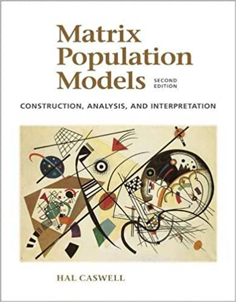
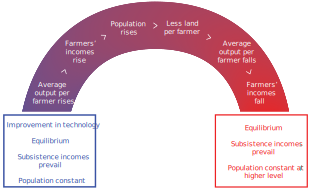
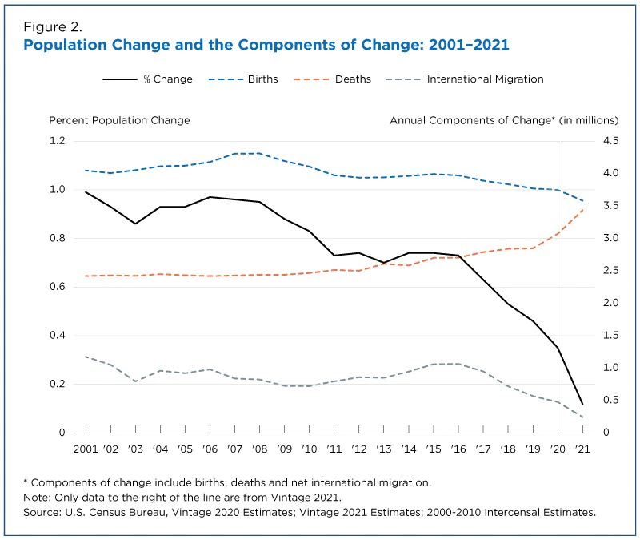
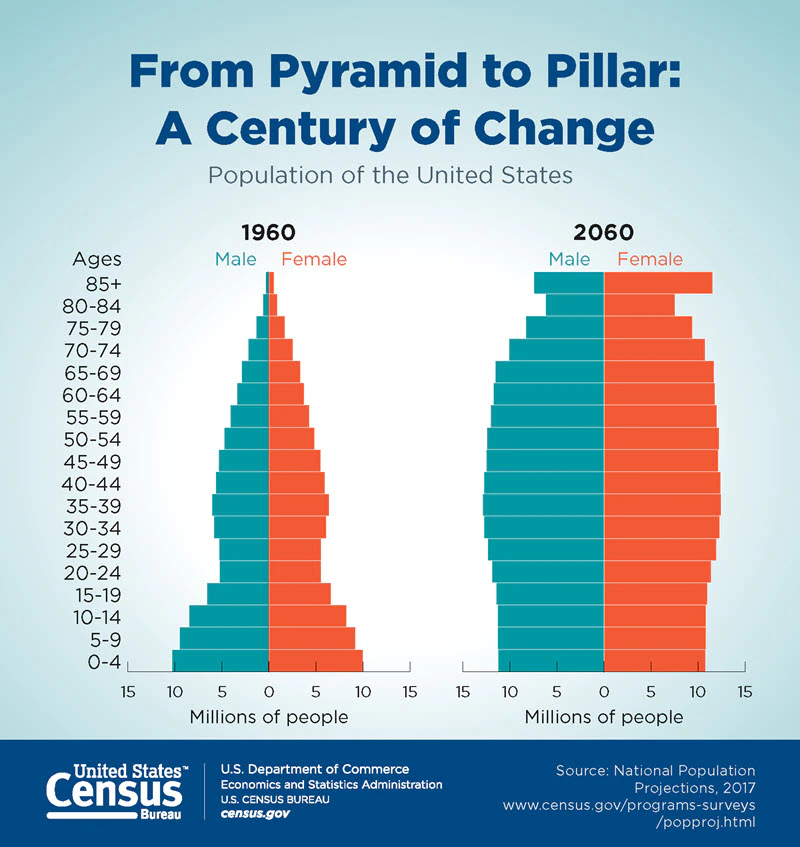
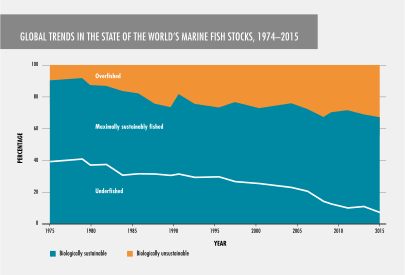

# Concepts and measures {#concepts-and-measures}

```{r setup, warning=FALSE, message=FALSE, echo=FALSE, results='hide'}
library(DT)
library(ggplot2)
library(keyring)
library(knitr)
library(lubridate)
library(magrittr)
library(plotly)
library(purrr)
library(readr)
library(rlang)
library(scales)
library(slickR)
library(stringr)
library(svglite)
library(tibble)
library(tidycensus)
library(tidyr)
library(timevis)
```

:::{.rmdnote}
## Learning objectives {.unnumbered}

* Learn what demography is and why it's important
* Know how to specify a population in demographic terms
* Apply the balancing equation and its main components to track change in population size over time
* Learn what person-periods are and how to approximate them
* Use occurrences, person-periods, and observations to construct demographic rates and probabilities
* Understand the differences between rates and probabilities
* Learn the relationships and differences between crude, instantaneous, and mean annualized growth rates
* Learn the differences between a period and a cohort, and their relation to rates and probabilities
:::

## What is demography and why is it important?

:::{.rmdnote}
### Definitions of demography {.unnumbered}

* "...the scientific study of human **populations** primarily with respect to their **size**, their **structure** and their **development**; it takes into account the quantitative aspects of their general characteristics. [@population_multilingual_1958]
* The study of human **populations** in relation to the **changes** brought about by the interplay of **births**, **deaths**, and **migration**. [@pressat1985dictionary]
* "...the study of of human **populations** -- their **size**, **composition** and **distribution** across **space** -- and the **process** through which populations **change**. [@suda_demography]

*Emphasis added.*
:::

**Discussion questions**

<details>
<summary>What are the "processes" that the Stockholm University Demographic Unit's definition drives at? **Tap for answer**</summary>
* **Birth:** Entering the population from the womb
* **Death:** Exiting the population because we're all mortal
* **Migration:** Physically moving in our out of the population's location
</details><br>

<details>
<summary>What are three basic dimensions along which these changes occur? **Tap for answer**</summary>
* **Time:** For example, you can track the number of deaths from year to year
* **Space:** You can track how a population moves its location over time, or how individuals move into our out of a local population over time.
* **Structure:** You can disaggregate a population into subpopulations. For example, by age, by race or ethnicity, by religion, by gender. This structure may change over time.
</details>
<br>

### Okay so what's a "population" then? {.unnumbered}

**For statistians:** A collection of items

**For demographers:**

1. A **collection of persons**...
1. who **meet certain criteria**
1. alive at a **specified point in time**...
<br><br>

<details>
<summary>Anything odd about point 1 above? **Tap for answer**</summary>
Non-human biologists do demography, too.

* Dr. Hal Caswell, Professor of Mathematical **Demography** at University of Amsterdam: https://www.uva.nl/en/profile/c/a/h.caswell/h.caswell.html
* Wrote influential book on matrix **population models** (aka... **demography**)

> "My research focuses on **population models**, usually based on matrices, for **plants, [non-human] animals, and humans**.  I am interested in stochastic processes in **demography**..."
>
> -- Hal Caswell (my emphasis)



</details>
<br>

<details>
<summary>Let's think of some examples. **Tap for answer**</summary>
* **Collection:** People...
* **Criteria:** living in King County, Washington...
* **Specified point in time:** on April 1, 2019

```{r king_acs1_totpop_05_19, echo=FALSE, warning=FALSE, message=FALSE, cache=TRUE}
get_king_acs1_totpop <- function(year) {
  tidycensus::get_acs(
    year = year,
    geography = "county",
    variables = "B01003_001",
    state = "Washington",
    county = "King County",
    survey = "acs1"
  )
}
years <- 2005:2019
king_acs1_totpop_05_19 <- years %>%
  purrr::map(function(y) get_king_acs1_totpop(y)$estimate) %>%
  as.numeric() %>%
  tibble::tibble(
    year = years,
    acs1_totpop_estimate = .
  )
king_acs1_totpop_05_19_endpoints <-king_acs1_totpop_05_19 %>%
  dplyr::filter(year %in% c(2005, 2019))
king_acs1_totpop_05_19_growth <- king_acs1_totpop_05_19_endpoints %>%
  dplyr::mutate(
    growth_14_year = (acs1_totpop_estimate
                      / dplyr::lag(acs1_totpop_estimate)) - 1) %>%
  dplyr::filter(!is.na(growth_14_year)) %>%
  dplyr::pull(growth_14_year) %>%
  scales::percent(., accuracy = 1L)
```

```{r king_acs1_totpop_19, echo=FALSE, warning=FALSE, message=FALSE}
king_acs1_totpop_19 <- king_acs1_totpop_05_19 %>%
  dplyr::filter(year == 2019) %>%
  dplyr::pull(acs1_totpop_estimate) %>%
  magrittr::divide_by(1000000) %>%
  round(1)
```

<center>**`r paste(king_acs1_totpop_19, "M people")`**^[1-year American Community Survey 2019 total population estimate]</center>
</details>
<br>

**Also for demographers:**

<center>_Population as an **enduring** collection of individuals_</center>

By "enduring", PHG mean those characteristics of a population that don't change.
<br>

<details>
<summary>Extending our Seattle metro example to "enduring" collections **Tap for answer**</summary>
Now we can see how the population changes, in this case over time...

King County population grew by `r king_acs1_totpop_05_19_growth` over 14 years.
```{r king_acs1_totpop_05_19_plot, echo=FALSE, warning=FALSE, message=FALSE, fig.alt="One-year ACS total population estimates - King County, WA (2005 - 2019)"}
plot_king_acs1_totpop_05_19 <- king_acs1_totpop_05_19 %>%
  ggplot2::ggplot(aes(x = year, y = acs1_totpop_estimate)) +
  ggplot2::geom_point() +
  ggplot2::geom_line() +
  ggplot2::geom_text(
    data = king_acs1_totpop_05_19_endpoints,
    aes(x = year + 0.6,
        label = acs1_totpop_estimate %>%
          scales::unit_format(unit = "M",
                              scale = 1e-6,
                              accuracy = 0.1,
                              sep = "")(.))
  ) +
  ggplot2::scale_x_continuous(breaks = years) +
  ggplot2::scale_y_continuous(
    labels = scales::label_number(suffix = "M", scale = 1e-6, accuracy = 0.1),
  ) +
  ggplot2::labs(
    title = "Total population - King County, WA (2005-2019)",
    subtitle = "1-year American Community Survey estimates"
  ) +
  ggplot2::xlab(NULL) +
  ggplot2::ylab(NULL) +
  ggplot2::theme_minimal() +
  ggplot2::theme(panel.grid.minor.x = element_blank())
plot_king_acs1_totpop_05_19
```

And here is a more interactive example from Italy made by [Eddie Hunsinger](https://www.linkedin.com/in/eddiehunsinger/): [https://shiny.demog.berkeley.edu/eddieh/lx_ndx_Italy/]{target="_blank"}, which we'll return to in week 3
</details>
<br>

## The balancing equation of population change

* Consider an observation period of length $T$
* For now, arbitrarily set the period's starting point at time $t = 0$

$\begin{align}
N(T) &= \textsf{ (Ending population size at time } T \textsf{)} \\
     &+ N(0) \textsf{ (Starting population size at time } 0 \textsf{)} \\
     &+ B[0,T] \textsf{ (Number of births from start to end)} \\
     &- D[0,T] \textsf{ (Number of deaths from start to end)} \\
     &+ I[0,T] \textsf{ (Number in-migrations from start to end)} \\
     &- O[0,T] \textsf{ (Number out-migrations from start to end)} \\
\end{align}$

<details>
<summary>Organized by ways to enter vs. exit a population... **Tap for answer**</summary>
$\begin{align}
N(T) &= N(0) \\
     &+ B[0,T] + I[0,T] \textsf{ (Ways to enter)} \\
     &- D[0,T] - O[0,T] \textsf{ (Ways to exit)}
\end{align}$
</details>
<br>

<details>
<summary>Organized by natural increase vs. net migration... **Tap for answer**</summary>
$\begin{align}
NI[0,T] &= B[0,T] - D[0,T] \textsf{ (Natural increase)} \\
NM[0,T] &= I[0,T] - O[0,T] \textsf{ (Net migration)}
\end{align}$
</details>
<br>

<details><summary>And putting it all together... **Tap for answer**</summary>
$N(T) = N[0] + NI[0,T] + NM[0,T]$
</details>
<br>

### Balancing equation as flows and stocks {.unnumbered}

* Boxes represent states that individuals in a population can be in
* Arrows represent a flow of individuals from one state to another

{width=100%}

### Balancing equation example: Sweden in 1988 {.unnumbered}

From PHG pg. 9 Box 1.2

```{r swedish_waterfall, echo=FALSE, warning=FALSE, message=FALSE}
measures <- c(
  "Starting population",
  "Births",
  "Deaths",
  "In-migrations",
  "Out-migrations",
  "Ending population"
)
notations <- c(
  "N(1988)",
  "B[1988,1989]",
  "D[1988,1989]",
  "I[1988,1989]",
  "O[1988,1989]",
  "N(1989)"
)
values <- c(8416599, 112080, -96756, 51092, -21461) %>%
  c(., sum(.)) %>%
  abs(.) %>%
  format(., big.mark = ",", trim = TRUE) %>%
  paste(c("", rep(c("+ ", "\u2013 "), 2), "= "), ., sep = "")
enters_exits = c(NA_character_, rep(c("Enters", "Exits"), 2), NA_character_)
ni_nm = c(
  NA_character_,
  "Positive impact on NI[0,T]",
  "Negative impact on NI[0,T]",
  "Positive impact on NM[0,T]",
  "Negative impact on NM[0,T]",
  NA_character_
)
swedish_waterfall <- tibble::tibble(
  measure = measures,
  notation = notations,
  value = values,
  enters_exits = enters_exits,
  ni_nm = ni_nm
)
DT::datatable(
  swedish_waterfall,
  options = list(ordering = FALSE, dom = "t"),
  rownames = FALSE,
  colnames = rep("", 5)
) %>%
  DT::formatStyle(columns = 1, fontWeight = "bold") %>%
  DT::formatStyle(
    columns = 2, fontStyle = "italic", fontFamily = "MathJax TeX"
  ) %>%
  DT::formatStyle(
    columns = 4,
    color = styleEqual(
      levels = c("Enters", "Exits"),
      values = c("skyblue", "orange")
    )
  ) %>%
  DT::formatStyle(
    columns = 5,
    backgroundColor = styleEqual(
      levels = c(
        "Positive impact on NI[0,T]",
        "Negative impact on NI[0,T]",
        "Positive impact on NM[0,T]",
        "Negative impact on NM[0,T]"
      ),
      values = rep(c("skyblue", "orange"), 2)
    )
  )
```

:::{.rmdtip}
**DEMOGRAPHY & DATA SCIENCE**

### Balancing equation analogy: A company's employees {#balancing-data-science .unnumbered}

Let's apply this lesson to a population a data scientist might work with:

<center>**A company's employee headcount grows**</center>

Think of analogies to the components of the balancing equation
<br><br>

<details>
<summary>Analogy to births $B[0,T]$? **Tap for answer**</summary>
New hires, BUT...

* Thinking about how birth vs. hiring happen, what's a weaknesses of this analogy?
* Thinking about how some new hires worked at the company before, what's another weakness of the analogy?
</details>
<br>

<details>
<summary>Analogies to deaths $D[0,T]$? **Tap for answer**</summary>
All-cause terminations, BUT...

* Thinking about the state "Death" below, what's a potential weakness of this analogy?
* Where could (at least some terminations) flow instead?

{width=100%}
</details>
<br>

<details>
<summary>Analogies to in-migrations $I[0,T]$ and out-migrations $O[0,T]$? **Tap for answer**</summary>
If the population is defined as employees at the company:

* Terminations who remain in the workforce (out-migration)
* Re-hires (in-migration)
* Hires from other companies (in-migration again)

If the population is defined as a subset of employees at company:

* Transfers into and out of departments, teams, job functions, etc.

</details>
<br>

```{r employee_data_setup, echo=FALSE, message=FALSE, warning=FALSE}
# Load employee data from GitHub
source_url <- paste0("https://raw.githubusercontent.com/",
                     "teuschb/hr_data/master/datasets/",
                     "turnover_babushkin.csv")
employees <- readr::read_csv(url(source_url), col_types = cols())

# Compute annualized period attrition rate for the full period and for all
# possible combinations of the categorical or integer value columns

## Write a function to compute annualized attrition rate for grouped or
## ungrouped data
compute_annualized_attrition_rate <- function(.data,
                                              employee_months_var,
                                              terminations_var) {
  .data %>%
    dplyr::summarize(employee_months = sum({{employee_months_var}}),
                     number_terminations = sum({{terminations_var}})) %>%
    dplyr::ungroup() %>%
    dplyr::mutate(employee_years = employee_months / 12,
                  annualized_attrition_rate = (number_terminations
                                               / employee_years))
}
compute_easy_annualized_attrition_rate <- function(.data) {
  if (any(names(.data) == "tenure")) {
    .data %>%
      compute_annualized_attrition_rate(
        employee_months_var = tenure,
        terminations_var = left_company
      )
  } else {
    .data %>%
      compute_annualized_attrition_rate(
        employee_months_var = employee_months,
        terminations_var = number_terminations
      )
  }
}


## Use the function to complete the task
attrition_most_vars <- employees %>%
  dplyr::group_by(gender,
                  age,
                  industry,
                  manager_gender,
                  commute_type) %>%
  compute_easy_annualized_attrition_rate()

# Because you have access to exact person-years, you can easily compute
# annualized attrition for any arbitrary combination of variables...

## ... either by aggregating the microdata in a different way:
attrition_gender <- employees %>%
  dplyr::group_by(gender) %>%
  compute_easy_annualized_attrition_rate()

## ... or from pre-aggregated data
attrition_all_up <- attrition_most_vars %>%
  compute_easy_annualized_attrition_rate()
```

**Example:** Below is random sample from a data table of employees from a real Russian company^[Documented here: https://www.kaggle.com/davinwijaya/employee-turnover]:

* **tenure** is the number of months the employee worked at the company
* **left_company** equal 1 if the employee terminated, 0 otherwise
* Notice the other attributes available like **gender** and **age**

```{r employee_datatable, message=FALSE, warning=FALSE, echo=FALSE}
employee_selection <- employees %>%
  dplyr::select(tenure,
                left_company,
                gender,
                age,
                industry,
                commute_type,
                manager_gender) %>%
  dplyr::sample_n(nrow(.))
DT::datatable(
  employee_selection,
  options = list(scrollX = TRUE, ordering = FALSE)
)
```

From this data, we can easily compute number of total terminations as `r attrition_all_up$number_terminations`.

We can also disaggregate termination counts by variables, such as....

**Attrition by gender**

* Gender definition and category names aren't inclusive at this employer
* Looks like more women ("f") than men ("m") left the company

<details>
<summary>What information is missing if we want to compare the pace of termination by gender? **Tap for answer**</summary>
* Number of employees at risk of leaving the company
* How long those employees were at risk of leaving
</details>

```{r attrition_gender, echo=FALSE, message=FALSE, warning=FALSE}
attrition_gender_select <- attrition_gender %>%
  dplyr::select(gender, number_terminations)
DT::datatable(
  attrition_gender_select,
  rownames = FALSE,
  colnames = c("Gender", "Number of terminations"),
  options = list(ordering = FALSE, dom = "t"),
  width = "50%"
)
```
<br><br>

That brings us to the topic of demographic rates...
:::

## The structure of demographic rates

For demographers...

$$
\textsf{Rate} =
  \frac{\textsf{Number of occurrences of an event of interest}}
               {\textsf{Person-periods of exposure to the risk of occurrence}}
$$

:::{.rmdimportant}
**KEY CONCEPT**

**Person-periods** (e.g., person-years) are the sum across a population of all the time that individuals were exposed to the risk of some event.
:::

<details>
<summary>From PHG, what type of rate is this? **Hint:** Look in the denominator above! **Tap for answer**</summary>
* Occurrence rate, or...
* Exposure rate
</details>
<br>

<details>
<summary>The book's definition uses "person-years." I used "person-periods." Why? **Tap for answer**</summary>
* Most traditional demographic rates are annual. Why might that be?
* In some cases, period length longer or shorter than a calendar year is more appropriate. Example?
</details>
<br>

:::{.rmdimportant}
**KEY CONCEPT**

A ratio ain't a(n occurrence aka exposure) rate!

**Example:** The U.S. monthly unemployment "rate" ([U-3](https://www.bls.gov/news.release/empsit.t15.htm)) is defined as:

$$\frac{\textsf{Count of the unemployed from Current Population Survey (CPS)}}
       {\textsf{Count of the employed plus unemployed from CPS}}$$

<details>
<summary>What about the numerator makes this not a demographic rate? **Tap for answer**</summary>
* It isn't a count of occurrences
* Instead, it's a count of people at a point in time
* Later, we'll see that such counts are an estimate of monthly person-periods
</details>
<br>

<details>
<summary>What about the denominator makes this a funky unemployment "rate"? **Tap for answer**</summary>
Unemployed people aren't at risk of becoming unemployed
</details>
<br>

<details>
<summary>What could we change to make it a rate? **Tap for answer**</summary>
* Make the denominator a count of employed person-periods
* Make the numerator a count of transitions from employment to unemployment
</details>

:::

### Person-periods: A central concept in demography {.unnumbered #person-periods}

<table width="100%"><tr>
<td>Let's illustrate with a lifeline of the life of Catherine the Great, Empress of Russia
</td>
<td>

</td>
</tr></table>

```{r catherine_the_great_lifeline, echo=FALSE, warning=FALSE, message=FALSE}
ctg_events <- tibble::tribble(
  ~content,                    ~start,       ~end,
  "Born",                      "1729-05-02", NA,
  "Married Peter III",         "1745-07-17", NA,
  "1st miscarriage",           "1752-12-20", NA,
  "2nd miscarriage",           "1753-6-30",  NA,
  "Birthed Paul I",            "1754-10-01", NA,
  "Birthed Anna",              "1757-03-08", NA,
  "Birthed Alexei",            "1762-04-11", NA,
  "(Maybe) birthed Elizabeth", "1775-05-25", NA,
  "Died",                      "1796-11-17", NA
) %>%
  dplyr::mutate(
    content =
      paste(content,
            lubridate::year(start),
            lubridate::year(end)) %>%
      stringr::str_replace_all(pattern = " NA", "")
  )
ctg_reproductive_years <- ctg_events %>%
  dplyr::filter(stringr::str_detect(content, "^Born")) %>%
  dplyr::pull(start) %>%
  as.Date() %>%
  tibble::tibble(
    content = "Reproductive years",
    start = . %m+% lubridate::years(15),
    end = . %m+% lubridate::years(50)
  ) %>%
  dplyr::mutate(dplyr::across(start:end,  as.character))
ctg_reign <- tibble::tibble(
  content = "Reign as Empress of Russia",
  start = "1762-07-09",
  end = "1796-11-17"
)
dplyr::bind_rows(
  ctg_events,
  ctg_reproductive_years,
  ctg_reign
) %>%
  dplyr::mutate(id = dplyr::row_number()) %>%
  timevis::timevis()
```

### From lifelines to event counts and person-periods {.unnumbered}

Basic facts

* Consider a group (population?) of individuals denoted $G$
* $A_i$: Beginning of lifeline of individual $i \in G$
* $B_i$: End of individual $i$'s lifeline
* $\theta_{ij}$: The $j$^th^ among $N_i$ occurrences in the lifeline of individual $i$
* $T_i = B_i - A_i$: The length of individual $i$'s lifeline


<details>
<summary>What's another demographic term for $T_i$? **Tap for answer**</summary>
**PERSON-PERIODS!**
</details>
<br>

Rate for the group defined over their entire lifelines:

$$\textsf{Rate}_G = \frac{\sum_{i \in G} N_i}
{\sum_{i \in G} T_i}$$

A toy example to illustrate how exposure rates work...

```{r lifelines_plot, echo=FALSE, message=FALSE, warning=FALSE}
lifelines <- tibble::tibble(
  lifeline_vertical_position = 4:1,
  start = c(4, 5, 5, 6),
  end = c(20, 16, 16, 18)
) %>%
  dplyr::mutate(person_periods = end - start,
                i = 5 - lifeline_vertical_position,
                start_label = paste0("A[", i, "]"),
                end_label = paste0("B[", i, "]"),
                person_periods_label_position = start + person_periods / 2,
                person_period_label = paste0("T[", i, "] == ", person_periods))
occurrences <- tibble::tibble(i = c(rep(1, 3), 2, 4),
                              occurrence_time = c(6, 7, 14, 14, 12)) %>%
  dplyr::group_by(i) %>%
  dplyr::mutate(j = dplyr::row_number()) %>%
  dplyr::ungroup() %>%
  dplyr::mutate(occurrence_label = paste0("theta[", i, j, "]"))
joined_data <- dplyr::left_join(lifelines, occurrences)
total_occurrences <- nrow(occurrences)
total_person_periods <- sum(lifelines$person_periods)
lifelines_plot <- ggplot2::ggplot(joined_data) +
  ggplot2::aes(x = start, xend = end,
               y = lifeline_vertical_position,
               yend = ..y..) +
  ggplot2::geom_segment() +
  ggplot2::geom_label(aes(label = start_label), parse = TRUE) +
  ggplot2::geom_label(fill = "lightgray",
                      parse = TRUE,
                      aes(x = end, label = end_label)) +
  ggplot2::geom_text(vjust = -1,
                     parse = TRUE,
                     aes(x = person_periods_label_position,
                         label = person_period_label)) +
  ggplot2::geom_point(aes(x = occurrence_time)) +
  ggplot2::geom_text(vjust = 1.1,
                     parse = TRUE,
                     aes(x = occurrence_time, label = occurrence_label)) +
  ggplot2::ylim(0, 5) +
  ggplot2::xlab("Time") +
  ggplot2::ylab(NULL) +
  ggplot2::theme_minimal() +
  ggplot2::theme(
    panel.grid = element_blank(),
    axis.text = element_blank(),
    axis.line.x = element_line(arrow = arrow(angle = 30, type = "closed"))
  )
lifelines_plot
```

<details><summary>How many **occurrences** of event $\theta$ in this picture? **Tap for answer**</summary>
`r total_occurrences`
</details>
<br>

<details><summary>How many **person-periods**? **Tap for answer**</summary>
`r total_person_periods`
</details>
<br>

<details><summary>What is the **life-time rate**? **Tap for answer**</summary>
`r total_occurrences` $\div$ `r total_person_periods` = `r scales::percent(total_occurrences / total_person_periods, accuracy = 1L)`
</details>
<br>

:::{.rmdimportant}
**KEY CONCEPT**

Exposure rates weight individuals in the denominator by the number of person-periods they were exposed to the risk of the event.
:::

## Period rates and person-years (er... person-periods)

**Period rate**: A rate that limits occurrence and exposure time to those experienced by a population during a specific period of time:

$$
\textsf{Rate}[0,T] =
  \frac{
    \textsf{Number of occurrences between time } 0 \textsf{ and } T
  }
  {
    \textsf{Number of person-periods lived between time } 0 \textsf{ and } T
  }
$$

:::{.rmdimportant}
**KEY CONCEPT**

People can live fractional (i.e., less than one) person-periods!

```{r exact_period_years_eoq, echo=FALSE, message=FALSE, warning=FALSE}
grades_day <- as.Date("2022-03-23")
current_year <- lubridate::year(grades_day)
grades_day_display <-
  paste0(month.name[lubridate::month(grades_day)], " ",
         lubridate::day(grades_day), ", ",
         current_year)
first_day_current_year <-
  paste(current_year, "01", "01", sep = "-") %>%
  as.Date()
first_day_next_year <-
  paste(current_year + 1, "01", "01", sep = "-") %>%
  as.Date()
total_days_current_year <-
  as.numeric(first_day_next_year - first_day_current_year)
person_days_ytd <- 
  as.numeric(grades_day - first_day_current_year)
person_years_ytd <- person_days_ytd / total_days_current_year
person_years_ytd_display <- scales::percent(person_years_ytd, accuracy = 0.1)
```

**Example:** By the time you get your final grade for this course on `r grades_day_display`, you'll have lived `r person_days_ytd` person-days in `r current_year` so far, which is `r person_years_ytd_display` of a person-year...

... unless, of course, you were born this year! `r emo::ji("laughing")`

Either way, congrats. `r emo::ji("celebrate")`
:::

Let's illustrate with a toy example:

* A population of 7 people
* Observed over 1 calendar year...

First, let's look at the lifelines of each individual in the population...

```{r period_person_years_plot_setup, echo=FALSE, message=FALSE, warning=FALSE}
individual_person_quarters <- tibble::tribble(
  ~id, ~start, ~person_quarters,
  1,   0.00,   c(1, 1, 1, 1),
  2,   0.00,   c(1, 1, 1, 0),
  3,   0.25,   c(0, 1, 1, 1),
  4,   0.00,   c(1, 1, 1, 1),
  5,   0.00,   c(1, 1, 0, 0),
  6,   0.25,   c(0, 1, 1, 0),
  7,   0.75,   c(0, 0, 0, 1)
) %>%
  dplyr::mutate(y = 8 - id) %>%
  tidyr::unnest(cols = c(person_quarters)) %>%
  dplyr::mutate(person_years = person_quarters * 0.25) %>%
  dplyr::group_by(id) %>%
  dplyr::mutate(quarter_number = dplyr::row_number())
individual_person_years <- individual_person_quarters %>%
  dplyr::group_by(id, y, start) %>%
  dplyr::summarize(person_years = sum(person_years)) %>%
  dplyr::ungroup() %>%
  dplyr::mutate(end = start + person_years,
                person_years_label = paste(person_years, "person-years"),
                person_years_label_x = start + person_years / 2)
person_years_by_quarter <- individual_person_quarters %>%
  dplyr::group_by(quarter_number) %>%
  dplyr::summarize(person_years = sum(person_years)) %>%
  dplyr::ungroup() %>%
  dplyr::mutate(quarter_name = paste0("Q", quarter_number),
                person_years_label = paste(person_years, "person-years"))
total_person_years <- sum(person_years_by_quarter$person_years)
individual_person_years_plot <- individual_person_years %>%
  ggplot2::ggplot() +
  ggplot2::aes(x = start, xend = end, y = y, yend = ..y..) +
  ggplot2::geom_segment() +
  ggplot2::geom_point(aes(x = start)) +
  ggplot2::geom_point(aes(x = end)) +
  ggplot2::geom_text(
    vjust = -1, aes(x = person_years_label_x, label = person_years_label)
  ) +
  ggplot2::scale_x_continuous(labels = c("", paste0("Q", 1:4))) +
  ggplot2::ylim(0.5, 7.5) +
  ggplot2::xlab("Calendar quarter") +
  ggplot2::ylab(NULL) +
  ggplot2::theme_minimal() +
  ggplot2::theme(panel.grid.minor = element_blank(),
                 panel.grid.major.y = element_blank(),
                 axis.text.x = element_text(hjust = 5),
                 axis.text.y = element_blank())
person_years_by_quarter_plot <- person_years_by_quarter %>%
  ggplot2::ggplot() +
  ggplot2::aes(x = quarter_name, y = person_years) +
  ggplot2::geom_bar(stat = "identity", width = 1, alpha = 0.5) +
  ggplot2::geom_text(aes(label = person_years_label), vjust = -1) +
  ggplot2::ylim(0, 2) +
  ggplot2::xlab("Calendar quarter") +
  ggplot2::ylab(NULL) +
  geom_vline(xintercept = 0.5:4.5) +
  ggplot2::theme_minimal() +
  ggplot2::theme(panel.grid.major.x = element_blank(),
                 panel.grid.minor.x = element_blank(),
                 panel.grid.major.y = element_line(color = "darkgray"),
                 panel.grid.minor.y = element_line(color = "darkgray"),
                 axis.ticks.y = element_blank(),
                 axis.text.y = element_blank())
```
```{r individual_person_years_plot, echo=FALSE, message=FALSE, warning=FALSE}
individual_person_years_plot
```

Now, let's look at how those life lines add up to person-years per quarter...

This shows how the person-years changes from quarter to quarter.

```{r person_years_by_quarter_plot, echo=FALSE, message=FALSE, warning=FALSE}
person_years_by_quarter_plot
```

Let's write down what's going on:

$\begin{align}
PY[0,1] &= \textsf{(The total person-years lived that year)} \\
          &4 \times 0.25 \textsf{ (4 people alive during Q1 times length of quarter in years)} \\
          &6 \times 0.25 \textsf{ (6 people were alive in Q2)} \\
          &5 \times 0.25 \textsf{ (5 folks in Q3)} \\
          &4 \times 0.25 \textsf{ (4 folks in Q4)} \\
          &= `r total_person_years * 4` \times 0.25 \textsf{ (Total number of person-quarters times length of a quarter)} \\
          &= `r total_person_years` \text{ (The answer!)}
\end{align}$

Using conventional notation:

$PY[0,1] = \sum_1^4 N_i \times \Delta_i$

* $N_i$: Number of persons alive in the $i$^th^ quarter of the year
* $\Delta_i$: Fraction of a year represented by that quarter (0.25 if the whole quarter is represented)
<br><br>

Or more generally, for $P$ discrete chunks of a period of potentially unequal length:

$PY[0,T] = \sum_1^{P} N_i \times \Delta_i$

<details>
<summary>What would $\Delta_i$ equal if we counted people each day in 2021? **Tap for answer**</summary>
$\frac{1}{365}$

* For 2022, it would be 366 because it's a leap year
* If our rate spanned across a multiple of four years, it would be 365.25 to account for leap and non-leap years
* Why would $\Delta_i$ be tedious to calculate if we did monthly counts?
</details>
<br>

<details>
<summary>What would $N_i$ represent if we counted people each day in a year? **Tap for answer**</summary>
Number of persons alive on the $i$^th^ day of the year
</details>
<br>

<details>
<summary>How could we express $PY[0,1]$ mathematically if we were constantly counting people *ad nauseum* in infinitessimally small units of time of length $dt$? **Tap for answer**</summary>
<br>
$PY[0,1] = \int_0^1 N(t) \cdot dt$

Or for arbitrary period length $T$:
$PY[0,T] = \int_0^T N(t) \cdot dt$

`r emo::ji("nerd")` Hypothetically, the most frequent count cadence possible is each chronon, and theoretically the most frequent count cadence possible is the Planck time, so maybe that integral is in the end a continuous approximation of quantized time. `r emo::ji("nerd")`
</details>

## Principal period rates in demography

* All of these rates are for an entire population
* For each rate, think about this mangled quote from PHG pg. 7 &para; 5:

> As is especially clear from our definition of the crude rate of in-migration, the connection between exposure and event is not always precise in demography

Crude birth rate:

$$\begin{align}
CBR[0,T] &= \frac{\textsf{Number of births between times } 0 \textsf{ and } T}
                 {\textsf{Person-years lived between times } 0 \textsf{ and } T} \\
         &= \frac{B[0,T]}{PY[0,T]}
\end{align}$$

Crude death rate:

$$\begin{align}
CDR[0,T] &= \frac{\textsf{Number of deaths between times } 0 \textsf{ and } T}
                {\textsf{Person-years lived between times } 0 \textsf{ and } T} \\
         &= \frac{D[0,T]}{PY[0,T]}
\end{align}$$

Crude rate of in-migration:

$$\begin{align}
CRIM[0,T] &= \frac{\textsf{Number of in-migrations between times } 0 \textsf{ and } T}
                  {\textsf{Person-years lived between times } 0 \textsf{ and } T} \\
          &= \frac{I[0,T]}{PY[0,T]}
\end{align}$$

Crude rate of out-migration:

$$\begin{align}
CROM[0,T] &= \frac{\textsf{Number of out-migrations between times } 0 \textsf{ and } T}
                  {\textsf{Person-years lived between times } 0 \textsf{ and } T} \\
          &= \frac{O[0,T]}{PY[0,T]}
\end{align}$$


## Growth rates in demography

Measuring population growth has many uses in traditional demography, such as:

**Assessing and mitigating risk of Malthusian traps in resource allocation due to diminishing marginal returns**

{width=100%}

**Assessing and mitigating risks that slow growth leads to population aging**

* What impact does this have on the Social Security system?
* What impact does this have on age patterns of socio-political power?

{width=100%}

{width=100%}

Outside of human demography, tracking how human consumption impacts food stock growth is important and sometimes depressing:

{width=100%}

:::{.rmdtip}
**DEMOGRAPHY & DATA SCIENCE**

#### Customer demand vs. workforce supply: Challenges to company scale {.unnumbered}

If high attrition causes employee headcount to grow too slowly relative to demand

* Not enough workers to meet customer demand
* Increased costs to backfill workers who leave
* If your hiring rate is also very high, increased risk of labor market saturation

> Even before the pandemic, previously unreported data shows, Amazon lost about 3 percent of its hourly associates each week, meaning the turnover among its work force was roughly 150 percent a year. That rate, almost double that of the retail and logistics industries, has made some executives worry about running out of workers across America.
>
> -- Reporting by Jodie Kantor, Karen Weise, and Grace Ashford in the New York Times: https://www.nytimes.com/interactive/2021/06/15/us/amazon-workers.html

:::

### Crude growth rate

The crude growth rate combines the [Principal period rates in demography] into an expression of how a population grows between two time points

Recall the balancing equation:

$$N(T) = N[0] + B[0,T] - D[0,T] + I[0,T] - O[0,T]$$

Using some high school algebra, replace the "?" in the equation below:
<details>
<summary>$$
\frac{\textsf{?}}{PY[0,T]} =
  \frac{B[0,T]}{PY[0,T]}
  - \frac{D[0,T]}{PY[0,T]}
  + \frac{I[0,T]}{PY[0,T]}
  - \frac{O[0,T]}{PY[0,T]}
$$ **Tap for answer**</summary>
<br>
$N(T) - N(0)$ (The period change in population count)

Step 1: Subtract $N(0)$ from both sides

Step 2: Divide both sides by person-years $PY[0,T]$
<br>
</details>
<details>
<summary>Putting it all together and substituting in the principal period rates:

$$CGR[0,T] = \frac{N(T) - N(0)}{PY[0,T]} = \textsf{?}$$ **Tap for answer**</summary>

$$CBR[0,T] - CDR[0,T] + CRIM[0,T] - CROM[0,T]$$
</details>

<details>
<summary>Arranging by rates related to enters vs. exits **Tap for answer**</summary>
$$\begin{align}
CGR[0,T] &= \\
         &CBR[0,T] - CDR[0,T] \textsf{ (Crude rate of natural increase } CRNI[0,T] \textsf{)}\\
         &+ CRIM[0,T] - CROM[0,T] \textsf{ (Crude rate of net migration }  CRNM[0,T] \textsf{)} 
\end{align}$$
</details>

### Instantaneous growth rate

CGR measures growth between two time points $0$ and $T$, but what about the pace of population growth at a specific point in time $0 < t < T$?

* Define period length $\Delta t$
* Population change $N(t + \Delta t) - N(t) = \Delta N(t)$ (Just a generalization of $N(1) - N(0)$)
* Person-years lived now $N(t)\Delta t$ (Note similarity to $PY[0,T] = \sum_1^{P} N_i \times \Delta_i$. Here, $P = 1$ since we are concerned with only one small interval of time for the whole period.)
* So crude growth rate now $r(t) = \frac{\Delta N(t)}{N(t) \Delta t}$

:::{.rmdimportant}
**KEY CONCEPT**

Instantaneous growth rate is essentially a crude growth rate over tiny period of length $\Delta t \rightarrow 0$

Mathematically^[I'll spare you the derivation from PHG pg. 9, but if you're interested in it and confused about it, talk to me during office hours.]:

\begin{equation}
  r(t) = \lim_{\Delta t \to 0} \frac{\Delta N(t)}{N(t) \Delta t}
       =\frac{d \text{ln}\left[N(t)\right]}{dt}
  (\#eq:instantaneousgrowthrate)
\end{equation}
:::

We can do algebra using Equation \@ref(eq:instantaneousgrowthrate) to express how instantaneous growth accumulates between times $0$ and $T$^[Again, I'll spare the derivation from PHG ph. 11, but let me know if you're interested and/or confused by it]:

\begin{equation}
  \frac{N(T)}{N(0)} = e^{\int_0^T r(t)dt}
  (\#eq:generalcumulativegrowth)
\end{equation}

* Left-hand side: Ratio of ending to starting population size
* Right-hand side:  Expression for cumulative growth

Re-arranging:

\begin{equation}
  N(T) = N(0)e^{\int_0^T r(t)dt}
  (\#eq:generalgrowthequation)
\end{equation}

Assuming constant growth rate $r^*$ (and sparing derivation on PHG pg. 11):

\begin{equation}
  N(T) = N(0)e^{r^{*} T}
  (\#eq:constantgrowthequation)
\end{equation}

Dividing both sides by starting population $N(0)$, we see get an expression for the cumulative growth between times $0$ and $T$ under constant rate $r^*$:

\begin{equation}
  \frac{N(T)}{N(0)} = e^{r^* T}
  (\#eq:constantcumulativegrowth)
\end{equation}

Taking the logarithm of both sides of Equation \@ref(eq:constantcumulativegrowth) and dividing by $T$ gives us the constant growth rate $r^*$ between times $0$ and $T$:

\begin{equation}
  r^{*} = \frac{\text{ln} \left[\frac{N(T)}{N(0)}\right]}{T}
  (\#eq:constantgrowthexpression)
\end{equation}

### Mean annualized growth rate

If we take the logarithm of both sides of \@ref(eq:generalcumulativegrowth) then divided by $T$, we get:

$$
  \frac{\int_0^T r(t)dt}{T} = \frac{\text{ln} \left[\frac{N(T)}{N(0)}\right]}{T}
$$

The left-hand side is just the mean growth rate $\bar{r}[0,T]$, so:

\begin{equation}
  \bar{r}[0,T] = \frac{\text{ln} \left[\frac{N(T)}{N(0)}\right]}{T}
  (\#eq:meanannualizedgrowthrate)
\end{equation}

The left-hand side is known as the **mean annualized growth rate**.

### Doubling time

If population doubles:

* $N(T)/N(0) = 2$ (definition of doubling)
* So $\text{ln}\left[N(T)/N(0)\right] = \text{ln}[2] \approx 0.693$

Assuming constant growth $r^*$ and plugging 0.693 into Equation \@ref(eq:constantgrowthexpression):

$$\textsf{Doubling time} \approx \frac{0.693}{r^*}$$

### Comparison of crude growth rate and mean annualized growth rate

Why does $CGR = \overline{r}$ only when growth rate is constant? Let's examine three scenarios: early growth, late growth, and constant growth.

Look at the picture below:

{width=100%}

* Starting and ending population sizes $N(0)$ and $N(T)$ are all the same
* Thus numerators of the crude growth rates $N(0) - N(T)$ are all the same
* Yet person years (areas under the curves) definitely aren't the same! That is:

$$PY[0,T]_{\text{early growth}} \neq PY[0,T]_{\text{late growth}} \neq PY[0,T]_{\text{constant growth}}$$

* Therefore the crude growth rates won't be equal either, that is:

$$
\frac{N(0) - N(T)}{PY[0,T]_{\text{early growth}}}
\neq \frac{N(0) - N(T)}{PY[0,T]_{\text{late growth}}}
\neq \frac{N(0) - N(T)}{PY[0,T]_{\text{constant growth}}}
= r^*
$$

* Under constant growth rate $r^*[0,T]$, person-years lived is:

$$
\require{cancel}
PY[0,T]_{\text{constant growth}} = \frac{N(T) - N(0)}{r^*}
$$

* Thus CGR under $r^*[0,1]$ is:

$$
CGR[0,T]
  = \frac{N(T) - N(0)}{\left[\frac{N(T) - N(0)}{r^*}\right]}
  = \left[\bcancel{N(T) - N(0)}\right]
  \cdot \frac{r^*}{\bcancel{N(T) - N(0)}}
  = r^*
$$

* Meanwhile, under $r^*[0,1]$:

$$
\overline{r}[0,T] = \frac{1}{T}\int_0^Tr^*dt=r^*
$$

:::{.rmdimportant}
**KEY CONCEPT**

With few exceptions, crude growth rate and mean annualized growth rate are not equal unless there is constant growth rate $r^*$.

<details>
<summary>Under what circumstances of growth rates and period lengths could we reasonably assume constant growth rate?</summary>
If period length is small relative to the pace at which growth rates change
</details>

:::

## Estimating period person-periods {#estimating-person-periods}

* Often, we don't have access to data on individual lifelines
* **Consequence:** We have to estimate person-periods to calculate rates

```{r growth_demo_setup, echo=FALSE, message=FALSE, warning=FALSE}
lgth <- 1000
rpos <- 0.007
rneg <- 0.005
simdata <- tibble::tribble(
  ~scenario,             ~population,
  "Linear growth",       1:lgth,
  "Linear decline",      -(1:lgth) + lgth + 1,
  "Exponential growth",  exp(rpos * (1:lgth)),
  "Exponential decline", 1000 * exp(-rneg * (1:lgth))
) %>%
  tidyr::unnest(cols = population) %>%
  dplyr::group_by(scenario) %>%
  dplyr::mutate(time = dplyr::row_number(),
                mid_period_population = population[time == 500]) %>%
  dplyr::ungroup()
linear_growth_demo_plot <- function(.data) {
  simagg <- .data %>%
    dplyr::group_by(scenario) %>%
    dplyr::summarize(population = mean(population)) %>%
    dplyr::ungroup() %>%
    dplyr::mutate(time = dplyr::case_when(
      stringr::str_detect(scenario, "Linear") ~ 0.5 * lgth,
      scenario == "Exponential growth" ~ (1 / rpos) * log(population),
      scenario == "Exponential decline" ~ 200 * log(1000 / population)
    ))
  simmid <- dplyr::filter(.data, time == 500)
  .data %>%
    ggplot2::ggplot() +
    ggplot2::aes(x = time) +
    ggplot2::geom_ribbon(
      aes(ymin = mid_period_population, ymax = population), fill = "darkgray"
    ) +
    ggplot2::geom_vline(xintercept = 0.5 * lgth, linetype = "dashed") +
    ggplot2::geom_line(aes(y = population)) +
    ggplot2::geom_segment(
      data = simagg,
      aes(x = 0, xend = time, y = population, yend = ..y..),
      linetype = "dashed"
    ) +
    ggplot2::geom_point(
      data = simagg, aes(x = time, y = population), size = 5
    ) +
    ggplot2::scale_x_continuous(expand = c(0, 0), limits = c(0, NA)) +
    ggplot2::scale_y_continuous(expand = c(0, 0), limits = c(0, NA)) +
    ggplot2::xlab("Time") +
    ggplot2::ylab("Population\nsize") +
    ggplot2::theme_light() +
    ggplot2::theme(
      panel.grid = element_blank(),
      axis.line.x = element_line(),
      axis.line.y = element_line(),
      axis.title.y = element_text(angle = 0),
      axis.text = element_blank()
    )
}
```

### Method 1: Assume constant growth rate $r$ during the period {.unnumbered}

We just saw that under constant growth rate $r^*$:

$$
r^* = CGR[0,T] = \frac{N(T) - N(0)}{PY[0,T]}
$$

Solving this equation for $PY[0,T]$ yields:

$$
PY[0,T] = \frac{N(T) - N(0)}{r^*}
$$

Plugging in the right-hand side of Equation \@ref(eq:constantgrowthexpression) (our original expression for $r^*$ before we found it was also equal to $CGR[0,T]$) and simplifying yields a handy approximation of person-years that requires only the starting and ending population size and the period length:

\begin{equation}
    PY[0,T] = \frac{
              \left[N(T) - N(0)\right] \cdot T
            }{
              \text{ln}\left[\frac{N(T)}{N(0)}\right]
            }
  (\#eq:pyconstantgrowth)
\end{equation}

If the number of years $T = 1$, this becomes:

$$
PY[0,1] = \frac{N(1) - N(0)}{
            \text{ln}\left[\frac{N(1)}{N(0)}\right]
          }
$$

### Method 2: Use mid-period population  {.unnumbered}

* Often, demographers don't have both start and ending population
* Instead, they have a mid-period population count
* Example: Decennial U.S. Census
* Mid-period population estimate works best when within-period growth is linear
<br>

Below are two scenarios of linear population change.

* The black dot shows when within-period population = $PY[0,1]$
* Notice how it's at mid-period
* Note how the mid-period's under-estimate in one half of the year is balanced by an over-estimate in the other half of the year

```{r linear_growth_plots, echo=FALSE, message=FALSE, warning=FALSE}
simdata %>%
  dplyr::filter(!stringr::str_detect(scenario, "Exponential")) %>%
  linear_growth_demo_plot() +
    ggplot2::facet_grid(. ~ scenario)
```

Below are scenarios of exponentially changing populations.

* Notice how mid-period population $\neq PY[0,1]$
* Mid-period population **under**-estimates $PY[0,1]$ in both cases. Why?

```{r exponential_growth_plots, echo=FALSE, message=FALSE, warning=FALSE}
simdata %>%
  dplyr::filter(stringr::str_detect(scenario, "Exponential")) %>%
  linear_growth_demo_plot() +
  ggplot2::facet_grid(. ~ scenario)
```

As periods get shorter, the linear approximation gets better

Check it out by zooming in on any point along the population curve below

```{r zoom_into_midyear, echo=FALSE, message=FALSE, warning=FALSE}
exp_growth <- simdata %>%
  dplyr::filter(scenario == "Exponential growth")
linear_growth_demo_plot(exp_growth) %>%
  plotly::ggplotly(tooltip = NULL)
```

### Method 3: Average of starting and ending population counts {#person-periods-method3 .unnumbered}

* Sometimes, you don't have mid-period population $N(T/2)$
* So long as you've collected data in $\geq$ 2 consecutive years, you've got $N(0)$ and $N(T)$
* Like mid-period population, the average $\left(N(0) + N(T)\right)/2$ also assumes linear growth

<details>
<summary>Why does average of starting and ending population assume linear growth? **Tap for answer**</summary>
Remember the midpoint formula for the mid-point between two points on a line?

$$\left(x_m,y_m\right) = \left(\frac{x_1+x_2}{2},\frac{y_1+y_2}{2}\right)$$

Draw a line between $N(0)$ at time $0$ and $N(T)$ at time $T$.

Plug in for times $0$ and $T$ for the $x_i$ values and populations $N(t)$ for for $y_i$

$$\left(t_m,N_m\right) = \left(\frac{0+T}{2},\frac{N(0)+N(1)}{2}\right)
                       = \left(T/2,\frac{N(0)+N(1)}{2}\right)$$

* Starting-ending average $\left(N(0)+N(1)\right/2$ is the mid-points's $y$ coordinate
* Mid-period $T/2$ is the mid-point's $x$ coordinate
* Therefore the starting-ending average occurs at the mid-period
* Recall that a mid-period approximation assumes linear $N(t)$
</details>

<details>
<summary>Since both a mid-period approximation and a start-ending average approximation of $PY$ assume $N(T)$ is linear, does that mean they produce the same estimate of $PY$?</summary>
Not unless $N(t)$ is in fact linear.

* With mid-period approximation, you assume $PY = N(T/2) = \frac{1}{2} \left[N(0) + N(T)\right]$ but don't know $N(0)$ or $N(T)$
* With start-ending average, you assume the same thing, but don't know $N(T/2)$
* Yet if $N(t)$ is non-linear, $N(T/2) \neq \frac{1}{2} \left[N(0) + N(T)\right]$
</details>

### Method 4: Average of population counts at evenly spaced intervals {.unnumbered}

* Recall $PY[0,T] = \sum_{i=1}^{P} N_i \times \Delta_i$
* For $P$ equally-sized intervals, this becomes $PY[0,T] = \sum_1^{P} N_i \times \Delta = \sum_1^{P} N_i \times \frac{1}{P}$
* This is simply the average of the per-interval population counts
* Higher resolution (i.e., higher $P$) means better $PY[0,T]$ approximation

To illustrate, let's draw some graphs of average mid-interval estimates at different resolutions.

```{r resolution_plot_setup, echo=FALSE, message=FALSE, warning=FALSE}
resolution_plot <- function(.data, resolution) {
  aggdata <- .data %>%
    dplyr::mutate(ntile_score = dplyr::ntile(time, resolution)) %>%
    dplyr::group_by(ntile_score) %>%
    dplyr::summarize(
      time = min(time) + 0.5 * (max(time) - min(time))
    ) %>%
    dplyr::ungroup() %>%
    dplyr::mutate(population = exp(rpos * time))
  start_end <- .data %>%
    dplyr::filter(time %in% c(1, 1000)) %>%
    dplyr::pull(population)
  exact_person_years <- ((start_end[2] - start_end[1])
                         / (log(start_end[2]) - log(start_end[1])))
  mid_period_py <- .data$population[.data$time == 500]
  avg_start_end_py <- mean(start_end)
  est_person_years <- mean(aggdata$population)
  ggplot2::ggplot() +
    ggplot2::aes(x = time, y = population) +
    ggplot2::geom_line(data = .data) +
    ggplot2::geom_point(data = aggdata) +
    ggplot2::geom_line(data = aggdata, linetype = "dashed") +
    ggplot2::annotate(
      geom = "text", x = 250, y = 900,
      label = paste0(
        "Exact person years (Method 1) = ", round(exact_person_years, 1)
      )
    ) +
    ggplot2::annotate(
      geom = "text", x = 250, y = 750,
      label = paste0(
        "Mid-period person years (Method 2) = ", round(mid_period_py, 1)
      )
    ) +
    ggplot2::annotate(
      geom = "text", x = 250, y = 600,
      label = paste0(
        "Mean of start and end (Method 3) = ", round(avg_start_end_py, 1)
      )
    ) +
    ggplot2::annotate(
      geom = "text", x = 250, y = 450, color = "red",
      label = paste0(
        "Average of mid-intervals (Method 4) = ", round(est_person_years, 1)
      )
    ) +
    ggplot2::labs(
      title = "Approximate person-periods from avg. of evenly space intervals",
      subtitle = paste("Resoution =", resolution, "intervals"),
      x = "Time",
      y = "Population\nsize"
    ) +
    ggplot2::theme_minimal() +
    ggplot2::theme(
      panel.grid = element_blank(),
      axis.line.x = element_line(),
      axis.line.y = element_line(),
      axis.title.y = element_text(angle = 0),
      axis.text = element_blank()
    )
}
svg_it <- function(gg)  svglite::xmlSVG(show(gg), standalone = TRUE)
resolution_plots <- c(2, 10, 100) %>%
  purrr::map(~resolution_plot(exp_growth, resolution = .x)) %>%
  purrr::map(svg_it)
slickR::slickR(resolution_plots, height = 500, width = "95%")
```

:::{.rmdtip}
**DEMOGRAPHY & DATA SCIENCE**

### The promise (and peril) of knowing exact person years {.unnumbered}

In many business settings, data scientists have access to exact dates when individuals enter and exit a population.

<details>
<summary>What advantages does this provide? **Tap for answer**</summary>
* Precise estimation of person-periods
* Thus precise estimation of rates
* Flexible aggregation of occurrences in person-periods
</details>
<br>

Here's an example of the flexibility of exact person year data. Recall the [attrition dataset](#balancing-data-science) we worked with in our section on the balancing equation 

<details>
<summary>Below is again a table of the raw data. Which variable would be summed into the numerator of an all-cause termination rate? The denominator? **Tap for answer**</summary>
* Sum of `left_company` is the occurrence in the numerator
* Sum of `tenure` is the person-periods (specifically person-months) in the denominator
</details>
```{r employee_selection_again, echo=FALSE, message=FALSE, warning=FALSE}
employee_selection <- employees %>%
  dplyr::select(tenure,
                left_company,
                gender,
                age,
                industry,
                commute_type,
                manager_gender) %>%
  dplyr::sample_n(nrow(.))
DT::datatable(
  employee_selection,
  options = list(scrollX = TRUE, ordering = FALSE)
)
```
<br><br>

<details>
<summary>Below is the sum of terminations (`number_terminations`) and person-months (`employee_months`) for every combination of variables `gender`, `age`, `industry`, `commute_type`, `manager_gender`, along with the resulting `annualized_termination_rate`. How is an annual termination rate derived from terminations and person-months?</summary>
* If you already have the monthly rate: Multiply it by 12
* Or you could have divided `employee_months` by 12 to get `employee_years`
</details>

```{r attrition_most_vars, echo=FALSE, warning=FALSE, message=FALSE}
DT::datatable(
  attrition_most_vars,
  options = list(scrollX = TRUE)
)
```
<br><br>

The beauty of exact person-periods is now we can get the same rates for a grouping of variables in one of two ways:

* If starting with individual-level data, sum the *individual* occurrences and person-periods, then calculate the rate
* If starting with pre-aggregated data, sum the *aggregated* occurrences and person-periods, then calculate the rate

Below is an example, summing the aggregates above to derive annualized termination rates by gender:

```{r attrition_gender_from_agg, echo=FALSE, warning=FALSE, message=FALSE}
attrition_most_vars %>%
  dplyr::group_by(gender) %>%
  dplyr::summarize(
    number_terminations = sum(number_terminations),
    employee_years = sum(employee_years)
  ) %>%
  dplyr::mutate(
    annualized_attrition_rate = number_terminations / employee_years
  ) %>%
  DT::datatable(options = list(dom = "t", ordering = FALSE, scrollX = TRUE)) %>%
  DT::formatRound(column = 3, digits = 0) %>%
  DT::formatPercentage(column = 4, digits = 0)
```
<br><br>

Here is a table created from individual-level data, yielding the same answer:

```{r attrition_gender_from_indiv, echo=FALSE, message=FALSE, warning=FALSE}
attrition_gender %>%
  dplyr::select(
    gender, number_terminations, employee_years, annualized_attrition_rate
  ) %>%
  DT::datatable(options = list(dom = "t", ordering = FALSE, scrollX = TRUE)) %>%
  DT::formatRound(column = 3, digits = 0) %>%
  DT::formatPercentage(column = 4, digits = 0)
```
<br><br>

<details>
<summary>What types of errors would you expect to see in exact person-year data? **Tap for answer**</summary>
* Exit date happened before entrance date
* Missing exit date even if individual labeled as an exit
* Missing entrance date even if there is an exit date
* Exit and entrance dates both far into the future
* Forgetting far-future exit dates are default values for no event

I have seen all of these and more. Thank now about how you'd deal with them.
</details>
:::

## The concept of a cohort

:::{.rmdimportant}
A **cohort** is an a group of individuals in a population that experience a specific event during a specific time interval.

* **Example:** People born in the U.S between Jan 1 and Dec 31, 1992
:::

Returning to our lifelines plot:

* Red rectangle shows time interval for qualifying events $\theta$

<details>
<summary>Which individuals are in the cohort? **Tap for answer**</summary>
$A_4$ only
</details>

```{r cohort_illustration, echo=FALSE, message=FALSE, warning=FALSE}
lifelines_plot +
  geom_rect(
    aes(xmin = 10, xmax = 13, ymin=0, ymax=Inf),
    fill = "darkred", alpha = 0.1
  )
```


Can you think of any examples of a cohort outside of traditional demography?

* Customer analytics?
* Employee analytics?
* Mechanical engineering?
* Plant biology?
* Something else?

## Probabilities of occurrence of events

:::{.rmdimportant}
**KEY CONCEPT**

* **Probabilities** measure the **chance** an event occurs in a **cohort** within **a specific timeframe**
* **Rates** measure the the **pace** of occurrences per person-year in a **population**
:::

<details>
<summary>Why is a probability always cohort measure? **Tap for answer**</summary>
Because you have to define the range of possible starting points for observing whether an event occurs.
</details>
<br>

<details>
<summary>Why does a probability require a specified timeframe? **Tap for answer**</summary>
Because if you don't specify the end of your observation period, somebody or something else will!

**Example**: All humans eventually die so the following probability is approximately equal to unity (aka 100%) and thus not all that useful:

$$
\frac{
  \begin{pmatrix}
    \textsf{Number of deaths among people born in 1992} \\
    \textsf{from now until the heat death of the universe}
  \end{pmatrix}
}
{(\textsf{Number of people born in 1992})}
$$

> In the long run, we are all dead
>
> -- John Maynard Keynes

</details>
<br>