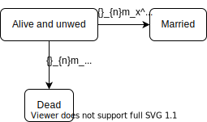

# Multiple decrement processes

:::{.rmdnote}
## Learning objectives {.unnumbered}

* Explain the multiple decrement extension of a single decrement process, and give examples of its applicability to demographic research
* Learn how to summarize a cohort's experience of a multiple decrement process using a multiple decrement table
* Construct a period multiple decrement table
* Understand the applicability of associated single decrement tables (and their special case of cause-deleted life tables)
* Construct an associated single decrement table under varying assumptions about the estimation of cause-specific person-periods lived among those who succumb to a decrement
* Decompose a difference between two life expectancies into its age- and cause-specific components
* Extend the concept of a stationary population to the multiple decrement case, and how to use a life table to find relations among its key metrics
:::

```{r setup, echo=FALSE, message=FALSE, warning=FALSE}
library(dplyr)
library(fuzzyjoin)
library(ggplot2)
library(htmltools)
library(kableExtra)
library(latex2exp)
library(mgcv)
library(readr)
library(tibble)
library(tidyr)
options(knitr.kable.NA = "")
```

## Multiple decrement tables for a real cohort

:::{.rmdimportant}
**KEY CONCEPT**

A **multiple decrement process** extends a single decrement process to consider multiple modes of exit.

A **multiple decrement life table** is a tabular summary of such a process.
:::

To extend a life table to consider multiple decrement causes, just add...

* ${}_{n}d_x^i$: Number of decrements from cause $i$ between ages $x$ and $x+n$
* ${}_{n}q_x^i = {}_{n}d_x^i/l_x$: Probability of leaving the table from cause $i$ between ages $x$ and $x+n$ for someone who reached age $x$
* ${}_{n}m_x^i = {}_{n}d_x^i/{}_{n}L_x$: Rate of decrement from cause $i$ between ages $x$ and $x+n$
* $l_x^i = \sum_{a=x}^\infty {}_{n}d_a^i$: Number of persons reaching age $x$ who will eventually succumb to cause $i$

... to all of the tables already in a single decrement life table
<br><br>

<details>
<summary>Which cause-specific analogues of life table columns are missing above and why? **Tap for answer**</summary>
* $e_x^i$: expected time until decrement to cause $i$. Those who later succumb to cause $i$ cannot be identified at age $x$ because they might succumb to another cause first
* Thus ${}_{n}L_x^i$, $T_x^i$, and ${}_{n}a_x^i$ excluded for similar reasons

**Question:** So why is $l_x^i$ included if it suffers from similar conceptual issues??

**Answer:**

* To calculate $l_x^i/l_x$, proportion of people aged $x$ who eventually succumb to cause $i$. **Examples:** Probability that marriage ends in divorce. Probability that employee leaves due to layoffs.
* The base of that probability, $l_x$ can be identified b age $x$
* Probabilities with $l_x^i$ as a base can't be identified because who don't know who will eventually succumb due to $i$
</details>
<br><br>

<details>
<summary>What must cause-specific decrements sum to? That is, what is $\sum_i {}_{n}d_x^i$? **Tap for answer**</summary>
The total number of all-cause decrements!

$$\sum_i {}_{n}d_x^i = {}_{n}d_x$$
</details>
<br>

<details>
<summary>So what must cause-specific decrements rates sum to? That is, what is $\sum_i {}_{n}m_x^i$? **Tap for answer**</summary>
The all-cause decrement rate!

$$
\sum_i {}_{n}m_x^i
  = \sum_i \frac{{}_{n}d_x^i}{{}_{n}L_x}
  = \frac{{}_{n}d_x}{{}_{n}L_x}
  = {}_{n}m_x
$$
</details>
<br>

<details>
<summary>What must cause-specific decrement probabilities sum to? That is, what is $\sum_i {}_{n}q_x^i$? **Tap for answer**</summary>
The all-cause decrement probability!

$$
\sum_i {}_{n}q_x^i
  = \sum_i \frac{{}_{n}d_x^i}{l_x}
  = \frac{{}_{n}d_x}{l_x}
  = {}_{n}q_x
$$
</details>
<br>

<details>
<summary>So what must $l_x^i$ sum to? **Tap for answer**</summary>
Recall that $l_x^i = \sum_{a=x}^\infty {}_{n}d_a^i$. So:

$$
\sum_i l_x^i
  = \sum_i \sum_{a=x}^\infty {}_{n}d_x^i
  = \sum_{a=x}^\infty {}_{n}d_a
  = l_x
$$

The sum of people who will eventually succumb to each cause is the sum of all people who will eventually succumb to any cause, which is equal to the number of survivors at age $x$.
</details>
<br>

Let's work through a mutliple decrement lifelines plot, again based on 10 real people born January 1, 1800^[From PHG Figure 4.1].

* M = Married
* D = Died

```{r cohort_mdlt_setup, echo=FALSE, message=FALSE, warning=FALSE}
cohort_data <- age_groups <- tibble::tibble(
  x = c(0, 1, 5, 10, 20, 30, 40, 50, 60),
  n = c(1, 4, 5, 10, 10, 10, 10, 10, NA),
  xpn = x + n
) %>%
  dplyr::mutate(group_id = dplyr::row_number())
cohort_data <- tibble::tibble(
  exit_age = c(
    27.42,
    1.22,
    17.62,
    59.60,
    0.07,
    17.22,
    22.47,
    16.41,
    23.47,
    19.63
  ),
  cause = c("M", "D", "M", "D", "D", "M", "M", "D", "M", "M")
) %>%
  dplyr::mutate(id = dplyr::row_number())
cohort_lt <- age_groups %>%
  fuzzyjoin::fuzzy_left_join(
    cohort_data,
    by = c("x" = "exit_age", "xpn" = "exit_age"), 
    match_fun = list(`<=`, `>`)
  ) %>%
  dplyr::mutate(indiv_A = dplyr::case_when(
    (exit_age < x) ~ 0,
    (x <= exit_age) & (exit_age < xpn) ~ exit_age - x,
    exit_age >= xpn ~ n
  )) %>%
  dplyr::group_by(x, n,xpn) %>%
  dplyr::summarize(
    d = sum(!is.na(exit_age)),
    d_D = sum(!is.na(exit_age) & cause == "D"),
    d_M = sum(!is.na(exit_age) & cause == "M"),
    A = sum(indiv_A)
  ) %>%
  dplyr::ungroup() %>%
  dplyr::mutate(
    l = nrow(cohort_data) - cumsum(dplyr::lag(d, default = 0)),
    q_D = d_D / l,
    q_M = d_M / l,
    q = d / l,
    l_D = rev(d_D) %>% dplyr::coalesce(0) %>% cumsum() %>% rev(),
    l_M = rev(d_M) %>% dplyr::coalesce(0) %>% cumsum() %>% rev(),
    L = (l - d) * n + ifelse(is.na(A), 0, A),
    m_D = d_D / L,
    m_M = d_M / L,
    m = d / L
  )
cohort_data %>%
  ggplot2::ggplot() +
  ggplot2::aes(x = 0, xend = exit_age, y = factor(rev(id)), yend = ..y..) +
  ggplot2::geom_segment(lwd = 1) +
  ggplot2::geom_text(
    aes(
      x = exit_age,
      label = paste(paste0("(", cause, ")"), exit_age)),
    hjust = -0.1
  ) +
  ggplot2::scale_x_continuous(
    breaks = c(0, 1, 5, seq(10, 60, by = 10)), expand = c(0, 0)
  ) +
  ggplot2::coord_cartesian(xlim = c(0, 60), clip = "off") +
  ggplot2::xlab("Exact age (years)") +
  ggplot2::ylab(NULL) +
  ggplot2::theme_minimal() +
  ggplot2::theme(
    panel.grid.major.y = element_blank(),
    panel.grid.minor = element_blank(),
    axis.ticks.x = element_line(),
    axis.line.x = element_line(),
    axis.text.y = element_blank(),
    plot.margin = unit(c(1, 3, 1, 1), "lines")
  )
```

```{r cohort_lt_display, echo=FALSE, message=FALSE, warning=FALSE}
cohort_lt_display <- cohort_lt %>%
  dplyr::select(x, l, d_D, d_M, d, q_D, q_M, q, l_D, l_M, L, m_D, m_M, m)
cohort_lt_display %>%
  setNames(
    nm = c(
      "$x$",
      "$l_x$",
      "${}_{n}d_x^D$",
      "${}_{n}d_x^M$",
      "${}_{n}d_x$",
      "${}_{n}q_x^D$",
      "${}_{n}q_x^M$",
      "${}_{n}q_x$",
      "$l_x^D$",
      "$l_x^M$",
      "${}_{n}L_x$",
      "${}_{n}m_x^D$",
      "${}_{n}m_x^M$",
      "${}_{n}m_x$"
    )
  ) %>%
  knitr::kable(digits = 2) %>%
  kableExtra::kable_paper("hover", full_width = FALSE, position = "left") %>%
  kableExtra::column_spec(2:ncol(cohort_lt_display), border_left = TRUE)
```


:::{.rmdimportant}
**KEY CONCEPT**

Although $x$ represents age in our multiple decrement process example, it more generally represents entry into current state.

**Examples:**

* Our marriage or death table above represents flows from the state of being alive and unmarried:


<details>
<summary>What would a multiple decrement table tracking the fate of a real estate brokerage's deals -- which can be closed and won, or closed and lost -- represent? **Tap for answer**</summary>
Flows from the state of being an open deal
</details>
:::

## Multiple decrement life tables for periods

As for period single decrement tables, multiple decrement tables require conversions from period rates to cohort probabilities.

Recall from the previous section:

$$
{}_{n}m_x^i =
  \frac{{}_{n}d_x^i}{{}_{n}L_x}
\textsf{ and }
{}_{n}q_x^i =
  \frac{{}_{n}d_x^i}{l_x}
\textsf{ and (from week 3) }
{}_{n}L_x =
  l_{x+n} \cdot n + {}_{n}a_x \cdot {}_{n}d_x
$$

From these facts, PHG derive a $\color{limegreen}{\textsf{cause-specific}}$ analogue to Equation \@ref(eq:nqxperiod) from week 3:

\begin{equation}
  {}_{n}q_x^i = \frac{
    n \cdot \color{limegreen}{{}_{n}m_x^i}
  }{
    1 + \left(n - {}_{n}a_x\right){}_{n}m_x
  }
  (\#eq:nqx-md-period)
\end{equation}

**New notation:** Index $-i$ indicates all causes other than $i$.

Re-writing Equation \@ref(eq:nqx-md-period) reveals $\color{olive}{\textsf{competing risks}}$:

$$
{}_{n}q_x^i = \frac{
  n \cdot \color{limegreen}{{}_{n}m_x^i}
}{
  1 + \left(n - {}_{n}a_x\right)\left(
    \color{limegreen}{{}_{n}m_x^i} + \color{olive}{{}_{n}m_x^{-i}}
  \right)
}
$$

* **${}_{n}q_x^i$ is a "dependent probability":** Holding $\color{limegreen}{{}_{n}m_x^i}$ constant, higher $\color{olive}{{}_{n}m_x^{-i}}$ means lower ${}_{n}q_x^i$
* **${}_{n}m_x^i$ isn't necessarily a "dependent rate":** Although ${}_{n}q_x^i$ depends on $\color{olive}{{}_{n}m_x^{-i}}$, that doesn't necessarily mean $\color{limegreen}{{}_{n}m_x^i}$ also depend son $\color{olive}{{}_{n}m_x^{-i}}$

As PHG write on pg. 75:

> "... all persons starting life must die of something, and if the probability of exiting from one cause declines, the probability of exiting from some other cause(s) must increase."

:::{.rmdimportant}
**KEY CONCEPT**

**Competing risks** are events whose occurrence preclude the occurrence of a focal event of interest.
:::

### Converting ${}_{n}m_x^i$ to ${}_{n}q_x^i$: Easier than it sounds! {.unnumbered}

Avoid tedious derivation via Equation \@ref(eq:nqxperiod) by...

* ... noting that:

$$
\require{cancel}
\frac{{}_{n}q_x^i}{{}_{n}q_x}
 = \frac{{}_{n}d_x^i / \bcancel{l_x}}{{}_{n}d_x / \bcancel{l_x}}
 = \frac{{}_{n}d_x^i}{{}_{n}d_x}
 = \frac{{}_{n}d_x^i / \bcancel{{}_{n}L_x}}{{}_{n}d_x / \bcancel{{}_{n}L_x}}
 = \frac{{}_{n}m_x^i}{{}_{n}m_x}
$$

* ... then solving for ${}_{n}q_x^i$ to find:

$$
{}_{n}q_x^i = {}_{n}q_x \cdot \frac{{}_{n}m_x^i}{{}_{n}m_x}
$$

:::{.rmdimportant}
**KEY INSIGHT**

To find the probability ${}_{n}q_x^i$ of exit due to cause $i$, simply apportion the total decrement probability ${}_{n}q_x$ in proportion to the relative decrement rate ${}_{n}m_x^i / {}_{n}m_x$
:::

### Steps for constructing a period multiple decrement table {#multiple-decrement-steps .unnumbered}

```{r employee_employee_lt_prep, echo=FALSE, message=FALSE, warning=FALSE}
# Load employee data from GitHub
source_url <- paste0("https://raw.githubusercontent.com/",
                     "teuschb/hr_data/master/datasets/",
                     "turnover_babushkin.csv")
tenure_groups <- tibble::tibble(
  x = seq(0, 180, by = 1),
  xpn = dplyr::lead(x),
  nx = xpn - x
)
employees <- readr::read_csv(url(source_url), col_types = cols())
employee_mx <- tenure_groups %>%
  fuzzyjoin::fuzzy_left_join(
    employees,
    by = c("x" = "tenure", "xpn" = "tenure"), 
    match_fun = list(`<=`, `>`)
  ) %>%
  dplyr::group_by(x, xpn, nx) %>%
  dplyr::summarize(
    d = sum(left_company) %>% dplyr::coalesce(0),
    mp_py = n(),
    m = d / mp_py
  ) %>%
  dplyr::ungroup() %>%
  dplyr::mutate(
    mx = mgcv::gam(data = ., formula = m ~ x, family = poisson()) %>%
      predict(type = "response") %>%
      as.numeric(),
    mx_V = 0.6 * mx,
    mx_I = mx - mx_V
  ) %>%
  dplyr::select(x, xpn, nx, mx_V, mx_I, mx)
```

To illustrate the steps of multiple decrement table construction, we'll use a simulated dataset on voluntary vs. involuntary employee termination rates by tenure group^[The simulation assumes 60% voluntary vs. 40% involuntary termination. All-cause attrition rates based on employees from a real Russian company, documented here: https://www.kaggle.com/davinwijaya/employee-turnover].

Here's a plot of the simulated termination rates.

* $V = \color{blue}{\textsf{Voluntary}}$
* $I = \color{red}{\textsf{Involuntary}}$

```{r employee_term_rates_plot, echo=FALSE, warning=FALSE, message=FALSE}
employee_mx %>%
  ggplot2::ggplot() +
  ggplot2::aes(x = x) +
  ggplot2::geom_line(aes(y = mx)) +
  ggplot2::annotate(
    "text",
    x = 75, y = 0.4,
    label = latex2exp::TeX("${}_{n}m_x$", italic = TRUE)
  ) +
  ggplot2::geom_line(aes(y = mx_V), color = "blue") +
  ggplot2::annotate(
    "text",
    x = 75, y = 0.25, color = "blue",
    label = latex2exp::TeX("${}_{n}m_x^V$", italic = TRUE)
  ) +
  ggplot2::geom_line(aes(y = mx_I), color = "red") +
  ggplot2::annotate(
    "text",
    x = 75, y = 0.17, color = "red",
    label = latex2exp::TeX("${}_{n}m_x^I$", italic = TRUE)
  ) +
  ggplot2::labs(
    title = "Simulated cause-specific employee termination rates",
    x = latex2exp::TeX("$x$", italic = TRUE),
    y = NULL
  ) +
  ggplot2::theme_minimal() +
  ggplot2::theme(panel.grid = element_blank())
```

#### Step 1: Compute the single decrement life table values

Again, we'll assume from [the mid-period approximation](#nax-mid-period-assumption) that ${}_{n}a_x = n / 2$.

```{r employee_lt_single_decrement, echo=TRUE, warning=FALSE, message=FALSE}
employee_lt <- employee_mx %>%
  dplyr::mutate(
    ax = nx / 2,
    qx = ((nx * mx) / (1 + (nx - ax) * mx)) %>% dplyr::coalesce(1),
    px = 1 - qx
  )
l0 <- 100000
lx <- l0
x <- employee_lt$x
npx <- employee_lt$px
for (a in x[-length(x)]) {
  l <- lx[which(x == a)] * npx[which(x == a)]
  lx <- c(lx, l)
}
employee_lt <- employee_lt %>%
  dplyr::mutate(
    lx = lx,
    dx = lx * qx,
    Lx = dplyr::case_when(
      qx != 1 ~ nx * dplyr::lead(lx) + ax * dx,
      qx == 1 ~ lx / mx
    ),
    Tx = rev(Lx) %>% dplyr::coalesce(0) %>% cumsum() %>% rev(),
    ex = Tx / lx
  )
```

#### Step 2: Compute probability of exit from cause $i$ for each tenure group

Recall that ${}_{n}q_x^i = {}_{n}q_x \cdot \frac{{}_{n}m_x^i}{{}_{n}m_x}$:

```{r employee_lt_qxi, echo=TRUE, message=FALSE, warning=FALSE}
employee_lt <- employee_lt %>%
  dplyr::mutate(qx_V = qx * (mx_V / mx),
                qx_I = qx * (mx_I / mx))
```

#### Step 3: Compute number of decrements from cause $i$ for each tenure group

Recall that ${}_{n}d_x^i = {}_{n}q_x^i \cdot l_x$:

```{r employee_lt_dxi, echo=TRUE, message=FALSE, warning=FALSE}
employee_lt <- employee_lt %>%
  dplyr::mutate(dx_V = qx_V * lx,
                dx_I = qx_I * lx)
```

#### Step 4: Compute the number of persons aged $x$ who will eventually exit due to cause $i$

* Recall that $l_x^i = \sum_{a = x}^\infty {}_{n}d_a^i$.
* To do this, we'll use our old pal from computing `Tx`:

<center>`rev(.) %>% dplyr::coalesce(0) %>% cumsum() %>% rev()`</center>

And since I'm tired of typing it, let's make it a function.

```{r employee_lt_lxi, echo=TRUE, message=FALSE, warning=FALSE}
sum_from_here <- function(x) {
  rev(x) %>% dplyr::coalesce(0) %>% cumsum() %>% rev()
}
employee_lt <- employee_lt %>%
  dplyr::mutate(lx_V = sum_from_here(dx_V),
                lx_I = sum_from_here(dx_I))
```

Let's see the period multiple decrement table we just constructed:

```{r employee_lt_display, echo=FALSE, warning=FALSE, message=FALSE}
employee_lt %>%
  dplyr::mutate(x = factor(x)) %>%
  dplyr::select(
    x, dx_V, dx_I, dx, qx_V, qx_I, qx, lx_V, lx_I, lx, Lx, mx_V, mx_I, mx
  ) %>%
  DT::datatable(
    rownames = FALSE,
    filter = "top",
    options = list(dom = "pt", pageLength = 5, autoWidth = TRUE, scrollX = TRUE)
  ) %>%
  DT::formatRound(
    columns = c("lx", "dx_V", "dx_I", "dx", "lx_V", "lx_I", "Lx"),
    digits = 1
  ) %>%
  DT::formatRound(
    columns = c("qx_V", "qx_I", "qx", "mx_V", "mx_I", "mx"),
    digits = 2
  ) %>%
  DT::formatStyle(
    columns = c("dx_V", "lx_V", "qx_V", "mx_V"),
    backgroundColor = "lightblue"
  ) %>%
  DT::formatStyle(
    columns = c("dx_I", "lx_I", "qx_I", "mx_I"),
    backgroundColor = "lightsalmon"
  )
```
<br><br>

:::{.rmdtip}
**DEMOGRAPHY & DATA SCIENCE**

<details>
<summary>Why might you not want to use the methods described here (without substantial extension and modification) to study termination rates in  a small- to mid-sized company? </summary>
* The demographic methods we study in this course assume complete data on a **very large** population.
* To extend to small samples from large populations, you need to account for sampling error.
* To extend to small populations, you need to account for stochasticity in the process itself.
</details>
:::
<br>

## Some basic mathematics of multiple decrement processes

### Statistical independence among observed decrement rates {.unnumbered}

:::{.rmdimportant}
**KEY CONCEPT**

**Force of decrement**: The cause-specific decrement rate measured over an infinitesimally small amount of time.

Extending Equation \@ref(eq:force-of-mortality) to multiple decrements:

\begin{equation}
\mu^i(x) = \lim_{n \rightarrow 0} {}_{n}m_x^i
(\#eq:force-of-decrement)
\end{equation}

In competing risk analysis (subset of event history analysis and extension of survival analysis), Equation \@ref(eq:force-of-decrement) known as the cause-specific hazard function.

Extending Equation \@ref(eq:continuoussurvival):

\begin{equation}
{}_{n}p_x^i = e^{-\int_x^{x+n} \mu^i(y)dy}
(\#eq:continuoussurvival-decrement)
\end{equation}
:::

* Just as ${}_{n}m_x = \sum_i {}_{n}m_x^i$, so too does $\mu(x) = \sum_i \mu(x)^i$
* ${}_{n}p_x = \prod_i {}_{n}p_x^i$: The probability of remaining in current state from $x$ to $x+n$ is the product of the independent probabilities of not succumbing to each cause
* PHG pg. 79 give other examples of multiple decrement columns with continuous analogues

:::{.rmdimportant}
**KEY INSIGHTS**

The statements above assume **statistical independence** among observed decrement rates, which means:

* No overlap (all causes are mutually exclusive and exhaustive)
* No combinations (overall decrement rate includes no interaction terms of cause-specific rates)

But that doesn't require statistical independence among *disease processes*. The causal factors underlying one decrement rate may include the factors that influence another decrement rate.

**Examples:**

* Employee talent may be positively associated with both voluntary *and* involuntary termination. Talented employees have better outside opportunities. Untalented employees have higher layoff risk.
* A drug meant to reduce death rate due to heart disease ($H$) may increase death rates for other causes ($-H$), making the heart disease treatment look more effective than it is. In this case, ${}_{n}q_x^H$ may decrease, but only because ${}_{n}q_x^{-H}$ increases.

And remember about competing risks: Statistical independence among observed decrement rates doesn't mean statistical independence between decrement *probabilities* and decrement rates.

These insights become crucial as you learn competing risks analysis in other courses.
:::

### Be careful assuming period decrement rates ${}_{n}M_x^i$ equal cohort rates ${}_{n}m_x^i$

Recall Equation \@ref(eq:period-rates-and-force) from our [week 3 analysis](#careful-assuming-M-equals-m) of the conditions when single decrement period rates ${}_{n}M_x$ equal cohort rates ${}_{n}m_x$.

Similarly, the period decrement rate is a function of both decrement force $\mu^i(x)$ and period age structure $c(x)$:

$$
{}_{n}M_x^i
  = \frac{
    \int_x^{x+n} \color{dodgerblue}{N(a)}\mu^i(a)da
  }{
    \int_x^{x+n} \color{dodgerblue}{N(a)}da
  }
  = \int_x^{x+n} \color{dodgerblue}{c(a)}\mu^i(a)da
$$

* It's possible that $\color{dodgerblue}{c(a)} = \int_x^{x+n} \color{dodgerblue}{N(a)}\cdot \frac{1}{\int_x^{x+n} \color{dodgerblue}{N(a)}da}da \neq \int_x^{x+n} \color{darkorange}{l(a)}\cdot \frac{1}{\int_x^{x+n} \color{darkorange}{l(a)}da}da$
* So it's also possible that ${}_{n}M_x^i \neq {}_{n}m_x^i$

<details>
<summary>Based on our analysis of single decrement processes, under what two conditions can we be sure ${}_{n}M_x^i = {}_{n}m_x^i$? **Tap for answer**</summary>
1. Constant decrement rate over age interval
2. Stationary population

In the multiple decrement case, the definition of stationary population extends to require constant age-specific decrement rates for each cause $i$.
</details>

## Associated single decrement tables from period data

:::{.rmdimportant}
**KEY CONCEPT**

* **Associated single decrement table (ASDT):** A single decrement table that summarizes the hypothetical case when only cause $i$ exists

* **Cause-deleted single decrement table:** An ASDT that defines the decrement cause of interest as $-i$ (all causes but $i$)

**DISCUSS:** Example use cases for an ASDT or cause-deleted table...
:::

### Challenge to ASDT construction:  Target ASDT decrement rate ${}_{n}^*m_x^i$ may differ from observed rate ${}_{n}m_x^i$ {.unnumbered}

$$
{}_{n}^*m_x^i
  = \frac{
    \int_x^{x+n}
      e^{-\int_x^a \color{limegreen}{\mu^i(y)}dy}
      \color{limegreen}{\mu^i(y)}da
  }{
    \int_x^{x+n}
      e^{-\int_x^a \color{limegreen}{\mu^i(y)}dy}
  }
\textsf{ whereas }
{}_{n}m_x^i
  = \frac{
    \int_x^{x+n}
      e^{-\int_x^a \color{olive}{\mu(y)}dy}
      \color{limegreen}{\mu^i(y)}da
  }{
    \int_x^{x+n}
      e^{-\int_x^a \color{olive}{\mu(y)}dy}
  }
$$

<details>
<summary>Why in general not equal? **Hint:** Think about how $\mu(a) = \sum_i \mu^i(a)$. **Tap for answer**</summary>
Because $\mu(a) > \mu^i(a)$ for all ages $a$.

A picture might help, returning to our simulated employee termination example. Note how $\mu^I(x)$ and $\mu^V(x)$ stacked atop one another to equal $\mu(x)$

```{r mu_start_not_mu_plot, echo=FALSE, message=FALSE, warning=FALSE}
mu_start_not_mu_plot <- employee_lt %>%
  dplyr::select(x, mx_V, mx_I) %>%
  tidyr::pivot_longer(
    cols = c(mx_V, mx_I),
    names_to = "term_type",
    names_prefix = "mx_",
    values_to = "mx"
  ) %>%
  ggplot2::ggplot() +
  ggplot2::aes(x = x, y = mx) +
  ggplot2::geom_area(aes(fill = factor(term_type))) +
  ggplot2::annotate(
    "text",
    x = 25, y = 0.45,
    label = latex2exp::TeX("$\\mu^I(x)$", italic = TRUE)
  ) +
  ggplot2::annotate(
    "text",
    x = 25, y = 0.2,
    label = latex2exp::TeX("$\\mu^D(x)$", italic = TRUE)
  ) +
  ggplot2::geom_line(data = employee_lt) +
  ggplot2::annotate(
    "text",
    x = 75, y = 0.4, angle = -25,
    label = latex2exp::TeX("$\\mu(x) = \\mu^I(x) + \\mu^D(x)$")
  ) +
  ggplot2::xlab(latex2exp::TeX("$x$", italic = TRUE)) +
  ggplot2::ylab(NULL) +
  ggplot2::theme_minimal() +
  ggplot2::theme(panel.grid = element_blank(),
                 legend.position = "none")
mu_start_not_mu_plot
```

</details>
<br>

### Three ways to solve the ${}_{n}^*m_x^i \neq {}_{n}m_x^i$ problem {.unnumbered}

#### ${}_{n}^*m_x^i \neq {}_{n}m_x^i$ solution option 1: Ignore the problem and assume ${}_{n}^*m_x^i = {}_{n}m_x^i$ {.unnumbered}

In this case, you follow the single decrement table construction procedure, but the ${}_{n}m_x \rightarrow {}_{n}q_x$ conversion becomes:

$${}_{n}^*m_x^i = {}_{n}M_x^i = {}_{n}m_x^i$$

and

$${}_{n}^*q_x^i = \frac{
  n \cdot {}_{n}m_x^i
}{
  1 + \left(n - {}_{n}^*a_x^i\right){}_{n}m_x^i
}$$

Approximate ${}_{n}^*a_x$ using similar methods from [week 3](#qx-to-mx-conversion). Rules of thumb or graduation are preferable.

:::{.rmdcaution}
**Don't ignore the problem and assume ${}_{n}^*m_x^i = {}_{n}m_x^i$.**

Especially if decrement rates are high, this method can lead to huge errors.
:::
<br><br>

#### ${}_{n}^*m_x^i \neq {}_{n}m_x^i$ solution option 2: Assume constant decrement force $\mu^i(x)$ between ages $x$ and $x+n$ {.unnumbered}

Suppose $\mu^i(a)$ is a constant $\color{purple}{\gamma}$ between ages $x$ and $x+n$. Then: 

$$
\require{bcancel}
\begin{align}
{}_{n}^*m_x^i|_{\mu^i(x) = \color{purple}{\gamma}}
  &= \frac{
    \int_x^{x+n}
      e^{-\int_x^a \color{limegreen}{\mu^i(y)}dy}
      \color{limegreen}{\mu^i(a)}da
  }{
    \int_x^{x+n}
      e^{-\int_x^a \color{limegreen}{\mu^i(y)}dy}da
  } \\
  &= \frac{
    \int_x^{x+n} e^{-\int_x^a \color{purple}{\gamma}dy}\color{purple}{\gamma}da
  }{
    \int_x^{x+n} e^{-\int_x^a \color{purple}{\gamma}dy}da
  } \\
  &= \color{purple}{\gamma}\frac{
    \bcancel{\int_x^{x+n} e^{-\int_x^a \color{purple}{\gamma}dy}da}
  }{
    \bcancel{\int_x^{x+n} e^{-\int_x^a \color{purple}{\gamma}dy}da}
  } \\
  &= \color{purple}{\gamma} \\
  &= \color{purple}{\gamma}\frac{
    \bcancel{\int_x^{x+n} e^{-\int_x^a \color{olive}{\mu(y)}dy}da}
  }{
    \bcancel{\int_x^{x+n} e^{-\int_x^a \color{olive}{\mu(y)}dy}da}
  } \\
  &= \frac{
    \int_x^{x+n}
      e^{-\int_x^a \color{olive}{\mu(y)}dy}
      \color{purple}{\gamma}da
  }{
    \int_x^{x+n}
      e^{-\int_x^a \color{olive}{\mu(y)}dy}da
  } \\
  &= \frac{
    \int_x^{x+n}
      e^{-\int_x^a \color{olive}{\mu(y)}dy}
      \color{limegreen}{\mu^i(a)}da
  }{
    \int_x^{x+n}
      e^{-\int_x^a \color{olive}{\mu(y)}dy}da
  } = {}_{n}m_x^i|_{\mu^i(x) = \color{purple}{\gamma}}
\end{align}
$$

Under constant age- and cause-specific hazard ${}_{n}\gamma^i_x$ assumed to be equal to observed cause-specific decrement rate ${}_{n}M^i_x$:

$$
{}_{n}^*p_x^i = e^{-n \cdot {}_{n}M^i_x}
$$

and

$$
{}_{n}^*L_x^i = \frac{{}_{}^*l_x^i - {}_{}^*l_{x+n}^i}{{}_{n}M^i_x}
$$

<details>
<summary>With these values in hand, you don't even need to compute ${}_{n}^*a_x^i$ to complete the rest of the multiple decrement table. Why? **Tap for answer**</summary>
Because ${}_{n}^*p_x^i = 1 - {}_{n}^*q_x^i$, you don't need to compute ${}_{n}^*a_x^i$ at all to do the rate $\rightarrow$ probability conversion
</details>
<br>

:::{.rmdcaution}
**Only assume constant hazard if the age interval is small relative to the rate at which the decrement force changes.**

In such cases, the constant cause-specific hazard assumption is more tenable.
:::
<br><br>

#### ${}_{n}^*m_x^i \neq {}_{n}m_x^i$ solution option 3: Assume proportional hazards {.unnumbered}

* For this solution, $\mu^i(a) = R^i \cdot \mu(a)$ for all ages $a$ between $x$ and $x+n$. $R^i$ is a *constant of proportionality* for cause $i$.
* Therefore, $\mu^i(a) \propto \mu(a)$.
* Consequently, ${}_{n}^*p_x = \left[{}_{n}p_x\right]^{R^i}$, or the single decrement survival probability raised to the $R^i$^th^ power (see PHG pg. 82 for derivation).

Furthermore,

* $R^i = \frac{{}_{n}D_x^i/l_x}{{}_{n}D_x/l_x}=\frac{{}_{n}D_x^i}{{}_{n}D_x}$, the ratio of *observed decrements* between ages $x$ and $x+n$ (**NOT** the ratio of decrements computed during life table procedure).
* Consequently, ${}_{n}^*p_x = \left[{}_{n}p_x\right]^{\left(\frac{{}_{n}D_x^i}{{}_{n}D_x}\right)}$

Two related challenges remain under proportional hazards:

* Choosing which value of ${}_{n}^*m_x^i$ to put into the final life table
* Because ${}_{n}^*m_x^i = {}_{n}^*d_x^i / {}_{n}^*L_x^i$ and ${}_{n}^*L_x^i = n \cdot {}_{}^*l_{x+n} + {}_{n}^*a_x^i \cdot {}_{n}^*d_x^i$, this amounts to choosing values of ${}_{n}^*a_x^i$

When working with human mortality data, PHG pgs. 83-84 and the professor I had for this course ([Sam Clark](https://www.samclark.net/)) collectively recommend using the following procedure to estimate ${}_{n}^*a_x^i$:

1. For ages $10 \leq x < 80$:

    Use a version of Keyfitz's [-@keyfitz1966life] 2^nd^ degree polynomial to graduate deaths:

    $$
    {}_{n}^*a_x^i = \frac{
      -\frac{n}{24} {}_{n}^*d^i_{x-n}
      + \frac{n}{2} {}_{n}^*d^i_{x}
      + \frac{n}{24} {}_{n}^*d^i_{x+n}
    }{
      {}_{n}^*d^i_x
    }
    $$
    
    Note that ${}_{n}^*d^i_{x-n}$ is directly observable from [multiple decrement table construction steps](#multiple-decrement-steps) 1 through 3, so you don't need to interate as we did with single decrement tables
    
2. For ages $0 \leq x < 10$ and closed age intervals with $x \geq 80$:

    $$
    {}_{n}^*a^i_x = n + R^i\frac{{}_{n}q_x}{{}_{n}^*q^i_x}\left(
      {}_{n}a_x - n
    \right)
    $$
    
    Unlike the Keyfitz polynomial, this approach is adaptable to intervals of irregular length. You use the ${}_{n}a_x - n$ calculated when constructing the single decrement life table
    
    This method interpolates (fills the blank between) two extreme situations:
    
    * No deaths from cause $i$ in the age interval
    * All deaths in age interval due to cause $i$
    
3. For open age interval (e.g., $x \geq 85$):

    $$
    {}_{\infty}^*a^i_{85}
      = \frac{e_{85}^0}{R^i}
      = e_{85}^0 \cdot \frac{{}_{n}D_x}{{}_{n}D^i_x}
    $$
    
    * This was Sam Clark's recommendation
    * This is fairly specific to cause-specific mortality decrement tables!
    * Remember that $D$ refers to *observed* decrements!

:::{.rmdcaution}
**Only use this method if the proportional hazards assumption is tenable**

When I took this course back in the Stone Age, this is the method we were told to use in our homeworks *and in practice*. But you should get used to the possibility that the proportional hazards assumption is violated, because it sometimes is.

<details>
<summary>Would we expect this assumption work well or not so well for many cause-deleted life tables? **Tap for answer**</summary>
* When only one minor cause $i$ is deleted, it will work well because the proportionality assumption holds well.
* When a major cause or set of causes is deleted, it may not work so well
</details>
:::
<br>

The plot below returns to our simulated employee termination example, where the voluntary termination rate was set to 60% of the all-cause termination rate. This is an example of what proportional hazards looks like.

```{r proportional_hazards_plot, echo=FALSE, message=FALSE, warning=FALSE}
mu_start_not_mu_plot +
  ggplot2::annotate(
    "segment",
    x = 50, xend = 50,
    y = employee_lt$mx[employee_lt$x == 50],
    yend = employee_lt$mx_V[employee_lt$x == 50]
  ) +
  ggplot2::annotate(
    "point", x = 50, y = employee_lt$mx[employee_lt$x == 50]
  ) +
  ggplot2::annotate(
    "point", x = 50, y = employee_lt$mx_V[employee_lt$x == 50]
  ) +
  ggplot2::annotate(
    "text", x = 70, y = 0.30, angle = -20,
    label = latex2exp::TeX(
      "$\\frac{\\mu^V(50)}{\\mu(50)} = 60%$"
    )
  ) +
  ggplot2::annotate(
    "segment",
    x = 100, xend = 100,
    y = employee_lt$mx[employee_lt$x == 100],
    yend = employee_lt$mx_V[employee_lt$x == 100]
  ) +
  ggplot2::annotate(
    "point", x = 100, y = employee_lt$mx[employee_lt$x == 100]
  ) +
  ggplot2::annotate(
    "point", x = 100, y = employee_lt$mx_V[employee_lt$x == 100]
  ) +
  ggplot2::annotate(
    "text", x = 120, y = 0.195, angle = -12,
    label = latex2exp::TeX(
      "$\\frac{\\mu^V(100)}{\\mu(100)} = 60%$"
    )
  )
```
<br>

<details>
<summary>Suppose I hadn't forced ${}_{n}m^V_x = 0.6 \cdot {}_{n}m_x$, but let the ratio vary by age $x$, still assuming $\text{Avg}\left(\frac{{}_{n}m^V_x}{{}_{n}m_x}\right) = 0.6$. Could a cause-deleted life table that excludes voluntary termination safely assume proportional hazards? **Tap for answer**</summary>
No because the deleted decrement $V$ is a major contributor to the all-cause decrement rate.
</details>
<br><br>

<details>
<summary>What are some cases when you wouldn't expect proportional hazards? **Hint:** Think of decrement causes that differ in their age-specific rate schedules. **Tap for answers**</summary>
How about the competing risks of **first marriage** vs. **death**?

Or **first birth** vs. **death**?
<br><br>

### Things to keep in mind about estimating ${}_{n}^*a^i_x$ {.unnumbered}

* The recommendations above are just one possibility
* Which method you use depends on the tenability of its assumptions in your research context
* Yet results may not be all that sensitive to your choice

## Cause-specific decomposition of differences in life expectancies

The proportional hazards assumption allows for life expectancies to be easily decomposed into causal components.

* Recall that ${}_{n}\Delta_x$ is the age-specific component of life expectancy difference $e_x^0(2) - e_x^0(1)$ for the age interval between $x$ and $x+n$
* Define ${}_{n}\Delta_x^i$ as the age-specific, cause-specific component of the difference
* Define ${}_{n}R_x^i = {}_{n}D_x^i / {}_{n}D_x$ as the constant of proportionality between the focal decrement rate $i$ and the all-cause rate

$$\begin{align}
{}_{n}\Delta_x^i
  &= {}_{n}\Delta_x \cdot \frac{
    {}_{n}m_x^i(2) - {}_{n}m_x^i(1)
  }{
    {}_{n}m_x(2) - {}_{n}m_x(1)
  } \\
  &= {}_{n}\Delta_x \cdot \frac{
    {}_{n}R_x^i(2) \cdot {}_{n}m_x(2) - {}_{n}R_x^i(1) \cdot {}_{n}m_x(1)
  }{
    {}_{n}m_x(2) - {}_{n}m_x(1)
  }
\end{align}$$

<details>
<summary>Describe the intuition behind the right-hand side of the top row above. **Tap for answer**</summary>
A cause-specific contribution to life expectancy is proportional to the ratio of the differences in cause-specific decrement rates to the differences in all-cause decrement rates.
</details>
<br>

<details>
<summary>What is the reason behind that simple intuition? **Tap for answer**</summary>
The proportional hazards assumption
</details>
<br>

Note that:

* ${}_{n}\Delta_x = \sum_i {}_{n}\Delta_x^i$: Age-specific contributions are the sum of age- and cause-specific components
* $e_x^0(2) - e_x^0(1) = \sum_x {}_{n}\Delta_x = \sum_x \sum_i {}_{n}\Delta^i_x$: The total diference in life expectancy is the sum across all age- and cause-specific components
<br><br>

Below is a table decomposing the difference in life expectancy at birth between Indian and Chinese men in 1990^[Reproduced from Box 4.3 on PHG pg. 87]. **Practice explaining the results and mapping them to our notation.**

```{r age_and_cause_spec_e0_decomp, echo=FALSE, warning=FALSE, message=FALSE}
sketch <- htmltools::withTags(table(
  class = "display",
  thead(
    tr(
      th(rowspan = 2, "Age"),
      th(
        colspan = 4, "Cause-specific contribution to life expectancy difference"
      ),
    ),
    tr(
      th(
        "All causes combined"
      ),
      th(
        "Communicable disease, maternal, perinatal and nutritional conditions"
      ),
      th(
        "Noncommunicable diseases"
      ),
      th(
        "Injuries"
      )
    )
  )
))
tibble::tibble(
  x = c(c(0, 5, 15, 30, 45, 60, 70), "Total difference"),
  Delta = c(5.6, 0.8, 0.3, 0.6, 0.8, 0.3, -0.3, 8.2),
  Delta_1 = c(5.5, 0.6, 0.4, 0.6, 0.7, 0.5, 0.7, 9.0),
  Delta_2 = c(0.1, 0.1, -0.1, -0.1, 0.0, -0.1, -0.9, -1.0),
  Delta_3 = c(-0.01, 0.2, -0.0, 0.1, 0.1, -0.01, -0.1, 0.2)
) %>%
  DT::datatable(
    container = sketch,
    rownames = FALSE,
    options = list(dom = "t", ordering = FALSE)
  ) %>%
  DT::formatStyle(
    columns = 2:5, 
    backgroundColor = DT::styleInterval(
      cuts = 0.0, values = c("orange", "lightblue")
    ),
    fontWeight = "bold"
  ) %>%
  DT::formatRound(columns = 2:5, digits = 1)
```

## Associated single decrement tables from current status data

* We're skipping this section during this course
* Read through it if you want to know how to estimate multiple decrement processes from  current status (as opposed to vital statistics or retrospective survey)
* Good to know if that's all the data you have (hello, anthropologists who work in small-scale populations!)
* Try to get better data if possible

## Stationary population with multiple sources of decrement

:::{.rmdimportant}
**KEY CONCEPT**

Recall that a **stationary population** meets the following demographic conditions:

1. Age-specific death rates are constant over time
2. Constant annual flow of births
3. Age-specific net migration rates are zero

<details>
<summary>What must we further assume in the multiple decrement case? **Tap for answer**</summary>
Age-specific decrement rates for each cause $i$ are constant over time
</details>
<br>
:::

In a stationary population:

* ${}_{n}q_x^i = \frac{\sum_x^\infty {}_{n}d_x^i}{l_0} = l_0^i/l_0$: The probability that a newborn dies due to cause $i$ is equal to the number of deaths from cause $i$ divided by the annual number of births
* $\frac{\sum_{a=x}^\infty {}_{n}d_a}{l_x} = l_x^i/l_x$: The probability that someone aged $x$ eventually dies of cause $i$ is equal to the proportion of annual deaths at ages $x+$ attributable to cause $i$

To prepare for a problem set question, study carefully the example applications of these relations on PHG pg. 91.