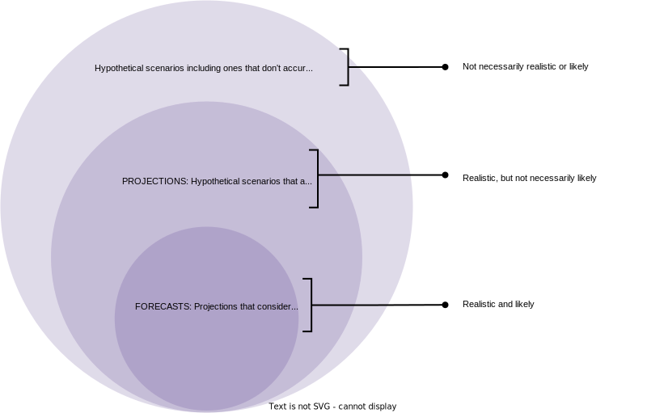

# Population projections

```{r setup, echo=FALSE, warning=FALSE, message=FALSE}
library(dplyr)
library(HMDHFDplus)
```

Demographers very often are asked questions like:

* **Balance of income transfers**: What will the ratio of elderly to working-age people look like 30 years from now?
    * What will it look like under current age-specific fertility and mortality?
    * What if age-specific mortality increases as a result of socio-environmental shocks caused by climate change?
    * What if the demographic transition happens faster for low-income countries than it did for high-income countries?
    
Here's a picture of production vs. consumption by age to make clear why these questions are important:
    
](https://media.springernature.com/full/springer-static/image/art%3A10.1186%2Fs41118-020-00100-8/MediaObjects/41118_2020_100_Fig1_HTML.png){width=100%}

* **Tax revenue projection**: What will the population of working-aged people look like in each school district in Austin, Texas, 10 years from now?
    * Under different scenarios of expected high wage earners attracted by growing tech sector job market
    * Under different assumptions about how these wealthy newcomers distribute across school districts
    
:::{.rmdtip}
**DEMOGRAPHY & DATA SCIENCE**

Data scientists often are asked questions like:

* How quickly will our target hiring pool size grow relative to headcount need?
* What will the size of the market for our current products be in 10 years?
* Which high-growth demographic groups should we design new products for?
* What will the age structure of our inventory look like under our current intake and inventory retention rates?
:::

All of these questions can be addressed by projecting the growth and structure of a population into the future under varying assumptions about future vital rates.

## Projections vs. forecasts

:::{.rmdimportant}
**KEY CONCEPTS**

From the United Nations' demographic dictionary [-@population_multilingual_1958] cited on PHG pg. 117:

* A **population projection** "shows the future development of a population when <span style="text-decoration:underline">certain assumptions</span> are made about... future... fertility, mortality, and migration"
* A **population forecast** "<span style="text-decoration:underline">is a projection</span> in which the <span style="text-decoration:underline">assumptions</span> are considered to yield a <span style="text-decoration:underline">realistic picture</span> of the probable future development of a population"

(My underlining)

**So forecasts are a subset of projections!**
:::

A Venn diagram relates projections to forecasts:

{width=100%}

An analogy to **logic** (specifically **deductive reasoning**):^[https://en.wikipedia.org/wiki/Deductive_reasoning]

* A **projection** is a like a **valid argument**^[https://en.wikipedia.org/wiki/Validity_(logic)] whose conclusion is true if its premises are true... but its premises may not be true (even probabilistically)
* A **forecast** is like a **sound argument**^[https://en.wikipedia.org/wiki/Soundness], which is both valid in form and has true premises (at least probabilistically)

### Reconciling some confusing things that PHG says about projections vs. forecasts {.unnumbered}

I found some claims on PHG pgs. 117-118 confusing when I first encountered them:

> ... quality of projections is determined by their internal validity.... The gauge of a forecast, on the other hand, is its external validity...

**CONFUSION:** Wait, WTF, the word "validity" is used twice in this contrast?

**CLARITY:**

* *Internal validity* = logically consistent modeling of demographic relations (Often not hard to achieve)
* *External validity* = accurate and precise prediction of the actual future for the population you're studying (Hard to achieve)
* *Generalization validity* = accurate and precise prediction using the projection methods you devised for one population to predict the future course of *another population* with different vital rates, and even better, executed by a completely different research team (VERY hard to achieve)

  Often, an understanding of demographic relations (internal validity) assists with accurate prediction (external validity)

> Unlike forecasts, population projections can be made for the past as well as for the future.

**CONFUSION:** What about when I back-test competing forecast methods using historical data to see how well they might perform in the future?

**CLARITY:**

* Technically, you're not forecasting because you aren't predicting the future
* Your measure of "forecast" performance is dependent on historical data, thus an implicit assumption about demographic relations
* Your performance measure is only relevant to the past, thus it's a measure of internal validity
* External validation means seeing how well it works **in the ACTUAL future**

> Population projections can be used to address purely hypothetical situations and to answer questions of the "what if?" type...

**CONFUSION:** Isn't answering a "what if?" type question a form of external validation, thus a forecast of the future?

**CLARITY:**

* Only if the answer to your projection's "what if?" question recommends a course of action, and you take that course of action, and then designate the answer to the "what if?" question as your prediction of the future

  "This is what **will happen** because we did $X$!"

* Otherwise, it is a prediction under a **counterfactual** scenario under assumptions about the causal underpinnings of demographic processes...

  "This is what **could happen** by doing $X$ given how I think populations work."

* ... which you could apply to construct an alternative history of events

  "This is what **could have happened** if we had done $X$ instead of $X^\prime$."

## Population projection methodology

### Criteria for choosing a projection method {.unnumbered}

* **Internal validity** in two inter-dependent senses:
  * Logically consistent demographic accounting
  * Historical performance
  
  <details>
  <summary>How are these concepts inter-dependent? **Tap for answer**</summary>
    * Don't know if logic works in practice without empirical verification
    * Can't understand empirical observations without some logic, even implicit
  </details>
* **Feasibility trade-offs:**
  * Does it require data that you can actually obtain?
  * Does the added accuracy and precision justify the data's monetary cost?
  * Does available data add more biases and inaccuracies than it reduces?
  
  <details>
  <summary>In week 1, we discussed the promise and peril of access to a particular kind of data to calculate a fundamental demographic quantity. Anybody remember what it was? **Tap for answer**</summary>
  * Error-prone exact person-years data from event logs
  * [Click here to link to the relevant section](#promise-and-peril)
  </details>
  
### Estimating crude growth rate is a form of projection! {.unnumbered}

We've known a very simple population projection method since week 1:

$$
N(T) = N(0)e^{\int_0^T r(t)dt} = N(0)e^{\overline{r}[0,T] \cdot T}
$$

where $\overline{r}[0,T]$ is mean annualized population growth

<details>
<summary>What data do we need for this projection **Tap for answer**</summary>
Starting population $N(0)$ and projection period length $T$
</details>

<details>
<summary>What population parameters do we need to estimate? **Tap for answer**</summary>
Mean annualized growth rate $\overline{r}[0,T]$ between times $0$ and $T$
</details>

### Using what we know about demographic accounting to build a better model {.unnumbered}

**FROM WEEK 1** - Crude growth rate from principal period rates

$$
CGR[0,T] = CBR[0,T] - CDR[0,T] + CRIM[0,T] - CROM[0,T]
$$

<details>
<summary>What clue does this $CGR$ expression give us about how to build a more realistic population projection model? **Tap for answer**</summary>
* It decomposes growth in birth, death, and migration processes
* Our model should account for how each of processes impacts population growth
* Now we can model growth as a response to each process's predicted trajectory
</details>
<br><br>

**FROM WEEK 2** - Principal period rates (e.g., crude death rate $CDR$) as the product of rate schedules and age structure

$$
CDR = \sum_i M_i \cdot C_i
$$

<details>
<summary>What insight does this decomposition of a principal period rate give us into how to build a more realistic projection model? **Tap for answer**</summary>
* We should incorporate age-specific rate schedules to account for how population structure influences growth
* Our model should account for how vital rates vary by population structure
</details>
<br><br>

**FROM WEEK 5** - Total fertility rate as a function of maternity rates

$$
TFR = (1+SRB) \cdot GRR
    = (1+SRB) \cdot n \cdot \sum_{x=\alpha}^{\beta-n} {}_{n}F_x^F[0,T]
$$

where $SRB$ is sex ratio at birth and ${}_{n}F_x^F$ are age-specific maternity rates (fertility rates tracking only female births) between reproductive ages $\alpha$ and $\beta$

<details>
<summary>What does this $TFR$ expression tell us about how we can come up with a reasonable projection method that doesn't explicitly track sexual reproduction? **Tap for answer**</summary>
We can build a female-dominant model and adjust by sex ratio at birth to obtain the full complement of male births during the projection period
</details>
<br><br>

**ALSO FROM WEEK 5** - Net reproductive rate (NRR) incorporates both fertility and mortality to estimate the average number of daughters that female members of a birth cohort would bear if subjected to observed age-specific maternity and mortality rates:

$$
NRR[0,T] =
  \sum_{x=\alpha}^{\beta-n} {}_{n}F_x^F[0,T] \cdot \frac{{}_{n}L_x^F}{l_0}
$$

<details>
<summary>What insight does the $NRR$ give into how our population projection should consider the impact of age structure on growth? **Tap for answer**</summary>
* Like the growth rate, age structure is **endogenous** to (i.e., affected by) birth, death, and migration processes
* Therefore, a realistic model relates age structure dynamics to those processes
</details>

## The cohort component method

> The [population projection] method most commonly used that... account[s] for age distribution is called the "cohort component method".... It is now nearly the only method used for population projections, representing a rare consensus for the social sciences.
>
> -- PHG pg. 119 section 6.3 paragraph 1

### Why is it called the "cohort component" method? {.unnumbered}

$$\begin{aligned}
&\underline{\textbf{Cohort:}} \textsf{ Separate projections made for each birth } \underline{\textsf{cohort}} \\
&+ \underline{\textbf{Component:}} \textsf{ Based on how each } \underline{\textsf{component}} \textsf{ of population change affects it} \\
&+ \underline{\textbf{Method:}} \textsf{ It's a } \underline{\textsf{method}} \textsf{ of population projection!} \\
&= \underline{\textbf{Cohort Component Method}}
\end{aligned}$$

<details>
<summary>What do we mean when talk about the "components" of population change? **Tap for answer**</summary>
Demographic processes like:

* Birth
* Death
* Migration

And how those processes vary based on:

* Age
* Sex
* Other factors (e.g., race/ethnicity, wealth, disability, etc.)
</details>
<br>

### Characteristics of the cohort component method {.unnumbered}

* Population processes are modeled in discrete time
* Vital rates modeled as varying by age and sex
* Projection period usually has same length as age intervals to make the discrete math easier (e.g., one-year projection periods... one-year age groups!)
* Subgroups defined by age, sex, and whatever other discrete variables along which vital statistics are allowed to vary

### Cohort component method overview {.unnumbered}

The method has three basic steps (from PHG pg. 120):

> 1. Project forward the population in each subgroup at the beginning of the time interval in order to estimate the number still alive at the beginning of the next interval
> 2. Compute the number of births for each subgroup over the time interval, add them across groups, and compute the number of those births who survive to the beginning of the next interval
> 3. Add immigrants and subtract emigrants in each subgroup during the interval; compute the number of births to these migrants during the interval; and project forward the number of migrants and the number of their births that will survive to the beginning of the next interval

### Building blocks (aka "submodels") of cohort component method {.unnumbered}

* **For step 1 (projecting forward subgroups)** above: Single decrement life table for each sex (and possibly other characteristics if included in model).

  If one of the characteristics can vary over time (e.g., marital status) need a more complex life table called an increment-decrement life table (beyond the scope of this course but see PHG chapter 12)
  
* **For step 2 (projecting forward births)** above: More complicated since birth takes two individuals. In practice, assume births produced by women only ("female-dominant" model). Submodel is age-specific fertility rate schedule.

  If subgroups include more than just age and sex, need to define rules to allocate births to each subgroup. Demographers often assume to belong to same subgroup as mother. (Hrm.....)
  
* **For step 3 (projecting migrants and births among immigrants)** above: Need logic not only for total migrants in each projection interval, but also timing of migration within interval since exposure to birth and death depends on timing of migrant entry and exit

### Projection of a closed female population {#projection-closed-female}

Let's start simple, projecting a population that consists of:

* Only people with uteruses who can produce births asexually (female dominant)
* No immigrants or emigrants (closed population)

In a future assingment, you will be guided through these steps to do a five-year population projetion.

#### Step 1: Project survivorship among individuals already born {.unnumbered}

**Step 1a:** Apply survivorship ratios to each age group to project forward the uterus-having people still alive exactly $n$ years later.

For each age group except the first, last and second-to-last, the formula is:

$$
{}_{n}N_x^F(t+n) = {}_{n}N_{x-n}^F(t) \cdot \frac{{}_{n}L^F_x}{{}_{n}L^F_{x-n}}
$$

where:

* $n$: age-interval and projection-period length (often in years)
* $t$: a point in time at the beginning of an interval
* ${}_{n}N_x^F(t)$: number of uterus-having people between ages $x$ and $x+n$ alive at a point in time
* ${}_{n}L^F_x$: person-years lived by uterus-having people between ages $x$ and $x+n$ from the appropriate life table
* $\frac{{}_{n}L^F_x}{{}_{n}L^F_{x-n}}$: survivorship ratio expressing the proportion of uterus-having people aged $x-n$ to $x$ that will be alive $n$ years later, assuming a stationary population subject to the same life table

:::{.rmdwarning}
**Readers beware**

In PHG, the section on a closed, female-only population doesn't superscript any person-years by $F$ even when we are clearly projecting the uterus-having population, and thus the person-years should come from the *female* life table.

They specify an $M$ superscript in the next section when projecting the *male* population, which is confusing.

Maybe they forgot the superscript $F$ because all three of the authors of this book are men? Or did they just think we'd *figure it out*? **shrug**

This is one of my favorite books, but sometimes...
:::

**Step 1b:** For the open age interval, we combine survivors from two previous age groups:

$$\begin{align}
{}_{\infty}N_x^F(t+n)
  &= \left({}_{n}N_{x-n}^F(t) \cdot \frac{{}_{n}L_x^F}{{}_{n}L_{x-n}^F}\right)
  + \left({}_{\infty}N_x^F \cdot \frac{T_{x+n}^F}{T_x^F}\right) \\
  &= \begin{pmatrix}
    \textsf{Number of survivors} \\
    \textsf{from previous age group}
  \end{pmatrix}
  + \begin{pmatrix}
    \textsf{Number of survivors} \\
    \textsf{already in open age group}
  \end{pmatrix}
\end{align}$$

where:

* $T_x^F$: person-years lived by uterus-having persons above age $x$
* $T_{x+n}^F$: person-years lived by uterus-having persons in next age group; note that this means the open age interval in the life table needs to be $n$ years older than the age interval for which we project population
* $\frac{T_{x+n}^F}{T_x^F}$: survivors to $x+n$ among those who survive to age $x$

If for some reason you can't find a life table that goes to older age groups than your population counts, PHG pg. 122 gives an alternative formula that assumes the population is stationary beginning at age $x-n$ for the oldest age group.

#### Step 2: Project births and surviving persons in youngest age group {.unnumbered}

**Step 2a:** Project surviving uterus-having persons in the youngest age group.

Project the number of births to uterus-having people aged $x$ to $+n$:

$$\begin{align}
{}_{n}B_x[t, t+n]
  &= {}_{n}F_x
  \cdot n \cdot \left[\frac{{}_{n}N_x^F(t) + {}_{n}N_x^F(t+n)}{2}\right] \\
  &= \begin{pmatrix}
    \textsf{Age-specific} \\
    \textsf{fertility rate}
  \end{pmatrix} \times \begin{pmatrix}
    \textsf{Period} \\
    \textsf{length}
  \end{pmatrix} \times \begin{pmatrix}
    \textsf{Approximate} \\
    \textsf{uterus-having} \\
    \textsf{person-years lived}
  \end{pmatrix}\\
  &= {}_{n}F_x \cdot n \cdot \left[
    \frac{
      {}_{n}N_x^F(t) + {}_{n}N_{x-n}^F(t)
      \cdot \frac{{}_{n}L_x^F}{{}_{n}L_{x-n}^F}
    }{2}
  \right]
\end{align}$$

Total births in the projection interval is then:

$$
B[t,t+n]
  = \sum_{x=\alpha}^{\beta-n}
    \frac{n}{2}
    \cdot {}_{n}F_x
    \cdot \left(
      {}_{n}N_x^F(t) + {}_{n}N_{x-n}^F(t)
      \cdot \frac{{}_{n}L_x^F}{{}_{n}L_{x-n}^F}
    \right)
$$

Translating projected total births into projected uterus-having infants under sex ratio at birth $SRB$, assumed invariant across ages at birth:

$$
B^F[t,t+n] = \frac{1}{1+SRB} \cdot B[t,t+n]
$$

Alternative: Use age-specific maternity rates ${}_{n}F_x^F$, but these can be difficult to find for some populations.

**Step 2b:** project surviving uterus-having people aged 0 to $n$ at the end of the projection interval

Assume births are distributed evenly across period, thus stationary population relations can be invoked, meaning:

$$
\frac{
  \begin{pmatrix}
    \textsf{Uterus-having} \\
    \textsf{persons aged} \\
    \textsf{0 to } n \textsf{ alive at} \\
    \textsf{any time during } \\
    n \textsf{ periods}
  \end{pmatrix}
}{
  \begin{pmatrix}
    \textsf{Number of births} \\
    \textsf{of uterus-having persons} \\
    \textsf{during } n \textsf{ periods}
  \end{pmatrix}
} = \frac{{}_{n}L_0^F}{n \cdot l_0}
$$

:::{.rmdwarning}
**Reader beware**

Note that $l_0$ has no superscript because typically male and female life tables from the same source have the same radix... but you might want to make sure that's the case for your life tables!
:::

The survivorship of uterus-having people aged 0 to $n$ weights the number of births by the ratio above:

$$
\require{cancel}
\begin{align}
{}_{n}N_0^F(t+n)
  &= \frac{{}_{n}L_0^F}{n \cdot l_0} \cdot B^F[t,t+n] \\
  &= \frac{{}_{n}L_0^F}{\bcancel{n} \cdot l_0}
  \cdot \frac{1}{1+SRB}
  \cdot \sum_{x=\alpha}^{\beta-n}
    \frac{\bcancel{n}}{2}
    \cdot {}_{n}F_x
    \cdot \left(
      {}_{n}N_x^F(t) + {}_{n}N_{x-n}^F(t)
      \cdot \frac{{}_{n}L_x^F}{{}_{n}L_{x-n}^F}
    \right) \\
  &= \frac{{}_{n}L_0^F}{2 \cdot l_0}
  \cdot \frac{1}{1+SRB}
  \cdot \sum_{x=\alpha}^{\beta-n}
    \cdot {}_{n}F_x
    \cdot \left(
      {}_{n}N_x^F(t) + {}_{n}N_{x-n}^F(t)
      \cdot \frac{{}_{n}L_x^F}{{}_{n}L_{x-n}^F}
    \right)
\end{align}
$$

### Projection of a two-sex closed population

#### Step 1: Project survivors among individual already born {.unnumbered}

To derive the population of testicle-having persons, use the same approach we used for uterus-having persons, only using the male life table.

**Step 1a:** Survivorship below open-ended age interval

$$
{}_{n}N_x^M(t+n) = {}_{n}N_x^M(t) \cdot \frac{{}_{n}L_x^M}{{}_{n}L_{x-n}^M}
$$

**Step 1b:** Survivorship in open-ended age interval

$$
{}_{\infty}N_x^M(t+n)
  = \left({}_{n}N_{x-n}^M(t) \cdot \frac{{}_{n}L_x^M}{{}_{n}L_{x-n}^M}\right)
  + \left({}_{\infty}N_x^M(t) \cdot \frac{T_{x+n}^M}{T_x^M}\right)
$$

#### Step 2: Project births and surviving persons in youngest age group {.unnumbered}

**Step 2a:** Number of births of testicle-having persons:

$$
B^M[t,t+n] = \frac{SRB}{1+SRB} \cdot B[t,t+n] = B[t,t+n] - B^F[t,t+n]
$$

**Step 2b:** Survivorship among projected testicle-having newborns:

$$
{}_{n}N_0^M(t+n) = \frac{{}_{n}L_0^M}{n \cdot l_0} \cdot B^M[t,t+n]
$$

### Projection of an open population

#### Emigration {.unnumbered}

* Emigration competes with death as a risk of leaving a population
* Use multiple decrement lifetable to track these two processes
* Apply the results to calculate appropriate survivorship ratios
* This approach is fine on its own if net migration flow is negative
* PHG doesn't develop it further, but a few future problem set questions will guide you gently through the thinking

#### Immigration {.unnumbered}

* More difficult than emigration since:
    * People in the population are by definition not at risk.
    * Migration continuously affects population at risk of both dying and giving birth.
* Immigration typically set by maximum in-flows. Therefore, migration assumptions often formulated as absolute numbers rather than rates.

**Common approach:** Divide immigrants in two halves: One that arrives at the beginning of the projection interval, one that arrives at the end. Works okay if immigration evenly distributed over the interval

#### Example: Immigration in a female-only population {.unnumbered}

In this section, we'll extend our example of a [closed female-only population](#projection-closed-female) to allow for immigration.

Let ${}_{n}I_x^F[t,t+n]$ be net immigrant flow (which could be negative if there is net negative immigration) during a projection interval.

**Immigration adjustment to step 1:** Surviving population forward becomes:

$$
\begin{align}
{}_{n}N_x^F(t+n)
&= \left[
  \left(
    {}_{n}N_{x-n}^F(t) + \color{dodgerblue}{\frac{{}_{n}I_{x-n}^F[t,t+5]}{2}}
  \right)
  \cdot \frac{{}_{n}L_x^F}{{}_{n}L_{x-n}^F}
\right] + \color{darkorange}{\frac{{}_{n}I_{x}^F[t,t+5]}{2}}
\end{align}
$$

* The immigrants who arrive at the end of the projection interval don't experience risk of death during the projection interval
* Similar adjustment gets made to open-ended age interval. A future problem set will ask you to write that adjustment down.

**Immigration adjustment to step 2:** Births and surviving newborns

Assuming age-specific fertility among immigrants is the same as native-born, add the following number of births to $B[t,t+n]$:

$$
\begin{align}
\Delta B[t,t+n]
  &= \sum_{x=\alpha}^{\beta-n}
    \frac{n}{2}
    \cdot {}_{n}F_x
    \cdot \left(
      \color{darkorange}{\frac{{}_{n}I_x^F(t)}{2}}
      + \color{dodgerblue}{\frac{{}_{n}I_{x-n}^F(t)}{2}}
      \cdot \frac{{}_{n}L_x^F}{{}_{n}L_{x-n}^F}
    \right) \\
  &= \sum_{x=\alpha}^{\beta-n}
    \frac{n}{4}
    \cdot {}_{n}F_x
    \cdot \left(
      \color{darkorange}{{}_{n}I_x^F(t)}
      + \color{dodgerblue}{{}_{n}I_{x-n}^F(t)}
      \cdot \frac{{}_{n}L_x^F}{{}_{n}L_{x-n}^F}
    \right)
\end{align}
$$

Finally, **survive the adjusted births**:

$$
{}_nN_0^F =
  B^F\left[t,t+n\right]
  \cdot \frac{{}_nL_0}{n \cdot l_0}
  + \color{darkorange}{\frac{{}_nI_0^F\left[t,t+n\right]}{2}}
$$

### Further disaggregation (and limitations of the cohort component method)

* Can expand component definition to incorporate any characteristic fixed at birth
* Gets much harder for characteristics that change over life course (Why?)

## Projections in matrix notation

* We're going to skip this section in the interest of time
* For a much better introduction to matrix-based population project (which includes a primer on matrix algebra), I recommend the latest edition of [*Matrix Population Models*](https://books.google.com/books/about/Matrix_Population_Models.html?id=CPsTAQAAIAAJ) by Hal Caswell

## Population forecasts

* Skipping these sections in the interest of time
* Key themes to remember:
    * When making population forecasts using cohort component method, you have to make predictions about what age-specific fertility and mortality will look like at future time points
    * Sometimes it makes sense to model sexual unions explicitly
* Take SOC 563 if you want to get into the business of forecasting

## The USBOC projection of the United States population

* Also skipping this section

## Alternative forecasting methods

* Also skipping this section

## Accuracy and uncertainty

* Also skipping this section

## Other uses of population projections

* Also skipping this section since we'll learn about it more concretely in the next chapter
