# Concepts and measures {#concepts-and-measures}


:::{.rmdnote}
## Learning objectives {.unnumbered}

* Learn what demography is and why it's important
* Know how to specify a population in demographic terms
* Apply the balancing equation and its main components to track change in population size over time
* Learn what person-periods are and how to approximate them
* Use occurrences, person-periods, and observations to construct demographic rates and probabilities
* Understand the differences between rates and probabilities
* Learn the relationships and differences between crude, instantaneous, and mean annualized growth rates
* Learn the differences between a period and a cohort, and their relation to rates and probabilities
:::

## What is demography and why is it important?

:::{.rmdnote}
### Definitions of demography {.unnumbered}

* "...the scientific study of human **populations** primarily with respect to their **size**, their **structure** and their **development**; it takes into account the quantitative aspects of their general characteristics. [@population_multilingual_1958]
* The study of human **populations** in relation to the **changes** brought about by the interplay of **births**, **deaths**, and **migration**. [@pressat1985dictionary]
* "...the study of of human **populations** -- their **size**, **composition** and **distribution** across **space** -- and the **process** through which populations **change**. [@suda_demography]

*Emphasis added.*
:::

**Discussion questions**

<details>
<summary>What are the "processes" that the Stockholm University Demographic Unit's definition drives at? **Tap for answer**</summary>
* **Birth:** Entering the population from the womb
* **Death:** Exiting the population because we're all mortal
* **Migration:** Physically moving in our out of the population's location
</details><br>

<details>
<summary>What are three basic dimensions along which these changes occur? **Tap for answer**</summary>
* **Time:** For example, you can track the number of deaths from year to year
* **Space:** You can track how a population moves its location over time, or how individuals move into our out of a local population over time.
* **Structure:** You can disaggregate a population into subpopulations. For example, by age, by race or ethnicity, by religion, by gender. This structure may change over time.
</details>
<br>

### Okay so what's a "population" then? {.unnumbered}

**For statistians:** A collection of items

**For demographers:**

1. A **collection of persons**...
1. who **meet certain criteria**
1. alive at a **specified point in time**...
<br><br>

<details>
<summary>Anything odd about point 1 above? **Tap for answer**</summary>
Non-human biologists do demography, too.

* Dr. Hal Caswell, Professor of Mathematical **Demography** at University of Amsterdam: https://www.uva.nl/en/profile/c/a/h.caswell/h.caswell.html
* Wrote influential book on matrix **population models** (aka... **demography**)

> "My research focuses on **population models**, usually based on matrices, for **plants, [non-human] animals, and humans**.  I am interested in stochastic processes in **demography**..."
>
> -- Hal Caswell (my emphasis)


</details>
<br>

<details>
<summary>Let's think of some examples. **Tap for answer**</summary>
* **Collection:** People...
* **Criteria:** living in King County, Washington...
* **Specified point in time:** on April 1, 2019


<center>**2.3 M people**^[1-year American Community Survey 2019 total population estimate]</center>
</details>
<br>

**Also for demographers:**

<center>_Population as an **enduring** collection of individuals_</center>

By "enduring", PHG mean those characteristics of a population that don't change.
<br>

<details>
<summary>Extending our Seattle metro example to "enduring" collections **Tap for answer**</summary>
Now we can see how the population changes, in this case over time...

King County population grew by 28% over 14 years.
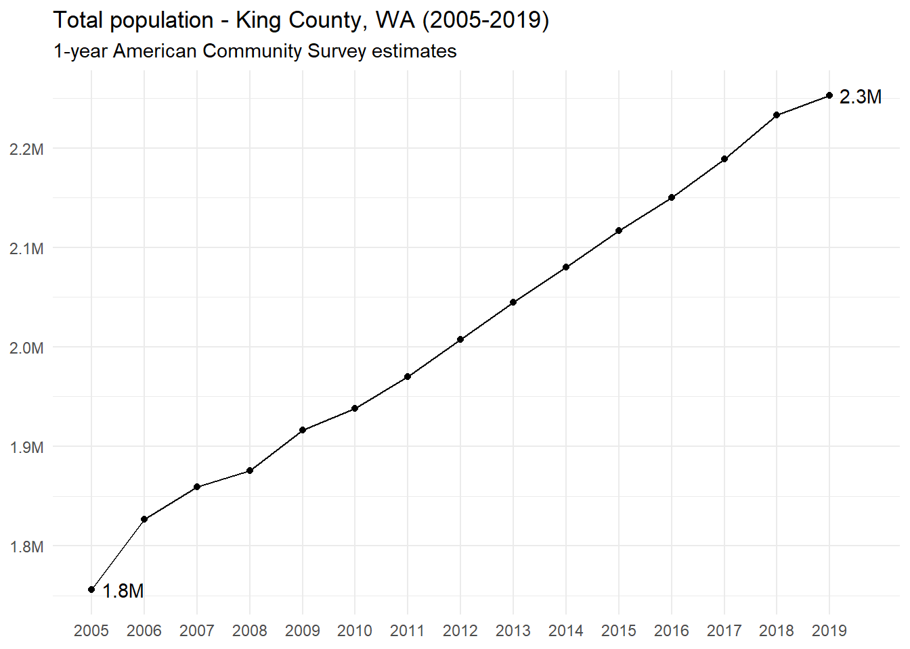

And here is a more interactive example from Italy made by [Eddie Hunsinger](https://www.linkedin.com/in/eddiehunsinger/): [https://shiny.demog.berkeley.edu/eddieh/lx_ndx_Italy/]{target="_blank"}, which we'll return to in week 3
</details>
<br>

## The balancing equation of population change

* Consider an observation period of length $T$
* For now, arbitrarily set the period's starting point at time $t = 0$

$\begin{align}
N(T) &= \textsf{ (Ending population size at time } T \textsf{)} \\
     &+ N(0) \textsf{ (Starting population size at time } 0 \textsf{)} \\
     &+ B[0,T] \textsf{ (Number of births from start to end)} \\
     &- D[0,T] \textsf{ (Number of deaths from start to end)} \\
     &+ I[0,T] \textsf{ (Number in-migrations from start to end)} \\
     &- O[0,T] \textsf{ (Number out-migrations from start to end)} \\
\end{align}$

<details>
<summary>Organized by ways to enter vs. exit a population... **Tap for answer**</summary>
$\begin{align}
N(T) &= N(0) \\
     &+ B[0,T] + I[0,T] \textsf{ (Ways to enter)} \\
     &- D[0,T] - O[0,T] \textsf{ (Ways to exit)}
\end{align}$
</details>
<br>

<details>
<summary>Organized by natural increase vs. net migration... **Tap for answer**</summary>
$\begin{align}
NI[0,T] &= B[0,T] - D[0,T] \textsf{ (Natural increase)} \\
NM[0,T] &= I[0,T] - O[0,T] \textsf{ (Net migration)}
\end{align}$
</details>
<br>

<details><summary>And putting it all together... **Tap for answer**</summary>
$N(T) = N[0] + NI[0,T] + NM[0,T]$
</details>
<br>

### Balancing equation as flows and stocks {.unnumbered}

* Boxes represent states that individuals in a population can be in
* Arrows represent a flow of individuals from one state to another

{width=100%}

### Balancing equation example: Sweden in 1988 {.unnumbered}

From PHG pg. 9 Box 1.2


```{=html}
<div id="htmlwidget-77d4f1d929b70c86411f" style="width:100%;height:auto;" class="datatables html-widget"></div>
<script type="application/json" data-for="htmlwidget-77d4f1d929b70c86411f">{"x":{"filter":"none","vertical":false,"data":[["Starting population","Births","Deaths","In-migrations","Out-migrations","Ending population"],["N(1988)","B[1988,1989]","D[1988,1989]","I[1988,1989]","O[1988,1989]","N(1989)"],["8,416,599","+ 112,080","– 96,756","+ 51,092","– 21,461","= 8,461,554"],[null,"Enters","Exits","Enters","Exits",null],[null,"Positive impact on NI[0,T]","Negative impact on NI[0,T]","Positive impact on NM[0,T]","Negative impact on NM[0,T]",null]],"container":"<table class=\"display\">\n  <thead>\n    <tr>\n      <th><\/th>\n      <th><\/th>\n      <th><\/th>\n      <th><\/th>\n      <th><\/th>\n    <\/tr>\n  <\/thead>\n<\/table>","options":{"ordering":false,"dom":"t","order":[],"autoWidth":false,"orderClasses":false,"rowCallback":"function(row, data, displayNum, displayIndex, dataIndex) {\nvar value=data[0]; $(this.api().cell(row, 0).node()).css({'font-weight':'bold'});\nvar value=data[1]; $(this.api().cell(row, 1).node()).css({'font-style':'italic','font-family':'MathJax TeX'});\nvar value=data[3]; $(this.api().cell(row, 3).node()).css({'color':value == \"Enters\" ? \"skyblue\" : value == \"Exits\" ? \"orange\" : null});\nvar value=data[4]; $(this.api().cell(row, 4).node()).css({'background-color':value == \"Positive impact on NI[0,T]\" ? \"skyblue\" : value == \"Negative impact on NI[0,T]\" ? \"orange\" : value == \"Positive impact on NM[0,T]\" ? \"skyblue\" : value == \"Negative impact on NM[0,T]\" ? \"orange\" : null});\n}"}},"evals":["options.rowCallback"],"jsHooks":[]}</script>
```

:::{.rmdtip}
**DEMOGRAPHY & DATA SCIENCE**

### Balancing equation analogy: A company's employees {#balancing-data-science .unnumbered}

Let's apply this lesson to a population a data scientist might work with:

<center>**A company's employee headcount grows**</center>

Think of analogies to the components of the balancing equation
<br><br>

<details>
<summary>Analogy to births $B[0,T]$? **Tap for answer**</summary>
New hires, BUT...

* Thinking about how birth vs. hiring happen, what's a weaknesses of this analogy?
* Thinking about how some new hires worked at the company before, what's another weakness of the analogy?
</details>
<br>

<details>
<summary>Analogies to deaths $D[0,T]$? **Tap for answer**</summary>
All-cause terminations, BUT...

* Thinking about the state "Death" below, what's a potential weakness of this analogy?
* Where could (at least some terminations) flow instead?

{width=100%}
</details>
<br>

<details>
<summary>Analogies to in-migrations $I[0,T]$ and out-migrations $O[0,T]$? **Tap for answer**</summary>
If the population is defined as employees at the company:

* Terminations who remain in the workforce (out-migration)
* Re-hires (in-migration)
* Hires from other companies (in-migration again)

If the population is defined as a subset of employees at company:

* Transfers into and out of departments, teams, job functions, etc.

</details>
<br>


**Example:** Below is random sample from a data table of employees from a real Russian company^[Documented here: https://www.kaggle.com/davinwijaya/employee-turnover]:

* **tenure** is the number of months the employee worked at the company
* **left_company** equal 1 if the employee terminated, 0 otherwise
* Notice the other attributes available like **gender** and **age**


```{=html}
<div id="htmlwidget-c0c50f7f61de3a163cd0" style="width:100%;height:auto;" class="datatables html-widget"></div>
<script type="application/json" data-for="htmlwidget-c0c50f7f61de3a163cd0">{"x":{"filter":"none","vertical":false,"data":[["1","2","3","4","5","6","7","8","9","10","11","12","13","14","15","16","17","18","19","20","21","22","23","24","25","26","27","28","29","30","31","32","33","34","35","36","37","38","39","40","41","42","43","44","45","46","47","48","49","50","51","52","53","54","55","56","57","58","59","60","61","62","63","64","65","66","67","68","69","70","71","72","73","74","75","76","77","78","79","80","81","82","83","84","85","86","87","88","89","90","91","92","93","94","95","96","97","98","99","100","101","102","103","104","105","106","107","108","109","110","111","112","113","114","115","116","117","118","119","120","121","122","123","124","125","126","127","128","129","130","131","132","133","134","135","136","137","138","139","140","141","142","143","144","145","146","147","148","149","150","151","152","153","154","155","156","157","158","159","160","161","162","163","164","165","166","167","168","169","170","171","172","173","174","175","176","177","178","179","180","181","182","183","184","185","186","187","188","189","190","191","192","193","194","195","196","197","198","199","200","201","202","203","204","205","206","207","208","209","210","211","212","213","214","215","216","217","218","219","220","221","222","223","224","225","226","227","228","229","230","231","232","233","234","235","236","237","238","239","240","241","242","243","244","245","246","247","248","249","250","251","252","253","254","255","256","257","258","259","260","261","262","263","264","265","266","267","268","269","270","271","272","273","274","275","276","277","278","279","280","281","282","283","284","285","286","287","288","289","290","291","292","293","294","295","296","297","298","299","300","301","302","303","304","305","306","307","308","309","310","311","312","313","314","315","316","317","318","319","320","321","322","323","324","325","326","327","328","329","330","331","332","333","334","335","336","337","338","339","340","341","342","343","344","345","346","347","348","349","350","351","352","353","354","355","356","357","358","359","360","361","362","363","364","365","366","367","368","369","370","371","372","373","374","375","376","377","378","379","380","381","382","383","384","385","386","387","388","389","390","391","392","393","394","395","396","397","398","399","400","401","402","403","404","405","406","407","408","409","410","411","412","413","414","415","416","417","418","419","420","421","422","423","424","425","426","427","428","429","430","431","432","433","434","435","436","437","438","439","440","441","442","443","444","445","446","447","448","449","450","451","452","453","454","455","456","457","458","459","460","461","462","463","464","465","466","467","468","469","470","471","472","473","474","475","476","477","478","479","480","481","482","483","484","485","486","487","488","489","490","491","492","493","494","495","496","497","498","499","500","501","502","503","504","505","506","507","508","509","510","511","512","513","514","515","516","517","518","519","520","521","522","523","524","525","526","527","528","529","530","531","532","533","534","535","536","537","538","539","540","541","542","543","544","545","546","547","548","549","550","551","552","553","554","555","556","557","558","559","560","561","562","563","564","565","566","567","568","569","570","571","572","573","574","575","576","577","578","579","580","581","582","583","584","585","586","587","588","589","590","591","592","593","594","595","596","597","598","599","600","601","602","603","604","605","606","607","608","609","610","611","612","613","614","615","616","617","618","619","620","621","622","623","624","625","626","627","628","629","630","631","632","633","634","635","636","637","638","639","640","641","642","643","644","645","646","647","648","649","650","651","652","653","654","655","656","657","658","659","660","661","662","663","664","665","666","667","668","669","670","671","672","673","674","675","676","677","678","679","680","681","682","683","684","685","686","687","688","689","690","691","692","693","694","695","696","697","698","699","700","701","702","703","704","705","706","707","708","709","710","711","712","713","714","715","716","717","718","719","720","721","722","723","724","725","726","727","728","729","730","731","732","733","734","735","736","737","738","739","740","741","742","743","744","745","746","747","748","749","750","751","752","753","754","755","756","757","758","759","760","761","762","763","764","765","766","767","768","769","770","771","772","773","774","775","776","777","778","779","780","781","782","783","784","785","786","787","788","789","790","791","792","793","794","795","796","797","798","799","800","801","802","803","804","805","806","807","808","809","810","811","812","813","814","815","816","817","818","819","820","821","822","823","824","825","826","827","828","829","830","831","832","833","834","835","836","837","838","839","840","841","842","843","844","845","846","847","848","849","850","851","852","853","854","855","856","857","858","859","860","861","862","863","864","865","866","867","868","869","870","871","872","873","874","875","876","877","878","879","880","881","882","883","884","885","886","887","888","889","890","891","892","893","894","895","896","897","898","899","900","901","902","903","904","905","906","907","908","909","910","911","912","913","914","915","916","917","918","919","920","921","922","923","924","925","926","927","928","929","930","931","932","933","934","935","936","937","938","939","940","941","942","943","944","945","946","947","948","949","950","951","952","953","954","955","956","957","958","959","960","961","962","963","964","965","966","967","968","969","970","971","972","973","974","975","976","977","978","979","980","981","982","983","984","985","986","987","988","989","990","991","992","993","994","995","996","997","998","999","1000","1001","1002","1003","1004","1005","1006","1007","1008","1009","1010","1011","1012","1013","1014","1015","1016","1017","1018","1019","1020","1021","1022","1023","1024","1025","1026","1027","1028","1029","1030","1031","1032","1033","1034","1035","1036","1037","1038","1039","1040","1041","1042","1043","1044","1045","1046","1047","1048","1049","1050","1051","1052","1053","1054","1055","1056","1057","1058","1059","1060","1061","1062","1063","1064","1065","1066","1067","1068","1069","1070","1071","1072","1073","1074","1075","1076","1077","1078","1079","1080","1081","1082","1083","1084","1085","1086","1087","1088","1089","1090","1091","1092","1093","1094","1095","1096","1097","1098","1099","1100","1101","1102","1103","1104","1105","1106","1107","1108","1109","1110","1111","1112","1113","1114","1115","1116","1117","1118","1119","1120","1121","1122","1123","1124","1125","1126","1127","1128","1129"],[7.030800821,52.27104723,44.48459959,66.69404517,29.96303901,9.034907598,12.68172485,51.94250513,61.07597536,2.102669405,18.16837782,3.58110883,37.38809035,20.56673511,65.3798768,42.48049281,43.95893224,10.38193018,26.4476386,90.51334702,53.48665298,11.76180698,26.94045175,0.525667351,92.64887064,89.36344969,19.18685832,103.3921971,26.57905544,1.478439425,105.9219713,16.65708419,5.94661191,10.61190965,40.3449692,58.80903491,24.08213552,49.80698152,16.75564682,38.01232033,4.041067762,16.82135524,6.143737166,32.45995893,14.48870637,4.960985626,10.02053388,49.70841889,23.12936345,7.589322382,7.030800821,8.147843943,3.449691992,30.22587269,5.9137577,42.94045175,4.960985626,34.03696099,29.07597536,20.30390144,19.28542094,71.22792608,95.21149897,73.42915811,44.55030801,7.852156057,45.37166324,5.092402464,1.938398357,12.8788501,32.32854209,23.52361396,81.83983573,3.975359343,43.99178645,14.22587269,53.58521561,39.72073922,63.11293634,86.83367556,13.5687885,33.3798768,89.19917864,139.0718686,36.73100616,20.96098563,85.09240246,6.439425051,19.71252567,18.1026694,9.790554415,24.24640657,10.7761807,133.9137577,53.81519507,42.90759754,11.79466119,16.82135524,42.25051335,57.23203285,2.168377823,44.94455852,19.74537988,7.950718686,29.70020534,16.42710472,53.2238193,79.86858316,79.54004107,59.00616016,11.72895277,27.36755647,78.32443532,58.21765914,45.73305955,86.66940452,80.06570842,48.45995893,20.99383984,8.180698152,59.40041068,20.92813142,10.90759754,15.14579055,41.65913758,2.201232033,2.234086242,43.92607803,9.49486653,96,86.04517454,2.135523614,14.6201232,9.034907598,116.7310062,53.35523614,7.162217659,33.97125257,32.88706366,24.41067762,92.64887064,7.852156057,43.4661191,81.83983573,49.87268994,0.919917864,35.38398357,16.32854209,101.5195072,20.30390144,54.9650924,96.72279261,94.78439425,56.73921971,70.34086242,19.18685832,26.02053388,79.11293634,59.20328542,22.73511294,90.90759754,18.49691992,11.03901437,37.32238193,26.54620123,10.11909651,46.78439425,12.5174538,26.21765914,103.5893224,60.25462012,8.180698152,39.88501027,61.99589322,15.70431211,42.57905544,8.410677618,96,8.607802875,64.19712526,58.94045175,95.44147844,2.792607803,25.23203285,21.88090349,11.69609856,14.71868583,33.01848049,132.8952772,47.96714579,9.889117043,72.41067762,33.28131417,114.1355236,22.73511294,57.65913758,13.40451745,45.73305955,1.18275154,4.501026694,13.40451745,13.17453799,5.848049281,15.34291581,82.75975359,49.28131417,103.5893224,12.32032854,2.694045175,28.15605749,29.30595483,7.589322382,19.44969199,51.31827515,29.70020534,24.83778234,41.69199179,44.22176591,59.86036961,2.792607803,20.04106776,9.790554415,4.336755647,54.01232033,38.53798768,160.0657084,2.102669405,22.66940452,23.45790554,5.289527721,50.20123203,76.68172485,11.26899384,4.402464066,50.72689938,14.45585216,144.5913758,26.11909651,13.33880903,11.07186858,6.275154004,33.57700205,67.4825462,15.14579055,44.97741273,4.468172485,80.49281314,23.6550308,25.33059548,84.04106776,18.7926078,2.201232033,20.04106776,94.12731006,59.86036961,8.180698152,13.73305955,6.078028747,12.02464066,34.95687885,12.02464066,55.12936345,70.17659138,1.708418891,86.6036961,7.589322382,52.96098563,59.20328542,99.77823409,86.6036961,11.23613963,54.07802875,7.030800821,45.30595483,11.53182752,59.89322382,73.98767967,5.585215606,0.887063655,51.1211499,1.18275154,19.1211499,23.9835729,23.19507187,30.68583162,9.790554415,22.07802875,23.45790554,73.3963039,3.449691992,97.44558522,21.61806982,17.11704312,70.93223819,6.176591376,155.1704312,3.58110883,45.30595483,31.34291581,7.326488706,26.80903491,67.35112936,4.369609856,15.57289528,24.27926078,38.17659138,16.85420945,59.20328542,26.87474333,81.18275154,7.12936345,45.07597536,112.788501,13.14168378,9.757700205,50.69404517,12.8788501,3.778234086,79.01437372,7.030800821,58.4476386,13.10882957,89.36344969,16.62422998,5.848049281,11.99178645,32.45995893,53.58521561,5.092402464,12.09034908,54.04517454,7.162217659,49.7412731,52.73100616,0.788501027,3.318275154,3.121149897,20.69815195,5.026694045,55.95071869,24.27926078,27.56468172,70.93223819,106.2176591,23.9835729,11.95893224,15.70431211,11.86036961,3.58110883,79.80287474,28.84599589,0.492813142,0.394250513,58.97330595,18.95687885,10.48049281,51.94250513,5.848049281,27.56468172,2.39835729,14.06160164,27.36755647,23.95071869,24.47638604,93.8973306,163.7782341,37.15811088,23.68788501,6.669404517,43.69609856,74.74332649,48.62422998,109.2402464,140.9445585,110.4887064,11.69609856,12.32032854,9.264887064,46.9486653,108.550308,57.52772074,73.13347023,2.759753593,8.969199179,57.65913758,2.102669405,16.95277207,60.78028747,8.213552361,13.66735113,7.819301848,12.78028747,11.92607803,39.22792608,140.2217659,22.66940452,34.95687885,11.66324435,11.49897331,3.58110883,10.7761807,5.256673511,16.62422998,7.523613963,86.66940452,36.73100616,37.78234086,5.092402464,11.76180698,23.9835729,15.73716632,142.4558522,23.03080082,25.98767967,2.135523614,17.11704312,49.47843943,78.68583162,24.83778234,91.99178645,52.10677618,50.72689938,33.93839836,27.4661191,17.18275154,16.65708419,12.32032854,39.26078029,49.28131417,94.78439425,133.8809035,15.11293634,26.67761807,16.95277207,26.94045175,4.862422998,9.790554415,16.06570842,18.49691992,45.53593429,77.53593429,22.47227926,15.11293634,7.950718686,32.32854209,34.56262834,22.63655031,45.5687885,5.35523614,133.9137577,42.18480493,3.811088296,5.026694045,17.80698152,8.772073922,16.06570842,17.93839836,15.86858316,3.811088296,8.574948665,82.82546201,3.252566735,82.7926078,133.8809035,43.8275154,35.74537988,14.22587269,2.168377823,3.975359343,30.78439425,13.86447639,32.95277207,10.94045175,1.80698152,14.58726899,21.35523614,32.88706366,9.790554415,35.84394251,5.125256674,23.9835729,9.691991786,19.44969199,25.52772074,1.642710472,16.95277207,105.8234086,8.969199179,35.84394251,3.811088296,32.32854209,2.266940452,5.32238193,81.24845996,118.8008214,155.3675565,93.9301848,6.866529774,163.8110883,12.05749487,2.858316222,15.01437372,39.26078029,28.58316222,33.90554415,1.117043121,8.772073922,3.121149897,24.3449692,40.31211499,55.95071869,43.26899384,32.52566735,20.46817248,16.65708419,52.862423,9.100616016,18.33264887,13.27310062,19.05544148,43.30184805,5.749486653,25.42915811,52.66529774,99.77823409,66.49691992,1.708418891,12.12320329,34.49691992,13.01026694,88.83778234,114.8583162,29.01026694,9.429158111,16.78850103,23.45790554,26.31622177,20.92813142,43.4661191,24.83778234,39.2936345,8.082135524,78.68583162,15.3100616,94.81724846,19.31827515,21.15811088,5.388090349,16.59137577,9.527720739,150.9979466,13.01026694,81.64271047,25.36344969,30.22587269,75.8275154,23.52361396,37.12525667,89.00205339,4.960985626,18.16837782,49.34702259,59.20328542,39.06365503,19.51540041,23.03080082,48.19712526,51.08829569,1.741273101,66.7926078,35.28542094,27.59753593,129.2813142,8.147843943,16,8.969199179,1.412731006,123.0718686,17.41273101,51.74537988,17.60985626,1.971252567,12.35318275,74.05338809,48.6899384,53.35523614,10.34907598,2.036960986,49.3798768,70.83367556,35.94250513,7.819301848,38.86652977,24.27926078,4.435318275,20.59958932,0.755646817,22.57084189,52.50102669,38.86652977,16.22997947,83.58110883,4.008213552,20.89527721,4.960985626,50.0698152,12.38603696,43.17043121,17.51129363,6.176591376,10.64476386,47.21149897,15.70431211,11.89322382,32.26283368,26.67761807,60.94455852,5.519507187,14.98151951,54.07802875,52.00821355,27.36755647,16.49281314,9.067761807,55.78644764,3.975359343,9.593429158,21.48665298,29.8973306,106.8418891,9.133470226,70.17659138,96.65708419,9.100616016,6.045174538,131.613963,3.482546201,24.21355236,42.18480493,47.6386037,4.928131417,38.89938398,44.02464066,64.29568789,57.10061602,10.51334702,4.533880903,4.435318275,13.10882957,3.482546201,11.49897331,11.69609856,59.76180698,10.61190965,84.89527721,23.45790554,9.823408624,27.33470226,52.73100616,5.420944559,53.97946612,9.626283368,43.86036961,2.825462012,24.90349076,12.22176591,11.72895277,3.975359343,46.35728953,128.0657084,70.93223819,40.57494867,38.70225873,48.6899384,9.330595483,4.073921971,5.092402464,13.07597536,15.40862423,103.7207392,22.37371663,14.85010267,53.42094456,21.65092402,164.5667351,15.21149897,2.234086242,17.60985626,113.8398357,53.19096509,12.81314168,79.86858316,12.25462012,34.59548255,113.0513347,8.640657084,40.37782341,8.180698152,8.016427105,33.41273101,32.45995893,88.90349076,7.852156057,34.0698152,19.51540041,49.31416838,20.89527721,15.17864476,45.8973306,123.6960986,17.93839836,3.252566735,50.29979466,104.0164271,21.88090349,15.70431211,17.51129363,109.1088296,70.50513347,64.75564682,31.96714579,2.36550308,10.84188912,4.533880903,31.50718686,8.27926078,21.88090349,19.84394251,6.53798768,27.40041068,23.55646817,150.1437372,1.149897331,7.12936345,8.936344969,110.0287474,23.9835729,8.772073922,52.73100616,10.51334702,36.33675565,27.86036961,17.57700205,7.950718686,5.650924025,7.852156057,7.162217659,2.858316222,129.8069815,95.96714579,18.13552361,27.92607803,118.899384,25.65913758,73.49486653,11.95893224,13.8973306,3.351129363,23.81930185,80.98562628,16,16.91991786,19.8110883,38.76796715,15.93429158,26.15195072,14.48870637,1.445585216,7.852156057,4.1724846,96.52566735,48.09856263,16.06570842,35.94250513,46.22587269,32.88706366,8.410677618,61.2073922,45.43737166,51.87679671,30.02874743,73.82340862,11.99178645,18.56262834,1.675564682,21.48665298,8.640657084,120.4435318,49.14989733,71.2936345,33.67556468,12.97741273,59.49897331,11.8275154,56.77207392,32.49281314,103.5893224,42.48049281,34.56262834,17.41273101,17.83983573,5.650924025,19.08829569,39.22792608,9.133470226,26.34907598,59.99178645,90.15195072,5.815195072,23.75359343,22.24229979,28.02464066,19.44969199,45.96303901,6.603696099,23.6550308,20.69815195,34.59548255,14.9486653,18.92402464,64.52566735,3.121149897,6.800821355,56.77207392,61.73305955,51.08829569,9.691991786,33.87268994,50.89117043,19.58110883,36.23819302,27.23613963,31.34291581,20.04106776,40.87063655,0.427104723,40.60780287,133.4209446,9.034907598,26.21765914,51.58110883,179.449692,2.135523614,142.75154,2.431211499,128.1314168,29.27310062,28.81314168,42.0862423,67.84394251,86.53798768,163.7782341,50.59548255,27.40041068,15.11293634,12.38603696,68.27104723,70.83367556,40.3449692,58.94045175,17.01848049,19.94250513,51.8110883,5.749486653,6.275154004,72.57494867,27.36755647,166.0780287,23.45790554,105.1663244,149.6180698,21.15811088,22.70225873,16.06570842,38.01232033,24.18069815,14.48870637,6.275154004,19.44969199,42.57905544,36.92813142,153.100616,73.49486653,11.8275154,12.64887064,40.04928131,107.1704312,19.44969199,22.24229979,0.689938398,138.9404517,23.95071869,0.492813142,39.22792608,34.82546201,73.29774127,16.22997947,34.29979466,38.76796715,22.73511294,123.3347023,7.819301848,5.453798768,55.22792608,36.96098563,108.8788501,49.80698152,2.759753593,33.93839836,42.61190965,45.30595483,8.344969199,36.00821355,4.76386037,23.55646817,3.482546201,73.65913758,12.78028747,16.95277207,3.252566735,37.09240246,13.8973306,2.792607803,1.80698152,68.27104723,11.03901437,20.76386037,115.5482546,23.2936345,13.17453799,5.782340862,45.79876797,96.59137577,32.85420945,20.59958932,23.2936345,63.70431211,11.53182752,21.88090349,7.195071869,2.431211499,55.72073922,81.64271047,28.35318275,80.65708419,4.993839836,132.8952772,25.06776181,24.0164271,41.69199179,2.98973306,23.88501027,17.57700205,28.35318275,27.59753593,78.91581109,3.975359343,59.17043121,12.68172485,38.01232033,35.77823409,26.18480493,144.7556468,85.48665298,15.93429158,50.98973306,34.03696099,6.669404517,26.0862423,36.59958932,132.4024641,2.759753593,72.67351129,80.16427105,10.11909651,32,63.14579055,36.59958932,86.83367556,25.98767967,3.975359343,55.95071869,3.58110883,85.48665298,51.84394251,19.35112936,20.92813142,18.00410678,9.199178645,13.10882957,6.242299795,5.158110883,23.95071869,57.62628337,16.78850103,45.37166324,37.9137577,64.75564682,30.12731006,60.94455852,2.135523614,166.275154,73.29774127,12.78028747,41.29774127,2.102669405,113.8398357,11.99178645,64.29568789,49.41273101,9.790554415,70.30800821,5.749486653,54.01232033,28.78028747,34.59548255,40.60780287,34.23408624,15.54004107,42.57905544,48.45995893,39.68788501,1.80698152,20.92813142,8.87063655,10.61190965,76.15605749,8.739219713,42.94045175,1.839835729,7.589322382,10.51334702,30.35728953,3.121149897,15.60574949,16.39425051,57.69199179,22.24229979,42.38193018,8.837782341,17.3798768,30.71868583,17.60985626,63.54004107,27.49897331,14.48870637,36.59958932,40.47638604,23.2936345,3.416837782,60.78028747,29.47022587,140.9445585,29.24024641,35.28542094,9.921971253,18.16837782,15.34291581,14.85010267,19.87679671,24.24640657,99.77823409,42.38193018,100.238193,57.82340862,5.585215606,17.24845996,1.347022587,16.62422998,21.88090349,55.12936345,15.93429158,8.31211499,15.57289528,59.99178645,19.18685832,23.68788501,40.31211499,26.21765914,123.3347023,50.72689938,33.57700205,18.95687885,94.9486653,39.22792608,16.65708419,7.227926078,11.30184805,22.01232033,7.589322382,82.82546201,0.492813142,26.94045175,14.58726899,48.45995893,51.31827515,61.73305955,22.73511294,1.938398357,31.14579055,17.08418891,6.800821355,41.29774127,66.69404517,23.45790554,40.11498973,14.55441478,45.30595483,11.00616016,79.54004107,1.117043121,50.23408624,23.9835729,6.176591376,90.51334702,49.31416838,44.78028747,130.9897331,61.79876797,48.19712526,3.876796715,12.97741273,22.9650924,87.68788501,11.56468172,52.79671458,53.09240246,13.8973306,13.9301848],[1,0,0,0,0,0,1,0,0,0,0,1,0,1,0,1,0,0,1,1,1,0,1,0,0,1,0,1,1,1,0,0,0,0,0,1,1,0,0,0,0,0,1,1,0,1,0,0,0,1,1,0,1,0,0,1,0,1,1,0,1,1,1,0,0,0,1,0,0,1,1,1,1,1,1,1,0,0,1,1,1,1,1,1,0,1,0,1,1,1,1,1,1,1,1,0,0,0,1,1,0,0,0,1,0,1,0,1,0,1,0,0,0,0,0,0,1,1,0,0,0,1,1,0,0,1,0,1,0,1,0,0,1,0,1,1,0,0,0,1,0,0,0,1,1,1,1,1,0,0,0,1,0,0,0,1,1,0,1,1,0,1,1,0,1,0,1,0,1,0,1,1,0,0,0,0,0,1,1,0,0,0,0,1,0,1,1,0,0,1,1,0,0,1,1,0,1,0,0,0,1,1,1,1,0,0,0,0,0,1,1,1,1,0,0,0,1,0,1,1,1,1,1,1,0,1,0,0,0,0,0,0,0,0,1,0,1,1,1,1,1,1,0,1,1,0,1,1,0,0,0,1,1,0,1,1,0,0,1,1,1,0,0,0,1,1,1,1,0,1,1,1,1,1,0,1,0,0,0,0,0,0,1,1,0,1,1,0,0,0,0,1,0,1,1,1,1,1,0,1,1,1,1,1,0,0,0,1,1,1,1,0,0,1,0,0,1,0,1,1,0,1,1,0,1,1,1,0,0,1,1,0,0,1,0,0,0,0,1,0,0,0,0,0,1,1,0,0,1,0,1,0,1,0,1,1,1,0,0,0,0,1,1,0,0,0,1,1,1,0,1,0,0,0,0,1,0,1,0,1,0,0,0,1,0,0,0,0,0,1,0,1,0,1,0,1,0,0,1,0,1,1,0,0,0,0,1,0,0,0,1,1,0,1,0,0,0,1,0,1,0,1,1,0,1,0,0,1,0,0,1,0,1,0,1,0,1,0,1,1,1,1,1,1,0,1,1,1,0,1,0,1,1,0,0,0,1,0,0,1,1,1,0,1,1,1,0,0,1,0,1,1,1,0,1,1,0,1,0,0,1,0,0,1,1,0,0,1,0,1,0,1,1,0,0,0,0,0,1,1,1,0,1,1,0,1,0,1,1,0,0,0,1,0,0,1,1,1,1,0,0,0,1,1,0,1,1,1,0,1,1,1,1,0,1,0,1,1,1,1,0,1,1,1,0,0,0,1,1,1,1,1,0,0,0,0,1,1,1,0,0,1,1,1,0,0,0,1,1,0,1,0,0,1,1,1,1,1,1,0,1,0,1,1,0,0,1,1,1,1,0,1,1,0,1,1,1,1,1,1,1,0,1,0,0,0,1,0,0,1,1,0,0,1,1,0,1,0,1,1,0,0,0,0,1,1,1,0,0,1,0,0,0,1,0,0,1,0,0,0,0,0,1,1,0,0,1,1,1,0,1,1,0,0,0,0,1,0,1,1,1,1,0,0,0,1,0,1,1,0,1,1,0,0,0,1,0,1,1,0,1,1,0,0,0,1,0,1,0,1,1,1,0,0,0,1,0,1,1,0,0,0,0,1,0,1,0,0,1,0,1,1,0,0,0,0,0,0,1,0,1,0,1,1,0,1,0,1,1,0,0,1,0,0,1,0,1,1,1,0,0,0,1,0,1,0,0,1,1,0,0,0,1,1,1,1,1,1,1,1,1,1,1,1,0,1,0,0,0,0,1,1,0,1,1,0,1,0,0,1,1,0,1,0,0,0,1,1,1,1,0,1,1,0,1,1,0,1,1,1,1,0,1,1,0,0,0,0,1,0,0,0,0,1,1,1,1,0,1,0,0,1,0,1,1,1,0,0,1,1,1,0,0,1,1,1,0,1,1,1,0,0,0,0,1,0,0,0,0,1,1,0,1,0,0,0,1,1,1,0,1,1,0,1,1,0,0,1,1,0,0,1,0,0,0,1,0,0,0,0,1,0,1,1,0,0,1,1,1,0,0,1,0,1,0,1,1,0,1,1,1,0,0,0,1,1,0,0,1,0,1,0,0,0,1,0,1,1,0,1,1,1,1,0,1,1,0,0,1,1,1,1,0,1,1,0,0,0,0,0,0,1,0,1,1,0,0,1,1,1,1,1,1,1,0,1,1,0,1,0,1,1,0,0,1,1,1,0,1,0,0,1,0,1,0,0,1,0,1,0,1,0,1,0,0,0,1,0,1,1,0,0,1,0,0,1,0,0,0,1,0,1,1,1,1,0,0,1,1,0,1,1,0,1,0,0,0,0,1,1,1,0,1,1,1,0,0,0,1,0,1,0,0,0,0,1,0,0,1,0,1,0,1,1,1,0,0,0,0,1,0,1,0,1,1,0,1,0,1,1,0,0,1,0,1,0,0,0,0,0,0,1,1,1,0,1,1,0,1,1,1,0,1,1,1,0,0,1,0,1,1,0,1,1,0,0,1,1,0,0,0,0,1,0,0,0,0,1,1,0,1,0,1,1,1,1,1,1,1,0,0,1,1,1,0,0,0,1,0],["f","m","m","f","m","f","f","m","m","f","f","f","f","m","m","f","f","f","f","f","m","f","f","f","f","f","f","f","f","m","f","m","f","f","f","f","f","m","f","f","f","f","f","f","m","f","m","m","f","m","m","f","f","m","f","m","f","f","f","f","f","f","f","f","f","f","f","f","f","f","f","f","m","f","m","f","f","f","m","f","f","f","m","f","f","f","f","m","f","f","f","f","f","m","f","f","f","f","f","f","f","m","f","f","m","f","f","m","m","m","f","f","f","f","f","f","f","f","f","m","f","m","f","f","f","f","f","f","f","m","f","m","m","f","m","f","f","f","f","f","f","f","m","f","f","m","f","f","f","f","m","m","f","f","f","f","m","m","f","f","m","f","f","m","f","f","f","m","f","f","f","f","m","m","f","f","m","f","f","m","m","f","f","f","f","f","f","f","f","f","f","f","f","f","f","f","f","f","f","m","f","m","f","f","f","f","f","m","m","f","f","m","f","f","m","f","f","f","f","m","f","f","f","m","m","f","f","f","f","f","f","f","f","m","m","f","m","f","f","f","f","f","f","m","m","f","f","f","f","m","m","m","f","f","f","f","f","f","m","m","m","f","f","m","f","m","f","f","f","f","m","f","m","f","f","f","m","m","f","f","f","m","f","f","f","f","m","f","f","f","f","m","f","f","f","f","f","f","f","f","f","f","f","f","m","m","m","f","f","f","f","f","m","m","m","m","f","f","m","f","m","m","f","m","f","f","m","f","f","m","f","f","m","f","f","f","f","f","f","f","m","m","m","f","f","f","f","f","f","m","m","f","m","m","m","f","f","f","f","m","f","m","f","f","m","m","m","f","m","f","f","f","f","f","f","f","m","f","f","m","m","f","f","f","f","f","f","f","f","f","f","f","f","f","m","m","m","f","f","f","f","m","f","f","f","f","f","f","f","m","f","f","f","f","f","f","m","f","f","f","f","f","f","f","f","f","f","f","f","f","m","f","f","f","f","f","f","f","f","m","f","f","f","f","f","m","f","f","f","m","f","f","f","m","f","f","f","m","f","m","f","f","m","m","f","f","f","f","f","f","f","m","m","f","f","m","f","f","f","m","f","f","m","f","f","f","f","f","f","f","m","f","f","f","f","f","f","f","m","f","f","f","f","f","f","f","f","f","f","f","f","f","f","f","m","f","f","m","f","f","f","m","f","f","f","f","f","f","f","m","f","f","f","m","f","f","f","f","f","f","m","f","f","f","f","m","m","f","f","m","f","f","f","f","m","f","f","f","m","f","f","m","f","f","f","f","f","f","f","m","f","f","m","f","f","f","f","f","f","m","f","m","m","f","f","f","f","f","f","f","m","f","f","m","f","f","f","f","m","f","m","m","f","m","f","f","f","f","f","f","f","f","f","f","f","f","f","f","f","f","f","f","f","f","f","f","f","f","f","f","f","f","f","f","f","f","f","f","f","m","f","m","m","m","m","f","m","m","f","m","f","f","f","m","f","f","m","f","f","m","m","f","f","f","f","m","f","f","f","f","f","m","f","f","f","f","f","f","f","f","f","m","m","f","f","f","f","f","f","f","m","f","f","f","f","f","f","f","m","m","f","f","f","f","f","m","f","f","f","f","m","f","f","f","f","f","f","f","f","f","m","f","f","f","m","m","f","f","f","f","f","f","m","f","f","f","f","f","f","m","f","f","f","f","f","f","f","f","f","f","f","f","f","m","m","m","f","f","m","f","f","m","f","m","f","m","m","f","f","f","f","f","f","m","m","f","m","f","f","f","f","f","f","f","m","f","f","f","f","f","m","f","f","m","f","f","f","f","m","f","f","f","f","f","f","m","f","f","f","f","f","m","m","f","m","m","f","f","f","m","f","f","m","f","m","f","f","f","m","f","f","f","f","f","m","f","m","f","f","f","f","f","f","m","f","f","f","f","f","m","f","m","f","f","f","f","f","f","f","f","f","f","f","f","f","m","f","m","f","f","f","f","f","f","m","f","m","m","f","f","f","m","m","f","f","f","f","f","f","f","f","m","f","f","m","f","m","m","m","f","f","f","m","f","f","f","m","f","f","f","f","f","f","m","f","f","f","f","f","f","f","f","f","f","f","f","m","f","f","m","f","f","f","f","f","f","f","f","f","m","f","f","f","f","f","f","f","f","f","f","m","f","f","m","f","m","f","f","f","f","f","m","f","f","f","f","f","f","f","m","m","f","f","f","f","f","m","m","m","m","f","f","f","m","f","f","f","f","m","f","f","m","m","f","f","f","f","f","f","f","m","m","f","f","f","f","f","m","m","f","f","m","f","m","f","f","m","f","m","f","f","f","m","f","f","f","f","m","f","f","f","m","f","f","m","f","f","f","f","f","f","f","f","f","f","m","m","m","f","f","f","f","f","f","f","f","f","m","m","f","f","f","f","f","m","f","f","f","f","f","f","f","f","f","f","f","f","f","f","f","m","f","m","m","f","f","f","f","m","m","f","f","f","f","m","f","m","f","f","m","f","m","f","f","f","m","m","f","m","m","f","f","f","f","f","m","f","f","m","f","f","f","m","f","m","f","f","f","f"],[39,27,22,32,32,30,36,33,29,38,24,40,20,33,32,42,38,34,27,22,41,39,24,49,25,22,43,27,28,28,28,29,38,41,29,32,42,34,31,25,41,32,31,32,30,37,38,26,23,36,35,42,40,33,32,23,42,27,22,45,38,23,22,29,30,23,29,29,26,23,31,36,34,29,26,28,40,30.40033257,32,29,33,38,18,32,24,24,26,24,23,44,41,23,35,19,30.40033257,24,29,32,18,36,26,33,33,34,47,26,23,23,23,36,27,26,27,35,33,25,45,34,26,30,24,23,32,39,29,33,26,32,26,31,35,38,39,30,38,27,23,25,26,27,25,27,28,29,30.40033257,26,31,37,32,45,22,30,31,34,31,25,25,28,25,34,32,46,37,25,27,30,23,48,36,25,22,24,22,31,34,26,24,22,29,19,46,25,41,30,38,25,36,23,32,33,25,30,40,38,34,33,30.40033257,33,25,24,30.40033257,28,23,30,20,33,21,28,29,25,25,47,40,43,47,29,21,29,27,39,22,41,26,37,40,24,38,31,29,25,31,25,43,40,38,33,30,31,33,43,30.40033257,25,36,22,29,35,25,37,32,28,30,23,25,25,27,24,29,35,30,26,30,37,31,30,33,47,36,25,26,33,26,30,35,34,31,27,33,37,30,28,50,39,23,30,37,41,52,29,43,30,28,37,31,26,38,33,40,34,22,23,34,40,30,24,45,33,28,25,26,31,21,28,23,42,37,32,23,46,29,39,24,26,22,24,23,27,40,40,29,25,30,39,40,45,43,25,32,27,26,28,27,41,26,23,29,35,34,25,40,34,31,29,36,25,36,28,49,33,26,25,56,30,32,27,23,23,38,24,27,36,25,40,22,26,25,25,36,23,22,27,24,22,31,42,33,38,38,33,30,27,30,35,27,37,27,32,38,37,26,32,31,34,23,39,25,24,34,29,39,32,27,18,24,23,26,31,31,31,34,39,30,28,27,31,24,26,26,37,33,31,19,45,32,38,44,27,41,50,32,39,24,29,23,34,29,31,36,25,34,19,27,23,26,23,46,28,40,42,33,38,23,35,23,19,27,35,31,26,29,41,22,24,33,26,21,31,27,41,27,23,23,35,38,27,44,38,32,26,27,32,49,39,25,27,34,30,29,45,19,36,38,30,37,21,23,54,32,41,36,29,40,51,48,31,29,38,33,39,34,26,33,32,22,42,26,38,37,39,38,34,25,26,28,36,21,29,24,23,22,42,21,33,31,31,30.40033257,28,49,38,22,23,19,25,31,32,33,23,36,38,32,42,24,42,25,31,31,24,39,28,24,31,23,26,33,46,28,42,29,28,45,32,41,31,39,21,25,27,37,48,22,23,33,21,32,45,30,26,43,30,35,27,35,33,22,27,42,37,36,42,39,34,26,31,24,24,35,19,30.40033257,23,33,31,29,26,34,54,27,29,34,27,26,22,22,31,36,26,44,26,37,23,27,40,23,36,26,44,26,28,23,40,26,37,26,36,38,40,31,29,26,32,45,44,28,25,29,32,24,27,22,29,38,43,26,29,33,25,23,26,47,21,44,34,31,25,37,43,27,30,26,41,21,37,33,25,38,34,30,25,29,24,41,32,25,30,41,34,31,42,33,45,31,32,24,35,21,37,41,34,39,29,24,35,29,28,30.40033257,31,29,29,38,29,26,43,31,33,30,27,24,25,23,27,45,37,32,31,25,39,45,41,39,38,22,33,23,25,31,51,33,29,27,24,22,32,26,35,26,21,41,31,30,29,27,28,24,25,28,38,29,26,32,25,35,19,22,26,27,24,36,31,23,28,28,31,42,26,23,35,36,40,21,42,31,27,39,42,36,37,22,36,31,20,25,34,46,34,38,36,22,26,40,34,25,43,25,41,31,36,23,31,34,22,34,23,32,27,22,22,35,24,33,29,37,36,38,24,26,27,28,32,35,23,31,24,23,23,44,22,45,24,24,23,23,29,40,23,23,34,24,26,26,30,27,34,30,24,26,28,33,23,30,28,31,26,49,43,33,24,36,29,33,22,34,24,30,34,29,37,27,24,35,34,21,34,22,30,29,28,48,32,34,28,27,37,34,35,45,30,32,28,30,27,38,39,37,23,23,26,24,37,26,19,32,28,32,27,46,58,26,29,37,31,38,27,35,29,31,31,37,31,32,28,28,36,45,26,25,26,26,21,29,22,36,35,22,21,27,22,35,24,27,27,30,24,25,41,35,26,30,22,32,33,24,23,29,40,34,29,34,45,23,40,44,21,21,40,34,23,29,29,34,35,34,25,38,26,24,24,22,32,21,24,44,51,41,22,26,37,31,34,33,24,38,30,34,25,27,22,38,41,24,34,25,32,22,36,30,32,54,28,28,46,36,24,24,32,41,31,27,30,33,26,29,39,33,29,26,42,23,20,24,33,29,29,30,42,26,23,25,32,37,27,32,38,37,35,29,24,31,22,24,29,36,22,38,24,36,26,37,38,26,34,37,47,23,29,21,34,35,28,23,34,26,21,34,25,22,32,29,41,30,34,41,34,54,38,23,38,22,42,36,31,22,39,21,29,33,29,41,29,23,38,27],["State","Retail","IT","Telecom","IT","IT","PowerGeneration","PowerGeneration","IT","Retail","Retail","Banks","etc","Banks","etc","Consult","Retail","etc","IT","IT","IT","transport","Pharma","Telecom","manufacture","PowerGeneration","Consult","Banks","Banks","transport","Retail","Mining","Retail","Banks","manufacture","transport","transport","manufacture","etc","manufacture","manufacture","Retail","manufacture","Banks","etc","State","Agriculture","Mining","Retail","Mining","Retail","Banks","Retail","Retail","Retail","Banks","IT","Retail","etc","State","Retail","Consult","State","Retail","manufacture","transport","etc","Retail","Banks","Building","transport","manufacture","Retail","Retail","etc","State","RealEstate","Banks","Mining","manufacture","manufacture","manufacture","Retail","State","PowerGeneration","Retail","transport","manufacture","Retail","Retail","Retail","Building","transport","manufacture","State","Banks","Retail","Pharma","Banks","Building","Banks","Retail","Pharma","Banks","IT","etc","Consult","Banks","IT","Retail","PowerGeneration","Banks","Consult","Telecom","PowerGeneration","manufacture","Retail","manufacture","Consult","IT","Retail","Banks","Building","etc","Retail","Banks","Banks","transport","IT","Retail","etc","manufacture","manufacture","IT","Retail","Retail","Consult","Banks","IT","Building","manufacture","Telecom","manufacture","Telecom","State","etc","Retail","Pharma","IT","State","Banks","Retail","Retail","HoReCa","manufacture","Consult","Retail","IT","Banks","Retail","IT","Building","Retail","etc","Retail","RealEstate","Retail","manufacture","etc","Retail","Building","IT","etc","Banks","Retail","Banks","IT","etc","Banks","IT","Consult","Retail","manufacture","Retail","manufacture","manufacture","Banks","etc","manufacture","Banks","Consult","Retail","State","Mining","Retail","PowerGeneration","etc","PowerGeneration","Retail","Consult","etc","Telecom","Banks","Banks","Telecom","PowerGeneration","Retail","IT","PowerGeneration","etc","IT","manufacture","Banks","Pharma","IT","Retail","transport","Retail","Retail","Banks","Retail","Retail","manufacture","IT","IT","Telecom","Retail","etc","etc","State","manufacture","Mining","manufacture","State","manufacture","Retail","Retail","manufacture","manufacture","Pharma","Retail","etc","Retail","PowerGeneration","Consult","manufacture","Consult","transport","Retail","IT","Banks","State","manufacture","Retail","Retail","Consult","manufacture","HoReCa","Retail","Mining","Retail","Consult","Retail","IT","HoReCa","manufacture","manufacture","Banks","transport","HoReCa","IT","State","Banks","Retail","transport","Retail","Telecom","IT","IT","Retail","Pharma","Retail","Agriculture","Banks","IT","Retail","Consult","Retail","IT","IT","Banks","manufacture","transport","manufacture","transport","Pharma","Banks","Retail","Consult","Consult","Banks","manufacture","Banks","Retail","manufacture","Retail","IT","Banks","Consult","RealEstate","Consult","IT","Retail","etc","Retail","State","Building","manufacture","Retail","State","etc","etc","PowerGeneration","IT","Banks","Retail","etc","RealEstate","Retail","Building","Telecom","transport","IT","manufacture","etc","Banks","IT","manufacture","Banks","Mining","transport","Agriculture","Pharma","Retail","Mining","Telecom","Retail","Retail","Banks","IT","Retail","Retail","IT","Retail","etc","Consult","manufacture","manufacture","HoReCa","Retail","Retail","Retail","manufacture","Building","manufacture","Retail","Retail","manufacture","State","IT","Retail","manufacture","State","Building","Pharma","manufacture","manufacture","Retail","State","Building","State","Retail","IT","manufacture","PowerGeneration","Retail","Retail","PowerGeneration","transport","Retail","Retail","Consult","Retail","Retail","Retail","IT","Retail","Telecom","Banks","Retail","etc","IT","Retail","etc","manufacture","PowerGeneration","Building","Retail","transport","Retail","Agriculture","Retail","Retail","IT","Banks","transport","Retail","Banks","IT","Banks","Retail","manufacture","Retail","Consult","Retail","manufacture","Retail","Retail","PowerGeneration","Retail","manufacture","State","etc","Retail","transport","manufacture","Retail","Building","etc","Mining","etc","Banks","Retail","Banks","manufacture","Retail","PowerGeneration","Mining","Retail","manufacture","PowerGeneration","etc","Banks","Telecom","etc","Retail","IT","manufacture","Retail","Agriculture","Banks","HoReCa","Retail","manufacture","etc","Retail","IT","Banks","Retail","Agriculture","IT","Consult","IT","Banks","Telecom","RealEstate","Pharma","Retail","PowerGeneration","Consult","Agriculture","RealEstate","manufacture","Consult","etc","Retail","IT","State","PowerGeneration","etc","PowerGeneration","State","Banks","Mining","Telecom","RealEstate","IT","etc","manufacture","Retail","Building","IT","Retail","Consult","Retail","Pharma","Retail","Consult","Retail","manufacture","etc","Consult","Building","Consult","Mining","Telecom","Retail","Banks","Mining","IT","Banks","manufacture","Consult","manufacture","transport","Building","etc","HoReCa","Building","etc","transport","Retail","Building","PowerGeneration","etc","Retail","Building","manufacture","Pharma","transport","IT","manufacture","Banks","State","Retail","IT","Retail","Retail","IT","IT","Banks","Banks","Retail","manufacture","Retail","Telecom","manufacture","manufacture","Retail","IT","Retail","Consult","Banks","manufacture","Retail","Retail","manufacture","transport","Consult","Banks","Consult","Retail","manufacture","RealEstate","Retail","manufacture","Banks","Retail","manufacture","etc","Banks","Banks","Retail","manufacture","IT","IT","Consult","PowerGeneration","etc","Banks","Consult","State","manufacture","manufacture","Consult","manufacture","Retail","RealEstate","manufacture","Retail","Retail","State","transport","Consult","IT","Telecom","Banks","Mining","transport","Retail","Telecom","HoReCa","Mining","Banks","manufacture","IT","Retail","Retail","manufacture","etc","Retail","IT","Retail","etc","Retail","Retail","State","Retail","IT","Telecom","IT","Retail","Retail","State","Banks","Telecom","IT","transport","PowerGeneration","IT","IT","manufacture","State","Retail","Building","Agriculture","etc","Agriculture","Agriculture","IT","Banks","Telecom","Banks","State","IT","Retail","Building","etc","manufacture","manufacture","etc","Consult","Retail","Telecom","manufacture","Retail","Consult","Retail","Retail","manufacture","manufacture","Banks","Retail","IT","Banks","Retail","manufacture","etc","State","Retail","IT","manufacture","Mining","Building","Telecom","Mining","Banks","Banks","Retail","manufacture","Building","Retail","Consult","Retail","Banks","Retail","manufacture","Consult","IT","Retail","Retail","State","Retail","manufacture","Retail","Consult","IT","Retail","etc","manufacture","Retail","HoReCa","Banks","Retail","Retail","Retail","transport","Retail","manufacture","Consult","Consult","Building","Consult","Retail","IT","Retail","manufacture","Retail","Consult","State","Consult","Pharma","IT","IT","State","Retail","Agriculture","Retail","manufacture","Retail","manufacture","manufacture","Banks","manufacture","IT","Retail","transport","Building","State","Retail","PowerGeneration","Consult","Telecom","Retail","Retail","Banks","Retail","Consult","Building","Retail","HoReCa","etc","Agriculture","Banks","Retail","Building","Retail","IT","Telecom","etc","IT","State","Retail","Banks","etc","IT","Retail","etc","etc","Agriculture","Banks","Retail","Retail","manufacture","Telecom","State","manufacture","Retail","Retail","PowerGeneration","manufacture","Consult","State","State","etc","Retail","Retail","Consult","Retail","Retail","Retail","IT","Pharma","Retail","IT","transport","Retail","Telecom","Retail","Banks","IT","IT","manufacture","RealEstate","manufacture","manufacture","Building","Retail","Retail","Consult","etc","Consult","IT","etc","State","PowerGeneration","Retail","Retail","IT","Telecom","Retail","etc","Consult","Retail","IT","IT","Retail","Retail","Mining","etc","manufacture","Retail","Banks","Retail","IT","Building","Pharma","Retail","State","Building","State","Retail","manufacture","Consult","State","Pharma","etc","Banks","Banks","etc","Banks","manufacture","etc","etc","PowerGeneration","IT","IT","Banks","Building","Retail","RealEstate","Consult","Retail","Retail","Retail","manufacture","etc","Banks","etc","Banks","State","IT","Retail","Banks","IT","PowerGeneration","etc","etc","Retail","Mining","RealEstate","Banks","Retail","Retail","etc","Retail","Retail","manufacture","Banks","Retail","Banks","Retail","PowerGeneration","IT","State","Banks","manufacture","Agriculture","Retail","transport","Retail","etc","transport","Retail","etc","manufacture","Retail","IT","Retail","manufacture","etc","etc","Building","Banks","etc","Mining","Telecom","Retail","Consult","Telecom","Retail","etc","etc","Retail","manufacture","IT","manufacture","transport","manufacture","IT","Telecom","Banks","Retail","Banks","Building","manufacture","manufacture","manufacture","transport","manufacture","Telecom","Retail","Banks","Consult","Retail","Retail","Retail","Retail","PowerGeneration","manufacture","IT","etc","manufacture","Retail","PowerGeneration","Consult","Retail","Banks","Banks","IT","Retail","Banks","etc","State","RealEstate","IT","Mining","Retail","Mining","Consult","Retail","etc","Retail","Retail","IT","Retail","manufacture","manufacture","IT","PowerGeneration","Consult","Consult","Banks","etc","Banks","etc","Telecom","Consult","manufacture","IT","manufacture","Retail","Retail","etc","Pharma","etc","Retail","State","Retail","Consult","Retail","PowerGeneration","Retail","IT","Retail","Retail","Retail","IT","IT","Retail","Mining","IT","Retail","Consult","Building","Banks","Retail","manufacture","State","Retail","etc","manufacture","transport","IT","Retail","Building","Retail","IT","manufacture","Banks","Consult","manufacture","Banks","Building","etc","Retail","Retail","transport","IT","Building","PowerGeneration","Banks","Building","Retail","Consult","IT","Consult","PowerGeneration","PowerGeneration","manufacture","State","etc","Consult","Retail","Retail","IT","Building","Retail","Banks","manufacture","Consult","PowerGeneration","State","Retail","Retail","Retail","manufacture","manufacture","etc","Banks","manufacture","IT","etc","Retail","Retail","manufacture","State","Building","manufacture","manufacture","Banks","Retail","State","Retail","IT","manufacture","State","Retail","Banks","Retail","Banks","manufacture","Pharma","Telecom","etc","IT","Telecom","Retail","Consult","HoReCa","Pharma","etc","Agriculture","transport","State","IT","etc","IT","IT","manufacture","IT","Consult","Banks","Consult","IT","Retail","Retail","State","manufacture"],["car","bus","foot","car","bus","bus","bus","car","bus","car","bus","bus","bus","car","car","bus","bus","car","bus","bus","bus","bus","bus","car","foot","bus","foot","car","foot","bus","bus","foot","car","bus","foot","car","bus","car","bus","bus","bus","bus","car","bus","car","foot","car","car","bus","foot","foot","bus","car","car","bus","bus","bus","car","bus","bus","car","bus","bus","foot","car","bus","bus","bus","foot","bus","bus","foot","car","bus","bus","bus","foot","bus","bus","car","car","bus","bus","bus","bus","bus","bus","car","bus","bus","bus","bus","car","car","foot","bus","bus","bus","bus","bus","foot","bus","bus","car","bus","bus","foot","bus","car","bus","bus","car","bus","bus","car","bus","bus","car","bus","car","bus","bus","car","bus","bus","car","foot","bus","foot","bus","car","car","car","bus","car","foot","foot","bus","bus","bus","foot","bus","car","foot","bus","bus","bus","car","bus","bus","bus","car","foot","car","bus","bus","car","bus","bus","car","car","car","car","car","bus","car","car","bus","foot","bus","car","foot","bus","car","car","car","bus","foot","bus","bus","bus","bus","bus","bus","foot","car","bus","bus","bus","bus","bus","bus","bus","bus","car","car","bus","car","bus","bus","bus","car","bus","bus","foot","car","bus","foot","bus","bus","bus","bus","bus","car","bus","car","foot","bus","bus","bus","bus","bus","car","bus","car","bus","car","bus","car","bus","car","car","car","foot","car","bus","bus","bus","car","car","bus","foot","bus","bus","car","car","bus","bus","bus","bus","bus","bus","car","car","car","bus","bus","bus","car","car","car","bus","bus","bus","bus","bus","car","bus","bus","bus","bus","foot","bus","bus","bus","car","car","bus","bus","car","car","car","bus","car","bus","bus","foot","bus","bus","bus","car","bus","bus","bus","bus","car","bus","bus","foot","bus","bus","car","bus","foot","car","bus","bus","bus","bus","bus","bus","bus","car","bus","bus","car","bus","bus","car","car","bus","car","bus","bus","bus","bus","car","foot","bus","bus","foot","bus","car","bus","bus","car","car","bus","bus","car","bus","car","bus","bus","bus","foot","car","car","bus","bus","bus","bus","foot","bus","car","bus","bus","bus","car","car","bus","car","car","bus","bus","car","bus","bus","bus","bus","car","bus","foot","foot","bus","car","bus","bus","car","car","bus","bus","bus","bus","car","car","foot","car","bus","car","car","bus","bus","car","car","car","bus","foot","bus","car","bus","car","bus","bus","bus","bus","bus","bus","bus","bus","bus","bus","bus","bus","foot","bus","bus","bus","bus","car","bus","car","bus","foot","bus","bus","car","car","car","foot","car","bus","bus","foot","car","car","bus","bus","bus","foot","bus","car","car","car","bus","car","bus","foot","car","car","bus","bus","bus","bus","bus","bus","bus","car","bus","bus","car","bus","bus","car","bus","bus","bus","foot","bus","car","bus","foot","car","foot","bus","car","bus","bus","foot","bus","bus","car","foot","bus","bus","foot","bus","car","foot","bus","car","bus","bus","bus","bus","foot","bus","car","car","bus","car","car","car","bus","bus","car","car","bus","bus","foot","foot","bus","bus","bus","foot","car","car","bus","car","bus","bus","bus","bus","bus","bus","bus","bus","foot","car","bus","car","bus","foot","bus","bus","bus","bus","bus","bus","bus","foot","car","bus","bus","bus","bus","bus","car","bus","bus","foot","bus","bus","car","car","bus","foot","car","car","bus","bus","bus","bus","bus","bus","bus","bus","car","bus","bus","bus","bus","bus","car","car","bus","bus","car","bus","bus","bus","car","car","car","bus","bus","bus","bus","car","car","bus","bus","car","car","bus","car","bus","bus","car","bus","car","car","bus","bus","bus","bus","car","bus","bus","bus","bus","car","bus","foot","car","bus","bus","bus","car","car","bus","bus","car","car","bus","bus","bus","bus","bus","car","bus","bus","car","car","car","car","bus","bus","bus","car","bus","car","bus","bus","car","bus","bus","bus","car","foot","bus","car","car","car","car","bus","bus","bus","bus","car","bus","bus","car","bus","bus","car","bus","bus","bus","bus","bus","bus","car","bus","bus","bus","car","bus","car","car","bus","car","car","bus","car","car","foot","bus","bus","bus","car","bus","bus","car","car","bus","foot","bus","bus","bus","bus","bus","bus","car","bus","bus","bus","foot","car","car","bus","bus","bus","bus","car","car","bus","car","bus","foot","bus","bus","bus","bus","bus","bus","foot","car","bus","car","car","car","foot","bus","foot","car","bus","car","bus","bus","bus","car","bus","bus","car","bus","bus","car","bus","foot","bus","bus","bus","car","bus","car","car","bus","bus","bus","bus","car","bus","foot","bus","bus","car","bus","bus","bus","bus","bus","bus","car","bus","bus","bus","bus","bus","car","bus","car","bus","bus","car","foot","car","bus","bus","car","car","bus","bus","bus","bus","car","bus","bus","car","car","car","foot","car","car","bus","bus","car","bus","bus","bus","bus","foot","foot","bus","foot","bus","car","car","bus","foot","foot","bus","bus","bus","car","bus","car","bus","car","bus","car","bus","foot","bus","car","bus","car","car","bus","foot","car","bus","foot","car","bus","bus","bus","bus","bus","car","bus","car","car","bus","bus","bus","foot","car","bus","bus","car","bus","bus","car","bus","bus","bus","car","bus","car","car","bus","car","bus","car","bus","car","bus","bus","car","bus","car","bus","foot","bus","car","bus","bus","car","bus","foot","bus","bus","car","bus","bus","car","bus","foot","car","bus","car","bus","car","bus","bus","car","bus","bus","bus","bus","bus","car","bus","bus","bus","bus","bus","foot","bus","bus","bus","bus","foot","foot","bus","bus","bus","car","car","car","bus","bus","bus","car","car","foot","bus","foot","bus","bus","bus","bus","bus","car","bus","bus","bus","bus","car","bus","bus","bus","bus","bus","foot","bus","bus","bus","bus","bus","bus","car","bus","bus","bus","car","bus","bus","car","bus","bus","car","foot","car","foot","bus","car","bus","foot","bus","foot","bus","bus","car","foot","bus","bus","bus","bus","bus","foot","bus","bus","bus","bus","bus","foot","bus","car","car","car","bus","bus","bus","foot","bus","bus","bus","bus","bus","bus","bus","bus","bus","car","car","bus","car","bus","bus","bus","bus","foot","bus","bus","car","bus","bus","bus","car","bus","bus","car","bus","car","car","bus","bus","bus","bus","bus","bus","car","bus","car","car","bus","car","bus","car","bus","foot","bus","bus","bus","bus","bus","bus","car","bus","foot","bus","car","car","bus","bus","bus","bus","foot","bus","bus","foot","foot","car","bus","bus","foot","foot","bus","car","bus","car","bus","car","bus","bus","car","bus","bus","car","bus","bus","car","bus","car","car","car","foot","bus","bus","bus","bus","car","car","car","car","bus","bus","bus","car","bus","bus","bus","bus","bus","bus","bus","bus","bus","bus","foot","bus","bus","foot","bus","bus","foot","bus"],["f","m","m","m","m","m","m","f","m","m","f","f","f","m","f","m","m","f","m","f","m","f","f","m","f","m","m","f","f","m","m","f","m","m","m","f","m","m","f","f","m","f","m","m","m","f","f","m","f","m","m","f","m","f","f","f","m","f","f","f","m","f","m","m","f","f","m","f","f","f","m","f","m","m","m","f","f","f","f","f","m","m","m","f","f","m","f","m","f","m","f","f","f","f","m","f","f","f","f","f","f","f","m","m","m","m","f","f","m","m","m","m","m","f","f","f","f","f","m","m","f","m","m","f","f","f","f","m","m","m","f","f","m","m","m","m","m","f","f","f","f","f","f","f","m","f","m","f","f","f","m","m","m","f","f","f","m","m","f","m","m","m","m","m","m","m","f","m","m","m","f","m","f","f","f","f","m","m","f","m","f","m","f","f","f","f","f","f","m","f","f","f","f","m","m","f","f","f","f","m","f","m","f","m","f","f","f","m","f","f","f","m","f","f","m","f","f","f","m","f","f","m","f","m","m","m","m","f","f","f","m","f","m","m","m","m","f","m","m","f","f","f","f","m","m","m","f","m","m","m","m","m","f","m","f","f","f","f","m","f","m","m","f","m","m","m","m","f","f","m","m","f","f","f","m","m","m","m","m","f","m","f","m","f","f","m","m","m","m","m","m","m","m","m","m","f","f","f","f","f","f","m","m","f","m","f","m","f","f","f","m","f","f","f","m","f","f","f","m","f","f","m","m","m","f","f","m","f","f","f","f","f","m","m","m","m","m","m","f","f","f","f","f","m","m","f","f","m","f","m","m","f","m","f","m","m","m","m","f","f","m","m","f","m","m","f","f","f","f","f","m","m","f","m","f","f","m","f","f","m","m","f","m","m","f","m","f","f","m","m","m","f","m","f","m","m","m","f","f","m","m","m","f","m","f","f","f","f","f","f","m","f","f","f","f","m","f","f","m","m","f","m","f","m","f","m","m","f","f","m","f","f","f","f","m","m","f","m","m","m","f","f","f","m","f","m","f","f","f","f","m","m","f","m","f","f","m","m","m","f","f","f","m","f","f","m","f","f","m","m","m","f","m","f","f","f","m","f","m","m","m","m","m","m","m","f","f","m","m","m","m","m","f","m","f","m","f","f","m","m","m","m","f","f","f","m","m","f","m","m","f","m","m","m","f","m","m","m","m","m","f","m","m","m","f","m","f","m","m","m","f","f","m","m","f","m","m","m","m","m","m","m","f","m","f","m","m","m","f","f","m","m","f","m","f","f","f","m","m","m","f","m","f","f","f","f","f","f","f","m","f","f","m","m","f","m","f","f","f","f","m","m","m","f","f","m","m","f","f","f","m","m","m","m","m","m","f","m","m","m","m","m","m","m","m","f","m","m","f","f","m","f","f","f","m","f","m","f","m","m","f","f","f","m","m","m","f","m","m","f","m","f","m","m","f","m","f","m","m","m","m","m","m","m","m","f","m","m","f","m","f","f","m","f","f","m","m","m","m","m","m","f","f","f","m","m","m","m","m","m","m","f","m","f","f","f","f","f","f","f","m","f","m","m","f","f","f","m","f","m","m","m","f","f","f","f","m","f","m","m","f","m","m","m","f","m","f","f","m","m","f","f","f","m","m","f","f","m","f","f","m","m","m","f","m","m","f","f","f","m","m","f","f","m","f","m","m","f","m","m","m","f","m","m","m","m","f","m","f","m","m","f","m","m","f","f","m","f","m","m","m","m","m","f","m","m","m","m","f","m","f","f","f","m","m","f","f","f","f","m","f","m","f","f","f","f","f","m","m","f","m","m","f","f","m","m","f","m","m","f","m","m","f","f","m","m","m","f","m","f","f","m","m","m","f","m","m","f","f","m","m","f","m","m","m","f","f","f","f","f","m","m","f","f","m","f","f","m","m","m","m","f","f","m","f","m","f","m","f","m","f","f","m","f","f","f","f","f","m","f","f","f","f","m","f","f","f","m","f","f","m","f","f","f","m","f","m","m","f","f","f","m","f","f","m","m","m","f","m","f","m","m","f","f","m","f","m","f","f","m","m","m","f","m","f","m","m","m","f","m","f","f","f","m","f","m","f","m","f","m","f","f","f","f","f","m","f","f","f","m","f","f","m","m","m","m","m","m","f","f","f","f","f","f","m","f","m","m","m","m","m","f","m","f","f","f","m","f","m","m","m","m","f","f","m","f","f","f","f","m","m","m","m","f","m","m","f","f","m","m","m","f","f","m","m","f","m","m","m","f","f","m","m","f","f","m","f","f","m","m","f","m","f","f","m","m","f","f","m","m","m","m","f","m","f","f","f","f","m","f","f","m","m","f","f","m","m","f","m","f","f","m","m","m","m","m","f","f","f","f","f","m","m","m","f","m","f","m","m","m","f","f","m","m","f","m","f","m","f","m","f","f","m","m","m","m","m","m","m","f","m","m","f","f","m","m","f","m","m","m","m","m","m","m","f","f","m","m","m","m","f","f","f","m","m","f","m","m","f","m","f","f","m","m","f","m","f","f","m","m","m","m","m","m","f","m","m","m","m","f","m","f","m","f","m","f","m","f","f"]],"container":"<table class=\"display\">\n  <thead>\n    <tr>\n      <th> <\/th>\n      <th>tenure<\/th>\n      <th>left_company<\/th>\n      <th>gender<\/th>\n      <th>age<\/th>\n      <th>industry<\/th>\n      <th>commute_type<\/th>\n      <th>manager_gender<\/th>\n    <\/tr>\n  <\/thead>\n<\/table>","options":{"scrollX":true,"ordering":false,"columnDefs":[{"className":"dt-right","targets":[1,2,4]},{"orderable":false,"targets":0}],"order":[],"autoWidth":false,"orderClasses":false}},"evals":[],"jsHooks":[]}</script>
```

From this data, we can easily compute number of total terminations as 571.

We can also disaggregate termination counts by variables, such as....

**Attrition by gender**

* Gender definition and category names aren't inclusive at this employer
* Looks like more women ("f") than men ("m") left the company

<details>
<summary>What information is missing if we want to compare the pace of termination by gender? **Tap for answer**</summary>
* Number of employees at risk of leaving the company
* How long those employees were at risk of leaving
</details>


```{=html}
<div id="htmlwidget-efef5c66eab057d0e769" style="width:50%;height:auto;" class="datatables html-widget"></div>
<script type="application/json" data-for="htmlwidget-efef5c66eab057d0e769">{"x":{"filter":"none","vertical":false,"data":[["f","m"],[436,135]],"container":"<table class=\"display\">\n  <thead>\n    <tr>\n      <th>Gender<\/th>\n      <th>Number of terminations<\/th>\n    <\/tr>\n  <\/thead>\n<\/table>","options":{"ordering":false,"dom":"t","columnDefs":[{"className":"dt-right","targets":1}],"order":[],"autoWidth":false,"orderClasses":false}},"evals":[],"jsHooks":[]}</script>
```
<br><br>

That brings us to the topic of demographic rates...
:::

## The structure of demographic rates

For demographers...

$$
\textsf{Rate} =
  \frac{\textsf{Number of occurrences of an event of interest}}
               {\textsf{Person-periods of exposure to the risk of occurrence}}
$$

:::{.rmdimportant}
**KEY CONCEPT**

**Person-periods** (e.g., person-years) are the sum across a population of all the time that individuals were exposed to the risk of some event.
:::

<details>
<summary>From PHG, what type of rate is this? **Hint:** Look in the denominator above! **Tap for answer**</summary>
* Occurrence rate, or...
* Exposure rate
</details>
<br>

<details>
<summary>The book's definition uses "person-years." I used "person-periods." Why? **Tap for answer**</summary>
* Most traditional demographic rates are annual. Why might that be?
* In some cases, period length longer or shorter than a calendar year is more appropriate. Example?
</details>
<br>

:::{.rmdimportant}
**KEY CONCEPT**

A ratio ain't a(n occurrence aka exposure) rate!

**Example:** The U.S. monthly unemployment "rate" ([U-3](https://www.bls.gov/news.release/empsit.t15.htm)) is defined as:

$$\frac{\textsf{Count of the unemployed from Current Population Survey (CPS)}}
       {\textsf{Count of the employed plus unemployed from CPS}}$$

<details>
<summary>What about the numerator makes this not a demographic rate? **Tap for answer**</summary>
* It isn't a count of occurrences
* Instead, it's a count of people at a point in time
* Later, we'll see that such counts are an estimate of monthly person-periods
</details>
<br>

<details>
<summary>What about the denominator makes this a funky unemployment "rate"? **Tap for answer**</summary>
Unemployed people aren't at risk of becoming unemployed
</details>
<br>

<details>
<summary>What could we change to make it a rate? **Tap for answer**</summary>
* Make the denominator a count of employed person-periods
* Make the numerator a count of transitions from employment to unemployment
</details>

:::

### Person-periods: A central concept in demography {.unnumbered #person-periods}

<table width="100%"><tr>
<td>Let's illustrate with a lifeline of the life of Catherine the Great, Empress of Russia
</td>
<td>

</td>
</tr></table>


```{=html}
<div id="htmlwidget-e1d32a886c591165b94e" class="timevis html-widget" style="width:672px;height:480px;">
<div class="btn-group zoom-menu">
<button type="button" class="btn btn-default btn-lg zoom-in" title="Zoom in">+</button>
<button type="button" class="btn btn-default btn-lg zoom-out" title="Zoom out">-</button>
</div>
</div>
<script type="application/json" data-for="htmlwidget-e1d32a886c591165b94e">{"x":{"items":[{"content":"Born 1729","start":"1729-05-02","id":"1"},{"content":"Married Peter III 1745","start":"1745-07-17","id":"2"},{"content":"1st miscarriage 1752","start":"1752-12-20","id":"3"},{"content":"2nd miscarriage 1753","start":"1753-6-30","id":"4"},{"content":"Birthed Paul I 1754","start":"1754-10-01","id":"5"},{"content":"Birthed Anna 1757","start":"1757-03-08","id":"6"},{"content":"Birthed Alexei 1762","start":"1762-04-11","id":"7"},{"content":"(Maybe) birthed Elizabeth 1775","start":"1775-05-25","id":"8"},{"content":"Died 1796","start":"1796-11-17","id":"9"},{"content":"Reproductive years","start":"1744-05-02","end":"1779-05-02",".":"1729-05-02","id":"10"},{"content":"Reign as Empress of Russia","start":"1762-07-09","end":"1796-11-17","id":"11"}],"groups":null,"showZoom":true,"zoomFactor":0.5,"fit":true,"options":[],"height":null,"timezone":null,"api":[]},"evals":[],"jsHooks":[]}</script>
```

### From lifelines to event counts and person-periods {.unnumbered}

Basic facts

* Consider a group (population?) of individuals denoted $G$
* $A_i$: Beginning of lifeline of individual $i \in G$
* $B_i$: End of individual $i$'s lifeline
* $\theta_{ij}$: The $j$^th^ among $N_i$ occurrences in the lifeline of individual $i$
* $T_i = B_i - A_i$: The length of individual $i$'s lifeline


<details>
<summary>What's another demographic term for $T_i$? **Tap for answer**</summary>
**PERSON-PERIODS!**
</details>
<br>

Rate for the group defined over their entire lifelines:

$$\textsf{Rate}_G = \frac{\sum_{i \in G} N_i}
{\sum_{i \in G} T_i}$$

A toy example to illustrate how exposure rates work...

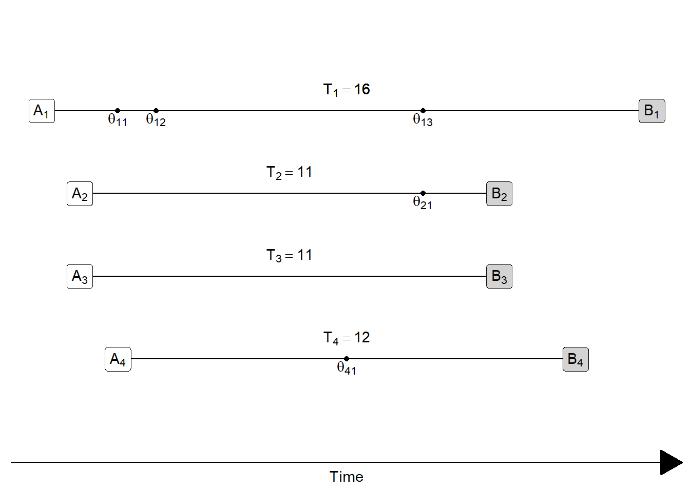

<details><summary>How many **occurrences** of event $\theta$ in this picture? **Tap for answer**</summary>
5
</details>
<br>

<details><summary>How many **person-periods**? **Tap for answer**</summary>
50
</details>
<br>

<details><summary>What is the **life-time rate**? **Tap for answer**</summary>
5 $\div$ 50 = 10%
</details>
<br>

:::{.rmdimportant}
**KEY CONCEPT**

Exposure rates weight individuals in the denominator by the number of person-periods they were exposed to the risk of the event.
:::

## Period rates and person-years (er... person-periods)

**Period rate**: A rate that limits occurrence and exposure time to those experienced by a population during a specific period of time:

$$
\textsf{Rate}[0,T] =
  \frac{
    \textsf{Number of occurrences between time } 0 \textsf{ and } T
  }
  {
    \textsf{Number of person-periods lived between time } 0 \textsf{ and } T
  }
$$

:::{.rmdimportant}
**KEY CONCEPT**

People can live fractional (i.e., less than one) person-periods!


**Example:** By the time you get your final grade for this course on March 23, 2022, you'll have lived 81 person-days in 2022 so far, which is 22.2% of a person-year...

... unless, of course, you were born this year! 😆

Either way, congrats. 🥂
:::

Let's illustrate with a toy example:

* A population of 7 people
* Observed over 1 calendar year...

First, let's look at the lifelines of each individual in the population...


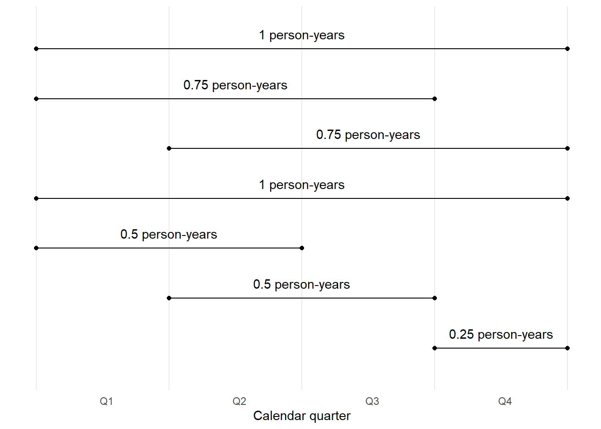

Now, let's look at how those life lines add up to person-years per quarter...

This shows how the person-years changes from quarter to quarter.

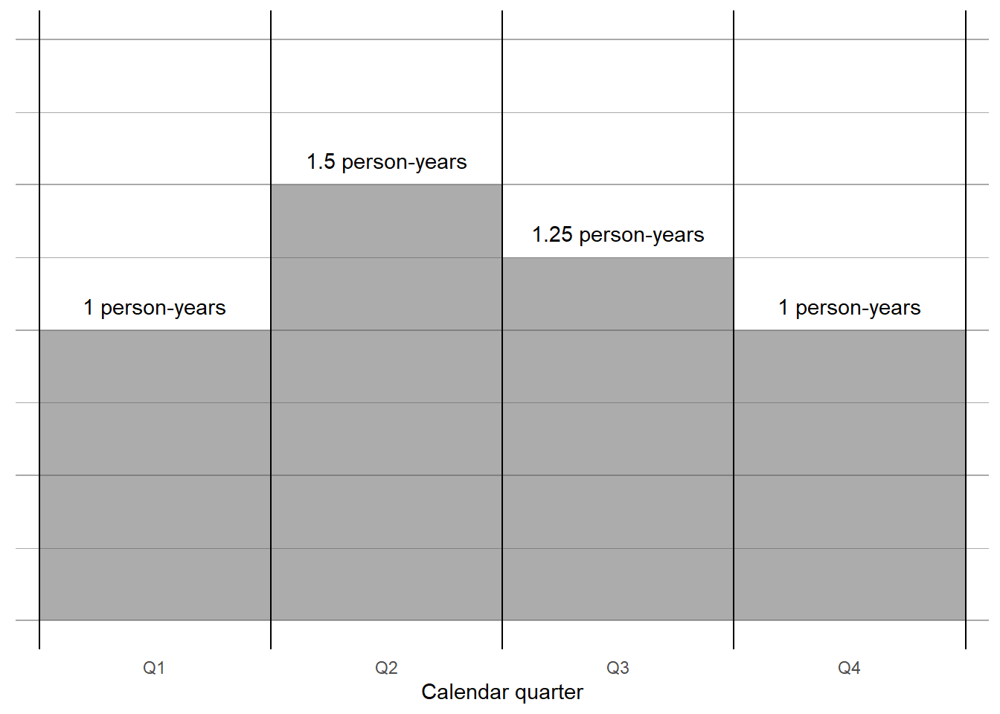

Let's write down what's going on:

$\begin{align}
PY[0,1] &= \textsf{(The total person-years lived that year)} \\
          &4 \times 0.25 \textsf{ (4 people alive during Q1 times length of quarter in years)} \\
          &6 \times 0.25 \textsf{ (6 people were alive in Q2)} \\
          &5 \times 0.25 \textsf{ (5 folks in Q3)} \\
          &4 \times 0.25 \textsf{ (4 folks in Q4)} \\
          &= 19 \times 0.25 \textsf{ (Total number of person-quarters times length of a quarter)} \\
          &= 4.75 \text{ (The answer!)}
\end{align}$

Using conventional notation:

$PY[0,1] = \sum_1^4 N_i \times \Delta_i$

* $N_i$: Number of persons alive in the $i$^th^ quarter of the year
* $\Delta_i$: Fraction of a year represented by that quarter (0.25 if the whole quarter is represented)
<br><br>

Or more generally, for $P$ discrete chunks of a period of potentially unequal length:

$PY[0,T] = \sum_1^{P} N_i \times \Delta_i$

<details>
<summary>What would $\Delta_i$ equal if we counted people each day in 2021? **Tap for answer**</summary>
$\frac{1}{365}$

* For 2024, it would be 366 because it's a leap year
* If our rate spanned across a multiple of four years, it would be 365.25 to account for leap and non-leap years
* Why would $\Delta_i$ be tedious to calculate if we did monthly counts?
</details>
<br>

<details>
<summary>What would $N_i$ represent if we counted people each day in a year? **Tap for answer**</summary>
Number of persons alive on the $i$^th^ day of the year
</details>
<br>

<details>
<summary>How could we express $PY[0,1]$ mathematically if we were constantly counting people *ad nauseum* in infinitessimally small units of time of length $dt$? **Tap for answer**</summary>
<br>
$PY[0,1] = \int_0^1 N(t) \cdot dt$

Or for arbitrary period length $T$:
$PY[0,T] = \int_0^T N(t) \cdot dt$

🤓 Hypothetically, the most frequent count cadence possible is each chronon, and theoretically the most frequent count cadence possible is the Planck time, so maybe that integral is in the end a continuous approximation of quantized time. 🤓
</details>

## Principal period rates in demography

* All of these rates are for an entire population
* For each rate, think about this mangled quote from PHG pg. 7 &para; 5:

> As is especially clear from our definition of the crude rate of in-migration, the connection between exposure and event is not always precise in demography

Crude birth rate:

$$\begin{align}
CBR[0,T] &= \frac{\textsf{Number of births between times } 0 \textsf{ and } T}
                 {\textsf{Person-years lived between times } 0 \textsf{ and } T} \\
         &= \frac{B[0,T]}{PY[0,T]}
\end{align}$$

Crude death rate:

$$\begin{align}
CDR[0,T] &= \frac{\textsf{Number of deaths between times } 0 \textsf{ and } T}
                {\textsf{Person-years lived between times } 0 \textsf{ and } T} \\
         &= \frac{D[0,T]}{PY[0,T]}
\end{align}$$

Crude rate of in-migration:

$$\begin{align}
CRIM[0,T] &= \frac{\textsf{Number of in-migrations between times } 0 \textsf{ and } T}
                  {\textsf{Person-years lived between times } 0 \textsf{ and } T} \\
          &= \frac{I[0,T]}{PY[0,T]}
\end{align}$$

Crude rate of out-migration:

$$\begin{align}
CROM[0,T] &= \frac{\textsf{Number of out-migrations between times } 0 \textsf{ and } T}
                  {\textsf{Person-years lived between times } 0 \textsf{ and } T} \\
          &= \frac{O[0,T]}{PY[0,T]}
\end{align}$$


## Growth rates in demography

Measuring population growth has many uses in traditional demography, such as:

**Assessing and mitigating risk of Malthusian traps in resource allocation due to diminishing marginal returns**

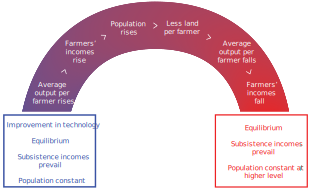{width=100%}

**Assessing and mitigating risks that slow growth leads to population aging**

* What impact does this have on the Social Security system?
* What impact does this have on age patterns of socio-political power?

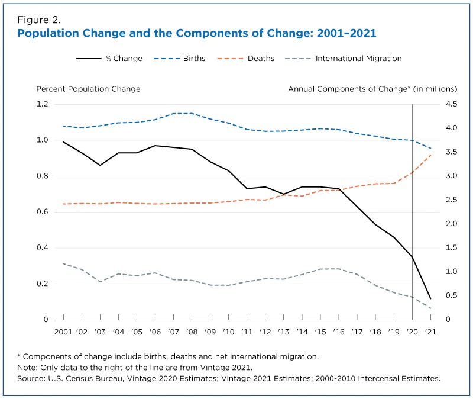{width=100%}

{width=100%}

Outside of human demography, tracking how human consumption impacts food stock growth is important and sometimes depressing:

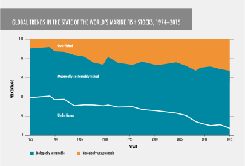{width=100%}

:::{.rmdtip}
**DEMOGRAPHY & DATA SCIENCE**

#### Customer demand vs. workforce supply: Challenges to company scale {.unnumbered}

If high attrition causes employee headcount to grow too slowly relative to demand

* Not enough workers to meet customer demand
* Increased costs to backfill workers who leave
* If your hiring rate is also very high, increased risk of labor market saturation

> Even before the pandemic, previously unreported data shows, Amazon lost about 3 percent of its hourly associates each week, meaning the turnover among its work force was roughly 150 percent a year. That rate, almost double that of the retail and logistics industries, has made some executives worry about running out of workers across America.
>
> -- Reporting by Jodie Kantor, Karen Weise, and Grace Ashford in the New York Times: https://www.nytimes.com/interactive/2021/06/15/us/amazon-workers.html

:::

### Crude growth rate

The crude growth rate combines the [Principal period rates in demography] into an expression of how a population grows between two time points

Recall the balancing equation:

$$N(T) = N[0] + B[0,T] - D[0,T] + I[0,T] - O[0,T]$$

Using some high school algebra, replace the "?" in the equation below:
<details>
<summary>$$
\frac{\textsf{?}}{PY[0,T]} =
  \frac{B[0,T]}{PY[0,T]}
  - \frac{D[0,T]}{PY[0,T]}
  + \frac{I[0,T]}{PY[0,T]}
  - \frac{O[0,T]}{PY[0,T]}
$$ **Tap for answer**</summary>
<br>
$N(T) - N(0)$ (The period change in population count)

Step 1: Subtract $N(0)$ from both sides

Step 2: Divide both sides by person-years $PY[0,T]$
<br>
</details>
<details>
<summary>Putting it all together and substituting in the principal period rates:

$$CGR[0,T] = \frac{N(T) - N(0)}{PY[0,T]} = \textsf{?}$$ **Tap for answer**</summary>

$$CBR[0,T] - CDR[0,T] + CRIM[0,T] - CROM[0,T]$$
</details>

<details>
<summary>Arranging by rates related to enters vs. exits **Tap for answer**</summary>
$$\begin{align}
CGR[0,T] &= \\
         &CBR[0,T] - CDR[0,T] \textsf{ (Crude rate of natural increase } CRNI[0,T] \textsf{)}\\
         &+ CRIM[0,T] - CROM[0,T] \textsf{ (Crude rate of net migration }  CRNM[0,T] \textsf{)} 
\end{align}$$
</details>

### Instantaneous growth rate

CGR measures growth between two time points $0$ and $T$, but what about the pace of population growth at a specific point in time $0 < t < T$?

* Define period length $\Delta t$
* Population change $N(t + \Delta t) - N(t) = \Delta N(t)$ (Just a generalization of $N(1) - N(0)$)
* Person-years lived now $N(t)\Delta t$ (Note similarity to $PY[0,T] = \sum_1^{P} N_i \times \Delta_i$. Here, $P = 1$ since we are concerned with only one small interval of time for the whole period.)
* So crude growth rate now $r(t) = \frac{\Delta N(t)}{N(t) \Delta t}$

:::{.rmdimportant}
**KEY CONCEPT**

Instantaneous growth rate is essentially a crude growth rate over tiny period of length $\Delta t \rightarrow 0$

Mathematically^[I'll spare you the derivation from PHG pg. 9, but if you're interested in it and confused about it, talk to me during office hours.]:

\begin{equation}
  r(t) = \lim_{\Delta t \to 0} \frac{\Delta N(t)}{N(t) \Delta t}
       =\frac{d \text{ln}\left[N(t)\right]}{dt}
  (\#eq:instantaneousgrowthrate)
\end{equation}
:::

We can do algebra and some calculus using Equation \@ref(eq:instantaneousgrowthrate) to express how instantaneous growth accumulates between times $0$ and $T$^[Again, I'll spare the derivation from PHG ph. 11, but let me know if you're interested and/or confused by it]:

\begin{equation}
  \frac{N(T)}{N(0)} = e^{\int_0^T r(t)dt}
  (\#eq:generalcumulativegrowth)
\end{equation}

* Left-hand side: Ratio of ending to starting population size
* Right-hand side:  Expression for cumulative growth

Re-arranging:

\begin{equation}
  N(T) = N(0)e^{\int_0^T r(t)dt}
  (\#eq:generalgrowthequation)
\end{equation}

Assuming constant growth rate $r^*$ (and sparing derivation on PHG pg. 11):

\begin{equation}
  N(T) = N(0)e^{r^{*} T}
  (\#eq:constantgrowthequation)
\end{equation}

Dividing both sides by starting population $N(0)$, we see get an expression for the cumulative growth between times $0$ and $T$ under constant rate $r^*$:

\begin{equation}
  \frac{N(T)}{N(0)} = e^{r^* T}
  (\#eq:constantcumulativegrowth)
\end{equation}

Taking the logarithm of both sides of Equation \@ref(eq:constantcumulativegrowth) and dividing by $T$ gives us the constant growth rate $r^*$ between times $0$ and $T$:

\begin{equation}
  r^{*} = \frac{\text{ln} \left[\frac{N(T)}{N(0)}\right]}{T}
  (\#eq:constantgrowthexpression)
\end{equation}

### Mean annualized growth rate

If we take the logarithm of both sides of \@ref(eq:generalcumulativegrowth) then divided by $T$, we get:

$$
  \frac{\int_0^T r(t)dt}{T} = \frac{\text{ln} \left[\frac{N(T)}{N(0)}\right]}{T}
$$

The left-hand side is just the mean growth rate $\bar{r}[0,T]$, so:

\begin{equation}
  \bar{r}[0,T] = \frac{\text{ln} \left[\frac{N(T)}{N(0)}\right]}{T}
  (\#eq:meanannualizedgrowthrate)
\end{equation}

The left-hand side is known as the **mean annualized growth rate**.

### Doubling time

If population doubles:

* $N(T)/N(0) = 2$ (definition of doubling)
* So $\text{ln}\left[N(T)/N(0)\right] = \text{ln}[2] \approx 0.693$

Assuming constant growth $r^*$ and plugging 0.693 into Equation \@ref(eq:constantgrowthexpression):

$$\textsf{Doubling time} \approx \frac{0.693}{r^*}$$

### Comparison of crude growth rate and mean annualized growth rate

Why does $CGR = \overline{r}$ only when growth rate is constant? Let's examine three scenarios: early growth, late growth, and constant growth.

Look at the picture below:

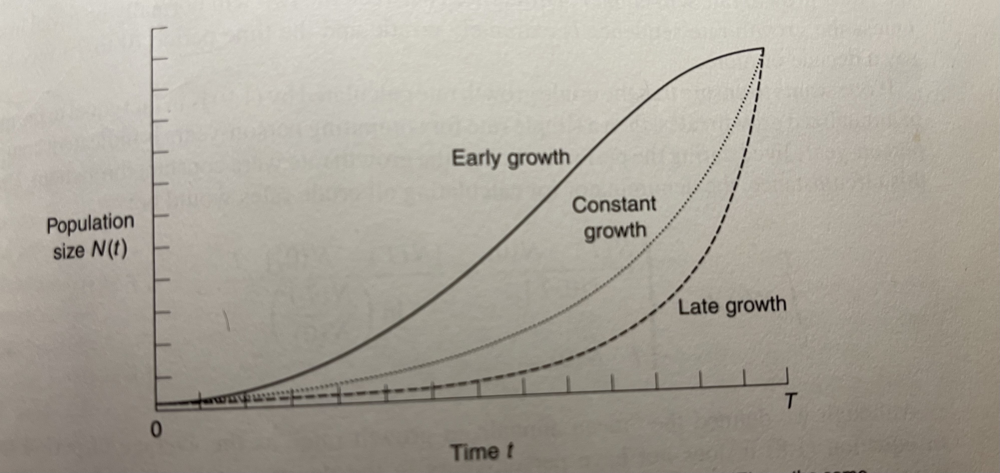{width=100%}

* Starting and ending population sizes $N(0)$ and $N(T)$ are all the same
* Thus numerators of the crude growth rates $N(0) - N(T)$ are all the same
* Yet person years (areas under the curves) definitely aren't the same! That is:

$$PY[0,T]_{\text{early growth}} \neq PY[0,T]_{\text{late growth}} \neq PY[0,T]_{\text{constant growth}}$$

* Therefore the crude growth rates won't be equal either, that is:

$$
\frac{N(0) - N(T)}{PY[0,T]_{\text{early growth}}}
\neq \frac{N(0) - N(T)}{PY[0,T]_{\text{late growth}}}
\neq \frac{N(0) - N(T)}{PY[0,T]_{\text{constant growth}}}
= r^*
$$

* Under constant growth rate $r^*[0,T]$, person-years lived is:

$$
\require{cancel}
PY[0,T]_{\text{constant growth}} = \frac{N(T) - N(0)}{r^*}
$$

* Thus CGR under $r^*[0,1]$ is:

$$
CGR[0,T]
  = \frac{N(T) - N(0)}{\left[\frac{N(T) - N(0)}{r^*}\right]}
  = \left[\bcancel{N(T) - N(0)}\right]
  \cdot \frac{r^*}{\bcancel{N(T) - N(0)}}
  = r^*
$$

* Meanwhile, under $r^*[0,1]$:

$$
\overline{r}[0,T] = \frac{1}{T}\int_0^Tr^*dt=r^*
$$

:::{.rmdimportant}
**KEY CONCEPT**

With few exceptions, crude growth rate and mean annualized growth rate are not equal unless there is constant growth rate $r^*$.

<details>
<summary>Under what circumstances of growth rates and period lengths could we reasonably assume constant growth rate?</summary>
If period length is small relative to the pace at which growth rates change
</details>

:::

## Estimating period person-periods {#estimating-person-periods}

* Often, we don't have access to data on individual lifelines
* **Consequence:** We have to estimate person-periods to calculate rates


### Method 1: Assume constant growth rate $r$ during the period {.unnumbered}

We just saw that under constant growth rate $r^*$:

$$
r^* = CGR[0,T] = \frac{N(T) - N(0)}{PY[0,T]}
$$

Solving this equation for $PY[0,T]$ yields:

$$
PY[0,T] = \frac{N(T) - N(0)}{r^*}
$$

Plugging in the right-hand side of Equation \@ref(eq:constantgrowthexpression) (our original expression for $r^*$ before we found it was also equal to $CGR[0,T]$) and simplifying yields a handy approximation of person-years that requires only the starting and ending population size and the period length:

\begin{equation}
    PY[0,T] = \frac{
              \left[N(T) - N(0)\right] \cdot T
            }{
              \text{ln}\left[\frac{N(T)}{N(0)}\right]
            }
  (\#eq:pyconstantgrowth)
\end{equation}

If the number of years $T = 1$, this becomes:

$$
PY[0,1] = \frac{N(1) - N(0)}{
            \text{ln}\left[\frac{N(1)}{N(0)}\right]
          }
$$

### Method 2: Use mid-period population  {.unnumbered}

* Often, demographers don't have both start and ending population
* Instead, they have a mid-period population count
* Example: Decennial U.S. Census
* Mid-period population estimate works best when within-period growth is linear
<br>

Below are two scenarios of linear population change.

* The black dot shows when within-period population = $PY[0,1]$
* Notice how it's at mid-period
* Note how the mid-period's under-estimate in one half of the year is balanced by an over-estimate in the other half of the year

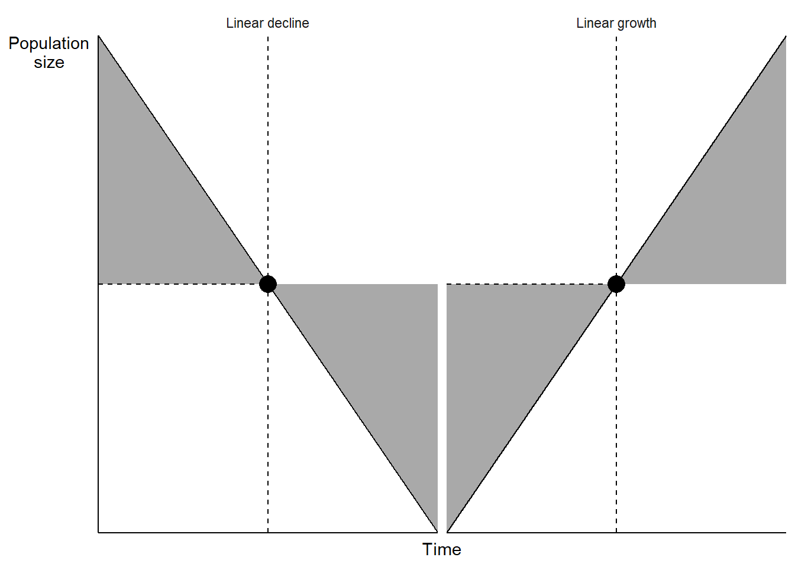

Below are scenarios of exponentially changing populations.

* Notice how mid-period population $\neq PY[0,1]$
* Mid-period population **under**-estimates $PY[0,1]$ in both cases. Why?

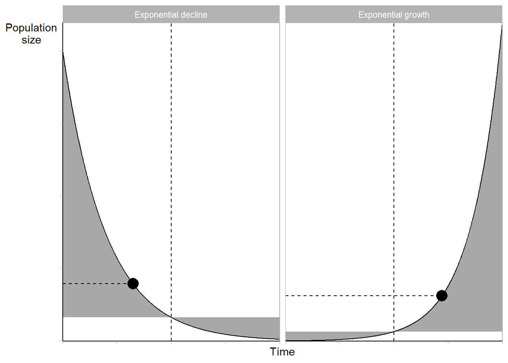

As periods get shorter, the linear approximation gets better

Check it out by zooming in on any point along the population curve below


```{=html}
<div id="htmlwidget-82a014d887eb4730cf79" style="width:672px;height:480px;" class="plotly html-widget"></div>
<script type="application/json" data-for="htmlwidget-82a014d887eb4730cf79">{"x":{"data":[{"x":[1,2,3,4,5,6,7,8,9,10,11,12,13,14,15,16,17,18,19,20,21,22,23,24,25,26,27,28,29,30,31,32,33,34,35,36,37,38,39,40,41,42,43,44,45,46,47,48,49,50,51,52,53,54,55,56,57,58,59,60,61,62,63,64,65,66,67,68,69,70,71,72,73,74,75,76,77,78,79,80,81,82,83,84,85,86,87,88,89,90,91,92,93,94,95,96,97,98,99,100,101,102,103,104,105,106,107,108,109,110,111,112,113,114,115,116,117,118,119,120,121,122,123,124,125,126,127,128,129,130,131,132,133,134,135,136,137,138,139,140,141,142,143,144,145,146,147,148,149,150,151,152,153,154,155,156,157,158,159,160,161,162,163,164,165,166,167,168,169,170,171,172,173,174,175,176,177,178,179,180,181,182,183,184,185,186,187,188,189,190,191,192,193,194,195,196,197,198,199,200,201,202,203,204,205,206,207,208,209,210,211,212,213,214,215,216,217,218,219,220,221,222,223,224,225,226,227,228,229,230,231,232,233,234,235,236,237,238,239,240,241,242,243,244,245,246,247,248,249,250,251,252,253,254,255,256,257,258,259,260,261,262,263,264,265,266,267,268,269,270,271,272,273,274,275,276,277,278,279,280,281,282,283,284,285,286,287,288,289,290,291,292,293,294,295,296,297,298,299,300,301,302,303,304,305,306,307,308,309,310,311,312,313,314,315,316,317,318,319,320,321,322,323,324,325,326,327,328,329,330,331,332,333,334,335,336,337,338,339,340,341,342,343,344,345,346,347,348,349,350,351,352,353,354,355,356,357,358,359,360,361,362,363,364,365,366,367,368,369,370,371,372,373,374,375,376,377,378,379,380,381,382,383,384,385,386,387,388,389,390,391,392,393,394,395,396,397,398,399,400,401,402,403,404,405,406,407,408,409,410,411,412,413,414,415,416,417,418,419,420,421,422,423,424,425,426,427,428,429,430,431,432,433,434,435,436,437,438,439,440,441,442,443,444,445,446,447,448,449,450,451,452,453,454,455,456,457,458,459,460,461,462,463,464,465,466,467,468,469,470,471,472,473,474,475,476,477,478,479,480,481,482,483,484,485,486,487,488,489,490,491,492,493,494,495,496,497,498,499,500,501,502,503,504,505,506,507,508,509,510,511,512,513,514,515,516,517,518,519,520,521,522,523,524,525,526,527,528,529,530,531,532,533,534,535,536,537,538,539,540,541,542,543,544,545,546,547,548,549,550,551,552,553,554,555,556,557,558,559,560,561,562,563,564,565,566,567,568,569,570,571,572,573,574,575,576,577,578,579,580,581,582,583,584,585,586,587,588,589,590,591,592,593,594,595,596,597,598,599,600,601,602,603,604,605,606,607,608,609,610,611,612,613,614,615,616,617,618,619,620,621,622,623,624,625,626,627,628,629,630,631,632,633,634,635,636,637,638,639,640,641,642,643,644,645,646,647,648,649,650,651,652,653,654,655,656,657,658,659,660,661,662,663,664,665,666,667,668,669,670,671,672,673,674,675,676,677,678,679,680,681,682,683,684,685,686,687,688,689,690,691,692,693,694,695,696,697,698,699,700,701,702,703,704,705,706,707,708,709,710,711,712,713,714,715,716,717,718,719,720,721,722,723,724,725,726,727,728,729,730,731,732,733,734,735,736,737,738,739,740,741,742,743,744,745,746,747,748,749,750,751,752,753,754,755,756,757,758,759,760,761,762,763,764,765,766,767,768,769,770,771,772,773,774,775,776,777,778,779,780,781,782,783,784,785,786,787,788,789,790,791,792,793,794,795,796,797,798,799,800,801,802,803,804,805,806,807,808,809,810,811,812,813,814,815,816,817,818,819,820,821,822,823,824,825,826,827,828,829,830,831,832,833,834,835,836,837,838,839,840,841,842,843,844,845,846,847,848,849,850,851,852,853,854,855,856,857,858,859,860,861,862,863,864,865,866,867,868,869,870,871,872,873,874,875,876,877,878,879,880,881,882,883,884,885,886,887,888,889,890,891,892,893,894,895,896,897,898,899,900,901,902,903,904,905,906,907,908,909,910,911,912,913,914,915,916,917,918,919,920,921,922,923,924,925,926,927,928,929,930,931,932,933,934,935,936,937,938,939,940,941,942,943,944,945,946,947,948,949,950,951,952,953,954,955,956,957,958,959,960,961,962,963,964,965,966,967,968,969,970,971,972,973,974,975,976,977,978,979,980,981,982,983,984,985,986,987,988,989,990,991,992,993,994,995,996,997,998,999,1000,1000,1000,999,998,997,996,995,994,993,992,991,990,989,988,987,986,985,984,983,982,981,980,979,978,977,976,975,974,973,972,971,970,969,968,967,966,965,964,963,962,961,960,959,958,957,956,955,954,953,952,951,950,949,948,947,946,945,944,943,942,941,940,939,938,937,936,935,934,933,932,931,930,929,928,927,926,925,924,923,922,921,920,919,918,917,916,915,914,913,912,911,910,909,908,907,906,905,904,903,902,901,900,899,898,897,896,895,894,893,892,891,890,889,888,887,886,885,884,883,882,881,880,879,878,877,876,875,874,873,872,871,870,869,868,867,866,865,864,863,862,861,860,859,858,857,856,855,854,853,852,851,850,849,848,847,846,845,844,843,842,841,840,839,838,837,836,835,834,833,832,831,830,829,828,827,826,825,824,823,822,821,820,819,818,817,816,815,814,813,812,811,810,809,808,807,806,805,804,803,802,801,800,799,798,797,796,795,794,793,792,791,790,789,788,787,786,785,784,783,782,781,780,779,778,777,776,775,774,773,772,771,770,769,768,767,766,765,764,763,762,761,760,759,758,757,756,755,754,753,752,751,750,749,748,747,746,745,744,743,742,741,740,739,738,737,736,735,734,733,732,731,730,729,728,727,726,725,724,723,722,721,720,719,718,717,716,715,714,713,712,711,710,709,708,707,706,705,704,703,702,701,700,699,698,697,696,695,694,693,692,691,690,689,688,687,686,685,684,683,682,681,680,679,678,677,676,675,674,673,672,671,670,669,668,667,666,665,664,663,662,661,660,659,658,657,656,655,654,653,652,651,650,649,648,647,646,645,644,643,642,641,640,639,638,637,636,635,634,633,632,631,630,629,628,627,626,625,624,623,622,621,620,619,618,617,616,615,614,613,612,611,610,609,608,607,606,605,604,603,602,601,600,599,598,597,596,595,594,593,592,591,590,589,588,587,586,585,584,583,582,581,580,579,578,577,576,575,574,573,572,571,570,569,568,567,566,565,564,563,562,561,560,559,558,557,556,555,554,553,552,551,550,549,548,547,546,545,544,543,542,541,540,539,538,537,536,535,534,533,532,531,530,529,528,527,526,525,524,523,522,521,520,519,518,517,516,515,514,513,512,511,510,509,508,507,506,505,504,503,502,501,500,499,498,497,496,495,494,493,492,491,490,489,488,487,486,485,484,483,482,481,480,479,478,477,476,475,474,473,472,471,470,469,468,467,466,465,464,463,462,461,460,459,458,457,456,455,454,453,452,451,450,449,448,447,446,445,444,443,442,441,440,439,438,437,436,435,434,433,432,431,430,429,428,427,426,425,424,423,422,421,420,419,418,417,416,415,414,413,412,411,410,409,408,407,406,405,404,403,402,401,400,399,398,397,396,395,394,393,392,391,390,389,388,387,386,385,384,383,382,381,380,379,378,377,376,375,374,373,372,371,370,369,368,367,366,365,364,363,362,361,360,359,358,357,356,355,354,353,352,351,350,349,348,347,346,345,344,343,342,341,340,339,338,337,336,335,334,333,332,331,330,329,328,327,326,325,324,323,322,321,320,319,318,317,316,315,314,313,312,311,310,309,308,307,306,305,304,303,302,301,300,299,298,297,296,295,294,293,292,291,290,289,288,287,286,285,284,283,282,281,280,279,278,277,276,275,274,273,272,271,270,269,268,267,266,265,264,263,262,261,260,259,258,257,256,255,254,253,252,251,250,249,248,247,246,245,244,243,242,241,240,239,238,237,236,235,234,233,232,231,230,229,228,227,226,225,224,223,222,221,220,219,218,217,216,215,214,213,212,211,210,209,208,207,206,205,204,203,202,201,200,199,198,197,196,195,194,193,192,191,190,189,188,187,186,185,184,183,182,181,180,179,178,177,176,175,174,173,172,171,170,169,168,167,166,165,164,163,162,161,160,159,158,157,156,155,154,153,152,151,150,149,148,147,146,145,144,143,142,141,140,139,138,137,136,135,134,133,132,131,130,129,128,127,126,125,124,123,122,121,120,119,118,117,116,115,114,113,112,111,110,109,108,107,106,105,104,103,102,101,100,99,98,97,96,95,94,93,92,91,90,89,88,87,86,85,84,83,82,81,80,79,78,77,76,75,74,73,72,71,70,69,68,67,66,65,64,63,62,61,60,59,58,57,56,55,54,53,52,51,50,49,48,47,46,45,44,43,42,41,40,39,38,37,36,35,34,33,32,31,30,29,28,27,26,25,24,23,22,21,20,19,18,17,16,15,14,13,12,11,10,9,8,7,6,5,4,3,2,1,1],"y":[33.1154519586923,33.1154519586923,33.1154519586923,33.1154519586923,33.1154519586923,33.1154519586923,33.1154519586923,33.1154519586923,33.1154519586923,33.1154519586923,33.1154519586923,33.1154519586923,33.1154519586923,33.1154519586923,33.1154519586923,33.1154519586923,33.1154519586923,33.1154519586923,33.1154519586923,33.1154519586923,33.1154519586923,33.1154519586923,33.1154519586923,33.1154519586923,33.1154519586923,33.1154519586923,33.1154519586923,33.1154519586923,33.1154519586923,33.1154519586923,33.1154519586923,33.1154519586923,33.1154519586923,33.1154519586923,33.1154519586923,33.1154519586923,33.1154519586923,33.1154519586923,33.1154519586923,33.1154519586923,33.1154519586923,33.1154519586923,33.1154519586923,33.1154519586923,33.1154519586923,33.1154519586923,33.1154519586923,33.1154519586923,33.1154519586923,33.1154519586923,33.1154519586923,33.1154519586923,33.1154519586923,33.1154519586923,33.1154519586923,33.1154519586923,33.1154519586923,33.1154519586923,33.1154519586923,33.1154519586923,33.1154519586923,33.1154519586923,33.1154519586923,33.1154519586923,33.1154519586923,33.1154519586923,33.1154519586923,33.1154519586923,33.1154519586923,33.1154519586923,33.1154519586923,33.1154519586923,33.1154519586923,33.1154519586923,33.1154519586923,33.1154519586923,33.1154519586923,33.1154519586923,33.1154519586923,33.1154519586923,33.1154519586923,33.1154519586923,33.1154519586923,33.1154519586923,33.1154519586923,33.1154519586923,33.1154519586923,33.1154519586923,33.1154519586923,33.1154519586923,33.1154519586923,33.1154519586923,33.1154519586923,33.1154519586923,33.1154519586923,33.1154519586923,33.1154519586923,33.1154519586923,33.1154519586923,33.1154519586923,33.1154519586923,33.1154519586923,33.1154519586923,33.1154519586923,33.1154519586923,33.1154519586923,33.1154519586923,33.1154519586923,33.1154519586923,33.1154519586923,33.1154519586923,33.1154519586923,33.1154519586923,33.1154519586923,33.1154519586923,33.1154519586923,33.1154519586923,33.1154519586923,33.1154519586923,33.1154519586923,33.1154519586923,33.1154519586923,33.1154519586923,33.1154519586923,33.1154519586923,33.1154519586923,33.1154519586923,33.1154519586923,33.1154519586923,33.1154519586923,33.1154519586923,33.1154519586923,33.1154519586923,33.1154519586923,33.1154519586923,33.1154519586923,33.1154519586923,33.1154519586923,33.1154519586923,33.1154519586923,33.1154519586923,33.1154519586923,33.1154519586923,33.1154519586923,33.1154519586923,33.1154519586923,33.1154519586923,33.1154519586923,33.1154519586923,33.1154519586923,33.1154519586923,33.1154519586923,33.1154519586923,33.1154519586923,33.1154519586923,33.1154519586923,33.1154519586923,33.1154519586923,33.1154519586923,33.1154519586923,33.1154519586923,33.1154519586923,33.1154519586923,33.1154519586923,33.1154519586923,33.1154519586923,33.1154519586923,33.1154519586923,33.1154519586923,33.1154519586923,33.1154519586923,33.1154519586923,33.1154519586923,33.1154519586923,33.1154519586923,33.1154519586923,33.1154519586923,33.1154519586923,33.1154519586923,33.1154519586923,33.1154519586923,33.1154519586923,33.1154519586923,33.1154519586923,33.1154519586923,33.1154519586923,33.1154519586923,33.1154519586923,33.1154519586923,33.1154519586923,33.1154519586923,33.1154519586923,33.1154519586923,33.1154519586923,33.1154519586923,33.1154519586923,33.1154519586923,33.1154519586923,33.1154519586923,33.1154519586923,33.1154519586923,33.1154519586923,33.1154519586923,33.1154519586923,33.1154519586923,33.1154519586923,33.1154519586923,33.1154519586923,33.1154519586923,33.1154519586923,33.1154519586923,33.1154519586923,33.1154519586923,33.1154519586923,33.1154519586923,33.1154519586923,33.1154519586923,33.1154519586923,33.1154519586923,33.1154519586923,33.1154519586923,33.1154519586923,33.1154519586923,33.1154519586923,33.1154519586923,33.1154519586923,33.1154519586923,33.1154519586923,33.1154519586923,33.1154519586923,33.1154519586923,33.1154519586923,33.1154519586923,33.1154519586923,33.1154519586923,33.1154519586923,33.1154519586923,33.1154519586923,33.1154519586923,33.1154519586923,33.1154519586923,33.1154519586923,33.1154519586923,33.1154519586923,33.1154519586923,33.1154519586923,33.1154519586923,33.1154519586923,33.1154519586923,33.1154519586923,33.1154519586923,33.1154519586923,33.1154519586923,33.1154519586923,33.1154519586923,33.1154519586923,33.1154519586923,33.1154519586923,33.1154519586923,33.1154519586923,33.1154519586923,33.1154519586923,33.1154519586923,33.1154519586923,33.1154519586923,33.1154519586923,33.1154519586923,33.1154519586923,33.1154519586923,33.1154519586923,33.1154519586923,33.1154519586923,33.1154519586923,33.1154519586923,33.1154519586923,33.1154519586923,33.1154519586923,33.1154519586923,33.1154519586923,33.1154519586923,33.1154519586923,33.1154519586923,33.1154519586923,33.1154519586923,33.1154519586923,33.1154519586923,33.1154519586923,33.1154519586923,33.1154519586923,33.1154519586923,33.1154519586923,33.1154519586923,33.1154519586923,33.1154519586923,33.1154519586923,33.1154519586923,33.1154519586923,33.1154519586923,33.1154519586923,33.1154519586923,33.1154519586923,33.1154519586923,33.1154519586923,33.1154519586923,33.1154519586923,33.1154519586923,33.1154519586923,33.1154519586923,33.1154519586923,33.1154519586923,33.1154519586923,33.1154519586923,33.1154519586923,33.1154519586923,33.1154519586923,33.1154519586923,33.1154519586923,33.1154519586923,33.1154519586923,33.1154519586923,33.1154519586923,33.1154519586923,33.1154519586923,33.1154519586923,33.1154519586923,33.1154519586923,33.1154519586923,33.1154519586923,33.1154519586923,33.1154519586923,33.1154519586923,33.1154519586923,33.1154519586923,33.1154519586923,33.1154519586923,33.1154519586923,33.1154519586923,33.1154519586923,33.1154519586923,33.1154519586923,33.1154519586923,33.1154519586923,33.1154519586923,33.1154519586923,33.1154519586923,33.1154519586923,33.1154519586923,33.1154519586923,33.1154519586923,33.1154519586923,33.1154519586923,33.1154519586923,33.1154519586923,33.1154519586923,33.1154519586923,33.1154519586923,33.1154519586923,33.1154519586923,33.1154519586923,33.1154519586923,33.1154519586923,33.1154519586923,33.1154519586923,33.1154519586923,33.1154519586923,33.1154519586923,33.1154519586923,33.1154519586923,33.1154519586923,33.1154519586923,33.1154519586923,33.1154519586923,33.1154519586923,33.1154519586923,33.1154519586923,33.1154519586923,33.1154519586923,33.1154519586923,33.1154519586923,33.1154519586923,33.1154519586923,33.1154519586923,33.1154519586923,33.1154519586923,33.1154519586923,33.1154519586923,33.1154519586923,33.1154519586923,33.1154519586923,33.1154519586923,33.1154519586923,33.1154519586923,33.1154519586923,33.1154519586923,33.1154519586923,33.1154519586923,33.1154519586923,33.1154519586923,33.1154519586923,33.1154519586923,33.1154519586923,33.1154519586923,33.1154519586923,33.1154519586923,33.1154519586923,33.1154519586923,33.1154519586923,33.1154519586923,33.1154519586923,33.1154519586923,33.1154519586923,33.1154519586923,33.1154519586923,33.1154519586923,33.1154519586923,33.1154519586923,33.1154519586923,33.1154519586923,33.1154519586923,33.1154519586923,33.1154519586923,33.1154519586923,33.1154519586923,33.1154519586923,33.1154519586923,33.1154519586923,33.1154519586923,33.1154519586923,33.1154519586923,33.1154519586923,33.1154519586923,33.1154519586923,33.1154519586923,33.1154519586923,33.1154519586923,33.1154519586923,33.1154519586923,33.1154519586923,33.1154519586923,33.1154519586923,33.1154519586923,33.1154519586923,33.1154519586923,33.1154519586923,33.1154519586923,33.1154519586923,33.1154519586923,33.1154519586923,33.1154519586923,33.1154519586923,33.1154519586923,33.1154519586923,33.1154519586923,33.1154519586923,33.1154519586923,33.1154519586923,33.1154519586923,33.1154519586923,33.1154519586923,33.1154519586923,33.1154519586923,33.1154519586923,33.1154519586923,33.1154519586923,33.1154519586923,33.1154519586923,33.1154519586923,33.1154519586923,33.1154519586923,33.1154519586923,33.1154519586923,33.1154519586923,33.1154519586923,33.1154519586923,33.1154519586923,33.1154519586923,33.1154519586923,33.1154519586923,33.1154519586923,33.1154519586923,33.1154519586923,33.1154519586923,33.1154519586923,33.1154519586923,33.1154519586923,33.1154519586923,33.1154519586923,33.1154519586923,33.1154519586923,33.1154519586923,33.1154519586923,33.1154519586923,33.1154519586923,33.1154519586923,33.1154519586923,33.1154519586923,33.1154519586923,33.1154519586923,33.1154519586923,33.1154519586923,33.1154519586923,33.1154519586923,33.1154519586923,33.1154519586923,33.1154519586923,33.1154519586923,33.1154519586923,33.1154519586923,33.1154519586923,33.1154519586923,33.1154519586923,33.1154519586923,33.1154519586923,33.1154519586923,33.1154519586923,33.1154519586923,33.1154519586923,33.1154519586923,33.1154519586923,33.1154519586923,33.1154519586923,33.1154519586923,33.1154519586923,33.1154519586923,33.1154519586923,33.1154519586923,33.1154519586923,33.1154519586923,33.1154519586923,33.1154519586923,33.1154519586923,33.1154519586923,33.1154519586923,33.1154519586923,33.1154519586923,33.1154519586923,33.1154519586923,33.1154519586923,33.1154519586923,33.1154519586923,33.1154519586923,33.1154519586923,33.1154519586923,33.1154519586923,33.1154519586923,33.1154519586923,33.1154519586923,33.1154519586923,33.1154519586923,33.1154519586923,33.1154519586923,33.1154519586923,33.1154519586923,33.1154519586923,33.1154519586923,33.1154519586923,33.1154519586923,33.1154519586923,33.1154519586923,33.1154519586923,33.1154519586923,33.1154519586923,33.1154519586923,33.1154519586923,33.1154519586923,33.1154519586923,33.1154519586923,33.1154519586923,33.1154519586923,33.1154519586923,33.1154519586923,33.1154519586923,33.1154519586923,33.1154519586923,33.1154519586923,33.1154519586923,33.1154519586923,33.1154519586923,33.1154519586923,33.1154519586923,33.1154519586923,33.1154519586923,33.1154519586923,33.1154519586923,33.1154519586923,33.1154519586923,33.1154519586923,33.1154519586923,33.1154519586923,33.1154519586923,33.1154519586923,33.1154519586923,33.1154519586923,33.1154519586923,33.1154519586923,33.1154519586923,33.1154519586923,33.1154519586923,33.1154519586923,33.1154519586923,33.1154519586923,33.1154519586923,33.1154519586923,33.1154519586923,33.1154519586923,33.1154519586923,33.1154519586923,33.1154519586923,33.1154519586923,33.1154519586923,33.1154519586923,33.1154519586923,33.1154519586923,33.1154519586923,33.1154519586923,33.1154519586923,33.1154519586923,33.1154519586923,33.1154519586923,33.1154519586923,33.1154519586923,33.1154519586923,33.1154519586923,33.1154519586923,33.1154519586923,33.1154519586923,33.1154519586923,33.1154519586923,33.1154519586923,33.1154519586923,33.1154519586923,33.1154519586923,33.1154519586923,33.1154519586923,33.1154519586923,33.1154519586923,33.1154519586923,33.1154519586923,33.1154519586923,33.1154519586923,33.1154519586923,33.1154519586923,33.1154519586923,33.1154519586923,33.1154519586923,33.1154519586923,33.1154519586923,33.1154519586923,33.1154519586923,33.1154519586923,33.1154519586923,33.1154519586923,33.1154519586923,33.1154519586923,33.1154519586923,33.1154519586923,33.1154519586923,33.1154519586923,33.1154519586923,33.1154519586923,33.1154519586923,33.1154519586923,33.1154519586923,33.1154519586923,33.1154519586923,33.1154519586923,33.1154519586923,33.1154519586923,33.1154519586923,33.1154519586923,33.1154519586923,33.1154519586923,33.1154519586923,33.1154519586923,33.1154519586923,33.1154519586923,33.1154519586923,33.1154519586923,33.1154519586923,33.1154519586923,33.1154519586923,33.1154519586923,33.1154519586923,33.1154519586923,33.1154519586923,33.1154519586923,33.1154519586923,33.1154519586923,33.1154519586923,33.1154519586923,33.1154519586923,33.1154519586923,33.1154519586923,33.1154519586923,33.1154519586923,33.1154519586923,33.1154519586923,33.1154519586923,33.1154519586923,33.1154519586923,33.1154519586923,33.1154519586923,33.1154519586923,33.1154519586923,33.1154519586923,33.1154519586923,33.1154519586923,33.1154519586923,33.1154519586923,33.1154519586923,33.1154519586923,33.1154519586923,33.1154519586923,33.1154519586923,33.1154519586923,33.1154519586923,33.1154519586923,33.1154519586923,33.1154519586923,33.1154519586923,33.1154519586923,33.1154519586923,33.1154519586923,33.1154519586923,33.1154519586923,33.1154519586923,33.1154519586923,33.1154519586923,33.1154519586923,33.1154519586923,33.1154519586923,33.1154519586923,33.1154519586923,33.1154519586923,33.1154519586923,33.1154519586923,33.1154519586923,33.1154519586923,33.1154519586923,33.1154519586923,33.1154519586923,33.1154519586923,33.1154519586923,33.1154519586923,33.1154519586923,33.1154519586923,33.1154519586923,33.1154519586923,33.1154519586923,33.1154519586923,33.1154519586923,33.1154519586923,33.1154519586923,33.1154519586923,33.1154519586923,33.1154519586923,33.1154519586923,33.1154519586923,33.1154519586923,33.1154519586923,33.1154519586923,33.1154519586923,33.1154519586923,33.1154519586923,33.1154519586923,33.1154519586923,33.1154519586923,33.1154519586923,33.1154519586923,33.1154519586923,33.1154519586923,33.1154519586923,33.1154519586923,33.1154519586923,33.1154519586923,33.1154519586923,33.1154519586923,33.1154519586923,33.1154519586923,33.1154519586923,33.1154519586923,33.1154519586923,33.1154519586923,33.1154519586923,33.1154519586923,33.1154519586923,33.1154519586923,33.1154519586923,33.1154519586923,33.1154519586923,33.1154519586923,33.1154519586923,33.1154519586923,33.1154519586923,33.1154519586923,33.1154519586923,33.1154519586923,33.1154519586923,33.1154519586923,33.1154519586923,33.1154519586923,33.1154519586923,33.1154519586923,33.1154519586923,33.1154519586923,33.1154519586923,33.1154519586923,33.1154519586923,33.1154519586923,33.1154519586923,33.1154519586923,33.1154519586923,33.1154519586923,33.1154519586923,33.1154519586923,33.1154519586923,33.1154519586923,33.1154519586923,33.1154519586923,33.1154519586923,33.1154519586923,33.1154519586923,33.1154519586923,33.1154519586923,33.1154519586923,33.1154519586923,33.1154519586923,33.1154519586923,33.1154519586923,33.1154519586923,33.1154519586923,33.1154519586923,33.1154519586923,33.1154519586923,33.1154519586923,33.1154519586923,33.1154519586923,33.1154519586923,33.1154519586923,33.1154519586923,33.1154519586923,33.1154519586923,33.1154519586923,33.1154519586923,33.1154519586923,33.1154519586923,33.1154519586923,33.1154519586923,33.1154519586923,33.1154519586923,33.1154519586923,33.1154519586923,33.1154519586923,33.1154519586923,33.1154519586923,33.1154519586923,33.1154519586923,33.1154519586923,33.1154519586923,33.1154519586923,33.1154519586923,33.1154519586923,33.1154519586923,33.1154519586923,33.1154519586923,33.1154519586923,33.1154519586923,33.1154519586923,33.1154519586923,33.1154519586923,33.1154519586923,33.1154519586923,33.1154519586923,33.1154519586923,33.1154519586923,33.1154519586923,33.1154519586923,33.1154519586923,33.1154519586923,33.1154519586923,33.1154519586923,33.1154519586923,33.1154519586923,33.1154519586923,33.1154519586923,33.1154519586923,33.1154519586923,33.1154519586923,33.1154519586923,33.1154519586923,33.1154519586923,33.1154519586923,33.1154519586923,33.1154519586923,33.1154519586923,33.1154519586923,33.1154519586923,33.1154519586923,33.1154519586923,33.1154519586923,33.1154519586923,33.1154519586923,33.1154519586923,33.1154519586923,33.1154519586923,33.1154519586923,33.1154519586923,33.1154519586923,33.1154519586923,33.1154519586923,33.1154519586923,33.1154519586923,33.1154519586923,33.1154519586923,33.1154519586923,33.1154519586923,33.1154519586923,33.1154519586923,33.1154519586923,33.1154519586923,33.1154519586923,33.1154519586923,33.1154519586923,33.1154519586923,33.1154519586923,33.1154519586923,33.1154519586923,33.1154519586923,33.1154519586923,33.1154519586923,33.1154519586923,33.1154519586923,33.1154519586923,33.1154519586923,33.1154519586923,33.1154519586923,33.1154519586923,33.1154519586923,33.1154519586923,33.1154519586923,33.1154519586923,33.1154519586923,33.1154519586923,33.1154519586923,33.1154519586923,33.1154519586923,33.1154519586923,33.1154519586923,33.1154519586923,33.1154519586923,33.1154519586923,33.1154519586923,33.1154519586923,33.1154519586923,33.1154519586923,33.1154519586923,33.1154519586923,33.1154519586923,33.1154519586923,33.1154519586923,33.1154519586923,33.1154519586923,33.1154519586923,33.1154519586923,33.1154519586923,33.1154519586923,33.1154519586923,33.1154519586923,33.1154519586923,33.1154519586923,33.1154519586923,33.1154519586923,33.1154519586923,33.1154519586923,33.1154519586923,33.1154519586923,33.1154519586923,33.1154519586923,33.1154519586923,33.1154519586923,33.1154519586923,33.1154519586923,33.1154519586923,33.1154519586923,33.1154519586923,33.1154519586923,33.1154519586923,33.1154519586923,33.1154519586923,33.1154519586923,33.1154519586923,33.1154519586923,33.1154519586923,33.1154519586923,33.1154519586923,33.1154519586923,33.1154519586923,33.1154519586923,33.1154519586923,33.1154519586923,33.1154519586923,1096.63315842846,1088.98353125053,1081.38726448353,1073.84398590885,1066.35332590434,1058.91491742616,1051.52839599081,1044.19339965725,1036.9095690092,1029.6765471375,1022.49397962264,1015.36151451735,1008.27880232944,1001.24549600458,994.261250909362,987.325724814371,980.438577877443,973.599472627001,966.80807394552,960.064049053103,953.367067491184,946.716801106325,940.112924034143,933.55511268334,927.043045719846,920.57640405108,914.154870810305,907.778131341106,901.445873181975,895.157786050994,888.913561830637,882.712894552666,876.555480383145,870.441017607547,864.369206615973,858.339749888468,852.352351980449,846.406719508218,840.502561134595,834.639587554639,828.81751148147,823.036047632197,817.294912713934,811.593825409921,805.93250636574,800.310678175625,794.72806536887,789.18439439633,783.679393617017,778.212793284794,772.78432553515,767.393724372078,762.040725655043,756.725067086038,751.446488196727,746.204730335691,740.999536655745,735.830652101356,730.697823396148,725.600799030487,720.53932924916,715.513166039134,710.522063117406,705.565775918936,700.644061584657,695.756678949583,690.903388530988,686.083952516668,681.298134753296,676.545700734845,671.826417591094,667.140054076227,662.486380557494,657.86516900396,653.276192975337,648.719227610878,644.194049618371,639.700437263188,635.238170357423,630.807030249108,626.406799811489,622.037263432394,617.698207003667,613.389417910675,609.110685021889,604.861798678543,600.642550684355,596.452734295329,592.292144209624,588.160576557493,584.057828891295,579.983700175573,575.937990777205,571.92050245562,567.931038353089,563.969402985069,560.035402230638,556.128843322969,552.249534839896,548.397286694526,544.571910125929,540.773217689888,537.001023249715,533.255141967125,529.535390293188,525.841585959326,522.173547968388,518.53109658578,514.914053330653,511.322240967166,507.755483495794,504.213606144706,500.696435361204,497.203798803217,493.735525330852,490.291444998018,486.871389044087,483.475189885635,480.102681108223,476.753697458246,473.428074834835,470.125650281816,466.846261979725,463.58974923788,460.355952486504,457.144713268909,453.955874233732,450.789279127221,447.644772785584,444.522201127379,441.421411145971,438.34225090203,435.284569516089,432.248217161147,429.233045055332,426.238905454607,423.265651645533,420.313137938079,417.38121965848,414.469753142157,411.578595726666,408.707605744715,405.856642517222,403.025566346418,400.214238509003,397.422521249352,394.650277772759,391.897372238741,389.163669754374,386.449036367691,383.753339061112,381.07644574493,378.418225250836,375.778547325495,373.15728262416,370.554302704336,367.969480019487,365.402687912783,362.853800610898,360.322693217844,357.809241708853,355.313322924297,352.834814563656,350.373595179526,347.929544171664,345.502541781081,343.092469084175,340.699207986901,338.322641218986,335.962652328185,333.619125674568,331.291946424861,328.981000546814,326.686174803619,324.407356748353,322.144434718477,319.897297830357,317.665835973837,315.449939806841,313.24950075001,311.064410981393,308.894563431153,306.739851776325,304.600170435608,302.475414564188,300.365480048603,298.270263501637,296.189662257263,294.123574365601,292.071898587933,290.034534391735,288.011381945753,286.002342115112,284.00731645646,282.026207213139,280.0589173104,278.105350350645,276.165410608702,274.239003027134,272.326033211586,270.426407426153,268.540032588791,266.666816266757,264.806666672076,262.959492657045,261.125203709768,259.30370994972,257.494922123342,255.698751599669,253.915110365985,252.143911023513,250.385066783131,248.638491461119,246.904099474938,245.181805839032,243.47152616067,241.773176635804,240.086674044968,238.411935749197,236.748879685981,235.097424365239,233.457488865329,231.828992829086,230.211856459876,228.606000517694,227.011346315278,225.427815714253,223.855331121302,222.293815484365,220.743192288865,219.203385553954,217.674319828795,216.15592018886,214.648112232263,213.150822076114,211.663976352894,210.187502206866,208.721327290501,207.265379760936,205.819588276448,204.383881992968,202.958190560599,201.542444120176,200.136573299841,198.740509211641,197.354183448157,195.97752807915,194.61047564823,193.252959169556,191.904912124547,190.56626845863,189.236962577996,187.916929346392,186.606104081925,185.304422553895,184.011820979647,182.728236021444,181.453604783367,180.18786480823,178.930954074522,177.682810993364,176.443374405497,175.212583578279,173.990378202713,172.776698390492,171.571484671062,170.37467798871,169.186219699668,168.006051569242,166.834115768959,165.67035487373,164.514711859037,163.367130098142,162.227553359309,161.095925803049,159.972191979387,158.856296825139,157.74818566122,156.647804189962,155.555098492451,154.470015025891,153.392500620974,152.322502479278,151.259968170682,150.20484563079,149.157083158388,148.116629412904,147.083433411898,146.057444528557,145.038612489223,144.02688737092,143.022219598915,142.024559944288,141.033859521514,140.050069786076,139.073142532079,138.103029889892,137.139684323802,136.183058629683,135.233105932685,134.289779684936,133.35303366326,132.422821966916,131.499099015343,130.581819545934,129.670938611809,128.766411579621,127.868194127365,126.976242242206,126.090512218322,125.210960654765,124.337544453333,123.470220816458,122.608947245107,121.753681536702,120.904381783054,120.061006368305,119.223513966889,118.391863541513,117.566014341139,116.74592589899,115.931558030569,115.122870831688,114.319824676512,113.522380215618,112.730498374069,111.944140349496,111.163267610198,110.387841893255,109.617825202652,108.853179807416,108.093868239771,107.339853293297,106.591098021111,105.847565734056,105.1092199989,104.376024636554,103.6479437203,102.924941574026,102.206982770483,101.494032129546,100.78605471649,100.083015840281,99.3848810518731,98.6916161425222,98.0031871421087,97.3195603174741,96.6407021707671,95.9665794378027,95.2971590864321,94.6324083149241,93.9722945503579,93.3167854470271,92.6658488848543,92.0194529678178,91.3775660223882,90.740156595977,90.1071934553946,89.4786455853204,88.8544821867832,88.2346726756515,87.6191866811351,87.0079940442974,86.4010648165767,85.7983692583193,85.1998778373226,84.6055612273869,84.0153903068796,83.4293361573075,82.8473700618998,82.2694635042017,81.695588166676,81.1257159293164,80.5598188682693,79.9978692544654,79.4398395522613,78.8857024180899,78.3354306991206,77.7889974319293,77.2463758411765,76.7075393382956,76.1724615201902,75.6411161679402,75.1134772455169,74.5895188985077,74.0692154528486,73.5525414135667,73.0394714635308,72.5299804622106,72.0240434444451,71.5216356192193,71.022732368449,70.5273092457753,70.035341975366,69.5468064507265,69.0616787335182,68.5799350523859,68.101551801793,67.6265055408644,67.1547729922381,66.6863310409252,66.221156733176,65.7592272753565,65.3005200328309,64.8450125288525,64.3926824434624,63.943507612396,63.4974660259966,63.0545358281373,62.6146953151498,62.1779229347608,61.7441972850365,61.3134971133331,60.8858013152561,60.4610889336259,60.0393391574506,59.6205313209069,59.2046449023271,58.7916595231934,58.3815549471395,57.9743110789593,57.5699079636216,57.168325785293,56.7695448663662,56.3735456664967,55.9803087816442,55.5898149431226,55.202045016656,54.8169800014402,54.4346010292124,54.0548893633266,53.677826397835,53.303393656577,52.9315727922734,52.5623455856272,52.1956939444317,51.8315999026829,51.4700456197,51.1110133792508,50.7544855886837,50.4004447780655,50.0488735993258,49.6997548254064,49.3530713494175,49.0088061837995,48.6669424594904,48.3274634250993,47.9903524460855,47.6555930039437,47.3231686953942,46.9930632315793,46.6652604372653,46.3397442500497,46.0164987195742,45.6955080067431,45.3767563829472,45.0602282292933,44.7459080358384,44.4337804008302,44.1238300299521,43.816041735574,43.5104004360077,43.2068911547686,42.905499019841,42.6062092629501,42.3090072188378,42.0138783245446,41.7208081186957,41.4297822407922,41.1407864305079,40.8538065269903,40.5688284681667,40.2858382900552,40.0048221260804,39.7257662063942,39.4486568572005,39.1734805000859,38.9002236513537,38.6288729213638,38.359415013876,38.091836725399,37.8261249445431,37.5622666513779,37.3002489167941,37.0400589018705,36.7816838572442,36.5251111224863,36.2703281254814,36.0173223818119,35.7660814941454,35.5165931516285,35.2688451292822,35.022825287404,34.7785215709724,34.5359220090564,34.2950147142289,34.0557878819842,33.8182297901598,33.5823287983616,33.3480733473937,33.1154519586923,32.8844532337627,32.6550658536213,32.4272785782404,32.201080245998,31.9764597731305,31.75340615319,31.5319084565042,31.3119558296419,31.0935374948802,30.876642749677,30.6612609661466,30.4473815905382,30.2349941427199,30.024088215664,29.8146534749381,29.6066796581978,29.4001565746846,29.1950741047261,28.9914221992402,28.7891908792427,28.5883702353585,28.388950427336,28.1909216835645,27.9942743005961,27.7989986426697,27.6050851412388,27.4125242945032,27.2213066669428,27.0314228888556,26.8428636558986,26.6556197286315,26.4696819320644,26.2850411552082,26.1016883506278,25.919614533999,25.7388107836686,25.5592682402164,25.3809781060221,25.2039316448332,25.0281201813378,24.853535100739,24.680167848333,24.5080099290896,24.3370529072364,24.1672884058451,23.9987081064212,23.8313037484962,23.6650671292231,23.4999901029744,23.3360645809427,23.1732825307446,23.0116359760272,22.8511169960768,22.6917177254313,22.5334303534946,22.3762471241539,22.2201603353993,22.0651623389471,21.9112455398643,21.7584023961971,21.6066254186008,21.4559071699731,21.3062402650898,21.1576173702424,21.0100312028795,20.8634745312493,20.7179401740456,20.5734210000557,20.4299099278112,20.2873999252409,20.1458840093261,20.0053552457587,19.865806748601,19.7272316799488,19.589623249596,19.452974714702,19.3172793794613,19.1825305947752,19.0487217579264,18.915846312255,18.7838977468378,18.6528695961684,18.5227554398414,18.3935489022371,18.2652436522092,18.1378334027748,18.0113119108063,17.8856729767252,17.7609104441985,17.6370181998373,17.5139901728968,17.391820334979,17.2705026997374,17.1500313225837,17.0304003003962,16.9116037712309,16.7936359140342,16.6764909483574,16.5601631340737,16.4446467710971,16.3299361991025,16.216025797249,16.1029099839042,15.9905832163705,15.8790399906138,15.7682748409938,15.6582823399961,15.5490570979659,15.4405937628447,15.3328870199072,15.2259315915016,15.1197222367904,15.014253751494,14.9095209676356,14.8055187532877,14.7022420123211,14.5996856841548,14.4978447435081,14.3967142001547,14.2962890986776,14.1965645182268,14.0975355722779,13.9991974083927,13.9015452079816,13.8045741860671,13.7082795910498,13.6126567044753,13.5177008408029,13.4234073471764,13.3297716031958,13.2367890206907,13.1444550434962,13.0527651472288,12.9617148390652,12.8712996575221,12.7815151722377,12.692356983754,12.6038207233021,12.5159020525874,12.4285966635775,12.341900278291,12.2558086485874,12.1703175559598,12.0854228113276,12.0011202548312,11.9174057556285,11.8342752116923,11.7517245496094,11.6697497243807,11.5883467192234,11.507511545374,11.4272402418928,11.3475288754698,11.2683735402322,11.1897703575527,11.1117154758596,11.0342050704481,10.9572353432928,10.8808025228617,10.8049028639313,10.7295326474031,10.6546881801214,10.5803657946924,10.5065618493042,10.4332727275489,10.3604948382448,10.2882246152607,10.2164585173412,10.1451930279333,10.0744246550136,10.0041499309177,9.93436541217013,9.86506767931544,9.79625333675088,9.72791901255988,9.66006135834691,9.59267704907331,9.52576278289445,9.4593152809979,9.39333128744278,9.3278075690002,9.26274091499483,9.19812813714763,9.13396606941954,9.07025156785641,9.00698151043491,8.94415279690958,8.88176234866087,8.81980710854434,8.75828404074083,8.69719013060771,8.63652238453115,8.57627782977946,8.5164535143574,8.45704650686156,8.39805389633666,8.33947279213299,8.28130032376474,8.2235336407693,8.16616991256765,8.10920632832564,8.05264009681623,7.99646844628277,7.94068862430314,7.8852978976549,7.83029355218137,7.77567289265861,7.72143324266337,7.66757194444195,7.61408635877998,7.56097386487303,7.50823186019829,7.45585776038697,7.40384899909771,7.3522030278908,7.3009173161033,7.24998935072509,7.19941663627567,7.14919669468191,7.09932706515663,7.049805304078,7.00062898486983,6.95179569788262,6.90330305027555,6.85514866589918,6.80733018517904,6.75984526500001,6.71269157859151,6.66586681541345,6.61936868104308,6.57319489706251,6.52734320094708,6.48181134595451,6.4365971010148,6.3916982506209,6.34711259472015,6.3028379486065,6.25887214281342,6.21521302300764,6.17185844988355,6.12880629905839,6.08605446096817,6.04360084076424,6.00144335821074,5.95957994758259,5.91800855756428,5.87672715114939,5.83573370554074,5.79502621205129,5.75460267600573,5.7144611166427,5.67459956701774,5.63501607390697,5.5957086977113,5.55667551236142,5.51791460522345,5.47942407700518,5.44120204166302,5.4032466263096,5.36555597112197,5.32812822925049,5.29096156672831,5.25405416238154,5.21740420773998,5.18100990694851,5.14486947667911,5.10898114604348,5.07334315650623,5.03795376179874,5.00281122783359,4.96791383261958,4.93325986617737,4.89884763045567,4.86467543924804,4.83074161811028,4.79704450427835,4.76358244658695,4.73035380538854,4.69735695247307,4.66459027098813,4.63205215535977,4.59974101121383,4.56765525529777,4.53579331540313,4.50415363028849,4.47273464960293,4.44153483381013,4.41055265411286,4.37978659237813,4.34923514106274,4.31889680313948,4.28877009202371,4.25885353150056,4.22914565565259,4.19964500878792,4.17035014536897,4.14125962994156,4.11237203706461,4.0836859512403,4.05519996684468,4.02691268805881,3.99882272880037,3.97092871265575,3.94322927281256,3.91572305199272,3.8884087023859,3.8612848855835,3.83435027251308,3.8076035433732,3.78104338756878,3.75466850364688,3.72847759923291,3.7024693909673,3.67664260444266,3.65099597414127,3.62552824337312,3.6002381642143,3.57512449744588,3.55018601249316,3.52542148736538,3.50082970859587,3.47640947118253,3.45215957852885,3.42807884238525,3.40416608279082,3.38042012801557,3.35683981450295,3.3334239868129,3.31017149756516,3.28708120738312,3.26415198483793,3.2413827063931,3.21877225634943,3.19631952679034,3.1740234175276,3.15188283604739,3.12989669745678,3.10806392443059,3.08638344715858,3.064854203293,3.04347513789662,3.02224520339094,3.00116335950493,2.98022857322402,2.95943981873949,2.93879607739822,2.91829633765274,2.89793959501171,2.87772485199067,2.85765111806316,2.83771740961221,2.81792274988211,2.79826616893057,2.7787467035812,2.75936339737628,2.74011530052994,2.72100146988158,2.70202096884967,2.68317286738586,2.66445624192942,2.64587017536194,2.62741375696245,2.60908608236276,2.59088625350313,2.57281337858833,2.55486657204385,2.53704495447259,2.51934765261171,2.5017737992899,2.48432253338482,2.46699299978094,2.44978434932766,2.43269573879766,2.4157263308456,2.3988752939671,2.38214180245798,2.36552503637381,2.34902418148972,2.33263842926053,2.31636697678109,2.30020902674699,2.28416378741542,2.26823047256647,2.25240830146451,2.23669649881999,2.22109429475144,2.20560092474773,2.19021562963064,2.17493765551763,2.15976625378492,2.14470068103077,2.12974019903911,2.11488407474333,2.10013158019036,2.08548199250503,2.0709345938546,2.05648867141363,2.04214351732903,2.02789842868537,2.01375270747048,1.99970566054116,1.98575659958933,1.97190484110819,1.95814970635881,1.94449052133683,1.93092661673946,1.91745732793266,1.90408199491858,1.89079996230323,1.87761057926434,1.86451319951952,1.85150718129454,1.83859188729189,1.8257666846596,1.81303094496016,1.80038404413978,1.78782536249779,1.77535428465627,1.76297019952993,1.7506725002961,1.73846058436507,1.72633385335051,1.71429171304018,1.70233357336678,1.69045884837909,1.67866695621321,1.66695731906405,1.65532936315705,1.64378251872006,1.63231621995538,1.62092990501207,1.60962301595844,1.59839499875464,1.5872453032256,1.57617338303399,1.56517869565352,1.55426070234231,1.54341886811649,1.53265266172402,1.52196155561863,1.51134502593399,1.50080255245802,1.4903336186074,1.47993771140229,1.46961432144114,1.4593629428758,1.44918307338664,1.43907421415805,1.42903586985388,1.41906754859326,1.40916876192645,1.39933902481093,1.38957785558761,1.37988477595725,1.370259310957,1.36070098893715,1.35120934153802,1.34178390366697,1.33242421347568,1.32312981233744,1.31390024482474,1.30473505868693,1.29563380482805,1.28659603728484,1.27762131320489,1.26870919282491,1.25985923944923,1.25107101942836,1.24234410213776,1.23367805995674,1.2250724682475,1.21652690533432,1.2080409524829,1.19961419387987,1.19124621661236,1.18293661064781,1.17468496881387,1.16649088677844,1.15835396302986,1.15027379885723,1.14224999833089,1.13428216828303,1.12636991828835,1.11851286064505,1.11071061035571,1.10296278510851,1.09526900525847,1.08762889380883,1.0800420763926,1.07250818125422,1.06502683923131,1.05759768373661,1.05022035074003,1.04289447875076,1.03561970879962,1.02839568442143,1.02122205163753,1.01409845893849,1.00702455726685,33.1154519586923],"text":"","type":"scatter","mode":"lines","line":{"width":1.88976377952756,"color":"transparent","dash":"solid"},"fill":"toself","fillcolor":"rgba(169,169,169,1)","hoveron":"points","showlegend":false,"xaxis":"x","yaxis":"y","hoverinfo":"text","frame":null},{"x":[500,500],"y":[0,1096.63315842846],"text":"","type":"scatter","mode":"lines","line":{"width":1.88976377952756,"color":"rgba(0,0,0,1)","dash":"dash"},"hoveron":"points","showlegend":false,"xaxis":"x","yaxis":"y","hoverinfo":"text","frame":null},{"x":[1,2,3,4,5,6,7,8,9,10,11,12,13,14,15,16,17,18,19,20,21,22,23,24,25,26,27,28,29,30,31,32,33,34,35,36,37,38,39,40,41,42,43,44,45,46,47,48,49,50,51,52,53,54,55,56,57,58,59,60,61,62,63,64,65,66,67,68,69,70,71,72,73,74,75,76,77,78,79,80,81,82,83,84,85,86,87,88,89,90,91,92,93,94,95,96,97,98,99,100,101,102,103,104,105,106,107,108,109,110,111,112,113,114,115,116,117,118,119,120,121,122,123,124,125,126,127,128,129,130,131,132,133,134,135,136,137,138,139,140,141,142,143,144,145,146,147,148,149,150,151,152,153,154,155,156,157,158,159,160,161,162,163,164,165,166,167,168,169,170,171,172,173,174,175,176,177,178,179,180,181,182,183,184,185,186,187,188,189,190,191,192,193,194,195,196,197,198,199,200,201,202,203,204,205,206,207,208,209,210,211,212,213,214,215,216,217,218,219,220,221,222,223,224,225,226,227,228,229,230,231,232,233,234,235,236,237,238,239,240,241,242,243,244,245,246,247,248,249,250,251,252,253,254,255,256,257,258,259,260,261,262,263,264,265,266,267,268,269,270,271,272,273,274,275,276,277,278,279,280,281,282,283,284,285,286,287,288,289,290,291,292,293,294,295,296,297,298,299,300,301,302,303,304,305,306,307,308,309,310,311,312,313,314,315,316,317,318,319,320,321,322,323,324,325,326,327,328,329,330,331,332,333,334,335,336,337,338,339,340,341,342,343,344,345,346,347,348,349,350,351,352,353,354,355,356,357,358,359,360,361,362,363,364,365,366,367,368,369,370,371,372,373,374,375,376,377,378,379,380,381,382,383,384,385,386,387,388,389,390,391,392,393,394,395,396,397,398,399,400,401,402,403,404,405,406,407,408,409,410,411,412,413,414,415,416,417,418,419,420,421,422,423,424,425,426,427,428,429,430,431,432,433,434,435,436,437,438,439,440,441,442,443,444,445,446,447,448,449,450,451,452,453,454,455,456,457,458,459,460,461,462,463,464,465,466,467,468,469,470,471,472,473,474,475,476,477,478,479,480,481,482,483,484,485,486,487,488,489,490,491,492,493,494,495,496,497,498,499,500,501,502,503,504,505,506,507,508,509,510,511,512,513,514,515,516,517,518,519,520,521,522,523,524,525,526,527,528,529,530,531,532,533,534,535,536,537,538,539,540,541,542,543,544,545,546,547,548,549,550,551,552,553,554,555,556,557,558,559,560,561,562,563,564,565,566,567,568,569,570,571,572,573,574,575,576,577,578,579,580,581,582,583,584,585,586,587,588,589,590,591,592,593,594,595,596,597,598,599,600,601,602,603,604,605,606,607,608,609,610,611,612,613,614,615,616,617,618,619,620,621,622,623,624,625,626,627,628,629,630,631,632,633,634,635,636,637,638,639,640,641,642,643,644,645,646,647,648,649,650,651,652,653,654,655,656,657,658,659,660,661,662,663,664,665,666,667,668,669,670,671,672,673,674,675,676,677,678,679,680,681,682,683,684,685,686,687,688,689,690,691,692,693,694,695,696,697,698,699,700,701,702,703,704,705,706,707,708,709,710,711,712,713,714,715,716,717,718,719,720,721,722,723,724,725,726,727,728,729,730,731,732,733,734,735,736,737,738,739,740,741,742,743,744,745,746,747,748,749,750,751,752,753,754,755,756,757,758,759,760,761,762,763,764,765,766,767,768,769,770,771,772,773,774,775,776,777,778,779,780,781,782,783,784,785,786,787,788,789,790,791,792,793,794,795,796,797,798,799,800,801,802,803,804,805,806,807,808,809,810,811,812,813,814,815,816,817,818,819,820,821,822,823,824,825,826,827,828,829,830,831,832,833,834,835,836,837,838,839,840,841,842,843,844,845,846,847,848,849,850,851,852,853,854,855,856,857,858,859,860,861,862,863,864,865,866,867,868,869,870,871,872,873,874,875,876,877,878,879,880,881,882,883,884,885,886,887,888,889,890,891,892,893,894,895,896,897,898,899,900,901,902,903,904,905,906,907,908,909,910,911,912,913,914,915,916,917,918,919,920,921,922,923,924,925,926,927,928,929,930,931,932,933,934,935,936,937,938,939,940,941,942,943,944,945,946,947,948,949,950,951,952,953,954,955,956,957,958,959,960,961,962,963,964,965,966,967,968,969,970,971,972,973,974,975,976,977,978,979,980,981,982,983,984,985,986,987,988,989,990,991,992,993,994,995,996,997,998,999,1000],"y":[1.00702455726685,1.01409845893849,1.02122205163753,1.02839568442143,1.03561970879962,1.04289447875076,1.05022035074003,1.05759768373661,1.06502683923131,1.07250818125422,1.0800420763926,1.08762889380883,1.09526900525847,1.10296278510851,1.11071061035571,1.11851286064505,1.12636991828835,1.13428216828303,1.14224999833089,1.15027379885723,1.15835396302986,1.16649088677844,1.17468496881387,1.18293661064781,1.19124621661236,1.19961419387987,1.2080409524829,1.21652690533432,1.2250724682475,1.23367805995674,1.24234410213776,1.25107101942836,1.25985923944923,1.26870919282491,1.27762131320489,1.28659603728484,1.29563380482805,1.30473505868693,1.31390024482474,1.32312981233744,1.33242421347568,1.34178390366697,1.35120934153802,1.36070098893715,1.370259310957,1.37988477595725,1.38957785558761,1.39933902481093,1.40916876192645,1.41906754859326,1.42903586985388,1.43907421415805,1.44918307338664,1.4593629428758,1.46961432144114,1.47993771140229,1.4903336186074,1.50080255245802,1.51134502593399,1.52196155561863,1.53265266172402,1.54341886811649,1.55426070234231,1.56517869565352,1.57617338303399,1.5872453032256,1.59839499875464,1.60962301595844,1.62092990501207,1.63231621995538,1.64378251872006,1.65532936315705,1.66695731906405,1.67866695621321,1.69045884837909,1.70233357336678,1.71429171304018,1.72633385335051,1.73846058436507,1.7506725002961,1.76297019952993,1.77535428465627,1.78782536249779,1.80038404413978,1.81303094496016,1.8257666846596,1.83859188729189,1.85150718129454,1.86451319951952,1.87761057926434,1.89079996230323,1.90408199491858,1.91745732793266,1.93092661673946,1.94449052133683,1.95814970635881,1.97190484110819,1.98575659958933,1.99970566054116,2.01375270747048,2.02789842868537,2.04214351732903,2.05648867141363,2.0709345938546,2.08548199250503,2.10013158019036,2.11488407474333,2.12974019903911,2.14470068103077,2.15976625378492,2.17493765551763,2.19021562963064,2.20560092474773,2.22109429475144,2.23669649881999,2.25240830146451,2.26823047256647,2.28416378741542,2.30020902674699,2.31636697678109,2.33263842926053,2.34902418148972,2.36552503637381,2.38214180245798,2.3988752939671,2.4157263308456,2.43269573879766,2.44978434932766,2.46699299978094,2.48432253338482,2.5017737992899,2.51934765261171,2.53704495447259,2.55486657204385,2.57281337858833,2.59088625350313,2.60908608236276,2.62741375696245,2.64587017536194,2.66445624192942,2.68317286738586,2.70202096884967,2.72100146988158,2.74011530052994,2.75936339737628,2.7787467035812,2.79826616893057,2.81792274988211,2.83771740961221,2.85765111806316,2.87772485199067,2.89793959501171,2.91829633765274,2.93879607739822,2.95943981873949,2.98022857322402,3.00116335950493,3.02224520339094,3.04347513789662,3.064854203293,3.08638344715858,3.10806392443059,3.12989669745678,3.15188283604739,3.1740234175276,3.19631952679034,3.21877225634943,3.2413827063931,3.26415198483793,3.28708120738312,3.31017149756516,3.3334239868129,3.35683981450295,3.38042012801557,3.40416608279082,3.42807884238525,3.45215957852885,3.47640947118253,3.50082970859587,3.52542148736538,3.55018601249316,3.57512449744588,3.6002381642143,3.62552824337312,3.65099597414127,3.67664260444266,3.7024693909673,3.72847759923291,3.75466850364688,3.78104338756878,3.8076035433732,3.83435027251308,3.8612848855835,3.8884087023859,3.91572305199272,3.94322927281256,3.97092871265575,3.99882272880037,4.02691268805881,4.05519996684468,4.0836859512403,4.11237203706461,4.14125962994156,4.17035014536897,4.19964500878792,4.22914565565259,4.25885353150056,4.28877009202371,4.31889680313948,4.34923514106274,4.37978659237813,4.41055265411286,4.44153483381013,4.47273464960293,4.50415363028849,4.53579331540313,4.56765525529777,4.59974101121383,4.63205215535977,4.66459027098813,4.69735695247307,4.73035380538854,4.76358244658695,4.79704450427835,4.83074161811028,4.86467543924804,4.89884763045567,4.93325986617737,4.96791383261958,5.00281122783359,5.03795376179874,5.07334315650623,5.10898114604348,5.14486947667911,5.18100990694851,5.21740420773998,5.25405416238154,5.29096156672831,5.32812822925049,5.36555597112197,5.4032466263096,5.44120204166302,5.47942407700518,5.51791460522345,5.55667551236142,5.5957086977113,5.63501607390697,5.67459956701774,5.7144611166427,5.75460267600573,5.79502621205129,5.83573370554074,5.87672715114939,5.91800855756428,5.95957994758259,6.00144335821074,6.04360084076424,6.08605446096817,6.12880629905839,6.17185844988355,6.21521302300764,6.25887214281342,6.3028379486065,6.34711259472015,6.3916982506209,6.4365971010148,6.48181134595451,6.52734320094708,6.57319489706251,6.61936868104308,6.66586681541345,6.71269157859151,6.75984526500001,6.80733018517904,6.85514866589918,6.90330305027555,6.95179569788262,7.00062898486983,7.049805304078,7.09932706515663,7.14919669468191,7.19941663627567,7.24998935072509,7.3009173161033,7.3522030278908,7.40384899909771,7.45585776038697,7.50823186019829,7.56097386487303,7.61408635877998,7.66757194444195,7.72143324266337,7.77567289265861,7.83029355218137,7.8852978976549,7.94068862430314,7.99646844628277,8.05264009681623,8.10920632832564,8.16616991256765,8.2235336407693,8.28130032376474,8.33947279213299,8.39805389633666,8.45704650686156,8.5164535143574,8.57627782977946,8.63652238453115,8.69719013060771,8.75828404074083,8.81980710854434,8.88176234866087,8.94415279690958,9.00698151043491,9.07025156785641,9.13396606941954,9.19812813714763,9.26274091499483,9.3278075690002,9.39333128744278,9.4593152809979,9.52576278289445,9.59267704907331,9.66006135834691,9.72791901255988,9.79625333675088,9.86506767931544,9.93436541217013,10.0041499309177,10.0744246550136,10.1451930279333,10.2164585173412,10.2882246152607,10.3604948382448,10.4332727275489,10.5065618493042,10.5803657946924,10.6546881801214,10.7295326474031,10.8049028639313,10.8808025228617,10.9572353432928,11.0342050704481,11.1117154758596,11.1897703575527,11.2683735402322,11.3475288754698,11.4272402418928,11.507511545374,11.5883467192234,11.6697497243807,11.7517245496094,11.8342752116923,11.9174057556285,12.0011202548312,12.0854228113276,12.1703175559598,12.2558086485874,12.341900278291,12.4285966635775,12.5159020525874,12.6038207233021,12.692356983754,12.7815151722377,12.8712996575221,12.9617148390652,13.0527651472288,13.1444550434962,13.2367890206907,13.3297716031958,13.4234073471764,13.5177008408029,13.6126567044753,13.7082795910498,13.8045741860671,13.9015452079816,13.9991974083927,14.0975355722779,14.1965645182268,14.2962890986776,14.3967142001547,14.4978447435081,14.5996856841548,14.7022420123211,14.8055187532877,14.9095209676356,15.014253751494,15.1197222367904,15.2259315915016,15.3328870199072,15.4405937628447,15.5490570979659,15.6582823399961,15.7682748409938,15.8790399906138,15.9905832163705,16.1029099839042,16.216025797249,16.3299361991025,16.4446467710971,16.5601631340737,16.6764909483574,16.7936359140342,16.9116037712309,17.0304003003962,17.1500313225837,17.2705026997374,17.391820334979,17.5139901728968,17.6370181998373,17.7609104441985,17.8856729767252,18.0113119108063,18.1378334027748,18.2652436522092,18.3935489022371,18.5227554398414,18.6528695961684,18.7838977468378,18.915846312255,19.0487217579264,19.1825305947752,19.3172793794613,19.452974714702,19.589623249596,19.7272316799488,19.865806748601,20.0053552457587,20.1458840093261,20.2873999252409,20.4299099278112,20.5734210000557,20.7179401740456,20.8634745312493,21.0100312028795,21.1576173702424,21.3062402650898,21.4559071699731,21.6066254186008,21.7584023961971,21.9112455398643,22.0651623389471,22.2201603353993,22.3762471241539,22.5334303534946,22.6917177254313,22.8511169960768,23.0116359760272,23.1732825307446,23.3360645809427,23.4999901029744,23.6650671292231,23.8313037484962,23.9987081064212,24.1672884058451,24.3370529072364,24.5080099290896,24.680167848333,24.853535100739,25.0281201813378,25.2039316448332,25.3809781060221,25.5592682402164,25.7388107836686,25.919614533999,26.1016883506278,26.2850411552082,26.4696819320644,26.6556197286315,26.8428636558986,27.0314228888556,27.2213066669428,27.4125242945032,27.6050851412388,27.7989986426697,27.9942743005961,28.1909216835645,28.388950427336,28.5883702353585,28.7891908792427,28.9914221992402,29.1950741047261,29.4001565746846,29.6066796581978,29.8146534749381,30.024088215664,30.2349941427199,30.4473815905382,30.6612609661466,30.876642749677,31.0935374948802,31.3119558296419,31.5319084565042,31.75340615319,31.9764597731305,32.201080245998,32.4272785782404,32.6550658536213,32.8844532337627,33.1154519586923,33.3480733473937,33.5823287983616,33.8182297901598,34.0557878819842,34.2950147142289,34.5359220090564,34.7785215709724,35.022825287404,35.2688451292822,35.5165931516285,35.7660814941454,36.0173223818119,36.2703281254814,36.5251111224863,36.7816838572442,37.0400589018705,37.3002489167941,37.5622666513779,37.8261249445431,38.091836725399,38.359415013876,38.6288729213638,38.9002236513537,39.1734805000859,39.4486568572005,39.7257662063942,40.0048221260804,40.2858382900552,40.5688284681667,40.8538065269903,41.1407864305079,41.4297822407922,41.7208081186957,42.0138783245446,42.3090072188378,42.6062092629501,42.905499019841,43.2068911547686,43.5104004360077,43.816041735574,44.1238300299521,44.4337804008302,44.7459080358384,45.0602282292933,45.3767563829472,45.6955080067431,46.0164987195742,46.3397442500497,46.6652604372653,46.9930632315793,47.3231686953942,47.6555930039437,47.9903524460855,48.3274634250993,48.6669424594904,49.0088061837995,49.3530713494175,49.6997548254064,50.0488735993258,50.4004447780655,50.7544855886837,51.1110133792508,51.4700456197,51.8315999026829,52.1956939444317,52.5623455856272,52.9315727922734,53.303393656577,53.677826397835,54.0548893633266,54.4346010292124,54.8169800014402,55.202045016656,55.5898149431226,55.9803087816442,56.3735456664967,56.7695448663662,57.168325785293,57.5699079636216,57.9743110789593,58.3815549471395,58.7916595231934,59.2046449023271,59.6205313209069,60.0393391574506,60.4610889336259,60.8858013152561,61.3134971133331,61.7441972850365,62.1779229347608,62.6146953151498,63.0545358281373,63.4974660259966,63.943507612396,64.3926824434624,64.8450125288525,65.3005200328309,65.7592272753565,66.221156733176,66.6863310409252,67.1547729922381,67.6265055408644,68.101551801793,68.5799350523859,69.0616787335182,69.5468064507265,70.035341975366,70.5273092457753,71.022732368449,71.5216356192193,72.0240434444451,72.5299804622106,73.0394714635308,73.5525414135667,74.0692154528486,74.5895188985077,75.1134772455169,75.6411161679402,76.1724615201902,76.7075393382956,77.2463758411765,77.7889974319293,78.3354306991206,78.8857024180899,79.4398395522613,79.9978692544654,80.5598188682693,81.1257159293164,81.695588166676,82.2694635042017,82.8473700618998,83.4293361573075,84.0153903068796,84.6055612273869,85.1998778373226,85.7983692583193,86.4010648165767,87.0079940442974,87.6191866811351,88.2346726756515,88.8544821867832,89.4786455853204,90.1071934553946,90.740156595977,91.3775660223882,92.0194529678178,92.6658488848543,93.3167854470271,93.9722945503579,94.6324083149241,95.2971590864321,95.9665794378027,96.6407021707671,97.3195603174741,98.0031871421087,98.6916161425222,99.3848810518731,100.083015840281,100.78605471649,101.494032129546,102.206982770483,102.924941574026,103.6479437203,104.376024636554,105.1092199989,105.847565734056,106.591098021111,107.339853293297,108.093868239771,108.853179807416,109.617825202652,110.387841893255,111.163267610198,111.944140349496,112.730498374069,113.522380215618,114.319824676512,115.122870831688,115.931558030569,116.74592589899,117.566014341139,118.391863541513,119.223513966889,120.061006368305,120.904381783054,121.753681536702,122.608947245107,123.470220816458,124.337544453333,125.210960654765,126.090512218322,126.976242242206,127.868194127365,128.766411579621,129.670938611809,130.581819545934,131.499099015343,132.422821966916,133.35303366326,134.289779684936,135.233105932685,136.183058629683,137.139684323802,138.103029889892,139.073142532079,140.050069786076,141.033859521514,142.024559944288,143.022219598915,144.02688737092,145.038612489223,146.057444528557,147.083433411898,148.116629412904,149.157083158388,150.20484563079,151.259968170682,152.322502479278,153.392500620974,154.470015025891,155.555098492451,156.647804189962,157.74818566122,158.856296825139,159.972191979387,161.095925803049,162.227553359309,163.367130098142,164.514711859037,165.67035487373,166.834115768959,168.006051569242,169.186219699668,170.37467798871,171.571484671062,172.776698390492,173.990378202713,175.212583578279,176.443374405497,177.682810993364,178.930954074522,180.18786480823,181.453604783367,182.728236021444,184.011820979647,185.304422553895,186.606104081925,187.916929346392,189.236962577996,190.56626845863,191.904912124547,193.252959169556,194.61047564823,195.97752807915,197.354183448157,198.740509211641,200.136573299841,201.542444120176,202.958190560599,204.383881992968,205.819588276448,207.265379760936,208.721327290501,210.187502206866,211.663976352894,213.150822076114,214.648112232263,216.15592018886,217.674319828795,219.203385553954,220.743192288865,222.293815484365,223.855331121302,225.427815714253,227.011346315278,228.606000517694,230.211856459876,231.828992829086,233.457488865329,235.097424365239,236.748879685981,238.411935749197,240.086674044968,241.773176635804,243.47152616067,245.181805839032,246.904099474938,248.638491461119,250.385066783131,252.143911023513,253.915110365985,255.698751599669,257.494922123342,259.30370994972,261.125203709768,262.959492657045,264.806666672076,266.666816266757,268.540032588791,270.426407426153,272.326033211586,274.239003027134,276.165410608702,278.105350350645,280.0589173104,282.026207213139,284.00731645646,286.002342115112,288.011381945753,290.034534391735,292.071898587933,294.123574365601,296.189662257263,298.270263501637,300.365480048603,302.475414564188,304.600170435608,306.739851776325,308.894563431153,311.064410981393,313.24950075001,315.449939806841,317.665835973837,319.897297830357,322.144434718477,324.407356748353,326.686174803619,328.981000546814,331.291946424861,333.619125674568,335.962652328185,338.322641218986,340.699207986901,343.092469084175,345.502541781081,347.929544171664,350.373595179526,352.834814563656,355.313322924297,357.809241708853,360.322693217844,362.853800610898,365.402687912783,367.969480019487,370.554302704336,373.15728262416,375.778547325495,378.418225250836,381.07644574493,383.753339061112,386.449036367691,389.163669754374,391.897372238741,394.650277772759,397.422521249352,400.214238509003,403.025566346418,405.856642517222,408.707605744715,411.578595726666,414.469753142157,417.38121965848,420.313137938079,423.265651645533,426.238905454607,429.233045055332,432.248217161147,435.284569516089,438.34225090203,441.421411145971,444.522201127379,447.644772785584,450.789279127221,453.955874233732,457.144713268909,460.355952486504,463.58974923788,466.846261979725,470.125650281816,473.428074834835,476.753697458246,480.102681108223,483.475189885635,486.871389044087,490.291444998018,493.735525330852,497.203798803217,500.696435361204,504.213606144706,507.755483495794,511.322240967166,514.914053330653,518.53109658578,522.173547968388,525.841585959326,529.535390293188,533.255141967125,537.001023249715,540.773217689888,544.571910125929,548.397286694526,552.249534839896,556.128843322969,560.035402230638,563.969402985069,567.931038353089,571.92050245562,575.937990777205,579.983700175573,584.057828891295,588.160576557493,592.292144209624,596.452734295329,600.642550684355,604.861798678543,609.110685021889,613.389417910675,617.698207003667,622.037263432394,626.406799811489,630.807030249108,635.238170357423,639.700437263188,644.194049618371,648.719227610878,653.276192975337,657.86516900396,662.486380557494,667.140054076227,671.826417591094,676.545700734845,681.298134753296,686.083952516668,690.903388530988,695.756678949583,700.644061584657,705.565775918936,710.522063117406,715.513166039134,720.53932924916,725.600799030487,730.697823396148,735.830652101356,740.999536655745,746.204730335691,751.446488196727,756.725067086038,762.040725655043,767.393724372078,772.78432553515,778.212793284794,783.679393617017,789.18439439633,794.72806536887,800.310678175625,805.93250636574,811.593825409921,817.294912713934,823.036047632197,828.81751148147,834.639587554639,840.502561134595,846.406719508218,852.352351980449,858.339749888468,864.369206615973,870.441017607547,876.555480383145,882.712894552666,888.913561830637,895.157786050994,901.445873181975,907.778131341106,914.154870810305,920.57640405108,927.043045719846,933.55511268334,940.112924034143,946.716801106325,953.367067491184,960.064049053103,966.80807394552,973.599472627001,980.438577877443,987.325724814371,994.261250909362,1001.24549600458,1008.27880232944,1015.36151451735,1022.49397962264,1029.6765471375,1036.9095690092,1044.19339965725,1051.52839599081,1058.91491742616,1066.35332590434,1073.84398590885,1081.38726448353,1088.98353125053,1096.63315842846],"text":"","type":"scatter","mode":"lines","line":{"width":1.88976377952756,"color":"rgba(0,0,0,1)","dash":"solid"},"hoveron":"points","showlegend":false,"xaxis":"x","yaxis":"y","hoverinfo":"text","frame":null},{"x":[0,722.382215899431],"y":[157.067478330672,157.067478330672],"text":"","type":"scatter","mode":"lines","line":{"width":1.88976377952756,"color":"rgba(0,0,0,1)","dash":"dash"},"hoveron":"points","showlegend":false,"xaxis":"x","yaxis":"y","hoverinfo":"text","frame":null},{"x":[722.382215899431],"y":[157.067478330672],"text":"","type":"scatter","mode":"markers","marker":{"autocolorscale":false,"color":"rgba(0,0,0,1)","opacity":1,"size":18.8976377952756,"symbol":"circle","line":{"width":1.88976377952756,"color":"rgba(0,0,0,1)"}},"hoveron":"points","showlegend":false,"xaxis":"x","yaxis":"y","hoverinfo":"text","frame":null}],"layout":{"margin":{"t":26.2283105022831,"r":7.30593607305936,"b":28.4931506849315,"l":120.547945205479},"plot_bgcolor":"rgba(255,255,255,1)","paper_bgcolor":"rgba(255,255,255,1)","font":{"color":"rgba(0,0,0,1)","family":"","size":14.6118721461187},"xaxis":{"domain":[0,1],"automargin":true,"type":"linear","autorange":false,"range":[0,1000],"tickmode":"array","ticktext":["0","250","500","750","1000"],"tickvals":[0,250,500,750,1000],"categoryorder":"array","categoryarray":["0","250","500","750","1000"],"nticks":null,"ticks":"outside","tickcolor":"rgba(179,179,179,1)","ticklen":3.65296803652968,"tickwidth":0.33208800332088,"showticklabels":false,"tickfont":{"color":null,"family":null,"size":0},"tickangle":-0,"showline":true,"linecolor":"rgba(0,0,0,1)","linewidth":0.66417600664176,"showgrid":false,"gridcolor":null,"gridwidth":0,"zeroline":false,"anchor":"y","title":{"text":"Time","font":{"color":"rgba(0,0,0,1)","family":"","size":14.6118721461187}},"hoverformat":".2f"},"yaxis":{"domain":[0,1],"automargin":true,"type":"linear","autorange":false,"range":[0,1096.63315842846],"tickmode":"array","ticktext":["0","250","500","750","1000"],"tickvals":[0,250,500,750,1000],"categoryorder":"array","categoryarray":["0","250","500","750","1000"],"nticks":null,"ticks":"outside","tickcolor":"rgba(179,179,179,1)","ticklen":3.65296803652968,"tickwidth":0.33208800332088,"showticklabels":false,"tickfont":{"color":null,"family":null,"size":0},"tickangle":-0,"showline":true,"linecolor":"rgba(0,0,0,1)","linewidth":0.66417600664176,"showgrid":false,"gridcolor":null,"gridwidth":0,"zeroline":false,"anchor":"x","title":{"text":"Population<br />size","font":{"color":"rgba(0,0,0,1)","family":"","size":14.6118721461187}},"hoverformat":".2f"},"shapes":[{"type":"rect","fillcolor":"transparent","line":{"color":"rgba(179,179,179,1)","width":0.66417600664176,"linetype":"solid"},"yref":"paper","xref":"paper","x0":0,"x1":1,"y0":0,"y1":1}],"showlegend":false,"legend":{"bgcolor":"rgba(255,255,255,1)","bordercolor":"transparent","borderwidth":1.88976377952756,"font":{"color":"rgba(0,0,0,1)","family":"","size":11.689497716895}},"hovermode":"closest","barmode":"relative"},"config":{"doubleClick":"reset","modeBarButtonsToAdd":["hoverclosest","hovercompare"],"showSendToCloud":false},"source":"A","attrs":{"eb46de177d9":{"x":{},"ymin":{},"ymax":{},"type":"scatter"},"eb41a6a33b4":{"xintercept":{}},"eb4be46ded":{"x":{},"y":{}},"eb461be1a2b":{"x":{},"y":{},"xend":{},"yend":{}},"eb49a97303":{"x":{},"y":{}}},"cur_data":"eb46de177d9","visdat":{"eb46de177d9":["function (y) ","x"],"eb41a6a33b4":["function (y) ","x"],"eb4be46ded":["function (y) ","x"],"eb461be1a2b":["function (y) ","x"],"eb49a97303":["function (y) ","x"]},"highlight":{"on":"plotly_click","persistent":false,"dynamic":false,"selectize":false,"opacityDim":0.2,"selected":{"opacity":1},"debounce":0},"shinyEvents":["plotly_hover","plotly_click","plotly_selected","plotly_relayout","plotly_brushed","plotly_brushing","plotly_clickannotation","plotly_doubleclick","plotly_deselect","plotly_afterplot","plotly_sunburstclick"],"base_url":"https://plot.ly"},"evals":[],"jsHooks":[]}</script>
```

### Method 3: Average of starting and ending population counts {#person-periods-method3 .unnumbered}

* Sometimes, you don't have mid-period population $N(T/2)$
* So long as you've collected data in $\geq$ 2 consecutive years, you've got $N(0)$ and $N(T)$
* Like mid-period population, the average $\left(N(0) + N(T)\right)/2$ also assumes linear growth

<details>
<summary>Why does average of starting and ending population assume linear growth? **Tap for answer**</summary>
Remember the midpoint formula for the mid-point between two points on a line?

$$\left(x_m,y_m\right) = \left(\frac{x_1+x_2}{2},\frac{y_1+y_2}{2}\right)$$

Draw a line between $N(0)$ at time $0$ and $N(T)$ at time $T$.

Plug in for times $0$ and $T$ for the $x_i$ values and populations $N(t)$ for for $y_i$

$$\left(t_m,N_m\right) = \left(\frac{0+T}{2},\frac{N(0)+N(1)}{2}\right)
                       = \left(T/2,\frac{N(0)+N(1)}{2}\right)$$

* Starting-ending average $\left(N(0)+N(1)\right/2$ is the mid-points's $y$ coordinate
* Mid-period $T/2$ is the mid-point's $x$ coordinate
* Therefore the starting-ending average occurs at the mid-period
* Recall that a mid-period approximation assumes linear $N(t)$
</details>

<details>
<summary>Since both a mid-period approximation and a start-ending average approximation of $PY$ assume $N(T)$ is linear, does that mean they produce the same estimate of $PY$?</summary>
Not unless $N(t)$ is in fact linear.

* With mid-period approximation, you assume $PY = N(T/2) = \frac{1}{2} \left[N(0) + N(T)\right]$ but don't know $N(0)$ or $N(T)$
* With start-ending average, you assume the same thing, but don't know $N(T/2)$
* Yet if $N(t)$ is non-linear, $N(T/2) \neq \frac{1}{2} \left[N(0) + N(T)\right]$
</details>

### Method 4: Average of population counts at evenly spaced intervals {.unnumbered}

* Recall $PY[0,T] = \sum_{i=1}^{P} N_i \times \Delta_i$
* For $P$ equally-sized intervals, this becomes $PY[0,T] = \sum_1^{P} N_i \times \Delta = \sum_1^{P} N_i \times \frac{1}{P}$
* This is simply the average of the per-interval population counts
* Higher resolution (i.e., higher $P$) means better $PY[0,T]$ approximation

To illustrate, let's draw some graphs of average mid-interval estimates at different resolutions.


```{=html}
<div id="htmlwidget-da4bc546540970f58586" style="width:95%;height:480px;" class="slickR html-widget"></div>
<script type="application/json" data-for="htmlwidget-da4bc546540970f58586">{"x":[{"obj":"<div class=\"baseDiv_bump_819298359798267\">\n  <div>\n    <img src=\"data:image/svg+xml;utf8,&lt;?xml version=&quot;1.0&quot; encoding=&quot;UTF-8&quot;?&gt;&#10;&lt;svg xmlns=&quot;http://www.w3.org/2000/svg&quot; xmlns:xlink=&quot;http://www.w3.org/1999/xlink&quot; class=&quot;svglite&quot; width=&quot;504.00pt&quot; height=&quot;504.00pt&quot; viewBox=&quot;0 0 504.00 504.00&quot;&gt;&#10;  &lt;defs&gt;&#10;    &lt;style type=&quot;text/css&quot;&gt;&lt;![CDATA[&#10;    .svglite line, .svglite polyline, .svglite polygon, .svglite path, .svglite rect, .svglite circle {&#10;      fill: none;&#10;      stroke: %23000000;&#10;      stroke-linecap: round;&#10;      stroke-linejoin: round;&#10;      stroke-miterlimit: 10.00;&#10;    }&#10;  ]]&gt;&lt;/style&gt;&#10;  &lt;/defs&gt;&#10;  &lt;rect width=&quot;100%&quot; height=&quot;100%&quot; style=&quot;stroke: none; fill: %23FFFFFF;&quot;/&gt;&#10;  &lt;defs&gt;&#10;    &lt;clipPath id=&quot;cpMC4wMHw1MDQuMDB8MC4wMHw1MDQuMDA=&quot;&gt;&#10;      &lt;rect x=&quot;0.00&quot; y=&quot;0.00&quot; width=&quot;504.00&quot; height=&quot;504.00&quot;/&gt;&#10;    &lt;/clipPath&gt;&#10;  &lt;/defs&gt;&#10;  &lt;g clip-path=&quot;url(%23cpMC4wMHw1MDQuMDB8MC4wMHw1MDQuMDA=)&quot;&gt;&#10;&lt;/g&gt;&#10;  &lt;defs&gt;&#10;    &lt;clipPath id=&quot;cpNjIuOTZ8NDk4LjUyfDM4Ljg1fDQ4Mi44NQ==&quot;&gt;&#10;      &lt;rect x=&quot;62.96&quot; y=&quot;38.85&quot; width=&quot;435.56&quot; height=&quot;443.99&quot;/&gt;&#10;    &lt;/clipPath&gt;&#10;  &lt;/defs&gt;&#10;  &lt;g clip-path=&quot;url(%23cpNjIuOTZ8NDk4LjUyfDM4Ljg1fDQ4Mi44NQ==)&quot;&gt;&#10;    &lt;polyline points=&quot;82.76,462.66 83.15,462.66 83.55,462.66 83.94,462.66 84.34,462.65 84.74,462.65 85.13,462.65 85.53,462.65 85.93,462.64 86.32,462.64 86.72,462.64 87.12,462.63 87.51,462.63 87.91,462.63 88.30,462.63 88.70,462.62 89.10,462.62 89.49,462.62 89.89,462.61 90.29,462.61 90.68,462.61 91.08,462.61 91.48,462.60 91.87,462.60 92.27,462.60 92.66,462.59 93.06,462.59 93.46,462.59 93.85,462.58 94.25,462.58 94.65,462.58 95.04,462.57 95.44,462.57 95.84,462.57 96.23,462.56 96.63,462.56 97.02,462.56 97.42,462.55 97.82,462.55 98.21,462.55 98.61,462.54 99.01,462.54 99.40,462.54 99.80,462.53 100.20,462.53 100.59,462.53 100.99,462.52 101.38,462.52 101.78,462.52 102.18,462.51 102.57,462.51 102.97,462.51 103.37,462.50 103.76,462.50 104.16,462.49 104.56,462.49 104.95,462.49 105.35,462.48 105.74,462.48 106.14,462.47 106.54,462.47 106.93,462.47 107.33,462.46 107.73,462.46 108.12,462.45 108.52,462.45 108.92,462.45 109.31,462.44 109.71,462.44 110.10,462.43 110.50,462.43 110.90,462.43 111.29,462.42 111.69,462.42 112.09,462.41 112.48,462.41 112.88,462.40 113.28,462.40 113.67,462.39 114.07,462.39 114.46,462.39 114.86,462.38 115.26,462.38 115.65,462.37 116.05,462.37 116.45,462.36 116.84,462.36 117.24,462.35 117.64,462.35 118.03,462.34 118.43,462.34 118.82,462.33 119.22,462.33 119.62,462.32 120.01,462.32 120.41,462.31 120.81,462.31 121.20,462.30 121.60,462.30 122.00,462.29 122.39,462.29 122.79,462.28 123.18,462.28 123.58,462.27 123.98,462.27 124.37,462.26 124.77,462.26 125.17,462.25 125.56,462.25 125.96,462.24 126.36,462.23 126.75,462.23 127.15,462.22 127.54,462.22 127.94,462.21 128.34,462.21 128.73,462.20 129.13,462.19 129.53,462.19 129.92,462.18 130.32,462.18 130.72,462.17 131.11,462.16 131.51,462.16 131.90,462.15 132.30,462.15 132.70,462.14 133.09,462.13 133.49,462.13 133.89,462.12 134.28,462.11 134.68,462.11 135.08,462.10 135.47,462.09 135.87,462.09 136.26,462.08 136.66,462.07 137.06,462.07 137.45,462.06 137.85,462.05 138.25,462.05 138.64,462.04 139.04,462.03 139.44,462.03 139.83,462.02 140.23,462.01 140.62,462.00 141.02,462.00 141.42,461.99 141.81,461.98 142.21,461.98 142.61,461.97 143.00,461.96 143.40,461.95 143.80,461.95 144.19,461.94 144.59,461.93 144.98,461.92 145.38,461.91 145.78,461.91 146.17,461.90 146.57,461.89 146.97,461.88 147.36,461.87 147.76,461.87 148.16,461.86 148.55,461.85 148.95,461.84 149.34,461.83 149.74,461.82 150.14,461.82 150.53,461.81 150.93,461.80 151.33,461.79 151.72,461.78 152.12,461.77 152.52,461.76 152.91,461.75 153.31,461.75 153.70,461.74 154.10,461.73 154.50,461.72 154.89,461.71 155.29,461.70 155.69,461.69 156.08,461.68 156.48,461.67 156.88,461.66 157.27,461.65 157.67,461.64 158.06,461.63 158.46,461.62 158.86,461.61 159.25,461.60 159.65,461.59 160.05,461.58 160.44,461.57 160.84,461.56 161.24,461.55 161.63,461.54 162.03,461.53 162.42,461.52 162.82,461.51 163.22,461.50 163.61,461.49 164.01,461.48 164.41,461.47 164.80,461.46 165.20,461.44 165.60,461.43 165.99,461.42 166.39,461.41 166.78,461.40 167.18,461.39 167.58,461.38 167.97,461.36 168.37,461.35 168.77,461.34 169.16,461.33 169.56,461.32 169.96,461.30 170.35,461.29 170.75,461.28 171.14,461.27 171.54,461.26 171.94,461.24 172.33,461.23 172.73,461.22 173.13,461.21 173.52,461.19 173.92,461.18 174.32,461.17 174.71,461.15 175.11,461.14 175.50,461.13 175.90,461.11 176.30,461.10 176.69,461.09 177.09,461.07 177.49,461.06 177.88,461.04 178.28,461.03 178.68,461.02 179.07,461.00 179.47,460.99 179.86,460.97 180.26,460.96 180.66,460.94 181.05,460.93 181.45,460.92 181.85,460.90 182.24,460.89 182.64,460.87 183.04,460.86 183.43,460.84 183.83,460.82 184.22,460.81 184.62,460.79 185.02,460.78 185.41,460.76 185.81,460.75 186.21,460.73 186.60,460.71 187.00,460.70 187.40,460.68 187.79,460.66 188.19,460.65 188.58,460.63 188.98,460.61 189.38,460.60 189.77,460.58 190.17,460.56 190.57,460.55 190.96,460.53 191.36,460.51 191.76,460.49 192.15,460.47 192.55,460.46 192.94,460.44 193.34,460.42 193.74,460.40 194.13,460.38 194.53,460.36 194.93,460.35 195.32,460.33 195.72,460.31 196.12,460.29 196.51,460.27 196.91,460.25 197.30,460.23 197.70,460.21 198.10,460.19 198.49,460.17 198.89,460.15 199.29,460.13 199.68,460.11 200.08,460.09 200.48,460.07 200.87,460.05 201.27,460.03 201.66,460.01 202.06,459.98 202.46,459.96 202.85,459.94 203.25,459.92 203.65,459.90 204.04,459.88 204.44,459.85 204.84,459.83 205.23,459.81 205.63,459.79 206.02,459.76 206.42,459.74 206.82,459.72 207.21,459.69 207.61,459.67 208.01,459.65 208.40,459.62 208.80,459.60 209.20,459.57 209.59,459.55 209.99,459.53 210.38,459.50 210.78,459.48 211.18,459.45 211.57,459.43 211.97,459.40 212.37,459.38 212.76,459.35 213.16,459.32 213.56,459.30 213.95,459.27 214.35,459.25 214.74,459.22 215.14,459.19 215.54,459.16 215.93,459.14 216.33,459.11 216.73,459.08 217.12,459.05 217.52,459.03 217.92,459.00 218.31,458.97 218.71,458.94 219.10,458.91 219.50,458.88 219.90,458.85 220.29,458.83 220.69,458.80 221.09,458.77 221.48,458.74 221.88,458.71 222.28,458.68 222.67,458.64 223.07,458.61 223.46,458.58 223.86,458.55 224.26,458.52 224.65,458.49 225.05,458.46 225.45,458.42 225.84,458.39 226.24,458.36 226.64,458.33 227.03,458.29 227.43,458.26 227.82,458.23 228.22,458.19 228.62,458.16 229.01,458.12 229.41,458.09 229.81,458.06 230.20,458.02 230.60,457.99 231.00,457.95 231.39,457.91 231.79,457.88 232.18,457.84 232.58,457.81 232.98,457.77 233.37,457.73 233.77,457.69 234.17,457.66 234.56,457.62 234.96,457.58 235.36,457.54 235.75,457.50 236.15,457.47 236.54,457.43 236.94,457.39 237.34,457.35 237.73,457.31 238.13,457.27 238.53,457.23 238.92,457.19 239.32,457.14 239.72,457.10 240.11,457.06 240.51,457.02 240.90,456.98 241.30,456.93 241.70,456.89 242.09,456.85 242.49,456.81 242.89,456.76 243.28,456.72 243.68,456.67 244.08,456.63 244.47,456.58 244.87,456.54 245.26,456.49 245.66,456.45 246.06,456.40 246.45,456.35 246.85,456.31 247.25,456.26 247.64,456.21 248.04,456.16 248.44,456.12 248.83,456.07 249.23,456.02 249.62,455.97 250.02,455.92 250.42,455.87 250.81,455.82 251.21,455.77 251.61,455.72 252.00,455.67 252.40,455.61 252.80,455.56 253.19,455.51 253.59,455.46 253.98,455.40 254.38,455.35 254.78,455.30 255.17,455.24 255.57,455.19 255.97,455.13 256.36,455.08 256.76,455.02 257.16,454.96 257.55,454.91 257.95,454.85 258.34,454.79 258.74,454.73 259.14,454.68 259.53,454.62 259.93,454.56 260.33,454.50 260.72,454.44 261.12,454.38 261.52,454.32 261.91,454.26 262.31,454.19 262.70,454.13 263.10,454.07 263.50,454.01 263.89,453.94 264.29,453.88 264.69,453.81 265.08,453.75 265.48,453.68 265.88,453.62 266.27,453.55 266.67,453.49 267.06,453.42 267.46,453.35 267.86,453.28 268.25,453.22 268.65,453.15 269.05,453.08 269.44,453.01 269.84,452.94 270.24,452.87 270.63,452.79 271.03,452.72 271.42,452.65 271.82,452.58 272.22,452.50 272.61,452.43 273.01,452.35 273.41,452.28 273.80,452.20 274.20,452.13 274.60,452.05 274.99,451.97 275.39,451.90 275.78,451.82 276.18,451.74 276.58,451.66 276.97,451.58 277.37,451.50 277.77,451.42 278.16,451.34 278.56,451.26 278.96,451.17 279.35,451.09 279.75,451.01 280.14,450.92 280.54,450.84 280.94,450.75 281.33,450.66 281.73,450.58 282.13,450.49 282.52,450.40 282.92,450.31 283.32,450.22 283.71,450.13 284.11,450.04 284.50,449.95 284.90,449.86 285.30,449.77 285.69,449.67 286.09,449.58 286.49,449.48 286.88,449.39 287.28,449.29 287.68,449.20 288.07,449.10 288.47,449.00 288.86,448.90 289.26,448.80 289.66,448.70 290.05,448.60 290.45,448.50 290.85,448.40 291.24,448.30 291.64,448.19 292.04,448.09 292.43,447.98 292.83,447.88 293.22,447.77 293.62,447.67 294.02,447.56 294.41,447.45 294.81,447.34 295.21,447.23 295.60,447.12 296.00,447.01 296.40,446.89 296.79,446.78 297.19,446.67 297.58,446.55 297.98,446.44 298.38,446.32 298.77,446.20 299.17,446.08 299.57,445.96 299.96,445.84 300.36,445.72 300.76,445.60 301.15,445.48 301.55,445.36 301.94,445.23 302.34,445.11 302.74,444.98 303.13,444.85 303.53,444.73 303.93,444.60 304.32,444.47 304.72,444.34 305.12,444.21 305.51,444.07 305.91,443.94 306.30,443.81 306.70,443.67 307.10,443.54 307.49,443.40 307.89,443.26 308.29,443.12 308.68,442.98 309.08,442.84 309.48,442.70 309.87,442.56 310.27,442.41 310.66,442.27 311.06,442.12 311.46,441.97 311.85,441.83 312.25,441.68 312.65,441.53 313.04,441.38 313.44,441.22 313.84,441.07 314.23,440.92 314.63,440.76 315.02,440.60 315.42,440.45 315.82,440.29 316.21,440.13 316.61,439.97 317.01,439.81 317.40,439.64 317.80,439.48 318.20,439.31 318.59,439.15 318.99,438.98 319.38,438.81 319.78,438.64 320.18,438.47 320.57,438.30 320.97,438.12 321.37,437.95 321.76,437.77 322.16,437.59 322.56,437.41 322.95,437.23 323.35,437.05 323.74,436.87 324.14,436.69 324.54,436.50 324.93,436.32 325.33,436.13 325.73,435.94 326.12,435.75 326.52,435.56 326.92,435.36 327.31,435.17 327.71,434.97 328.10,434.78 328.50,434.58 328.90,434.38 329.29,434.18 329.69,433.97 330.09,433.77 330.48,433.56 330.88,433.36 331.28,433.15 331.67,432.94 332.07,432.73 332.46,432.51 332.86,432.30 333.26,432.08 333.65,431.87 334.05,431.65 334.45,431.43 334.84,431.21 335.24,430.98 335.64,430.76 336.03,430.53 336.43,430.30 336.82,430.07 337.22,429.84 337.62,429.61 338.01,429.37 338.41,429.14 338.81,428.90 339.20,428.66 339.60,428.42 340.00,428.17 340.39,427.93 340.79,427.68 341.18,427.43 341.58,427.18 341.98,426.93 342.37,426.68 342.77,426.42 343.17,426.16 343.56,425.91 343.96,425.64 344.36,425.38 344.75,425.12 345.15,424.85 345.54,424.58 345.94,424.31 346.34,424.04 346.73,423.77 347.13,423.49 347.53,423.21 347.92,422.93 348.32,422.65 348.72,422.37 349.11,422.08 349.51,421.79 349.90,421.51 350.30,421.21 350.70,420.92 351.09,420.62 351.49,420.33 351.89,420.03 352.28,419.72 352.68,419.42 353.08,419.11 353.47,418.80 353.87,418.49 354.26,418.18 354.66,417.87 355.06,417.55 355.45,417.23 355.85,416.91 356.25,416.58 356.64,416.26 357.04,415.93 357.44,415.60 357.83,415.26 358.23,414.93 358.62,414.59 359.02,414.25 359.42,413.91 359.81,413.56 360.21,413.22 360.61,412.87 361.00,412.51 361.40,412.16 361.80,411.80 362.19,411.44 362.59,411.08 362.98,410.71 363.38,410.35 363.78,409.98 364.17,409.60 364.57,409.23 364.97,408.85 365.36,408.47 365.76,408.09 366.16,407.70 366.55,407.31 366.95,406.92 367.34,406.53 367.74,406.13 368.14,405.73 368.53,405.33 368.93,404.92 369.33,404.51 369.72,404.10 370.12,403.69 370.52,403.27 370.91,402.85 371.31,402.43 371.70,402.00 372.10,401.57 372.50,401.14 372.89,400.71 373.29,400.27 373.69,399.83 374.08,399.38 374.48,398.94 374.88,398.49 375.27,398.03 375.67,397.58 376.06,397.12 376.46,396.65 376.86,396.19 377.25,395.72 377.65,395.25 378.05,394.77 378.44,394.29 378.84,393.81 379.24,393.32 379.63,392.83 380.03,392.34 380.42,391.84 380.82,391.34 381.22,390.84 381.61,390.33 382.01,389.82 382.41,389.30 382.80,388.79 383.20,388.27 383.60,387.74 383.99,387.21 384.39,386.68 384.78,386.14 385.18,385.60 385.58,385.06 385.97,384.51 386.37,383.96 386.77,383.40 387.16,382.84 387.56,382.28 387.96,381.71 388.35,381.14 388.75,380.57 389.14,379.99 389.54,379.40 389.94,378.82 390.33,378.22 390.73,377.63 391.13,377.03 391.52,376.42 391.92,375.82 392.32,375.20 392.71,374.59 393.11,373.97 393.50,373.34 393.90,372.71 394.30,372.08 394.69,371.44 395.09,370.79 395.49,370.15 395.88,369.49 396.28,368.84 396.68,368.17 397.07,367.51 397.47,366.84 397.86,366.16 398.26,365.48 398.66,364.79 399.05,364.10 399.45,363.41 399.85,362.71 400.24,362.01 400.64,361.30 401.04,360.58 401.43,359.86 401.83,359.14 402.22,358.41 402.62,357.67 403.02,356.93 403.41,356.19 403.81,355.44 404.21,354.68 404.60,353.92 405.00,353.15 405.40,352.38 405.79,351.60 406.19,350.82 406.58,350.03 406.98,349.24 407.38,348.44 407.77,347.63 408.17,346.82 408.57,346.01 408.96,345.18 409.36,344.36 409.76,343.52 410.15,342.68 410.55,341.84 410.94,340.99 411.34,340.13 411.74,339.27 412.13,338.40 412.53,337.52 412.93,336.64 413.32,335.75 413.72,334.86 414.12,333.96 414.51,333.05 414.91,332.14 415.30,331.22 415.70,330.29 416.10,329.36 416.49,328.42 416.89,327.47 417.29,326.52 417.68,325.56 418.08,324.60 418.48,323.63 418.87,322.65 419.27,321.66 419.66,320.67 420.06,319.67 420.46,318.66 420.85,317.65 421.25,316.62 421.65,315.60 422.04,314.56 422.44,313.52 422.84,312.47 423.23,311.41 423.63,310.34 424.02,309.27 424.42,308.19 424.82,307.10 425.21,306.01 425.61,304.91 426.01,303.79 426.40,302.68 426.80,301.55 427.20,300.41 427.59,299.27 427.99,298.12 428.38,296.96 428.78,295.80 429.18,294.62 429.57,293.44 429.97,292.25 430.37,291.05 430.76,289.84 431.16,288.62 431.56,287.40 431.95,286.16 432.35,284.92 432.74,283.67 433.14,282.41 433.54,281.14 433.93,279.86 434.33,278.58 434.73,277.28 435.12,275.98 435.52,274.66 435.92,273.34 436.31,272.01 436.71,270.67 437.10,269.31 437.50,267.95 437.90,266.58 438.29,265.20 438.69,263.81 439.09,262.41 439.48,261.00 439.88,259.59 440.28,258.16 440.67,256.72 441.07,255.27 441.46,253.81 441.86,252.34 442.26,250.86 442.65,249.37 443.05,247.87 443.45,246.36 443.84,244.83 444.24,243.30 444.64,241.76 445.03,240.20 445.43,238.64 445.82,237.06 446.22,235.47 446.62,233.88 447.01,232.27 447.41,230.64 447.81,229.01 448.20,227.37 448.60,225.71 448.99,224.05 449.39,222.37 449.79,220.68 450.18,218.97 450.58,217.26 450.98,215.53 451.37,213.79 451.77,212.04 452.17,210.28 452.56,208.51 452.96,206.72 453.35,204.92 453.75,203.10 454.15,201.28 454.54,199.44 454.94,197.59 455.34,195.72 455.73,193.84 456.13,191.95 456.53,190.05 456.92,188.13 457.32,186.20 457.71,184.26 458.11,182.30 458.51,180.33 458.90,178.34 459.30,176.34 459.70,174.33 460.09,172.30 460.49,170.26 460.89,168.20 461.28,166.13 461.68,164.04 462.07,161.94 462.47,159.83 462.87,157.70 463.26,155.55 463.66,153.39 464.06,151.22 464.45,149.03 464.85,146.82 465.25,144.60 465.64,142.36 466.04,140.11 466.43,137.84 466.83,135.56 467.23,133.26 467.62,130.94 468.02,128.61 468.42,126.26 468.81,123.89 469.21,121.51 469.61,119.11 470.00,116.70 470.40,114.26 470.79,111.81 471.19,109.35 471.59,106.86 471.98,104.36 472.38,101.84 472.78,99.30 473.17,96.75 473.57,94.17 473.97,91.58 474.36,88.97 474.76,86.35 475.15,83.70 475.55,81.04 475.95,78.35 476.34,75.65 476.74,72.93 477.14,70.19 477.53,67.43 477.93,64.65 478.33,61.85 478.72,59.03 &quot; style=&quot;stroke-width: 1.07; stroke-linecap: butt;&quot;/&gt;&#10;    &lt;circle cx=&quot;181.65&quot; cy=&quot;460.91&quot; r=&quot;1.95&quot; style=&quot;stroke-width: 0.71; fill: %23000000;&quot;/&gt;&#10;    &lt;circle cx=&quot;379.83&quot; cy=&quot;392.58&quot; r=&quot;1.95&quot; style=&quot;stroke-width: 0.71; fill: %23000000;&quot;/&gt;&#10;    &lt;polyline points=&quot;181.65,460.91 379.83,392.58 &quot; style=&quot;stroke-width: 1.07; stroke-dasharray: 5.69,5.69; stroke-linecap: butt;&quot;/&gt;&#10;    &lt;text x=&quot;181.45&quot; y=&quot;135.42&quot; text-anchor=&quot;middle&quot; style=&quot;font-size: 11.04px; font-family: Arial;&quot; textLength=&quot;191.01px&quot; lengthAdjust=&quot;spacingAndGlyphs&quot;&gt;Exact person years (Method 1) = 156.7&lt;/text&gt;&#10;    &lt;text x=&quot;181.45&quot; y=&quot;190.68&quot; text-anchor=&quot;middle&quot; style=&quot;font-size: 11.04px; font-family: Arial;&quot; textLength=&quot;209.38px&quot; lengthAdjust=&quot;spacingAndGlyphs&quot;&gt;Mid-period person years (Method 2) = 33.1&lt;/text&gt;&#10;    &lt;text x=&quot;181.45&quot; y=&quot;245.94&quot; text-anchor=&quot;middle&quot; style=&quot;font-size: 11.04px; font-family: Arial;&quot; textLength=&quot;203.91px&quot; lengthAdjust=&quot;spacingAndGlyphs&quot;&gt;Mean of start and end (Method 3) = 548.8&lt;/text&gt;&#10;    &lt;text x=&quot;181.45&quot; y=&quot;301.20&quot; text-anchor=&quot;middle&quot; style=&quot;font-size: 11.04px; fill: %23FF0000; font-family: Arial;&quot; textLength=&quot;209.18px&quot; lengthAdjust=&quot;spacingAndGlyphs&quot;&gt;Average of mid-intervals (Method 4) = 98.5&lt;/text&gt;&#10;  &lt;/g&gt;&#10;  &lt;g clip-path=&quot;url(%23cpMC4wMHw1MDQuMDB8MC4wMHw1MDQuMDA=)&quot;&gt;&#10;    &lt;polyline points=&quot;62.96,482.85 62.96,38.85 &quot; style=&quot;stroke-width: 1.07; stroke-linecap: butt;&quot;/&gt;&#10;    &lt;polyline points=&quot;62.96,482.85 498.52,482.85 &quot; style=&quot;stroke-width: 1.07; stroke-linecap: butt;&quot;/&gt;&#10;    &lt;text x=&quot;280.74&quot; y=&quot;496.20&quot; text-anchor=&quot;middle&quot; style=&quot;font-size: 11.00px; font-family: Arial;&quot; textLength=&quot;24.03px&quot; lengthAdjust=&quot;spacingAndGlyphs&quot;&gt;Time&lt;/text&gt;&#10;    &lt;text x=&quot;31.48&quot; y=&quot;46.73&quot; text-anchor=&quot;middle&quot; style=&quot;font-size: 11.00px; font-family: Arial;&quot; textLength=&quot;52.00px&quot; lengthAdjust=&quot;spacingAndGlyphs&quot;&gt;Population&lt;/text&gt;&#10;    &lt;text x=&quot;31.48&quot; y=&quot;58.61&quot; text-anchor=&quot;middle&quot; style=&quot;font-size: 11.00px; font-family: Arial;&quot; textLength=&quot;19.56px&quot; lengthAdjust=&quot;spacingAndGlyphs&quot;&gt;size&lt;/text&gt;&#10;    &lt;text x=&quot;62.96&quot; y=&quot;31.05&quot; style=&quot;font-size: 11.00px; font-family: Arial;&quot; textLength=&quot;112.23px&quot; lengthAdjust=&quot;spacingAndGlyphs&quot;&gt;Resoution = 2 intervals&lt;/text&gt;&#10;    &lt;text x=&quot;62.96&quot; y=&quot;14.93&quot; style=&quot;font-size: 13.20px; font-family: Arial;&quot; textLength=&quot;372.46px&quot; lengthAdjust=&quot;spacingAndGlyphs&quot;&gt;Approximate person-periods from avg. of evenly space intervals&lt;/text&gt;&#10;  &lt;/g&gt;&#10;&lt;/svg&gt;&#10;\" style=\"width:95%;height:500px;margin-left:auto;margin-right:auto;\"/>\n  <\/div>\n  <div>\n    <img src=\"data:image/svg+xml;utf8,&lt;?xml version=&quot;1.0&quot; encoding=&quot;UTF-8&quot;?&gt;&#10;&lt;svg xmlns=&quot;http://www.w3.org/2000/svg&quot; xmlns:xlink=&quot;http://www.w3.org/1999/xlink&quot; class=&quot;svglite&quot; width=&quot;504.00pt&quot; height=&quot;504.00pt&quot; viewBox=&quot;0 0 504.00 504.00&quot;&gt;&#10;  &lt;defs&gt;&#10;    &lt;style type=&quot;text/css&quot;&gt;&lt;![CDATA[&#10;    .svglite line, .svglite polyline, .svglite polygon, .svglite path, .svglite rect, .svglite circle {&#10;      fill: none;&#10;      stroke: %23000000;&#10;      stroke-linecap: round;&#10;      stroke-linejoin: round;&#10;      stroke-miterlimit: 10.00;&#10;    }&#10;  ]]&gt;&lt;/style&gt;&#10;  &lt;/defs&gt;&#10;  &lt;rect width=&quot;100%&quot; height=&quot;100%&quot; style=&quot;stroke: none; fill: %23FFFFFF;&quot;/&gt;&#10;  &lt;defs&gt;&#10;    &lt;clipPath id=&quot;cpMC4wMHw1MDQuMDB8MC4wMHw1MDQuMDA=&quot;&gt;&#10;      &lt;rect x=&quot;0.00&quot; y=&quot;0.00&quot; width=&quot;504.00&quot; height=&quot;504.00&quot;/&gt;&#10;    &lt;/clipPath&gt;&#10;  &lt;/defs&gt;&#10;  &lt;g clip-path=&quot;url(%23cpMC4wMHw1MDQuMDB8MC4wMHw1MDQuMDA=)&quot;&gt;&#10;&lt;/g&gt;&#10;  &lt;defs&gt;&#10;    &lt;clipPath id=&quot;cpNjIuOTZ8NDk4LjUyfDM4Ljg1fDQ4Mi44NQ==&quot;&gt;&#10;      &lt;rect x=&quot;62.96&quot; y=&quot;38.85&quot; width=&quot;435.56&quot; height=&quot;443.99&quot;/&gt;&#10;    &lt;/clipPath&gt;&#10;  &lt;/defs&gt;&#10;  &lt;g clip-path=&quot;url(%23cpNjIuOTZ8NDk4LjUyfDM4Ljg1fDQ4Mi44NQ==)&quot;&gt;&#10;    &lt;polyline points=&quot;82.76,462.66 83.15,462.66 83.55,462.66 83.94,462.66 84.34,462.65 84.74,462.65 85.13,462.65 85.53,462.65 85.93,462.64 86.32,462.64 86.72,462.64 87.12,462.63 87.51,462.63 87.91,462.63 88.30,462.63 88.70,462.62 89.10,462.62 89.49,462.62 89.89,462.61 90.29,462.61 90.68,462.61 91.08,462.61 91.48,462.60 91.87,462.60 92.27,462.60 92.66,462.59 93.06,462.59 93.46,462.59 93.85,462.58 94.25,462.58 94.65,462.58 95.04,462.57 95.44,462.57 95.84,462.57 96.23,462.56 96.63,462.56 97.02,462.56 97.42,462.55 97.82,462.55 98.21,462.55 98.61,462.54 99.01,462.54 99.40,462.54 99.80,462.53 100.20,462.53 100.59,462.53 100.99,462.52 101.38,462.52 101.78,462.52 102.18,462.51 102.57,462.51 102.97,462.51 103.37,462.50 103.76,462.50 104.16,462.49 104.56,462.49 104.95,462.49 105.35,462.48 105.74,462.48 106.14,462.47 106.54,462.47 106.93,462.47 107.33,462.46 107.73,462.46 108.12,462.45 108.52,462.45 108.92,462.45 109.31,462.44 109.71,462.44 110.10,462.43 110.50,462.43 110.90,462.43 111.29,462.42 111.69,462.42 112.09,462.41 112.48,462.41 112.88,462.40 113.28,462.40 113.67,462.39 114.07,462.39 114.46,462.39 114.86,462.38 115.26,462.38 115.65,462.37 116.05,462.37 116.45,462.36 116.84,462.36 117.24,462.35 117.64,462.35 118.03,462.34 118.43,462.34 118.82,462.33 119.22,462.33 119.62,462.32 120.01,462.32 120.41,462.31 120.81,462.31 121.20,462.30 121.60,462.30 122.00,462.29 122.39,462.29 122.79,462.28 123.18,462.28 123.58,462.27 123.98,462.27 124.37,462.26 124.77,462.26 125.17,462.25 125.56,462.25 125.96,462.24 126.36,462.23 126.75,462.23 127.15,462.22 127.54,462.22 127.94,462.21 128.34,462.21 128.73,462.20 129.13,462.19 129.53,462.19 129.92,462.18 130.32,462.18 130.72,462.17 131.11,462.16 131.51,462.16 131.90,462.15 132.30,462.15 132.70,462.14 133.09,462.13 133.49,462.13 133.89,462.12 134.28,462.11 134.68,462.11 135.08,462.10 135.47,462.09 135.87,462.09 136.26,462.08 136.66,462.07 137.06,462.07 137.45,462.06 137.85,462.05 138.25,462.05 138.64,462.04 139.04,462.03 139.44,462.03 139.83,462.02 140.23,462.01 140.62,462.00 141.02,462.00 141.42,461.99 141.81,461.98 142.21,461.98 142.61,461.97 143.00,461.96 143.40,461.95 143.80,461.95 144.19,461.94 144.59,461.93 144.98,461.92 145.38,461.91 145.78,461.91 146.17,461.90 146.57,461.89 146.97,461.88 147.36,461.87 147.76,461.87 148.16,461.86 148.55,461.85 148.95,461.84 149.34,461.83 149.74,461.82 150.14,461.82 150.53,461.81 150.93,461.80 151.33,461.79 151.72,461.78 152.12,461.77 152.52,461.76 152.91,461.75 153.31,461.75 153.70,461.74 154.10,461.73 154.50,461.72 154.89,461.71 155.29,461.70 155.69,461.69 156.08,461.68 156.48,461.67 156.88,461.66 157.27,461.65 157.67,461.64 158.06,461.63 158.46,461.62 158.86,461.61 159.25,461.60 159.65,461.59 160.05,461.58 160.44,461.57 160.84,461.56 161.24,461.55 161.63,461.54 162.03,461.53 162.42,461.52 162.82,461.51 163.22,461.50 163.61,461.49 164.01,461.48 164.41,461.47 164.80,461.46 165.20,461.44 165.60,461.43 165.99,461.42 166.39,461.41 166.78,461.40 167.18,461.39 167.58,461.38 167.97,461.36 168.37,461.35 168.77,461.34 169.16,461.33 169.56,461.32 169.96,461.30 170.35,461.29 170.75,461.28 171.14,461.27 171.54,461.26 171.94,461.24 172.33,461.23 172.73,461.22 173.13,461.21 173.52,461.19 173.92,461.18 174.32,461.17 174.71,461.15 175.11,461.14 175.50,461.13 175.90,461.11 176.30,461.10 176.69,461.09 177.09,461.07 177.49,461.06 177.88,461.04 178.28,461.03 178.68,461.02 179.07,461.00 179.47,460.99 179.86,460.97 180.26,460.96 180.66,460.94 181.05,460.93 181.45,460.92 181.85,460.90 182.24,460.89 182.64,460.87 183.04,460.86 183.43,460.84 183.83,460.82 184.22,460.81 184.62,460.79 185.02,460.78 185.41,460.76 185.81,460.75 186.21,460.73 186.60,460.71 187.00,460.70 187.40,460.68 187.79,460.66 188.19,460.65 188.58,460.63 188.98,460.61 189.38,460.60 189.77,460.58 190.17,460.56 190.57,460.55 190.96,460.53 191.36,460.51 191.76,460.49 192.15,460.47 192.55,460.46 192.94,460.44 193.34,460.42 193.74,460.40 194.13,460.38 194.53,460.36 194.93,460.35 195.32,460.33 195.72,460.31 196.12,460.29 196.51,460.27 196.91,460.25 197.30,460.23 197.70,460.21 198.10,460.19 198.49,460.17 198.89,460.15 199.29,460.13 199.68,460.11 200.08,460.09 200.48,460.07 200.87,460.05 201.27,460.03 201.66,460.01 202.06,459.98 202.46,459.96 202.85,459.94 203.25,459.92 203.65,459.90 204.04,459.88 204.44,459.85 204.84,459.83 205.23,459.81 205.63,459.79 206.02,459.76 206.42,459.74 206.82,459.72 207.21,459.69 207.61,459.67 208.01,459.65 208.40,459.62 208.80,459.60 209.20,459.57 209.59,459.55 209.99,459.53 210.38,459.50 210.78,459.48 211.18,459.45 211.57,459.43 211.97,459.40 212.37,459.38 212.76,459.35 213.16,459.32 213.56,459.30 213.95,459.27 214.35,459.25 214.74,459.22 215.14,459.19 215.54,459.16 215.93,459.14 216.33,459.11 216.73,459.08 217.12,459.05 217.52,459.03 217.92,459.00 218.31,458.97 218.71,458.94 219.10,458.91 219.50,458.88 219.90,458.85 220.29,458.83 220.69,458.80 221.09,458.77 221.48,458.74 221.88,458.71 222.28,458.68 222.67,458.64 223.07,458.61 223.46,458.58 223.86,458.55 224.26,458.52 224.65,458.49 225.05,458.46 225.45,458.42 225.84,458.39 226.24,458.36 226.64,458.33 227.03,458.29 227.43,458.26 227.82,458.23 228.22,458.19 228.62,458.16 229.01,458.12 229.41,458.09 229.81,458.06 230.20,458.02 230.60,457.99 231.00,457.95 231.39,457.91 231.79,457.88 232.18,457.84 232.58,457.81 232.98,457.77 233.37,457.73 233.77,457.69 234.17,457.66 234.56,457.62 234.96,457.58 235.36,457.54 235.75,457.50 236.15,457.47 236.54,457.43 236.94,457.39 237.34,457.35 237.73,457.31 238.13,457.27 238.53,457.23 238.92,457.19 239.32,457.14 239.72,457.10 240.11,457.06 240.51,457.02 240.90,456.98 241.30,456.93 241.70,456.89 242.09,456.85 242.49,456.81 242.89,456.76 243.28,456.72 243.68,456.67 244.08,456.63 244.47,456.58 244.87,456.54 245.26,456.49 245.66,456.45 246.06,456.40 246.45,456.35 246.85,456.31 247.25,456.26 247.64,456.21 248.04,456.16 248.44,456.12 248.83,456.07 249.23,456.02 249.62,455.97 250.02,455.92 250.42,455.87 250.81,455.82 251.21,455.77 251.61,455.72 252.00,455.67 252.40,455.61 252.80,455.56 253.19,455.51 253.59,455.46 253.98,455.40 254.38,455.35 254.78,455.30 255.17,455.24 255.57,455.19 255.97,455.13 256.36,455.08 256.76,455.02 257.16,454.96 257.55,454.91 257.95,454.85 258.34,454.79 258.74,454.73 259.14,454.68 259.53,454.62 259.93,454.56 260.33,454.50 260.72,454.44 261.12,454.38 261.52,454.32 261.91,454.26 262.31,454.19 262.70,454.13 263.10,454.07 263.50,454.01 263.89,453.94 264.29,453.88 264.69,453.81 265.08,453.75 265.48,453.68 265.88,453.62 266.27,453.55 266.67,453.49 267.06,453.42 267.46,453.35 267.86,453.28 268.25,453.22 268.65,453.15 269.05,453.08 269.44,453.01 269.84,452.94 270.24,452.87 270.63,452.79 271.03,452.72 271.42,452.65 271.82,452.58 272.22,452.50 272.61,452.43 273.01,452.35 273.41,452.28 273.80,452.20 274.20,452.13 274.60,452.05 274.99,451.97 275.39,451.90 275.78,451.82 276.18,451.74 276.58,451.66 276.97,451.58 277.37,451.50 277.77,451.42 278.16,451.34 278.56,451.26 278.96,451.17 279.35,451.09 279.75,451.01 280.14,450.92 280.54,450.84 280.94,450.75 281.33,450.66 281.73,450.58 282.13,450.49 282.52,450.40 282.92,450.31 283.32,450.22 283.71,450.13 284.11,450.04 284.50,449.95 284.90,449.86 285.30,449.77 285.69,449.67 286.09,449.58 286.49,449.48 286.88,449.39 287.28,449.29 287.68,449.20 288.07,449.10 288.47,449.00 288.86,448.90 289.26,448.80 289.66,448.70 290.05,448.60 290.45,448.50 290.85,448.40 291.24,448.30 291.64,448.19 292.04,448.09 292.43,447.98 292.83,447.88 293.22,447.77 293.62,447.67 294.02,447.56 294.41,447.45 294.81,447.34 295.21,447.23 295.60,447.12 296.00,447.01 296.40,446.89 296.79,446.78 297.19,446.67 297.58,446.55 297.98,446.44 298.38,446.32 298.77,446.20 299.17,446.08 299.57,445.96 299.96,445.84 300.36,445.72 300.76,445.60 301.15,445.48 301.55,445.36 301.94,445.23 302.34,445.11 302.74,444.98 303.13,444.85 303.53,444.73 303.93,444.60 304.32,444.47 304.72,444.34 305.12,444.21 305.51,444.07 305.91,443.94 306.30,443.81 306.70,443.67 307.10,443.54 307.49,443.40 307.89,443.26 308.29,443.12 308.68,442.98 309.08,442.84 309.48,442.70 309.87,442.56 310.27,442.41 310.66,442.27 311.06,442.12 311.46,441.97 311.85,441.83 312.25,441.68 312.65,441.53 313.04,441.38 313.44,441.22 313.84,441.07 314.23,440.92 314.63,440.76 315.02,440.60 315.42,440.45 315.82,440.29 316.21,440.13 316.61,439.97 317.01,439.81 317.40,439.64 317.80,439.48 318.20,439.31 318.59,439.15 318.99,438.98 319.38,438.81 319.78,438.64 320.18,438.47 320.57,438.30 320.97,438.12 321.37,437.95 321.76,437.77 322.16,437.59 322.56,437.41 322.95,437.23 323.35,437.05 323.74,436.87 324.14,436.69 324.54,436.50 324.93,436.32 325.33,436.13 325.73,435.94 326.12,435.75 326.52,435.56 326.92,435.36 327.31,435.17 327.71,434.97 328.10,434.78 328.50,434.58 328.90,434.38 329.29,434.18 329.69,433.97 330.09,433.77 330.48,433.56 330.88,433.36 331.28,433.15 331.67,432.94 332.07,432.73 332.46,432.51 332.86,432.30 333.26,432.08 333.65,431.87 334.05,431.65 334.45,431.43 334.84,431.21 335.24,430.98 335.64,430.76 336.03,430.53 336.43,430.30 336.82,430.07 337.22,429.84 337.62,429.61 338.01,429.37 338.41,429.14 338.81,428.90 339.20,428.66 339.60,428.42 340.00,428.17 340.39,427.93 340.79,427.68 341.18,427.43 341.58,427.18 341.98,426.93 342.37,426.68 342.77,426.42 343.17,426.16 343.56,425.91 343.96,425.64 344.36,425.38 344.75,425.12 345.15,424.85 345.54,424.58 345.94,424.31 346.34,424.04 346.73,423.77 347.13,423.49 347.53,423.21 347.92,422.93 348.32,422.65 348.72,422.37 349.11,422.08 349.51,421.79 349.90,421.51 350.30,421.21 350.70,420.92 351.09,420.62 351.49,420.33 351.89,420.03 352.28,419.72 352.68,419.42 353.08,419.11 353.47,418.80 353.87,418.49 354.26,418.18 354.66,417.87 355.06,417.55 355.45,417.23 355.85,416.91 356.25,416.58 356.64,416.26 357.04,415.93 357.44,415.60 357.83,415.26 358.23,414.93 358.62,414.59 359.02,414.25 359.42,413.91 359.81,413.56 360.21,413.22 360.61,412.87 361.00,412.51 361.40,412.16 361.80,411.80 362.19,411.44 362.59,411.08 362.98,410.71 363.38,410.35 363.78,409.98 364.17,409.60 364.57,409.23 364.97,408.85 365.36,408.47 365.76,408.09 366.16,407.70 366.55,407.31 366.95,406.92 367.34,406.53 367.74,406.13 368.14,405.73 368.53,405.33 368.93,404.92 369.33,404.51 369.72,404.10 370.12,403.69 370.52,403.27 370.91,402.85 371.31,402.43 371.70,402.00 372.10,401.57 372.50,401.14 372.89,400.71 373.29,400.27 373.69,399.83 374.08,399.38 374.48,398.94 374.88,398.49 375.27,398.03 375.67,397.58 376.06,397.12 376.46,396.65 376.86,396.19 377.25,395.72 377.65,395.25 378.05,394.77 378.44,394.29 378.84,393.81 379.24,393.32 379.63,392.83 380.03,392.34 380.42,391.84 380.82,391.34 381.22,390.84 381.61,390.33 382.01,389.82 382.41,389.30 382.80,388.79 383.20,388.27 383.60,387.74 383.99,387.21 384.39,386.68 384.78,386.14 385.18,385.60 385.58,385.06 385.97,384.51 386.37,383.96 386.77,383.40 387.16,382.84 387.56,382.28 387.96,381.71 388.35,381.14 388.75,380.57 389.14,379.99 389.54,379.40 389.94,378.82 390.33,378.22 390.73,377.63 391.13,377.03 391.52,376.42 391.92,375.82 392.32,375.20 392.71,374.59 393.11,373.97 393.50,373.34 393.90,372.71 394.30,372.08 394.69,371.44 395.09,370.79 395.49,370.15 395.88,369.49 396.28,368.84 396.68,368.17 397.07,367.51 397.47,366.84 397.86,366.16 398.26,365.48 398.66,364.79 399.05,364.10 399.45,363.41 399.85,362.71 400.24,362.01 400.64,361.30 401.04,360.58 401.43,359.86 401.83,359.14 402.22,358.41 402.62,357.67 403.02,356.93 403.41,356.19 403.81,355.44 404.21,354.68 404.60,353.92 405.00,353.15 405.40,352.38 405.79,351.60 406.19,350.82 406.58,350.03 406.98,349.24 407.38,348.44 407.77,347.63 408.17,346.82 408.57,346.01 408.96,345.18 409.36,344.36 409.76,343.52 410.15,342.68 410.55,341.84 410.94,340.99 411.34,340.13 411.74,339.27 412.13,338.40 412.53,337.52 412.93,336.64 413.32,335.75 413.72,334.86 414.12,333.96 414.51,333.05 414.91,332.14 415.30,331.22 415.70,330.29 416.10,329.36 416.49,328.42 416.89,327.47 417.29,326.52 417.68,325.56 418.08,324.60 418.48,323.63 418.87,322.65 419.27,321.66 419.66,320.67 420.06,319.67 420.46,318.66 420.85,317.65 421.25,316.62 421.65,315.60 422.04,314.56 422.44,313.52 422.84,312.47 423.23,311.41 423.63,310.34 424.02,309.27 424.42,308.19 424.82,307.10 425.21,306.01 425.61,304.91 426.01,303.79 426.40,302.68 426.80,301.55 427.20,300.41 427.59,299.27 427.99,298.12 428.38,296.96 428.78,295.80 429.18,294.62 429.57,293.44 429.97,292.25 430.37,291.05 430.76,289.84 431.16,288.62 431.56,287.40 431.95,286.16 432.35,284.92 432.74,283.67 433.14,282.41 433.54,281.14 433.93,279.86 434.33,278.58 434.73,277.28 435.12,275.98 435.52,274.66 435.92,273.34 436.31,272.01 436.71,270.67 437.10,269.31 437.50,267.95 437.90,266.58 438.29,265.20 438.69,263.81 439.09,262.41 439.48,261.00 439.88,259.59 440.28,258.16 440.67,256.72 441.07,255.27 441.46,253.81 441.86,252.34 442.26,250.86 442.65,249.37 443.05,247.87 443.45,246.36 443.84,244.83 444.24,243.30 444.64,241.76 445.03,240.20 445.43,238.64 445.82,237.06 446.22,235.47 446.62,233.88 447.01,232.27 447.41,230.64 447.81,229.01 448.20,227.37 448.60,225.71 448.99,224.05 449.39,222.37 449.79,220.68 450.18,218.97 450.58,217.26 450.98,215.53 451.37,213.79 451.77,212.04 452.17,210.28 452.56,208.51 452.96,206.72 453.35,204.92 453.75,203.10 454.15,201.28 454.54,199.44 454.94,197.59 455.34,195.72 455.73,193.84 456.13,191.95 456.53,190.05 456.92,188.13 457.32,186.20 457.71,184.26 458.11,182.30 458.51,180.33 458.90,178.34 459.30,176.34 459.70,174.33 460.09,172.30 460.49,170.26 460.89,168.20 461.28,166.13 461.68,164.04 462.07,161.94 462.47,159.83 462.87,157.70 463.26,155.55 463.66,153.39 464.06,151.22 464.45,149.03 464.85,146.82 465.25,144.60 465.64,142.36 466.04,140.11 466.43,137.84 466.83,135.56 467.23,133.26 467.62,130.94 468.02,128.61 468.42,126.26 468.81,123.89 469.21,121.51 469.61,119.11 470.00,116.70 470.40,114.26 470.79,111.81 471.19,109.35 471.59,106.86 471.98,104.36 472.38,101.84 472.78,99.30 473.17,96.75 473.57,94.17 473.97,91.58 474.36,88.97 474.76,86.35 475.15,83.70 475.55,81.04 475.95,78.35 476.34,75.65 476.74,72.93 477.14,70.19 477.53,67.43 477.93,64.65 478.33,61.85 478.72,59.03 &quot; style=&quot;stroke-width: 1.07; stroke-linecap: butt;&quot;/&gt;&#10;    &lt;circle cx=&quot;102.38&quot; cy=&quot;462.51&quot; r=&quot;1.95&quot; style=&quot;stroke-width: 0.71; fill: %23000000;&quot;/&gt;&#10;    &lt;circle cx=&quot;142.01&quot; cy=&quot;461.98&quot; r=&quot;1.95&quot; style=&quot;stroke-width: 0.71; fill: %23000000;&quot;/&gt;&#10;    &lt;circle cx=&quot;181.65&quot; cy=&quot;460.91&quot; r=&quot;1.95&quot; style=&quot;stroke-width: 0.71; fill: %23000000;&quot;/&gt;&#10;    &lt;circle cx=&quot;221.28&quot; cy=&quot;458.75&quot; r=&quot;1.95&quot; style=&quot;stroke-width: 0.71; fill: %23000000;&quot;/&gt;&#10;    &lt;circle cx=&quot;260.92&quot; cy=&quot;454.41&quot; r=&quot;1.95&quot; style=&quot;stroke-width: 0.71; fill: %23000000;&quot;/&gt;&#10;    &lt;circle cx=&quot;300.56&quot; cy=&quot;445.66&quot; r=&quot;1.95&quot; style=&quot;stroke-width: 0.71; fill: %23000000;&quot;/&gt;&#10;    &lt;circle cx=&quot;340.19&quot; cy=&quot;428.05&quot; r=&quot;1.95&quot; style=&quot;stroke-width: 0.71; fill: %23000000;&quot;/&gt;&#10;    &lt;circle cx=&quot;379.83&quot; cy=&quot;392.58&quot; r=&quot;1.95&quot; style=&quot;stroke-width: 0.71; fill: %23000000;&quot;/&gt;&#10;    &lt;circle cx=&quot;419.47&quot; cy=&quot;321.16&quot; r=&quot;1.95&quot; style=&quot;stroke-width: 0.71; fill: %23000000;&quot;/&gt;&#10;    &lt;circle cx=&quot;459.10&quot; cy=&quot;177.34&quot; r=&quot;1.95&quot; style=&quot;stroke-width: 0.71; fill: %23000000;&quot;/&gt;&#10;    &lt;polyline points=&quot;102.38,462.51 142.01,461.98 181.65,460.91 221.28,458.75 260.92,454.41 300.56,445.66 340.19,428.05 379.83,392.58 419.47,321.16 459.10,177.34 &quot; style=&quot;stroke-width: 1.07; stroke-dasharray: 5.69,5.69; stroke-linecap: butt;&quot;/&gt;&#10;    &lt;text x=&quot;181.45&quot; y=&quot;135.42&quot; text-anchor=&quot;middle&quot; style=&quot;font-size: 11.04px; font-family: Arial;&quot; textLength=&quot;191.01px&quot; lengthAdjust=&quot;spacingAndGlyphs&quot;&gt;Exact person years (Method 1) = 156.7&lt;/text&gt;&#10;    &lt;text x=&quot;181.45&quot; y=&quot;190.68&quot; text-anchor=&quot;middle&quot; style=&quot;font-size: 11.04px; font-family: Arial;&quot; textLength=&quot;209.38px&quot; lengthAdjust=&quot;spacingAndGlyphs&quot;&gt;Mid-period person years (Method 2) = 33.1&lt;/text&gt;&#10;    &lt;text x=&quot;181.45&quot; y=&quot;245.94&quot; text-anchor=&quot;middle&quot; style=&quot;font-size: 11.04px; font-family: Arial;&quot; textLength=&quot;203.91px&quot; lengthAdjust=&quot;spacingAndGlyphs&quot;&gt;Mean of start and end (Method 3) = 548.8&lt;/text&gt;&#10;    &lt;text x=&quot;181.45&quot; y=&quot;301.20&quot; text-anchor=&quot;middle&quot; style=&quot;font-size: 11.04px; fill: %23FF0000; font-family: Arial;&quot; textLength=&quot;215.32px&quot; lengthAdjust=&quot;spacingAndGlyphs&quot;&gt;Average of mid-intervals (Method 4) = 153.9&lt;/text&gt;&#10;  &lt;/g&gt;&#10;  &lt;g clip-path=&quot;url(%23cpMC4wMHw1MDQuMDB8MC4wMHw1MDQuMDA=)&quot;&gt;&#10;    &lt;polyline points=&quot;62.96,482.85 62.96,38.85 &quot; style=&quot;stroke-width: 1.07; stroke-linecap: butt;&quot;/&gt;&#10;    &lt;polyline points=&quot;62.96,482.85 498.52,482.85 &quot; style=&quot;stroke-width: 1.07; stroke-linecap: butt;&quot;/&gt;&#10;    &lt;text x=&quot;280.74&quot; y=&quot;496.20&quot; text-anchor=&quot;middle&quot; style=&quot;font-size: 11.00px; font-family: Arial;&quot; textLength=&quot;24.03px&quot; lengthAdjust=&quot;spacingAndGlyphs&quot;&gt;Time&lt;/text&gt;&#10;    &lt;text x=&quot;31.48&quot; y=&quot;46.73&quot; text-anchor=&quot;middle&quot; style=&quot;font-size: 11.00px; font-family: Arial;&quot; textLength=&quot;52.00px&quot; lengthAdjust=&quot;spacingAndGlyphs&quot;&gt;Population&lt;/text&gt;&#10;    &lt;text x=&quot;31.48&quot; y=&quot;58.61&quot; text-anchor=&quot;middle&quot; style=&quot;font-size: 11.00px; font-family: Arial;&quot; textLength=&quot;19.56px&quot; lengthAdjust=&quot;spacingAndGlyphs&quot;&gt;size&lt;/text&gt;&#10;    &lt;text x=&quot;62.96&quot; y=&quot;31.05&quot; style=&quot;font-size: 11.00px; font-family: Arial;&quot; textLength=&quot;118.35px&quot; lengthAdjust=&quot;spacingAndGlyphs&quot;&gt;Resoution = 10 intervals&lt;/text&gt;&#10;    &lt;text x=&quot;62.96&quot; y=&quot;14.93&quot; style=&quot;font-size: 13.20px; font-family: Arial;&quot; textLength=&quot;372.46px&quot; lengthAdjust=&quot;spacingAndGlyphs&quot;&gt;Approximate person-periods from avg. of evenly space intervals&lt;/text&gt;&#10;  &lt;/g&gt;&#10;&lt;/svg&gt;&#10;\" style=\"width:95%;height:500px;margin-left:auto;margin-right:auto;\"/>\n  <\/div>\n  <div>\n    <img src=\"data:image/svg+xml;utf8,&lt;?xml version=&quot;1.0&quot; encoding=&quot;UTF-8&quot;?&gt;&#10;&lt;svg xmlns=&quot;http://www.w3.org/2000/svg&quot; xmlns:xlink=&quot;http://www.w3.org/1999/xlink&quot; class=&quot;svglite&quot; width=&quot;504.00pt&quot; height=&quot;504.00pt&quot; viewBox=&quot;0 0 504.00 504.00&quot;&gt;&#10;  &lt;defs&gt;&#10;    &lt;style type=&quot;text/css&quot;&gt;&lt;![CDATA[&#10;    .svglite line, .svglite polyline, .svglite polygon, .svglite path, .svglite rect, .svglite circle {&#10;      fill: none;&#10;      stroke: %23000000;&#10;      stroke-linecap: round;&#10;      stroke-linejoin: round;&#10;      stroke-miterlimit: 10.00;&#10;    }&#10;  ]]&gt;&lt;/style&gt;&#10;  &lt;/defs&gt;&#10;  &lt;rect width=&quot;100%&quot; height=&quot;100%&quot; style=&quot;stroke: none; fill: %23FFFFFF;&quot;/&gt;&#10;  &lt;defs&gt;&#10;    &lt;clipPath id=&quot;cpMC4wMHw1MDQuMDB8MC4wMHw1MDQuMDA=&quot;&gt;&#10;      &lt;rect x=&quot;0.00&quot; y=&quot;0.00&quot; width=&quot;504.00&quot; height=&quot;504.00&quot;/&gt;&#10;    &lt;/clipPath&gt;&#10;  &lt;/defs&gt;&#10;  &lt;g clip-path=&quot;url(%23cpMC4wMHw1MDQuMDB8MC4wMHw1MDQuMDA=)&quot;&gt;&#10;&lt;/g&gt;&#10;  &lt;defs&gt;&#10;    &lt;clipPath id=&quot;cpNjIuOTZ8NDk4LjUyfDM4Ljg1fDQ4Mi44NQ==&quot;&gt;&#10;      &lt;rect x=&quot;62.96&quot; y=&quot;38.85&quot; width=&quot;435.56&quot; height=&quot;443.99&quot;/&gt;&#10;    &lt;/clipPath&gt;&#10;  &lt;/defs&gt;&#10;  &lt;g clip-path=&quot;url(%23cpNjIuOTZ8NDk4LjUyfDM4Ljg1fDQ4Mi44NQ==)&quot;&gt;&#10;    &lt;polyline points=&quot;82.76,462.66 83.15,462.66 83.55,462.66 83.94,462.66 84.34,462.65 84.74,462.65 85.13,462.65 85.53,462.65 85.93,462.64 86.32,462.64 86.72,462.64 87.12,462.63 87.51,462.63 87.91,462.63 88.30,462.63 88.70,462.62 89.10,462.62 89.49,462.62 89.89,462.61 90.29,462.61 90.68,462.61 91.08,462.61 91.48,462.60 91.87,462.60 92.27,462.60 92.66,462.59 93.06,462.59 93.46,462.59 93.85,462.58 94.25,462.58 94.65,462.58 95.04,462.57 95.44,462.57 95.84,462.57 96.23,462.56 96.63,462.56 97.02,462.56 97.42,462.55 97.82,462.55 98.21,462.55 98.61,462.54 99.01,462.54 99.40,462.54 99.80,462.53 100.20,462.53 100.59,462.53 100.99,462.52 101.38,462.52 101.78,462.52 102.18,462.51 102.57,462.51 102.97,462.51 103.37,462.50 103.76,462.50 104.16,462.49 104.56,462.49 104.95,462.49 105.35,462.48 105.74,462.48 106.14,462.47 106.54,462.47 106.93,462.47 107.33,462.46 107.73,462.46 108.12,462.45 108.52,462.45 108.92,462.45 109.31,462.44 109.71,462.44 110.10,462.43 110.50,462.43 110.90,462.43 111.29,462.42 111.69,462.42 112.09,462.41 112.48,462.41 112.88,462.40 113.28,462.40 113.67,462.39 114.07,462.39 114.46,462.39 114.86,462.38 115.26,462.38 115.65,462.37 116.05,462.37 116.45,462.36 116.84,462.36 117.24,462.35 117.64,462.35 118.03,462.34 118.43,462.34 118.82,462.33 119.22,462.33 119.62,462.32 120.01,462.32 120.41,462.31 120.81,462.31 121.20,462.30 121.60,462.30 122.00,462.29 122.39,462.29 122.79,462.28 123.18,462.28 123.58,462.27 123.98,462.27 124.37,462.26 124.77,462.26 125.17,462.25 125.56,462.25 125.96,462.24 126.36,462.23 126.75,462.23 127.15,462.22 127.54,462.22 127.94,462.21 128.34,462.21 128.73,462.20 129.13,462.19 129.53,462.19 129.92,462.18 130.32,462.18 130.72,462.17 131.11,462.16 131.51,462.16 131.90,462.15 132.30,462.15 132.70,462.14 133.09,462.13 133.49,462.13 133.89,462.12 134.28,462.11 134.68,462.11 135.08,462.10 135.47,462.09 135.87,462.09 136.26,462.08 136.66,462.07 137.06,462.07 137.45,462.06 137.85,462.05 138.25,462.05 138.64,462.04 139.04,462.03 139.44,462.03 139.83,462.02 140.23,462.01 140.62,462.00 141.02,462.00 141.42,461.99 141.81,461.98 142.21,461.98 142.61,461.97 143.00,461.96 143.40,461.95 143.80,461.95 144.19,461.94 144.59,461.93 144.98,461.92 145.38,461.91 145.78,461.91 146.17,461.90 146.57,461.89 146.97,461.88 147.36,461.87 147.76,461.87 148.16,461.86 148.55,461.85 148.95,461.84 149.34,461.83 149.74,461.82 150.14,461.82 150.53,461.81 150.93,461.80 151.33,461.79 151.72,461.78 152.12,461.77 152.52,461.76 152.91,461.75 153.31,461.75 153.70,461.74 154.10,461.73 154.50,461.72 154.89,461.71 155.29,461.70 155.69,461.69 156.08,461.68 156.48,461.67 156.88,461.66 157.27,461.65 157.67,461.64 158.06,461.63 158.46,461.62 158.86,461.61 159.25,461.60 159.65,461.59 160.05,461.58 160.44,461.57 160.84,461.56 161.24,461.55 161.63,461.54 162.03,461.53 162.42,461.52 162.82,461.51 163.22,461.50 163.61,461.49 164.01,461.48 164.41,461.47 164.80,461.46 165.20,461.44 165.60,461.43 165.99,461.42 166.39,461.41 166.78,461.40 167.18,461.39 167.58,461.38 167.97,461.36 168.37,461.35 168.77,461.34 169.16,461.33 169.56,461.32 169.96,461.30 170.35,461.29 170.75,461.28 171.14,461.27 171.54,461.26 171.94,461.24 172.33,461.23 172.73,461.22 173.13,461.21 173.52,461.19 173.92,461.18 174.32,461.17 174.71,461.15 175.11,461.14 175.50,461.13 175.90,461.11 176.30,461.10 176.69,461.09 177.09,461.07 177.49,461.06 177.88,461.04 178.28,461.03 178.68,461.02 179.07,461.00 179.47,460.99 179.86,460.97 180.26,460.96 180.66,460.94 181.05,460.93 181.45,460.92 181.85,460.90 182.24,460.89 182.64,460.87 183.04,460.86 183.43,460.84 183.83,460.82 184.22,460.81 184.62,460.79 185.02,460.78 185.41,460.76 185.81,460.75 186.21,460.73 186.60,460.71 187.00,460.70 187.40,460.68 187.79,460.66 188.19,460.65 188.58,460.63 188.98,460.61 189.38,460.60 189.77,460.58 190.17,460.56 190.57,460.55 190.96,460.53 191.36,460.51 191.76,460.49 192.15,460.47 192.55,460.46 192.94,460.44 193.34,460.42 193.74,460.40 194.13,460.38 194.53,460.36 194.93,460.35 195.32,460.33 195.72,460.31 196.12,460.29 196.51,460.27 196.91,460.25 197.30,460.23 197.70,460.21 198.10,460.19 198.49,460.17 198.89,460.15 199.29,460.13 199.68,460.11 200.08,460.09 200.48,460.07 200.87,460.05 201.27,460.03 201.66,460.01 202.06,459.98 202.46,459.96 202.85,459.94 203.25,459.92 203.65,459.90 204.04,459.88 204.44,459.85 204.84,459.83 205.23,459.81 205.63,459.79 206.02,459.76 206.42,459.74 206.82,459.72 207.21,459.69 207.61,459.67 208.01,459.65 208.40,459.62 208.80,459.60 209.20,459.57 209.59,459.55 209.99,459.53 210.38,459.50 210.78,459.48 211.18,459.45 211.57,459.43 211.97,459.40 212.37,459.38 212.76,459.35 213.16,459.32 213.56,459.30 213.95,459.27 214.35,459.25 214.74,459.22 215.14,459.19 215.54,459.16 215.93,459.14 216.33,459.11 216.73,459.08 217.12,459.05 217.52,459.03 217.92,459.00 218.31,458.97 218.71,458.94 219.10,458.91 219.50,458.88 219.90,458.85 220.29,458.83 220.69,458.80 221.09,458.77 221.48,458.74 221.88,458.71 222.28,458.68 222.67,458.64 223.07,458.61 223.46,458.58 223.86,458.55 224.26,458.52 224.65,458.49 225.05,458.46 225.45,458.42 225.84,458.39 226.24,458.36 226.64,458.33 227.03,458.29 227.43,458.26 227.82,458.23 228.22,458.19 228.62,458.16 229.01,458.12 229.41,458.09 229.81,458.06 230.20,458.02 230.60,457.99 231.00,457.95 231.39,457.91 231.79,457.88 232.18,457.84 232.58,457.81 232.98,457.77 233.37,457.73 233.77,457.69 234.17,457.66 234.56,457.62 234.96,457.58 235.36,457.54 235.75,457.50 236.15,457.47 236.54,457.43 236.94,457.39 237.34,457.35 237.73,457.31 238.13,457.27 238.53,457.23 238.92,457.19 239.32,457.14 239.72,457.10 240.11,457.06 240.51,457.02 240.90,456.98 241.30,456.93 241.70,456.89 242.09,456.85 242.49,456.81 242.89,456.76 243.28,456.72 243.68,456.67 244.08,456.63 244.47,456.58 244.87,456.54 245.26,456.49 245.66,456.45 246.06,456.40 246.45,456.35 246.85,456.31 247.25,456.26 247.64,456.21 248.04,456.16 248.44,456.12 248.83,456.07 249.23,456.02 249.62,455.97 250.02,455.92 250.42,455.87 250.81,455.82 251.21,455.77 251.61,455.72 252.00,455.67 252.40,455.61 252.80,455.56 253.19,455.51 253.59,455.46 253.98,455.40 254.38,455.35 254.78,455.30 255.17,455.24 255.57,455.19 255.97,455.13 256.36,455.08 256.76,455.02 257.16,454.96 257.55,454.91 257.95,454.85 258.34,454.79 258.74,454.73 259.14,454.68 259.53,454.62 259.93,454.56 260.33,454.50 260.72,454.44 261.12,454.38 261.52,454.32 261.91,454.26 262.31,454.19 262.70,454.13 263.10,454.07 263.50,454.01 263.89,453.94 264.29,453.88 264.69,453.81 265.08,453.75 265.48,453.68 265.88,453.62 266.27,453.55 266.67,453.49 267.06,453.42 267.46,453.35 267.86,453.28 268.25,453.22 268.65,453.15 269.05,453.08 269.44,453.01 269.84,452.94 270.24,452.87 270.63,452.79 271.03,452.72 271.42,452.65 271.82,452.58 272.22,452.50 272.61,452.43 273.01,452.35 273.41,452.28 273.80,452.20 274.20,452.13 274.60,452.05 274.99,451.97 275.39,451.90 275.78,451.82 276.18,451.74 276.58,451.66 276.97,451.58 277.37,451.50 277.77,451.42 278.16,451.34 278.56,451.26 278.96,451.17 279.35,451.09 279.75,451.01 280.14,450.92 280.54,450.84 280.94,450.75 281.33,450.66 281.73,450.58 282.13,450.49 282.52,450.40 282.92,450.31 283.32,450.22 283.71,450.13 284.11,450.04 284.50,449.95 284.90,449.86 285.30,449.77 285.69,449.67 286.09,449.58 286.49,449.48 286.88,449.39 287.28,449.29 287.68,449.20 288.07,449.10 288.47,449.00 288.86,448.90 289.26,448.80 289.66,448.70 290.05,448.60 290.45,448.50 290.85,448.40 291.24,448.30 291.64,448.19 292.04,448.09 292.43,447.98 292.83,447.88 293.22,447.77 293.62,447.67 294.02,447.56 294.41,447.45 294.81,447.34 295.21,447.23 295.60,447.12 296.00,447.01 296.40,446.89 296.79,446.78 297.19,446.67 297.58,446.55 297.98,446.44 298.38,446.32 298.77,446.20 299.17,446.08 299.57,445.96 299.96,445.84 300.36,445.72 300.76,445.60 301.15,445.48 301.55,445.36 301.94,445.23 302.34,445.11 302.74,444.98 303.13,444.85 303.53,444.73 303.93,444.60 304.32,444.47 304.72,444.34 305.12,444.21 305.51,444.07 305.91,443.94 306.30,443.81 306.70,443.67 307.10,443.54 307.49,443.40 307.89,443.26 308.29,443.12 308.68,442.98 309.08,442.84 309.48,442.70 309.87,442.56 310.27,442.41 310.66,442.27 311.06,442.12 311.46,441.97 311.85,441.83 312.25,441.68 312.65,441.53 313.04,441.38 313.44,441.22 313.84,441.07 314.23,440.92 314.63,440.76 315.02,440.60 315.42,440.45 315.82,440.29 316.21,440.13 316.61,439.97 317.01,439.81 317.40,439.64 317.80,439.48 318.20,439.31 318.59,439.15 318.99,438.98 319.38,438.81 319.78,438.64 320.18,438.47 320.57,438.30 320.97,438.12 321.37,437.95 321.76,437.77 322.16,437.59 322.56,437.41 322.95,437.23 323.35,437.05 323.74,436.87 324.14,436.69 324.54,436.50 324.93,436.32 325.33,436.13 325.73,435.94 326.12,435.75 326.52,435.56 326.92,435.36 327.31,435.17 327.71,434.97 328.10,434.78 328.50,434.58 328.90,434.38 329.29,434.18 329.69,433.97 330.09,433.77 330.48,433.56 330.88,433.36 331.28,433.15 331.67,432.94 332.07,432.73 332.46,432.51 332.86,432.30 333.26,432.08 333.65,431.87 334.05,431.65 334.45,431.43 334.84,431.21 335.24,430.98 335.64,430.76 336.03,430.53 336.43,430.30 336.82,430.07 337.22,429.84 337.62,429.61 338.01,429.37 338.41,429.14 338.81,428.90 339.20,428.66 339.60,428.42 340.00,428.17 340.39,427.93 340.79,427.68 341.18,427.43 341.58,427.18 341.98,426.93 342.37,426.68 342.77,426.42 343.17,426.16 343.56,425.91 343.96,425.64 344.36,425.38 344.75,425.12 345.15,424.85 345.54,424.58 345.94,424.31 346.34,424.04 346.73,423.77 347.13,423.49 347.53,423.21 347.92,422.93 348.32,422.65 348.72,422.37 349.11,422.08 349.51,421.79 349.90,421.51 350.30,421.21 350.70,420.92 351.09,420.62 351.49,420.33 351.89,420.03 352.28,419.72 352.68,419.42 353.08,419.11 353.47,418.80 353.87,418.49 354.26,418.18 354.66,417.87 355.06,417.55 355.45,417.23 355.85,416.91 356.25,416.58 356.64,416.26 357.04,415.93 357.44,415.60 357.83,415.26 358.23,414.93 358.62,414.59 359.02,414.25 359.42,413.91 359.81,413.56 360.21,413.22 360.61,412.87 361.00,412.51 361.40,412.16 361.80,411.80 362.19,411.44 362.59,411.08 362.98,410.71 363.38,410.35 363.78,409.98 364.17,409.60 364.57,409.23 364.97,408.85 365.36,408.47 365.76,408.09 366.16,407.70 366.55,407.31 366.95,406.92 367.34,406.53 367.74,406.13 368.14,405.73 368.53,405.33 368.93,404.92 369.33,404.51 369.72,404.10 370.12,403.69 370.52,403.27 370.91,402.85 371.31,402.43 371.70,402.00 372.10,401.57 372.50,401.14 372.89,400.71 373.29,400.27 373.69,399.83 374.08,399.38 374.48,398.94 374.88,398.49 375.27,398.03 375.67,397.58 376.06,397.12 376.46,396.65 376.86,396.19 377.25,395.72 377.65,395.25 378.05,394.77 378.44,394.29 378.84,393.81 379.24,393.32 379.63,392.83 380.03,392.34 380.42,391.84 380.82,391.34 381.22,390.84 381.61,390.33 382.01,389.82 382.41,389.30 382.80,388.79 383.20,388.27 383.60,387.74 383.99,387.21 384.39,386.68 384.78,386.14 385.18,385.60 385.58,385.06 385.97,384.51 386.37,383.96 386.77,383.40 387.16,382.84 387.56,382.28 387.96,381.71 388.35,381.14 388.75,380.57 389.14,379.99 389.54,379.40 389.94,378.82 390.33,378.22 390.73,377.63 391.13,377.03 391.52,376.42 391.92,375.82 392.32,375.20 392.71,374.59 393.11,373.97 393.50,373.34 393.90,372.71 394.30,372.08 394.69,371.44 395.09,370.79 395.49,370.15 395.88,369.49 396.28,368.84 396.68,368.17 397.07,367.51 397.47,366.84 397.86,366.16 398.26,365.48 398.66,364.79 399.05,364.10 399.45,363.41 399.85,362.71 400.24,362.01 400.64,361.30 401.04,360.58 401.43,359.86 401.83,359.14 402.22,358.41 402.62,357.67 403.02,356.93 403.41,356.19 403.81,355.44 404.21,354.68 404.60,353.92 405.00,353.15 405.40,352.38 405.79,351.60 406.19,350.82 406.58,350.03 406.98,349.24 407.38,348.44 407.77,347.63 408.17,346.82 408.57,346.01 408.96,345.18 409.36,344.36 409.76,343.52 410.15,342.68 410.55,341.84 410.94,340.99 411.34,340.13 411.74,339.27 412.13,338.40 412.53,337.52 412.93,336.64 413.32,335.75 413.72,334.86 414.12,333.96 414.51,333.05 414.91,332.14 415.30,331.22 415.70,330.29 416.10,329.36 416.49,328.42 416.89,327.47 417.29,326.52 417.68,325.56 418.08,324.60 418.48,323.63 418.87,322.65 419.27,321.66 419.66,320.67 420.06,319.67 420.46,318.66 420.85,317.65 421.25,316.62 421.65,315.60 422.04,314.56 422.44,313.52 422.84,312.47 423.23,311.41 423.63,310.34 424.02,309.27 424.42,308.19 424.82,307.10 425.21,306.01 425.61,304.91 426.01,303.79 426.40,302.68 426.80,301.55 427.20,300.41 427.59,299.27 427.99,298.12 428.38,296.96 428.78,295.80 429.18,294.62 429.57,293.44 429.97,292.25 430.37,291.05 430.76,289.84 431.16,288.62 431.56,287.40 431.95,286.16 432.35,284.92 432.74,283.67 433.14,282.41 433.54,281.14 433.93,279.86 434.33,278.58 434.73,277.28 435.12,275.98 435.52,274.66 435.92,273.34 436.31,272.01 436.71,270.67 437.10,269.31 437.50,267.95 437.90,266.58 438.29,265.20 438.69,263.81 439.09,262.41 439.48,261.00 439.88,259.59 440.28,258.16 440.67,256.72 441.07,255.27 441.46,253.81 441.86,252.34 442.26,250.86 442.65,249.37 443.05,247.87 443.45,246.36 443.84,244.83 444.24,243.30 444.64,241.76 445.03,240.20 445.43,238.64 445.82,237.06 446.22,235.47 446.62,233.88 447.01,232.27 447.41,230.64 447.81,229.01 448.20,227.37 448.60,225.71 448.99,224.05 449.39,222.37 449.79,220.68 450.18,218.97 450.58,217.26 450.98,215.53 451.37,213.79 451.77,212.04 452.17,210.28 452.56,208.51 452.96,206.72 453.35,204.92 453.75,203.10 454.15,201.28 454.54,199.44 454.94,197.59 455.34,195.72 455.73,193.84 456.13,191.95 456.53,190.05 456.92,188.13 457.32,186.20 457.71,184.26 458.11,182.30 458.51,180.33 458.90,178.34 459.30,176.34 459.70,174.33 460.09,172.30 460.49,170.26 460.89,168.20 461.28,166.13 461.68,164.04 462.07,161.94 462.47,159.83 462.87,157.70 463.26,155.55 463.66,153.39 464.06,151.22 464.45,149.03 464.85,146.82 465.25,144.60 465.64,142.36 466.04,140.11 466.43,137.84 466.83,135.56 467.23,133.26 467.62,130.94 468.02,128.61 468.42,126.26 468.81,123.89 469.21,121.51 469.61,119.11 470.00,116.70 470.40,114.26 470.79,111.81 471.19,109.35 471.59,106.86 471.98,104.36 472.38,101.84 472.78,99.30 473.17,96.75 473.57,94.17 473.97,91.58 474.36,88.97 474.76,86.35 475.15,83.70 475.55,81.04 475.95,78.35 476.34,75.65 476.74,72.93 477.14,70.19 477.53,67.43 477.93,64.65 478.33,61.85 478.72,59.03 &quot; style=&quot;stroke-width: 1.07; stroke-linecap: butt;&quot;/&gt;&#10;    &lt;circle cx=&quot;84.54&quot; cy=&quot;462.65&quot; r=&quot;1.95&quot; style=&quot;stroke-width: 0.71; fill: %23000000;&quot;/&gt;&#10;    &lt;circle cx=&quot;88.50&quot; cy=&quot;462.62&quot; r=&quot;1.95&quot; style=&quot;stroke-width: 0.71; fill: %23000000;&quot;/&gt;&#10;    &lt;circle cx=&quot;92.47&quot; cy=&quot;462.59&quot; r=&quot;1.95&quot; style=&quot;stroke-width: 0.71; fill: %23000000;&quot;/&gt;&#10;    &lt;circle cx=&quot;96.43&quot; cy=&quot;462.56&quot; r=&quot;1.95&quot; style=&quot;stroke-width: 0.71; fill: %23000000;&quot;/&gt;&#10;    &lt;circle cx=&quot;100.39&quot; cy=&quot;462.53&quot; r=&quot;1.95&quot; style=&quot;stroke-width: 0.71; fill: %23000000;&quot;/&gt;&#10;    &lt;circle cx=&quot;104.36&quot; cy=&quot;462.49&quot; r=&quot;1.95&quot; style=&quot;stroke-width: 0.71; fill: %23000000;&quot;/&gt;&#10;    &lt;circle cx=&quot;108.32&quot; cy=&quot;462.45&quot; r=&quot;1.95&quot; style=&quot;stroke-width: 0.71; fill: %23000000;&quot;/&gt;&#10;    &lt;circle cx=&quot;112.28&quot; cy=&quot;462.41&quot; r=&quot;1.95&quot; style=&quot;stroke-width: 0.71; fill: %23000000;&quot;/&gt;&#10;    &lt;circle cx=&quot;116.25&quot; cy=&quot;462.37&quot; r=&quot;1.95&quot; style=&quot;stroke-width: 0.71; fill: %23000000;&quot;/&gt;&#10;    &lt;circle cx=&quot;120.21&quot; cy=&quot;462.32&quot; r=&quot;1.95&quot; style=&quot;stroke-width: 0.71; fill: %23000000;&quot;/&gt;&#10;    &lt;circle cx=&quot;124.18&quot; cy=&quot;462.26&quot; r=&quot;1.95&quot; style=&quot;stroke-width: 0.71; fill: %23000000;&quot;/&gt;&#10;    &lt;circle cx=&quot;128.14&quot; cy=&quot;462.21&quot; r=&quot;1.95&quot; style=&quot;stroke-width: 0.71; fill: %23000000;&quot;/&gt;&#10;    &lt;circle cx=&quot;132.10&quot; cy=&quot;462.15&quot; r=&quot;1.95&quot; style=&quot;stroke-width: 0.71; fill: %23000000;&quot;/&gt;&#10;    &lt;circle cx=&quot;136.07&quot; cy=&quot;462.08&quot; r=&quot;1.95&quot; style=&quot;stroke-width: 0.71; fill: %23000000;&quot;/&gt;&#10;    &lt;circle cx=&quot;140.03&quot; cy=&quot;462.02&quot; r=&quot;1.95&quot; style=&quot;stroke-width: 0.71; fill: %23000000;&quot;/&gt;&#10;    &lt;circle cx=&quot;143.99&quot; cy=&quot;461.94&quot; r=&quot;1.95&quot; style=&quot;stroke-width: 0.71; fill: %23000000;&quot;/&gt;&#10;    &lt;circle cx=&quot;147.96&quot; cy=&quot;461.86&quot; r=&quot;1.95&quot; style=&quot;stroke-width: 0.71; fill: %23000000;&quot;/&gt;&#10;    &lt;circle cx=&quot;151.92&quot; cy=&quot;461.78&quot; r=&quot;1.95&quot; style=&quot;stroke-width: 0.71; fill: %23000000;&quot;/&gt;&#10;    &lt;circle cx=&quot;155.88&quot; cy=&quot;461.69&quot; r=&quot;1.95&quot; style=&quot;stroke-width: 0.71; fill: %23000000;&quot;/&gt;&#10;    &lt;circle cx=&quot;159.85&quot; cy=&quot;461.59&quot; r=&quot;1.95&quot; style=&quot;stroke-width: 0.71; fill: %23000000;&quot;/&gt;&#10;    &lt;circle cx=&quot;163.81&quot; cy=&quot;461.48&quot; r=&quot;1.95&quot; style=&quot;stroke-width: 0.71; fill: %23000000;&quot;/&gt;&#10;    &lt;circle cx=&quot;167.78&quot; cy=&quot;461.37&quot; r=&quot;1.95&quot; style=&quot;stroke-width: 0.71; fill: %23000000;&quot;/&gt;&#10;    &lt;circle cx=&quot;171.74&quot; cy=&quot;461.25&quot; r=&quot;1.95&quot; style=&quot;stroke-width: 0.71; fill: %23000000;&quot;/&gt;&#10;    &lt;circle cx=&quot;175.70&quot; cy=&quot;461.12&quot; r=&quot;1.95&quot; style=&quot;stroke-width: 0.71; fill: %23000000;&quot;/&gt;&#10;    &lt;circle cx=&quot;179.67&quot; cy=&quot;460.98&quot; r=&quot;1.95&quot; style=&quot;stroke-width: 0.71; fill: %23000000;&quot;/&gt;&#10;    &lt;circle cx=&quot;183.63&quot; cy=&quot;460.83&quot; r=&quot;1.95&quot; style=&quot;stroke-width: 0.71; fill: %23000000;&quot;/&gt;&#10;    &lt;circle cx=&quot;187.59&quot; cy=&quot;460.67&quot; r=&quot;1.95&quot; style=&quot;stroke-width: 0.71; fill: %23000000;&quot;/&gt;&#10;    &lt;circle cx=&quot;191.56&quot; cy=&quot;460.50&quot; r=&quot;1.95&quot; style=&quot;stroke-width: 0.71; fill: %23000000;&quot;/&gt;&#10;    &lt;circle cx=&quot;195.52&quot; cy=&quot;460.32&quot; r=&quot;1.95&quot; style=&quot;stroke-width: 0.71; fill: %23000000;&quot;/&gt;&#10;    &lt;circle cx=&quot;199.48&quot; cy=&quot;460.12&quot; r=&quot;1.95&quot; style=&quot;stroke-width: 0.71; fill: %23000000;&quot;/&gt;&#10;    &lt;circle cx=&quot;203.45&quot; cy=&quot;459.91&quot; r=&quot;1.95&quot; style=&quot;stroke-width: 0.71; fill: %23000000;&quot;/&gt;&#10;    &lt;circle cx=&quot;207.41&quot; cy=&quot;459.68&quot; r=&quot;1.95&quot; style=&quot;stroke-width: 0.71; fill: %23000000;&quot;/&gt;&#10;    &lt;circle cx=&quot;211.38&quot; cy=&quot;459.44&quot; r=&quot;1.95&quot; style=&quot;stroke-width: 0.71; fill: %23000000;&quot;/&gt;&#10;    &lt;circle cx=&quot;215.34&quot; cy=&quot;459.18&quot; r=&quot;1.95&quot; style=&quot;stroke-width: 0.71; fill: %23000000;&quot;/&gt;&#10;    &lt;circle cx=&quot;219.30&quot; cy=&quot;458.90&quot; r=&quot;1.95&quot; style=&quot;stroke-width: 0.71; fill: %23000000;&quot;/&gt;&#10;    &lt;circle cx=&quot;223.27&quot; cy=&quot;458.60&quot; r=&quot;1.95&quot; style=&quot;stroke-width: 0.71; fill: %23000000;&quot;/&gt;&#10;    &lt;circle cx=&quot;227.23&quot; cy=&quot;458.28&quot; r=&quot;1.95&quot; style=&quot;stroke-width: 0.71; fill: %23000000;&quot;/&gt;&#10;    &lt;circle cx=&quot;231.19&quot; cy=&quot;457.93&quot; r=&quot;1.95&quot; style=&quot;stroke-width: 0.71; fill: %23000000;&quot;/&gt;&#10;    &lt;circle cx=&quot;235.16&quot; cy=&quot;457.56&quot; r=&quot;1.95&quot; style=&quot;stroke-width: 0.71; fill: %23000000;&quot;/&gt;&#10;    &lt;circle cx=&quot;239.12&quot; cy=&quot;457.16&quot; r=&quot;1.95&quot; style=&quot;stroke-width: 0.71; fill: %23000000;&quot;/&gt;&#10;    &lt;circle cx=&quot;243.08&quot; cy=&quot;456.74&quot; r=&quot;1.95&quot; style=&quot;stroke-width: 0.71; fill: %23000000;&quot;/&gt;&#10;    &lt;circle cx=&quot;247.05&quot; cy=&quot;456.28&quot; r=&quot;1.95&quot; style=&quot;stroke-width: 0.71; fill: %23000000;&quot;/&gt;&#10;    &lt;circle cx=&quot;251.01&quot; cy=&quot;455.79&quot; r=&quot;1.95&quot; style=&quot;stroke-width: 0.71; fill: %23000000;&quot;/&gt;&#10;    &lt;circle cx=&quot;254.98&quot; cy=&quot;455.27&quot; r=&quot;1.95&quot; style=&quot;stroke-width: 0.71; fill: %23000000;&quot;/&gt;&#10;    &lt;circle cx=&quot;258.94&quot; cy=&quot;454.70&quot; r=&quot;1.95&quot; style=&quot;stroke-width: 0.71; fill: %23000000;&quot;/&gt;&#10;    &lt;circle cx=&quot;262.90&quot; cy=&quot;454.10&quot; r=&quot;1.95&quot; style=&quot;stroke-width: 0.71; fill: %23000000;&quot;/&gt;&#10;    &lt;circle cx=&quot;266.87&quot; cy=&quot;453.45&quot; r=&quot;1.95&quot; style=&quot;stroke-width: 0.71; fill: %23000000;&quot;/&gt;&#10;    &lt;circle cx=&quot;270.83&quot; cy=&quot;452.76&quot; r=&quot;1.95&quot; style=&quot;stroke-width: 0.71; fill: %23000000;&quot;/&gt;&#10;    &lt;circle cx=&quot;274.79&quot; cy=&quot;452.01&quot; r=&quot;1.95&quot; style=&quot;stroke-width: 0.71; fill: %23000000;&quot;/&gt;&#10;    &lt;circle cx=&quot;278.76&quot; cy=&quot;451.21&quot; r=&quot;1.95&quot; style=&quot;stroke-width: 0.71; fill: %23000000;&quot;/&gt;&#10;    &lt;circle cx=&quot;282.72&quot; cy=&quot;450.36&quot; r=&quot;1.95&quot; style=&quot;stroke-width: 0.71; fill: %23000000;&quot;/&gt;&#10;    &lt;circle cx=&quot;286.68&quot; cy=&quot;449.44&quot; r=&quot;1.95&quot; style=&quot;stroke-width: 0.71; fill: %23000000;&quot;/&gt;&#10;    &lt;circle cx=&quot;290.65&quot; cy=&quot;448.45&quot; r=&quot;1.95&quot; style=&quot;stroke-width: 0.71; fill: %23000000;&quot;/&gt;&#10;    &lt;circle cx=&quot;294.61&quot; cy=&quot;447.39&quot; r=&quot;1.95&quot; style=&quot;stroke-width: 0.71; fill: %23000000;&quot;/&gt;&#10;    &lt;circle cx=&quot;298.58&quot; cy=&quot;446.26&quot; r=&quot;1.95&quot; style=&quot;stroke-width: 0.71; fill: %23000000;&quot;/&gt;&#10;    &lt;circle cx=&quot;302.54&quot; cy=&quot;445.04&quot; r=&quot;1.95&quot; style=&quot;stroke-width: 0.71; fill: %23000000;&quot;/&gt;&#10;    &lt;circle cx=&quot;306.50&quot; cy=&quot;443.74&quot; r=&quot;1.95&quot; style=&quot;stroke-width: 0.71; fill: %23000000;&quot;/&gt;&#10;    &lt;circle cx=&quot;310.47&quot; cy=&quot;442.34&quot; r=&quot;1.95&quot; style=&quot;stroke-width: 0.71; fill: %23000000;&quot;/&gt;&#10;    &lt;circle cx=&quot;314.43&quot; cy=&quot;440.84&quot; r=&quot;1.95&quot; style=&quot;stroke-width: 0.71; fill: %23000000;&quot;/&gt;&#10;    &lt;circle cx=&quot;318.39&quot; cy=&quot;439.23&quot; r=&quot;1.95&quot; style=&quot;stroke-width: 0.71; fill: %23000000;&quot;/&gt;&#10;    &lt;circle cx=&quot;322.36&quot; cy=&quot;437.50&quot; r=&quot;1.95&quot; style=&quot;stroke-width: 0.71; fill: %23000000;&quot;/&gt;&#10;    &lt;circle cx=&quot;326.32&quot; cy=&quot;435.65&quot; r=&quot;1.95&quot; style=&quot;stroke-width: 0.71; fill: %23000000;&quot;/&gt;&#10;    &lt;circle cx=&quot;330.28&quot; cy=&quot;433.67&quot; r=&quot;1.95&quot; style=&quot;stroke-width: 0.71; fill: %23000000;&quot;/&gt;&#10;    &lt;circle cx=&quot;334.25&quot; cy=&quot;431.54&quot; r=&quot;1.95&quot; style=&quot;stroke-width: 0.71; fill: %23000000;&quot;/&gt;&#10;    &lt;circle cx=&quot;338.21&quot; cy=&quot;429.25&quot; r=&quot;1.95&quot; style=&quot;stroke-width: 0.71; fill: %23000000;&quot;/&gt;&#10;    &lt;circle cx=&quot;342.18&quot; cy=&quot;426.80&quot; r=&quot;1.95&quot; style=&quot;stroke-width: 0.71; fill: %23000000;&quot;/&gt;&#10;    &lt;circle cx=&quot;346.14&quot; cy=&quot;424.18&quot; r=&quot;1.95&quot; style=&quot;stroke-width: 0.71; fill: %23000000;&quot;/&gt;&#10;    &lt;circle cx=&quot;350.10&quot; cy=&quot;421.36&quot; r=&quot;1.95&quot; style=&quot;stroke-width: 0.71; fill: %23000000;&quot;/&gt;&#10;    &lt;circle cx=&quot;354.07&quot; cy=&quot;418.34&quot; r=&quot;1.95&quot; style=&quot;stroke-width: 0.71; fill: %23000000;&quot;/&gt;&#10;    &lt;circle cx=&quot;358.03&quot; cy=&quot;415.10&quot; r=&quot;1.95&quot; style=&quot;stroke-width: 0.71; fill: %23000000;&quot;/&gt;&#10;    &lt;circle cx=&quot;361.99&quot; cy=&quot;411.62&quot; r=&quot;1.95&quot; style=&quot;stroke-width: 0.71; fill: %23000000;&quot;/&gt;&#10;    &lt;circle cx=&quot;365.96&quot; cy=&quot;407.89&quot; r=&quot;1.95&quot; style=&quot;stroke-width: 0.71; fill: %23000000;&quot;/&gt;&#10;    &lt;circle cx=&quot;369.92&quot; cy=&quot;403.89&quot; r=&quot;1.95&quot; style=&quot;stroke-width: 0.71; fill: %23000000;&quot;/&gt;&#10;    &lt;circle cx=&quot;373.88&quot; cy=&quot;399.61&quot; r=&quot;1.95&quot; style=&quot;stroke-width: 0.71; fill: %23000000;&quot;/&gt;&#10;    &lt;circle cx=&quot;377.85&quot; cy=&quot;395.01&quot; r=&quot;1.95&quot; style=&quot;stroke-width: 0.71; fill: %23000000;&quot;/&gt;&#10;    &lt;circle cx=&quot;381.81&quot; cy=&quot;390.07&quot; r=&quot;1.95&quot; style=&quot;stroke-width: 0.71; fill: %23000000;&quot;/&gt;&#10;    &lt;circle cx=&quot;385.78&quot; cy=&quot;384.78&quot; r=&quot;1.95&quot; style=&quot;stroke-width: 0.71; fill: %23000000;&quot;/&gt;&#10;    &lt;circle cx=&quot;389.74&quot; cy=&quot;379.11&quot; r=&quot;1.95&quot; style=&quot;stroke-width: 0.71; fill: %23000000;&quot;/&gt;&#10;    &lt;circle cx=&quot;393.70&quot; cy=&quot;373.03&quot; r=&quot;1.95&quot; style=&quot;stroke-width: 0.71; fill: %23000000;&quot;/&gt;&#10;    &lt;circle cx=&quot;397.67&quot; cy=&quot;366.50&quot; r=&quot;1.95&quot; style=&quot;stroke-width: 0.71; fill: %23000000;&quot;/&gt;&#10;    &lt;circle cx=&quot;401.63&quot; cy=&quot;359.50&quot; r=&quot;1.95&quot; style=&quot;stroke-width: 0.71; fill: %23000000;&quot;/&gt;&#10;    &lt;circle cx=&quot;405.59&quot; cy=&quot;351.99&quot; r=&quot;1.95&quot; style=&quot;stroke-width: 0.71; fill: %23000000;&quot;/&gt;&#10;    &lt;circle cx=&quot;409.56&quot; cy=&quot;343.94&quot; r=&quot;1.95&quot; style=&quot;stroke-width: 0.71; fill: %23000000;&quot;/&gt;&#10;    &lt;circle cx=&quot;413.52&quot; cy=&quot;335.31&quot; r=&quot;1.95&quot; style=&quot;stroke-width: 0.71; fill: %23000000;&quot;/&gt;&#10;    &lt;circle cx=&quot;417.48&quot; cy=&quot;326.04&quot; r=&quot;1.95&quot; style=&quot;stroke-width: 0.71; fill: %23000000;&quot;/&gt;&#10;    &lt;circle cx=&quot;421.45&quot; cy=&quot;316.11&quot; r=&quot;1.95&quot; style=&quot;stroke-width: 0.71; fill: %23000000;&quot;/&gt;&#10;    &lt;circle cx=&quot;425.41&quot; cy=&quot;305.46&quot; r=&quot;1.95&quot; style=&quot;stroke-width: 0.71; fill: %23000000;&quot;/&gt;&#10;    &lt;circle cx=&quot;429.38&quot; cy=&quot;294.03&quot; r=&quot;1.95&quot; style=&quot;stroke-width: 0.71; fill: %23000000;&quot;/&gt;&#10;    &lt;circle cx=&quot;433.34&quot; cy=&quot;281.78&quot; r=&quot;1.95&quot; style=&quot;stroke-width: 0.71; fill: %23000000;&quot;/&gt;&#10;    &lt;circle cx=&quot;437.30&quot; cy=&quot;268.64&quot; r=&quot;1.95&quot; style=&quot;stroke-width: 0.71; fill: %23000000;&quot;/&gt;&#10;    &lt;circle cx=&quot;441.27&quot; cy=&quot;254.54&quot; r=&quot;1.95&quot; style=&quot;stroke-width: 0.71; fill: %23000000;&quot;/&gt;&#10;    &lt;circle cx=&quot;445.23&quot; cy=&quot;239.42&quot; r=&quot;1.95&quot; style=&quot;stroke-width: 0.71; fill: %23000000;&quot;/&gt;&#10;    &lt;circle cx=&quot;449.19&quot; cy=&quot;223.21&quot; r=&quot;1.95&quot; style=&quot;stroke-width: 0.71; fill: %23000000;&quot;/&gt;&#10;    &lt;circle cx=&quot;453.16&quot; cy=&quot;205.82&quot; r=&quot;1.95&quot; style=&quot;stroke-width: 0.71; fill: %23000000;&quot;/&gt;&#10;    &lt;circle cx=&quot;457.12&quot; cy=&quot;187.17&quot; r=&quot;1.95&quot; style=&quot;stroke-width: 0.71; fill: %23000000;&quot;/&gt;&#10;    &lt;circle cx=&quot;461.08&quot; cy=&quot;167.17&quot; r=&quot;1.95&quot; style=&quot;stroke-width: 0.71; fill: %23000000;&quot;/&gt;&#10;    &lt;circle cx=&quot;465.05&quot; cy=&quot;145.71&quot; r=&quot;1.95&quot; style=&quot;stroke-width: 0.71; fill: %23000000;&quot;/&gt;&#10;    &lt;circle cx=&quot;469.01&quot; cy=&quot;122.70&quot; r=&quot;1.95&quot; style=&quot;stroke-width: 0.71; fill: %23000000;&quot;/&gt;&#10;    &lt;circle cx=&quot;472.97&quot; cy=&quot;98.03&quot; r=&quot;1.95&quot; style=&quot;stroke-width: 0.71; fill: %23000000;&quot;/&gt;&#10;    &lt;circle cx=&quot;476.94&quot; cy=&quot;71.56&quot; r=&quot;1.95&quot; style=&quot;stroke-width: 0.71; fill: %23000000;&quot;/&gt;&#10;    &lt;polyline points=&quot;84.54,462.65 88.50,462.62 92.47,462.59 96.43,462.56 100.39,462.53 104.36,462.49 108.32,462.45 112.28,462.41 116.25,462.37 120.21,462.32 124.18,462.26 128.14,462.21 132.10,462.15 136.07,462.08 140.03,462.02 143.99,461.94 147.96,461.86 151.92,461.78 155.88,461.69 159.85,461.59 163.81,461.48 167.78,461.37 171.74,461.25 175.70,461.12 179.67,460.98 183.63,460.83 187.59,460.67 191.56,460.50 195.52,460.32 199.48,460.12 203.45,459.91 207.41,459.68 211.38,459.44 215.34,459.18 219.30,458.90 223.27,458.60 227.23,458.28 231.19,457.93 235.16,457.56 239.12,457.16 243.08,456.74 247.05,456.28 251.01,455.79 254.98,455.27 258.94,454.70 262.90,454.10 266.87,453.45 270.83,452.76 274.79,452.01 278.76,451.21 282.72,450.36 286.68,449.44 290.65,448.45 294.61,447.39 298.58,446.26 302.54,445.04 306.50,443.74 310.47,442.34 314.43,440.84 318.39,439.23 322.36,437.50 326.32,435.65 330.28,433.67 334.25,431.54 338.21,429.25 342.18,426.80 346.14,424.18 350.10,421.36 354.07,418.34 358.03,415.10 361.99,411.62 365.96,407.89 369.92,403.89 373.88,399.61 377.85,395.01 381.81,390.07 385.78,384.78 389.74,379.11 393.70,373.03 397.67,366.50 401.63,359.50 405.59,351.99 409.56,343.94 413.52,335.31 417.48,326.04 421.45,316.11 425.41,305.46 429.38,294.03 433.34,281.78 437.30,268.64 441.27,254.54 445.23,239.42 449.19,223.21 453.16,205.82 457.12,187.17 461.08,167.17 465.05,145.71 469.01,122.70 472.97,98.03 476.94,71.56 &quot; style=&quot;stroke-width: 1.07; stroke-dasharray: 5.69,5.69; stroke-linecap: butt;&quot;/&gt;&#10;    &lt;text x=&quot;181.45&quot; y=&quot;135.42&quot; text-anchor=&quot;middle&quot; style=&quot;font-size: 11.04px; font-family: Arial;&quot; textLength=&quot;191.01px&quot; lengthAdjust=&quot;spacingAndGlyphs&quot;&gt;Exact person years (Method 1) = 156.7&lt;/text&gt;&#10;    &lt;text x=&quot;181.45&quot; y=&quot;190.68&quot; text-anchor=&quot;middle&quot; style=&quot;font-size: 11.04px; font-family: Arial;&quot; textLength=&quot;209.38px&quot; lengthAdjust=&quot;spacingAndGlyphs&quot;&gt;Mid-period person years (Method 2) = 33.1&lt;/text&gt;&#10;    &lt;text x=&quot;181.45&quot; y=&quot;245.94&quot; text-anchor=&quot;middle&quot; style=&quot;font-size: 11.04px; font-family: Arial;&quot; textLength=&quot;203.91px&quot; lengthAdjust=&quot;spacingAndGlyphs&quot;&gt;Mean of start and end (Method 3) = 548.8&lt;/text&gt;&#10;    &lt;text x=&quot;181.45&quot; y=&quot;301.20&quot; text-anchor=&quot;middle&quot; style=&quot;font-size: 11.04px; fill: %23FF0000; font-family: Arial;&quot; textLength=&quot;206.11px&quot; lengthAdjust=&quot;spacingAndGlyphs&quot;&gt;Average of mid-intervals (Method 4) = 157&lt;/text&gt;&#10;  &lt;/g&gt;&#10;  &lt;g clip-path=&quot;url(%23cpMC4wMHw1MDQuMDB8MC4wMHw1MDQuMDA=)&quot;&gt;&#10;    &lt;polyline points=&quot;62.96,482.85 62.96,38.85 &quot; style=&quot;stroke-width: 1.07; stroke-linecap: butt;&quot;/&gt;&#10;    &lt;polyline points=&quot;62.96,482.85 498.52,482.85 &quot; style=&quot;stroke-width: 1.07; stroke-linecap: butt;&quot;/&gt;&#10;    &lt;text x=&quot;280.74&quot; y=&quot;496.20&quot; text-anchor=&quot;middle&quot; style=&quot;font-size: 11.00px; font-family: Arial;&quot; textLength=&quot;24.03px&quot; lengthAdjust=&quot;spacingAndGlyphs&quot;&gt;Time&lt;/text&gt;&#10;    &lt;text x=&quot;31.48&quot; y=&quot;46.73&quot; text-anchor=&quot;middle&quot; style=&quot;font-size: 11.00px; font-family: Arial;&quot; textLength=&quot;52.00px&quot; lengthAdjust=&quot;spacingAndGlyphs&quot;&gt;Population&lt;/text&gt;&#10;    &lt;text x=&quot;31.48&quot; y=&quot;58.61&quot; text-anchor=&quot;middle&quot; style=&quot;font-size: 11.00px; font-family: Arial;&quot; textLength=&quot;19.56px&quot; lengthAdjust=&quot;spacingAndGlyphs&quot;&gt;size&lt;/text&gt;&#10;    &lt;text x=&quot;62.96&quot; y=&quot;31.05&quot; style=&quot;font-size: 11.00px; font-family: Arial;&quot; textLength=&quot;124.47px&quot; lengthAdjust=&quot;spacingAndGlyphs&quot;&gt;Resoution = 100 intervals&lt;/text&gt;&#10;    &lt;text x=&quot;62.96&quot; y=&quot;14.93&quot; style=&quot;font-size: 13.20px; font-family: Arial;&quot; textLength=&quot;372.46px&quot; lengthAdjust=&quot;spacingAndGlyphs&quot;&gt;Approximate person-periods from avg. of evenly space intervals&lt;/text&gt;&#10;  &lt;/g&gt;&#10;&lt;/svg&gt;&#10;\" style=\"width:95%;height:500px;margin-left:auto;margin-right:auto;\"/>\n  <\/div>\n<\/div>","divName":"baseDiv_bump_819298359798267","slideh":500,"slidew":"95%"}],"evals":[],"jsHooks":[]}</script>
```

:::{.rmdtip}
**DEMOGRAPHY & DATA SCIENCE**

### The promise (and peril) of knowing exact person years {#promise-and-peril .unnumbered}

In many business settings, data scientists have access to exact dates when individuals enter and exit a population.

<details>
<summary>What advantages does this provide? **Tap for answer**</summary>
* Precise estimation of person-periods
* Thus precise estimation of rates
* Flexible aggregation of occurrences in person-periods
</details>
<br>

Here's an example of the flexibility of exact person year data. Recall the [attrition dataset](#balancing-data-science) we worked with in our section on the balancing equation 

<details>
<summary>Below is again a table of the raw data. Which variable would be summed into the numerator of an all-cause termination rate? The denominator? **Tap for answer**</summary>
* Sum of `left_company` is the occurrence in the numerator
* Sum of `tenure` is the person-periods (specifically person-months) in the denominator
</details>

```{=html}
<div id="htmlwidget-5b4edd8656423cc5cf53" style="width:100%;height:auto;" class="datatables html-widget"></div>
<script type="application/json" data-for="htmlwidget-5b4edd8656423cc5cf53">{"x":{"filter":"none","vertical":false,"data":[["1","2","3","4","5","6","7","8","9","10","11","12","13","14","15","16","17","18","19","20","21","22","23","24","25","26","27","28","29","30","31","32","33","34","35","36","37","38","39","40","41","42","43","44","45","46","47","48","49","50","51","52","53","54","55","56","57","58","59","60","61","62","63","64","65","66","67","68","69","70","71","72","73","74","75","76","77","78","79","80","81","82","83","84","85","86","87","88","89","90","91","92","93","94","95","96","97","98","99","100","101","102","103","104","105","106","107","108","109","110","111","112","113","114","115","116","117","118","119","120","121","122","123","124","125","126","127","128","129","130","131","132","133","134","135","136","137","138","139","140","141","142","143","144","145","146","147","148","149","150","151","152","153","154","155","156","157","158","159","160","161","162","163","164","165","166","167","168","169","170","171","172","173","174","175","176","177","178","179","180","181","182","183","184","185","186","187","188","189","190","191","192","193","194","195","196","197","198","199","200","201","202","203","204","205","206","207","208","209","210","211","212","213","214","215","216","217","218","219","220","221","222","223","224","225","226","227","228","229","230","231","232","233","234","235","236","237","238","239","240","241","242","243","244","245","246","247","248","249","250","251","252","253","254","255","256","257","258","259","260","261","262","263","264","265","266","267","268","269","270","271","272","273","274","275","276","277","278","279","280","281","282","283","284","285","286","287","288","289","290","291","292","293","294","295","296","297","298","299","300","301","302","303","304","305","306","307","308","309","310","311","312","313","314","315","316","317","318","319","320","321","322","323","324","325","326","327","328","329","330","331","332","333","334","335","336","337","338","339","340","341","342","343","344","345","346","347","348","349","350","351","352","353","354","355","356","357","358","359","360","361","362","363","364","365","366","367","368","369","370","371","372","373","374","375","376","377","378","379","380","381","382","383","384","385","386","387","388","389","390","391","392","393","394","395","396","397","398","399","400","401","402","403","404","405","406","407","408","409","410","411","412","413","414","415","416","417","418","419","420","421","422","423","424","425","426","427","428","429","430","431","432","433","434","435","436","437","438","439","440","441","442","443","444","445","446","447","448","449","450","451","452","453","454","455","456","457","458","459","460","461","462","463","464","465","466","467","468","469","470","471","472","473","474","475","476","477","478","479","480","481","482","483","484","485","486","487","488","489","490","491","492","493","494","495","496","497","498","499","500","501","502","503","504","505","506","507","508","509","510","511","512","513","514","515","516","517","518","519","520","521","522","523","524","525","526","527","528","529","530","531","532","533","534","535","536","537","538","539","540","541","542","543","544","545","546","547","548","549","550","551","552","553","554","555","556","557","558","559","560","561","562","563","564","565","566","567","568","569","570","571","572","573","574","575","576","577","578","579","580","581","582","583","584","585","586","587","588","589","590","591","592","593","594","595","596","597","598","599","600","601","602","603","604","605","606","607","608","609","610","611","612","613","614","615","616","617","618","619","620","621","622","623","624","625","626","627","628","629","630","631","632","633","634","635","636","637","638","639","640","641","642","643","644","645","646","647","648","649","650","651","652","653","654","655","656","657","658","659","660","661","662","663","664","665","666","667","668","669","670","671","672","673","674","675","676","677","678","679","680","681","682","683","684","685","686","687","688","689","690","691","692","693","694","695","696","697","698","699","700","701","702","703","704","705","706","707","708","709","710","711","712","713","714","715","716","717","718","719","720","721","722","723","724","725","726","727","728","729","730","731","732","733","734","735","736","737","738","739","740","741","742","743","744","745","746","747","748","749","750","751","752","753","754","755","756","757","758","759","760","761","762","763","764","765","766","767","768","769","770","771","772","773","774","775","776","777","778","779","780","781","782","783","784","785","786","787","788","789","790","791","792","793","794","795","796","797","798","799","800","801","802","803","804","805","806","807","808","809","810","811","812","813","814","815","816","817","818","819","820","821","822","823","824","825","826","827","828","829","830","831","832","833","834","835","836","837","838","839","840","841","842","843","844","845","846","847","848","849","850","851","852","853","854","855","856","857","858","859","860","861","862","863","864","865","866","867","868","869","870","871","872","873","874","875","876","877","878","879","880","881","882","883","884","885","886","887","888","889","890","891","892","893","894","895","896","897","898","899","900","901","902","903","904","905","906","907","908","909","910","911","912","913","914","915","916","917","918","919","920","921","922","923","924","925","926","927","928","929","930","931","932","933","934","935","936","937","938","939","940","941","942","943","944","945","946","947","948","949","950","951","952","953","954","955","956","957","958","959","960","961","962","963","964","965","966","967","968","969","970","971","972","973","974","975","976","977","978","979","980","981","982","983","984","985","986","987","988","989","990","991","992","993","994","995","996","997","998","999","1000","1001","1002","1003","1004","1005","1006","1007","1008","1009","1010","1011","1012","1013","1014","1015","1016","1017","1018","1019","1020","1021","1022","1023","1024","1025","1026","1027","1028","1029","1030","1031","1032","1033","1034","1035","1036","1037","1038","1039","1040","1041","1042","1043","1044","1045","1046","1047","1048","1049","1050","1051","1052","1053","1054","1055","1056","1057","1058","1059","1060","1061","1062","1063","1064","1065","1066","1067","1068","1069","1070","1071","1072","1073","1074","1075","1076","1077","1078","1079","1080","1081","1082","1083","1084","1085","1086","1087","1088","1089","1090","1091","1092","1093","1094","1095","1096","1097","1098","1099","1100","1101","1102","1103","1104","1105","1106","1107","1108","1109","1110","1111","1112","1113","1114","1115","1116","1117","1118","1119","1120","1121","1122","1123","1124","1125","1126","1127","1128","1129"],[2.759753593,12.64887064,57.10061602,12.8788501,42.94045175,21.61806982,12.38603696,41.65913758,73.49486653,33.57700205,3.252566735,36.59958932,37.9137577,12.12320329,164.5667351,7.950718686,5.749486653,38.53798768,14.48870637,103.7207392,82.82546201,4.402464066,6.439425051,80.49281314,63.54004107,10.94045175,59.17043121,26.11909651,15.70431211,87.68788501,36.96098563,44.48459959,47.96714579,2.98973306,32.32854209,13.01026694,19.18685832,33.93839836,81.18275154,11.76180698,76.15605749,24.24640657,27.56468172,25.23203285,17.3798768,42.18480493,2.431211499,7.227926078,2.135523614,20.89527721,42.57905544,51.8110883,22.66940452,8.27926078,12.78028747,2.036960986,26.80903491,45.53593429,11.69609856,15.34291581,106.2176591,11.99178645,8.87063655,18.49691992,16.62422998,42.61190965,52.27104723,2.168377823,13.10882957,15.93429158,43.30184805,7.819301848,9.593429158,15.57289528,31.96714579,21.88090349,94.81724846,23.55646817,4.993839836,130.9897331,25.42915811,66.49691992,1.741273101,9.921971253,19.28542094,36.92813142,8.574948665,27.59753593,13.40451745,43.95893224,0.887063655,17.93839836,55.12936345,59.20328542,31.34291581,27.33470226,1.149897331,30.35728953,22.47227926,34.56262834,8.082135524,58.80903491,96.65708419,9.626283368,0.427104723,94.78439425,11.99178645,67.35112936,113.8398357,22.24229979,90.51334702,8.772073922,26.21765914,144.5913758,33.93839836,61.73305955,19.44969199,9.691991786,11.66324435,32.95277207,39.22792608,15.11293634,48.6899384,99.77823409,34.56262834,60.94455852,12.32032854,6.800821355,133.9137577,15.93429158,13.66735113,70.30800821,19.44969199,48.19712526,28.02464066,36.33675565,28.78028747,14.98151951,23.2936345,8.180698152,20.30390144,15.01437372,6.176591376,14.22587269,89.19917864,46.9486653,26.4476386,64.75564682,73.3963039,43.26899384,16,53.09240246,4.960985626,123.0718686,53.81519507,11.99178645,22.66940452,15.73716632,33.90554415,3.811088296,5.125256674,86.66940452,5.848049281,8.969199179,21.88090349,55.12936345,23.45790554,38.01232033,70.93223819,24.0164271,16.65708419,0.492813142,21.35523614,45.73305955,155.3675565,9.790554415,33.67556468,16.82135524,9.100616016,81.83983573,45.8973306,6.078028747,1.938398357,59.86036961,13.14168378,43.92607803,2.102669405,18.95687885,11.53182752,60.78028747,5.650924025,131.613963,107.1704312,52.79671458,11.03901437,10.7761807,34.95687885,0.788501027,25.98767967,12.97741273,17.24845996,16.06570842,1.478439425,12.38603696,17.83983573,48.19712526,12.22176591,35.94250513,59.49897331,116.7310062,52.73100616,7.12936345,123.3347023,44.94455852,58.21765914,57.69199179,81.64271047,5.749486653,8.936344969,14.58726899,8.772073922,27.86036961,15.70431211,144.7556468,17.57700205,45.37166324,33.28131417,18.1026694,64.29568789,27.59753593,17.41273101,92.64887064,3.252566735,24.27926078,8.180698152,36.73100616,8.016427105,82.7926078,92.64887064,108.8788501,5.519507187,3.121149897,12.09034908,42.18480493,100.238193,34.03696099,11.72895277,5.32238193,63.70431211,6.603696099,59.86036961,1.938398357,14.22587269,101.5195072,18.95687885,17.18275154,3.975359343,46.35728953,29.96303901,11.49897331,11.26899384,52.862423,10.38193018,48.09856263,59.20328542,15.60574949,23.52361396,51.58110883,45.79876797,35.28542094,9.264887064,16.65708419,10.64476386,3.58110883,85.48665298,11.95893224,79.01437372,29.24024641,49.28131417,1.18275154,73.13347023,1.117043121,59.20328542,1.18275154,19.18685832,10.61190965,19.84394251,118.899384,42.94045175,16.06570842,88.90349076,11.53182752,80.06570842,37.09240246,76.68172485,26.02053388,20.92813142,96,2.858316222,44.78028747,40.60780287,72.41067762,7.819301848,7.950718686,5.848049281,2.135523614,20.76386037,54.01232033,53.48665298,11.8275154,52.73100616,15.34291581,57.23203285,15.11293634,2.102669405,39.06365503,86.6036961,16.82135524,3.416837782,3.121149897,43.99178645,79.54004107,9.199178645,11.95893224,15.54004107,8.180698152,66.69404517,21.15811088,55.78644764,6.176591376,93.8973306,79.86858316,9.034907598,99.77823409,14.58726899,50.98973306,15.14579055,42.57905544,63.11293634,50.69404517,38.86652977,57.82340862,22.57084189,105.9219713,13.17453799,30.02874743,15.17864476,3.975359343,59.20328542,7.852156057,64.52566735,132.8952772,32.45995893,85.09240246,109.2402464,5.092402464,48.45995893,94.12731006,88.83778234,0.689938398,53.35523614,26.18480493,35.77823409,7.819301848,8.31211499,29.27310062,53.58521561,14.71868583,49.70841889,57.52772074,22.73511294,10.84188912,179.449692,2.431211499,59.99178645,64.75564682,20.30390144,3.58110883,8.640657084,15.40862423,26.0862423,128.0657084,16.65708419,17.11704312,48.45995893,43.4661191,30.22587269,1.708418891,30.12731006,20.69815195,19.05544148,16.91991786,5.420944559,11.72895277,43.17043121,91.99178645,80.98562628,11.92607803,61.07597536,22.73511294,3.58110883,42.38193018,3.121149897,40.11498973,7.589322382,5.158110883,7.589322382,33.97125257,78.68583162,48.62422998,40.31211499,13.9301848,5.026694045,84.04106776,42.38193018,9.100616016,66.69404517,3.58110883,5.815195072,129.2813142,19.08829569,23.9835729,75.8275154,16,27.36755647,110.4887064,25.36344969,23.2936345,26.67761807,26.94045175,70.34086242,142.4558522,57.62628337,90.15195072,50.72689938,13.07597536,51.74537988,10.61190965,96,23.12936345,23.95071869,7.030800821,150.9979466,16.22997947,27.4661191,57.65913758,18.56262834,138.9404517,59.99178645,14.6201232,19.94250513,23.75359343,10.34907598,16.62422998,51.87679671,19.58110883,44.22176591,71.22792608,34.0698152,11.00616016,55.95071869,12.35318275,153.100616,36.23819302,35.74537988,95.96714579,3.482546201,20.04106776,50.59548255,26.57905544,23.9835729,30.71868583,9.691991786,39.68788501,142.75154,19.74537988,74.05338809,12.25462012,3.252566735,150.1437372,0.394250513,5.092402464,13.10882957,32.45995893,68.27104723,94.78439425,2.694045175,85.48665298,90.90759754,3.975359343,1.971252567,52.50102669,4.862422998,44.55030801,13.73305955,34.59548255,24.90349076,133.9137577,16.42710472,5.026694045,45.30595483,26.54620123,16.85420945,19.51540041,23.88501027,36.59958932,20.92813142,25.52772074,4.76386037,20.04106776,11.79466119,105.1663244,4.008213552,9.790554415,99.77823409,32.49281314,3.318275154,26.21765914,44.02464066,13.8973306,16.78850103,55.22792608,2.825462012,7.162217659,59.40041068,79.86858316,51.31827515,2.168377823,11.69609856,21.88090349,20.96098563,22.70225873,9.790554415,12.78028747,7.162217659,1.412731006,36.73100616,6.275154004,30.78439425,20.59958932,34.23408624,1.708418891,14.55441478,12.02464066,61.99589322,123.6960986,3.482546201,39.26078029,8.213552361,19.35112936,27.36755647,20.89527721,17.60985626,23.03080082,49.3798768,5.585215606,2.135523614,14.48870637,3.482546201,18.00410678,12.97741273,39.22792608,61.79876797,133.8809035,104.0164271,84.89527721,2.102669405,22.24229979,23.81930185,42.48049281,24.18069815,114.8583162,132.4024641,18.16837782,39.2936345,73.98767967,27.36755647,50.29979466,21.15811088,8.344969199,32.52566735,23.9835729,49.28131417,32,3.975359343,67.4825462,9.034907598,2.39835729,72.57494867,3.121149897,39.88501027,23.6550308,18.49691992,4.960985626,19.44969199,51.84394251,33.41273101,70.93223819,86.53798768,8.969199179,163.8110883,21.65092402,82.82546201,1.80698152,28.81314168,26.94045175,40.3449692,19.31827515,9.067761807,73.42915811,17.93839836,65.3798768,36.59958932,44.97741273,20.69815195,70.83367556,18.13552361,37.15811088,53.42094456,34.82546201,19.71252567,10.61190965,18.16837782,15.93429158,51.94250513,133.4209446,93.9301848,70.50513347,1.347022587,16.78850103,78.32443532,20.92813142,56.77207392,45.30595483,13.40451745,89.00205339,96.59137577,32.88706366,24.41067762,19.51540041,35.94250513,86.83367556,23.9835729,16.62422998,113.0513347,13.27310062,86.04517454,39.26078029,15.57289528,6.669404517,3.975359343,77.53593429,57.65913758,24.83778234,5.9137577,155.1704312,23.52361396,40.3449692,7.195071869,3.449691992,28.35318275,4.533880903,6.800821355,86.66940452,8.410677618,11.30184805,21.88090349,166.0780287,66.7926078,9.790554415,19.44969199,17.51129363,112.788501,38.01232033,140.9445585,79.54004107,49.31416838,23.19507187,23.45790554,6.176591376,3.876796715,8.772073922,20.04106776,24.08213552,9.527720739,32.88706366,16.95277207,42.57905544,60.78028747,23.95071869,49.14989733,5.848049281,11.89322382,15.3100616,29.07597536,5.35523614,59.76180698,4.369609856,140.2217659,13.17453799,0.492813142,29.70020534,5.650924025,19.8110883,34.03696099,24.21355236,34.49691992,103.3921971,27.40041068,7.852156057,3.811088296,71.2936345,30.68583162,30.22587269,4.960985626,52.96098563,90.51334702,50.20123203,43.69609856,52.00821355,22.07802875,45.07597536,26.31622177,49.80698152,52.10677618,11.07186858,45.37166324,20.92813142,0.492813142,38.86652977,14.85010267,23.45790554,79.11293634,12.81314168,18.7926078,16.06570842,20.59958932,97.44558522,83.58110883,118.8008214,8.739219713,110.0287474,53.19096509,9.034907598,60.25462012,48.45995893,23.68788501,51.08829569,128.1314168,132.8952772,14.48870637,7.950718686,2.102669405,41.29774127,38.17659138,81.64271047,0.919917864,33.01848049,9.823408624,45.43737166,13.86447639,12.78028747,6.669404517,12.32032854,2.792607803,27.23613963,17.01848049,6.53798768,13.10882957,38.01232033,56.77207392,81.24845996,45.30595483,13.8973306,63.14579055,31.34291581,123.3347023,9.757700205,54.01232033,12.8788501,140.9445585,53.2238193,9.889117043,17.60985626,29.30595483,133.8809035,19.87679671,4.435318275,52.73100616,31.14579055,25.06776181,14.85010267,24.83778234,28.35318275,34.59548255,53.35523614,163.7782341,53.97946612,89.36344969,22.01232033,23.9835729,72.67351129,1.117043121,41.69199179,14.45585216,129.8069815,16.95277207,40.31211499,9.330595483,59.00616016,42.0862423,2.234086242,49.34702259,95.44147844,5.289527721,3.449691992,15.70431211,68.27104723,14.06160164,8.147843943,4.073921971,5.092402464,6.275154004,27.49897331,22.9650924,16.49281314,23.6550308,2.759753593,7.852156057,55.72073922,38.76796715,5.585215606,40.04928131,10.02053388,11.86036961,39.22792608,28.84599589,16.22997947,12.32032854,2.201232033,22.24229979,25.98767967,27.40041068,3.351129363,21.88090349,12.02464066,25.65913758,48.6899384,64.29568789,86.83367556,24.27926078,43.86036961,8.607802875,3.58110883,27.92607803,8.640657084,114.1355236,51.08829569,7.589322382,1.80698152,12.05749487,58.4476386,29.70020534,5.749486653,50.89117043,103.5893224,5.94661191,9.133470226,9.49486653,59.89322382,10.51334702,15.21149897,43.4661191,15.70431211,26.21765914,19.18685832,3.975359343,6.866529774,16.95277207,70.83367556,9.133470226,46.22587269,10.48049281,4.533880903,17.41273101,17.08418891,4.336755647,38.70225873,9.790554415,8.969199179,11.76180698,22.73511294,73.29774127,1.839835729,33.87268994,160.0657084,11.49897331,49.7412731,80.16427105,28.15605749,103.5893224,105.8234086,96.52566735,40.37782341,1.642710472,37.32238193,16.75564682,73.49486653,15.11293634,24.47638604,95.21149897,21.48665298,12.68172485,94.9486653,11.8275154,4.960985626,42.25051335,7.030800821,4.435318275,54.9650924,8.180698152,11.23613963,13.8973306,36.00821355,54.04517454,70.93223819,10.11909651,73.82340862,14.9486653,49.80698152,2.36550308,163.7782341,29.8973306,10.51334702,51.31827515,51.1211499,23.45790554,55.95071869,39.72073922,42.90759754,33.3798768,40.87063655,16.95277207,89.36344969,45.96303901,23.2936345,45.73305955,40.60780287,54.07802875,42.48049281,49.31416838,9.429158111,7.030800821,15.86858316,108.550308,7.030800821,23.03080082,2.792607803,50.72689938,26.94045175,39.22792608,50.23408624,8.147843943,26.87474333,27.56468172,78.91581109,13.33880903,81.83983573,25.33059548,7.589322382,10.11909651,18.16837782,22.37371663,7.12936345,49.47843943,1.80698152,106.8418891,10.51334702,2.858316222,50.72689938,103.5893224,37.78234086,14.48870637,22.63655031,16.65708419,70.17659138,70.17659138,74.74332649,16.32854209,4.1724846,73.29774127,23.55646817,166.275154,41.69199179,7.326488706,5.092402464,11.03901437,19.44969199,49.87268994,2.759753593,35.28542094,9.790554415,33.57700205,7.852156057,149.6180698,5.256673511,24.27926078,54.07802875,11.56468172,47.21149897,78.68583162,58.97330595,24.83778234,20.56673511,17.57700205,4.468172485,4.041067762,61.2073922,50.0698152,23.68788501,35.84394251,109.1088296,61.73305955,32.26283368,22.73511294,53.58521561,4.928131417,13.5687885,32.32854209,23.45790554,1.445585216,29.47022587,17.80698152,60.94455852,16.39425051,23.95071869,4.501026694,26.34907598,0.755646817,26.67761807,10.90759754,3.778234086,6.143737166,32.32854209,115.5482546,47.6386037,31.50718686,17.51129363,32.45995893,56.73921971,10.7761807,23.45790554,37.12525667,20.99383984,38.76796715,0.525667351,41.29774127,6.242299795,24.3449692,12.5174538,32.85420945,28.58316222,20.46817248,5.453798768,5.388090349,34.29979466,35.38398357,11.69609856,29.01026694,38.89938398,15.14579055,64.19712526,43.8275154,2.201232033,17.60985626,17.11704312,7.523613963,27.36755647,6.045174538,12.68172485,2.792607803,7.852156057,58.94045175,5.782340862,7.162217659,26.15195072,40.57494867,79.80287474,86.6036961,52.66529774,19.1211499,37.38809035,73.65913758,49.41273101,55.95071869,45.5687885,24.24640657,2.266940452,3.811088296,18.92402464,40.47638604,67.84394251,113.8398357,18.33264887,35.84394251,34.59548255,80.65708419,120.4435318,46.78439425,7.589322382,51.94250513,96.72279261,2.234086242,8.410677618,58.94045175,34.95687885,139.0718686,16.59137577,13.01026694,16.06570842,8.837782341,2.135523614,1.675564682,21.48665298,82.75975359,23.9835729,45.30595483,6.275154004,32.88706366],[1,0,0,1,1,1,0,0,1,0,1,0,0,1,0,0,0,0,0,0,1,0,1,1,1,1,0,1,0,1,1,0,1,1,1,1,1,1,1,0,0,1,0,1,1,0,1,0,0,0,1,0,0,1,1,1,1,1,1,1,0,1,1,1,0,0,0,0,1,1,0,0,1,1,1,0,0,0,0,1,1,1,1,0,1,1,1,0,1,0,0,1,0,1,0,0,0,0,1,1,1,1,0,1,1,0,1,1,0,0,1,1,1,1,1,1,0,0,0,1,1,0,0,0,1,1,0,0,1,0,1,1,1,0,0,0,0,1,1,1,0,0,1,1,1,0,1,0,0,0,1,0,1,1,1,1,1,1,0,1,0,0,0,1,0,0,0,0,1,1,0,0,1,0,0,1,0,0,1,1,1,0,0,1,1,1,0,1,0,0,0,0,1,0,1,1,1,0,1,1,0,0,1,1,1,0,1,0,1,1,1,0,1,0,0,0,0,0,1,1,0,0,0,0,1,1,0,1,1,0,1,0,1,0,0,0,1,0,0,1,0,0,1,0,0,1,0,1,0,1,1,0,0,0,1,1,1,1,0,1,0,1,0,1,1,0,1,0,1,1,1,0,1,0,0,1,1,1,0,0,0,1,1,0,0,0,1,1,1,0,0,0,1,1,0,1,1,1,1,1,0,0,0,1,1,0,0,1,1,0,1,0,1,0,0,1,1,0,1,0,1,0,1,1,1,1,0,1,1,1,0,1,1,0,1,1,1,0,1,0,1,1,1,0,1,1,0,1,1,0,0,0,1,0,0,0,0,0,1,0,1,1,1,1,1,0,0,1,0,0,1,1,0,0,0,0,0,1,1,1,1,0,0,0,1,0,0,0,0,1,0,1,1,0,0,1,1,0,0,1,1,1,1,0,1,0,1,0,1,0,0,0,1,0,1,1,0,1,1,0,1,0,0,1,0,0,0,0,0,1,0,1,0,0,1,1,0,0,1,0,1,1,1,1,0,0,0,0,0,1,1,0,1,0,1,1,0,1,1,1,0,1,0,1,1,0,0,1,1,1,1,0,0,0,0,0,1,0,1,1,1,0,1,1,1,0,0,0,0,1,0,1,0,0,0,0,0,1,1,1,1,1,0,0,1,0,1,1,0,1,0,0,1,1,0,1,0,1,1,1,0,0,0,0,0,1,0,0,1,0,1,0,1,1,0,1,0,1,0,1,0,1,0,1,0,0,0,1,0,0,1,0,1,0,1,0,0,0,1,0,1,1,1,1,0,0,0,1,1,1,1,1,0,0,0,0,0,0,0,0,1,1,0,0,1,0,0,0,0,1,0,1,1,0,0,0,0,0,1,1,1,0,1,0,0,1,0,0,0,0,1,0,0,1,0,1,0,1,0,0,1,0,0,1,0,1,0,1,0,1,0,1,1,1,1,1,0,0,1,0,1,1,1,0,0,1,0,1,1,1,1,1,0,0,0,1,1,1,0,1,1,1,0,0,1,1,0,1,0,1,1,0,0,0,0,0,1,1,0,1,0,0,1,1,1,0,0,0,0,1,1,1,1,1,1,0,0,1,0,1,0,0,1,1,1,0,0,1,0,0,0,1,0,0,0,1,1,0,0,0,1,0,1,0,0,1,1,1,0,1,1,1,0,1,0,0,1,0,0,0,0,0,1,0,1,1,1,1,0,0,0,1,0,1,0,0,1,0,1,0,1,1,0,0,0,0,1,1,1,0,1,0,1,1,1,0,1,0,1,1,0,0,1,1,1,1,1,1,1,0,1,1,1,1,0,0,0,1,1,0,1,0,1,1,0,1,0,0,0,1,0,0,1,0,0,0,0,1,0,0,1,0,0,1,1,0,1,0,0,1,1,0,0,0,0,1,1,1,0,1,0,0,0,1,0,1,1,0,1,1,0,0,1,1,0,1,1,1,1,0,1,0,0,1,1,0,0,0,0,1,0,1,1,0,1,1,1,0,0,1,0,1,1,1,1,0,1,0,1,1,0,1,1,0,0,1,1,0,1,1,0,0,1,0,1,0,0,1,1,0,1,0,1,1,1,0,1,1,1,0,1,1,1,0,1,1,0,0,1,0,0,0,0,0,0,0,0,0,0,0,1,1,0,1,1,0,0,0,1,1,1,0,1,0,1,1,0,1,1,1,1,0,1,1,0,1,1,1,0,1,0,1,1,1,0,1,1,0,1,1,0,1,0,1,0,0,0,1,1,0,1,1,1,1,1,0,1,0,1,0,1,1,1,0,0,1,0,1,0,0,1,0,0,1,1,0,0,0,0,1,0,0,1,1,1,0,0,1,0,0,0,1,0,1,1,1,0,0,1,1,1,0,1,0,0,0,0,0,0,0,1,0,1,0,1,0,1,0,1,0,1,1,0,0,1,0,1,1,1,0,0,0,1,1,1,0,0,0,0,1,1,0,0,1,0,1,1,0,1,1,0,0,1,0,0,1,0,1,1,0,0,1,0,1,0,0,1,1,1,1,1,1,0,0,0,0,1,1,1,0,0,0,0,0,0,1,1,1,0],["f","f","m","f","m","m","f","f","m","f","f","m","f","f","f","f","f","m","m","f","f","m","m","f","f","m","f","f","f","f","f","m","f","m","f","f","f","f","f","f","f","f","m","f","f","f","f","f","f","m","f","f","f","m","f","f","f","m","f","f","f","f","f","f","f","f","m","f","m","f","f","f","f","f","m","f","f","f","f","f","f","f","f","f","f","f","m","f","f","f","f","f","f","f","f","f","m","f","f","m","f","f","f","f","f","f","f","f","f","f","f","f","f","m","f","m","m","f","f","m","f","f","f","f","m","f","m","m","m","f","f","m","f","f","m","f","f","f","f","f","f","f","f","f","m","f","f","f","f","f","f","f","f","f","f","m","m","f","f","f","m","f","f","f","f","f","f","m","f","f","f","f","m","f","f","f","m","f","f","m","f","f","f","f","m","f","f","m","f","f","f","f","f","f","f","f","m","f","f","f","f","f","m","f","f","f","m","m","f","m","f","f","f","m","f","f","f","m","f","f","f","f","f","f","f","f","f","f","m","f","f","f","f","m","m","f","m","m","f","f","f","f","m","f","f","f","f","f","f","m","f","f","f","f","m","f","f","f","m","f","f","f","f","f","f","m","f","f","f","f","f","m","f","f","m","f","m","f","f","f","f","f","f","f","f","f","f","f","f","f","f","f","f","f","f","m","m","f","f","f","m","f","f","f","f","f","m","m","m","m","f","m","f","f","f","f","f","f","f","f","m","m","m","m","m","f","f","f","f","f","m","m","f","f","f","f","m","f","m","m","f","m","f","f","m","f","f","f","f","f","f","f","m","f","f","f","m","f","f","f","f","m","f","f","f","f","f","f","m","m","f","f","f","f","f","f","f","f","f","f","f","f","f","f","f","m","m","m","f","f","f","m","m","f","f","f","f","f","m","f","f","f","f","m","m","m","m","f","f","f","f","f","f","m","f","f","f","f","f","m","f","m","f","f","f","f","f","f","f","f","f","f","f","f","f","f","m","f","m","f","m","f","f","m","f","f","f","f","f","m","f","f","f","f","f","f","f","f","f","m","f","m","m","f","f","f","m","f","f","f","f","f","f","f","m","f","f","f","f","f","m","f","f","f","f","f","m","f","m","f","m","m","f","f","f","f","f","m","f","f","f","f","m","f","f","m","f","f","m","f","f","f","f","f","f","f","f","f","m","f","f","f","f","f","f","f","f","f","f","f","f","f","f","f","f","f","f","f","f","f","f","f","m","m","m","f","f","f","f","f","m","f","f","f","f","f","m","m","f","f","f","f","m","m","f","f","f","f","m","f","f","f","m","f","m","m","f","f","m","f","f","f","f","f","f","f","f","m","m","f","m","f","f","f","f","f","m","m","f","f","m","f","f","f","f","f","f","m","f","f","m","m","m","m","f","f","f","m","m","m","f","m","f","f","m","f","f","f","f","f","f","f","f","f","f","m","f","f","f","f","m","f","f","m","f","f","f","f","f","m","f","f","f","f","f","f","f","f","m","f","f","f","m","f","m","f","f","m","m","f","f","f","m","f","f","m","m","f","f","f","f","f","f","f","m","f","f","f","f","m","f","f","f","f","f","f","f","f","m","m","f","m","f","f","f","f","f","f","f","f","f","f","f","m","f","f","f","f","f","f","m","f","f","m","f","f","f","f","f","f","m","f","m","m","m","f","f","f","m","f","m","f","f","f","f","f","f","f","f","f","m","f","f","f","m","f","m","f","m","f","f","f","f","f","f","f","f","f","f","f","f","f","f","f","m","f","f","m","m","f","f","f","f","f","f","m","f","m","f","m","f","m","f","m","f","f","m","m","f","m","f","f","f","f","f","f","f","f","f","m","f","f","m","f","f","f","f","f","f","f","f","f","m","f","m","f","m","f","f","f","m","m","f","m","f","f","m","m","m","m","f","m","f","f","f","m","m","f","m","m","m","f","f","f","f","f","f","f","f","f","f","m","m","f","m","f","f","f","f","f","m","f","f","f","f","f","f","f","f","f","f","m","f","m","f","f","f","f","f","f","f","f","f","f","f","f","f","m","f","f","f","f","f","f","f","m","f","m","f","f","f","f","f","m","f","f","f","m","f","m","f","m","f","f","f","f","f","f","f","m","f","m","f","f","f","f","f","f","f","f","f","m","f","f","f","f","f","m","f","f","m","m","m","m","m","f","f","f","m","f","f","f","f","f","f","m","f","f","f","m","f","f","f","f","m","m","f","m","f","m","f","f","m","f","m","f","f","f","f","f","f","f","m","f","f","f","f","m","f","f","f","f","f","f","f","m","m","f","m","f","f","m","f","m","f","f","f","f","f","f","f","f","m","f","f","f","f","f","f","f","f","f","m","f","f","f","m","m","f","f","f","f","f","m","f","m","m","f","f","f","f","f","f","f","m","f","f","f","f","m","f","f","f","m","f","m","f","f","f","m","f","m","f","f","f","f","f","f","f","f","m","f","m","f","f","m","m","m","f","f","m","f","f","f","f","f","f","f","f","m","m","m","f","m","f","f","f","f","f","m","f","m","f","m","f","m","f","f","m","f","f","m","m","f","f","f","f","f","f"],[41,36,26,23,23,37,24,29,33,24,39,24,34,39,27,39,26,40,30,34,23,40,24,25,31,33,22,31,34,29,48,22,33,45,31,25,22,27,31,39,24,23,41,30,24,27,28,26,26,27,30,23,31,29,35,48,34,39,25,30,23,27,38,32,32,37,27,26,26,35,33,30,34,24,29,38,30.40033257,31,31,31,22,38,24,20,38,49,38,26,30.40033257,38,30,40,37,25,22,32,30,30,29,31,33,32,36,25,24,31,27,40,21,46,22,27,36,30,27,23,38,34,37,24,37,45,25,26,31,25,28,31,19,41,27,22,40,39,34,32,31,33,32,24,45,30,38,28,18,22,27,35,43,51,26,23,37,28,30.40033257,24,32,27,23,23,23,25,33,42,38,37,29,33,26,28,38,29,31,33,30,41,42,32,33,34,31,35,26,27,42,32,38,36,31,33,42,26,33,29,37,35,26,43,23,29,37,50,28,36,39,39,27,33,23,38,45,27,22,33,35,28,31,32,24,34,46,31,34,27,25,29,40,44,44,26,45,25,35,45,30,24,41,23,25,32,23,32,25,27,23,27,27,25,37,22,27,26,31,32,36,24,29,38,32,26,43,38,34,25,25,54,36,38,27,23,23,29,26,32,29,35,29,42,33,50,22,54,25,25,43,41,29,31,25,28,30,31,45,37,25,25,23,22,38,36,33,30,30,34,23,26,26,37,41,35,45,33,36,45,38,31,33,32,39,32,26,23,44,29,38,24,32,24,27,34,23,23,37,26,21,24,22,26,32,32,27,25,30,28,28,22,45,29,25,27,25,32,40,26,22,29,35,25,25,24,27,21,22,21,29,35,40,36,26,24,34,30.40033257,24,35,31,35,45,40,23,44,30,43,26,31,34,28,33,30,34,40,26,35,44,22,42,39,32,27,29,34,40,26,41,41,47,40,36,25,31,40,29,27,26,28,36,26,32,40,25,33,36,32,23,28,26,25,32,29,19,44,31,18,23,20,28,21,32,41,31,23,34,39,19,35,31,33,24,30,31,39,23,34,37,23,19,23,29,23,34,41,40,39,43,32,35,33,37,22,44,28,29,32,35,25,27,33,21,38,35,33,36,29,21,32,24,31,29,22,32,29,31,35,27,30,29,34,24,19,26,26,34,27,28,31,26,33,23,27,30,25,29,34,22,41,42,40,25,36,26,27,29,28,32,39,24,25,28,26,25,38,24,26,41,27,39,29,24,30.40033257,41,26,24,37,30,30,31,32,28,37,30,45,30,33,41,24,22,32,38,30,37,40,26,37,22,19,37,31,38,34,22,42,23,26,25,24,21,33,26,21,49,35,48,23,33,22,29,36,30,25,26,41,22,37,46,42,31,34,32,26,23,26,19,43,23,26,23,21,29,28,54,29,24,32,33,29,27,23,23,38,37,27,23,40,24,35,33,29,29,24,27,21,27,23,36,34,30.40033257,32,46,27,27,31,38,29,23,24,30,34,35,37,24,27,29,24,33,34,32,33,36,23,27,40,31,31,25,25,32,34,38,30,31,41,22,39,23,25,26,34,42,30,29,38,21,32,22,42,23,26,38,26,33,34,28,23,24,31,22,34,38,30,27,28,29,47,45,26,27,23,38,27,43,41,33,31,37,33,42,36,22,31,36,29,52,28,24,34,30,43,29,22,29,32,25,27,28,33,30,28,26,28,33,34,34,25,37,30,22,34,24,28,32,32,30,34,32,22,33,31,26,23,26,35,22,24,27,26,41,27,40,26,26,35,36,27,34,23,32,22,22,37,37,23,26,23,25,41,25,19,29,40,45,21,28,29,42,26,34,27,23,28,22,37,23,35,54,36,33,22,38,29,23,36,31,26,42,25,25,30,34,24,56,42,26,29,28,27,33,34,26,31,41,29,21,37,29,38,25,37,31,35,36,23,46,23,22,24,41,30,51,25,44,24,45,29,29,34,25,25,38,31,22,26,36,24,47,34,34,21,38,22,26,27,37,30,22,24,36,25,29,45,38,23,22,29,28,23,27,34,26,33,41,42,39,34,24,32,22,24,26,40,26,25,25,32,24,29,44,25,31,33,23,27,22,31,36,26,24,42,18,35,30,22,24,26,38,45,30,26,30,26,25,34,28,23,26,28,43,28,29,40,30.40033257,24,38,35,38,22,36,29,33,33,31,42,42,36,35,42,27,39,24,23,38,24,37,38,46,26,26,21,33,29,32,47,30,24,31,21,31,27,22,36,38,38,21,34,30,36,29,31,31,25,37,28,24,32,26,21,23,47,37,38,30.40033257,28,23,41,25,23,30,34,27,30,41,31,31,25,29,33,25,35,41,25,37,24,27,29,23,35,34,40,23,33,29,29,29,29,23,30.40033257,28,32,24,36,43,32,32,46,31,49,19,40,29,39,25,34,31,29,38,26,21,49,22,21,36,48,58,21,31,29,38,34,31,36,28,36,39,19,27,33,41,31,39,26,44,36,39,27,46,32,23,31,29,34,33,42,39,20,30,51,28,25,30,39,32,43,26,24,21,39,27,34,37,28,23,47,49,30,26,24,29,38,32,22,34,28,24,38,36,27,20,23,34,24,26],["Banks","IT","Building","Building","Banks","manufacture","Pharma","Retail","Retail","IT","manufacture","IT","Telecom","HoReCa","Telecom","manufacture","Retail","IT","Retail","Retail","Banks","State","manufacture","Consult","Building","IT","Retail","manufacture","Retail","Consult","State","IT","Banks","Telecom","transport","Banks","Retail","Retail","RealEstate","transport","Retail","Building","Agriculture","Retail","Consult","PowerGeneration","IT","State","Banks","Consult","Retail","etc","etc","Retail","Consult","PowerGeneration","Banks","Mining","manufacture","Banks","Retail","Retail","Building","etc","Banks","transport","Retail","Banks","etc","PowerGeneration","Banks","Retail","State","Retail","Consult","manufacture","Retail","Consult","manufacture","IT","Consult","Building","Consult","IT","Retail","State","Agriculture","Retail","etc","Retail","IT","IT","Consult","Banks","Consult","etc","IT","transport","Banks","Retail","manufacture","transport","Retail","Consult","IT","Retail","Retail","manufacture","Retail","IT","IT","Retail","etc","Retail","Retail","State","manufacture","Retail","Telecom","Consult","Retail","State","IT","transport","Retail","IT","IT","IT","manufacture","Retail","Retail","PowerGeneration","Banks","manufacture","IT","manufacture","Retail","manufacture","Consult","Consult","State","IT","transport","State","Retail","State","IT","Consult","IT","Consult","HoReCa","Retail","State","Retail","State","State","IT","Agriculture","Retail","etc","Consult","manufacture","manufacture","manufacture","manufacture","Consult","Retail","Retail","manufacture","transport","manufacture","Retail","RealEstate","PowerGeneration","RealEstate","Retail","manufacture","Pharma","Retail","Retail","etc","HoReCa","Banks","Retail","etc","transport","Retail","etc","transport","PowerGeneration","IT","Telecom","etc","Retail","Mining","transport","Mining","etc","IT","Consult","Building","Building","transport","Banks","Retail","manufacture","Retail","Consult","State","Retail","manufacture","IT","Banks","Retail","Telecom","Retail","Retail","manufacture","State","Retail","etc","manufacture","Retail","manufacture","Banks","etc","State","Retail","Retail","Retail","manufacture","manufacture","HoReCa","manufacture","IT","PowerGeneration","IT","Retail","manufacture","Banks","Retail","IT","Building","PowerGeneration","Retail","Retail","PowerGeneration","Banks","manufacture","manufacture","Retail","Banks","IT","IT","etc","Retail","Retail","Retail","IT","Banks","manufacture","Telecom","etc","State","Banks","Retail","manufacture","manufacture","etc","Consult","Retail","Mining","Telecom","Retail","Retail","Telecom","Retail","Retail","PowerGeneration","Pharma","Retail","Pharma","Banks","Retail","Consult","Banks","Retail","Telecom","State","Retail","State","transport","Retail","etc","Mining","Retail","Banks","etc","Building","etc","Retail","Retail","Retail","Banks","Banks","Banks","Telecom","IT","IT","State","manufacture","PowerGeneration","Building","State","Retail","manufacture","HoReCa","Retail","Building","IT","etc","IT","IT","Banks","IT","Consult","Telecom","Consult","Retail","Retail","manufacture","Banks","Mining","transport","Telecom","Consult","PowerGeneration","Banks","Mining","State","Retail","Retail","RealEstate","Retail","Telecom","Banks","Retail","Retail","Banks","Telecom","etc","manufacture","etc","transport","State","Retail","IT","Retail","transport","Mining","Retail","etc","IT","State","State","Pharma","RealEstate","Banks","Mining","State","Retail","Consult","Retail","Telecom","Retail","Consult","State","Banks","manufacture","State","Banks","manufacture","manufacture","transport","Mining","manufacture","Retail","IT","manufacture","Building","IT","etc","manufacture","Consult","Mining","Banks","Retail","Retail","IT","Retail","Banks","Consult","Consult","IT","manufacture","Consult","Mining","Banks","Banks","manufacture","manufacture","manufacture","Banks","IT","manufacture","State","Telecom","Banks","Retail","manufacture","Pharma","Retail","Telecom","Retail","Banks","Pharma","manufacture","IT","IT","transport","manufacture","Retail","etc","Telecom","manufacture","etc","etc","Banks","Retail","Retail","Banks","State","Banks","Retail","Consult","PowerGeneration","manufacture","RealEstate","Retail","manufacture","manufacture","Banks","Consult","Retail","Agriculture","Telecom","Retail","Consult","manufacture","Consult","etc","Retail","IT","Retail","Retail","Retail","IT","Retail","manufacture","Banks","Mining","manufacture","RealEstate","IT","Retail","Pharma","manufacture","Consult","HoReCa","Pharma","IT","Retail","PowerGeneration","Banks","etc","Retail","PowerGeneration","Retail","IT","Retail","Banks","manufacture","manufacture","manufacture","manufacture","Retail","manufacture","manufacture","etc","Banks","Retail","Retail","IT","Retail","Retail","Retail","manufacture","Consult","Retail","manufacture","Retail","Retail","transport","Retail","etc","Retail","Banks","etc","State","Retail","Banks","IT","Telecom","transport","Retail","Retail","manufacture","Banks","manufacture","manufacture","Retail","Retail","Retail","IT","transport","Banks","PowerGeneration","Retail","Agriculture","manufacture","IT","etc","Telecom","Retail","Banks","manufacture","manufacture","Retail","transport","Retail","Retail","IT","Banks","Retail","etc","IT","manufacture","etc","IT","manufacture","Consult","Retail","IT","manufacture","Retail","IT","Retail","Retail","Building","Consult","manufacture","Retail","Retail","Retail","IT","Telecom","IT","Banks","Retail","etc","Building","Agriculture","PowerGeneration","IT","Retail","Retail","IT","Retail","IT","Consult","etc","transport","Building","IT","etc","IT","Retail","Pharma","State","State","manufacture","Building","Banks","Banks","Retail","State","manufacture","IT","etc","Retail","Retail","etc","Retail","Consult","manufacture","Banks","PowerGeneration","Retail","Mining","etc","Retail","State","Retail","PowerGeneration","PowerGeneration","Retail","IT","manufacture","Retail","etc","Consult","manufacture","etc","Retail","etc","Retail","etc","Pharma","Building","Retail","Banks","manufacture","Agriculture","IT","Banks","Mining","etc","Retail","Retail","State","Retail","etc","PowerGeneration","IT","Retail","Pharma","manufacture","Banks","IT","Retail","Banks","Retail","manufacture","manufacture","Retail","Building","manufacture","Banks","Banks","Retail","etc","transport","Retail","manufacture","Building","HoReCa","IT","Banks","etc","transport","IT","Retail","Retail","transport","IT","IT","Retail","Banks","PowerGeneration","Banks","Retail","Banks","Banks","State","etc","Retail","Banks","Banks","Retail","Telecom","Retail","IT","IT","Agriculture","Retail","transport","Building","Banks","State","Retail","Retail","PowerGeneration","IT","Retail","IT","manufacture","State","manufacture","IT","Retail","Consult","IT","Building","manufacture","Retail","Pharma","etc","Consult","Retail","manufacture","manufacture","Building","IT","Building","Banks","Retail","manufacture","Banks","State","Telecom","manufacture","Retail","manufacture","IT","Building","manufacture","manufacture","transport","Building","manufacture","Retail","Banks","etc","Pharma","Retail","Retail","etc","etc","Building","etc","IT","etc","Banks","Retail","manufacture","etc","Banks","Consult","Agriculture","manufacture","etc","Mining","Retail","etc","Mining","Consult","Banks","Retail","IT","Building","Building","Consult","Consult","Banks","IT","manufacture","manufacture","Agriculture","manufacture","Retail","manufacture","PowerGeneration","transport","Consult","Retail","IT","Retail","etc","PowerGeneration","manufacture","Agriculture","etc","Pharma","manufacture","Retail","State","Retail","manufacture","Banks","Retail","State","Banks","Consult","Retail","State","IT","Retail","etc","Retail","Banks","Retail","Retail","Banks","etc","Banks","Retail","manufacture","IT","Retail","Banks","Banks","IT","PowerGeneration","Agriculture","Retail","Retail","Retail","Retail","manufacture","State","IT","Consult","Consult","Consult","Retail","Retail","Retail","IT","Retail","Mining","manufacture","Retail","Banks","Retail","Consult","Retail","Mining","PowerGeneration","etc","Banks","Retail","etc","IT","etc","IT","Retail","Retail","IT","IT","Retail","Retail","Mining","Pharma","Mining","etc","Consult","Retail","etc","Retail","Banks","IT","etc","Consult","etc","Retail","Banks","manufacture","Retail","Retail","manufacture","transport","Retail","Retail","Retail","Retail","Telecom","Banks","IT","State","etc","Retail","IT","IT","manufacture","etc","etc","etc","Retail","Retail","Building","State","State","PowerGeneration","Retail","Banks","IT","Banks","Retail","Consult","Banks","IT","IT","State","transport","Telecom","manufacture","RealEstate","Retail","Retail","manufacture","Building","Retail","IT","Agriculture","Pharma","Retail","Retail","etc","Banks","Banks","manufacture","IT","Retail","PowerGeneration","RealEstate","IT","PowerGeneration","Retail","etc","Consult","Consult","PowerGeneration","Banks","manufacture","Building","State","Retail","Building","manufacture","Pharma","Retail","etc","RealEstate","Consult","HoReCa","Retail","manufacture","Telecom","Retail","manufacture","RealEstate","Consult","IT","Consult","Retail","Retail","Telecom","manufacture","Building","manufacture","Retail","Building","etc","PowerGeneration","Mining","Retail","Retail","Retail","Pharma","etc","Retail","etc","Retail","transport","Consult","manufacture","Retail","manufacture","State","Agriculture","Consult","Retail","etc","transport","RealEstate","IT","transport","State","IT","HoReCa","Banks","Retail","Retail","Banks","Banks","manufacture","manufacture","etc","Telecom","manufacture","PowerGeneration","Retail","State","manufacture","Retail","RealEstate","IT","manufacture","manufacture","Retail","IT","Banks","Telecom","Retail","Building","manufacture","Consult","transport","Retail","etc","Building","manufacture","manufacture","PowerGeneration","Retail","IT","IT","transport","Retail","HoReCa","etc","etc","manufacture","Consult","Banks","Telecom","Pharma","Consult","Retail","manufacture","Retail","Consult","Consult","PowerGeneration","Retail","manufacture","Retail","Telecom","Building","manufacture","etc","IT","etc","Banks","Banks","transport","etc","IT","Banks","PowerGeneration","Banks","Telecom","Consult","Retail","Consult","Building","Banks","IT","HoReCa","manufacture","Retail","etc","Retail","Consult","Mining","Mining","State","State","etc","Consult","transport","Building","Retail","Banks","PowerGeneration","Retail","Building","Retail","Retail","manufacture","manufacture","Retail","Banks","IT","etc","Retail","State","IT","etc","Retail","Banks","manufacture","Telecom","Retail","Telecom","Agriculture","Retail","PowerGeneration","IT"],["bus","bus","car","bus","bus","bus","bus","bus","bus","bus","bus","car","bus","foot","car","bus","bus","car","car","car","car","foot","car","bus","car","car","bus","bus","car","bus","bus","foot","bus","bus","bus","bus","bus","bus","bus","bus","car","bus","car","bus","bus","bus","bus","bus","foot","bus","bus","bus","bus","bus","bus","bus","bus","foot","car","bus","bus","bus","bus","bus","bus","bus","bus","foot","car","bus","bus","car","bus","foot","bus","foot","bus","car","bus","bus","bus","bus","bus","bus","car","bus","bus","bus","bus","bus","bus","bus","bus","bus","foot","bus","foot","bus","car","car","car","car","car","bus","bus","foot","bus","car","bus","bus","bus","car","foot","bus","bus","car","foot","car","foot","foot","car","bus","bus","bus","car","car","foot","bus","car","bus","car","bus","bus","bus","foot","bus","bus","car","car","bus","bus","car","bus","bus","bus","car","bus","foot","bus","bus","bus","bus","foot","car","foot","bus","car","bus","bus","bus","bus","bus","bus","bus","foot","bus","bus","car","bus","bus","bus","bus","car","car","foot","bus","car","bus","car","car","car","bus","foot","car","bus","bus","car","car","bus","car","foot","car","bus","bus","bus","car","car","bus","bus","foot","bus","bus","bus","car","car","bus","car","bus","bus","car","bus","bus","bus","bus","bus","car","bus","bus","foot","car","bus","car","car","car","bus","bus","bus","bus","bus","bus","bus","foot","bus","car","car","bus","bus","bus","foot","bus","bus","car","bus","bus","car","car","bus","bus","foot","foot","bus","foot","bus","bus","car","bus","bus","bus","bus","bus","car","car","car","bus","bus","bus","foot","car","bus","bus","bus","foot","bus","car","bus","foot","car","bus","car","car","bus","car","bus","bus","foot","bus","car","bus","bus","bus","bus","bus","bus","bus","car","car","bus","foot","car","bus","car","bus","car","car","bus","foot","bus","bus","bus","bus","bus","bus","bus","bus","car","bus","bus","bus","bus","car","bus","car","bus","car","car","bus","car","bus","bus","bus","bus","bus","bus","bus","bus","bus","bus","car","bus","car","bus","car","bus","bus","car","bus","foot","bus","bus","bus","foot","bus","car","bus","foot","bus","bus","car","car","bus","foot","bus","bus","bus","foot","bus","foot","bus","car","bus","car","bus","bus","bus","car","foot","bus","bus","car","car","bus","bus","bus","bus","bus","car","car","bus","bus","car","bus","car","car","bus","bus","car","bus","bus","bus","car","bus","bus","bus","car","bus","foot","foot","bus","bus","bus","foot","bus","bus","bus","bus","car","car","bus","bus","bus","car","bus","bus","car","car","bus","car","car","bus","car","bus","bus","bus","bus","car","bus","bus","bus","bus","bus","bus","car","foot","car","foot","car","bus","foot","car","car","bus","bus","bus","bus","car","bus","bus","bus","car","bus","foot","car","car","car","bus","foot","foot","bus","car","foot","bus","bus","car","bus","car","bus","car","bus","bus","car","foot","bus","bus","bus","foot","foot","bus","bus","car","bus","car","car","car","car","bus","car","bus","car","bus","bus","bus","bus","bus","bus","bus","car","bus","bus","bus","car","bus","car","bus","bus","foot","car","car","foot","bus","car","bus","car","bus","bus","bus","bus","car","foot","car","foot","bus","car","bus","bus","bus","bus","bus","bus","car","car","bus","bus","car","car","car","car","bus","car","bus","foot","car","bus","bus","bus","car","bus","car","car","bus","bus","bus","car","bus","car","bus","car","car","car","bus","bus","bus","bus","bus","bus","foot","car","bus","bus","bus","bus","bus","bus","car","foot","bus","bus","bus","car","bus","bus","bus","bus","car","bus","bus","car","bus","bus","bus","car","car","bus","car","foot","bus","bus","foot","bus","car","foot","bus","car","car","car","bus","car","bus","bus","car","bus","bus","car","bus","bus","car","car","bus","bus","bus","bus","bus","bus","bus","bus","bus","car","bus","bus","bus","bus","car","car","bus","bus","car","car","car","car","foot","bus","bus","bus","car","bus","bus","car","foot","bus","bus","car","bus","bus","bus","bus","bus","car","foot","car","bus","bus","bus","bus","car","bus","foot","bus","bus","car","car","bus","bus","car","bus","bus","bus","bus","foot","car","car","bus","bus","bus","foot","bus","bus","car","car","bus","car","car","bus","bus","car","bus","car","bus","car","car","car","bus","bus","car","bus","car","bus","car","bus","car","bus","bus","foot","bus","bus","car","bus","car","bus","foot","bus","car","car","bus","bus","car","bus","bus","car","car","car","bus","bus","car","bus","bus","car","car","bus","car","bus","bus","car","car","foot","bus","bus","bus","bus","bus","bus","bus","bus","bus","bus","car","bus","bus","car","bus","car","bus","bus","bus","bus","bus","bus","foot","bus","bus","bus","bus","foot","foot","bus","bus","bus","car","car","bus","bus","bus","bus","bus","bus","bus","car","bus","car","bus","bus","bus","bus","car","car","car","bus","bus","foot","foot","bus","bus","bus","foot","bus","bus","bus","bus","car","foot","bus","bus","bus","bus","bus","bus","bus","car","bus","bus","bus","bus","foot","bus","car","car","car","car","bus","car","bus","bus","bus","foot","bus","bus","car","car","car","bus","bus","bus","car","car","bus","bus","bus","bus","bus","bus","car","foot","bus","bus","bus","car","car","bus","car","bus","foot","car","bus","car","bus","bus","foot","bus","bus","car","foot","car","bus","bus","bus","bus","car","bus","car","car","bus","bus","bus","car","bus","bus","bus","bus","bus","car","foot","bus","bus","bus","bus","foot","bus","car","bus","bus","car","bus","bus","foot","bus","bus","foot","bus","bus","foot","bus","bus","foot","bus","foot","car","foot","bus","car","car","bus","car","bus","car","bus","bus","car","car","bus","foot","bus","bus","bus","car","foot","bus","bus","car","car","car","car","bus","bus","bus","bus","car","car","car","bus","bus","car","bus","car","bus","car","bus","car","foot","car","foot","bus","bus","car","bus","bus","bus","bus","bus","car","bus","car","car","bus","bus","car","bus","foot","bus","bus","car","car","bus","bus","bus","car","foot","bus","car","car","foot","bus","bus","bus","bus","foot","bus","car","car","bus","foot","foot","car","bus","bus","car","car","bus","car","bus","bus","bus","bus","foot","car","car","car","car","foot","bus","car","bus","bus","bus","bus","bus","bus","car","car","bus","bus","bus","bus","car","bus","car","car","bus","car","bus","bus","bus","car","bus","car","car","bus","foot","car","bus","bus","bus","bus","bus","bus","bus","bus","car","bus","bus","car","foot","car","bus","bus","bus","car","bus","bus","bus","bus","car","bus","bus","bus","bus","car","foot","bus","bus","bus","bus","bus","car","bus","bus","bus","car","foot","bus","bus","bus","foot","bus","car","bus","bus","foot","car","car","bus","car","bus","bus","car","foot","bus","bus","bus","bus","bus","bus","bus","bus","car","car","bus","foot","bus","bus","bus","bus"],["m","m","m","f","f","m","f","f","f","m","m","m","f","m","f","m","f","m","m","f","f","m","m","f","m","m","f","m","f","f","f","m","f","m","m","m","m","f","f","f","m","f","f","f","f","m","f","m","f","m","f","f","f","m","f","f","f","m","f","m","m","f","f","m","m","m","m","f","m","m","f","m","f","f","m","f","f","m","f","m","m","m","f","m","m","f","f","f","f","m","m","m","m","f","f","m","f","m","f","m","m","f","m","f","f","m","f","m","f","f","f","f","m","f","f","m","m","f","f","f","f","f","f","f","m","m","m","m","f","m","m","m","f","f","m","m","f","m","f","f","f","m","m","f","m","f","m","f","m","m","m","m","f","f","m","f","m","m","f","m","m","f","m","m","f","m","m","m","m","m","f","f","f","f","m","m","m","f","m","m","m","f","f","f","f","m","m","m","m","f","m","m","m","f","m","f","f","m","f","f","m","m","m","m","m","f","m","m","f","m","m","m","m","f","f","f","f","m","f","m","f","f","f","f","m","m","f","m","m","f","f","f","f","m","m","f","m","m","f","m","f","m","f","m","m","f","m","f","m","f","m","f","f","f","m","f","m","m","m","f","m","m","f","f","f","m","f","m","f","f","f","f","m","m","m","f","m","m","f","m","f","m","f","f","m","m","f","m","m","f","m","m","f","f","f","m","m","m","m","m","f","f","m","m","f","f","f","m","m","f","m","m","f","f","m","f","m","f","m","m","m","m","m","f","m","f","m","f","m","f","m","f","m","f","f","f","m","f","f","f","m","m","m","m","m","f","f","m","f","f","m","m","m","f","f","f","m","m","f","f","m","m","m","m","f","f","f","f","m","m","m","m","f","f","m","f","f","f","f","f","f","m","m","m","f","f","f","m","m","m","m","m","m","m","m","m","m","m","m","m","f","m","f","m","m","m","m","f","f","m","m","f","f","m","f","m","m","f","m","m","f","f","f","f","m","f","m","m","f","m","f","f","f","f","m","f","f","m","m","f","m","f","m","m","m","f","f","m","m","m","f","f","m","f","m","f","f","f","m","m","f","m","m","m","m","m","m","f","m","f","m","m","m","m","m","m","f","f","f","f","m","f","f","m","f","m","f","f","m","m","m","m","m","f","f","f","m","f","m","f","f","m","m","f","f","f","m","m","m","f","f","f","m","m","f","m","m","m","m","m","f","m","f","f","f","m","f","f","f","f","m","f","f","m","f","f","f","f","m","m","f","f","f","m","f","m","m","f","m","f","m","f","m","f","f","m","f","m","f","m","m","f","m","f","m","f","m","m","m","m","f","f","m","f","m","m","f","f","m","f","m","m","f","m","m","f","m","f","f","f","f","m","m","m","f","m","m","f","f","m","m","m","f","f","m","f","m","m","m","m","f","f","f","m","m","f","m","f","m","m","f","f","f","m","f","m","f","f","m","f","m","m","m","f","f","m","m","m","f","f","m","f","m","m","f","m","f","f","f","f","m","f","f","m","f","f","f","m","f","m","f","f","f","f","f","m","f","m","m","m","f","f","f","f","m","m","m","f","f","m","m","m","f","m","f","f","f","f","f","m","m","f","f","m","f","f","m","m","m","m","f","m","m","m","f","m","m","f","m","m","m","f","f","f","m","m","f","m","f","f","m","f","m","m","f","f","m","f","f","m","f","f","m","m","m","f","m","m","m","f","f","m","m","m","f","f","f","f","m","m","m","m","m","m","f","f","f","f","m","f","m","f","f","m","f","m","f","f","f","m","m","m","f","f","f","f","m","m","m","f","m","f","f","m","f","f","m","m","m","m","m","f","m","f","f","m","f","m","m","m","m","m","m","m","m","f","f","m","f","m","f","f","m","m","f","m","f","f","m","f","f","f","m","f","m","f","m","m","m","f","f","m","m","f","m","f","m","m","m","m","f","m","f","f","m","m","m","f","m","m","m","f","f","f","f","f","m","f","f","f","m","f","m","m","f","f","m","m","m","m","m","f","m","f","m","f","m","f","f","f","m","m","m","m","f","f","f","m","f","m","f","m","f","f","f","m","f","m","f","f","m","f","f","m","m","m","f","f","f","m","m","f","m","m","f","m","f","m","m","m","m","m","f","f","f","m","m","m","f","m","m","f","m","f","f","f","m","f","f","f","m","m","f","m","m","m","f","f","m","m","m","m","f","m","m","f","f","f","m","f","f","m","m","f","f","f","m","f","m","m","m","f","m","m","f","m","f","m","m","m","f","f","m","f","f","f","f","m","f","m","f","f","m","f","f","f","m","m","m","m","f","f","f","f","m","m","f","f","m","f","f","f","f","m","m","m","m","f","f","f","m","m","m","m","m","f","m","m","f","m","m","f","m","m","m","f","m","m","f","f","m","f","m","m","f","m","m","f","f","f","m","f","m","m","f","m","m","f","m","m","m","f","m","f","m","f","m","f","m","m","f","m","f","f","m","m","m","f","f","m","f","f","f","f","m","m","f","m","m","m","f","f","f","m","f","f","f","m","m","m","m","m","f","m","m","f","m","m","f","m","m","m","f","m","f","m","f","f","m","f","f","f","f","m","f","m","f","f","f"]],"container":"<table class=\"display\">\n  <thead>\n    <tr>\n      <th> <\/th>\n      <th>tenure<\/th>\n      <th>left_company<\/th>\n      <th>gender<\/th>\n      <th>age<\/th>\n      <th>industry<\/th>\n      <th>commute_type<\/th>\n      <th>manager_gender<\/th>\n    <\/tr>\n  <\/thead>\n<\/table>","options":{"scrollX":true,"ordering":false,"columnDefs":[{"className":"dt-right","targets":[1,2,4]},{"orderable":false,"targets":0}],"order":[],"autoWidth":false,"orderClasses":false}},"evals":[],"jsHooks":[]}</script>
```
<br><br>

<details>
<summary>Below is the sum of terminations (`number_terminations`) and person-months (`employee_months`) for every combination of variables `gender`, `age`, `industry`, `commute_type`, `manager_gender`, along with the resulting `annualized_termination_rate`. How is an annual termination rate derived from terminations and person-months?</summary>
* If you already have the monthly rate: Multiply it by 12
* Or you could have divided `employee_months` by 12 to get `employee_years`
</details>


```{=html}
<div id="htmlwidget-0cef6d1672256200ec3c" style="width:100%;height:auto;" class="datatables html-widget"></div>
<script type="application/json" data-for="htmlwidget-0cef6d1672256200ec3c">{"x":{"filter":"none","vertical":false,"data":[["1","2","3","4","5","6","7","8","9","10","11","12","13","14","15","16","17","18","19","20","21","22","23","24","25","26","27","28","29","30","31","32","33","34","35","36","37","38","39","40","41","42","43","44","45","46","47","48","49","50","51","52","53","54","55","56","57","58","59","60","61","62","63","64","65","66","67","68","69","70","71","72","73","74","75","76","77","78","79","80","81","82","83","84","85","86","87","88","89","90","91","92","93","94","95","96","97","98","99","100","101","102","103","104","105","106","107","108","109","110","111","112","113","114","115","116","117","118","119","120","121","122","123","124","125","126","127","128","129","130","131","132","133","134","135","136","137","138","139","140","141","142","143","144","145","146","147","148","149","150","151","152","153","154","155","156","157","158","159","160","161","162","163","164","165","166","167","168","169","170","171","172","173","174","175","176","177","178","179","180","181","182","183","184","185","186","187","188","189","190","191","192","193","194","195","196","197","198","199","200","201","202","203","204","205","206","207","208","209","210","211","212","213","214","215","216","217","218","219","220","221","222","223","224","225","226","227","228","229","230","231","232","233","234","235","236","237","238","239","240","241","242","243","244","245","246","247","248","249","250","251","252","253","254","255","256","257","258","259","260","261","262","263","264","265","266","267","268","269","270","271","272","273","274","275","276","277","278","279","280","281","282","283","284","285","286","287","288","289","290","291","292","293","294","295","296","297","298","299","300","301","302","303","304","305","306","307","308","309","310","311","312","313","314","315","316","317","318","319","320","321","322","323","324","325","326","327","328","329","330","331","332","333","334","335","336","337","338","339","340","341","342","343","344","345","346","347","348","349","350","351","352","353","354","355","356","357","358","359","360","361","362","363","364","365","366","367","368","369","370","371","372","373","374","375","376","377","378","379","380","381","382","383","384","385","386","387","388","389","390","391","392","393","394","395","396","397","398","399","400","401","402","403","404","405","406","407","408","409","410","411","412","413","414","415","416","417","418","419","420","421","422","423","424","425","426","427","428","429","430","431","432","433","434","435","436","437","438","439","440","441","442","443","444","445","446","447","448","449","450","451","452","453","454","455","456","457","458","459","460","461","462","463","464","465","466","467","468","469","470","471","472","473","474","475","476","477","478","479","480","481","482","483","484","485","486","487","488","489","490","491","492","493","494","495","496","497","498","499","500","501","502","503","504","505","506","507","508","509","510","511","512","513","514","515","516","517","518","519","520","521","522","523","524","525","526","527","528","529","530","531","532","533","534","535","536","537","538","539","540","541","542","543","544","545","546","547","548","549","550","551","552","553","554","555","556","557","558","559","560","561","562","563","564","565","566","567","568","569","570","571","572","573","574","575","576","577","578","579","580","581","582","583","584","585","586","587","588","589","590","591","592","593","594","595","596","597","598","599","600","601","602","603","604","605","606","607","608","609","610","611","612","613","614","615","616","617","618","619","620","621","622","623","624","625","626","627","628","629","630","631","632","633","634","635","636","637","638","639","640","641","642","643","644","645","646","647","648","649","650","651","652","653","654","655","656","657","658","659","660","661","662","663","664","665","666","667","668","669","670","671"],["f","f","f","f","f","f","f","f","f","f","f","f","f","f","f","f","f","f","f","f","f","f","f","f","f","f","f","f","f","f","f","f","f","f","f","f","f","f","f","f","f","f","f","f","f","f","f","f","f","f","f","f","f","f","f","f","f","f","f","f","f","f","f","f","f","f","f","f","f","f","f","f","f","f","f","f","f","f","f","f","f","f","f","f","f","f","f","f","f","f","f","f","f","f","f","f","f","f","f","f","f","f","f","f","f","f","f","f","f","f","f","f","f","f","f","f","f","f","f","f","f","f","f","f","f","f","f","f","f","f","f","f","f","f","f","f","f","f","f","f","f","f","f","f","f","f","f","f","f","f","f","f","f","f","f","f","f","f","f","f","f","f","f","f","f","f","f","f","f","f","f","f","f","f","f","f","f","f","f","f","f","f","f","f","f","f","f","f","f","f","f","f","f","f","f","f","f","f","f","f","f","f","f","f","f","f","f","f","f","f","f","f","f","f","f","f","f","f","f","f","f","f","f","f","f","f","f","f","f","f","f","f","f","f","f","f","f","f","f","f","f","f","f","f","f","f","f","f","f","f","f","f","f","f","f","f","f","f","f","f","f","f","f","f","f","f","f","f","f","f","f","f","f","f","f","f","f","f","f","f","f","f","f","f","f","f","f","f","f","f","f","f","f","f","f","f","f","f","f","f","f","f","f","f","f","f","f","f","f","f","f","f","f","f","f","f","f","f","f","f","f","f","f","f","f","f","f","f","f","f","f","f","f","f","f","f","f","f","f","f","f","f","f","f","f","f","f","f","f","f","f","f","f","f","f","f","f","f","f","f","f","f","f","f","f","f","f","f","f","f","f","f","f","f","f","f","f","f","f","f","f","f","f","f","f","f","f","f","f","f","f","f","f","f","f","f","f","f","f","f","f","f","f","f","f","f","f","f","f","f","f","f","f","f","f","f","f","f","f","f","f","f","f","f","f","f","f","f","f","f","f","f","f","f","f","f","f","f","f","f","f","f","f","f","f","f","f","f","f","f","f","f","f","f","f","f","f","f","f","f","m","m","m","m","m","m","m","m","m","m","m","m","m","m","m","m","m","m","m","m","m","m","m","m","m","m","m","m","m","m","m","m","m","m","m","m","m","m","m","m","m","m","m","m","m","m","m","m","m","m","m","m","m","m","m","m","m","m","m","m","m","m","m","m","m","m","m","m","m","m","m","m","m","m","m","m","m","m","m","m","m","m","m","m","m","m","m","m","m","m","m","m","m","m","m","m","m","m","m","m","m","m","m","m","m","m","m","m","m","m","m","m","m","m","m","m","m","m","m","m","m","m","m","m","m","m","m","m","m","m","m","m","m","m","m","m","m","m","m","m","m","m","m","m","m","m","m","m","m","m","m","m","m","m","m","m","m","m","m","m","m","m","m","m","m","m","m","m","m","m","m","m","m","m","m","m","m","m","m","m","m","m","m","m","m","m","m","m","m","m","m","m","m","m","m","m","m","m","m","m","m","m","m","m","m","m","m","m","m","m","m"],[18,18,19,19,19,19,20,20,20,20,21,21,21,21,21,21,21,21,21,21,21,21,22,22,22,22,22,22,22,22,22,22,22,22,22,22,22,22,22,22,22,22,22,22,23,23,23,23,23,23,23,23,23,23,23,23,23,23,23,23,23,23,23,23,23,23,23,23,24,24,24,24,24,24,24,24,24,24,24,24,24,24,24,24,24,24,24,24,25,25,25,25,25,25,25,25,25,25,25,25,25,25,25,25,25,25,25,25,25,25,26,26,26,26,26,26,26,26,26,26,26,26,26,26,26,26,26,26,26,26,26,26,26,26,26,26,26,27,27,27,27,27,27,27,27,27,27,27,27,27,27,27,27,27,27,27,27,27,27,27,27,28,28,28,28,28,28,28,28,28,28,28,28,28,28,28,28,28,28,28,28,28,29,29,29,29,29,29,29,29,29,29,29,29,29,29,29,29,29,29,29,29,29,29,29,30,30,30,30,30,30,30,30,30,30,30,30,30,30,30,30,30,30,30.40033257,30.40033257,30.40033257,30.40033257,30.40033257,30.40033257,30.40033257,31,31,31,31,31,31,31,31,31,31,31,31,31,31,31,31,31,31,31,31,31,31,31,31,31,31,31,31,32,32,32,32,32,32,32,32,32,32,32,32,32,32,32,32,32,32,32,32,32,32,32,33,33,33,33,33,33,33,33,33,33,33,33,33,34,34,34,34,34,34,34,34,34,34,34,34,34,34,34,34,34,34,34,35,35,35,35,35,35,35,35,35,35,35,35,35,35,35,36,36,36,36,36,36,36,36,36,36,36,36,36,36,36,36,36,36,37,37,37,37,37,37,37,37,37,37,37,37,37,37,37,37,38,38,38,38,38,38,38,38,38,38,38,38,38,38,38,38,38,39,39,39,39,39,39,39,39,39,39,39,40,40,40,40,40,40,40,40,40,40,41,41,41,41,41,41,41,41,42,42,42,42,42,42,42,42,42,43,43,43,43,43,43,43,43,43,44,44,44,44,44,44,45,45,45,45,45,45,45,45,46,46,46,46,46,46,47,48,48,48,49,49,49,50,50,51,54,54,56,58,18,19,19,19,21,21,21,21,21,22,22,22,22,22,22,22,23,23,23,23,23,23,23,23,23,23,23,23,23,24,24,24,24,24,24,24,24,24,24,24,25,25,25,25,25,25,25,25,26,26,26,26,26,26,26,26,26,26,26,26,26,26,26,26,26,27,27,27,27,27,27,27,27,28,28,28,28,28,28,28,29,29,29,29,29,29,29,29,29,29,30,30,30,30,30,30,30,30,30,30,31,31,31,31,31,31,31,31,31,32,32,32,32,32,32,32,32,32,32,33,33,33,33,33,33,33,33,33,33,33,33,33,34,34,34,34,34,34,34,34,34,34,35,35,35,35,35,35,35,35,36,36,36,36,36,36,36,36,36,37,37,37,37,37,38,38,38,38,38,38,38,38,38,38,39,39,39,39,39,39,40,40,40,40,40,40,41,41,41,41,41,42,42,42,42,43,43,44,44,44,45,45,46,47,47,48,49,49,51,52,54],["Banks","Retail","Agriculture","Banks","IT","Retail","etc","IT","Telecom","Telecom","Banks","Consult","Consult","etc","IT","manufacture","PowerGeneration","Retail","State","State","Telecom","transport","Banks","Banks","Building","Consult","Consult","Consult","etc","etc","etc","IT","IT","IT","Pharma","PowerGeneration","Retail","Retail","State","State","State","State","Telecom","transport","Agriculture","Banks","Banks","Banks","Building","Consult","Consult","Consult","etc","etc","IT","IT","manufacture","manufacture","manufacture","PowerGeneration","Retail","Retail","Retail","Retail","State","Telecom","transport","transport","Banks","Banks","Building","Consult","etc","etc","IT","IT","IT","manufacture","manufacture","Mining","Pharma","PowerGeneration","Retail","Retail","Retail","Retail","State","Telecom","Banks","Banks","Banks","Consult","etc","etc","etc","IT","IT","IT","manufacture","manufacture","manufacture","Mining","Mining","Pharma","Retail","Retail","Retail","State","State","transport","Agriculture","Agriculture","Banks","Banks","Banks","Banks","Building","Consult","Consult","etc","HoReCa","HoReCa","IT","IT","IT","manufacture","manufacture","manufacture","Retail","Retail","Retail","State","State","State","Telecom","Telecom","transport","Agriculture","Banks","Banks","Building","Building","Consult","etc","etc","IT","manufacture","manufacture","manufacture","manufacture","Mining","Pharma","PowerGeneration","PowerGeneration","Retail","Retail","Retail","Retail","Retail","Telecom","Telecom","Agriculture","Agriculture","Banks","Banks","Building","Building","Building","Consult","etc","IT","IT","manufacture","manufacture","manufacture","Mining","Retail","Retail","Retail","State","transport","transport","Banks","Banks","Consult","Consult","etc","etc","etc","IT","IT","IT","manufacture","manufacture","manufacture","manufacture","Mining","PowerGeneration","Retail","Retail","Retail","Retail","Retail","State","Telecom","Banks","Banks","Banks","Consult","IT","IT","manufacture","Mining","RealEstate","RealEstate","RealEstate","Retail","Retail","State","State","State","Telecom","transport","Banks","Consult","etc","Retail","Retail","State","State","Banks","Building","Consult","Consult","Consult","etc","etc","etc","HoReCa","IT","IT","IT","manufacture","manufacture","manufacture","manufacture","PowerGeneration","PowerGeneration","RealEstate","Retail","Retail","Retail","Retail","State","State","State","Telecom","transport","Banks","Building","Building","Consult","etc","etc","etc","IT","IT","IT","manufacture","manufacture","manufacture","Pharma","Retail","Retail","Retail","Retail","State","Telecom","Telecom","transport","transport","Banks","Banks","etc","HoReCa","IT","manufacture","manufacture","Pharma","Pharma","PowerGeneration","Retail","Retail","Retail","Banks","Banks","Building","Building","etc","etc","HoReCa","IT","IT","manufacture","manufacture","manufacture","Mining","Mining","Retail","Retail","Retail","State","Telecom","Consult","Consult","etc","etc","etc","HoReCa","manufacture","manufacture","Pharma","PowerGeneration","RealEstate","Retail","Telecom","Telecom","transport","Banks","Banks","Building","etc","etc","IT","IT","manufacture","manufacture","manufacture","Pharma","PowerGeneration","PowerGeneration","RealEstate","Retail","Retail","Retail","Telecom","Building","Building","Consult","etc","IT","manufacture","manufacture","Mining","Pharma","Retail","Retail","Retail","State","Telecom","Telecom","transport","Banks","Building","Building","Building","Consult","etc","manufacture","manufacture","manufacture","manufacture","Mining","Retail","Retail","Retail","State","Telecom","transport","Banks","Building","etc","etc","HoReCa","manufacture","manufacture","Retail","State","State","transport","Banks","Banks","Building","etc","IT","manufacture","manufacture","RealEstate","Retail","State","Agriculture","Banks","Consult","manufacture","manufacture","Retail","Retail","Retail","Banks","Consult","etc","IT","IT","manufacture","Mining","Retail","transport","Building","Consult","etc","IT","manufacture","manufacture","Pharma","Retail","State","Banks","etc","manufacture","Retail","State","transport","etc","IT","manufacture","manufacture","Retail","Retail","State","transport","Building","etc","etc","IT","manufacture","RealEstate","manufacture","Building","PowerGeneration","State","manufacture","State","Telecom","Building","Pharma","Consult","etc","Pharma","Retail","Retail","Retail","IT","manufacture","manufacture","Banks","etc","IT","Retail","Retail","Banks","Building","etc","IT","IT","manufacture","PowerGeneration","Banks","Banks","Consult","Consult","etc","IT","IT","manufacture","Retail","Retail","State","State","Telecom","Building","Consult","Consult","etc","IT","IT","manufacture","Mining","Retail","State","State","Building","etc","manufacture","manufacture","Retail","Retail","Retail","Retail","Building","Building","Consult","etc","etc","etc","IT","IT","manufacture","Mining","Mining","Pharma","Retail","Retail","State","Telecom","transport","Building","Consult","etc","IT","Retail","Retail","State","transport","Banks","etc","IT","IT","manufacture","Telecom","transport","Banks","Banks","Consult","Consult","etc","IT","Mining","PowerGeneration","Retail","Retail","Banks","Banks","etc","IT","IT","IT","Retail","Retail","Retail","Telecom","Banks","Banks","Banks","Building","IT","RealEstate","Retail","Retail","Retail","etc","etc","IT","IT","manufacture","Mining","Retail","Retail","Retail","State","Banks","Banks","Building","Consult","IT","manufacture","PowerGeneration","PowerGeneration","Retail","Retail","Retail","State","Telecom","Banks","etc","HoReCa","IT","IT","IT","IT","manufacture","manufacture","Retail","Banks","etc","IT","IT","manufacture","Retail","Retail","State","etc","IT","manufacture","manufacture","Mining","PowerGeneration","Retail","Telecom","transport","IT","IT","manufacture","Mining","Retail","Agriculture","Agriculture","Banks","IT","manufacture","manufacture","manufacture","Retail","Retail","Retail","Banks","Banks","manufacture","Mining","Retail","Retail","Agriculture","Consult","etc","IT","State","State","Agriculture","Consult","IT","IT","IT","Consult","etc","IT","manufacture","Consult","IT","IT","manufacture","Retail","manufacture","Telecom","Consult","IT","manufacture","manufacture","PowerGeneration","Retail","Retail","Consult","Retail"],["f","f","m","m","f","f","f","m","f","f","f","f","m","f","m","f","f","f","f","m","f","f","f","m","f","f","f","m","f","f","m","f","m","m","m","m","f","m","f","f","f","m","f","m","m","f","f","m","f","f","f","m","f","m","f","m","f","f","m","m","f","f","m","m","f","f","f","m","f","f","m","f","f","f","f","m","m","f","m","f","f","f","f","f","m","m","f","m","f","m","m","f","f","f","m","f","m","m","f","f","f","f","f","f","f","m","m","f","m","f","f","m","f","f","f","m","m","f","m","m","f","m","f","m","m","f","m","m","f","f","m","f","m","m","m","m","f","m","f","f","f","m","m","f","m","m","f","f","m","m","m","m","m","m","f","f","m","m","m","f","f","f","m","f","m","m","m","m","m","m","f","m","f","m","m","f","f","f","m","f","f","m","f","f","f","f","f","f","m","f","m","m","f","f","m","m","m","m","f","f","m","m","m","f","f","f","f","m","m","m","m","f","f","m","m","m","f","m","f","f","m","f","m","f","m","f","f","m","m","m","f","m","m","m","m","f","m","m","f","f","f","m","f","f","m","m","f","f","f","f","m","m","m","f","f","m","m","m","m","m","m","f","f","m","m","f","m","m","f","m","m","f","f","f","m","m","f","f","m","f","m","f","f","m","m","f","m","m","f","m","f","m","m","m","f","m","f","m","f","m","f","m","m","f","m","m","f","m","f","f","m","f","f","f","f","f","f","m","f","m","m","f","m","m","m","f","f","f","f","m","f","m","m","f","m","f","f","m","f","f","m","m","f","m","m","f","m","m","m","f","f","m","m","m","f","f","m","m","f","f","f","m","m","f","m","m","f","m","f","f","m","m","m","f","m","m","f","m","m","m","m","f","m","m","f","m","m","f","m","f","f","f","m","f","m","m","m","f","m","f","m","m","f","f","m","f","m","m","f","m","f","m","m","m","m","m","m","m","m","m","m","m","m","f","f","m","f","m","m","m","f","m","f","m","f","m","f","f","f","f","m","f","m","f","f","m","f","m","f","f","m","f","m","m","m","m","m","m","m","m","m","m","f","m","f","m","m","f","m","m","m","f","m","m","f","m","f","m","m","m","m","f","m","m","f","m","m","m","m","m","f","m","f","m","m","m","m","f","f","m","f","m","f","f","f","f","m","m","m","m","f","f","m","m","f","m","m","f","m","f","m","m","m","f","m","m","m","m","f","m","m","f","f","m","m","m","m","f","m","m","f","f","m","m","m","m","f","f","m","m","m","m","m","f","m","m","f","m","m","f","f","m","m","m","m","f","f","m","m","f","f","m","m","m","f","f","m","m","f","m","m","m","m","m","m","f","m","f","f","m","m","m","m","m","m","f","m","m","m","f","m","m","f","m","m","m","m","m","m","f","m","m","m","m","m","m","m","f","m","m","m","m","m","m","f","f","m","m","f","m","m","f","m","m","f","m","m","m","f","m","m","m","m","m","f","m","f","m","m","m","m","m","f","m","m","m","m","m","m","m","m","m","f","m","m","m","m","m","m","m","m"],["bus","bus","car","foot","bus","bus","bus","bus","bus","foot","bus","bus","bus","bus","bus","car","bus","bus","bus","bus","bus","foot","bus","bus","car","bus","foot","bus","bus","car","foot","bus","bus","foot","bus","bus","bus","bus","bus","car","foot","bus","car","bus","bus","bus","car","bus","bus","bus","foot","foot","bus","bus","bus","bus","bus","car","bus","bus","bus","car","bus","car","bus","bus","bus","bus","bus","foot","bus","bus","bus","foot","bus","bus","foot","bus","bus","bus","bus","bus","bus","foot","bus","car","foot","bus","bus","bus","car","bus","bus","foot","foot","bus","bus","car","bus","car","foot","car","foot","bus","bus","bus","car","bus","bus","car","car","bus","bus","car","foot","car","foot","bus","bus","bus","car","bus","bus","bus","foot","car","bus","car","bus","car","car","foot","bus","car","bus","car","bus","bus","bus","car","bus","bus","bus","bus","bus","bus","bus","car","bus","car","bus","bus","bus","foot","bus","car","bus","car","foot","bus","car","bus","bus","foot","car","bus","car","foot","bus","bus","bus","car","car","bus","car","car","bus","car","bus","bus","car","bus","bus","car","bus","foot","bus","car","bus","bus","bus","car","bus","car","car","foot","bus","car","bus","car","bus","car","foot","foot","foot","bus","car","bus","bus","bus","car","car","car","bus","car","foot","bus","car","bus","foot","bus","foot","bus","bus","bus","bus","bus","bus","bus","foot","bus","car","bus","car","foot","bus","bus","car","car","bus","car","bus","bus","car","bus","car","bus","car","bus","bus","bus","car","foot","bus","foot","bus","bus","bus","bus","bus","car","car","bus","bus","foot","bus","bus","car","car","bus","car","bus","bus","car","bus","car","bus","bus","car","car","bus","bus","car","bus","bus","bus","bus","car","car","bus","car","bus","car","foot","bus","car","bus","car","car","car","car","bus","car","car","bus","car","bus","car","bus","car","car","bus","bus","bus","foot","bus","car","car","bus","bus","car","bus","bus","car","bus","bus","foot","car","bus","car","bus","bus","foot","bus","bus","bus","foot","car","car","bus","bus","bus","bus","bus","car","car","bus","car","bus","bus","bus","bus","foot","bus","car","car","bus","car","foot","bus","foot","bus","car","bus","bus","car","bus","bus","bus","foot","bus","car","bus","foot","bus","car","foot","car","bus","car","bus","bus","bus","foot","bus","bus","car","car","bus","bus","bus","car","car","foot","bus","bus","car","foot","car","bus","car","bus","bus","bus","bus","bus","bus","car","bus","bus","foot","bus","foot","bus","bus","bus","bus","bus","foot","bus","bus","bus","car","car","bus","car","car","bus","car","bus","car","car","car","car","bus","bus","bus","foot","bus","car","car","bus","bus","bus","bus","car","car","bus","bus","bus","bus","bus","car","bus","car","bus","car","car","bus","bus","bus","bus","car","car","foot","bus","foot","foot","bus","bus","bus","bus","bus","foot","foot","bus","bus","bus","bus","foot","bus","bus","car","bus","car","bus","bus","car","bus","car","foot","bus","bus","bus","car","car","bus","bus","bus","bus","bus","car","bus","car","bus","car","bus","car","bus","car","bus","bus","bus","car","bus","bus","bus","car","car","bus","bus","car","bus","bus","bus","car","bus","bus","bus","bus","car","bus","bus","bus","bus","bus","foot","car","car","bus","bus","car","bus","car","bus","bus","foot","bus","bus","car","bus","car","car","foot","bus","car","bus","bus","car","car","car","bus","car","bus","bus","car","bus","bus","car","bus","car","bus","car","bus","bus","bus","bus","car","car","bus","car","car","bus","car","bus","car","bus","bus","car","car","car","car","bus","bus","bus","car","bus","car","foot","bus","car","car","bus","car","bus","car","car","car","foot","bus","car","foot","bus","car","foot","bus","bus","car","bus","bus","foot","bus","car","bus","bus","car","car","car","car","car","foot","bus","bus","car","bus","bus","car","foot","car","car","bus","foot","car","car","car","foot","car","bus","bus","car","foot","bus","bus","bus","car","foot","car","bus","car","bus","car","bus","bus","bus","bus","bus","car","bus","car","foot","bus"],[42.25051335,142.4558522,51.87679671,150.9979466,26.67761807,115.5482546,37.38809035,9.921971253,90.15195072,82.75975359,50.29979466,34.825462015,7.12936345,29.86447639,3.876796715,74.05338809,13.10882957,434.8583162,26.94045175,7.819301848,14.58726899,41.69199179,30.02874743,246.6694046,60.25462012,27.40041068,83.61396304,37.15811088,48.52566735,56.969199182,96,107.10472279,67.909650932,32,126.06160164,178.72689938,291.74537988,19.18685832,220.32032852,46.9486653,109.2402464,95.21149897,106.8418891,4.008213552,95.9342916,21.026694045,307.31827514,40.3449692,52.796714573,149.125256666,53.2238193,7.162217659,156.35318276,3.811088296,25.98767967,4.928131417,44.12320328,8.640657084,41.85626284,18.13552361,108.156057501,61.89733059,188.12320324,100.238193,146.03696099,95.40862423,7.852156057,24.21355236,51.745379881,23.72073922,26.31622177,129.149897328,90.31622176,136.54209446,131.186858313,33.57700205,8.180698152,136.44353183,24.90349076,16.394250508,39.32648871,79.737166324,485.02669404,31.14579056,20.96098563,76.15605749,8.936344969,160.0657084,276.10677618,48.16427104,3.318275154,147.121149901,89.36344969,33.57700205,64.52566735,126.68583163,39.68788501,60.94455852,211.35112937,43.43326488,185.29774128,76.68172485,45.5687885,110.4887064,57.232032854,284.714579072,290.75975356,53.388090351,42.94045175,88.83778234,13.10882957,19.8110883,33.05133471,85.15811088,20.566735112,27.36755647,281.889117,33.41273101,76.35318275,16.42710472,27.56468172,16,120.50924026,48.95277208,9.49486653,4.336755647,158.52156057,41.19917864,203.761806954,22.70225873,86.14373716,80.16427105,7.227926078,18.069815195,10.64476386,131.613963,284.64887064,15.73716632,6.669404517,103.3921971,47.86858316,24.47638604,103.85215606,117.12525668,27.23613963,99.71252566,13.9301848,144.7556468,20.69815195,4.862422998,81.24845996,32.88706366,96.09856263,71.68788502,91.86036962,154.119096522,215.819301847,87.45790555,53.35523614,15.704312114,164.5667351,10.51334702,2.759753593,26.57905544,97.44558522,2.36550308,16.39425051,29.01026694,10.48049281,4.1724846,47.507186859,55.22792608,51.31827515,28.550308011,50.72689938,55.95071869,48.19712526,247.88501029,275.51540043,14.22587269,51.08829569,24.0164271,112.000000001,22.47227926,87.68788501,12.97741273,58.94045175,46.91581108,90.74332648,93.9301848,1.445585216,46.587269,46.06160164,86.83367556,19.87679671,161.34702259,23.9835729,40.04928131,219.236139628,88.54209446,94.225872678,242.5297742,73.42915811,8.31211499,81.83983573,26.0862423,136.24640657,19.712525666,4.435318275,22.406570843,15.01437372,44.55030801,15.21149897,22.57084189,169.85626282,294.3080082,265.98767967,15.638603696,24.24640657,54.07802875,88.90349076,54.04517454,38.570841891,39.72073922,10.84188912,26.8090349,101.092402464,60.94455852,49.87268994,53.81519507,185.72484599,63.54004107,20.46817248,23.55646817,27.4661191,58.87474333,10.7761807,99.97535935,47.21149897,14.22587269,84.89527721,156.123203323,114.398357286,27.86036961,26.11909651,56.344969196,51.08829569,71.2936345,81.18275154,375.983572893,35.38398357,119.9835729,189.5687885,42.0862423,21.48665298,15.3100616,118.899384,89.62628337,157.96303901,128.1314168,10.90759754,23.2936345,50.23408624,49.642710476,2.102669405,207.3429158,5.585215606,6.242299794,23.95071869,332.84599588,187.92607806,16.82135524,24.574948669,5.782340862,106.31622176,48.591375772,139.0718686,2.825462012,133.38809034,58.80903491,43.92607803,91.26899384,2.201232033,107.1704312,173.2073922,20.89527721,5.848049281,49.971252564,305.3141684,19.74537988,426.90759754,18.266940456,47.802874746,95.96714579,67.64681725,15.901437372,37.78234086,11.30184805,10.38193018,5.749486653,56.73921971,24.83778234,51.84394251,48.45995893,30.12731006,34.0698152,48.45995893,13.27310062,190.981519526,391.326488646,127.77002054,9.593429158,156.7145791,12.78028747,129.51129364,53.782340859,86.04517454,72.67351129,12.583162217,38.01232033,36.731006165,29.27310062,31.86858316,9.691991786,35.74537988,60.648870639,11.95893224,10.7761807,14.71868583,12.38603696,57.23203285,158.32443531,78.65297742,43.69609856,12.64887064,42.38193018,47.04722792,94.65297742,19.08829569,22.63655031,25.3634497,45.96303901,67.4825462,36.40246407,96.65708419,11.69609856,17.24845996,80.65708419,120.60780288,38.800821351,34.168377821,53.19096509,63.70431211,20.073921968,16.32854209,235.4332649,104.0164271,11.03901437,4.960985626,50.0698152,11.66324435,66.26694045,59.76180698,8.87063655,66.49691992,40.213552364,12.25462012,50.23408624,16.65708419,87.52361396,33.3798768,88.7063655,114.1355236,67.81108828,90.31622177,36.928131414,13.8973306,52.862423,12.353182752,91.99178645,3.416837782,15.14579055,7.523613963,12.12320329,96.39425052,11.203285421,17.83983573,14.061601642,2.266940452,72.870636538,30.19301848,17.01848049,20.69815195,111.90143738,17.93839836,66.62833676,67.35112936,107.17043122,35.942505132,33.28131417,30.78439425,76.813141673,6.242299794,2.792607803,4.041067762,29.371663245,61.010266939,21.88090349,8.147843943,84.96098562,99.77823409,14.882956878,5.650924025,70.603696098,43.17043121,29.24024641,48.91991786,21.65092402,19.18685832,0.788501027,73.3963039,128.0657084,11.26899384,62.39014373,0.755646817,27.40041068,6.045174538,1.642710472,50.59548255,18.1026694,15.40862423,26.94045175,6.866529774,5.650924025,17.41273101,158.19301848,80.06570842,34.52977412,70.83367556,36.00821355,18.49691992,8.772073922,96.59137577,44.48459958,3.778234086,8.147843943,5.092402464,32.52566735,2.036960986,36.96098563,51.94250513,36.92813142,0.525667351,16.06570842,1.18275154,92.68172485,9.067761807,2.234086242,14.06160164,32.85420945,89.19917864,64.19712526,535.5893224,163.8110883,77.5359343,26.18480493,39.2936345,78.91581109,31.14579055,54.9650924,23.81930185,39.88501027,61.79876797,44.48459959,6.603696099,85.45379876,122.80903491,20.92813142,5.125256674,25.98767967,4.533880903,9.527720739,79.54004107,93.8973306,440.3449692,82.7926078,2.201232033,123.4661191,17.80698152,67.84394251,32.95277207,4.501026694,58.4476386,25.034907598,36.59958932,6.439425051,86.83367556,17.93839836,11.99178645,57.52772074,12.09034908,37.32238193,6.800821355,14.85010267,58.97330595,2.39835729,132.4024641,83.8439425,9.823408624,57.10061602,28.35318275,0.919917864,43.99178645,13.10882957,72.57494867,11.23613963,23.6550308,34.95687885,49.70841889,70.93223819,94.9486653,166.275154,44.02464066,20.76386037,40.47638604,108.550308,20.89527721,34.82546201,7.195071869,54.07802875,295.19507181,6.669404517,24.27926078,6.275154004,53.97946612,199.3264887,12.32032854,43.4661191,26.34907598,1.478439425,40.57494867,11.95893224,31.96714579,44.97741273,46.22587269,92.58316222,33.31416838,22.997946613,93.76591376,79.01437372,18.7926078,166.0780287,28.97741274,1.149897331,1.708418891,8.180698152,144.5913758,4.76386037,177.11704314,14.55441478,61.99589322,66.7926078,1.971252567,26.15195072,6.800821355,21.35523614,49.47843943,124.84599589,69.12525668,51.74537988,65.3798768,29.96303901,113.57700206,5.749486653,126.25872689,32.394250518,33.41273101,89.00205339,50.69404517,22.9650924,20.56673511,12.81314168,35.94250513,10.94045175,129.2813142,51.94250513,15.34291581,230.11088296,214.86652976,38.01232033,83.58110883,73.98767967,47.90143738,13.01026694,79.54004107,50.89117043,79.80287474,5.256673511,28.02464066,43.039014373,99.61396304,81.83983573,7.030800821,16.91991786,48.45995893,40.87063655,52.50102669,32.45995894,7.030800821,11.8275154,37.9137577,0.394250513,22.83367556,38.89938398,7.589322382,9.429158111,59.00616016,1.675564682,26.34907598,113.609856266,3.482546201,43.63039015,53.42094456,20.271047225,8.574948665,10.02053388,35.94250513,15.54004107,4.271047228,101.45379876,38.89938398,37.15811088,34.95687885,116.7310062,2.792607803,18.33264887,14.6201232,45.53593429,19.1211499,12.35318275,4.435318275,5.158110883,32.45995893,135.91786448,10.61190965,4.402464066,27.56468172,11.00616016,61.503080085,40.11498973,11.56468172,98.66119097,13.14168378,49.31416838,49.54414784,18.92402464,153.100616,9.199178645,5.420944559,128.59137578,48.55852156,2.98973306,58.94045175,59.40041068,22.767967146,12.5174538,32.32854209,21.15811088,25.65913758,22.07802875,15.60574949],[1,1,1,1,0,0,0,0,0,0,0,1,1,2,0,1,1,0,1,1,1,1,1,2,1,0,1,1,2,2,1,2,2,0,3,2,2,1,2,0,0,1,1,1,4,2,4,1,4,4,0,0,1,1,1,0,2,1,2,0,2,2,0,0,2,1,0,0,0,2,1,8,2,2,2,0,1,3,0,0,1,1,3,2,1,0,1,1,5,3,0,4,1,1,0,1,0,1,0,3,0,0,1,0,2,2,1,1,1,1,1,1,4,0,0,0,0,2,2,1,0,1,0,0,0,1,2,2,3,0,0,1,0,2,1,0,0,1,0,1,2,0,1,3,0,2,0,0,0,0,0,0,0,0,4,5,4,3,1,0,0,0,0,1,0,0,1,1,1,0,1,0,0,1,1,0,0,2,2,1,1,1,4,1,1,1,0,0,2,0,0,0,0,1,1,0,1,0,0,1,6,1,0,1,1,1,1,2,1,0,0,0,1,1,0,0,3,0,0,1,0,1,0,0,1,2,1,1,1,1,3,1,0,0,0,0,1,2,0,0,0,2,1,0,1,1,1,1,1,1,1,0,0,0,0,1,1,1,2,0,1,1,2,2,0,0,0,0,1,0,1,0,0,1,1,1,1,0,0,1,1,1,1,1,2,0,0,4,2,0,0,0,1,0,1,2,1,1,0,1,0,0,0,1,0,1,1,1,6,0,6,1,0,1,0,0,0,0,2,0,1,0,2,0,1,0,1,1,1,1,1,3,3,0,0,1,2,2,1,1,2,1,0,2,0,1,0,1,1,2,1,1,0,2,1,6,0,1,1,0,0,1,0,1,1,2,0,0,0,0,1,1,1,0,1,2,1,1,2,1,1,0,0,1,0,1,1,2,1,0,4,1,1,0,1,0,1,0,2,0,0,4,2,0,0,3,3,0,0,2,0,0,0,3,0,1,2,0,0,0,0,0,0,1,1,0,0,1,1,1,1,1,0,1,1,3,1,0,0,0,1,0,0,0,0,1,0,1,1,1,1,1,0,0,0,0,0,2,0,1,1,0,4,1,2,1,0,1,0,0,1,0,1,0,1,2,2,1,0,0,1,1,0,0,0,0,1,2,0,1,1,0,0,0,0,1,1,1,1,0,1,0,0,1,0,0,0,2,1,0,1,1,1,1,0,1,1,1,0,0,1,1,1,0,0,1,0,0,0,1,1,1,0,0,1,0,0,0,2,1,1,1,1,1,1,0,0,1,1,1,0,1,0,0,0,0,1,0,4,0,0,0,0,1,0,1,0,2,2,0,0,0,1,0,2,1,0,1,0,1,1,1,0,1,0,0,0,2,0,0,0,0,2,1,0,1,0,1,0,0,0,1,1,1,0,1,1,2,1,0,2,1,0,0,1,0,1,0,0,2,0,1,0,0,1,0,1,1,0,2,0,1,0,1,1,1,1,1,0,1,1,0,1,0,0,0,0,1,2,0,0,2,1,1,0,0,0,1,1,2,0,1,0,0,3,0,0,0,1,1,0],[3.5208761125,11.8713210166667,4.3230663925,12.5831622166667,2.22313483916667,9.62902121666667,3.11567419583333,0.82683093775,7.51266256,6.8966461325,4.191649555,2.90212183458333,0.594113620833333,2.48870636583333,0.323066392916667,6.17111567416667,1.09240246416667,36.2381930166667,2.24503764583333,0.651608487333333,1.21560574916667,3.47433264916667,2.50239561916667,20.5557837166667,5.02121834333333,2.28336755666667,6.96783025333333,3.09650924,4.0438056125,4.74743326516667,8,8.92539356583333,5.65913757766667,2.66666666666667,10.50513347,14.8939082816667,24.31211499,1.59890486,18.3600273766667,3.912388775,9.10335386666667,7.93429158083333,8.90349075833333,0.334017796,7.9945243,1.75222450375,25.6098562616667,3.36208076666667,4.39972621441667,12.4271047221667,4.435318275,0.596851471583333,13.0294318966667,0.317590691333333,2.1656399725,0.410677618083333,3.67693360666667,0.720054757,3.48802190333333,1.51129363416667,9.01300479175,5.1581108825,15.6769336033333,8.35318275,12.1697467491667,7.95071868583333,0.654346338083333,2.01779603,4.31211499008333,1.97672826833333,2.19301848083333,10.762491444,7.52635181333333,11.3785078716667,10.93223819275,2.79808350416667,0.681724846,11.3702943191667,2.07529089666667,1.36618754233333,3.2772073925,6.64476386033333,40.41889117,2.59548254666667,1.7467488025,6.34633812416667,0.744695414083333,13.3388090333333,23.008898015,4.01368925333333,0.2765229295,12.2600958250833,7.44695414083333,2.79808350416667,5.37713894583333,10.5571526358333,3.30732375083333,5.07871321,17.6125941141667,3.61943874,15.44147844,6.3901437375,3.79739904166667,9.2073922,4.76933607116667,23.7262149226667,24.2299794633333,4.44900752925,3.57837097916667,7.40314852833333,1.09240246416667,1.650924025,2.7542778925,7.09650924,1.71389459266667,2.28062970583333,23.49075975,2.78439425083333,6.36276522916667,1.36892539333333,2.29705681,1.33333333333333,10.0424366883333,4.07939767333333,0.7912388775,0.361396303916667,13.2101300475,3.43326488666667,16.9801505795,1.89185489416667,7.17864476333333,6.68035592083333,0.602327173166667,1.50581793291667,0.887063655,10.96783025,23.72073922,1.31143052666667,0.55578370975,8.616016425,3.98904859666667,2.03969883666667,8.65434633833333,9.76043805666667,2.2696783025,8.30937713833333,1.16084873333333,12.0629705666667,1.72484599583333,0.4052019165,6.77070499666667,2.74058863833333,8.0082135525,5.97399041833333,7.65503080166667,12.8432580435,17.9849418205833,7.28815879583333,4.44626967833333,1.30869267616667,13.7138945916667,0.876112251666667,0.229979466083333,2.21492128666667,8.120465435,0.197125256666667,1.3661875425,2.417522245,0.873374400833333,0.34770705,3.95893223825,4.60232717333333,4.27652292916667,2.37919233425,4.227241615,4.66255989083333,4.016427105,20.6570841908333,22.9596167025,1.18548939083333,4.25735797416667,2.001368925,9.33333333341667,1.87268993833333,7.30732375083333,1.08145106083333,4.9117043125,3.90965092333333,7.56194387333333,7.8275154,0.120465434666667,3.88227241666667,3.83846680333333,7.23613963,1.65639972583333,13.4455852158333,1.998631075,3.33744010916667,18.2696783023333,7.37850787166667,7.8521560565,20.2108145166667,6.11909650916667,0.692676249166667,6.81998631083333,2.173853525,11.3538672141667,1.64271047216667,0.36960985625,1.86721423691667,1.25119781,3.7125256675,1.26762491416667,1.88090349083333,14.1546885683333,24.52566735,22.1656399725,1.30321697466667,2.02053388083333,4.50650239583333,7.40862423,4.503764545,3.21423682425,3.31006160166667,0.90349076,2.23408624166667,8.424366872,5.07871321,4.156057495,4.48459958916667,15.4770704991667,5.2950034225,1.70568104,1.96303901416667,2.28884325833333,4.90622861083333,0.898015058333333,8.33127994583333,3.93429158083333,1.18548939083333,7.07460643416667,13.0102669435833,9.5331964405,2.3216974675,2.17659137583333,4.69541409966667,4.25735797416667,5.94113620833333,6.765229295,31.33196440775,2.9486652975,9.998631075,15.7973990416667,3.50718685833333,1.790554415,1.27583846666667,9.908282,7.4688569475,13.1635865841667,10.6776180666667,0.908966461666667,1.94113620833333,4.18617385333333,4.13689253966667,0.175222450416667,17.2785763166667,0.465434633833333,0.5201916495,1.99589322416667,27.7371663233333,15.660506505,1.40177960333333,2.04791238908333,0.4818617385,8.85968514666667,4.04928131433333,11.5893223833333,0.235455167666667,11.115674195,4.90075290916667,3.6605065025,7.60574948666667,0.18343600275,8.93086926666667,14.43394935,1.74127310083333,0.487337440083333,4.164271047,25.4428473666667,1.64544832333333,35.5756331283333,1.522245038,3.9835728955,7.99726214916667,5.63723477083333,1.325119781,3.148528405,0.941820670833333,0.865160848333333,0.47912388775,4.72826830916667,2.069815195,4.3203285425,4.03832991083333,2.51060917166667,2.83915126666667,4.03832991083333,1.10609171833333,15.9151266271667,32.6105407205,10.6475017116667,0.799452429833333,13.0595482583333,1.06502395583333,10.7926078033333,4.48186173825,7.17043121166667,6.05612594083333,1.04859685141667,3.16769336083333,3.06091718041667,2.43942505166667,2.65571526333333,0.807665982166667,2.97878165666667,5.05407255325,0.996577686666667,0.898015058333333,1.2265571525,1.03216974666667,4.76933607083333,13.1937029425,6.554414785,3.64134154666667,1.05407255333333,3.531827515,3.92060232666667,7.88774811833333,1.5906913075,1.8863791925,2.11362080833333,3.83025325083333,5.62354551666667,3.0335386725,8.05475701583333,0.97467488,1.43737166333333,6.7214236825,10.05065024,3.23340177925,2.84736481841667,4.43258042416667,5.30869267583333,1.67282683066667,1.36071184083333,19.6194387416667,8.66803559166667,0.919917864166667,0.413415468833333,4.1724846,0.971937029166667,5.5222450375,4.98015058166667,0.7392197125,5.54140999333333,3.35112936366667,1.02121834333333,4.18617385333333,1.38809034916667,7.29363449666667,2.7816564,7.392197125,9.51129363333333,5.65092402333333,7.52635181416667,3.0773442845,1.15811088333333,4.40520191666667,1.029431896,7.66598220416667,0.284736481833333,1.2621492125,0.62696783025,1.01026694083333,8.03285421,0.933607118416667,1.4866529775,1.17180013683333,0.188911704333333,6.07255304483333,2.51608487333333,1.4182067075,1.72484599583333,9.32511978166667,1.49486653,5.55236139666667,5.61259411333333,8.93086926833333,2.995208761,2.7734428475,2.5653661875,6.40109513941667,0.5201916495,0.232717316916667,0.336755646833333,2.44763860375,5.08418891158333,1.82340862416667,0.67898699525,7.080082135,8.31485284083333,1.2402464065,0.470910335416667,5.8836413415,3.59753593416667,2.43668720083333,4.07665982166667,1.80424366833333,1.59890486,0.0657084189166667,6.11635865833333,10.6721423666667,0.93908282,5.19917864416667,0.0629705680833333,2.28336755666667,0.503764544833333,0.136892539333333,4.2162902125,1.50855578333333,1.28405201916667,2.24503764583333,0.5722108145,0.470910335416667,1.4510609175,13.18275154,6.67214236833333,2.87748117666667,5.90280629666667,3.0006844625,1.54140999333333,0.731006160166667,8.04928131416667,3.707049965,0.3148528405,0.67898699525,0.424366872,2.71047227916667,0.169746748833333,3.08008213583333,4.32854209416667,3.077344285,0.0438056125833333,1.338809035,0.0985626283333333,7.72347707083333,0.75564681725,0.1861738535,1.17180013666667,2.7378507875,7.43326488666667,5.34976043833333,44.6324435333333,13.650924025,6.46132785833333,2.1820670775,3.27446954166667,6.57631759083333,2.59548254583333,4.58042436666667,1.98494182083333,3.32375085583333,5.14989733083333,3.70704996583333,0.55030800825,7.12114989666667,10.2340862425,1.74401095166667,0.427104722833333,2.1656399725,0.377823408583333,0.79397672825,6.62833675583333,7.82477755,36.6954141,6.89938398333333,0.18343600275,10.2888432583333,1.48391512666667,5.65366187583333,2.74606433916667,0.375085557833333,4.87063655,2.08624229983333,3.04996577666667,0.53661875425,7.23613963,1.49486653,0.9993155375,4.79397672833333,1.00752909,3.11019849416667,0.566735112916667,1.23750855583333,4.9144421625,0.1998631075,11.033538675,6.98699520833333,0.818617385333333,4.75838466833333,2.36276522916667,0.076659822,3.66598220416667,1.09240246416667,6.04791238916667,0.936344969166667,1.97125256666667,2.9130732375,4.14236824083333,5.91101984916667,7.912388775,13.8562628333333,3.668720055,1.7303216975,3.37303217,9.045859,1.74127310083333,2.90212183416667,0.599589322416667,4.50650239583333,24.5995893175,0.55578370975,2.02327173166667,0.522929500333333,4.49828884333333,16.610540725,1.026694045,3.62217659166667,2.19575633166667,0.123203285416667,3.3812457225,0.996577686666667,2.66392881583333,3.7481177275,3.8521560575,7.71526351833333,2.77618069833333,1.91649555108333,7.81382614666667,6.58453114333333,1.56605065,13.839835725,2.414784395,0.0958247775833333,0.142368240916667,0.681724846,12.0492813166667,0.396988364166667,14.759753595,1.21286789833333,5.166324435,5.56605065,0.16427104725,2.17932922666667,0.566735112916667,1.77960301166667,4.12320328583333,10.4038329908333,5.76043805666667,4.31211499,5.44832306666667,2.4969199175,9.46475017166667,0.47912388775,10.5215605741667,2.6995208765,2.78439425083333,7.4168377825,4.22450376416667,1.9137577,1.7138945925,1.06776180666667,2.99520876083333,0.9117043125,10.77344285,4.32854209416667,1.2785763175,19.1759069133333,17.9055441466667,3.16769336083333,6.9650924025,6.1656399725,3.99178644833333,1.08418891166667,6.62833675583333,4.24093086916667,6.65023956166667,0.438056125916667,2.33538672166667,3.58658453108333,8.30116358666667,6.81998631083333,0.585900068416667,1.409993155,4.03832991083333,3.40588637916667,4.3750855575,2.70499657833333,0.585900068416667,0.985626283333333,3.15947980833333,0.0328542094166667,1.90280629666667,3.24161533166667,0.632443531833333,0.785763175916667,4.91718001333333,0.139630390166667,2.19575633166667,9.46748802216667,0.290212183416667,3.63586584583333,4.45174538,1.68925393541667,0.714579055416667,0.83504449,2.99520876083333,1.2950034225,0.355920602333333,8.45448323,3.24161533166667,3.09650924,2.9130732375,9.72758385,0.232717316916667,1.52772073916667,1.2183436,3.79466119083333,1.59342915833333,1.02943189583333,0.36960985625,0.429842573583333,2.7049965775,11.3264887066667,0.884325804166667,0.3668720055,2.29705681,0.917180013333333,5.12525667375,3.34291581083333,0.963723476666667,8.22176591416667,1.095140315,4.10951403166667,4.12867898666667,1.57700205333333,12.7583846666667,0.766598220416667,0.451745379916667,10.7159479816667,4.04654346333333,0.249144421666667,4.9117043125,4.95003422333333,1.8973305955,1.04312115,2.69404517416667,1.76317590666667,2.138261465,1.83983572916667,1.30047912416667],[0.284020217709378,0.0842366235902522,0.231317289444104,0.0794712793796363,0,0,0,0,0,0,0,0.3445754716716,1.68317972342959,0.803630362929661,0,0.162045252884526,0.915413533749985,0,0.445426829191905,1.53466386555589,0.822635135351679,0.287825059077131,0.399617067877147,0.0972962173355812,0.199154852791395,0,0.143516699408917,0.322944297107927,0.494583615448207,0.421280276791797,0.125,0.224079754606683,0.353410740161688,0,0.285574667715288,0.134283088238287,0.0822635135126103,0.625428082068623,0.108932299444267,0,0,0.126035196691747,0.112315498172898,2.99385245928633,0.500342465654898,1.14140625000947,0.156189865305386,0.29743485341414,0.909147479880253,0.321877065449127,0,0,0.0767493170792681,3.14870689629386,0.461757269305298,0,0.54393149671612,1.38878326999234,0.573390894732828,0,0.221901579574293,0.387738853537529,0,0,0.164341957250421,0.125774793388403,0,0,0,1.01177285317333,0.455992509292492,0.743322309859761,0.265732993833333,0.175769971120743,0.182945154024027,0,1.46686746987068,0.263845412949686,0,0,0.305137844583328,0.150494437578077,0.0742227189603529,0.770569620114982,0.572492162907895,0,1.34283088238287,0.0749692118315081,0.217307234650716,0.747442019211758,0,0.326261723975784,0.134283088238287,0.357387475574223,0,0.0947225103675944,0,0.196900269546821,0,0.828857791360215,0,0,0.263338139876157,0,0.419345579794876,0.0842949457601564,0.041271186445423,0.22476923076113,0.279456771201761,0.135077662723205,0.915413533749985,0.605721392902983,1.45228628196601,0,0,0,0,0.718289085463176,0.314328743551951,0.730500000124185,0,0.75,0,0,0,2.76704545442885,0.151398963735296,0.582535885234823,0.176676878450176,0,0,0.149692622945643,0,1.3281818181871,1.12731481485396,0,0,0.762526096248311,0,0.116062917092222,0.501372683619659,0,0.115548876934891,0.307363253839915,0,0.2406919275301,0,0,0,0,0,0,0,0,0.522532188783501,0.389309315678704,0.222408281322439,0.411626596516408,0.224907635466422,0,0,0,0,0.451483312756881,0,0,0.731963928005148,0.413646659123089,1.14498432636203,0,0.252593360992215,0,0,0.42031070191525,0.236560880847593,0,0,0.0968190854780709,0.0871094681551119,0.843533487294269,0.23488745979735,0.499658002834235,0.428571428567602,0.533991228088717,0.136849007119188,0.92468354437549,0,0,0.264482259257816,0,0,0,0,0.138195232697576,0.603719008403543,0,0.500342465654898,0,0,0.135528756950979,0.764121339008948,0.0494784611068178,0,1.4436758892817,0.146627860295193,0.460012594454817,0.0880757173866064,1.21750000008345,2.7055555556495,0,0,0,0.788876890020261,0.53165938862549,0,0,0.135344614625248,0,0,0.221901579576345,0,0.222036474155866,0,0,1.10681818151632,0.895220588488995,0.118703282418017,0.196900269546821,0.240612648213617,0.222985347993091,0.193835131794582,0.188857290582799,0,0,0,0,1.11356707297976,0.240059152135471,0,0,0,0.153724747437746,0.104896611146256,0,0.459433962250787,0.212973760944959,0.23488745979735,0.168317972342959,0.147814649939371,0.0319162880113782,0.339136490278446,0,0,0,0,0.783798283345901,0.100925670060662,0.133889296184033,0.15193427621053,0,1.10015060199957,0.515162200213968,0.477763243972167,0.483454665748014,0,0,0,0,0.501028806497163,0,0.0638548950942759,0,0,2.0752840910609,0.11287082818922,0.246957403641055,0.0862863217471718,0,0,0.204050279321273,0.273186237838134,0.131479481641232,5.45149253695237,0.111971183335129,0.138562215475697,0,0,0.960552268297151,0.0786075540672485,0,0,0,0.251030927821012,0,0.177391937829861,1.50929752062919,0.317608695672542,1.06177325574644,0,2.08714285713466,0,0,0,0.247627118655505,0,0.352217936303922,0.247627118655505,0.904084158144505,0.37699982793465,0,0.563512471045268,1.25085616439802,0,0.938946015742477,0,0,0,0,1.90731070506075,0,0.32669946328436,0,0.753092783557561,0,0.335707720558151,0,1.00343406578245,1.11356707297976,0.815290178661283,0.96883289132378,0.209672789912092,0.227381199430851,0.457706766874993,0,0,0.283139534915821,0.510125698389925,0.253557792413711,0.628657487021567,0.530116110258145,0.946243523017297,0.261079342412263,0,0.65929602880314,0,1.02598314629797,0,0.148778004071312,0.0994960501182459,0.618543607180147,0.35120192310168,0.225602223605001,0,1.19558101492367,0.73490945694099,0.305819145950263,0,1.08705357179456,2.41887417232359,0,0,0.18108577095172,0,1.35277777782475,0.180459486160213,0.596813725451554,0,0,0,0,0.359498031460679,0.135277777782475,0.105138169270203,0,0.132866496901955,0.649911032078413,0.863475177024284,0.227004350519461,1.94281914886383,0.13044642856808,3.51201923111959,0,0,0.989837398000112,0,1.07111436949617,0.672651933662172,1.70677570102082,5.29347826027501,0,1.58977149077676,0.705115830232385,0.579761904782035,0,0.668956043854965,0,0.178170731716443,0,0.667733089606838,0,0,0.624893071088539,3.8447368425125,0,0,1.22567114091261,0.590064620369453,0,0,0.28248259862878,0,0,0,0.50988832015297,0,0.410393258378837,0.490597716633206,0,0,0,0,0,0,0.192338072691919,15.8804347878303,0,0,7.30500000124185,0.237175324657517,0.662885662597363,0.778784648186595,0.445426829191905,0,2.12354651149287,0.689150943244256,0.227570093458653,0.149876897823119,0,0,0,0.648756660671103,0,0,0,0,1.47278225797507,0,0.368939393952204,5.89112903117723,0.32466666663402,0.231024667947123,0.324955515986408,0,0,0,0,0,10.7426470602651,0,0.36524999995092,0.134530386747516,0,0.0896209054073555,0.0732551143181679,0.309533898271475,0.458281053919618,0,0.152060782677815,0,0,0.503793103407017,0,0.194178628380186,0,1.81716417898412,0.280853517903924,0.195425361151875,0.573390894732828,0,0,2.64673913072127,1.25948275864973,0,0,0,0,5.45149253695237,0.194385311330321,0,0.176876513304504,0.364157527461088,0,0,0,0,1.86352040826013,0.138195232697576,0.668956043854965,1.0006849313098,0,0.992527173582651,0,0,0.808075221206535,0,0,0,0.286246081522228,1.22157190638311,0,0.423232908481853,13.0446428638981,0.272778192666463,0.915413533749985,0,1.06798245617743,0.507291666684281,0.343280075188978,0,0,0.126384083041976,0.0721695317148827,0.272574626847619,0,0,0.110547820831609,0,0,0,0.221901579576345,0.0406510851499706,1.79926108386627,0,0,0.222306755930546,0,0,0,0.910847880138831,8.1166666669485,0.295748987819976,1.00343406578245,0.375385405967456,0.26680058437412,0.259594882728865,0,0,0.521785714260976,0.127978276100575,0.151871101864629,0,0.072255192898975,0,0,0,0,0.0829925016869505,0,0.271007234250512,0,0,0,0,0.45885678389654,0,0.561923076913351,0,0.192236842110227,0.347195817457903,0,0,0,0.10565519235717,0,0.190085870427867,0.370436105423466,0,0.134828349941736,0,0.522532188897267,0.583466453757424,0.93653846181462,0,1.09684684638365,0,0,0,0.104297544259008,0,0,0,0,0.501028806497163,0.922348484880511,0,0.235797288578886,0,2.28281250012752,0,0,0,0.146627860295193,1.70677570102082,0.709223301158508,0,0.293609324761055,0.228566958715984,0.739372469458829,1.70677570102082,0,0.633015597923706,30.4375000267913,0,0,1.58116883115429,0,0.20336859689668,0,0,0.211249277032863,0,0.27503765056293,0,0,1.39942528740491,0,0.333866544821997,0.772198731389839,0,0.236560880847593,0,0.322944297107927,0,0.102800450288588,4.29705882333668,0.654569892495846,0.820786517038379,0.263528138537289,0,0.971409574589188,2.7055555556495,0,0.369686234843305,0,0,0,0,1.09029850788579,0.390224358956184,0,0,0.243256743244643,0.913124999877299,0.243337774806049,0,0,0,1.3044642856808,2.21363636344099,0.186637710767325,0,4.01373626312979,0,0,1.58116883115429,0,0,0,0.467669654234731,0.543526785651097,0]],"container":"<table class=\"display\">\n  <thead>\n    <tr>\n      <th> <\/th>\n      <th>gender<\/th>\n      <th>age<\/th>\n      <th>industry<\/th>\n      <th>manager_gender<\/th>\n      <th>commute_type<\/th>\n      <th>employee_months<\/th>\n      <th>number_terminations<\/th>\n      <th>employee_years<\/th>\n      <th>annualized_attrition_rate<\/th>\n    <\/tr>\n  <\/thead>\n<\/table>","options":{"scrollX":true,"columnDefs":[{"className":"dt-right","targets":[2,6,7,8,9]},{"orderable":false,"targets":0}],"order":[],"autoWidth":false,"orderClasses":false}},"evals":[],"jsHooks":[]}</script>
```
<br><br>

The beauty of exact person-periods is now we can get the same rates for a grouping of variables in one of two ways:

* If starting with individual-level data, sum the *individual* occurrences and person-periods, then calculate the rate
* If starting with pre-aggregated data, sum the *aggregated* occurrences and person-periods, then calculate the rate

Below is an example, summing the aggregates above to derive annualized termination rates by gender:


```{=html}
<div id="htmlwidget-ea783f80ea5985095377" style="width:100%;height:auto;" class="datatables html-widget"></div>
<script type="application/json" data-for="htmlwidget-ea783f80ea5985095377">{"x":{"filter":"none","vertical":false,"data":[["1","2"],["f","m"],[436,135],[2545.357973986,900.681724851667],[0.171292212905216,0.149886465190834]],"container":"<table class=\"display\">\n  <thead>\n    <tr>\n      <th> <\/th>\n      <th>gender<\/th>\n      <th>number_terminations<\/th>\n      <th>employee_years<\/th>\n      <th>annualized_attrition_rate<\/th>\n    <\/tr>\n  <\/thead>\n<\/table>","options":{"dom":"t","ordering":false,"scrollX":true,"columnDefs":[{"targets":4,"render":"function(data, type, row, meta) {\n    return type !== 'display' ? data : DTWidget.formatPercentage(data, 0, 3, \",\", \".\");\n  }"},{"targets":3,"render":"function(data, type, row, meta) {\n    return type !== 'display' ? data : DTWidget.formatRound(data, 0, 3, \",\", \".\");\n  }"},{"className":"dt-right","targets":[2,3,4]},{"orderable":false,"targets":0}],"order":[],"autoWidth":false,"orderClasses":false}},"evals":["options.columnDefs.0.render","options.columnDefs.1.render"],"jsHooks":[]}</script>
```
<br><br>

Here is a table created from individual-level data, yielding the same answer:


```{=html}
<div id="htmlwidget-468f7f065f84c9fc9433" style="width:100%;height:auto;" class="datatables html-widget"></div>
<script type="application/json" data-for="htmlwidget-468f7f065f84c9fc9433">{"x":{"filter":"none","vertical":false,"data":[["1","2"],["f","m"],[436,135],[2545.357973986,900.681724851667],[0.171292212905216,0.149886465190834]],"container":"<table class=\"display\">\n  <thead>\n    <tr>\n      <th> <\/th>\n      <th>gender<\/th>\n      <th>number_terminations<\/th>\n      <th>employee_years<\/th>\n      <th>annualized_attrition_rate<\/th>\n    <\/tr>\n  <\/thead>\n<\/table>","options":{"dom":"t","ordering":false,"scrollX":true,"columnDefs":[{"targets":4,"render":"function(data, type, row, meta) {\n    return type !== 'display' ? data : DTWidget.formatPercentage(data, 0, 3, \",\", \".\");\n  }"},{"targets":3,"render":"function(data, type, row, meta) {\n    return type !== 'display' ? data : DTWidget.formatRound(data, 0, 3, \",\", \".\");\n  }"},{"className":"dt-right","targets":[2,3,4]},{"orderable":false,"targets":0}],"order":[],"autoWidth":false,"orderClasses":false}},"evals":["options.columnDefs.0.render","options.columnDefs.1.render"],"jsHooks":[]}</script>
```
<br><br>

<details>
<summary>What types of errors would you expect to see in exact person-year data? **Tap for answer**</summary>
* Exit date happened before entrance date
* Missing exit date even if individual labeled as an exit
* Missing entrance date even if there is an exit date
* Exit and entrance dates both far into the future
* Forgetting far-future exit dates are default values for no event

I have seen all of these and more. Thank now about how you'd deal with them.
</details>
:::

## The concept of a cohort

:::{.rmdimportant}
A **cohort** is an a group of individuals in a population that experience a specific event during a specific time interval.

* **Example:** People born in the U.S between Jan 1 and Dec 31, 1992
:::

Returning to our lifelines plot:

* Red rectangle shows time interval for qualifying events $\theta$

<details>
<summary>Which individuals are in the cohort? **Tap for answer**</summary>
$A_4$ only
</details>

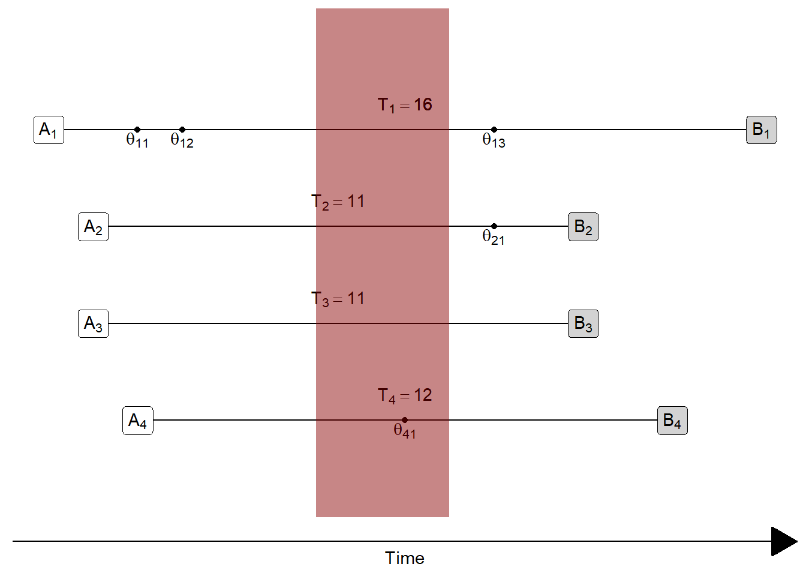


Can you think of any examples of a cohort outside of traditional demography?

* Customer analytics?
* Employee analytics?
* Mechanical engineering?
* Plant biology?
* Something else?

## Probabilities of occurrence of events

:::{.rmdimportant}
**KEY CONCEPT**

**Probabilities** measure the **chance** an event occurs in a **cohort** within **a specific timeframe**

$$
\textsf{Probability} = \frac{
  \textsf{Number of occurrences }
}{
  \color{darkorange}{\textsf{Number of preceding events or trials}}
}
$$

Probabilities also specify a window of observation from...
  
* when the "preceding event or trial" qualifies for inclusion in the cohort...
* ... until either the event occurs or the individual stops being observed

The maximal observation time needs to be same for each member of the cohort

Therefore each individual counted in the denominator needs to have been observed for at least as long as the duration of the observation window

**Rates** measure the the **pace** of occurrences per person-year in a **population**

$$
\textsf{Rate} = \frac{
  \textsf{Number of occurrences} 
}{
  \color{dodgerblue}{\textsf{Number of person-periods lived}}
}
$$

Rates specify a window of observation, as well, but its starting point is not defined by entry of an individual into a cohort.

Instead, it's defined by the start of the period of observation.

All occurrences and person-periods lived within observation window are counted

No occurrences or person-periods outside the observation window are counted
:::

A lot of this will make way more sense when we study Lexis diagrams

<details>
<summary>Why does a probability require an observation window with a starting and ending point? **Tap for answer**</summary>
Because if you don't specify the end of your observation period, somebody or something else will!

**Example**: All humans eventually die so the following probability is approximately equal to unity (aka 100%) and thus not all that useful:

$$
\frac{
  \begin{pmatrix}
    \textsf{Number of deaths among people born in 1992} \\
    \textsf{from now until the heat death of the universe}
  \end{pmatrix}
}
{(\textsf{Number of people born in 1992})}
$$

> In the long run, we are all dead
>
> -- John Maynard Keynes

</details>
<br>
