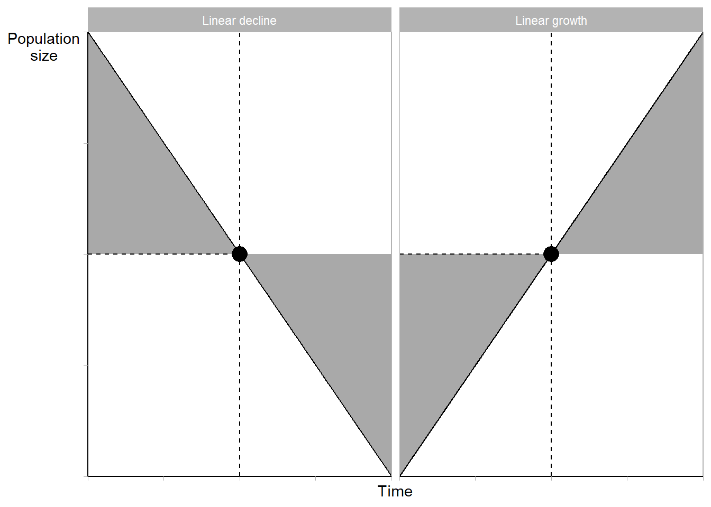
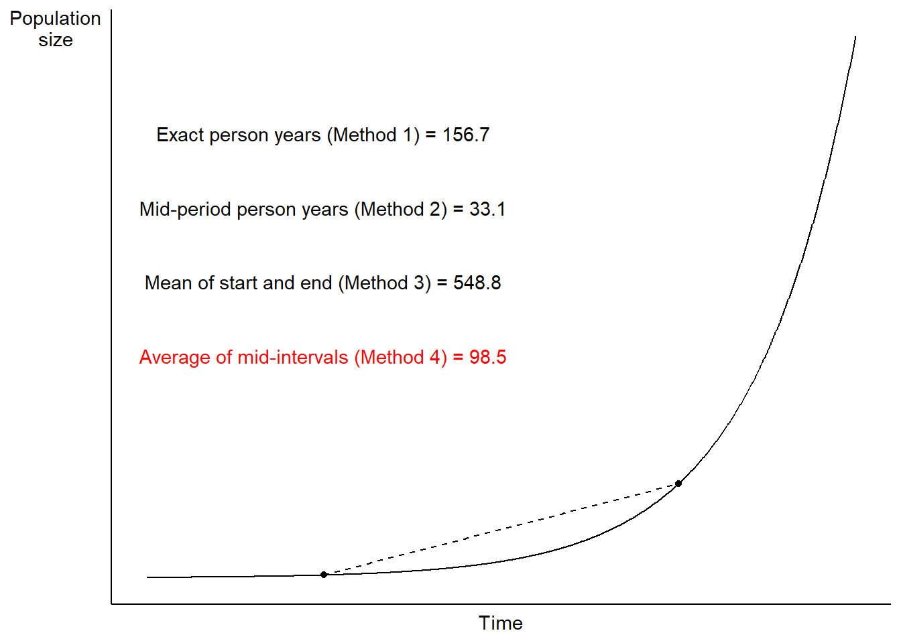
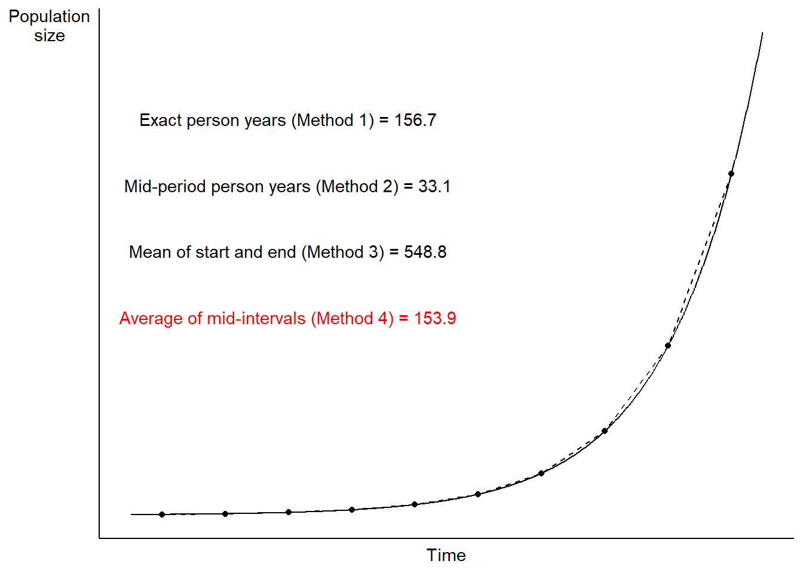

# Concepts and measures


## What is demography and why is it important?

:::{.rmdnote}
### Definitions of demography {.unnumbered}

* "...the scientific study of human **populations** primarily with respect to their **size**, their **structure** and their **development**; it takes into account the quantitative aspects of their general characteristics. [@population_multilingual_1958]
* The study of human **populations** in relation to the changes brought about by the interplay of **births**, **deaths**, and **migration**. [@pressat1985dictionary]
* "...the study of of human **populations** -- their **size**, **composition** and **distribution** across **space** -- and the **process** through which populations **change**. [@suda_demography]

*Emphasis added.*
:::

**Discussion questions**

<details>
<summary>What are the "processes" that the Stockholm University Demographic Unit's definition drives at? **Tap for answer**</summary>
* Birth
* Death
* Migration
</details><br>

<details>
<summary>What are three basic dimensions along which these changes occur? **Tap for answer**</summary>
* Time
* Space
* Structure
</details>
<br>

### Okay so what's a "population" then? {.unnumbered}

**For statistians:** A collection of items

**For demographers:**

1. A **collection of persons**...
1. who **meet certain criteria**
1. alive at a **specified point in time**...
<br><br>

<details>
<summary>Anything odd about point 1 above?</summary>
Non-human biologists do demography, too.

* Dr. Hal Caswell, Professor of Mathematical **Demography** at University of Amsterdam: https://www.uva.nl/en/profile/c/a/h.caswell/h.caswell.html
* Wrote influential book on matrix **population models** (aka... **demography**)

> "My research focuses on **population models**, usually based on matrices, for **plants, [non-human] animals, and humans**.  I am interested in stochastic processes in **demography**..."
>
> -- Hal Caswell (my emphasis)


</details>
<br>

<details>
<summary>Let's think of some examples.</summary>
* **Collection:** People...
* **Criteria:** living in King County, Washington...
* **Specified point in time:** on April 1, 2019


<center>**2.3 M people**^[1-year American Community Survey 2019 total population estimate]</center>
</details>
<br>

**Also for demographers:**

<center>_Population as an **enduring** collection of individuals_</center>
<br>

<details>
<summary>Extending our Seattle metro example to "enduring" collections</summary>
Now we can see how the population changes, in this case over time...

King County population grew by 28% over 14 years.

```{=html}
<div id="htmlwidget-6214f6e4d31a446fcb72" style="width:672px;height:480px;" class="plotly html-widget"></div>
<script type="application/json" data-for="htmlwidget-6214f6e4d31a446fcb72">{"x":{"data":[{"x":[2005,2006,2007,2008,2009,2010,2011,2012,2013,2014,2015,2016,2017,2018,2019],"y":[1755818,1826732,1859284,1875519,1916441,1937961,1969722,2007440,2044449,2079967,2117125,2149970,2188649,2233163,2252782],"text":"","type":"scatter","mode":"markers+lines","marker":{"autocolorscale":false,"color":"rgba(0,0,0,1)","opacity":1,"size":5.66929133858268,"symbol":"circle","line":{"width":1.88976377952756,"color":"rgba(0,0,0,1)"}},"hoveron":"points","showlegend":false,"xaxis":"x","yaxis":"y","hoverinfo":"text","line":{"width":1.88976377952756,"color":"rgba(0,0,0,1)","dash":"solid"},"frame":null},{"x":[2005.6,2019.6],"y":[1755818,2252782],"text":["1.8M","2.3M"],"hovertext":["",""],"textfont":{"size":14.6645669291339,"color":"rgba(0,0,0,1)"},"type":"scatter","mode":"text","hoveron":"points","showlegend":false,"xaxis":"x","yaxis":"y","hoverinfo":"text","frame":null}],"layout":{"margin":{"t":43.7625570776256,"r":7.30593607305936,"b":25.5707762557078,"l":34.337899543379},"font":{"color":"rgba(0,0,0,1)","family":"","size":14.6118721461187},"title":{"text":"Total population - King County, WA (2005-2019)","font":{"color":"rgba(0,0,0,1)","family":"","size":17.5342465753425},"x":0,"xref":"paper"},"xaxis":{"domain":[0,1],"automargin":true,"type":"linear","autorange":false,"range":[2004.27,2020.33],"tickmode":"array","ticktext":["2005","2006","2007","2008","2009","2010","2011","2012","2013","2014","2015","2016","2017","2018","2019"],"tickvals":[2005,2006,2007,2008,2009,2010,2011,2012,2013,2014,2015,2016,2017,2018,2019],"categoryorder":"array","categoryarray":["2005","2006","2007","2008","2009","2010","2011","2012","2013","2014","2015","2016","2017","2018","2019"],"nticks":null,"ticks":"","tickcolor":null,"ticklen":3.65296803652968,"tickwidth":0,"showticklabels":true,"tickfont":{"color":"rgba(77,77,77,1)","family":"","size":11.689497716895},"tickangle":-0,"showline":false,"linecolor":null,"linewidth":0,"showgrid":true,"gridcolor":"rgba(235,235,235,1)","gridwidth":0.66417600664176,"zeroline":false,"anchor":"y","title":{"text":"","font":{"color":"rgba(0,0,0,1)","family":"","size":14.6118721461187}},"hoverformat":".2f","fixedrange":true},"yaxis":{"domain":[0,1],"automargin":true,"type":"linear","autorange":false,"range":[1730969.8,2277630.2],"tickmode":"array","ticktext":["1.8M","1.9M","2.0M","2.1M","2.2M"],"tickvals":[1800000,1900000,2000000,2100000,2200000],"categoryorder":"array","categoryarray":["1.8M","1.9M","2.0M","2.1M","2.2M"],"nticks":null,"ticks":"","tickcolor":null,"ticklen":3.65296803652968,"tickwidth":0,"showticklabels":true,"tickfont":{"color":"rgba(77,77,77,1)","family":"","size":11.689497716895},"tickangle":-0,"showline":false,"linecolor":null,"linewidth":0,"showgrid":true,"gridcolor":"rgba(235,235,235,1)","gridwidth":0.66417600664176,"zeroline":false,"anchor":"x","title":{"text":"","font":{"color":"rgba(0,0,0,1)","family":"","size":14.6118721461187}},"hoverformat":".2f","fixedrange":true},"shapes":[{"type":"rect","fillcolor":null,"line":{"color":null,"width":0,"linetype":[]},"yref":"paper","xref":"paper","x0":0,"x1":1,"y0":0,"y1":1}],"showlegend":false,"legend":{"bgcolor":null,"bordercolor":null,"borderwidth":0,"font":{"color":"rgba(0,0,0,1)","family":"","size":11.689497716895}},"hovermode":"closest","barmode":"relative"},"config":{"doubleClick":"reset","modeBarButtonsToAdd":["hoverclosest","hovercompare"],"showSendToCloud":false,"displayModeBar":false},"source":"A","attrs":{"4e4839033218":{"x":{},"y":{},"type":"scatter"},"4e48344c20b0":{"x":{},"y":{}},"4e4847f619c1":{"x":{},"y":{},"label":{}}},"cur_data":"4e4839033218","visdat":{"4e4839033218":["function (y) ","x"],"4e48344c20b0":["function (y) ","x"],"4e4847f619c1":["function (y) ","x"]},"highlight":{"on":"plotly_click","persistent":false,"dynamic":false,"selectize":false,"opacityDim":0.2,"selected":{"opacity":1},"debounce":0},"shinyEvents":["plotly_hover","plotly_click","plotly_selected","plotly_relayout","plotly_brushed","plotly_brushing","plotly_clickannotation","plotly_doubleclick","plotly_deselect","plotly_afterplot","plotly_sunburstclick"],"base_url":"https://plot.ly"},"evals":[],"jsHooks":[]}</script>
```
</details>
<br>

## The balancing equation of population change

* Consider an observation period of length $T$
* For now, arbitrarily set the period's starting point at time $t = 0$

$\begin{align}
N(T) &= \textsf{ (Ending population size at time } T \textsf{)} \\
     &+ N(0) \textsf{ (Starting population size at time } 0 \textsf{)} \\
     &+ B[0,T] \textsf{ (Number of births from start to end)} \\
     &- D[0,T] \textsf{ (Number of deaths from start to end)} \\
     &+ I[0,T] \textsf{ (Number in-migrations from start to end)} \\
     &- O[0,T] \textsf{ (Number out-migrations from start to end)} \\
\end{align}$

<details>
<summary>Organized by ways to enter vs. exit a population...</summary>
$\begin{align}
N(T) &= N(0) \\
     &+ B[0,T] + I[0,T] \textsf{ (Ways to enter)} \\
     &- D[0,T] - O[0,T] \textsf{ (Ways to exit)}
\end{align}$
</details>
<br>

<details>
<summary>Organized by natural increase vs. net migration...</summary>
$\begin{align}
NI[0,T] &= B[0,T] - D[0,T] \textsf{ (Natural increase)} \\
NM[0,T] &= I[0,T] - O[0,T] \textsf{ (Net migration)}
\end{align}$
</details>
<br>

<details><summary>And putting it all together...</summary>
$N(T) = N[0] + NI[0,T] + NM[0,T]$
</details>
<br>

### Balancing equation as flows and stocks {.unnumbered}

* Boxes represent states that individuals in a population can be in
* Arrows represent a flow of individuals from one state to another

{width=100%}

### Balancing equation example: Sweden in 1988 {.unnumbered}


```{=html}
<div id="htmlwidget-df87b2b5c9fdaa5d020f" style="width:100%;height:auto;" class="datatables html-widget"></div>
<script type="application/json" data-for="htmlwidget-df87b2b5c9fdaa5d020f">{"x":{"filter":"none","vertical":false,"data":[["Starting population","Births","Deaths","In-migrations","Out-migrations","Ending population"],["N(1988)","B[1988,1989]","D[1988,1989]","I[1988,1989]","O[1988,1989]","N(1989)"],["8,416,599","+ 112,080","– 96,756","+ 51,092","– 21,461","= 8,461,554"],[null,"Enters","Exits","Enters","Exits",null],[null,"Positive impact on NI[0,T]","Negative impact on NI[0,T]","Positive impact on NM[0,T]","Negative impact on NM[0,T]",null]],"container":"<table class=\"display\">\n  <thead>\n    <tr>\n      <th><\/th>\n      <th><\/th>\n      <th><\/th>\n      <th><\/th>\n      <th><\/th>\n    <\/tr>\n  <\/thead>\n<\/table>","options":{"ordering":false,"dom":"t","order":[],"autoWidth":false,"orderClasses":false,"rowCallback":"function(row, data, displayNum, displayIndex, dataIndex) {\nvar value=data[0]; $(this.api().cell(row, 0).node()).css({'font-weight':'bold'});\nvar value=data[1]; $(this.api().cell(row, 1).node()).css({'font-style':'italic','font-family':'MathJax TeX'});\nvar value=data[3]; $(this.api().cell(row, 3).node()).css({'color':value == \"Enters\" ? \"skyblue\" : value == \"Exits\" ? \"orange\" : null});\nvar value=data[4]; $(this.api().cell(row, 4).node()).css({'background-color':value == \"Positive impact on NI[0,T]\" ? \"skyblue\" : value == \"Negative impact on NI[0,T]\" ? \"orange\" : value == \"Positive impact on NM[0,T]\" ? \"skyblue\" : value == \"Negative impact on NM[0,T]\" ? \"orange\" : null});\n}"}},"evals":["options.rowCallback"],"jsHooks":[]}</script>
```

:::{.rmdtip}
**DEMOGRAPHY & DATA SCIENCE**

### Balancing equation a company's employees {.unnumbered}

Let's apply this lesson to a population a data scientist might work with:

<center>**A company's employee headcount grows**</center>

Think of analogies to the components of the balancing equation
<br><br>

<details>
<summary>Analogy to births $B[0,T]$?</summary>
New hires $H[0,T]$

What are some weaknesses of this analogy?<br>
**Hint:** Look at the source of $B[0,T]$ in that stock and flow chart

{width=100%}
</details>
<br>

<details>
<summary>Analogy to deaths $D[0,T]$?</summary>
Terminations (aka "separations" for the Bureau of Labor Statistics) $S[0,T]$

What are some weaknesses of this deaths:terminations analogy?<br>
**Hint:** Look at the destination of $D[0,T]$ in that stock and flow chart

{width=100%}
</details>
<br>

<details>
<summary>Analogies to in-migrations and out-migrations $B[0,T]$?</summary>
Transfers into and out of departments, teams, job functions, etc.

* In-transfers $I[0,T]$
* Out-transfers $O[0,T]$

Collection of employees in specific department, team, job function, etc.
</details>
<br>


**Example:** Below is random sample from a data table of employees from a real Russian company^[Documented here: https://www.kaggle.com/davinwijaya/employee-turnover]:

* **tenure** is the number of months the employee worked at the company
* **left_company** equal 1 if the employee terminated, 0 otherwise
* Notice the other attributes available like **gender** and **age**


```{=html}
<div id="htmlwidget-5906aca8911a1e9ab810" style="width:100%;height:auto;" class="datatables html-widget"></div>
<script type="application/json" data-for="htmlwidget-5906aca8911a1e9ab810">{"x":{"filter":"none","vertical":false,"data":[["1","2","3","4","5","6","7","8","9","10","11","12","13","14","15","16","17","18","19","20","21","22","23","24","25","26","27","28","29","30","31","32","33","34","35","36","37","38","39","40","41","42","43","44","45","46","47","48","49","50","51","52","53","54","55","56","57","58","59","60","61","62","63","64","65","66","67","68","69","70","71","72","73","74","75","76","77","78","79","80","81","82","83","84","85","86","87","88","89","90","91","92","93","94","95","96","97","98","99","100","101","102","103","104","105","106","107","108","109","110","111","112","113","114","115","116","117","118","119","120","121","122","123","124","125","126","127","128","129","130","131","132","133","134","135","136","137","138","139","140","141","142","143","144","145","146","147","148","149","150","151","152","153","154","155","156","157","158","159","160","161","162","163","164","165","166","167","168","169","170","171","172","173","174","175","176","177","178","179","180","181","182","183","184","185","186","187","188","189","190","191","192","193","194","195","196","197","198","199","200","201","202","203","204","205","206","207","208","209","210","211","212","213","214","215","216","217","218","219","220","221","222","223","224","225","226","227","228","229","230","231","232","233","234","235","236","237","238","239","240","241","242","243","244","245","246","247","248","249","250","251","252","253","254","255","256","257","258","259","260","261","262","263","264","265","266","267","268","269","270","271","272","273","274","275","276","277","278","279","280","281","282","283","284","285","286","287","288","289","290","291","292","293","294","295","296","297","298","299","300","301","302","303","304","305","306","307","308","309","310","311","312","313","314","315","316","317","318","319","320","321","322","323","324","325","326","327","328","329","330","331","332","333","334","335","336","337","338","339","340","341","342","343","344","345","346","347","348","349","350","351","352","353","354","355","356","357","358","359","360","361","362","363","364","365","366","367","368","369","370","371","372","373","374","375","376","377","378","379","380","381","382","383","384","385","386","387","388","389","390","391","392","393","394","395","396","397","398","399","400","401","402","403","404","405","406","407","408","409","410","411","412","413","414","415","416","417","418","419","420","421","422","423","424","425","426","427","428","429","430","431","432","433","434","435","436","437","438","439","440","441","442","443","444","445","446","447","448","449","450","451","452","453","454","455","456","457","458","459","460","461","462","463","464","465","466","467","468","469","470","471","472","473","474","475","476","477","478","479","480","481","482","483","484","485","486","487","488","489","490","491","492","493","494","495","496","497","498","499","500","501","502","503","504","505","506","507","508","509","510","511","512","513","514","515","516","517","518","519","520","521","522","523","524","525","526","527","528","529","530","531","532","533","534","535","536","537","538","539","540","541","542","543","544","545","546","547","548","549","550","551","552","553","554","555","556","557","558","559","560","561","562","563","564","565","566","567","568","569","570","571","572","573","574","575","576","577","578","579","580","581","582","583","584","585","586","587","588","589","590","591","592","593","594","595","596","597","598","599","600","601","602","603","604","605","606","607","608","609","610","611","612","613","614","615","616","617","618","619","620","621","622","623","624","625","626","627","628","629","630","631","632","633","634","635","636","637","638","639","640","641","642","643","644","645","646","647","648","649","650","651","652","653","654","655","656","657","658","659","660","661","662","663","664","665","666","667","668","669","670","671","672","673","674","675","676","677","678","679","680","681","682","683","684","685","686","687","688","689","690","691","692","693","694","695","696","697","698","699","700","701","702","703","704","705","706","707","708","709","710","711","712","713","714","715","716","717","718","719","720","721","722","723","724","725","726","727","728","729","730","731","732","733","734","735","736","737","738","739","740","741","742","743","744","745","746","747","748","749","750","751","752","753","754","755","756","757","758","759","760","761","762","763","764","765","766","767","768","769","770","771","772","773","774","775","776","777","778","779","780","781","782","783","784","785","786","787","788","789","790","791","792","793","794","795","796","797","798","799","800","801","802","803","804","805","806","807","808","809","810","811","812","813","814","815","816","817","818","819","820","821","822","823","824","825","826","827","828","829","830","831","832","833","834","835","836","837","838","839","840","841","842","843","844","845","846","847","848","849","850","851","852","853","854","855","856","857","858","859","860","861","862","863","864","865","866","867","868","869","870","871","872","873","874","875","876","877","878","879","880","881","882","883","884","885","886","887","888","889","890","891","892","893","894","895","896","897","898","899","900","901","902","903","904","905","906","907","908","909","910","911","912","913","914","915","916","917","918","919","920","921","922","923","924","925","926","927","928","929","930","931","932","933","934","935","936","937","938","939","940","941","942","943","944","945","946","947","948","949","950","951","952","953","954","955","956","957","958","959","960","961","962","963","964","965","966","967","968","969","970","971","972","973","974","975","976","977","978","979","980","981","982","983","984","985","986","987","988","989","990","991","992","993","994","995","996","997","998","999","1000","1001","1002","1003","1004","1005","1006","1007","1008","1009","1010","1011","1012","1013","1014","1015","1016","1017","1018","1019","1020","1021","1022","1023","1024","1025","1026","1027","1028","1029","1030","1031","1032","1033","1034","1035","1036","1037","1038","1039","1040","1041","1042","1043","1044","1045","1046","1047","1048","1049","1050","1051","1052","1053","1054","1055","1056","1057","1058","1059","1060","1061","1062","1063","1064","1065","1066","1067","1068","1069","1070","1071","1072","1073","1074","1075","1076","1077","1078","1079","1080","1081","1082","1083","1084","1085","1086","1087","1088","1089","1090","1091","1092","1093","1094","1095","1096","1097","1098","1099","1100","1101","1102","1103","1104","1105","1106","1107","1108","1109","1110","1111","1112","1113","1114","1115","1116","1117","1118","1119","1120","1121","1122","1123","1124","1125","1126","1127","1128","1129"],[48.09856263,19.31827515,35.94250513,19.05544148,13.17453799,131.613963,104.0164271,11.07186858,35.84394251,19.28542094,15.14579055,123.0718686,103.5893224,16.62422998,81.18275154,24.3449692,14.58726899,12.09034908,6.275154004,28.15605749,9.593429158,11.53182752,16,20.46817248,2.431211499,27.23613963,2.792607803,24.47638604,2.266940452,11.8275154,40.60780287,6.176591376,26.54620123,23.9835729,14.22587269,103.7207392,0.919917864,70.34086242,24.27926078,138.9404517,0.492813142,21.88090349,49.28131417,43.4661191,46.78439425,19.18685832,23.2936345,80.98562628,4.435318275,12.12320329,2.201232033,140.9445585,20.76386037,13.86447639,6.275154004,34.23408624,3.811088296,78.91581109,3.58110883,15.54004107,2.694045175,96.65708419,150.9979466,8.180698152,11.66324435,7.852156057,78.32443532,2.792607803,140.2217659,50.98973306,37.12525667,34.56262834,26.0862423,44.02464066,23.9835729,59.76180698,110.0287474,8.969199179,12.02464066,3.58110883,163.8110883,23.68788501,86.6036961,5.650924025,56.77207392,29.47022587,15.3100616,57.52772074,33.90554415,18.00410678,10.48049281,10.11909651,29.70020534,13.33880903,42.38193018,79.86858316,12.32032854,10.51334702,1.642710472,67.35112936,57.10061602,4.501026694,1.741273101,57.65913758,96,80.65708419,59.99178645,42.25051335,6.603696099,7.12936345,32.32854209,14.55441478,35.38398357,2.168377823,51.31827515,66.49691992,51.1211499,59.20328542,10.61190965,82.82546201,0.427104723,73.98767967,16.22997947,70.93223819,11.49897331,0.525667351,15.11293634,22.57084189,7.162217659,21.35523614,51.31827515,16.62422998,8.147843943,40.87063655,113.8398357,45.37166324,18.49691992,78.68583162,42.18480493,38.86652977,18.7926078,32.88706366,13.8973306,24.24640657,65.3798768,30.22587269,14.6201232,13.10882957,15.93429158,81.83983573,5.749486653,27.40041068,84.04106776,5.092402464,14.48870637,24.08213552,9.889117043,27.56468172,25.42915811,45.30595483,50.69404517,12.78028747,86.66940452,25.23203285,90.90759754,1.18275154,7.852156057,91.99178645,51.08829569,40.3449692,13.17453799,44.22176591,3.876796715,8.180698152,31.34291581,18.16837782,163.7782341,2.102669405,59.49897331,88.90349076,9.921971253,17.01848049,50.72689938,55.12936345,9.823408624,7.589322382,36.00821355,24.83778234,2.201232033,9.133470226,55.22792608,23.52361396,19.35112936,18.13552361,58.94045175,34.59548255,164.5667351,86.83367556,93.8973306,0.689938398,28.35318275,5.388090349,2.102669405,15.11293634,24.83778234,8.213552361,3.449691992,17.51129363,16.65708419,130.9897331,96.59137577,18.33264887,45.30595483,23.55646817,41.29774127,17.51129363,45.8973306,7.819301848,54.07802875,13.40451745,29.30595483,54.07802875,42.94045175,16.62422998,43.86036961,57.62628337,15.93429158,7.852156057,53.48665298,12.81314168,11.69609856,37.38809035,14.71868583,48.6899384,86.83367556,4.1724846,39.2936345,27.33470226,21.48665298,120.4435318,12.97741273,142.4558522,132.4024641,5.650924025,0.755646817,8.936344969,42.38193018,6.242299795,9.626283368,49.31416838,23.45790554,93.9301848,8.739219713,8.772073922,9.034907598,3.121149897,3.351129363,22.24229979,1.839835729,23.19507187,23.12936345,33.57700205,2.792607803,61.73305955,7.589322382,7.195071869,32.45995893,17.57700205,8.082135524,7.030800821,26.31622177,79.86858316,17.24845996,49.80698152,34.29979466,4.533880903,22.24229979,14.85010267,34.82546201,5.94661191,59.20328542,27.36755647,13.10882957,45.30595483,36.73100616,94.78439425,4.369609856,50.72689938,94.81724846,37.32238193,51.87679671,26.4476386,36.96098563,4.993839836,23.2936345,12.25462012,8.27926078,90.15195072,7.162217659,30.78439425,21.88090349,25.65913758,19.71252567,18.16837782,101.5195072,103.3921971,73.65913758,82.75975359,4.468172485,53.2238193,54.01232033,19.94250513,79.80287474,15.40862423,42.90759754,23.9835729,6.800821355,72.67351129,21.61806982,89.19917864,46.22587269,22.24229979,32.32854209,60.25462012,1.708418891,3.318275154,3.811088296,19.74537988,20.04106776,17.18275154,45.07597536,5.256673511,15.57289528,59.89322382,27.59753593,14.9486653,20.99383984,3.975359343,14.48870637,53.19096509,2.168377823,116.7310062,44.48459959,1.938398357,11.69609856,16.42710472,13.27310062,73.29774127,22.66940452,52.73100616,79.54004107,11.23613963,31.14579055,43.92607803,29.70020534,64.52566735,43.4661191,4.76386037,155.3675565,25.36344969,34.59548255,23.6550308,50.89117043,33.41273101,16.65708419,23.03080082,39.22792608,26.94045175,9.49486653,3.252566735,12.64887064,7.819301848,2.036960986,67.84394251,38.53798768,42.0862423,34.0698152,8.969199179,8.607802875,32,15.34291581,19.44969199,64.19712526,38.86652977,59.86036961,14.48870637,11.56468172,19.1211499,11.99178645,10.51334702,5.848049281,27.36755647,6.275154004,38.01232033,103.5893224,33.93839836,51.58110883,32.85420945,30.71868583,9.133470226,73.13347023,24.21355236,94.9486653,11.53182752,58.94045175,27.36755647,118.8008214,12.8788501,11.99178645,28.02464066,39.26078029,40.57494867,33.28131417,22.9650924,7.12936345,9.034907598,2.102669405,34.56262834,23.6550308,8.837782341,92.64887064,81.24845996,57.23203285,14.58726899,19.44969199,10.51334702,23.9835729,25.52772074,20.59958932,13.07597536,22.70225873,3.482546201,24.90349076,10.11909651,25.33059548,150.1437372,153.100616,59.17043121,11.95893224,74.74332649,5.420944559,79.01437372,86.04517454,109.2402464,89.36344969,30.22587269,35.28542094,4.960985626,97.44558522,3.58110883,0.887063655,4.862422998,15.57289528,51.8110883,26.80903491,9.691991786,63.54004107,9.330595483,73.49486653,96.52566735,49.47843943,106.8418891,16.49281314,113.0513347,15.70431211,30.12731006,38.76796715,6.078028747,58.21765914,3.482546201,37.78234086,2.759753593,8.640657084,28.84599589,86.53798768,24.24640657,5.026694045,26.87474333,5.848049281,28.78028747,17.83983573,28.58316222,41.69199179,10.02053388,11.00616016,7.589322382,49.41273101,32.52566735,95.96714579,99.77823409,13.9301848,49.87268994,23.52361396,106.2176591,38.01232033,9.790554415,10.94045175,6.669404517,32.45995893,16.85420945,64.29568789,39.06365503,12.02464066,56.73921971,89.00205339,96.72279261,133.4209446,73.42915811,16.06570842,39.72073922,61.73305955,70.50513347,11.8275154,34.95687885,5.289527721,51.08829569,2.234086242,77.53593429,41.65913758,1.117043121,75.8275154,26.21765914,42.48049281,33.67556468,114.8583162,20.92813142,59.20328542,18.16837782,22.73511294,16.95277207,3.482546201,39.22792608,12.38603696,7.950718686,23.95071869,36.33675565,16.06570842,22.01232033,22.66940452,23.9835729,23.45790554,11.69609856,45.73305955,5.158110883,5.092402464,133.9137577,17.80698152,8.87063655,11.99178645,3.416837782,85.48665298,39.22792608,0.788501027,42.57905544,4.008213552,9.691991786,12.05749487,160.0657084,24.0164271,2.825462012,2.234086242,88.83778234,2.135523614,44.94455852,133.8809035,5.519507187,70.17659138,28.35318275,70.93223819,87.68788501,54.9650924,7.950718686,78.68583162,6.176591376,29.01026694,20.04106776,58.80903491,63.70431211,7.227926078,9.790554415,17.41273101,5.749486653,52.10677618,34.03696099,34.03696099,40.3449692,16,129.2813142,41.69199179,17.41273101,7.523613963,45.30595483,23.45790554,39.26078029,26.94045175,43.26899384,19.51540041,1.80698152,26.18480493,8.410677618,28.81314168,45.37166324,53.35523614,52.73100616,5.782340862,53.09240246,4.960985626,81.64271047,35.77823409,90.51334702,17.11704312,16.95277207,22.63655031,11.03901437,49.3798768,90.51334702,55.72073922,1.347022587,17.60985626,32.88706366,11.76180698,23.95071869,12.32032854,38.76796715,52.27104723,36.92813142,61.07597536,3.975359343,6.439425051,42.48049281,22.73511294,49.7412731,50.20123203,13.14168378,5.125256674,42.18480493,10.61190965,1.478439425,23.55646817,16.65708419,50.29979466,23.75359343,108.550308,9.757700205,49.14989733,64.29568789,49.28131417,85.09240246,31.50718686,19.44969199,133.8809035,4.073921971,43.8275154,1.675564682,17.93839836,3.811088296,12.38603696,12.68172485,7.326488706,16.75564682,5.815195072,118.899384,16.91991786,22.47227926,1.149897331,73.82340862,55.95071869,13.01026694,36.59958932,59.20328542,2.759753593,10.61190965,25.98767967,59.86036961,83.58110883,26.21765914,53.81519507,16.59137577,42.57905544,29.24024641,43.17043121,16.65708419,33.57700205,6.143737166,3.121149897,19.51540041,2.858316222,48.45995893,48.45995893,14.45585216,13.66735113,9.034907598,96,43.99178645,8.180698152,10.7761807,34.95687885,52.50102669,73.3963039,27.49897331,59.99178645,31.96714579,36.73100616,23.03080082,27.92607803,13.10882957,109.1088296,60.78028747,53.58521561,80.16427105,37.09240246,9.264887064,57.69199179,14.06160164,8.016427105,31.34291581,105.9219713,55.12936345,45.96303901,123.3347023,128.1314168,21.88090349,26.21765914,27.40041068,2.135523614,2.135523614,6.045174538,115.5482546,2.39835729,20.59958932,25.06776181,43.30184805,5.585215606,82.82546201,4.402464066,47.21149897,5.848049281,16.95277207,52.79671458,42.61190965,76.15605749,16.95277207,4.928131417,63.11293634,128.0657084,72.41067762,19.84394251,18.95687885,48.6899384,53.42094456,7.030800821,52.96098563,8.180698152,16.06570842,11.72895277,17.60985626,24.27926078,9.199178645,18.1026694,74.05338809,36.23819302,1.18275154,2.858316222,30.02874743,7.819301848,10.84188912,15.70431211,33.93839836,4.960985626,50.59548255,10.90759754,1.80698152,23.9835729,17.3798768,15.60574949,4.960985626,43.95893224,22.73511294,86.6036961,5.9137577,5.092402464,57.65913758,7.950718686,52.00821355,20.69815195,39.68788501,15.93429158,85.48665298,144.5913758,48.19712526,8.410677618,66.7926078,27.36755647,20.69815195,51.94250513,3.975359343,55.78644764,55.95071869,15.21149897,4.435318275,45.79876797,40.31211499,49.70841889,2.98973306,95.21149897,17.57700205,54.04517454,14.22587269,50.0698152,108.8788501,38.01232033,6.53798768,15.70431211,21.48665298,38.17659138,0.492813142,9.790554415,56.77207392,60.78028747,26.11909651,79.54004107,51.84394251,16.06570842,11.92607803,26.15195072,14.98151951,2.759753593,8.31211499,19.18685832,70.83367556,40.11498973,4.336755647,54.01232033,11.76180698,70.17659138,12.78028747,29.8973306,5.092402464,21.65092402,5.749486653,26.34907598,9.100616016,81.83983573,2.102669405,5.585215606,21.15811088,61.99589322,30.68583162,35.94250513,51.94250513,55.95071869,163.7782341,43.69609856,19.08829569,70.83367556,94.78439425,23.45790554,40.04928131,11.72895277,47.6386037,20.92813142,129.8069815,50.72689938,20.89527721,0.394250513,11.89322382,10.38193018,21.88090349,72.57494867,60.94455852,33.97125257,24.18069815,53.58521561,49.80698152,9.790554415,45.53593429,8.969199179,15.34291581,45.43737166,33.87268994,26.94045175,1.445585216,49.31416838,32.45995893,12.32032854,9.790554415,166.275154,1.938398357,82.7926078,7.852156057,19.44969199,19.44969199,99.77823409,36.59958932,33.01848049,26.02053388,59.00616016,19.8110883,22.07802875,14.48870637,8.640657084,110.4887064,37.9137577,45.5687885,27.59753593,3.975359343,47.96714579,3.121149897,3.975359343,13.40451745,27.56468172,16.78850103,10.64476386,9.790554415,52.862423,32.88706366,20.30390144,13.8973306,20.04106776,24.83778234,123.6960986,26.57905544,68.27104723,35.28542094,8.344969199,103.5893224,92.64887064,40.37782341,53.97946612,32.95277207,15.86858316,42.94045175,2.36550308,7.030800821,35.74537988,53.35523614,46.35728953,15.14579055,12.35318275,105.1663244,15.73716632,22.73511294,26.67761807,81.64271047,3.58110883,73.29774127,37.15811088,84.89527721,0.492813142,10.7761807,15.01437372,51.74537988,3.58110883,66.69404517,4.041067762,7.589322382,76.68172485,57.82340862,133.9137577,11.79466119,140.9445585,3.252566735,12.97741273,144.7556468,112.788501,32.49281314,1.117043121,9.100616016,60.94455852,40.31211499,15.11293634,27.4661191,8.772073922,61.2073922,2.431211499,13.5687885,6.176591376,32.32854209,34.49691992,14.85010267,48.19712526,12.78028747,11.03901437,166.0780287,34.59548255,5.026694045,7.162217659,64.75564682,23.95071869,23.88501027,7.852156057,80.06570842,46.9486653,11.26899384,13.73305955,18.92402464,11.86036961,24.27926078,139.0718686,132.8952772,50.23408624,8.147843943,40.60780287,20.56673511,63.14579055,24.41067762,27.86036961,4.533880903,64.75564682,1.971252567,95.44147844,17.60985626,59.40041068,2.135523614,20.92813142,39.22792608,73.49486653,19.87679671,23.45790554,6.800821355,61.79876797,149.6180698,16.22997947,1.708418891,20.89527721,38.70225873,15.17864476,8.574948665,16.32854209,142.75154,25.98767967,12.68172485,32.26283368,22.37371663,113.8398357,45.73305955,155.1704312,12.5174538,13.01026694,7.589322382,16.82135524,70.93223819,20.92813142,30.35728953,114.1355236,107.1704312,3.778234086,70.30800821,39.88501027,71.22792608,52.73100616,12.22176591,40.47638604,132.8952772,10.34907598,3.975359343,94.12731006,5.35523614,44.78028747,16.82135524,19.58110883,11.30184805,48.62422998,29.07597536,9.527720739,23.68788501,17.11704312,52.66529774,9.067761807,20.30390144,36.59958932,38.89938398,48.45995893,9.429158111,26.67761807,23.81930185,67.4825462,23.45790554,99.77823409,123.3347023,5.32238193,86.66940452,18.56262834,17.93839836,66.69404517,58.97330595,16.39425051,16.78850103,21.88090349,58.4476386,42.57905544,1.412731006,33.3798768,100.238193,44.97741273,44.55030801,18.49691992,3.449691992,18.95687885,13.8973306,6.866529774,21.15811088,29.96303901,89.36344969,19.18685832,105.8234086,41.29774127,7.030800821,11.49897331,29.27310062,49.34702259,3.252566735,8.772073922,68.27104723,20.96098563,79.11293634,1.80698152,5.453798768,6.669404517,11.95893224,17.08418891,15.70431211,35.84394251,12.8788501,3.121149897,71.2936345,23.2936345,80.49281314,179.449692],[1,0,0,0,1,0,0,1,0,1,1,1,0,0,1,1,1,1,1,1,1,0,1,0,1,0,1,0,1,1,0,1,1,1,0,0,1,0,0,0,0,0,0,0,1,0,0,1,1,1,1,0,0,1,1,0,1,1,1,1,0,0,1,1,0,0,0,1,0,1,1,1,1,1,1,0,0,1,1,1,1,1,1,1,1,1,1,0,0,0,1,0,0,1,1,1,0,0,1,1,0,0,1,0,1,1,0,1,1,0,1,0,1,0,0,1,0,1,0,1,1,0,1,1,1,0,0,1,0,1,0,0,0,1,0,1,1,1,0,1,0,0,1,1,0,0,1,1,1,1,0,0,0,0,0,1,1,0,1,1,0,1,0,1,0,0,0,1,1,0,1,0,0,1,0,0,0,0,1,0,0,1,1,0,1,1,0,0,1,0,0,1,0,0,0,0,0,1,0,0,1,1,0,0,1,0,0,0,0,1,0,1,1,1,1,0,1,1,1,1,1,1,1,0,0,0,1,0,1,1,1,0,1,0,1,0,0,0,0,1,1,1,0,0,1,1,1,0,1,1,0,0,0,0,0,0,1,1,0,1,0,0,0,1,1,0,0,1,1,1,1,1,0,0,0,1,0,1,0,0,1,0,1,1,0,0,1,1,0,0,1,1,1,0,1,0,1,0,0,0,0,1,1,0,0,1,1,0,0,0,1,1,0,1,0,1,0,0,1,1,1,0,0,1,1,0,0,0,1,1,0,1,1,1,0,1,0,1,0,1,0,1,0,0,1,1,1,1,1,1,0,1,0,1,0,0,1,0,0,0,0,1,1,0,0,0,1,1,0,1,0,0,1,1,0,0,1,1,1,0,0,0,0,1,1,0,0,0,1,0,1,0,0,0,0,1,0,1,0,0,0,0,1,0,0,1,0,1,1,0,1,1,0,1,1,1,0,1,1,0,0,0,1,1,1,0,1,1,1,1,0,0,0,0,0,1,0,0,1,1,1,1,0,0,1,0,1,0,0,1,0,0,1,0,1,0,1,0,1,1,0,1,0,0,0,0,1,0,0,1,1,0,1,1,1,0,1,1,0,0,1,1,1,0,1,1,0,1,0,0,0,1,1,0,0,1,1,0,1,0,1,1,1,0,1,1,1,0,0,0,1,1,0,0,0,1,0,1,0,1,0,1,1,0,1,1,1,1,1,0,0,1,1,1,1,0,0,0,0,0,0,1,0,0,0,1,0,1,1,1,0,1,0,0,1,0,1,1,1,0,0,1,0,0,1,0,0,1,1,1,0,0,1,1,1,1,1,0,0,1,1,0,0,1,1,1,1,0,1,1,0,1,0,1,1,0,0,1,1,1,0,1,1,1,1,0,0,0,1,1,0,0,1,1,1,1,1,0,1,0,0,1,0,1,0,1,0,1,1,1,1,0,0,1,0,0,0,1,0,0,0,0,1,0,1,1,0,0,0,0,1,1,1,0,1,1,0,1,1,0,1,1,1,1,0,0,0,1,0,1,0,0,1,1,0,1,1,1,1,1,0,0,1,1,0,0,1,1,1,0,1,0,1,1,1,1,1,1,0,1,0,1,0,0,0,1,0,0,0,1,1,1,0,0,1,0,0,0,1,1,0,0,1,0,0,0,0,0,0,1,1,0,0,1,0,0,1,0,0,0,0,0,0,1,0,0,1,1,0,0,1,1,0,0,0,1,0,1,1,1,1,0,1,1,0,1,0,1,0,1,1,0,1,1,0,1,0,1,1,0,0,0,1,0,1,0,0,0,1,0,0,0,0,0,0,1,1,0,1,1,1,0,0,1,1,1,1,1,0,1,0,1,0,0,0,0,1,1,0,1,0,0,0,0,1,1,1,1,1,1,0,1,1,0,0,1,0,0,0,1,0,1,1,0,0,0,0,0,1,1,0,0,0,1,1,0,0,0,0,0,1,1,1,0,1,1,0,0,0,1,0,1,0,0,1,1,1,1,0,0,1,0,1,1,0,1,1,0,0,0,1,0,0,0,0,1,1,1,1,0,1,0,0,1,0,1,1,1,1,1,0,1,1,1,1,0,0,1,1,0,0,1,1,1,0,0,0,0,1,1,0,1,0,1,1,0,1,0,1,0,1,1,0,0,1,1,1,0,0,1,0,0,0,0,0,1,0,1,1,0,0,1,1,0,0,1,1,1,1,0,1,0,1,0,0,1,1,0,0,1,0,1,1,1,0,1,0,0,1,1,0,1,0,0,0,0,0,0,1,0,0,1,0,1,1,1,0,1,0,0,0,1,0,0,1,1,1,1,0,0,1,0,1,0,0,0,0,1,1,0,0,1,1,1,0,0,1,0,1,1,0,0,1,0,1,1,0,1,0,1,1,1,0,0,1,1,0,0,1,0,1,1,0,1,1,1,0,1,0,0,0,0,0,0,1,1,0,1,0,1,1,0,0,1,0,0,1,0,0,0,0,1,1,0,1,0,1,1,1,1,0,1,0,1,1,0,1,1,1,0,1,1,0,1,1,0,0,0,1,1,0,0,0,1,1,1,0,1,0],["f","m","m","f","m","f","f","f","f","f","m","f","f","f","f","f","f","m","f","f","f","f","f","f","f","f","m","f","f","f","m","f","f","f","f","f","m","f","m","f","f","f","f","m","f","f","f","f","m","f","m","f","m","f","f","f","f","m","f","m","m","f","f","f","f","f","f","f","m","f","f","m","f","m","f","f","f","f","m","f","m","f","f","f","f","f","f","m","f","f","f","f","m","f","f","m","f","m","f","f","m","m","f","f","m","f","f","f","m","f","f","m","f","f","f","f","f","f","f","f","f","m","m","f","f","f","f","f","f","m","f","f","f","m","f","f","f","f","f","f","m","f","f","f","m","m","m","m","f","f","f","f","m","f","m","f","f","m","f","f","m","f","f","f","m","f","f","f","f","f","m","f","f","f","f","f","m","f","f","f","f","f","f","f","m","m","f","f","f","f","f","f","f","f","m","f","f","f","m","f","m","f","f","f","f","f","f","f","f","f","f","m","f","f","f","f","f","f","f","f","f","f","m","m","f","f","f","f","m","m","f","f","f","f","m","f","m","f","f","f","f","f","m","f","f","f","f","f","f","m","f","f","m","f","f","f","f","f","f","f","f","f","f","m","m","m","f","f","f","f","f","f","f","m","m","f","f","m","m","f","f","f","f","f","f","f","f","m","f","m","f","f","f","f","f","f","m","f","f","f","f","m","f","f","f","f","f","f","f","f","m","f","m","f","f","f","m","f","m","m","m","f","f","f","f","f","f","f","f","f","f","m","f","f","f","f","f","f","m","f","f","m","m","f","f","f","f","f","m","f","m","m","m","f","m","f","f","m","f","f","f","f","m","m","m","f","f","f","f","f","f","f","f","m","m","f","f","f","f","f","m","f","m","f","f","m","m","m","f","f","f","f","m","f","f","f","f","f","f","f","f","f","m","f","f","m","f","f","f","m","f","m","f","m","f","f","f","m","m","f","f","f","f","f","f","m","f","f","f","f","f","m","f","f","f","f","m","f","f","f","m","m","f","f","f","m","f","f","f","f","f","f","f","f","f","f","f","f","m","f","m","f","f","f","f","f","m","f","f","f","f","f","f","m","f","f","f","f","f","f","f","f","f","m","m","m","f","f","f","f","f","f","f","f","m","f","m","f","m","m","m","f","m","f","m","m","f","f","f","f","m","f","m","m","f","f","f","f","f","f","f","f","f","m","f","f","f","f","f","f","f","f","f","f","f","f","f","m","f","m","f","f","f","m","f","m","m","f","m","f","f","f","f","f","f","f","f","f","f","f","f","f","m","m","m","f","f","f","f","f","m","f","f","f","f","f","f","f","f","f","f","m","f","f","f","f","f","m","f","f","f","f","f","f","f","f","f","m","m","m","f","f","f","f","f","f","f","f","f","f","f","f","f","f","f","f","f","f","f","f","f","m","m","m","m","f","m","f","m","f","f","m","f","m","m","f","f","m","f","m","f","f","m","m","f","m","f","f","m","m","m","f","f","m","m","f","f","f","f","f","f","f","m","f","m","f","f","f","m","f","f","m","f","f","m","f","f","f","f","f","f","f","f","f","f","f","f","f","f","f","f","f","f","m","f","f","m","m","f","f","f","m","f","f","f","f","f","f","f","f","f","f","f","f","m","f","f","f","f","f","f","f","f","f","m","f","f","f","m","f","f","f","f","f","m","f","f","f","f","f","f","f","f","m","f","f","f","m","f","m","m","f","m","f","f","f","m","m","f","f","f","f","f","f","f","f","f","f","f","f","f","f","f","f","m","f","f","f","f","f","f","f","f","f","f","f","f","m","m","f","m","m","f","f","m","f","f","f","f","f","f","f","m","m","f","f","f","f","f","f","f","f","f","f","m","f","f","f","f","f","m","f","f","f","m","f","f","f","f","f","m","f","m","f","f","f","f","f","f","f","m","f","m","f","m","m","m","f","m","f","f","m","f","f","f","f","f","f","f","m","f","f","m","f","m","f","f","f","m","f","f","f","f","m","f","m","f","f","f","f","f","f","m","f","m","f","m","f","m","f","f","m","f","m","f","m","m","f","m","m","f","f","f","f","f","f","f","f","f","f","f","f","f","f","f","f","f","f","f","f","f","f","f","f","f","f","f","f","m","m","m","f","f","f","f","f","f","f","m","f","f","f","f","f","f","f","m","f","f","f","f","m","f","f","f","m","f","m","m","f","f","f","f","f","m","f","f","f","f","f","f","f","f","f","f","f","f","m","f","m","f","f","f","m","f","f","f","f","m","f","f","f","f","f","f","m","f","m","f","f","f","f","m","m","m","f","f","m","f","m","f","f","f","f","f","f","m","f","f","m","m","f","m","m","m","f","f","m","f","m","m","f","f","f","f","f","f","m","m","f","f","m","m","f","f","f","f","m","m","f","f","m","m","f","f","f","f","f","f","f","f","f","f","f","m","f","f","f","f","f","m","m","m","m","f","m","f","f","f","f","f","f","f","f","f","m","f","f","f","m","f","f","f","f","m","f","f","f","m","f","f","f","m","f","f","f","f","m","f","f","m","f","f","f","f","m","f","m","m","m","f","f","f","f","f","f","f","f","f"],[25,28,33,26,28,26,37,43,27,38,22,28,21,32,31,36,21,25,24,25,34,31,26,31,28,27,39,27,39,24,33,38,27,23,31,34,26,31,27,30,29,41,33,28,23,43,29,32,40,39,23,26,26,22,30.40033257,24,32,21,40,38,29,36,19,24,37,41,27,23,27,24,38,31,30,26,23,38,25,42,30,40,19,24,33,45,36,29,31,24,23,40,28,30,47,33,36,23,26,37,44,40,26,24,24,33,31,37,31,18,22,27,31,30,31,26,28,38,28,25,41,23,24,33,35,26,26,49,45,30,23,31,43,23,42,35,21,29,46,31,27,32,30,26,38,23,32,33,39,26,35,29,26,43,28,29,30,42,25,41,22,34,32,24,25,30,32,50,27,39,31,29,28,29,21,24,22,24,23,38,23,30,20,40,28,37,26,47,45,29,33,22,28,36,45,23,46,34,27,29,23,24,26,38,32,45,42,30,30,39,26,31,46,39,34,32,22,39,31,21,30,30.40033257,25,31,23,24,29,23,35,23,41,33,36,20,36,25,24,28,21,32,31,28,29,18,25,42,43,24,26,21,25,42,29,29,34,46,30,32,24,34,32,30,23,24,41,23,47,27,25,25,33,39,24,25,37,34,34,31,46,29,27,38,25,26,26,34,24,31,30,38,30.40033257,25,19,27,48,31,32,38,29,20,39,41,38,51,23,24,32,27,30,20,35,23,37,23,34,44,24,23,31,35,37,18,29,46,29,22,37,25,33,33,25,24,28,34,24,27,26,25,26,29,30,37,26,38,22,26,25,26,34,24,32,45,34,26,21,32,47,25,22,30,30,32,34,37,34,32,29,24,37,44,26,35,36,30,48,24,40,31,34,26,29,22,33,31,19,27,27,30,41,39,27,28,23,26,28,35,21,27,38,58,32,22,22,23,26,31,29,30,34,23,27,34,37,29,40,33,21,37,38,31,26,24,25,27,36,34,22,36,23,27,26,21,26,37,24,30,32,33,43,22,35,25,44,29,35,22,22,33,23,42,28,40,30,27,24,23,34,34,31,23,33,24,31,22,34,30,34,34,21,35,35,37,34,28,23,31,23,30,26,26,33,31,39,21,21,38,41,36,51,48,33,42,27,30.40033257,36,23,33,41,33,27,40,28,44,31,30,34,32,30,29,29,50,30.40033257,23,24,35,38,25,28,26,24,29,54,23,36,42,42,26,23,25,24,34,38,28,37,36,34,32,32,28,37,31,32,29,25,33,40,29,19,23,38,24,39,22,37,43,26,22,35,36,24,28,32,26,25,38,33,19,23,31,31,26,29,22,39,31,34,28,22,32,37,26,41,45,32,30,27,27,23,28,33,36,27,39,34,29,37,24,51,31,27,21,32,23,29,27,45,32,23,42,31,22,22,31,38,36,37,22,22,29,27,41,27,39,34,28,21,27,49,29,29,24,42,34,40,31,42,23,27,41,28,31,29,21,34,27,37,28,44,33,26,29,38,19,26,27,36,24,23,24,36,23,31,25,31,35,29,30,26,40,25,33,25,31,40,23,27,33,36,30.40033257,22,30,42,42,38,25,31,32,31,38,34,34,33,27,30,22,26,24,31,26,35,43,27,31,29,24,24,25,21,29,33,40,26,37,23,28,56,41,22,28,37,36,22,32,38,36,22,38,26,44,19,25,26,28,33,32,23,40,31,23,38,29,37,24,38,23,32,43,30,29,36,25,37,35,36,30,28,22,41,45,44,44,21,32,25,38,22,30,30.40033257,24,27,42,44,32,26,29,24,54,37,38,34,33,32,47,33,34,29,40,25,41,29,30,39,24,31,26,27,33,29,27,28,30,30,27,29,26,45,22,25,30,28,37,32,25,26,34,27,33,29,41,36,33,31,23,34,28,27,31,33,41,29,25,23,41,26,37,39,31,35,26,29,43,34,36,26,34,38,37,49,31,37,38,49,40,23,36,36,23,31,29,29,27,40,23,22,38,33,36,24,34,38,26,30.40033257,25,23,40,34,41,39,42,30,35,22,21,29,42,32,36,41,26,26,23,41,40,38,26,33,23,25,36,26,52,30,25,25,34,25,26,29,33,41,29,30.40033257,26,21,26,41,38,26,45,23,22,34,32,28,24,23,35,25,25,29,28,24,42,25,28,39,35,27,38,39,39,34,27,34,19,31,34,24,38,31,29,35,30,32,32,32,41,47,25,25,19,29,26,35,26,27,23,40,54,33,25,29,23,31,27,25,35,33,38,49,38,25,39,27,37,30,34,26,39,35,34,26,27,45,22,43,29,43,25,45,32,32,38,46,33,33,32,27,31,23,35,31,25,41,24,26,22,37,33,29,29,25,22,30,35,30,27,33,45,38,37,27,23,36,35,31,21,33,33,48,34,22,32,26,23,30,38,33,46,22,22,23,45,27,26,32,37,29,25,34,36,32,23,34,40,22,23,24,31,42,54,45,24,36,35,36,32,22,36,27,26,22,25,25,24,40,32,25,28,29,38,24,26,29,38,23,29,30,32,40,36,27,45,24,32,22,22,32,22,35,26,35,42,39,32,24,24,28,26,29,27,29,34,34,27,23,41,31,29,25,24],["State","IT","Consult","IT","Telecom","Telecom","Retail","Pharma","PowerGeneration","Retail","PowerGeneration","Retail","Retail","Banks","RealEstate","Retail","Telecom","Building","PowerGeneration","etc","State","transport","HoReCa","Consult","IT","etc","Banks","Building","State","Banks","Retail","transport","Retail","Agriculture","IT","Retail","etc","manufacture","transport","RealEstate","Retail","Retail","PowerGeneration","manufacture","Retail","Consult","IT","Retail","Agriculture","HoReCa","State","Building","Telecom","IT","Retail","IT","etc","Retail","Banks","IT","PowerGeneration","Retail","Banks","Consult","Telecom","Retail","Consult","Building","Retail","Consult","manufacture","Retail","Banks","State","Agriculture","Banks","Retail","manufacture","Retail","Banks","manufacture","manufacture","HoReCa","IT","etc","Banks","State","State","Retail","manufacture","Consult","RealEstate","IT","manufacture","manufacture","Banks","Retail","Retail","etc","manufacture","Building","Consult","Consult","PowerGeneration","Retail","Building","Retail","Banks","manufacture","IT","transport","Telecom","Retail","Banks","manufacture","Building","Retail","Banks","Banks","Banks","IT","Telecom","Retail","manufacture","Banks","Telecom","State","RealEstate","Consult","RealEstate","Pharma","Retail","Banks","IT","Retail","etc","Building","Banks","PowerGeneration","manufacture","Banks","IT","State","Building","etc","Retail","manufacture","etc","PowerGeneration","Telecom","Retail","State","IT","Retail","etc","transport","Consult","Agriculture","Consult","Retail","State","etc","manufacture","Retail","IT","Pharma","Telecom","Banks","PowerGeneration","manufacture","Telecom","Retail","IT","IT","Consult","Retail","Retail","Retail","State","State","IT","Banks","manufacture","Consult","Building","manufacture","transport","Retail","Banks","IT","IT","manufacture","Retail","PowerGeneration","Consult","Retail","Telecom","manufacture","manufacture","Mining","Consult","Retail","etc","State","transport","transport","IT","transport","manufacture","IT","etc","Banks","Retail","etc","Pharma","transport","etc","State","State","etc","IT","etc","Banks","IT","Retail","etc","PowerGeneration","transport","IT","Building","Telecom","etc","Banks","IT","Mining","etc","IT","etc","State","Retail","Consult","Retail","Retail","IT","Retail","State","Consult","Consult","Consult","IT","etc","IT","manufacture","etc","IT","IT","Consult","Retail","Retail","Banks","Retail","IT","manufacture","State","manufacture","IT","Retail","Banks","manufacture","State","Building","Retail","Building","manufacture","manufacture","Retail","IT","PowerGeneration","etc","Retail","Banks","IT","Agriculture","Retail","PowerGeneration","Retail","Banks","manufacture","Retail","etc","Agriculture","IT","State","manufacture","Consult","Consult","Retail","Telecom","transport","Agriculture","manufacture","Retail","Retail","Retail","IT","Banks","Retail","Telecom","manufacture","Consult","IT","manufacture","IT","State","Banks","Agriculture","IT","etc","manufacture","Retail","etc","IT","manufacture","Building","etc","Banks","Retail","Pharma","manufacture","Retail","IT","IT","Retail","Retail","Retail","Retail","Consult","Retail","Retail","manufacture","Banks","Retail","IT","Banks","manufacture","etc","Mining","Retail","IT","manufacture","HoReCa","IT","Retail","transport","IT","etc","Pharma","Retail","RealEstate","manufacture","Retail","transport","IT","Retail","Mining","Retail","Retail","transport","IT","HoReCa","IT","Retail","PowerGeneration","Building","IT","State","manufacture","State","Banks","IT","PowerGeneration","etc","IT","Retail","Retail","etc","IT","Retail","Retail","Agriculture","Banks","Banks","Banks","manufacture","Retail","Retail","manufacture","Retail","manufacture","IT","Retail","transport","Retail","transport","etc","Retail","Telecom","Building","Retail","IT","Retail","Banks","State","Banks","Consult","Mining","Retail","Retail","manufacture","Banks","manufacture","Mining","Building","Retail","etc","manufacture","Agriculture","Consult","manufacture","etc","Retail","IT","manufacture","RealEstate","Retail","Pharma","IT","Retail","Telecom","Retail","manufacture","Retail","etc","State","PowerGeneration","Retail","Consult","IT","Banks","Banks","IT","manufacture","Retail","etc","Banks","Retail","Building","Banks","Retail","IT","Retail","Telecom","Retail","Banks","Retail","manufacture","Banks","HoReCa","Telecom","IT","Building","Agriculture","manufacture","Retail","State","State","Banks","Consult","manufacture","Retail","Retail","Consult","transport","Agriculture","Consult","Mining","Consult","Building","Retail","etc","manufacture","State","manufacture","Retail","Retail","Retail","IT","Banks","etc","IT","Retail","manufacture","Retail","HoReCa","Retail","Retail","Retail","Retail","Building","Banks","State","manufacture","State","Retail","State","transport","Banks","etc","Retail","Pharma","Telecom","etc","Consult","manufacture","Retail","manufacture","Banks","Consult","Retail","Retail","manufacture","Retail","Banks","Banks","manufacture","manufacture","Retail","manufacture","etc","Retail","etc","manufacture","PowerGeneration","Consult","Retail","manufacture","Telecom","Building","State","Building","Retail","Retail","etc","Banks","transport","RealEstate","Retail","Telecom","transport","Telecom","Banks","transport","manufacture","Retail","manufacture","Retail","Retail","Banks","manufacture","Consult","Banks","manufacture","Banks","Retail","Building","Retail","transport","manufacture","State","Retail","manufacture","manufacture","Retail","Retail","Retail","Banks","Retail","manufacture","manufacture","Retail","etc","Retail","Retail","Retail","Pharma","Consult","Retail","Retail","etc","Retail","Retail","etc","Retail","manufacture","Retail","Retail","IT","Retail","IT","State","transport","Retail","PowerGeneration","Mining","etc","IT","Banks","Retail","Banks","Pharma","transport","Banks","IT","Banks","Retail","State","IT","Retail","manufacture","Consult","Retail","IT","manufacture","etc","Consult","PowerGeneration","Banks","transport","Consult","Mining","Banks","Banks","Building","Retail","Retail","Retail","PowerGeneration","transport","IT","manufacture","manufacture","Retail","etc","Telecom","Retail","etc","Pharma","PowerGeneration","Consult","etc","Retail","Telecom","etc","Banks","IT","Retail","etc","Banks","Retail","Banks","IT","State","IT","Retail","State","etc","State","IT","Retail","Retail","Mining","manufacture","etc","manufacture","IT","Retail","Building","Mining","manufacture","Retail","Retail","IT","etc","etc","Consult","etc","Mining","manufacture","IT","etc","Retail","Consult","PowerGeneration","Retail","Consult","PowerGeneration","Retail","PowerGeneration","RealEstate","State","etc","Retail","Retail","Retail","IT","Consult","Retail","Consult","RealEstate","Banks","Building","manufacture","etc","Consult","manufacture","Banks","Banks","Retail","Retail","manufacture","manufacture","Banks","IT","Banks","State","HoReCa","Banks","Retail","Retail","transport","Retail","Retail","IT","Mining","manufacture","Retail","Retail","etc","IT","Mining","Banks","manufacture","IT","Retail","Consult","Banks","manufacture","IT","Retail","manufacture","Retail","Retail","Building","Banks","Retail","Consult","Mining","Retail","IT","manufacture","Building","Banks","Mining","Consult","Retail","State","Retail","Retail","HoReCa","Retail","manufacture","PowerGeneration","Banks","Retail","Building","IT","Retail","Retail","Retail","manufacture","IT","Banks","IT","manufacture","PowerGeneration","Retail","Retail","Mining","Mining","Consult","etc","manufacture","Mining","Telecom","State","Banks","Telecom","State","Telecom","Banks","manufacture","Consult","Retail","Retail","Retail","Retail","Retail","etc","PowerGeneration","manufacture","IT","IT","Retail","Retail","Building","manufacture","Banks","State","Consult","Banks","IT","manufacture","IT","transport","Retail","Consult","IT","Retail","Building","etc","transport","State","Retail","Retail","IT","Retail","Banks","IT","Banks","manufacture","etc","Retail","IT","Pharma","Banks","Retail","Retail","PowerGeneration","PowerGeneration","IT","manufacture","State","manufacture","IT","IT","Banks","etc","manufacture","IT","Retail","Banks","manufacture","RealEstate","manufacture","Retail","Mining","manufacture","Banks","etc","Retail","State","IT","Consult","Banks","manufacture","Retail","Retail","Banks","Retail","Retail","Banks","manufacture","transport","Retail","etc","Retail","Retail","Agriculture","Consult","Retail","Retail","Pharma","Telecom","Mining","Retail","Retail","Banks","Consult","Retail","etc","HoReCa","etc","Telecom","Retail","Telecom","IT","State","etc","Retail","IT","manufacture","Banks","etc","Consult","etc","Retail","manufacture","manufacture","etc","Consult","manufacture","State","Building","State","Retail","IT","Retail","etc","Retail","Retail","Agriculture","Retail","IT","Retail","Retail","Retail","Retail","IT","Retail","transport","IT","etc","Retail","Telecom","manufacture","manufacture","Mining","Retail","manufacture","Retail","Building","HoReCa","Consult","manufacture","Retail","Retail","Pharma","Retail","IT","manufacture","Retail","Consult","Retail","etc","Telecom","manufacture","transport","PowerGeneration","Building","manufacture","manufacture","IT","Retail","Banks","Retail","Banks","transport","Consult","Banks","Retail","Telecom","Retail","State","manufacture","manufacture","Consult","Retail","manufacture","State","manufacture","etc","RealEstate","Retail","Banks","Mining","Building","manufacture","etc","Consult","Banks","Retail","Banks","Retail","Banks","Consult","Retail","Retail","manufacture","Retail","manufacture","IT","RealEstate","Retail","IT","Consult","Retail","Retail","Agriculture","Pharma","Retail","Consult","PowerGeneration","manufacture","IT","Retail","PowerGeneration","Pharma","manufacture","etc","etc","Pharma","Pharma","Banks","transport","Mining","etc","manufacture","PowerGeneration","etc","Consult","manufacture","Retail","transport","manufacture","Consult","Retail","Retail","Retail","etc","Retail","Telecom","Building","manufacture","etc","IT","manufacture","transport","manufacture","etc","State","IT","manufacture","IT","PowerGeneration","etc","Building","Retail","Building","transport","Banks","Banks","manufacture","manufacture","IT","Telecom","Retail","Building","Banks","manufacture","etc","Banks","Banks","manufacture","Retail","Consult","manufacture","etc","Retail","etc","Retail","etc","Consult","IT","PowerGeneration","Retail","IT","Pharma","Retail","Banks","Pharma","Consult","manufacture","Retail","etc","Retail","IT","Banks","PowerGeneration","State","Banks","Banks","Retail","PowerGeneration","Building","Consult","PowerGeneration","IT","Consult","Retail"],["bus","bus","bus","bus","car","car","bus","car","foot","car","bus","car","bus","bus","bus","bus","bus","bus","bus","bus","bus","bus","bus","bus","bus","bus","bus","bus","bus","foot","car","bus","bus","bus","bus","car","bus","bus","bus","foot","bus","car","car","car","car","foot","car","bus","bus","foot","bus","foot","bus","bus","bus","bus","bus","foot","bus","car","bus","car","foot","bus","foot","bus","bus","bus","car","bus","car","car","bus","bus","bus","car","car","bus","car","bus","car","bus","bus","car","bus","bus","bus","bus","bus","bus","bus","car","bus","car","bus","bus","car","bus","bus","car","car","bus","bus","car","bus","car","car","bus","foot","bus","bus","car","bus","foot","car","bus","car","bus","bus","car","bus","car","car","bus","bus","car","bus","bus","foot","car","car","bus","bus","car","bus","bus","car","bus","bus","car","bus","bus","foot","bus","car","car","car","car","bus","foot","bus","car","bus","bus","car","bus","bus","car","bus","bus","car","bus","bus","bus","car","car","bus","car","bus","foot","car","bus","bus","foot","foot","bus","car","car","bus","bus","bus","car","car","bus","bus","bus","car","car","car","bus","car","foot","foot","bus","bus","car","car","car","bus","bus","bus","car","foot","bus","bus","bus","bus","bus","bus","bus","bus","bus","bus","bus","bus","bus","car","bus","foot","bus","bus","car","bus","bus","car","bus","bus","bus","bus","car","car","bus","bus","bus","bus","bus","foot","bus","foot","bus","foot","bus","bus","foot","bus","foot","bus","bus","bus","bus","car","bus","bus","bus","bus","car","bus","car","bus","car","bus","bus","bus","car","bus","bus","bus","bus","car","car","bus","bus","bus","car","bus","bus","bus","bus","bus","car","bus","bus","car","bus","bus","foot","bus","car","bus","car","car","bus","bus","bus","car","bus","bus","bus","bus","car","foot","car","bus","bus","bus","car","bus","foot","car","foot","bus","bus","bus","car","bus","bus","bus","car","bus","bus","bus","bus","bus","car","bus","car","bus","bus","car","bus","bus","car","foot","car","bus","bus","bus","bus","car","bus","foot","car","foot","foot","car","bus","car","bus","car","bus","bus","bus","bus","bus","bus","foot","bus","bus","foot","car","car","bus","car","bus","foot","bus","car","car","foot","bus","bus","car","bus","car","car","bus","car","car","bus","foot","bus","bus","bus","bus","car","car","foot","car","bus","bus","bus","car","bus","bus","bus","bus","car","bus","bus","bus","bus","bus","bus","bus","bus","car","bus","bus","bus","foot","car","bus","bus","bus","bus","bus","car","car","bus","bus","foot","bus","bus","car","bus","bus","bus","bus","car","bus","car","foot","bus","car","bus","car","car","bus","foot","car","car","car","car","foot","bus","car","bus","bus","car","bus","bus","car","foot","bus","bus","car","car","bus","bus","bus","bus","car","car","car","car","bus","foot","bus","bus","bus","bus","bus","car","bus","bus","bus","bus","bus","bus","bus","car","bus","foot","car","bus","foot","bus","bus","foot","foot","bus","bus","foot","bus","car","bus","car","bus","car","bus","bus","bus","car","car","car","car","car","foot","bus","bus","car","bus","bus","bus","bus","car","foot","bus","bus","car","bus","foot","bus","car","bus","bus","bus","bus","car","foot","bus","car","car","car","car","bus","bus","bus","bus","bus","car","car","car","foot","bus","car","bus","bus","bus","bus","bus","car","bus","car","bus","car","bus","bus","bus","bus","foot","car","car","bus","car","bus","bus","bus","bus","bus","bus","bus","bus","bus","foot","bus","car","foot","bus","bus","bus","bus","bus","car","car","bus","car","bus","car","car","bus","bus","bus","car","bus","bus","bus","bus","bus","bus","bus","bus","foot","bus","car","bus","bus","bus","bus","bus","bus","foot","bus","bus","car","bus","bus","bus","bus","bus","bus","bus","foot","foot","bus","bus","bus","bus","car","bus","car","car","car","bus","bus","bus","bus","bus","car","foot","bus","bus","car","bus","bus","bus","car","bus","bus","foot","car","bus","bus","car","bus","bus","bus","bus","bus","bus","bus","bus","car","car","foot","car","foot","bus","car","bus","bus","car","bus","bus","car","foot","foot","bus","bus","bus","bus","bus","foot","car","car","bus","car","bus","car","bus","car","bus","foot","bus","bus","bus","car","car","bus","bus","car","bus","bus","bus","bus","bus","car","car","foot","foot","bus","bus","car","bus","bus","foot","bus","bus","bus","bus","bus","foot","foot","bus","car","foot","car","bus","car","car","bus","bus","bus","car","foot","car","bus","foot","bus","bus","car","foot","bus","bus","bus","bus","car","car","bus","car","bus","car","car","bus","bus","bus","car","bus","bus","car","car","bus","car","bus","car","bus","bus","bus","bus","car","car","foot","bus","bus","bus","foot","bus","car","bus","bus","car","car","car","bus","car","bus","bus","bus","bus","bus","bus","bus","bus","bus","car","bus","bus","car","car","bus","bus","foot","car","bus","bus","bus","foot","bus","bus","bus","bus","bus","car","bus","bus","bus","bus","bus","car","bus","car","car","bus","bus","bus","car","bus","foot","bus","car","car","car","bus","bus","bus","bus","bus","bus","bus","car","bus","car","car","car","bus","bus","car","bus","car","bus","foot","car","bus","car","car","foot","bus","car","bus","car","bus","bus","car","bus","foot","foot","car","foot","bus","bus","bus","bus","foot","car","bus","foot","bus","bus","bus","bus","bus","bus","bus","bus","bus","bus","car","foot","bus","bus","bus","foot","bus","car","bus","car","bus","bus","foot","car","bus","bus","bus","foot","bus","bus","bus","bus","bus","bus","car","bus","bus","bus","car","bus","bus","bus","bus","bus","car","foot","foot","bus","bus","bus","foot","foot","bus","foot","car","bus","bus","car","bus","bus","bus","bus","car","car","bus","car","bus","bus","bus","bus","bus","car","bus","car","car","bus","car","car","bus","bus","car","car","car","bus","foot","bus","bus","car","car","car","car","car","car","foot","car","foot","car","bus","bus","car","bus","car","car","car","bus","bus","car","car","car","bus","bus","foot","bus","bus","bus","bus","car","car","bus","foot","car","car","bus","bus","bus","car","car","car","bus","bus","car","bus","foot","car","bus","bus","bus","foot","foot","car","bus","car","bus","bus","bus","car","car","bus","bus","car","foot","bus","car","car","foot","bus","car","bus","bus","car","car","bus","bus","car","bus","bus","bus","bus","bus","bus","bus","bus","bus","bus","bus","car","bus","bus","bus","bus","car","car","bus","bus","bus","car","bus","bus","bus","bus","bus","bus","car","bus","car","car","bus","bus","bus","bus","bus","bus","bus","bus","bus","bus","bus","bus","car","bus","car","bus","foot","bus","car","bus","bus","car","car","car","bus","car","car","car","car","bus","bus","bus","bus","bus","bus","foot","bus","bus","bus","bus","car","foot","bus","bus","foot","bus","bus","car","bus","car","foot","bus","bus","car","car","bus","bus"],["f","m","m","m","m","m","m","f","m","m","m","f","f","m","f","m","f","f","f","f","f","m","m","m","f","m","f","m","m","f","f","m","m","m","f","f","f","f","f","m","f","m","f","f","f","m","m","m","m","m","m","m","f","m","f","f","m","f","f","m","f","m","m","f","f","m","m","f","m","f","m","m","f","m","m","m","m","m","m","f","m","f","m","m","m","f","m","m","f","m","m","m","m","m","f","f","m","m","m","m","m","m","f","f","m","m","m","f","f","m","m","f","m","f","f","m","f","f","m","f","f","m","m","m","f","m","f","m","m","f","f","f","f","m","f","m","m","f","m","m","m","f","f","f","f","f","m","m","m","f","f","m","m","f","m","m","f","f","m","f","f","f","f","f","m","m","f","m","f","m","m","f","m","m","f","f","f","m","f","m","m","f","m","m","m","m","f","f","f","m","m","f","f","m","f","f","f","f","m","f","f","m","m","f","m","m","m","f","m","m","m","m","f","f","m","f","m","m","f","f","f","m","f","m","f","f","m","f","m","m","f","f","f","f","m","m","m","m","f","m","f","f","m","m","f","f","m","f","f","m","f","f","f","f","m","m","f","m","f","f","f","m","f","m","m","f","f","m","m","f","m","m","m","m","f","f","f","f","m","m","f","f","f","f","f","m","m","m","f","m","m","m","f","f","f","f","m","f","f","m","f","m","f","f","f","f","f","f","m","f","m","f","m","f","f","m","m","m","m","m","m","f","f","f","f","m","m","m","f","f","f","m","f","m","f","f","m","m","m","m","f","m","m","f","f","m","m","f","m","m","m","m","m","m","m","m","m","m","m","m","f","m","f","m","f","f","f","m","m","f","m","m","f","m","m","f","m","m","f","m","m","f","m","m","f","m","m","f","f","f","f","m","m","m","f","f","m","m","m","m","f","m","m","m","f","m","f","f","f","m","f","f","f","m","m","m","m","m","m","f","f","m","f","m","f","m","m","m","m","f","f","m","m","m","m","f","m","f","f","m","m","m","f","f","m","f","f","m","m","f","m","m","f","f","f","f","m","f","f","f","f","f","f","f","f","m","f","f","f","f","f","m","f","m","f","f","f","f","m","f","m","f","f","f","m","m","m","m","m","f","f","m","f","m","m","m","m","f","m","m","m","f","m","f","m","m","m","m","m","f","m","f","f","m","f","f","f","f","f","m","f","m","m","m","f","m","f","f","m","f","m","f","m","m","f","m","f","m","f","f","f","f","f","m","f","f","m","f","f","m","f","f","m","f","m","m","m","m","m","f","f","f","f","f","f","f","f","f","m","f","m","m","f","f","m","f","f","m","m","f","f","m","f","f","f","m","f","m","m","f","m","f","m","f","f","m","f","m","m","f","m","m","m","m","f","m","m","f","m","f","m","f","f","m","f","f","f","m","m","m","f","m","m","f","m","f","m","m","m","m","m","m","m","f","m","m","m","m","m","f","f","f","m","m","m","m","f","f","m","m","f","f","f","f","f","m","f","m","f","f","m","m","m","f","f","m","f","m","f","f","m","f","f","m","m","m","m","f","f","m","m","f","f","m","m","f","m","f","f","m","m","m","m","m","f","m","f","m","m","f","m","m","f","f","f","f","m","f","f","f","f","f","f","m","m","f","m","m","m","m","m","f","m","f","f","f","f","f","f","m","m","f","m","f","m","f","f","f","f","m","m","f","m","f","m","f","f","m","f","m","f","m","m","f","m","m","m","m","m","f","m","f","m","f","m","m","f","f","m","m","m","f","m","f","m","f","m","m","m","f","f","f","m","f","m","m","m","m","f","f","m","m","f","m","f","m","m","f","f","m","f","m","m","m","m","m","f","f","f","m","f","f","f","m","f","f","m","m","f","m","m","m","f","m","m","m","m","f","f","f","m","f","m","f","f","f","m","f","m","m","m","m","m","m","m","m","f","f","m","m","f","f","f","f","f","m","m","m","m","m","m","f","m","f","m","f","f","f","f","m","f","f","f","m","f","m","m","m","f","f","f","m","m","m","m","f","m","f","m","m","f","m","f","f","f","m","m","m","m","m","f","f","f","f","f","m","f","f","m","f","f","f","m","m","m","f","f","f","f","m","m","f","f","f","f","m","f","m","m","f","m","m","m","f","m","m","m","f","m","f","m","m","f","f","f","f","f","f","f","f","m","f","m","m","m","m","f","m","f","f","m","f","m","f","f","m","m","m","m","m","f","m","f","f","f","m","m","m","m","f","f","m","m","m","f","f","f","f","m","f","f","f","f","m","f","m","m","m","f","m","m","m","f","m","f","f","f","m","f","m","m","m","f","f","f","f","f","m","m","f","m","m","m","m","m","m","f","f","f","m","m","m","m","m","f","f","f","m","m","f","f","f","m","m","m","m","f","m","f","f","m","m","m","m","m","m","m","f","m","f","f","m","m","f","f","f","m","m","m","f","m","m","m","m","f","m","f","f","f","m","f","f","f","m","m","f","m","f","f","f","f","f","m","m","m","f","m","m","m","m","f","f","m","m","m","f","m","m","f","f","m","m","m","f","m","m","f","f","f","f","f","f","m","f","f","f","m","f","f"]],"container":"<table class=\"display\">\n  <thead>\n    <tr>\n      <th> <\/th>\n      <th>tenure<\/th>\n      <th>left_company<\/th>\n      <th>gender<\/th>\n      <th>age<\/th>\n      <th>industry<\/th>\n      <th>commute_type<\/th>\n      <th>manager_gender<\/th>\n    <\/tr>\n  <\/thead>\n<\/table>","options":{"scrollX":true,"columnDefs":[{"className":"dt-right","targets":[1,2,4]},{"orderable":false,"targets":0}],"order":[],"autoWidth":false,"orderClasses":false}},"evals":[],"jsHooks":[]}</script>
```

From this data, we can easily compute several annualized termination rates by dividing terminations into person-years worked:

**Attrition by gender**

* Admittedly, gender definition and category names not particularly inclusive
* Looks like women ("f") have higher annualized termination rate than men


```{=html}
<div id="htmlwidget-721dca205d3968bf45e0" style="width:50%;height:auto;" class="datatables html-widget"></div>
<script type="application/json" data-for="htmlwidget-721dca205d3968bf45e0">{"x":{"filter":"none","vertical":false,"data":[["f","m"],[0.171292212905216,0.149886465190834]],"container":"<table class=\"display\">\n  <thead>\n    <tr>\n      <th>Gender<\/th>\n      <th>Ann. term. rate<\/th>\n    <\/tr>\n  <\/thead>\n<\/table>","options":{"ordering":false,"dom":"t","columnDefs":[{"targets":1,"render":"function(data, type, row, meta) {\n    return type !== 'display' ? data : DTWidget.formatPercentage(data, 0, 3, \",\", \".\");\n  }"},{"className":"dt-right","targets":1}],"order":[],"autoWidth":false,"orderClasses":false}},"evals":["options.columnDefs.0.render"],"jsHooks":[]}</script>
```
:::

## The structure of demographic rates

For demographers...

$$
\textsf{Rate} =
  \frac{\textsf{Number of occurrences}}
               {\textsf{Person-periods of exposure to the risk of occurrence}}
$$

<details>
<summary>From PHG, what type of rate is this? (Hint: Look in the "equation"!)</summary>
* Occurrence rate, or...
* Exposure rate
</details>
<br>

<details>
<summary>The book's definition uses "person-years." I used "person-periods." Why?</summary>
* Most traditional demographic rates are annual. Why might that be?
* In some cases, another period length is more appropriate. Example?
</details>
<br>

:::{.rmdimportant}
**KEY CONCEPT**

A ratio ain't a(n occurrence aka exposure) rate!

**Example:** The U.S. monthly unemployment "rate" ([U-3](https://www.bls.gov/news.release/empsit.t15.htm)) is defined as:

$$\frac{\textsf{Count of the unemployed from Current Population Survey (CPS)}}
       {\textsf{Count of the employed plus unemployed from CPS}}$$

<details>
<summary>What about the numerator makes this not a rate?</summary>
* It isn't a count of occurrences
* Instead, it's a count of people at a point in time
* Later, we'll see that such counts are an estimate of monthly person-periods
</details>
<br>

<details>
<summary>What about the denominator makes this a funky unemployment "rate"?</summary>
Unemployed people aren't at risk of becoming unemployed
</details>
<br>

<details>
<summary>What could we change to make it a rate?</summary>
* Make the denominator a count of employed person-periods
* Make the numerator a count of transitions from employment to unemployment
</details>

:::

### Person-periods: A central concept in demography {.unnumbered}

<table width="100%"><tr>
<td>Let's illustrate with a lifeline of the life of Catherine the Great, Empress of Russia
</td>
<td>

</td>
</tr></table>


```{=html}
<div id="htmlwidget-6a7a158a2d0370852012" class="timevis html-widget" style="width:672px;height:480px;">
<div class="btn-group zoom-menu">
<button type="button" class="btn btn-default btn-lg zoom-in" title="Zoom in">+</button>
<button type="button" class="btn btn-default btn-lg zoom-out" title="Zoom out">-</button>
</div>
</div>
<script type="application/json" data-for="htmlwidget-6a7a158a2d0370852012">{"x":{"items":[{"content":"Born 1729","start":"1729-05-02","id":"1"},{"content":"Married Peter III 1745","start":"1745-07-17","id":"2"},{"content":"1st miscarriage 1752","start":"1752-12-20","id":"3"},{"content":"2nd miscarriage 1753","start":"1753-6-30","id":"4"},{"content":"Birthed Paul I 1754","start":"1754-10-01","id":"5"},{"content":"Birthed Anna 1757","start":"1757-03-08","id":"6"},{"content":"Birthed Alexei 1762","start":"1762-04-11","id":"7"},{"content":"(Maybe) birthed Elizabeth 1775","start":"1775-05-25","id":"8"},{"content":"Died 1796","start":"1796-11-17","id":"9"},{"content":"Reproductive years","start":"1744-05-02","end":"1779-05-02",".":"1729-05-02","id":"10"},{"content":"Reign as Empress of Russia","start":"1762-07-09","end":"1796-11-17","id":"11"}],"groups":null,"showZoom":true,"zoomFactor":0.5,"fit":true,"options":[],"height":null,"timezone":null,"api":[]},"evals":[],"jsHooks":[]}</script>
```

### From lifelines to event counts and person-periods {.unnumbered}

Basic facts

* Consider a group (population?) of individuals denoted $G$
* $A_i$: Beginning of lifeline of individual $i \in G$
* $B_i$: End of individual $i$'s lifeline
* $\theta_{ij}$: The $j$^th^ among $N_i$ occurrences in the lifeline of individual $i$
* $T_i = B_i - A_i$: The length of individual $i$'s lifeline


<details>
<summary>What's another demographic term for $T_i$?</summary>
**PERSON-PERIODS!**
</details>
<br>

Rate for the group defined over their entire lifelines:

$$\textsf{Rate}_G = \frac{\sum_{i \in G} N_i}
{\sum_{i \in G} T_i}$$

A toy example to illustrate how exposure rates work...


<details><summary>How many **occurrences** in this picture?</summary>
5
</details>
<br>

<details><summary>How many **person-periods**?</summary>
50
</details>
<br>

<details><summary>What is the **life-time rate**?</summary>
5 $\div$ 50 = 10%
</details>
<br>

:::{.rmdimportant}
**KEY CONCEPT**

Exposure rates weight individuals in the denominator by the number of person-periods they were exposed to the risk of the event.
:::

## Period rates and person-years (er... person-periods)

**Period rate**: A rate that limits occurrence and exposure time to those experienced by a population during a specific period of time:

$$
\textsf{Rate}[0,T] =
  \frac{
    \textsf{Number of occurrencs between time } 0 \textsf{ and } T
  }
  {
    \textsf{Number of person-periods lived between time } 0 \textsf{ and } T
  }
$$

:::{.rmdimportant}
**KEY CONCEPT**

People can live fractional (i.e., less than one) person-periods!


**Example:** If you're reading this, you've lived 353 person-days in 2021 so far, which is 96.7% of a person-year...

... unless, of course, you were born this year! 😆

Either way, congrats. 🥂
:::

Let's illustrate with a toy example:

* A population of 7 people
* Observed over 1 calendar year...

First, let's look at the lifelines of each individual in the population...


Now, let's look at how those life lines add up to person-years per quarter...

This shows how the person-years changes from quarter to quarter.


Let's write down what's going on:

$\begin{align}
PY[0,1] &= \textsf{(The total person-years lived that year)} \\
          &4 \times 0.25 \textsf{ (4 people alive during Q1 times length of quarter in years)} \\
          &6 \times 0.25 \textsf{ (6 people were alive in Q2)} \\
          &5 \times 0.25 \textsf{ (5 folks in Q3)} \\
          &4 \times 0.25 \textsf{ (4 folks in Q4)} \\
          &= 19 \times 0.25 \textsf{ (Total number of person-quarters times length of a quarter)} \\
          &= 4.75 \text{ (The answer!)}
\end{align}$

Using conventional notation:

$PY[0,1] = \sum_1^4 N_i \times \Delta_i$

* $N_i$: Number of persons alive in the $i$^th^ quarter of the year
* $\Delta_i$: Fraction of a year represented by that quarter (0.25 if the whole quarter is represented)
<br><br>

Or more generally, for $P$ discrete chunks of a period of potentially unequal length:

$PY[0,T] = \sum_1^{P} N_i \times \Delta_i$

<details>
<summary>What would $\Delta_i$ equal if we counted people each day in 2021?</summary>
$\frac{1}{365}$

* For 2022, it would be 366 because it's a leap year
* If our rate spanned across a multiple of four years, it would be 365.25 to account for leap and non-leap years
* Why would $\Delta_i$ be tedious to calculate if we did monthly counts?
</details>
<br>

<details>
<summary>What would $N_i$ represent if we counted people each day?</summary>
Number of persons alive in the $i$^th^  **day** of the year
</details>
<br>

<details>
<summary>How could we express $PY[0,1]$ mathematically if we were constantly counting people *ad nauseum* in infinitessimally small units of time of length $dt$?</summary>
<br>
$PY[0,1] = \int_0^1 N(t) \cdot dt$

Or for arbitrary period length $T$:
$PY[0,T] = \int_0^T N(t) \cdot dt$

🤓 Hypothetically, the most frequent count cadence possible is each chronon, and theoretically the most frequent count cadence possible is the Planck time, so maybe that integral is in the end a continuous approximation of quantized time. 🤓
</details>

## Principal period rates in demography

* All of these rates are for an entire population
* For each rate, think about this mangled quote from PHG pg. 7 &para; 5:

> As is especially clear from our definition of the crude rate of in-migration, the connection between exposure and event is not always precise in demography

Crude birth rate:

$$\begin{align}
CBR[0,T] &= \frac{\textsf{Number of births between times } 0 \textsf{ and } T}
                 {\textsf{Person-years lived between times } 0 \textsf{ and } T} \\
         &= \frac{B[0,T]}{PY[0,T]}
\end{align}$$

Crude death rate:

$$\begin{align}
CDR[0,T] &= \frac{\textsf{Number of deaths between times } 0 \textsf{ and } T}
                {\textsf{Person-years lived between times } 0 \textsf{ and } T} \\
         &= \frac{D[0,T]}{PY[0,T]}
\end{align}$$

Crude rate of in-migration:

$$\begin{align}
CRIM[0,T] &= \frac{\textsf{Number of in-migrations between times } 0 \textsf{ and } T}
                  {\textsf{Person-years lived between times } 0 \textsf{ and } T} \\
          &= \frac{I[0,T]}{PY[0,T]}
\end{align}$$

Crude rate of out-migration:

$$\begin{align}
CROM[0,T] &= \frac{\textsf{Number of in-migrations between times } 0 \textsf{ and } T}
                  {\textsf{Person-years lived between times } 0 \textsf{ and } T} \\
          &= \frac{O[0,T]}{PY[0,T]}
\end{align}$$


## Growth rates in demography

### Crude growth rate

Recall the balancing equation:

$$N(T) = N[0] + B[0,T] - D[0,T] + I[0,T] - O[0,T]$$

Using some high school algebra, replace the "?" in the equation below:
<details>
<summary>$$
\frac{\textsf{?}}{PY[0,T]} =
  \frac{B[0,T]}{PY[0,T]}
  - \frac{D[0,T]}{PY[0,T]}
  + \frac{I[0,T]}{PY[0,T]}
  - \frac{O[0,T]}{PY[0,T]}
$$</summary>
<br>
$N(T) - N(0)$ (The period change in population count)

Step 1: Subtract $N(0)$ from both sides

Step 2: Divide both sides by person-years $PY[0,T]$
<br>
</details>
<details>
<summary>Putting it all together and substituting in the principal period rates:

$$CGR[0,T] = \frac{N(T) - N(0)}{PY[0,T]} = \textsf{?}$$</summary>

$$CBR[0,T] - CDR[0,T] + CRIM[0,T] - CROM[0,T]$$
</details>

<details>
<summary>Arranging by rates related to enters vs. exits</summary>
$$\begin{align}
CGR[0,T] &= \\
         &CBR[0,T] - CDR[0,T] \textsf{ (Crude rate of natural increase } CRNI[0,T] \textsf{)}\\
         &+ CRIM[0,T] - CROM[0,T] \textsf{ (Crude rate of net migration }  CRNM[0,T] \textsf{)} 
\end{align}$$
</details>

### Instantaneous growth rate

* Define period length $\Delta t$
* Population change $N(t + \Delta t) - N(t) = \Delta N(t)$^{Just a generalization of $N(1) - N(0)$}
* Person-years lived now $N(t)\Delta t$^{Note similarity to $PY[0,T] = \sum_1^{P} N_i \times \Delta_i$. Here, $P = 1$ since we are concerned with only one small interval of time for the whole period.}
* So crude growth rate now $r(t) = \frac{\Delta N(t)}{N(t) \Delta t}$
* Note that 

:::{.rmdimportant}
**KEY CONCEPT**

Instantaneous growth rate = crude growth rate over tiny period $\Delta t$

Mathematically^[I'll spare you the derivation from PHG. 9, but if you're interested in it and confused about it, talk to me during office hours.]:

\begin{equation}
  r(t) = \lim_{\Delta t \to 0} \frac{d \text{ln}\left[N(t)\right]}{dt}
  (\#eq:instantaneousgrowthrate)
\end{equation}
:::

We can use Equation \@ref(\#eq:instantaneousgrowthrate) to express how instantaneous growth accumulates between times $0$ and $T$^[Again, I'll spare the derivation from PHG ph. 11, but let me know if you're interested and/or confused by it]:

$$e^{\int_0^T r(t)dt} = \frac{N(T)}{N(0)}$$

Re-arranging:

\begin{equation}
  N(T) = N(0)e^{\int_0^T r(t)dt}
  (\#eq:generalgrowthequation)
\end{equation}

Assuming constant growth rate $r^*$^[And sparing the derivation at the bottom of PHG pg. 11]:

\begin{equation}
  N(T) = N(0)e^{r^{*} T}
  (\#eq:constantgrowthequation)
\end{equation}

And we can use Equation \@ref(\#eq:constantgrowthequation) to come up with an estimate of the growth rate using just the population counts and period duration:

\begin{equation}
  r^{*} = \frac{\text{ln} \left[\frac{N(T)}{N(0)}\right]}{T}
  (\#eq:constantgrowthexpression)
\end{equation}

The more general equivalent:

\begin{equation}
  \frac{\int_0^T r(t)dt}{T} = \frac{\text{ln} \left[\frac{N(T)}{N(0)}\right]}{T}
  (\#eq:generalgrowthexpression)
\end{equation}

### Mean annualized growth rate

Check out Equation \@ref(\#eq:generalgrowthexpression) when we divide both sides by $T$

$$
  \frac{\int_0^T r(t)dt}{T} = \frac{\text{ln} \left[\frac{N(T)}{N(0)}\right]}{T}
$$
The left-hand side is just the mean growth rate $\bar{r}[0,T]$, so:

\begin{}
  \bar{r}[0,T] = \frac{\text{ln} \left[\frac{N(T)}{N(0)}\right]}{T}
\end{}

So you don't need to assume constant growth to use $N(T)$, $N(0)$, and $T$ to measure the growth rate.

### Doubling time

If population doubles, $\text{ln}\left[[N(T)/N(0)\right] = \text{ln}[2] \approx 0.693$

Assuming constant growth $r^*$ and plugging 0.693 into equation \@ref(\#eq:constantgrowthexpression):

$$\textsf{Doubling time} \approx \frac{0.693}{r^*}$$

### Comparison of crude growth rate and mean annualized growth rate

:::{.rmdimportant}
**KEY CONCEPT**

With few exceptions, crude growth rate and mean annualized growth rate are not equal unless there is constant growth rate $r^*$.
:::

* Note how the start and end population are the same below
* Yet person years (areas under the curves) definitely aren't the same!

<details>
<summary>Under what circumstances could we reasonably assume $CGR = r^*$?</summary>
If the rate of change in the growth rate is slow relative to period length 
</details>

{width=100%}

## Estimating period person-periods

* Often, we don't have access to data on individual lifelines
* **Consequence:** We have to estimate person-periods to calculate rates


### Method 1: Assume constant growth rate $r$ during the period {.unnumbered}

On pgs 13-14, PHG show that if you assume constant growth rate, you can estimate person years using starting and ending population counts:

\begin{equation}
    PY[0,T] = \frac{N(T) - N(0)}{r[0,T]}
            = \frac{N(T) - N(0)}{\text{ln}\left[\frac{N(T)}{N(0)}\right]}
  (\#eq:pyconstantgrowth)
\end{equation}

### Method 2: Use mid-period population  {.unnumbered}

* Often, demographers don't have both start and ending population
* Instead, they have a mid-period population count
* Example: Decennial U.S. Census
* Mid-period population estimate works best when within-period growth is linear
<br>

Below are two scenarios of linear population change.

* The black dot shows when within-period population = $PY[0,1]$
* Notice how it's at mid-period
* Note how the over-estimate in one half of the year is balanced by an under-estimate in the other half of the year



Below are scenarios of exponentially changing populations.

* Notice how mid-period population $\neq PY[0,1]$
* Mid-period population **over**-estimates for exponential decline. Why?
* Mid-period population **under**-estimates for exponential growth. Why?


As periods get shorter, the linear approximation gets better

Check it out by zooming in on any point along the population curve below


```{=html}
<div id="htmlwidget-aea6b984d521b9a23e15" style="width:672px;height:480px;" class="plotly html-widget"></div>
<script type="application/json" data-for="htmlwidget-aea6b984d521b9a23e15">{"x":{"data":[{"x":[1,2,3,4,5,6,7,8,9,10,11,12,13,14,15,16,17,18,19,20,21,22,23,24,25,26,27,28,29,30,31,32,33,34,35,36,37,38,39,40,41,42,43,44,45,46,47,48,49,50,51,52,53,54,55,56,57,58,59,60,61,62,63,64,65,66,67,68,69,70,71,72,73,74,75,76,77,78,79,80,81,82,83,84,85,86,87,88,89,90,91,92,93,94,95,96,97,98,99,100,101,102,103,104,105,106,107,108,109,110,111,112,113,114,115,116,117,118,119,120,121,122,123,124,125,126,127,128,129,130,131,132,133,134,135,136,137,138,139,140,141,142,143,144,145,146,147,148,149,150,151,152,153,154,155,156,157,158,159,160,161,162,163,164,165,166,167,168,169,170,171,172,173,174,175,176,177,178,179,180,181,182,183,184,185,186,187,188,189,190,191,192,193,194,195,196,197,198,199,200,201,202,203,204,205,206,207,208,209,210,211,212,213,214,215,216,217,218,219,220,221,222,223,224,225,226,227,228,229,230,231,232,233,234,235,236,237,238,239,240,241,242,243,244,245,246,247,248,249,250,251,252,253,254,255,256,257,258,259,260,261,262,263,264,265,266,267,268,269,270,271,272,273,274,275,276,277,278,279,280,281,282,283,284,285,286,287,288,289,290,291,292,293,294,295,296,297,298,299,300,301,302,303,304,305,306,307,308,309,310,311,312,313,314,315,316,317,318,319,320,321,322,323,324,325,326,327,328,329,330,331,332,333,334,335,336,337,338,339,340,341,342,343,344,345,346,347,348,349,350,351,352,353,354,355,356,357,358,359,360,361,362,363,364,365,366,367,368,369,370,371,372,373,374,375,376,377,378,379,380,381,382,383,384,385,386,387,388,389,390,391,392,393,394,395,396,397,398,399,400,401,402,403,404,405,406,407,408,409,410,411,412,413,414,415,416,417,418,419,420,421,422,423,424,425,426,427,428,429,430,431,432,433,434,435,436,437,438,439,440,441,442,443,444,445,446,447,448,449,450,451,452,453,454,455,456,457,458,459,460,461,462,463,464,465,466,467,468,469,470,471,472,473,474,475,476,477,478,479,480,481,482,483,484,485,486,487,488,489,490,491,492,493,494,495,496,497,498,499,500,501,502,503,504,505,506,507,508,509,510,511,512,513,514,515,516,517,518,519,520,521,522,523,524,525,526,527,528,529,530,531,532,533,534,535,536,537,538,539,540,541,542,543,544,545,546,547,548,549,550,551,552,553,554,555,556,557,558,559,560,561,562,563,564,565,566,567,568,569,570,571,572,573,574,575,576,577,578,579,580,581,582,583,584,585,586,587,588,589,590,591,592,593,594,595,596,597,598,599,600,601,602,603,604,605,606,607,608,609,610,611,612,613,614,615,616,617,618,619,620,621,622,623,624,625,626,627,628,629,630,631,632,633,634,635,636,637,638,639,640,641,642,643,644,645,646,647,648,649,650,651,652,653,654,655,656,657,658,659,660,661,662,663,664,665,666,667,668,669,670,671,672,673,674,675,676,677,678,679,680,681,682,683,684,685,686,687,688,689,690,691,692,693,694,695,696,697,698,699,700,701,702,703,704,705,706,707,708,709,710,711,712,713,714,715,716,717,718,719,720,721,722,723,724,725,726,727,728,729,730,731,732,733,734,735,736,737,738,739,740,741,742,743,744,745,746,747,748,749,750,751,752,753,754,755,756,757,758,759,760,761,762,763,764,765,766,767,768,769,770,771,772,773,774,775,776,777,778,779,780,781,782,783,784,785,786,787,788,789,790,791,792,793,794,795,796,797,798,799,800,801,802,803,804,805,806,807,808,809,810,811,812,813,814,815,816,817,818,819,820,821,822,823,824,825,826,827,828,829,830,831,832,833,834,835,836,837,838,839,840,841,842,843,844,845,846,847,848,849,850,851,852,853,854,855,856,857,858,859,860,861,862,863,864,865,866,867,868,869,870,871,872,873,874,875,876,877,878,879,880,881,882,883,884,885,886,887,888,889,890,891,892,893,894,895,896,897,898,899,900,901,902,903,904,905,906,907,908,909,910,911,912,913,914,915,916,917,918,919,920,921,922,923,924,925,926,927,928,929,930,931,932,933,934,935,936,937,938,939,940,941,942,943,944,945,946,947,948,949,950,951,952,953,954,955,956,957,958,959,960,961,962,963,964,965,966,967,968,969,970,971,972,973,974,975,976,977,978,979,980,981,982,983,984,985,986,987,988,989,990,991,992,993,994,995,996,997,998,999,1000,1000,1000,999,998,997,996,995,994,993,992,991,990,989,988,987,986,985,984,983,982,981,980,979,978,977,976,975,974,973,972,971,970,969,968,967,966,965,964,963,962,961,960,959,958,957,956,955,954,953,952,951,950,949,948,947,946,945,944,943,942,941,940,939,938,937,936,935,934,933,932,931,930,929,928,927,926,925,924,923,922,921,920,919,918,917,916,915,914,913,912,911,910,909,908,907,906,905,904,903,902,901,900,899,898,897,896,895,894,893,892,891,890,889,888,887,886,885,884,883,882,881,880,879,878,877,876,875,874,873,872,871,870,869,868,867,866,865,864,863,862,861,860,859,858,857,856,855,854,853,852,851,850,849,848,847,846,845,844,843,842,841,840,839,838,837,836,835,834,833,832,831,830,829,828,827,826,825,824,823,822,821,820,819,818,817,816,815,814,813,812,811,810,809,808,807,806,805,804,803,802,801,800,799,798,797,796,795,794,793,792,791,790,789,788,787,786,785,784,783,782,781,780,779,778,777,776,775,774,773,772,771,770,769,768,767,766,765,764,763,762,761,760,759,758,757,756,755,754,753,752,751,750,749,748,747,746,745,744,743,742,741,740,739,738,737,736,735,734,733,732,731,730,729,728,727,726,725,724,723,722,721,720,719,718,717,716,715,714,713,712,711,710,709,708,707,706,705,704,703,702,701,700,699,698,697,696,695,694,693,692,691,690,689,688,687,686,685,684,683,682,681,680,679,678,677,676,675,674,673,672,671,670,669,668,667,666,665,664,663,662,661,660,659,658,657,656,655,654,653,652,651,650,649,648,647,646,645,644,643,642,641,640,639,638,637,636,635,634,633,632,631,630,629,628,627,626,625,624,623,622,621,620,619,618,617,616,615,614,613,612,611,610,609,608,607,606,605,604,603,602,601,600,599,598,597,596,595,594,593,592,591,590,589,588,587,586,585,584,583,582,581,580,579,578,577,576,575,574,573,572,571,570,569,568,567,566,565,564,563,562,561,560,559,558,557,556,555,554,553,552,551,550,549,548,547,546,545,544,543,542,541,540,539,538,537,536,535,534,533,532,531,530,529,528,527,526,525,524,523,522,521,520,519,518,517,516,515,514,513,512,511,510,509,508,507,506,505,504,503,502,501,500,499,498,497,496,495,494,493,492,491,490,489,488,487,486,485,484,483,482,481,480,479,478,477,476,475,474,473,472,471,470,469,468,467,466,465,464,463,462,461,460,459,458,457,456,455,454,453,452,451,450,449,448,447,446,445,444,443,442,441,440,439,438,437,436,435,434,433,432,431,430,429,428,427,426,425,424,423,422,421,420,419,418,417,416,415,414,413,412,411,410,409,408,407,406,405,404,403,402,401,400,399,398,397,396,395,394,393,392,391,390,389,388,387,386,385,384,383,382,381,380,379,378,377,376,375,374,373,372,371,370,369,368,367,366,365,364,363,362,361,360,359,358,357,356,355,354,353,352,351,350,349,348,347,346,345,344,343,342,341,340,339,338,337,336,335,334,333,332,331,330,329,328,327,326,325,324,323,322,321,320,319,318,317,316,315,314,313,312,311,310,309,308,307,306,305,304,303,302,301,300,299,298,297,296,295,294,293,292,291,290,289,288,287,286,285,284,283,282,281,280,279,278,277,276,275,274,273,272,271,270,269,268,267,266,265,264,263,262,261,260,259,258,257,256,255,254,253,252,251,250,249,248,247,246,245,244,243,242,241,240,239,238,237,236,235,234,233,232,231,230,229,228,227,226,225,224,223,222,221,220,219,218,217,216,215,214,213,212,211,210,209,208,207,206,205,204,203,202,201,200,199,198,197,196,195,194,193,192,191,190,189,188,187,186,185,184,183,182,181,180,179,178,177,176,175,174,173,172,171,170,169,168,167,166,165,164,163,162,161,160,159,158,157,156,155,154,153,152,151,150,149,148,147,146,145,144,143,142,141,140,139,138,137,136,135,134,133,132,131,130,129,128,127,126,125,124,123,122,121,120,119,118,117,116,115,114,113,112,111,110,109,108,107,106,105,104,103,102,101,100,99,98,97,96,95,94,93,92,91,90,89,88,87,86,85,84,83,82,81,80,79,78,77,76,75,74,73,72,71,70,69,68,67,66,65,64,63,62,61,60,59,58,57,56,55,54,53,52,51,50,49,48,47,46,45,44,43,42,41,40,39,38,37,36,35,34,33,32,31,30,29,28,27,26,25,24,23,22,21,20,19,18,17,16,15,14,13,12,11,10,9,8,7,6,5,4,3,2,1,1],"y":[33.1154519586923,33.1154519586923,33.1154519586923,33.1154519586923,33.1154519586923,33.1154519586923,33.1154519586923,33.1154519586923,33.1154519586923,33.1154519586923,33.1154519586923,33.1154519586923,33.1154519586923,33.1154519586923,33.1154519586923,33.1154519586923,33.1154519586923,33.1154519586923,33.1154519586923,33.1154519586923,33.1154519586923,33.1154519586923,33.1154519586923,33.1154519586923,33.1154519586923,33.1154519586923,33.1154519586923,33.1154519586923,33.1154519586923,33.1154519586923,33.1154519586923,33.1154519586923,33.1154519586923,33.1154519586923,33.1154519586923,33.1154519586923,33.1154519586923,33.1154519586923,33.1154519586923,33.1154519586923,33.1154519586923,33.1154519586923,33.1154519586923,33.1154519586923,33.1154519586923,33.1154519586923,33.1154519586923,33.1154519586923,33.1154519586923,33.1154519586923,33.1154519586923,33.1154519586923,33.1154519586923,33.1154519586923,33.1154519586923,33.1154519586923,33.1154519586923,33.1154519586923,33.1154519586923,33.1154519586923,33.1154519586923,33.1154519586923,33.1154519586923,33.1154519586923,33.1154519586923,33.1154519586923,33.1154519586923,33.1154519586923,33.1154519586923,33.1154519586923,33.1154519586923,33.1154519586923,33.1154519586923,33.1154519586923,33.1154519586923,33.1154519586923,33.1154519586923,33.1154519586923,33.1154519586923,33.1154519586923,33.1154519586923,33.1154519586923,33.1154519586923,33.1154519586923,33.1154519586923,33.1154519586923,33.1154519586923,33.1154519586923,33.1154519586923,33.1154519586923,33.1154519586923,33.1154519586923,33.1154519586923,33.1154519586923,33.1154519586923,33.1154519586923,33.1154519586923,33.1154519586923,33.1154519586923,33.1154519586923,33.1154519586923,33.1154519586923,33.1154519586923,33.1154519586923,33.1154519586923,33.1154519586923,33.1154519586923,33.1154519586923,33.1154519586923,33.1154519586923,33.1154519586923,33.1154519586923,33.1154519586923,33.1154519586923,33.1154519586923,33.1154519586923,33.1154519586923,33.1154519586923,33.1154519586923,33.1154519586923,33.1154519586923,33.1154519586923,33.1154519586923,33.1154519586923,33.1154519586923,33.1154519586923,33.1154519586923,33.1154519586923,33.1154519586923,33.1154519586923,33.1154519586923,33.1154519586923,33.1154519586923,33.1154519586923,33.1154519586923,33.1154519586923,33.1154519586923,33.1154519586923,33.1154519586923,33.1154519586923,33.1154519586923,33.1154519586923,33.1154519586923,33.1154519586923,33.1154519586923,33.1154519586923,33.1154519586923,33.1154519586923,33.1154519586923,33.1154519586923,33.1154519586923,33.1154519586923,33.1154519586923,33.1154519586923,33.1154519586923,33.1154519586923,33.1154519586923,33.1154519586923,33.1154519586923,33.1154519586923,33.1154519586923,33.1154519586923,33.1154519586923,33.1154519586923,33.1154519586923,33.1154519586923,33.1154519586923,33.1154519586923,33.1154519586923,33.1154519586923,33.1154519586923,33.1154519586923,33.1154519586923,33.1154519586923,33.1154519586923,33.1154519586923,33.1154519586923,33.1154519586923,33.1154519586923,33.1154519586923,33.1154519586923,33.1154519586923,33.1154519586923,33.1154519586923,33.1154519586923,33.1154519586923,33.1154519586923,33.1154519586923,33.1154519586923,33.1154519586923,33.1154519586923,33.1154519586923,33.1154519586923,33.1154519586923,33.1154519586923,33.1154519586923,33.1154519586923,33.1154519586923,33.1154519586923,33.1154519586923,33.1154519586923,33.1154519586923,33.1154519586923,33.1154519586923,33.1154519586923,33.1154519586923,33.1154519586923,33.1154519586923,33.1154519586923,33.1154519586923,33.1154519586923,33.1154519586923,33.1154519586923,33.1154519586923,33.1154519586923,33.1154519586923,33.1154519586923,33.1154519586923,33.1154519586923,33.1154519586923,33.1154519586923,33.1154519586923,33.1154519586923,33.1154519586923,33.1154519586923,33.1154519586923,33.1154519586923,33.1154519586923,33.1154519586923,33.1154519586923,33.1154519586923,33.1154519586923,33.1154519586923,33.1154519586923,33.1154519586923,33.1154519586923,33.1154519586923,33.1154519586923,33.1154519586923,33.1154519586923,33.1154519586923,33.1154519586923,33.1154519586923,33.1154519586923,33.1154519586923,33.1154519586923,33.1154519586923,33.1154519586923,33.1154519586923,33.1154519586923,33.1154519586923,33.1154519586923,33.1154519586923,33.1154519586923,33.1154519586923,33.1154519586923,33.1154519586923,33.1154519586923,33.1154519586923,33.1154519586923,33.1154519586923,33.1154519586923,33.1154519586923,33.1154519586923,33.1154519586923,33.1154519586923,33.1154519586923,33.1154519586923,33.1154519586923,33.1154519586923,33.1154519586923,33.1154519586923,33.1154519586923,33.1154519586923,33.1154519586923,33.1154519586923,33.1154519586923,33.1154519586923,33.1154519586923,33.1154519586923,33.1154519586923,33.1154519586923,33.1154519586923,33.1154519586923,33.1154519586923,33.1154519586923,33.1154519586923,33.1154519586923,33.1154519586923,33.1154519586923,33.1154519586923,33.1154519586923,33.1154519586923,33.1154519586923,33.1154519586923,33.1154519586923,33.1154519586923,33.1154519586923,33.1154519586923,33.1154519586923,33.1154519586923,33.1154519586923,33.1154519586923,33.1154519586923,33.1154519586923,33.1154519586923,33.1154519586923,33.1154519586923,33.1154519586923,33.1154519586923,33.1154519586923,33.1154519586923,33.1154519586923,33.1154519586923,33.1154519586923,33.1154519586923,33.1154519586923,33.1154519586923,33.1154519586923,33.1154519586923,33.1154519586923,33.1154519586923,33.1154519586923,33.1154519586923,33.1154519586923,33.1154519586923,33.1154519586923,33.1154519586923,33.1154519586923,33.1154519586923,33.1154519586923,33.1154519586923,33.1154519586923,33.1154519586923,33.1154519586923,33.1154519586923,33.1154519586923,33.1154519586923,33.1154519586923,33.1154519586923,33.1154519586923,33.1154519586923,33.1154519586923,33.1154519586923,33.1154519586923,33.1154519586923,33.1154519586923,33.1154519586923,33.1154519586923,33.1154519586923,33.1154519586923,33.1154519586923,33.1154519586923,33.1154519586923,33.1154519586923,33.1154519586923,33.1154519586923,33.1154519586923,33.1154519586923,33.1154519586923,33.1154519586923,33.1154519586923,33.1154519586923,33.1154519586923,33.1154519586923,33.1154519586923,33.1154519586923,33.1154519586923,33.1154519586923,33.1154519586923,33.1154519586923,33.1154519586923,33.1154519586923,33.1154519586923,33.1154519586923,33.1154519586923,33.1154519586923,33.1154519586923,33.1154519586923,33.1154519586923,33.1154519586923,33.1154519586923,33.1154519586923,33.1154519586923,33.1154519586923,33.1154519586923,33.1154519586923,33.1154519586923,33.1154519586923,33.1154519586923,33.1154519586923,33.1154519586923,33.1154519586923,33.1154519586923,33.1154519586923,33.1154519586923,33.1154519586923,33.1154519586923,33.1154519586923,33.1154519586923,33.1154519586923,33.1154519586923,33.1154519586923,33.1154519586923,33.1154519586923,33.1154519586923,33.1154519586923,33.1154519586923,33.1154519586923,33.1154519586923,33.1154519586923,33.1154519586923,33.1154519586923,33.1154519586923,33.1154519586923,33.1154519586923,33.1154519586923,33.1154519586923,33.1154519586923,33.1154519586923,33.1154519586923,33.1154519586923,33.1154519586923,33.1154519586923,33.1154519586923,33.1154519586923,33.1154519586923,33.1154519586923,33.1154519586923,33.1154519586923,33.1154519586923,33.1154519586923,33.1154519586923,33.1154519586923,33.1154519586923,33.1154519586923,33.1154519586923,33.1154519586923,33.1154519586923,33.1154519586923,33.1154519586923,33.1154519586923,33.1154519586923,33.1154519586923,33.1154519586923,33.1154519586923,33.1154519586923,33.1154519586923,33.1154519586923,33.1154519586923,33.1154519586923,33.1154519586923,33.1154519586923,33.1154519586923,33.1154519586923,33.1154519586923,33.1154519586923,33.1154519586923,33.1154519586923,33.1154519586923,33.1154519586923,33.1154519586923,33.1154519586923,33.1154519586923,33.1154519586923,33.1154519586923,33.1154519586923,33.1154519586923,33.1154519586923,33.1154519586923,33.1154519586923,33.1154519586923,33.1154519586923,33.1154519586923,33.1154519586923,33.1154519586923,33.1154519586923,33.1154519586923,33.1154519586923,33.1154519586923,33.1154519586923,33.1154519586923,33.1154519586923,33.1154519586923,33.1154519586923,33.1154519586923,33.1154519586923,33.1154519586923,33.1154519586923,33.1154519586923,33.1154519586923,33.1154519586923,33.1154519586923,33.1154519586923,33.1154519586923,33.1154519586923,33.1154519586923,33.1154519586923,33.1154519586923,33.1154519586923,33.1154519586923,33.1154519586923,33.1154519586923,33.1154519586923,33.1154519586923,33.1154519586923,33.1154519586923,33.1154519586923,33.1154519586923,33.1154519586923,33.1154519586923,33.1154519586923,33.1154519586923,33.1154519586923,33.1154519586923,33.1154519586923,33.1154519586923,33.1154519586923,33.1154519586923,33.1154519586923,33.1154519586923,33.1154519586923,33.1154519586923,33.1154519586923,33.1154519586923,33.1154519586923,33.1154519586923,33.1154519586923,33.1154519586923,33.1154519586923,33.1154519586923,33.1154519586923,33.1154519586923,33.1154519586923,33.1154519586923,33.1154519586923,33.1154519586923,33.1154519586923,33.1154519586923,33.1154519586923,33.1154519586923,33.1154519586923,33.1154519586923,33.1154519586923,33.1154519586923,33.1154519586923,33.1154519586923,33.1154519586923,33.1154519586923,33.1154519586923,33.1154519586923,33.1154519586923,33.1154519586923,33.1154519586923,33.1154519586923,33.1154519586923,33.1154519586923,33.1154519586923,33.1154519586923,33.1154519586923,33.1154519586923,33.1154519586923,33.1154519586923,33.1154519586923,33.1154519586923,33.1154519586923,33.1154519586923,33.1154519586923,33.1154519586923,33.1154519586923,33.1154519586923,33.1154519586923,33.1154519586923,33.1154519586923,33.1154519586923,33.1154519586923,33.1154519586923,33.1154519586923,33.1154519586923,33.1154519586923,33.1154519586923,33.1154519586923,33.1154519586923,33.1154519586923,33.1154519586923,33.1154519586923,33.1154519586923,33.1154519586923,33.1154519586923,33.1154519586923,33.1154519586923,33.1154519586923,33.1154519586923,33.1154519586923,33.1154519586923,33.1154519586923,33.1154519586923,33.1154519586923,33.1154519586923,33.1154519586923,33.1154519586923,33.1154519586923,33.1154519586923,33.1154519586923,33.1154519586923,33.1154519586923,33.1154519586923,33.1154519586923,33.1154519586923,33.1154519586923,33.1154519586923,33.1154519586923,33.1154519586923,33.1154519586923,33.1154519586923,33.1154519586923,33.1154519586923,33.1154519586923,33.1154519586923,33.1154519586923,33.1154519586923,33.1154519586923,33.1154519586923,33.1154519586923,33.1154519586923,33.1154519586923,33.1154519586923,33.1154519586923,33.1154519586923,33.1154519586923,33.1154519586923,33.1154519586923,33.1154519586923,33.1154519586923,33.1154519586923,33.1154519586923,33.1154519586923,33.1154519586923,33.1154519586923,33.1154519586923,33.1154519586923,33.1154519586923,33.1154519586923,33.1154519586923,33.1154519586923,33.1154519586923,33.1154519586923,33.1154519586923,33.1154519586923,33.1154519586923,33.1154519586923,33.1154519586923,33.1154519586923,33.1154519586923,33.1154519586923,33.1154519586923,33.1154519586923,33.1154519586923,33.1154519586923,33.1154519586923,33.1154519586923,33.1154519586923,33.1154519586923,33.1154519586923,33.1154519586923,33.1154519586923,33.1154519586923,33.1154519586923,33.1154519586923,33.1154519586923,33.1154519586923,33.1154519586923,33.1154519586923,33.1154519586923,33.1154519586923,33.1154519586923,33.1154519586923,33.1154519586923,33.1154519586923,33.1154519586923,33.1154519586923,33.1154519586923,33.1154519586923,33.1154519586923,33.1154519586923,33.1154519586923,33.1154519586923,33.1154519586923,33.1154519586923,33.1154519586923,33.1154519586923,33.1154519586923,33.1154519586923,33.1154519586923,33.1154519586923,33.1154519586923,33.1154519586923,33.1154519586923,33.1154519586923,33.1154519586923,33.1154519586923,33.1154519586923,33.1154519586923,33.1154519586923,33.1154519586923,33.1154519586923,33.1154519586923,33.1154519586923,33.1154519586923,33.1154519586923,33.1154519586923,33.1154519586923,33.1154519586923,33.1154519586923,33.1154519586923,33.1154519586923,33.1154519586923,33.1154519586923,33.1154519586923,33.1154519586923,33.1154519586923,33.1154519586923,33.1154519586923,33.1154519586923,33.1154519586923,33.1154519586923,33.1154519586923,33.1154519586923,33.1154519586923,33.1154519586923,33.1154519586923,33.1154519586923,33.1154519586923,33.1154519586923,33.1154519586923,33.1154519586923,33.1154519586923,33.1154519586923,33.1154519586923,33.1154519586923,33.1154519586923,33.1154519586923,33.1154519586923,33.1154519586923,33.1154519586923,33.1154519586923,33.1154519586923,33.1154519586923,33.1154519586923,33.1154519586923,33.1154519586923,33.1154519586923,33.1154519586923,33.1154519586923,33.1154519586923,33.1154519586923,33.1154519586923,33.1154519586923,33.1154519586923,33.1154519586923,33.1154519586923,33.1154519586923,33.1154519586923,33.1154519586923,33.1154519586923,33.1154519586923,33.1154519586923,33.1154519586923,33.1154519586923,33.1154519586923,33.1154519586923,33.1154519586923,33.1154519586923,33.1154519586923,33.1154519586923,33.1154519586923,33.1154519586923,33.1154519586923,33.1154519586923,33.1154519586923,33.1154519586923,33.1154519586923,33.1154519586923,33.1154519586923,33.1154519586923,33.1154519586923,33.1154519586923,33.1154519586923,33.1154519586923,33.1154519586923,33.1154519586923,33.1154519586923,33.1154519586923,33.1154519586923,33.1154519586923,33.1154519586923,33.1154519586923,33.1154519586923,33.1154519586923,33.1154519586923,33.1154519586923,33.1154519586923,33.1154519586923,33.1154519586923,33.1154519586923,33.1154519586923,33.1154519586923,33.1154519586923,33.1154519586923,33.1154519586923,33.1154519586923,33.1154519586923,33.1154519586923,33.1154519586923,33.1154519586923,33.1154519586923,33.1154519586923,33.1154519586923,33.1154519586923,33.1154519586923,33.1154519586923,33.1154519586923,33.1154519586923,33.1154519586923,33.1154519586923,33.1154519586923,33.1154519586923,33.1154519586923,33.1154519586923,33.1154519586923,33.1154519586923,33.1154519586923,33.1154519586923,33.1154519586923,33.1154519586923,33.1154519586923,33.1154519586923,33.1154519586923,33.1154519586923,33.1154519586923,33.1154519586923,33.1154519586923,33.1154519586923,33.1154519586923,33.1154519586923,33.1154519586923,33.1154519586923,33.1154519586923,33.1154519586923,33.1154519586923,33.1154519586923,33.1154519586923,33.1154519586923,33.1154519586923,33.1154519586923,33.1154519586923,33.1154519586923,33.1154519586923,33.1154519586923,33.1154519586923,33.1154519586923,33.1154519586923,33.1154519586923,33.1154519586923,33.1154519586923,33.1154519586923,33.1154519586923,33.1154519586923,33.1154519586923,33.1154519586923,33.1154519586923,33.1154519586923,33.1154519586923,33.1154519586923,33.1154519586923,33.1154519586923,33.1154519586923,33.1154519586923,33.1154519586923,33.1154519586923,33.1154519586923,33.1154519586923,33.1154519586923,33.1154519586923,33.1154519586923,33.1154519586923,33.1154519586923,33.1154519586923,33.1154519586923,33.1154519586923,33.1154519586923,33.1154519586923,33.1154519586923,33.1154519586923,33.1154519586923,33.1154519586923,33.1154519586923,33.1154519586923,33.1154519586923,33.1154519586923,33.1154519586923,33.1154519586923,33.1154519586923,33.1154519586923,33.1154519586923,33.1154519586923,33.1154519586923,33.1154519586923,33.1154519586923,33.1154519586923,33.1154519586923,33.1154519586923,33.1154519586923,33.1154519586923,33.1154519586923,33.1154519586923,33.1154519586923,33.1154519586923,33.1154519586923,33.1154519586923,33.1154519586923,33.1154519586923,33.1154519586923,33.1154519586923,33.1154519586923,33.1154519586923,33.1154519586923,33.1154519586923,33.1154519586923,33.1154519586923,33.1154519586923,33.1154519586923,33.1154519586923,33.1154519586923,33.1154519586923,33.1154519586923,33.1154519586923,33.1154519586923,33.1154519586923,33.1154519586923,33.1154519586923,33.1154519586923,33.1154519586923,33.1154519586923,33.1154519586923,33.1154519586923,33.1154519586923,33.1154519586923,33.1154519586923,33.1154519586923,33.1154519586923,33.1154519586923,33.1154519586923,33.1154519586923,33.1154519586923,33.1154519586923,33.1154519586923,33.1154519586923,33.1154519586923,33.1154519586923,33.1154519586923,33.1154519586923,33.1154519586923,33.1154519586923,33.1154519586923,33.1154519586923,33.1154519586923,33.1154519586923,33.1154519586923,33.1154519586923,33.1154519586923,33.1154519586923,33.1154519586923,33.1154519586923,33.1154519586923,33.1154519586923,33.1154519586923,33.1154519586923,33.1154519586923,33.1154519586923,33.1154519586923,33.1154519586923,33.1154519586923,33.1154519586923,33.1154519586923,33.1154519586923,33.1154519586923,33.1154519586923,33.1154519586923,33.1154519586923,33.1154519586923,33.1154519586923,33.1154519586923,33.1154519586923,33.1154519586923,33.1154519586923,33.1154519586923,33.1154519586923,33.1154519586923,33.1154519586923,33.1154519586923,1096.63315842846,1088.98353125053,1081.38726448353,1073.84398590885,1066.35332590434,1058.91491742616,1051.52839599081,1044.19339965725,1036.9095690092,1029.6765471375,1022.49397962264,1015.36151451735,1008.27880232944,1001.24549600458,994.261250909362,987.325724814371,980.438577877443,973.599472627001,966.80807394552,960.064049053103,953.367067491184,946.716801106325,940.112924034143,933.55511268334,927.043045719846,920.57640405108,914.154870810305,907.778131341106,901.445873181975,895.157786050994,888.913561830637,882.712894552666,876.555480383145,870.441017607547,864.369206615973,858.339749888468,852.352351980449,846.406719508218,840.502561134595,834.639587554639,828.81751148147,823.036047632197,817.294912713934,811.593825409921,805.93250636574,800.310678175625,794.72806536887,789.18439439633,783.679393617017,778.212793284794,772.78432553515,767.393724372078,762.040725655043,756.725067086038,751.446488196727,746.204730335691,740.999536655745,735.830652101356,730.697823396148,725.600799030487,720.53932924916,715.513166039134,710.522063117406,705.565775918936,700.644061584657,695.756678949583,690.903388530988,686.083952516668,681.298134753296,676.545700734845,671.826417591094,667.140054076227,662.486380557494,657.86516900396,653.276192975337,648.719227610878,644.194049618371,639.700437263188,635.238170357423,630.807030249108,626.406799811489,622.037263432394,617.698207003667,613.389417910675,609.110685021889,604.861798678543,600.642550684355,596.452734295329,592.292144209624,588.160576557493,584.057828891295,579.983700175573,575.937990777205,571.92050245562,567.931038353089,563.969402985069,560.035402230638,556.128843322969,552.249534839896,548.397286694526,544.571910125929,540.773217689888,537.001023249715,533.255141967125,529.535390293188,525.841585959326,522.173547968388,518.53109658578,514.914053330653,511.322240967166,507.755483495794,504.213606144706,500.696435361204,497.203798803217,493.735525330852,490.291444998018,486.871389044087,483.475189885635,480.102681108223,476.753697458246,473.428074834835,470.125650281816,466.846261979725,463.58974923788,460.355952486504,457.144713268909,453.955874233732,450.789279127221,447.644772785584,444.522201127379,441.421411145971,438.34225090203,435.284569516089,432.248217161147,429.233045055332,426.238905454607,423.265651645533,420.313137938079,417.38121965848,414.469753142157,411.578595726666,408.707605744715,405.856642517222,403.025566346418,400.214238509003,397.422521249352,394.650277772759,391.897372238741,389.163669754374,386.449036367691,383.753339061112,381.07644574493,378.418225250836,375.778547325495,373.15728262416,370.554302704336,367.969480019487,365.402687912783,362.853800610898,360.322693217844,357.809241708853,355.313322924297,352.834814563656,350.373595179526,347.929544171664,345.502541781081,343.092469084175,340.699207986901,338.322641218986,335.962652328185,333.619125674568,331.291946424861,328.981000546814,326.686174803619,324.407356748353,322.144434718477,319.897297830357,317.665835973837,315.449939806841,313.24950075001,311.064410981393,308.894563431153,306.739851776325,304.600170435608,302.475414564188,300.365480048603,298.270263501637,296.189662257263,294.123574365601,292.071898587933,290.034534391735,288.011381945753,286.002342115112,284.00731645646,282.026207213139,280.0589173104,278.105350350645,276.165410608702,274.239003027134,272.326033211586,270.426407426153,268.540032588791,266.666816266757,264.806666672076,262.959492657045,261.125203709768,259.30370994972,257.494922123342,255.698751599669,253.915110365985,252.143911023513,250.385066783131,248.638491461119,246.904099474938,245.181805839032,243.47152616067,241.773176635804,240.086674044968,238.411935749197,236.748879685981,235.097424365239,233.457488865329,231.828992829086,230.211856459876,228.606000517694,227.011346315278,225.427815714253,223.855331121302,222.293815484365,220.743192288865,219.203385553954,217.674319828795,216.15592018886,214.648112232263,213.150822076114,211.663976352894,210.187502206866,208.721327290501,207.265379760936,205.819588276448,204.383881992968,202.958190560599,201.542444120176,200.136573299841,198.740509211641,197.354183448157,195.97752807915,194.61047564823,193.252959169556,191.904912124547,190.56626845863,189.236962577996,187.916929346392,186.606104081925,185.304422553895,184.011820979647,182.728236021444,181.453604783367,180.18786480823,178.930954074522,177.682810993364,176.443374405497,175.212583578279,173.990378202713,172.776698390492,171.571484671062,170.37467798871,169.186219699668,168.006051569242,166.834115768959,165.67035487373,164.514711859037,163.367130098142,162.227553359309,161.095925803049,159.972191979387,158.856296825139,157.74818566122,156.647804189962,155.555098492451,154.470015025891,153.392500620974,152.322502479278,151.259968170682,150.20484563079,149.157083158388,148.116629412904,147.083433411898,146.057444528557,145.038612489223,144.02688737092,143.022219598915,142.024559944288,141.033859521514,140.050069786076,139.073142532079,138.103029889892,137.139684323802,136.183058629683,135.233105932685,134.289779684936,133.35303366326,132.422821966916,131.499099015343,130.581819545934,129.670938611809,128.766411579621,127.868194127365,126.976242242206,126.090512218322,125.210960654765,124.337544453333,123.470220816458,122.608947245107,121.753681536702,120.904381783054,120.061006368305,119.223513966889,118.391863541513,117.566014341139,116.74592589899,115.931558030569,115.122870831688,114.319824676512,113.522380215618,112.730498374069,111.944140349496,111.163267610198,110.387841893255,109.617825202652,108.853179807416,108.093868239771,107.339853293297,106.591098021111,105.847565734056,105.1092199989,104.376024636554,103.6479437203,102.924941574026,102.206982770483,101.494032129546,100.78605471649,100.083015840281,99.3848810518731,98.6916161425222,98.0031871421087,97.3195603174741,96.6407021707671,95.9665794378027,95.2971590864321,94.6324083149241,93.9722945503579,93.3167854470271,92.6658488848543,92.0194529678178,91.3775660223882,90.740156595977,90.1071934553946,89.4786455853204,88.8544821867832,88.2346726756515,87.6191866811351,87.0079940442974,86.4010648165767,85.7983692583193,85.1998778373226,84.6055612273869,84.0153903068796,83.4293361573075,82.8473700618998,82.2694635042017,81.695588166676,81.1257159293164,80.5598188682693,79.9978692544654,79.4398395522613,78.8857024180899,78.3354306991206,77.7889974319293,77.2463758411765,76.7075393382956,76.1724615201902,75.6411161679402,75.1134772455169,74.5895188985077,74.0692154528486,73.5525414135667,73.0394714635308,72.5299804622106,72.0240434444451,71.5216356192193,71.022732368449,70.5273092457753,70.035341975366,69.5468064507265,69.0616787335182,68.5799350523859,68.101551801793,67.6265055408644,67.1547729922381,66.6863310409252,66.221156733176,65.7592272753565,65.3005200328309,64.8450125288525,64.3926824434624,63.943507612396,63.4974660259966,63.0545358281373,62.6146953151498,62.1779229347608,61.7441972850365,61.3134971133331,60.8858013152561,60.4610889336259,60.0393391574506,59.6205313209069,59.2046449023271,58.7916595231934,58.3815549471395,57.9743110789593,57.5699079636216,57.168325785293,56.7695448663662,56.3735456664967,55.9803087816442,55.5898149431226,55.202045016656,54.8169800014402,54.4346010292124,54.0548893633266,53.677826397835,53.303393656577,52.9315727922734,52.5623455856272,52.1956939444317,51.8315999026829,51.4700456197,51.1110133792508,50.7544855886837,50.4004447780655,50.0488735993258,49.6997548254064,49.3530713494175,49.0088061837995,48.6669424594904,48.3274634250993,47.9903524460855,47.6555930039437,47.3231686953942,46.9930632315793,46.6652604372653,46.3397442500497,46.0164987195742,45.6955080067431,45.3767563829472,45.0602282292933,44.7459080358384,44.4337804008302,44.1238300299521,43.816041735574,43.5104004360077,43.2068911547686,42.905499019841,42.6062092629501,42.3090072188378,42.0138783245446,41.7208081186957,41.4297822407922,41.1407864305079,40.8538065269903,40.5688284681667,40.2858382900552,40.0048221260804,39.7257662063942,39.4486568572005,39.1734805000859,38.9002236513537,38.6288729213638,38.359415013876,38.091836725399,37.8261249445431,37.5622666513779,37.3002489167941,37.0400589018705,36.7816838572442,36.5251111224863,36.2703281254814,36.0173223818119,35.7660814941454,35.5165931516285,35.2688451292822,35.022825287404,34.7785215709724,34.5359220090564,34.2950147142289,34.0557878819842,33.8182297901598,33.5823287983616,33.3480733473937,33.1154519586923,32.8844532337627,32.6550658536213,32.4272785782404,32.201080245998,31.9764597731305,31.75340615319,31.5319084565042,31.3119558296419,31.0935374948802,30.876642749677,30.6612609661466,30.4473815905382,30.2349941427199,30.024088215664,29.8146534749381,29.6066796581978,29.4001565746846,29.1950741047261,28.9914221992402,28.7891908792427,28.5883702353585,28.388950427336,28.1909216835645,27.9942743005961,27.7989986426697,27.6050851412388,27.4125242945032,27.2213066669428,27.0314228888556,26.8428636558986,26.6556197286315,26.4696819320644,26.2850411552082,26.1016883506278,25.919614533999,25.7388107836686,25.5592682402164,25.3809781060221,25.2039316448332,25.0281201813378,24.853535100739,24.680167848333,24.5080099290896,24.3370529072364,24.1672884058451,23.9987081064212,23.8313037484962,23.6650671292231,23.4999901029744,23.3360645809427,23.1732825307446,23.0116359760272,22.8511169960768,22.6917177254313,22.5334303534946,22.3762471241539,22.2201603353993,22.0651623389471,21.9112455398643,21.7584023961971,21.6066254186008,21.4559071699731,21.3062402650898,21.1576173702424,21.0100312028795,20.8634745312493,20.7179401740456,20.5734210000557,20.4299099278112,20.2873999252409,20.1458840093261,20.0053552457587,19.865806748601,19.7272316799488,19.589623249596,19.452974714702,19.3172793794613,19.1825305947752,19.0487217579264,18.915846312255,18.7838977468378,18.6528695961684,18.5227554398414,18.3935489022371,18.2652436522092,18.1378334027748,18.0113119108063,17.8856729767252,17.7609104441985,17.6370181998373,17.5139901728968,17.391820334979,17.2705026997374,17.1500313225837,17.0304003003962,16.9116037712309,16.7936359140342,16.6764909483574,16.5601631340737,16.4446467710971,16.3299361991025,16.216025797249,16.1029099839042,15.9905832163705,15.8790399906138,15.7682748409938,15.6582823399961,15.5490570979659,15.4405937628447,15.3328870199072,15.2259315915016,15.1197222367904,15.014253751494,14.9095209676356,14.8055187532877,14.7022420123211,14.5996856841548,14.4978447435081,14.3967142001547,14.2962890986776,14.1965645182268,14.0975355722779,13.9991974083927,13.9015452079816,13.8045741860671,13.7082795910498,13.6126567044753,13.5177008408029,13.4234073471764,13.3297716031958,13.2367890206907,13.1444550434962,13.0527651472288,12.9617148390652,12.8712996575221,12.7815151722377,12.692356983754,12.6038207233021,12.5159020525874,12.4285966635775,12.341900278291,12.2558086485874,12.1703175559598,12.0854228113276,12.0011202548312,11.9174057556285,11.8342752116923,11.7517245496094,11.6697497243807,11.5883467192234,11.507511545374,11.4272402418928,11.3475288754698,11.2683735402322,11.1897703575527,11.1117154758596,11.0342050704481,10.9572353432928,10.8808025228617,10.8049028639313,10.7295326474031,10.6546881801214,10.5803657946924,10.5065618493042,10.4332727275489,10.3604948382448,10.2882246152607,10.2164585173412,10.1451930279333,10.0744246550136,10.0041499309177,9.93436541217013,9.86506767931544,9.79625333675088,9.72791901255988,9.66006135834691,9.59267704907331,9.52576278289445,9.4593152809979,9.39333128744278,9.3278075690002,9.26274091499483,9.19812813714763,9.13396606941954,9.07025156785641,9.00698151043491,8.94415279690958,8.88176234866087,8.81980710854434,8.75828404074083,8.69719013060771,8.63652238453115,8.57627782977946,8.5164535143574,8.45704650686156,8.39805389633666,8.33947279213299,8.28130032376474,8.2235336407693,8.16616991256765,8.10920632832564,8.05264009681623,7.99646844628277,7.94068862430314,7.8852978976549,7.83029355218137,7.77567289265861,7.72143324266337,7.66757194444195,7.61408635877998,7.56097386487303,7.50823186019829,7.45585776038697,7.40384899909771,7.3522030278908,7.3009173161033,7.24998935072509,7.19941663627567,7.14919669468191,7.09932706515663,7.049805304078,7.00062898486983,6.95179569788262,6.90330305027555,6.85514866589918,6.80733018517904,6.75984526500001,6.71269157859151,6.66586681541345,6.61936868104308,6.57319489706251,6.52734320094708,6.48181134595451,6.4365971010148,6.3916982506209,6.34711259472015,6.3028379486065,6.25887214281342,6.21521302300764,6.17185844988355,6.12880629905839,6.08605446096817,6.04360084076424,6.00144335821074,5.95957994758259,5.91800855756428,5.87672715114939,5.83573370554074,5.79502621205129,5.75460267600573,5.7144611166427,5.67459956701774,5.63501607390697,5.5957086977113,5.55667551236142,5.51791460522345,5.47942407700518,5.44120204166302,5.4032466263096,5.36555597112197,5.32812822925049,5.29096156672831,5.25405416238154,5.21740420773998,5.18100990694851,5.14486947667911,5.10898114604348,5.07334315650623,5.03795376179874,5.00281122783359,4.96791383261958,4.93325986617737,4.89884763045567,4.86467543924804,4.83074161811028,4.79704450427835,4.76358244658695,4.73035380538854,4.69735695247307,4.66459027098813,4.63205215535977,4.59974101121383,4.56765525529777,4.53579331540313,4.50415363028849,4.47273464960293,4.44153483381013,4.41055265411286,4.37978659237813,4.34923514106274,4.31889680313948,4.28877009202371,4.25885353150056,4.22914565565259,4.19964500878792,4.17035014536897,4.14125962994156,4.11237203706461,4.0836859512403,4.05519996684468,4.02691268805881,3.99882272880037,3.97092871265575,3.94322927281256,3.91572305199272,3.8884087023859,3.8612848855835,3.83435027251308,3.8076035433732,3.78104338756878,3.75466850364688,3.72847759923291,3.7024693909673,3.67664260444266,3.65099597414127,3.62552824337312,3.6002381642143,3.57512449744588,3.55018601249316,3.52542148736538,3.50082970859587,3.47640947118253,3.45215957852885,3.42807884238525,3.40416608279082,3.38042012801557,3.35683981450295,3.3334239868129,3.31017149756516,3.28708120738312,3.26415198483793,3.2413827063931,3.21877225634943,3.19631952679034,3.1740234175276,3.15188283604739,3.12989669745678,3.10806392443059,3.08638344715858,3.064854203293,3.04347513789662,3.02224520339094,3.00116335950493,2.98022857322402,2.95943981873949,2.93879607739822,2.91829633765274,2.89793959501171,2.87772485199067,2.85765111806316,2.83771740961221,2.81792274988211,2.79826616893057,2.7787467035812,2.75936339737628,2.74011530052994,2.72100146988158,2.70202096884967,2.68317286738586,2.66445624192942,2.64587017536194,2.62741375696245,2.60908608236276,2.59088625350313,2.57281337858833,2.55486657204385,2.53704495447259,2.51934765261171,2.5017737992899,2.48432253338482,2.46699299978094,2.44978434932766,2.43269573879766,2.4157263308456,2.3988752939671,2.38214180245798,2.36552503637381,2.34902418148972,2.33263842926053,2.31636697678109,2.30020902674699,2.28416378741542,2.26823047256647,2.25240830146451,2.23669649881999,2.22109429475144,2.20560092474773,2.19021562963064,2.17493765551763,2.15976625378492,2.14470068103077,2.12974019903911,2.11488407474333,2.10013158019036,2.08548199250503,2.0709345938546,2.05648867141363,2.04214351732903,2.02789842868537,2.01375270747048,1.99970566054116,1.98575659958933,1.97190484110819,1.95814970635881,1.94449052133683,1.93092661673946,1.91745732793266,1.90408199491858,1.89079996230323,1.87761057926434,1.86451319951952,1.85150718129454,1.83859188729189,1.8257666846596,1.81303094496016,1.80038404413978,1.78782536249779,1.77535428465627,1.76297019952993,1.7506725002961,1.73846058436507,1.72633385335051,1.71429171304018,1.70233357336678,1.69045884837909,1.67866695621321,1.66695731906405,1.65532936315705,1.64378251872006,1.63231621995538,1.62092990501207,1.60962301595844,1.59839499875464,1.5872453032256,1.57617338303399,1.56517869565352,1.55426070234231,1.54341886811649,1.53265266172402,1.52196155561863,1.51134502593399,1.50080255245802,1.4903336186074,1.47993771140229,1.46961432144114,1.4593629428758,1.44918307338664,1.43907421415805,1.42903586985388,1.41906754859326,1.40916876192645,1.39933902481093,1.38957785558761,1.37988477595725,1.370259310957,1.36070098893715,1.35120934153802,1.34178390366697,1.33242421347568,1.32312981233744,1.31390024482474,1.30473505868693,1.29563380482805,1.28659603728484,1.27762131320489,1.26870919282491,1.25985923944923,1.25107101942836,1.24234410213776,1.23367805995674,1.2250724682475,1.21652690533432,1.2080409524829,1.19961419387987,1.19124621661236,1.18293661064781,1.17468496881387,1.16649088677844,1.15835396302986,1.15027379885723,1.14224999833089,1.13428216828303,1.12636991828835,1.11851286064505,1.11071061035571,1.10296278510851,1.09526900525847,1.08762889380883,1.0800420763926,1.07250818125422,1.06502683923131,1.05759768373661,1.05022035074003,1.04289447875076,1.03561970879962,1.02839568442143,1.02122205163753,1.01409845893849,1.00702455726685,33.1154519586923],"text":"","type":"scatter","mode":"lines","line":{"width":1.88976377952756,"color":"transparent","dash":"solid"},"fill":"toself","fillcolor":"rgba(169,169,169,1)","hoveron":"points","showlegend":false,"xaxis":"x","yaxis":"y","hoverinfo":"text","frame":null},{"x":[500,500],"y":[0,1096.63315842846],"text":"","type":"scatter","mode":"lines","line":{"width":1.88976377952756,"color":"rgba(0,0,0,1)","dash":"dash"},"hoveron":"points","showlegend":false,"xaxis":"x","yaxis":"y","hoverinfo":"text","frame":null},{"x":[1,2,3,4,5,6,7,8,9,10,11,12,13,14,15,16,17,18,19,20,21,22,23,24,25,26,27,28,29,30,31,32,33,34,35,36,37,38,39,40,41,42,43,44,45,46,47,48,49,50,51,52,53,54,55,56,57,58,59,60,61,62,63,64,65,66,67,68,69,70,71,72,73,74,75,76,77,78,79,80,81,82,83,84,85,86,87,88,89,90,91,92,93,94,95,96,97,98,99,100,101,102,103,104,105,106,107,108,109,110,111,112,113,114,115,116,117,118,119,120,121,122,123,124,125,126,127,128,129,130,131,132,133,134,135,136,137,138,139,140,141,142,143,144,145,146,147,148,149,150,151,152,153,154,155,156,157,158,159,160,161,162,163,164,165,166,167,168,169,170,171,172,173,174,175,176,177,178,179,180,181,182,183,184,185,186,187,188,189,190,191,192,193,194,195,196,197,198,199,200,201,202,203,204,205,206,207,208,209,210,211,212,213,214,215,216,217,218,219,220,221,222,223,224,225,226,227,228,229,230,231,232,233,234,235,236,237,238,239,240,241,242,243,244,245,246,247,248,249,250,251,252,253,254,255,256,257,258,259,260,261,262,263,264,265,266,267,268,269,270,271,272,273,274,275,276,277,278,279,280,281,282,283,284,285,286,287,288,289,290,291,292,293,294,295,296,297,298,299,300,301,302,303,304,305,306,307,308,309,310,311,312,313,314,315,316,317,318,319,320,321,322,323,324,325,326,327,328,329,330,331,332,333,334,335,336,337,338,339,340,341,342,343,344,345,346,347,348,349,350,351,352,353,354,355,356,357,358,359,360,361,362,363,364,365,366,367,368,369,370,371,372,373,374,375,376,377,378,379,380,381,382,383,384,385,386,387,388,389,390,391,392,393,394,395,396,397,398,399,400,401,402,403,404,405,406,407,408,409,410,411,412,413,414,415,416,417,418,419,420,421,422,423,424,425,426,427,428,429,430,431,432,433,434,435,436,437,438,439,440,441,442,443,444,445,446,447,448,449,450,451,452,453,454,455,456,457,458,459,460,461,462,463,464,465,466,467,468,469,470,471,472,473,474,475,476,477,478,479,480,481,482,483,484,485,486,487,488,489,490,491,492,493,494,495,496,497,498,499,500,501,502,503,504,505,506,507,508,509,510,511,512,513,514,515,516,517,518,519,520,521,522,523,524,525,526,527,528,529,530,531,532,533,534,535,536,537,538,539,540,541,542,543,544,545,546,547,548,549,550,551,552,553,554,555,556,557,558,559,560,561,562,563,564,565,566,567,568,569,570,571,572,573,574,575,576,577,578,579,580,581,582,583,584,585,586,587,588,589,590,591,592,593,594,595,596,597,598,599,600,601,602,603,604,605,606,607,608,609,610,611,612,613,614,615,616,617,618,619,620,621,622,623,624,625,626,627,628,629,630,631,632,633,634,635,636,637,638,639,640,641,642,643,644,645,646,647,648,649,650,651,652,653,654,655,656,657,658,659,660,661,662,663,664,665,666,667,668,669,670,671,672,673,674,675,676,677,678,679,680,681,682,683,684,685,686,687,688,689,690,691,692,693,694,695,696,697,698,699,700,701,702,703,704,705,706,707,708,709,710,711,712,713,714,715,716,717,718,719,720,721,722,723,724,725,726,727,728,729,730,731,732,733,734,735,736,737,738,739,740,741,742,743,744,745,746,747,748,749,750,751,752,753,754,755,756,757,758,759,760,761,762,763,764,765,766,767,768,769,770,771,772,773,774,775,776,777,778,779,780,781,782,783,784,785,786,787,788,789,790,791,792,793,794,795,796,797,798,799,800,801,802,803,804,805,806,807,808,809,810,811,812,813,814,815,816,817,818,819,820,821,822,823,824,825,826,827,828,829,830,831,832,833,834,835,836,837,838,839,840,841,842,843,844,845,846,847,848,849,850,851,852,853,854,855,856,857,858,859,860,861,862,863,864,865,866,867,868,869,870,871,872,873,874,875,876,877,878,879,880,881,882,883,884,885,886,887,888,889,890,891,892,893,894,895,896,897,898,899,900,901,902,903,904,905,906,907,908,909,910,911,912,913,914,915,916,917,918,919,920,921,922,923,924,925,926,927,928,929,930,931,932,933,934,935,936,937,938,939,940,941,942,943,944,945,946,947,948,949,950,951,952,953,954,955,956,957,958,959,960,961,962,963,964,965,966,967,968,969,970,971,972,973,974,975,976,977,978,979,980,981,982,983,984,985,986,987,988,989,990,991,992,993,994,995,996,997,998,999,1000],"y":[1.00702455726685,1.01409845893849,1.02122205163753,1.02839568442143,1.03561970879962,1.04289447875076,1.05022035074003,1.05759768373661,1.06502683923131,1.07250818125422,1.0800420763926,1.08762889380883,1.09526900525847,1.10296278510851,1.11071061035571,1.11851286064505,1.12636991828835,1.13428216828303,1.14224999833089,1.15027379885723,1.15835396302986,1.16649088677844,1.17468496881387,1.18293661064781,1.19124621661236,1.19961419387987,1.2080409524829,1.21652690533432,1.2250724682475,1.23367805995674,1.24234410213776,1.25107101942836,1.25985923944923,1.26870919282491,1.27762131320489,1.28659603728484,1.29563380482805,1.30473505868693,1.31390024482474,1.32312981233744,1.33242421347568,1.34178390366697,1.35120934153802,1.36070098893715,1.370259310957,1.37988477595725,1.38957785558761,1.39933902481093,1.40916876192645,1.41906754859326,1.42903586985388,1.43907421415805,1.44918307338664,1.4593629428758,1.46961432144114,1.47993771140229,1.4903336186074,1.50080255245802,1.51134502593399,1.52196155561863,1.53265266172402,1.54341886811649,1.55426070234231,1.56517869565352,1.57617338303399,1.5872453032256,1.59839499875464,1.60962301595844,1.62092990501207,1.63231621995538,1.64378251872006,1.65532936315705,1.66695731906405,1.67866695621321,1.69045884837909,1.70233357336678,1.71429171304018,1.72633385335051,1.73846058436507,1.7506725002961,1.76297019952993,1.77535428465627,1.78782536249779,1.80038404413978,1.81303094496016,1.8257666846596,1.83859188729189,1.85150718129454,1.86451319951952,1.87761057926434,1.89079996230323,1.90408199491858,1.91745732793266,1.93092661673946,1.94449052133683,1.95814970635881,1.97190484110819,1.98575659958933,1.99970566054116,2.01375270747048,2.02789842868537,2.04214351732903,2.05648867141363,2.0709345938546,2.08548199250503,2.10013158019036,2.11488407474333,2.12974019903911,2.14470068103077,2.15976625378492,2.17493765551763,2.19021562963064,2.20560092474773,2.22109429475144,2.23669649881999,2.25240830146451,2.26823047256647,2.28416378741542,2.30020902674699,2.31636697678109,2.33263842926053,2.34902418148972,2.36552503637381,2.38214180245798,2.3988752939671,2.4157263308456,2.43269573879766,2.44978434932766,2.46699299978094,2.48432253338482,2.5017737992899,2.51934765261171,2.53704495447259,2.55486657204385,2.57281337858833,2.59088625350313,2.60908608236276,2.62741375696245,2.64587017536194,2.66445624192942,2.68317286738586,2.70202096884967,2.72100146988158,2.74011530052994,2.75936339737628,2.7787467035812,2.79826616893057,2.81792274988211,2.83771740961221,2.85765111806316,2.87772485199067,2.89793959501171,2.91829633765274,2.93879607739822,2.95943981873949,2.98022857322402,3.00116335950493,3.02224520339094,3.04347513789662,3.064854203293,3.08638344715858,3.10806392443059,3.12989669745678,3.15188283604739,3.1740234175276,3.19631952679034,3.21877225634943,3.2413827063931,3.26415198483793,3.28708120738312,3.31017149756516,3.3334239868129,3.35683981450295,3.38042012801557,3.40416608279082,3.42807884238525,3.45215957852885,3.47640947118253,3.50082970859587,3.52542148736538,3.55018601249316,3.57512449744588,3.6002381642143,3.62552824337312,3.65099597414127,3.67664260444266,3.7024693909673,3.72847759923291,3.75466850364688,3.78104338756878,3.8076035433732,3.83435027251308,3.8612848855835,3.8884087023859,3.91572305199272,3.94322927281256,3.97092871265575,3.99882272880037,4.02691268805881,4.05519996684468,4.0836859512403,4.11237203706461,4.14125962994156,4.17035014536897,4.19964500878792,4.22914565565259,4.25885353150056,4.28877009202371,4.31889680313948,4.34923514106274,4.37978659237813,4.41055265411286,4.44153483381013,4.47273464960293,4.50415363028849,4.53579331540313,4.56765525529777,4.59974101121383,4.63205215535977,4.66459027098813,4.69735695247307,4.73035380538854,4.76358244658695,4.79704450427835,4.83074161811028,4.86467543924804,4.89884763045567,4.93325986617737,4.96791383261958,5.00281122783359,5.03795376179874,5.07334315650623,5.10898114604348,5.14486947667911,5.18100990694851,5.21740420773998,5.25405416238154,5.29096156672831,5.32812822925049,5.36555597112197,5.4032466263096,5.44120204166302,5.47942407700518,5.51791460522345,5.55667551236142,5.5957086977113,5.63501607390697,5.67459956701774,5.7144611166427,5.75460267600573,5.79502621205129,5.83573370554074,5.87672715114939,5.91800855756428,5.95957994758259,6.00144335821074,6.04360084076424,6.08605446096817,6.12880629905839,6.17185844988355,6.21521302300764,6.25887214281342,6.3028379486065,6.34711259472015,6.3916982506209,6.4365971010148,6.48181134595451,6.52734320094708,6.57319489706251,6.61936868104308,6.66586681541345,6.71269157859151,6.75984526500001,6.80733018517904,6.85514866589918,6.90330305027555,6.95179569788262,7.00062898486983,7.049805304078,7.09932706515663,7.14919669468191,7.19941663627567,7.24998935072509,7.3009173161033,7.3522030278908,7.40384899909771,7.45585776038697,7.50823186019829,7.56097386487303,7.61408635877998,7.66757194444195,7.72143324266337,7.77567289265861,7.83029355218137,7.8852978976549,7.94068862430314,7.99646844628277,8.05264009681623,8.10920632832564,8.16616991256765,8.2235336407693,8.28130032376474,8.33947279213299,8.39805389633666,8.45704650686156,8.5164535143574,8.57627782977946,8.63652238453115,8.69719013060771,8.75828404074083,8.81980710854434,8.88176234866087,8.94415279690958,9.00698151043491,9.07025156785641,9.13396606941954,9.19812813714763,9.26274091499483,9.3278075690002,9.39333128744278,9.4593152809979,9.52576278289445,9.59267704907331,9.66006135834691,9.72791901255988,9.79625333675088,9.86506767931544,9.93436541217013,10.0041499309177,10.0744246550136,10.1451930279333,10.2164585173412,10.2882246152607,10.3604948382448,10.4332727275489,10.5065618493042,10.5803657946924,10.6546881801214,10.7295326474031,10.8049028639313,10.8808025228617,10.9572353432928,11.0342050704481,11.1117154758596,11.1897703575527,11.2683735402322,11.3475288754698,11.4272402418928,11.507511545374,11.5883467192234,11.6697497243807,11.7517245496094,11.8342752116923,11.9174057556285,12.0011202548312,12.0854228113276,12.1703175559598,12.2558086485874,12.341900278291,12.4285966635775,12.5159020525874,12.6038207233021,12.692356983754,12.7815151722377,12.8712996575221,12.9617148390652,13.0527651472288,13.1444550434962,13.2367890206907,13.3297716031958,13.4234073471764,13.5177008408029,13.6126567044753,13.7082795910498,13.8045741860671,13.9015452079816,13.9991974083927,14.0975355722779,14.1965645182268,14.2962890986776,14.3967142001547,14.4978447435081,14.5996856841548,14.7022420123211,14.8055187532877,14.9095209676356,15.014253751494,15.1197222367904,15.2259315915016,15.3328870199072,15.4405937628447,15.5490570979659,15.6582823399961,15.7682748409938,15.8790399906138,15.9905832163705,16.1029099839042,16.216025797249,16.3299361991025,16.4446467710971,16.5601631340737,16.6764909483574,16.7936359140342,16.9116037712309,17.0304003003962,17.1500313225837,17.2705026997374,17.391820334979,17.5139901728968,17.6370181998373,17.7609104441985,17.8856729767252,18.0113119108063,18.1378334027748,18.2652436522092,18.3935489022371,18.5227554398414,18.6528695961684,18.7838977468378,18.915846312255,19.0487217579264,19.1825305947752,19.3172793794613,19.452974714702,19.589623249596,19.7272316799488,19.865806748601,20.0053552457587,20.1458840093261,20.2873999252409,20.4299099278112,20.5734210000557,20.7179401740456,20.8634745312493,21.0100312028795,21.1576173702424,21.3062402650898,21.4559071699731,21.6066254186008,21.7584023961971,21.9112455398643,22.0651623389471,22.2201603353993,22.3762471241539,22.5334303534946,22.6917177254313,22.8511169960768,23.0116359760272,23.1732825307446,23.3360645809427,23.4999901029744,23.6650671292231,23.8313037484962,23.9987081064212,24.1672884058451,24.3370529072364,24.5080099290896,24.680167848333,24.853535100739,25.0281201813378,25.2039316448332,25.3809781060221,25.5592682402164,25.7388107836686,25.919614533999,26.1016883506278,26.2850411552082,26.4696819320644,26.6556197286315,26.8428636558986,27.0314228888556,27.2213066669428,27.4125242945032,27.6050851412388,27.7989986426697,27.9942743005961,28.1909216835645,28.388950427336,28.5883702353585,28.7891908792427,28.9914221992402,29.1950741047261,29.4001565746846,29.6066796581978,29.8146534749381,30.024088215664,30.2349941427199,30.4473815905382,30.6612609661466,30.876642749677,31.0935374948802,31.3119558296419,31.5319084565042,31.75340615319,31.9764597731305,32.201080245998,32.4272785782404,32.6550658536213,32.8844532337627,33.1154519586923,33.3480733473937,33.5823287983616,33.8182297901598,34.0557878819842,34.2950147142289,34.5359220090564,34.7785215709724,35.022825287404,35.2688451292822,35.5165931516285,35.7660814941454,36.0173223818119,36.2703281254814,36.5251111224863,36.7816838572442,37.0400589018705,37.3002489167941,37.5622666513779,37.8261249445431,38.091836725399,38.359415013876,38.6288729213638,38.9002236513537,39.1734805000859,39.4486568572005,39.7257662063942,40.0048221260804,40.2858382900552,40.5688284681667,40.8538065269903,41.1407864305079,41.4297822407922,41.7208081186957,42.0138783245446,42.3090072188378,42.6062092629501,42.905499019841,43.2068911547686,43.5104004360077,43.816041735574,44.1238300299521,44.4337804008302,44.7459080358384,45.0602282292933,45.3767563829472,45.6955080067431,46.0164987195742,46.3397442500497,46.6652604372653,46.9930632315793,47.3231686953942,47.6555930039437,47.9903524460855,48.3274634250993,48.6669424594904,49.0088061837995,49.3530713494175,49.6997548254064,50.0488735993258,50.4004447780655,50.7544855886837,51.1110133792508,51.4700456197,51.8315999026829,52.1956939444317,52.5623455856272,52.9315727922734,53.303393656577,53.677826397835,54.0548893633266,54.4346010292124,54.8169800014402,55.202045016656,55.5898149431226,55.9803087816442,56.3735456664967,56.7695448663662,57.168325785293,57.5699079636216,57.9743110789593,58.3815549471395,58.7916595231934,59.2046449023271,59.6205313209069,60.0393391574506,60.4610889336259,60.8858013152561,61.3134971133331,61.7441972850365,62.1779229347608,62.6146953151498,63.0545358281373,63.4974660259966,63.943507612396,64.3926824434624,64.8450125288525,65.3005200328309,65.7592272753565,66.221156733176,66.6863310409252,67.1547729922381,67.6265055408644,68.101551801793,68.5799350523859,69.0616787335182,69.5468064507265,70.035341975366,70.5273092457753,71.022732368449,71.5216356192193,72.0240434444451,72.5299804622106,73.0394714635308,73.5525414135667,74.0692154528486,74.5895188985077,75.1134772455169,75.6411161679402,76.1724615201902,76.7075393382956,77.2463758411765,77.7889974319293,78.3354306991206,78.8857024180899,79.4398395522613,79.9978692544654,80.5598188682693,81.1257159293164,81.695588166676,82.2694635042017,82.8473700618998,83.4293361573075,84.0153903068796,84.6055612273869,85.1998778373226,85.7983692583193,86.4010648165767,87.0079940442974,87.6191866811351,88.2346726756515,88.8544821867832,89.4786455853204,90.1071934553946,90.740156595977,91.3775660223882,92.0194529678178,92.6658488848543,93.3167854470271,93.9722945503579,94.6324083149241,95.2971590864321,95.9665794378027,96.6407021707671,97.3195603174741,98.0031871421087,98.6916161425222,99.3848810518731,100.083015840281,100.78605471649,101.494032129546,102.206982770483,102.924941574026,103.6479437203,104.376024636554,105.1092199989,105.847565734056,106.591098021111,107.339853293297,108.093868239771,108.853179807416,109.617825202652,110.387841893255,111.163267610198,111.944140349496,112.730498374069,113.522380215618,114.319824676512,115.122870831688,115.931558030569,116.74592589899,117.566014341139,118.391863541513,119.223513966889,120.061006368305,120.904381783054,121.753681536702,122.608947245107,123.470220816458,124.337544453333,125.210960654765,126.090512218322,126.976242242206,127.868194127365,128.766411579621,129.670938611809,130.581819545934,131.499099015343,132.422821966916,133.35303366326,134.289779684936,135.233105932685,136.183058629683,137.139684323802,138.103029889892,139.073142532079,140.050069786076,141.033859521514,142.024559944288,143.022219598915,144.02688737092,145.038612489223,146.057444528557,147.083433411898,148.116629412904,149.157083158388,150.20484563079,151.259968170682,152.322502479278,153.392500620974,154.470015025891,155.555098492451,156.647804189962,157.74818566122,158.856296825139,159.972191979387,161.095925803049,162.227553359309,163.367130098142,164.514711859037,165.67035487373,166.834115768959,168.006051569242,169.186219699668,170.37467798871,171.571484671062,172.776698390492,173.990378202713,175.212583578279,176.443374405497,177.682810993364,178.930954074522,180.18786480823,181.453604783367,182.728236021444,184.011820979647,185.304422553895,186.606104081925,187.916929346392,189.236962577996,190.56626845863,191.904912124547,193.252959169556,194.61047564823,195.97752807915,197.354183448157,198.740509211641,200.136573299841,201.542444120176,202.958190560599,204.383881992968,205.819588276448,207.265379760936,208.721327290501,210.187502206866,211.663976352894,213.150822076114,214.648112232263,216.15592018886,217.674319828795,219.203385553954,220.743192288865,222.293815484365,223.855331121302,225.427815714253,227.011346315278,228.606000517694,230.211856459876,231.828992829086,233.457488865329,235.097424365239,236.748879685981,238.411935749197,240.086674044968,241.773176635804,243.47152616067,245.181805839032,246.904099474938,248.638491461119,250.385066783131,252.143911023513,253.915110365985,255.698751599669,257.494922123342,259.30370994972,261.125203709768,262.959492657045,264.806666672076,266.666816266757,268.540032588791,270.426407426153,272.326033211586,274.239003027134,276.165410608702,278.105350350645,280.0589173104,282.026207213139,284.00731645646,286.002342115112,288.011381945753,290.034534391735,292.071898587933,294.123574365601,296.189662257263,298.270263501637,300.365480048603,302.475414564188,304.600170435608,306.739851776325,308.894563431153,311.064410981393,313.24950075001,315.449939806841,317.665835973837,319.897297830357,322.144434718477,324.407356748353,326.686174803619,328.981000546814,331.291946424861,333.619125674568,335.962652328185,338.322641218986,340.699207986901,343.092469084175,345.502541781081,347.929544171664,350.373595179526,352.834814563656,355.313322924297,357.809241708853,360.322693217844,362.853800610898,365.402687912783,367.969480019487,370.554302704336,373.15728262416,375.778547325495,378.418225250836,381.07644574493,383.753339061112,386.449036367691,389.163669754374,391.897372238741,394.650277772759,397.422521249352,400.214238509003,403.025566346418,405.856642517222,408.707605744715,411.578595726666,414.469753142157,417.38121965848,420.313137938079,423.265651645533,426.238905454607,429.233045055332,432.248217161147,435.284569516089,438.34225090203,441.421411145971,444.522201127379,447.644772785584,450.789279127221,453.955874233732,457.144713268909,460.355952486504,463.58974923788,466.846261979725,470.125650281816,473.428074834835,476.753697458246,480.102681108223,483.475189885635,486.871389044087,490.291444998018,493.735525330852,497.203798803217,500.696435361204,504.213606144706,507.755483495794,511.322240967166,514.914053330653,518.53109658578,522.173547968388,525.841585959326,529.535390293188,533.255141967125,537.001023249715,540.773217689888,544.571910125929,548.397286694526,552.249534839896,556.128843322969,560.035402230638,563.969402985069,567.931038353089,571.92050245562,575.937990777205,579.983700175573,584.057828891295,588.160576557493,592.292144209624,596.452734295329,600.642550684355,604.861798678543,609.110685021889,613.389417910675,617.698207003667,622.037263432394,626.406799811489,630.807030249108,635.238170357423,639.700437263188,644.194049618371,648.719227610878,653.276192975337,657.86516900396,662.486380557494,667.140054076227,671.826417591094,676.545700734845,681.298134753296,686.083952516668,690.903388530988,695.756678949583,700.644061584657,705.565775918936,710.522063117406,715.513166039134,720.53932924916,725.600799030487,730.697823396148,735.830652101356,740.999536655745,746.204730335691,751.446488196727,756.725067086038,762.040725655043,767.393724372078,772.78432553515,778.212793284794,783.679393617017,789.18439439633,794.72806536887,800.310678175625,805.93250636574,811.593825409921,817.294912713934,823.036047632197,828.81751148147,834.639587554639,840.502561134595,846.406719508218,852.352351980449,858.339749888468,864.369206615973,870.441017607547,876.555480383145,882.712894552666,888.913561830637,895.157786050994,901.445873181975,907.778131341106,914.154870810305,920.57640405108,927.043045719846,933.55511268334,940.112924034143,946.716801106325,953.367067491184,960.064049053103,966.80807394552,973.599472627001,980.438577877443,987.325724814371,994.261250909362,1001.24549600458,1008.27880232944,1015.36151451735,1022.49397962264,1029.6765471375,1036.9095690092,1044.19339965725,1051.52839599081,1058.91491742616,1066.35332590434,1073.84398590885,1081.38726448353,1088.98353125053,1096.63315842846],"text":"","type":"scatter","mode":"lines","line":{"width":1.88976377952756,"color":"rgba(0,0,0,1)","dash":"solid"},"hoveron":"points","showlegend":false,"xaxis":"x","yaxis":"y","hoverinfo":"text","frame":null},{"x":[0,722.382215899431],"y":[157.067478330672,157.067478330672],"text":"","type":"scatter","mode":"lines","line":{"width":1.88976377952756,"color":"rgba(0,0,0,1)","dash":"dash"},"hoveron":"points","showlegend":false,"xaxis":"x","yaxis":"y","hoverinfo":"text","frame":null},{"x":[722.382215899431],"y":[157.067478330672],"text":"","type":"scatter","mode":"markers","marker":{"autocolorscale":false,"color":"rgba(0,0,0,1)","opacity":1,"size":18.8976377952756,"symbol":"circle","line":{"width":1.88976377952756,"color":"rgba(0,0,0,1)"}},"hoveron":"points","showlegend":false,"xaxis":"x","yaxis":"y","hoverinfo":"text","frame":null}],"layout":{"margin":{"t":26.2283105022831,"r":7.30593607305936,"b":28.4931506849315,"l":120.547945205479},"font":{"color":"rgba(0,0,0,1)","family":"","size":14.6118721461187},"xaxis":{"domain":[0,1],"automargin":true,"type":"linear","autorange":false,"range":[0,1000],"tickmode":"array","ticktext":["0","250","500","750","1000"],"tickvals":[0,250,500,750,1000],"categoryorder":"array","categoryarray":["0","250","500","750","1000"],"nticks":null,"ticks":"","tickcolor":null,"ticklen":3.65296803652968,"tickwidth":0,"showticklabels":false,"tickfont":{"color":null,"family":null,"size":0},"tickangle":-0,"showline":true,"linecolor":"rgba(0,0,0,1)","linewidth":0.66417600664176,"showgrid":false,"gridcolor":null,"gridwidth":0,"zeroline":false,"anchor":"y","title":{"text":"Time","font":{"color":"rgba(0,0,0,1)","family":"","size":14.6118721461187}},"hoverformat":".2f"},"yaxis":{"domain":[0,1],"automargin":true,"type":"linear","autorange":false,"range":[0,1096.63315842846],"tickmode":"array","ticktext":["0","250","500","750","1000"],"tickvals":[0,250,500,750,1000],"categoryorder":"array","categoryarray":["0","250","500","750","1000"],"nticks":null,"ticks":"","tickcolor":null,"ticklen":3.65296803652968,"tickwidth":0,"showticklabels":false,"tickfont":{"color":null,"family":null,"size":0},"tickangle":-0,"showline":true,"linecolor":"rgba(0,0,0,1)","linewidth":0.66417600664176,"showgrid":false,"gridcolor":null,"gridwidth":0,"zeroline":false,"anchor":"x","title":{"text":"Population<br />size","font":{"color":"rgba(0,0,0,1)","family":"","size":14.6118721461187}},"hoverformat":".2f"},"shapes":[{"type":"rect","fillcolor":null,"line":{"color":null,"width":0,"linetype":[]},"yref":"paper","xref":"paper","x0":0,"x1":1,"y0":0,"y1":1}],"showlegend":false,"legend":{"bgcolor":null,"bordercolor":null,"borderwidth":0,"font":{"color":"rgba(0,0,0,1)","family":"","size":11.689497716895}},"hovermode":"closest","barmode":"relative"},"config":{"doubleClick":"reset","modeBarButtonsToAdd":["hoverclosest","hovercompare"],"showSendToCloud":false},"source":"A","attrs":{"7f86fd87837":{"x":{},"ymin":{},"ymax":{},"type":"scatter"},"7f8181f966":{"xintercept":{}},"7f83bae3be":{"x":{},"y":{}},"7f831f91cdf":{"x":{},"y":{},"xend":{},"yend":{}},"7f81b2fd96":{"x":{},"y":{}}},"cur_data":"7f86fd87837","visdat":{"7f86fd87837":["function (y) ","x"],"7f8181f966":["function (y) ","x"],"7f83bae3be":["function (y) ","x"],"7f831f91cdf":["function (y) ","x"],"7f81b2fd96":["function (y) ","x"]},"highlight":{"on":"plotly_click","persistent":false,"dynamic":false,"selectize":false,"opacityDim":0.2,"selected":{"opacity":1},"debounce":0},"shinyEvents":["plotly_hover","plotly_click","plotly_selected","plotly_relayout","plotly_brushed","plotly_brushing","plotly_clickannotation","plotly_doubleclick","plotly_deselect","plotly_afterplot","plotly_sunburstclick"],"base_url":"https://plot.ly"},"evals":[],"jsHooks":[]}</script>
```

### Method 3: Mean of starting and ending population counts {.unnumbered}

* Sometimes, you don't have mid-period population $N(T/2)$
* So long as you've collected data in $\geq$ 2 consecutive years, you've got $N(0)$ and $N(T)$
* Like mid-period population, the mean $\left(N(0) + N(T)\right)/2$ also assumes linear growth
* But it doesn't necessary *equal* the mid-period population

<details>
<summary>Why does average of starting and ending population assume linear growth?</summary>
Remember the midpoint formula for the mid-point between two points on a line?

$$\left(x_m,y_m\right) = \left(\frac{x_1+x_2}{2},\frac{y_1+y_2}{2}\right)$$

Draw a line between $N(0)$ at time $0$ and $N(T)$ at time $T$.

Plug in times $0$ and $T$ for $x_i$ and populations $N(t)$ for $y_i$

$$\left(N_m,t_m\right) = \left(\frac{N(0)+N(1)}{2},\frac{0+T}{2}\right)
                       = \left(\frac{N(0)+N(1)}{2},T/2\right)$$

The mean $\left(N(0)+N(1)\right/2$ is the $x$ coordinate of the mid-point

The mid-point time is $T/2$, i.e., the mid-period
</details>

### Method 4: Mean of mid-interval population counts at evenly spaced intervals {.unnumbered}

* Recall $PY[0,T] = \sum_1^{P} N_i \times \Delta_i$
* For $P$ equally spaced whole intervals, $PY[0,T] = \sum_1^{P} N_i \times \Delta = \sum_1^{P} N_i \times \frac{1}{P}$
* This is simply the average of the per-interval population counts
* Higher resolution (i.e., higher $P$) means better $PY[0,T]$ approximation

To illustrate, let's draw some graphs of average mid-interval estimates at different resolutions.


#### Average of 2 equally spaced mid-year intervals {.unnumbered}



#### Average of 10 equally spaced mid-year intervals {.unnumbered}



#### Average of 100 equally spaced mid-year intervals {.unnumbered}


:::{.rmdtip}
**DEMOGRAPHY & DATA SCIENCE**

### The promise (and peril) of knowing exact person years {.unnumbered}

In many business settings, data scientists have access to exact dates when individuals enter and exit a population.

<details>
<summary>What advantages does this provide?</summary>
* Precise estimation of person years
* Thus precise estimation of rates
</details>

Whether humans or computers collect the data, errors occur.

<details>
<summary>What types of errors would expect to see in exact person-year data?</summary>
* Exit date happened before entrance date
* Missing exit date even if individual labeled as an exit
* Missing entrance date even if there is an exit date
* Exit and entrance dates both far into the future (for exit dates only, this could be a default value)

I have seen all of these and more. Thank now about how you'd deal with them.
</details>
:::

## The concept of a cohort

:::{.rmdimportant}
A **cohort** is an a group of individuals in a population that experience a specific event during a specific time interval.

* **Example:** All people born in the U.S between January 1, 1992 and December 31, 1994.
:::

Returning to our lifelines plot:

* Red rectangle shows time interval for considering events $\theta$

<details>
<summary>Which individuals are in the cohort?</summary>
$A_4$ only
</details>


Can you think of any examples of a cohort outside of traditional demography?

* Customer analytics?
* Employee analytics?
* Engineering?

## Probabilities of occurrence of events

:::{.rmdimportant}
**KEY CONCEPT**

* **Probabilities** measure the **chance** that an event occurs in a **cohort** within **a specific timeframe**.
* **Rates** measure the the **pace** of occurrences per person-year in a **population**.
:::

<details>
<summary>Why is a probability always cohort measure?</summary>
Because you have to define the range of possible starting points for observing whether an event occurs.
</details>
<br>

<details>
<summary>Why does a cohort require a specified timeframe?</summary>
Because if you don't specify the end of your observation period, somebody or something else will!

**Example**: All humans eventually die so the following probability is approximately equal to unity (aka 100%) and thus not all that useful:

$$
\frac{
  \begin{pmatrix}
    \textsf{Number of deaths among people born in 1992} \\
    \textsf{from now until the heat death of the universe}
  \end{pmatrix}
}
{(\textsf{Number of people born in 1992})}
$$

> In the long run, we are all dead
>
> -- John Maynard Keynes

</details>
<br>
