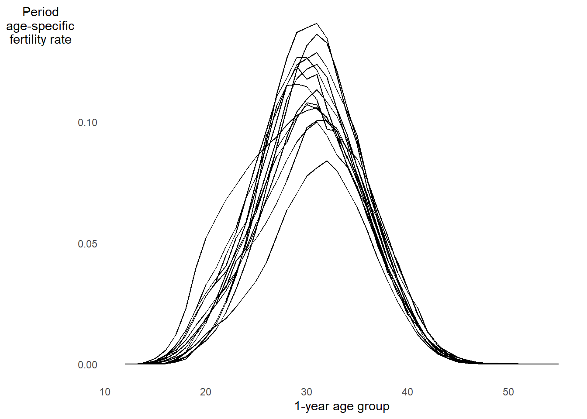

# Age-specific rates and probabilities


For most human populations, demographic rates vary strongly by age.


Below is the **age pattern of mortality** for ages 0 to 90 from 9 countries in 2020^[From the Human Mortality Database: https://www.mortality.org/]


Now look at the **age pattern of fertility** for ages 12 to 55 from 13 countries in 2019^[From the Human Fertility Database: https://www.humanfertility.org/]



## Period age-specific rates

General definition of an age-specific rate^[OMG I hate this notation!]:

$$
{}_{n}R_{x}[0,T] = \frac{
  \textsf{Number of occurrences in the age range } x \textsf{ to } x + n \textsf{ between time } 0 \textsf{ and } T
}{
  \textsf{Number of person-years lived in the age range } x \textsf{ to } x + n \textsf{ between time } 0 \textsf{ and } T
}
$$

* Mortality pattern plot above shows **age-specific mortality rates** ${}_{n}M_{x}[0,T]$
* Birth pattern plot above shows **age-specific fertility rates** ${}_{n}F_{x}[0,T]$
* Interval length $n$ given in *exact years*
    * **Example:** ${}_{5}M_{30}[0,T]$ is mortality rate between exact ages 30.00000... and 34.9999...
    
### Crude rates as a function of age-specific rates and age structure {.unnumbered}

Consider crude death rate $CDR[0,T] = D/N$ measured from death counts $D$ and population size estimate $N$:

$$\begin{align}
CDR &= \frac{D}{N}
     = \frac{\sum_{x=0}^{\infty} {}_{n}D_{x}}{N}
     = \frac{\sum_{x=0}^{\infty} \frac{{}_{n}D_{x}}{{}_{n}N_{x}}{}_{n}N_{x}}{N} \\
    &= \sum_{x=0}^{\infty} \frac{{}_{n}D_{x}}{{}_{n}N_{x}} \cdot \frac{{}_{n}N_{x}}{N} \\
    &= \sum_{x=0}^{\infty} {}_{n}M_{x}\cdot {}_{n}C_{x}
\end{align}$$

* ${}_{n}C_{x} = {}_{n}N_{x} / N$ is the proportion aged $x$ to $x + n$
* In practice, you sum up to the oldest age group in the population
* The collection of these proportions is the population's **age structure**
* Thus $CDR$ is the productivity of age-specific mortality rates and age structure

If you have age intervals of inequal length, you can index age groups by $i$:

$$CDR = \sum_{i}^{\infty} M_{i}\cdot C_{i}$$

This fact can resolve paradoxical cross-spatial and cross-temporal comparisons.

**FOR EXAMPLE**


* Below are the crude death rates in the U.S. for women in 1933 vs. 2019^[Again calculated from the Human Mortality Database]
* CDR is higher in 1933... makes sense...
* But 1933 was during the Great Depression... expected a bigger gap


```{=html}
<div id="htmlwidget-2f73343341733c0bf698" style="width:50%;height:auto;" class="datatables html-widget"></div>
<script type="application/json" data-for="htmlwidget-2f73343341733c0bf698">{"x":{"filter":"none","vertical":false,"data":[[1933,2019],[9.7,8.3]],"container":"<table class=\"display\">\n  <thead>\n    <tr>\n      <th>Year<\/th>\n      <th>CDR (per 1000)<\/th>\n    <\/tr>\n  <\/thead>\n<\/table>","options":{"dom":"T","columnDefs":[{"className":"dt-right","targets":[0,1]}],"order":[],"autoWidth":false,"orderClasses":false}},"evals":[],"jsHooks":[]}</script>
```
<br><br>

Age-specific mortality rates in the U.S. 1933 vs. 2019^[Again calculated from the Human Mortality Database]

* Age-specific moratlity was higher in 1933 than 2019 at nearly all ages
* Again, makes sense, by why isn't CDR all that different?


<br><br>

Proportion by age group in the U.S. 1933 vs. 2019^[Again calculated from the Human Mortality Database]

* 2019 population has older age distribution
* Human mortality is typically higher at older ages
* This affects the comparison between the two years

$$CDR = \sum_{x=0}^{\infty} {}_{n}M_{x}\cdot {}_{n}C_{x}$$


## Age-standardization


Population aging distorts crude death rate comparisons

**Question:** How can we eliminate the effect of age distribution?

**Answer:** Age-standardized rates!

**Example:** Assume that 1933 istead had a 2019 age structure:^[This is what they call a "counterfactual" in causal inference!]

$$CDR^* = \sum_i M_i^{1933} \cdot C_i^{2019}$$

**Question:** But why not use 1933 as the standard for both? Or the average of $C_i$ between 1933 and 2019?

**Answer:** The choice between 1933 and 2019 is arbitrary, but can largely impact the comparison. Arguably better to average across age distributions. But be careful that one extreme age distribution isn't skewing the average

**Example:** Adjusted and unadjusted CDRs for U.S. 1933 vs. 2019:

* CDR difference is smaller for older 2019 standard than younger 1933 standard
* Difference is in between those values for mean of 2019 and 1933 age structures
* All standardized differences are much larger than for the un-standardized CDR


```{=html}
<div id="htmlwidget-79f3a69cb57ddb46e0fd" style="width:100%;height:auto;" class="datatables html-widget"></div>
<script type="application/json" data-for="htmlwidget-79f3a69cb57ddb46e0fd">{"x":{"filter":"none","vertical":false,"data":[["1933  CDR","2019  CDR","Difference(1933 vs. 2019)"],[22.1815641186498,8.30619696254135,13.8753671561084],[9.7175560744282,2.72079790107685,6.99675817335135],[15.949560096539,5.5134974318091,10.4360626647299],[9.7175560744282,8.30619696254135,1.41135911188685]],"container":"<table class=\"display\">\n  <thead>\n    <tr>\n      <th><\/th>\n      <th>2019 standard<\/th>\n      <th>1933 standard<\/th>\n      <th>Avg. standard<\/th>\n      <th>Unadjusted<\/th>\n    <\/tr>\n  <\/thead>\n<\/table>","options":{"dom":"t","columnDefs":[{"targets":1,"render":"function(data, type, row, meta) {\n    return type !== 'display' ? data : DTWidget.formatRound(data, 1, 3, \",\", \".\");\n  }"},{"targets":2,"render":"function(data, type, row, meta) {\n    return type !== 'display' ? data : DTWidget.formatRound(data, 1, 3, \",\", \".\");\n  }"},{"targets":3,"render":"function(data, type, row, meta) {\n    return type !== 'display' ? data : DTWidget.formatRound(data, 1, 3, \",\", \".\");\n  }"},{"targets":4,"render":"function(data, type, row, meta) {\n    return type !== 'display' ? data : DTWidget.formatRound(data, 1, 3, \",\", \".\");\n  }"},{"className":"dt-right","targets":[1,2,3,4]}],"order":[],"autoWidth":false,"orderClasses":false,"rowCallback":"function(row, data, displayNum, displayIndex, dataIndex) {\nvar value=data[0]; $(this.api().cell(row, 0).node()).css({'font-weight':'bold'});\n}"}},"evals":["options.columnDefs.0.render","options.columnDefs.1.render","options.columnDefs.2.render","options.columnDefs.3.render","options.rowCallback"],"jsHooks":[]}</script>
```

More generally for any standard population $s$ and focal population $j$, the **age-standardized crude death rate** (ASCDR):

$$ASCDR^j = \sum_i M_i^{s} \cdot C_i^{j}$$
Even more generally for any rate $R$ and schedule of age-specific rates $R_i$:

$$ASR^j = \sum_i R_i^{s} \cdot C_i^{j}$$

## Decomposition of differences between rates or proportions

As a demographer or data scientists, you'll get these questions a lot:

* **Demography:** "How much of the difference between these death rates is due to differences in age distributions?"
* **People analytics:** "How much of the difference between these turnover rates is due to different tenure distributions?"
* **Digital marketing:** "How much of the customer conversion rate between these two websites is due to a difference in referral channel?"

One way to answer such questions is with a clever difference decomposition.

**Example:** Crude death rate difference

$$
\Delta = CDR^B - CDR^A = \sum_i C_i^B \cdot M_i^B - \sum_i C_i^A \cdot M_i^A
$$
On pg. 28, PHG derive a useful decomposition of this difference:

$$\begin{align}
\Delta &= \sum_i\left(C_i^B-C_i^A\right) \cdot \left[\frac{M_i^B-M_i^A}{2}\right] + \sum_i \left(M_i^B-M_i^A\right) \cdot \left[\frac{C_i^B+C_i^A}{2}\right] \\
       &= \begin{pmatrix}
        \textsf{difference in age} \\
        \textsf{composition}
       \end{pmatrix}
       \cdot \begin{pmatrix}
        \textsf{weighted by avg} \\
        \textsf{age-specific mortality}
       \end{pmatrix}
       + \begin{pmatrix}
        \textsf{difference in} \\
        \text{rate schedules}
       \end{pmatrix}
       \cdot \begin{pmatrix}
        \textsf{weighted by} \\
        \textsf{average age} \\
        \textsf{composition}
       \end{pmatrix} \\
      &= \begin{pmatrix}
        \textsf{contribution of} \\
        \textsf{age composition} \\
        \textsf{differences to } \Delta
      \end{pmatrix}
      + \begin{pmatrix}
        \textsf{contribution of} \\
        \textsf{rate schedule} \\
        \textsf{differences to } \Delta
      \end{pmatrix}
\end{align}$$

**Example:** Decomposing the difference in U.S. mortality between 1933 vs. 2019


```{=html}
<div id="htmlwidget-1afff6e3325e79da0a91" style="width:100%;height:auto;" class="datatables html-widget"></div>
<script type="application/json" data-for="htmlwidget-1afff6e3325e79da0a91">{"x":{"filter":"none","vertical":false,"data":[["1","2","3","4","5","6","7","8","9","10","11","12","13","14","15","16","17","18","19","20","21","22","23","24","25","26","27","28","29","30","31","32","33","34","35","36","37","38","39","40","41","42","43","44","45","46","47","48","49","50","51","52","53","54","55","56","57","58","59","60","61","62","63","64","65","66","67","68","69","70","71","72","73","74","75","76","77","78","79","80","81","82","83","84","85","86","87","88","89","90","91","92","93","94","95","96","97","98","99","100","101","102","103","104","105","106","107","108","109","110","111"],[0,1,2,3,4,5,6,7,8,9,10,11,12,13,14,15,16,17,18,19,20,21,22,23,24,25,26,27,28,29,30,31,32,33,34,35,36,37,38,39,40,41,42,43,44,45,46,47,48,49,50,51,52,53,54,55,56,57,58,59,60,61,62,63,64,65,66,67,68,69,70,71,72,73,74,75,76,77,78,79,80,81,82,83,84,85,86,87,88,89,90,91,92,93,94,95,96,97,98,99,100,101,102,103,104,105,106,107,108,109,110],[0.0541770819891799,0.00886593930766902,0.00402479852458577,0.00286949284530502,0.00222997370116466,0.00185199168924496,0.00164465917895802,0.00147164508314623,0.00132019204732032,0.00119383411184078,0.00109799647885254,0.00105781411715619,0.00109633987941764,0.00121085545118042,0.00139182049726743,0.00162672517410352,0.00186664076409451,0.00209904343290098,0.00232888518948047,0.00256017709215822,0.00278872676798451,0.00299182923446695,0.00316292974530661,0.0032983968955737,0.00339606163094082,0.00346473056452996,0.00353242269812341,0.00360390752767174,0.00367497455823562,0.00374328214986471,0.00381482168483477,0.00391833280672046,0.00406364264205366,0.00425682370265743,0.00449784757516813,0.00475729325929328,0.00497018983462488,0.0051287513726502,0.00525156527282605,0.00535723718088912,0.00548768297441317,0.00570939043342696,0.00603062412525458,0.00642733212437401,0.00688483272678013,0.00738646287118741,0.00790378578875227,0.00843830121871598,0.00901837378759216,0.00966096296416481,0.0103538756666235,0.0110452540946574,0.011718537225851,0.0123698209482835,0.013002835671145,0.0136724615944255,0.0145458334952474,0.015682609591864,0.017099523039606,0.0188173994441415,0.0207784740796474,0.0227253334650535,0.0245952750307575,0.0264127260258573,0.0281901207537303,0.0300479091599651,0.0323713805290162,0.0353132165797551,0.0389382211694782,0.0433415076397618,0.048427280423144,0.0535365712390419,0.0584457765293516,0.0631869951308213,0.0675150554754788,0.0711501996704068,0.0773984497639605,0.084651204285823,0.0929728796382101,0.102219050606462,0.109070548586428,0.119170106541929,0.129521212925223,0.140167898630847,0.151253555805072,0.162747063017651,0.175539037286273,0.189995331508438,0.205433935788028,0.221018089459718,0.235993148388389,0.24930591471028,0.260945484059031,0.271140502828049,0.278929333855576,0.283034696608214,0.280114366019723,0.26970185973916,0.254441205224636,0.250093234034378,0.337327523602033,0.349015389343812,0.360827407886231,0.372610542575787,0.382888791721323,0.393800358102059,0.407589599437807,0.419336862635832,0.421121822962314,0.427963094393187,0.533925174381737],[0.00503450639896417,0.000347783439095604,0.00020928488714608,0.000164536998870026,0.00013481629082615,0.000124704793214512,0.000114169835979689,9.99252553991387e-05,9.29853997559578e-05,9.81102985510545e-05,9.45427810811531e-05,0.000103897378363823,0.000121646421052811,0.00014390207539404,0.000159099064340273,0.000188214509799653,0.000219552184192472,0.000262327225185323,0.000366437131987471,0.000371148135244387,0.000413114809471653,0.000455588198770275,0.000465295870536014,0.00055241269099511,0.000545485113526304,0.000579355648612592,0.000619875919752334,0.000660307711379623,0.000695115796857658,0.000735060036935885,0.000826831379351935,0.000877114083928147,0.000913213697173598,0.00103872180761419,0.00100617571762997,0.001082495623644,0.00113656170554793,0.00120938523214948,0.00133582759773323,0.00143333883484492,0.00144835832495554,0.00152508163180625,0.00156639749171752,0.00172367625025806,0.00180737196294837,0.00198385093765426,0.00214912405272167,0.00233506453517126,0.00255394280109671,0.0027631793930821,0.00296933563903219,0.00323155759115103,0.00351234557500416,0.00385820482058708,0.00422480118789601,0.00460852344329658,0.00499680349190411,0.00550673740393496,0.00592743637683102,0.0063391680255889,0.00694238756462951,0.00748207272798382,0.00803134525240479,0.00849367501403783,0.00910823777246467,0.00956313698228593,0.0103596472382918,0.0111526888458444,0.01204760608436,0.0131263772414865,0.0145134496038062,0.0161614986728548,0.0176473720647317,0.0195630856200566,0.0210468190809213,0.0238061130444177,0.0263155937723368,0.0288896236648268,0.0316450929337587,0.0354648215871141,0.0395295104338687,0.0442698129230202,0.0496221911403174,0.0560673111079557,0.0619581568937881,0.0691036284950179,0.0780495473667801,0.0879941900708387,0.0976556851761009,0.109122344309103,0.117222824045721,0.132688823492718,0.150584054042591,0.168545592377958,0.190264762096179,0.210203576330236,0.236282299284896,0.259963398761038,0.284346546844436,0.313078956365344,0.338217550303831,0.371202007911259,0.407485941834182,0.426770857893496,0.476067259278744,0.482936119053152,0.517094017094017,0.509638871803884,0.637714165586349,0.550370533421381,0.598452780615968],[0.015604502365553,0.0161603196585179,0.0173135796373798,0.0177031278560343,0.0179687740713207,0.0185651285021994,0.018949958164066,0.0192209632279235,0.0194997578389964,0.0197154942336605,0.0198709962834568,0.0200332823733217,0.0198914957430768,0.0195459642505064,0.0192337883446465,0.0189940229321182,0.0188474091284617,0.0187713913099541,0.0187042652724468,0.0186142845941504,0.0184932030881384,0.0183313151521101,0.0181333137954522,0.0179188595911094,0.0176943262139775,0.0174415317875435,0.0171480535264836,0.0168250357213363,0.0164939876771063,0.0161654905167787,0.0158440166423079,0.0155337191934713,0.0152326552823787,0.0149273588578218,0.0146282870013162,0.0143990061458102,0.0142905519650068,0.0142758734566351,0.0142952128392977,0.0142967852095339,0.0141939864842355,0.0139146875128344,0.0134921728634794,0.0130158161825078,0.0125372392877692,0.0120920624868486,0.0117089939889059,0.0113733727991964,0.0110438166267877,0.0107050926329058,0.0103653843410405,0.010032276276496,0.00970775165670787,0.00939190993979763,0.00907927402004169,0.00875449665772534,0.00840603283766569,0.00803967041196243,0.00766842762926413,0.00730189954714216,0.00695453458668247,0.00663584586096222,0.00633808190285453,0.00604859755217274,0.00576162471990109,0.00546678473415778,0.00515504072398502,0.00483241062876821,0.00450923279084396,0.00419174174014317,0.00388940768939012,0.00361048678739082,0.00335209764078278,0.00310542061185562,0.00287656586771963,0.00267225944459555,0.0023898859479064,0.00211437570429696,0.00185177203987829,0.00160942617915942,0.00143051869303237,0.00123087796446357,0.0010537146106596,0.000894718029873477,0.000750270453023081,0.000620166215495465,0.000505422071720886,0.000405776442019751,0.000321526254677003,0.000251528142985041,0.000194078464841459,0.000148502383235027,0.000112445841724897,8.39441005555105e-05,6.19431285855138e-05,4.53917868321738e-05,3.31561884411419e-05,2.42947751062703e-05,1.82429331948284e-05,1.42176910983079e-05,1.06200064510466e-05,7.31892873776964e-06,4.97129931607632e-06,3.3285532201628e-06,2.20478892098253e-06,1.43579607913568e-06,9.14564825698334e-07,5.76664293645699e-07,3.6666144276943e-07,2.26391749720476e-07,2.5338523016976e-07],[0.0110486407855826,0.0112587266503388,0.0114672858393993,0.0116977899916666,0.0118224460725179,0.0118164434216179,0.0118005020114949,0.0117973549532627,0.0119016425471573,0.0118929878362908,0.0120236762198214,0.0122725585810856,0.0123607412289783,0.0122462862022998,0.0122488306617929,0.0122397400156372,0.0121911762350041,0.0122209222626154,0.0124746792441026,0.0125756219608956,0.0125356344011246,0.0125288531053222,0.0126035422689013,0.0126956120666008,0.0129560790713576,0.0132056372886985,0.013487342124875,0.0138274051514741,0.014086953793106,0.0140824118381816,0.0136832587695322,0.0133171226866568,0.0131265863062588,0.0131677123620408,0.0131691670434566,0.0129574976052695,0.0130766839853582,0.0130700654435421,0.013039681511726,0.0129036988119946,0.0125082688761082,0.012107745209588,0.0120379701217436,0.0117595910965145,0.0118706368903022,0.0116999252806614,0.0119308375809519,0.0123202339511013,0.0130518869179282,0.0129168378583033,0.0125872186936532,0.0121837751388217,0.0122937526265105,0.0125355134483285,0.0130778911074957,0.013390702765422,0.0134503579355043,0.0134510951400902,0.0136359523326103,0.013478983631075,0.0133396648354991,0.0131363395764598,0.0129711124633984,0.0126318872048239,0.0123639954666649,0.011976500539428,0.0114969263114873,0.0110429006100691,0.0107433294039286,0.0103726958738708,0.0101190413203357,0.00990034609449325,0.0100319834552578,0.00777336092121823,0.00745998996938281,0.00721736413358471,0.00722233931724633,0.00634981934702383,0.0058183932989378,0.00537912943218866,0.00503431730922817,0.00470788357570133,0.00432771492352386,0.00404478425992914,0.00376496137949162,0.00336129564682374,0.00313639724465991,0.00288569878708574,0.00265298825372766,0.00244911777484899,0.00222158692018329,0.00192937037782412,0.00162227736328746,0.00133195167821566,0.00108747131307095,0.000850692351075887,0.000639754764516505,0.000479373762664962,0.000343057435305371,0.000226062941218414,0.000148547115003801,9.77229425336507e-05,5.97363064930973e-05,3.57132527544655e-05,2.10359827951885e-05,1.19065427292591e-05,6.50222023102791e-06,3.42258521336666e-06,1.71661549204284e-06,8.1972434536463e-07,8.2411497396626e-07],[0.000134879900313284,2.2580959497421e-05,1.23768477950701e-05,9.11018715242288e-06,7.26738746953094e-06,6.67005103000609e-06,6.28733546108346e-06,5.83336128471846e-06,5.36874258535621e-06,5.05312170766809e-06,4.67911863057528e-06,4.50786102149815e-06,4.58617791518896e-06,4.94464688868914e-06,5.41655375366983e-06,6.12930805071531e-06,6.94309306224355e-06,7.73404270254409e-06,8.39537113785056e-06,8.85064205831666e-06,9.53759556131587e-06,1.0001754407897e-05,1.00316293511945e-05,1.00568658201999e-05,9.3380112997371e-06,8.56516127155283e-06,7.60018344667072e-06,6.39127097852644e-06,5.25947778042627e-06,4.66436956239327e-06,5.01474420056728e-06,5.31478541321324e-06,5.240801367326e-06,4.65914405019934e-06,4.01551511752277e-06,4.20905277485443e-06,3.70639507714257e-06,3.8212879530728e-06,4.13533905800469e-06,4.72992953948784e-06,5.84610347452195e-06,6.53613680816229e-06,5.52380483221339e-06,5.11975059817712e-06,2.89712224272339e-06,1.83722433904847e-06,-1.1150868148737e-06,-5.10044075380894e-06,-1.16190125707093e-05,-1.37395187691497e-05,-1.48009842830119e-05,-1.53582720498278e-05,-1.96935388469808e-05,-2.55072393717753e-05,-3.44433615605069e-05,-4.23772072432991e-05,-4.92897071161192e-05,-5.73322781529735e-05,-6.87069745802694e-05,-7.76971162618274e-05,-8.85006561040664e-05,-9.81815270596606e-05,-0.000108206684712738,-0.000114899474388616,-0.000123128795617829,-0.00012892832656775,-0.000135497644568326,-0.000144288020058881,-0.000158925286499237,-0.000174512703239803,-0.000196048844266079,-0.00021919552686121,-0.00025414677193618,-0.000193136218770017,-0.000202958315165138,-0.000215793191084635,-0.000250596639567424,-0.000240447888966762,-0.000247156149632433,-0.000259513670448893,-0.00026776234353198,-0.000284140758539938,-0.000293257780479073,-0.000309076953673046,-0.000321383707845035,-0.000317766377089595,-0.000333592635181465,-0.000344696213129325,-0.000353320966792267,-0.000362756597154714,-0.000358074185335974,-0.00034014110168358,-0.000310670134339956,-0.000274365789304449,-0.000240585884696344,-0.000198602529751964,-0.000156622740931924,-0.000120519764791642,-8.75030377157872e-05,-5.96526767679587e-05,-4.65879893704462e-05,-3.25552717587405e-05,-2.10383430558197e-05,-1.29438632337539e-05,-8.08758396290233e-06,-4.59004276560698e-06,-2.58340670406688e-06,-1.32189573827757e-06,-7.14689965128842e-07,-2.90238615398589e-07,-3.23140890068323e-07],[0.000654902051010761,0.000116779855113237,5.49068923619839e-05,3.97640923113468e-05,3.12086478236946e-05,2.6238845532408e-05,2.35316257951877e-05,2.12742210362506e-05,1.92680036483591e-05,1.73170832529934e-05,1.6002413531311e-05,1.54085412235866e-05,1.57180221971472e-05,1.69604244722339e-05,1.94046496069588e-05,2.24650505433426e-05,2.55616497442395e-05,2.84620423266721e-05,3.05935295505922e-05,3.4137804306216e-05,3.68562386991226e-05,3.91344125515019e-05,4.14583920615741e-05,4.20334278017957e-05,4.36856627778071e-05,4.42142864482336e-05,4.46135114542438e-05,4.51142596610548e-05,4.55634431855994e-05,4.54962043669518e-05,4.41136063389499e-05,4.38708602470831e-05,4.46718877778451e-05,4.52064009670072e-05,4.85297939996718e-05,5.02648076520492e-05,5.24579027772027e-05,5.3589373502778e-05,5.35181378274927e-05,5.33659671318386e-05,5.39295391365741e-05,5.44429471400073e-05,5.69861721363209e-05,5.82674949907939e-05,6.19650168113106e-05,6.42694385176121e-05,6.80196170906343e-05,7.23038449419498e-05,7.78825063179347e-05,8.14694820297603e-05,8.47472079235548e-05,8.67947416327933e-05,9.02742803775087e-05,9.33189052746012e-05,9.72481797702822e-05,0.000100361358957912,0.000104353665628898,0.000109343641739218,0.000119007189615375,0.00012965433468985,0.000140396149479165,0.000150696288982158,0.000159918069779589,0.000167368279643069,0.000172935481681459,0.000178660862429836,0.000183269328575376,0.000191777948735197,0.000205075389520728,0.000220033190842488,0.000237540084878582,0.000252484179695022,0.000273024576971769,0.000237287490593096,0.000240160760072009,0.000234107597691895,0.000245509959489422,0.00023598844737303,0.000235197131943395,0.000233257820897188,0.00022478570354162,0.000222407491545516,0.000214985477792829,0.000207707522321533,0.000201594713830663,0.000186418881604225,0.000177519553766461,0.000167867115191171,0.000160293985067825,0.000151095393682003,0.000143454680641373,0.000121157738657461,9.57232667939335e-05,7.2631850314845e-05,5.09561696217679e-05,3.2631405813585e-05,1.4747538898318e-05,2.45247820049648e-06,-5.40240547367904e-06,-7.56712459430501e-06,-7.08314940715606e-08,-1.16526196575491e-06,-1.50958101116895e-06,-1.05725826107934e-06,-1.08276974668233e-06,-5.94639761276783e-07,-4.06085364259043e-07,-1.80570132823779e-07,-2.25610915822805e-07,-6.40261960627714e-08,-3.47642544448963e-08]],"container":"<table class=\"display\">\n  <thead>\n    <tr>\n      <th> <\/th>\n      <th>Age<\/th>\n      <th>m_1933<\/th>\n      <th>m_2019<\/th>\n      <th>p_1933<\/th>\n      <th>p_2019<\/th>\n      <th>p_contrib<\/th>\n      <th>m_contrib<\/th>\n    <\/tr>\n  <\/thead>\n<\/table>","options":{"scrollX":true,"columnDefs":[{"targets":2,"render":"function(data, type, row, meta) {\n    return type !== 'display' ? data : DTWidget.formatRound(data, 4, 3, \",\", \".\");\n  }"},{"targets":3,"render":"function(data, type, row, meta) {\n    return type !== 'display' ? data : DTWidget.formatRound(data, 4, 3, \",\", \".\");\n  }"},{"targets":4,"render":"function(data, type, row, meta) {\n    return type !== 'display' ? data : DTWidget.formatRound(data, 4, 3, \",\", \".\");\n  }"},{"targets":5,"render":"function(data, type, row, meta) {\n    return type !== 'display' ? data : DTWidget.formatRound(data, 4, 3, \",\", \".\");\n  }"},{"targets":6,"render":"function(data, type, row, meta) {\n    return type !== 'display' ? data : DTWidget.formatRound(data, 4, 3, \",\", \".\");\n  }"},{"targets":7,"render":"function(data, type, row, meta) {\n    return type !== 'display' ? data : DTWidget.formatRound(data, 4, 3, \",\", \".\");\n  }"},{"className":"dt-right","targets":[1,2,3,4,5,6,7]},{"orderable":false,"targets":0}],"order":[],"autoWidth":false,"orderClasses":false}},"evals":["options.columnDefs.0.render","options.columnDefs.1.render","options.columnDefs.2.render","options.columnDefs.3.render","options.columnDefs.4.render","options.columnDefs.5.render"],"jsHooks":[]}</script>
```

Summing up the contribution columns across age groups yields their total contribution:


```{=html}
<div id="htmlwidget-b607ff5302c694b5c756" style="width:50%;height:auto;" class="datatables html-widget"></div>
<script type="application/json" data-for="htmlwidget-b607ff5302c694b5c756">{"x":{"filter":"none","vertical":false,"data":[["1"],[-0.00902470355284303],[0.0104360626647299]],"container":"<table class=\"display\">\n  <thead>\n    <tr>\n      <th> <\/th>\n      <th>p_contrib<\/th>\n      <th>m_contrib<\/th>\n    <\/tr>\n  <\/thead>\n<\/table>","options":{"scrollX":true,"dom":"t","columnDefs":[{"targets":1,"render":"function(data, type, row, meta) {\n    return type !== 'display' ? data : DTWidget.formatRound(data, 4, 3, \",\", \".\");\n  }"},{"targets":2,"render":"function(data, type, row, meta) {\n    return type !== 'display' ? data : DTWidget.formatRound(data, 4, 3, \",\", \".\");\n  }"},{"className":"dt-right","targets":[1,2]},{"orderable":false,"targets":0}],"order":[],"autoWidth":false,"orderClasses":false}},"evals":["options.columnDefs.0.render","options.columnDefs.1.render"],"jsHooks":[]}</script>
```

* The sum of these contributions yields back the difference of 1.4 (in thousands of persons).

## The Lexis diagram

## Age-specific probabilities

:::{.rmdtip}
**DEMOGRAPHY & DATA SCIENCE**

### More corporate confusion, tenure-specific rates vs. probabilities edition
:::

## Probabilities of death based on mortality experience of a single calendar year

:::{.rmdtip}
**DEMOGRAPHY & DATA SCIENCE**

### Funky new hire turnover metrics and how to avoid them
:::


