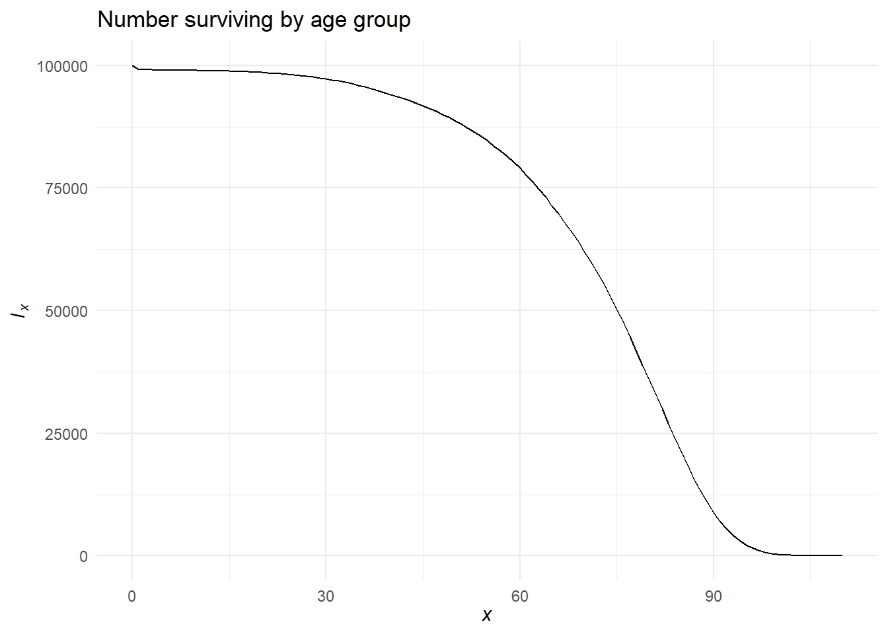
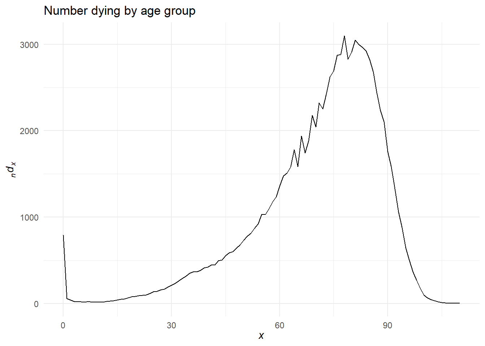

# Life tables and single decrement processes

:::{.rmdnote}
## Learning objectives {.unnumbered}

* Explain what a single decrement process is
* Learn how to summarize a cohort's experience of a single decrement process using a life table
* Describe the purpose of a period life table and how it differs from a cohort life table
* Know how to construct a period life table under varying assumptions about how to convert period age-specific rates into probabilities
* Interpret the columns of a life table and functions of those columns
* Relate age-specific mortality rates to the force of mortality, and its implications for a common assumption made during life table construction
* Decompose a difference in two life expectancies into age-specific components
* Know the conditions for and definition of a stationary population, and how to use a life table to find relations among its key metrics
:::


### Cohort life tables with lifeline data {.unnumbered}

:::{.rmdimportant}
**KEY CONCEPTS**

A **life table** is one of the most important demographic tools for summarizing the mortality experience of a cohort. Also known as a **decrement table**.

A **single decrement process** is one where "individuals have only one mode of exit from a defined state" (PHG pg. 65).

A **single decrement life table** is a tabular summary of a single decrement process.
:::

Since a life table summarizes the experience of a cohort, let's start by building a life table from the lifelines of a small hypothetical cohort based actual people born January 1, 1800^[This section uses the example from PHG pgs. 39-41].


Below, a lifelines plot like we drew in [week 1](#person-periods), except time is measured from age $x = 0$, and everybody in this real birth cohort was born January 1, 1800^[From PHG Figure 3.1]:


<br><br>

<details>
<summary>
Number $l_0$ of live births (i.e., number surviving to exact age $x = 0$)? **Tap for answer**</summary>
$l_{0} = $
</details>

<details>
<summary>Number of deaths ${}_{n}d_{x}$ between ages $x = 0$ and $x+n = 1$? **Tap for answer**</summary>
${}_{1}d_{0} = $
</details>

<details>
<summary>
Number $l_x$ still alive at exact age $x = 1$? **Tap for answer**</summary>
$l_{1} = l_0 - {}_{1}d_{0} = $

So in general:

$$l_{x+n} = l_x - {}_{n}d_{x}$$
</details>

<details>
<summary>
Probability of death ${}_{n}q_{x}$ between ages $x = 0$ and $x+n = 1$? **Tap for answer**</summary>
$$
{}_{1}q_{0} = \frac{{}_{1}d_{0}}{l_0}
             = 
$$

So in general:

$${}_{n}q_{x} = \frac{{}_{n}d_{x}}{l_x}$$
</details>

<details>
<summary>
Probability of survival ${}_{n}p_{x}$ between ages $x = 0$ and $x+n = 1$? **Tap for answer**</summary>
$$
{}_{1}p_{0} = l_1 / l_0
              = 1 - {}_{1}q_{0}
              = 
$$

For general $x$:

$${}_{n}p_{x} = l_{x+n} / l_x = 1 - {}_{n}q_{x}$$
</details>

<details>
<summary>Number of person-years ${}_{n}A_x$ lived by those who died between ages $x$ and $x+n$? **Tap for answer**</summary>
For general $x$:

$$
{}_{n}A_x =
  \sum_{i \in \textsf{dead}_x} \left(\textsf{(Exact age at death)}_i - x\right)
$$

But for these $x = 0$ (i.e., infants):

$$\begin{align}
{}_{1}A_0
  &= \sum_{i \in \textsf{dead}_0} \left(\textsf{(Exact age at death)}_i - 0\right) \\
  &= \sum_{i \in \textsf{dead}_0} \textsf{(Exact age at death)}_i \\
  &= 
\end{align}$$
</details>

<details>
<summary>What is the average number of person-years lived ${}_{n}a_x$ by those who died between ages $x$ and $x+n$?<br>
**Hint:** It's the average of a similar figure we've seen already, thus a ratio of that sum to a count we've seen already. **Tap for answer**</summary>
For general age group starting at exact age $x$:

$${}_{n}a_x = \frac{{}_{n}A_x}{{}_{n}d_x}$$

But for these $x = 0$ (i.e., infants):

$$
{}_{1}a_0
  = \frac{{}_{1}A_0}{{}_{1}d_0}
  = \frac{
    
  }{
    
  }
  = 
$$
</details>

<details>
<summary>
Person-years lived ${}_{n}L_{x}$ between ages $x = 0$ and $x+n = 1$? **Tap for answer**</summary>
$$\begin{align}
  {}_{n}L_{x}
    &= \begin{pmatrix}
      \textsf{Person-years lived} \\
      \textsf{between ages } x \textsf{ and } x+n \\
      \textsf{among survivors to age } x+n
    \end{pmatrix}
    \times \begin{pmatrix}
      \textsf{Width of } [x,x+n)\\
      \textsf{age interval}
    \end{pmatrix} \\
    &+ \begin{pmatrix}
      \textsf{Person-years lived} \\
      \textsf{between ages } x \textsf{ and } x+n \\
      \textsf{among those who died} \\
      \textsf{before age } x+n
    \end{pmatrix} \\
    &=  \begin{pmatrix}
      \textsf{Survivor count} \\
      \textsf{weighted by} \\
      \textsf{interval width} \\
    \end{pmatrix}
    + \begin{pmatrix}
      \textsf{Fractional person-years} \\
      \textsf{lived by the now deceased}
    \end{pmatrix} \\
    &= \left(l_{x+n} \times n\right) + {_n}_{}A_x
\end{align}$$

This should look familiar to our expression of person-years from [week 1](#person-periods): $PY[0,1] = \sum_1^P N_i \times \Delta_i$

So for these 1800 birth cohort infants:

$$\begin{align}
{}_{1}L_0
  &= l_1 \times 1 + {}_{1}A_0 - 0 \\
  &= l_1  + {}_{1}A_0 \\
  &=  +  \\
  &= 
\end{align}$$

Recall that ${}_{n}a_x = \frac{{}_{n}A_x}{{}_{n}d_x}$

Thus ${}_{n}A_x = {}_{n}a_x \times {}_{n}d_x$

Thus ${}_{n}L_x = l_{x+n} \times n + {_n}_{}a_x \times {}_{n}d_x$

This becomes useful when doing **period life tables** because:

* You can't calculate ${}_{n}A_x$ directly
* So you can't calculate ${}_{n}L_x$ from ${}_{n}A_x$ directly
* So you borrow values from a model or another population
* But you want ${}_{n}A_x$ estimates that aren't contaminated by another population's size
<br><br>
</details>

<details>
<summary>Person-years $T_x$ lived above exact age $x = 0$? **Tap for answer**</summary>
$$\begin{align}
  T_0
    &= \textsf{Total person years lived from birth to death} \\
    &= \sum_i \textsf{(Exact age at death)}_i \\
    &= \sum_{a=0}^\infty {}_{n}L_a
\end{align}$$

:::{.rmdtip}
**DEMOGRAPHY & DATA SCIENCE**
<details>
<summary>Okay that was too easy, what about $T_{20}$? Let's do it with R code. **Tap for answer**</summary>
More generally:

$$T_x = \sum_{a=x}^\infty {}_{n}L_a$$

Easy to think about, but funky to do in practice.

Let's walk through how you'd do it with R code.

Say you have a cohort life table in a `data.frame` with two columns:

* `x`: Exact age $x$ at the beginning of each age interval
* `Lx`: Person-years ${}_{n}L_x$ lived in the age interval

It looks like this:

<table class=" lightable-paper lightable-hover" style='font-family: "Arial Narrow", arial, helvetica, sans-serif; width: auto !important; '>
 <thead>
  <tr>
   <th style="text-align:right;"> x </th>
   <th style="text-align:right;"> Lx </th>
  </tr>
 </thead>
<tbody>
  <tr>
   <td style="text-align:right;"> 0 </td>
   <td style="text-align:right;"> 9.07 </td>
  </tr>
  <tr>
   <td style="text-align:right;"> 1 </td>
   <td style="text-align:right;"> 32.22 </td>
  </tr>
  <tr>
   <td style="text-align:right;"> 5 </td>
   <td style="text-align:right;"> 40.00 </td>
  </tr>
  <tr>
   <td style="text-align:right;"> 10 </td>
   <td style="text-align:right;"> 76.41 </td>
  </tr>
  <tr>
   <td style="text-align:right;"> 20 </td>
   <td style="text-align:right;"> 62.12 </td>
  </tr>
  <tr>
   <td style="text-align:right;"> 30 </td>
   <td style="text-align:right;"> 60.00 </td>
  </tr>
  <tr>
   <td style="text-align:right;"> 40 </td>
   <td style="text-align:right;"> 60.00 </td>
  </tr>
  <tr>
   <td style="text-align:right;"> 50 </td>
   <td style="text-align:right;"> 59.60 </td>
  </tr>
  <tr>
   <td style="text-align:right;"> 60 </td>
   <td style="text-align:right;"> 36.96 </td>
  </tr>
  <tr>
   <td style="text-align:right;"> 70 </td>
   <td style="text-align:right;"> 9.48 </td>
  </tr>
  <tr>
   <td style="text-align:right;"> 80 </td>
   <td style="text-align:right;"> 0.00 </td>
  </tr>
</tbody>
</table>

To create a column `T` storing $T_x$ values, do this (assuming you have `dplyr` installed and loaded):


```r
saving_you_some_time <- cohort_lt_xL %>%
  dplyr::mutate(
    Lx = dplyr::coalesce(Lx, 0),
    Tx = rev(Lx) %>% # Reverse person-years column so sum back to x = 0
      dplyr::coalesce(0) %>% # Replace the missing value at x = 80 so you can...
      cumsum() %>% # ... take the cumulative sum of person years
      rev() # Reverse the cumulative sum back in age order
  )
saving_you_some_time %>%
  knitr::kable() %>%
  kableExtra::kable_paper("hover", full_width = FALSE, position = "left")
```

<table class=" lightable-paper lightable-hover" style='font-family: "Arial Narrow", arial, helvetica, sans-serif; width: auto !important; '>
 <thead>
  <tr>
   <th style="text-align:right;"> x </th>
   <th style="text-align:right;"> Lx </th>
   <th style="text-align:right;"> Tx </th>
  </tr>
 </thead>
<tbody>
  <tr>
   <td style="text-align:right;"> 0 </td>
   <td style="text-align:right;"> 9.07 </td>
   <td style="text-align:right;"> 445.86 </td>
  </tr>
  <tr>
   <td style="text-align:right;"> 1 </td>
   <td style="text-align:right;"> 32.22 </td>
   <td style="text-align:right;"> 436.79 </td>
  </tr>
  <tr>
   <td style="text-align:right;"> 5 </td>
   <td style="text-align:right;"> 40.00 </td>
   <td style="text-align:right;"> 404.57 </td>
  </tr>
  <tr>
   <td style="text-align:right;"> 10 </td>
   <td style="text-align:right;"> 76.41 </td>
   <td style="text-align:right;"> 364.57 </td>
  </tr>
  <tr>
   <td style="text-align:right;"> 20 </td>
   <td style="text-align:right;"> 62.12 </td>
   <td style="text-align:right;"> 288.16 </td>
  </tr>
  <tr>
   <td style="text-align:right;"> 30 </td>
   <td style="text-align:right;"> 60.00 </td>
   <td style="text-align:right;"> 226.04 </td>
  </tr>
  <tr>
   <td style="text-align:right;"> 40 </td>
   <td style="text-align:right;"> 60.00 </td>
   <td style="text-align:right;"> 166.04 </td>
  </tr>
  <tr>
   <td style="text-align:right;"> 50 </td>
   <td style="text-align:right;"> 59.60 </td>
   <td style="text-align:right;"> 106.04 </td>
  </tr>
  <tr>
   <td style="text-align:right;"> 60 </td>
   <td style="text-align:right;"> 36.96 </td>
   <td style="text-align:right;"> 46.44 </td>
  </tr>
  <tr>
   <td style="text-align:right;"> 70 </td>
   <td style="text-align:right;"> 9.48 </td>
   <td style="text-align:right;"> 9.48 </td>
  </tr>
  <tr>
   <td style="text-align:right;"> 80 </td>
   <td style="text-align:right;"> 0.00 </td>
   <td style="text-align:right;"> 0.00 </td>
  </tr>
</tbody>
</table>

* ${}_{\infty}L_x = T_x = 0$ for the final age group in this case because we know everyone in the cohort died before age 80
* You won't know that for a period lifetable!
* But notice how ${}_{10}L_{70} = T_{70}$, since everybody dies before age 80

You're welcome.
</details>

:::
</details>

<details>
<summary>What is the life expectancy at birth, i.e., life expectancy $e_x^o$ at age $x = 0$?<br>
**Hint:** It's the per-survivor average of a value we've already calculated, so it's a ratio of that value and another one we've already calculated. **Tap for answer**</summary>
$$\begin{align}
  e_0^o
    &= \frac{
      \textsf{Person-years lived after age } x=0 \textsf{ (i.e., total person-years)}
    }{
      \textsf{People alive after age } x=0 \textsf{ (i.e., live births)}
    } \\
    &= T_0/l_0
    = 
    / 
    = 44.586
\end{align}$$

So for general exact age $x$:

$$e_x^o = T_x/l_x$$

This is the expected years of life *remaining after age* $x$! Not the expected age at death.

To get expected age at death at exact age $x$:

$$\textsf{Expected age at death at exact age } x = x + e_x^o$$

</details>

<details>
<summary>What is the mortality rate ${}_{n}m_x$ in the cohort between ages $x$ and $x+n$ **Tap for answer**</summary>
* This is just a cohort age-specific rate
* Using life table notation, it is:

$$
{}_{n}m_x
  = {}_{n}d_x / {}_{n}L_x
$$

For example, for newborns, we have ${}_{1}m_0$ = 1/9.07 $\approx$ 0.11
</details>
<br><br>

<center>🤯🤯🤯</center>

**QUESTION:** Why did we just learn all of those values?

**ANSWER:** Three reasons:

1. I'm evil
2. Their relationships and values help create **period life tables**
3. Their values (and operations on them) are interesting in and of themselves

* We'll see examples of those last two points in later sections.
* You've already seen ample evidence of the first point.

Now let's put all these values together into our first cohort life table:

<table class=" lightable-paper lightable-hover" style='font-family: "Arial Narrow", arial, helvetica, sans-serif; width: auto !important; '>
 <thead>
  <tr>
   <th style="text-align:right;"> $x$ </th>
   <th style="text-align:right;"> $n$ </th>
   <th style="text-align:right;"> $x+n$ </th>
   <th style="text-align:right;"> $l_x$ </th>
   <th style="text-align:right;"> ${}_{n}d_x$ </th>
   <th style="text-align:right;"> ${}_{n}q_x$ </th>
   <th style="text-align:right;"> ${}_{n}p_x$ </th>
   <th style="text-align:right;"> $L_x$ </th>
   <th style="text-align:right;"> $T_x$ </th>
   <th style="text-align:right;"> $e_x^o$ </th>
   <th style="text-align:right;"> ${}_{n}m_x$ </th>
   <th style="text-align:right;"> ${}_{n}a_x$ </th>
  </tr>
 </thead>
<tbody>
  <tr>
   <td style="text-align:right;"> 0 </td>
   <td style="text-align:right;border-left:1px solid;"> 1 </td>
   <td style="text-align:right;border-left:1px solid;"> 1 </td>
   <td style="text-align:right;border-left:1px solid;"> 10 </td>
   <td style="text-align:right;border-left:1px solid;"> 1 </td>
   <td style="text-align:right;border-left:1px solid;"> 0.10 </td>
   <td style="text-align:right;border-left:1px solid;"> 0.90 </td>
   <td style="text-align:right;border-left:1px solid;"> 9.07 </td>
   <td style="text-align:right;border-left:1px solid;"> 445.86 </td>
   <td style="text-align:right;border-left:1px solid;"> 44.59 </td>
   <td style="text-align:right;border-left:1px solid;"> 0.11 </td>
   <td style="text-align:right;border-left:1px solid;"> 0.07 </td>
  </tr>
  <tr>
   <td style="text-align:right;"> 1 </td>
   <td style="text-align:right;border-left:1px solid;"> 4 </td>
   <td style="text-align:right;border-left:1px solid;"> 5 </td>
   <td style="text-align:right;border-left:1px solid;"> 9 </td>
   <td style="text-align:right;border-left:1px solid;"> 1 </td>
   <td style="text-align:right;border-left:1px solid;"> 0.11 </td>
   <td style="text-align:right;border-left:1px solid;"> 0.89 </td>
   <td style="text-align:right;border-left:1px solid;"> 32.22 </td>
   <td style="text-align:right;border-left:1px solid;"> 436.79 </td>
   <td style="text-align:right;border-left:1px solid;"> 48.53 </td>
   <td style="text-align:right;border-left:1px solid;"> 0.03 </td>
   <td style="text-align:right;border-left:1px solid;"> 0.22 </td>
  </tr>
  <tr>
   <td style="text-align:right;"> 5 </td>
   <td style="text-align:right;border-left:1px solid;"> 5 </td>
   <td style="text-align:right;border-left:1px solid;"> 10 </td>
   <td style="text-align:right;border-left:1px solid;"> 8 </td>
   <td style="text-align:right;border-left:1px solid;"> 0 </td>
   <td style="text-align:right;border-left:1px solid;"> 0.00 </td>
   <td style="text-align:right;border-left:1px solid;"> 1.00 </td>
   <td style="text-align:right;border-left:1px solid;"> 40.00 </td>
   <td style="text-align:right;border-left:1px solid;"> 404.57 </td>
   <td style="text-align:right;border-left:1px solid;"> 50.57 </td>
   <td style="text-align:right;border-left:1px solid;"> 0.00 </td>
   <td style="text-align:right;border-left:1px solid;">  </td>
  </tr>
  <tr>
   <td style="text-align:right;"> 10 </td>
   <td style="text-align:right;border-left:1px solid;"> 10 </td>
   <td style="text-align:right;border-left:1px solid;"> 20 </td>
   <td style="text-align:right;border-left:1px solid;"> 8 </td>
   <td style="text-align:right;border-left:1px solid;"> 1 </td>
   <td style="text-align:right;border-left:1px solid;"> 0.12 </td>
   <td style="text-align:right;border-left:1px solid;"> 0.88 </td>
   <td style="text-align:right;border-left:1px solid;"> 76.41 </td>
   <td style="text-align:right;border-left:1px solid;"> 364.57 </td>
   <td style="text-align:right;border-left:1px solid;"> 45.57 </td>
   <td style="text-align:right;border-left:1px solid;"> 0.01 </td>
   <td style="text-align:right;border-left:1px solid;"> 6.41 </td>
  </tr>
  <tr>
   <td style="text-align:right;"> 20 </td>
   <td style="text-align:right;border-left:1px solid;"> 10 </td>
   <td style="text-align:right;border-left:1px solid;"> 30 </td>
   <td style="text-align:right;border-left:1px solid;"> 7 </td>
   <td style="text-align:right;border-left:1px solid;"> 1 </td>
   <td style="text-align:right;border-left:1px solid;"> 0.14 </td>
   <td style="text-align:right;border-left:1px solid;"> 0.86 </td>
   <td style="text-align:right;border-left:1px solid;"> 62.12 </td>
   <td style="text-align:right;border-left:1px solid;"> 288.16 </td>
   <td style="text-align:right;border-left:1px solid;"> 41.17 </td>
   <td style="text-align:right;border-left:1px solid;"> 0.02 </td>
   <td style="text-align:right;border-left:1px solid;"> 2.12 </td>
  </tr>
  <tr>
   <td style="text-align:right;"> 30 </td>
   <td style="text-align:right;border-left:1px solid;"> 10 </td>
   <td style="text-align:right;border-left:1px solid;"> 40 </td>
   <td style="text-align:right;border-left:1px solid;"> 6 </td>
   <td style="text-align:right;border-left:1px solid;"> 0 </td>
   <td style="text-align:right;border-left:1px solid;"> 0.00 </td>
   <td style="text-align:right;border-left:1px solid;"> 1.00 </td>
   <td style="text-align:right;border-left:1px solid;"> 60.00 </td>
   <td style="text-align:right;border-left:1px solid;"> 226.04 </td>
   <td style="text-align:right;border-left:1px solid;"> 37.67 </td>
   <td style="text-align:right;border-left:1px solid;"> 0.00 </td>
   <td style="text-align:right;border-left:1px solid;">  </td>
  </tr>
  <tr>
   <td style="text-align:right;"> 40 </td>
   <td style="text-align:right;border-left:1px solid;"> 10 </td>
   <td style="text-align:right;border-left:1px solid;"> 50 </td>
   <td style="text-align:right;border-left:1px solid;"> 6 </td>
   <td style="text-align:right;border-left:1px solid;"> 0 </td>
   <td style="text-align:right;border-left:1px solid;"> 0.00 </td>
   <td style="text-align:right;border-left:1px solid;"> 1.00 </td>
   <td style="text-align:right;border-left:1px solid;"> 60.00 </td>
   <td style="text-align:right;border-left:1px solid;"> 166.04 </td>
   <td style="text-align:right;border-left:1px solid;"> 27.67 </td>
   <td style="text-align:right;border-left:1px solid;"> 0.00 </td>
   <td style="text-align:right;border-left:1px solid;">  </td>
  </tr>
  <tr>
   <td style="text-align:right;"> 50 </td>
   <td style="text-align:right;border-left:1px solid;"> 10 </td>
   <td style="text-align:right;border-left:1px solid;"> 60 </td>
   <td style="text-align:right;border-left:1px solid;"> 6 </td>
   <td style="text-align:right;border-left:1px solid;"> 1 </td>
   <td style="text-align:right;border-left:1px solid;"> 0.17 </td>
   <td style="text-align:right;border-left:1px solid;"> 0.83 </td>
   <td style="text-align:right;border-left:1px solid;"> 59.60 </td>
   <td style="text-align:right;border-left:1px solid;"> 106.04 </td>
   <td style="text-align:right;border-left:1px solid;"> 17.67 </td>
   <td style="text-align:right;border-left:1px solid;"> 0.02 </td>
   <td style="text-align:right;border-left:1px solid;"> 9.60 </td>
  </tr>
  <tr>
   <td style="text-align:right;"> 60 </td>
   <td style="text-align:right;border-left:1px solid;"> 10 </td>
   <td style="text-align:right;border-left:1px solid;"> 70 </td>
   <td style="text-align:right;border-left:1px solid;"> 5 </td>
   <td style="text-align:right;border-left:1px solid;"> 2 </td>
   <td style="text-align:right;border-left:1px solid;"> 0.40 </td>
   <td style="text-align:right;border-left:1px solid;"> 0.60 </td>
   <td style="text-align:right;border-left:1px solid;"> 36.96 </td>
   <td style="text-align:right;border-left:1px solid;"> 46.44 </td>
   <td style="text-align:right;border-left:1px solid;"> 9.29 </td>
   <td style="text-align:right;border-left:1px solid;"> 0.05 </td>
   <td style="text-align:right;border-left:1px solid;"> 3.48 </td>
  </tr>
  <tr>
   <td style="text-align:right;"> 70 </td>
   <td style="text-align:right;border-left:1px solid;"> 10 </td>
   <td style="text-align:right;border-left:1px solid;"> 80 </td>
   <td style="text-align:right;border-left:1px solid;"> 3 </td>
   <td style="text-align:right;border-left:1px solid;"> 3 </td>
   <td style="text-align:right;border-left:1px solid;"> 1.00 </td>
   <td style="text-align:right;border-left:1px solid;"> 0.00 </td>
   <td style="text-align:right;border-left:1px solid;"> 9.48 </td>
   <td style="text-align:right;border-left:1px solid;"> 9.48 </td>
   <td style="text-align:right;border-left:1px solid;"> 3.16 </td>
   <td style="text-align:right;border-left:1px solid;"> 0.32 </td>
   <td style="text-align:right;border-left:1px solid;"> 3.16 </td>
  </tr>
  <tr>
   <td style="text-align:right;"> 80 </td>
   <td style="text-align:right;border-left:1px solid;">  </td>
   <td style="text-align:right;border-left:1px solid;">  </td>
   <td style="text-align:right;border-left:1px solid;"> 0 </td>
   <td style="text-align:right;border-left:1px solid;"> 0 </td>
   <td style="text-align:right;border-left:1px solid;">  </td>
   <td style="text-align:right;border-left:1px solid;">  </td>
   <td style="text-align:right;border-left:1px solid;"> 0.00 </td>
   <td style="text-align:right;border-left:1px solid;"> 0.00 </td>
   <td style="text-align:right;border-left:1px solid;">  </td>
   <td style="text-align:right;border-left:1px solid;">  </td>
   <td style="text-align:right;border-left:1px solid;">  </td>
  </tr>
</tbody>
</table>

## Period life tables

:::{.rmdimportant}
**KEY CONCEPTS**

> A **period life table** shows what *would happen* to a cohort *if* it were subjected for all of its life to the mortality conditions of that period.
> 
> -- PHG pg. 42 (bolding added)

| Cohort life table | Period life table |
| ----------------- | ----------------- |
| Actual cohort | Synthetic (aka hypothetical) cohort  |
| *Records* cohort's *real* experience | *Model* of what *would* happen |

:::

<details>
<summary>Why create a period life table, even if you have cohort data? **Tap for answer**</summary>
* Cohort data is unavailable:
    * **Example:** By law, full individual-level U.S. Census records only available starting 72 years ago, reducing sample size for many sub-populations
* Cohort data is outdated:
    * **Example:** ${}_{1}q_{80}$ constructed this year requires data from people born 1942
* Cohort data is incomplete or erroneous:
    * **Example:** Employee termination records for large front line workforce tend to be missing or incorrectly logged
</details>
<br><br>

<details>
<summary>Which of the values we've covered so far would be hard to come by in classic demographic data. Why? **Tap for answer**</summary>
* Total or average person-years lived in age intervals (don't have exact person years)
* Probabilities of death or survival (don't have cohort data or separated count data)
* Person-years lived in age interval (but could estimate from $l_x$ and $l_{x+n}$ using [week 2](#estimating-person-periods) approximations)
</details>
<br><br>

### The central importance of ${}_{n}q_x$ and ${}_{n}a_x$ {.unnumbered}

Once you know ${}_{n}q_x$, you can calculate the rest of life table unknowns.

Recall that:

* ${}_{n}q_x = {}_{n}d_x / l_x$ (unavailable in period data)
* ${}_{n}L_x = n \cdot l_{x+n} + {}_{n}a_x \cdot {}_{n}d_x$ (we don't have to estimate person-years using approximations if we have ${}_{n}a_x$ estimates)
* ${}_{n}m_x = {}_{n}d_x / {}_{n}L_x$ (we don't have cohort age-specific rates, but can for now assume they're equal to period age-specific rates ${}_{n}M_x$^[Later we will see the [only two conditions](#conditions-nmx-equals-nMx) when this is guaranteed to be true])

PHG pg. 43 exploits these equations to derive ${}_{n}q_x$ from two life table columns $\color{dodgerblue}{\textsf{available in period data}}$ and one unknown parameter $\color{darkorange}{\textsf{unavailable in period data}}$:

\begin{equation}
  \color{darkorange}{{}_{n}q_x} = \frac{
    \color{dodgerblue}{n} \cdot \color{dodgerblue}{{}_{n}{m_x}}
  }{
    1 + \left(
      \color{dodgerblue}{n} - \color{darkorange}{{}_{n}a_x}
    \right)\color{dodgerblue}{{}_{n}{m_x}}
  }
  (\#eq:nqxperiod)
\end{equation}

If we can estimate ${}_{n}a_x$, we can estimate ${}_{n}q_x$ and the rest of the period life table

So we need some...

## Strategies for ${}_{n}m_x$ $\rightarrow$ ${}_{n}q_x$ conversion {#qx-to-mx-conversion}

### Direct observation

* You can use exact ages at death to estimate ${}_{n}a_x$
* Yet the values are distorted by within-interval age distribution
* So usually this is a bad idea

### Graduation of the age-specific mortality rate (${}_{n}m_x$) function

If you know how ${}_{n}m_x$ is changing within an age interval, you can estimate the distribution of deaths within the interval.

**Problem:** Usually no observations *within* an age interval

**Solution:** Can get clues about within-interval changes from the changes in ${}_{n}m_x$ across age intervals

#### Two example graduation models {.unnumbered}

* Greville [-@greville1977short] fits a Gompertz distribution^[assumes age-specific death rates are log-linearly related to age]:

$$
{}_{n}q_x = \frac{
  {}_{n}m_x
}{
  1/n
  + \left[{}_{n}m_x\left(1/2 + n/12\right)\right]\left(
    {}_{n}m_x - 19/20
  \right)
}
$$

* Keyfitz [-@keyfitz1966life] fits a 2^nd^ degree polynomial to deaths:

$$
{}_{n}a_x = \frac{
  -\frac{n}{24} {}_{n}d_{x-n}
  + \frac{n}{2} {}_{n}d_{x}
  + \frac{n}{24} {}_{n}d_{x+n}
}{
  {}_{n}d_x
}
$$

The polynomial method's quirks:

<details>
<summary>Can't estimate ${}_{n}a_x$ for first or last interval. Why? **Tap for answer**</summary>
Because you need death counts from both previous and next age group.

This limitation is okay since we will use different methods to estimate ${}_{n}a_x$ and ${}_{n}q_x$ for [The very young ages] and [The open-ended age interval] anyway.
</details>

<details>
<summary>Requires same interval length $n$ for all age groups. Why? **Tap for answer**</summary>
Look at the first and last elements in the numerator
</details>

<details>
<summary>Requires that you already have estimates of ${}_{n}d_x$... which you need ${}_{n}a_x$ to estimate in the first place. How to get around this problem? **Tap for answer**</summary>

1. Start by [Using rules of thumb] to estimate ${}_{n}a_x$, which we'll cover in the next section
2. Use those estimates to get to initial ${}_{n}d_x$
3. Plug those initial estimates into Keyfitz's polynomial to get initial ${}_{n}a_x$
4. Use step 3 estimates to approximate ${}_{n}d_x$ again
5. Use step 4 to estimate a new ${}_{n}a_x$
6. Repeat steps 4 and 5 until ${}_{n}a_x$ estimates stabilizes (usually two or three times)
</details>
<br><br>

In practice, graudation methods are available in well-tested software packages. Let's demonstrate one additional graduation method [@keyfitz1990world] using the R package `demogR`. From the documentation of the `demogR::life.table` function:

> For type="kf", the default, the first two values of nax estimated using Keyfitz and Fleiger's (1990) regression method. For type="cd", Coale and Demeny's method (1983) is used. The Coale-Demeny method uses different coefficients depending on the level of early mortality. As a result, this method may work better for high-mortality populations.

We'll build a life table for Venezuela 1965 the `demogR` package's `goodman` data set^[type `?demogR::goodman` in R to learn about this dataset].


```r
data(goodman)
vlt <- with(goodman, life.table(x = age, nKx = ven.nKx, nDx = ven.nDx))
vlt %>%
  knitr::kable() %>%
  kableExtra::kable_paper("hover", full_width = FALSE, position = "left") %>%
  kableExtra::column_spec(2:9, border_left = TRUE)
```

<table class=" lightable-paper lightable-hover" style='font-family: "Arial Narrow", arial, helvetica, sans-serif; width: auto !important; '>
 <thead>
  <tr>
   <th style="text-align:right;"> x </th>
   <th style="text-align:right;"> nax </th>
   <th style="text-align:right;"> nMx </th>
   <th style="text-align:right;"> nqx </th>
   <th style="text-align:right;"> lx </th>
   <th style="text-align:right;"> ndx </th>
   <th style="text-align:right;"> nLx </th>
   <th style="text-align:right;"> Tx </th>
   <th style="text-align:right;"> ex </th>
  </tr>
 </thead>
<tbody>
  <tr>
   <td style="text-align:right;"> 0 </td>
   <td style="text-align:right;border-left:1px solid;"> 0.1483 </td>
   <td style="text-align:right;border-left:1px solid;"> 0.0461 </td>
   <td style="text-align:right;border-left:1px solid;"> 0.0443 </td>
   <td style="text-align:right;border-left:1px solid;"> 1.0000 </td>
   <td style="text-align:right;border-left:1px solid;"> 0.0443 </td>
   <td style="text-align:right;border-left:1px solid;"> 0.9622 </td>
   <td style="text-align:right;border-left:1px solid;"> 67.70 </td>
   <td style="text-align:right;border-left:1px solid;"> 67.70 </td>
  </tr>
  <tr>
   <td style="text-align:right;"> 1 </td>
   <td style="text-align:right;border-left:1px solid;"> 1.5000 </td>
   <td style="text-align:right;border-left:1px solid;"> 0.0057 </td>
   <td style="text-align:right;border-left:1px solid;"> 0.0226 </td>
   <td style="text-align:right;border-left:1px solid;"> 0.9557 </td>
   <td style="text-align:right;border-left:1px solid;"> 0.0216 </td>
   <td style="text-align:right;border-left:1px solid;"> 3.7687 </td>
   <td style="text-align:right;border-left:1px solid;"> 66.74 </td>
   <td style="text-align:right;border-left:1px solid;"> 69.84 </td>
  </tr>
  <tr>
   <td style="text-align:right;"> 5 </td>
   <td style="text-align:right;border-left:1px solid;"> 2.5000 </td>
   <td style="text-align:right;border-left:1px solid;"> 0.0012 </td>
   <td style="text-align:right;border-left:1px solid;"> 0.0058 </td>
   <td style="text-align:right;border-left:1px solid;"> 0.9341 </td>
   <td style="text-align:right;border-left:1px solid;"> 0.0055 </td>
   <td style="text-align:right;border-left:1px solid;"> 4.6568 </td>
   <td style="text-align:right;border-left:1px solid;"> 62.97 </td>
   <td style="text-align:right;border-left:1px solid;"> 67.41 </td>
  </tr>
  <tr>
   <td style="text-align:right;"> 10 </td>
   <td style="text-align:right;border-left:1px solid;"> 2.5000 </td>
   <td style="text-align:right;border-left:1px solid;"> 0.0007 </td>
   <td style="text-align:right;border-left:1px solid;"> 0.0036 </td>
   <td style="text-align:right;border-left:1px solid;"> 0.9286 </td>
   <td style="text-align:right;border-left:1px solid;"> 0.0034 </td>
   <td style="text-align:right;border-left:1px solid;"> 4.6347 </td>
   <td style="text-align:right;border-left:1px solid;"> 58.31 </td>
   <td style="text-align:right;border-left:1px solid;"> 62.80 </td>
  </tr>
  <tr>
   <td style="text-align:right;"> 15 </td>
   <td style="text-align:right;border-left:1px solid;"> 2.5000 </td>
   <td style="text-align:right;border-left:1px solid;"> 0.0011 </td>
   <td style="text-align:right;border-left:1px solid;"> 0.0054 </td>
   <td style="text-align:right;border-left:1px solid;"> 0.9253 </td>
   <td style="text-align:right;border-left:1px solid;"> 0.0050 </td>
   <td style="text-align:right;border-left:1px solid;"> 4.6138 </td>
   <td style="text-align:right;border-left:1px solid;"> 53.68 </td>
   <td style="text-align:right;border-left:1px solid;"> 58.01 </td>
  </tr>
  <tr>
   <td style="text-align:right;"> 20 </td>
   <td style="text-align:right;border-left:1px solid;"> 2.5000 </td>
   <td style="text-align:right;border-left:1px solid;"> 0.0013 </td>
   <td style="text-align:right;border-left:1px solid;"> 0.0065 </td>
   <td style="text-align:right;border-left:1px solid;"> 0.9202 </td>
   <td style="text-align:right;border-left:1px solid;"> 0.0060 </td>
   <td style="text-align:right;border-left:1px solid;"> 4.5863 </td>
   <td style="text-align:right;border-left:1px solid;"> 49.07 </td>
   <td style="text-align:right;border-left:1px solid;"> 53.32 </td>
  </tr>
  <tr>
   <td style="text-align:right;"> 25 </td>
   <td style="text-align:right;border-left:1px solid;"> 2.5000 </td>
   <td style="text-align:right;border-left:1px solid;"> 0.0017 </td>
   <td style="text-align:right;border-left:1px solid;"> 0.0086 </td>
   <td style="text-align:right;border-left:1px solid;"> 0.9143 </td>
   <td style="text-align:right;border-left:1px solid;"> 0.0079 </td>
   <td style="text-align:right;border-left:1px solid;"> 4.5516 </td>
   <td style="text-align:right;border-left:1px solid;"> 44.48 </td>
   <td style="text-align:right;border-left:1px solid;"> 48.65 </td>
  </tr>
  <tr>
   <td style="text-align:right;"> 30 </td>
   <td style="text-align:right;border-left:1px solid;"> 2.5000 </td>
   <td style="text-align:right;border-left:1px solid;"> 0.0022 </td>
   <td style="text-align:right;border-left:1px solid;"> 0.0109 </td>
   <td style="text-align:right;border-left:1px solid;"> 0.9064 </td>
   <td style="text-align:right;border-left:1px solid;"> 0.0098 </td>
   <td style="text-align:right;border-left:1px solid;"> 4.5074 </td>
   <td style="text-align:right;border-left:1px solid;"> 39.93 </td>
   <td style="text-align:right;border-left:1px solid;"> 44.05 </td>
  </tr>
  <tr>
   <td style="text-align:right;"> 35 </td>
   <td style="text-align:right;border-left:1px solid;"> 2.5000 </td>
   <td style="text-align:right;border-left:1px solid;"> 0.0033 </td>
   <td style="text-align:right;border-left:1px solid;"> 0.0163 </td>
   <td style="text-align:right;border-left:1px solid;"> 0.8966 </td>
   <td style="text-align:right;border-left:1px solid;"> 0.0146 </td>
   <td style="text-align:right;border-left:1px solid;"> 4.4463 </td>
   <td style="text-align:right;border-left:1px solid;"> 35.42 </td>
   <td style="text-align:right;border-left:1px solid;"> 39.51 </td>
  </tr>
  <tr>
   <td style="text-align:right;"> 40 </td>
   <td style="text-align:right;border-left:1px solid;"> 2.5000 </td>
   <td style="text-align:right;border-left:1px solid;"> 0.0042 </td>
   <td style="text-align:right;border-left:1px solid;"> 0.0209 </td>
   <td style="text-align:right;border-left:1px solid;"> 0.8820 </td>
   <td style="text-align:right;border-left:1px solid;"> 0.0184 </td>
   <td style="text-align:right;border-left:1px solid;"> 4.3639 </td>
   <td style="text-align:right;border-left:1px solid;"> 30.97 </td>
   <td style="text-align:right;border-left:1px solid;"> 35.12 </td>
  </tr>
  <tr>
   <td style="text-align:right;"> 45 </td>
   <td style="text-align:right;border-left:1px solid;"> 2.5000 </td>
   <td style="text-align:right;border-left:1px solid;"> 0.0055 </td>
   <td style="text-align:right;border-left:1px solid;"> 0.0273 </td>
   <td style="text-align:right;border-left:1px solid;"> 0.8636 </td>
   <td style="text-align:right;border-left:1px solid;"> 0.0236 </td>
   <td style="text-align:right;border-left:1px solid;"> 4.2588 </td>
   <td style="text-align:right;border-left:1px solid;"> 26.61 </td>
   <td style="text-align:right;border-left:1px solid;"> 30.81 </td>
  </tr>
  <tr>
   <td style="text-align:right;"> 50 </td>
   <td style="text-align:right;border-left:1px solid;"> 2.5000 </td>
   <td style="text-align:right;border-left:1px solid;"> 0.0083 </td>
   <td style="text-align:right;border-left:1px solid;"> 0.0406 </td>
   <td style="text-align:right;border-left:1px solid;"> 0.8400 </td>
   <td style="text-align:right;border-left:1px solid;"> 0.0341 </td>
   <td style="text-align:right;border-left:1px solid;"> 4.1146 </td>
   <td style="text-align:right;border-left:1px solid;"> 22.35 </td>
   <td style="text-align:right;border-left:1px solid;"> 26.61 </td>
  </tr>
  <tr>
   <td style="text-align:right;"> 55 </td>
   <td style="text-align:right;border-left:1px solid;"> 2.5000 </td>
   <td style="text-align:right;border-left:1px solid;"> 0.0111 </td>
   <td style="text-align:right;border-left:1px solid;"> 0.0542 </td>
   <td style="text-align:right;border-left:1px solid;"> 0.8059 </td>
   <td style="text-align:right;border-left:1px solid;"> 0.0436 </td>
   <td style="text-align:right;border-left:1px solid;"> 3.9202 </td>
   <td style="text-align:right;border-left:1px solid;"> 18.24 </td>
   <td style="text-align:right;border-left:1px solid;"> 22.63 </td>
  </tr>
  <tr>
   <td style="text-align:right;"> 60 </td>
   <td style="text-align:right;border-left:1px solid;"> 2.5000 </td>
   <td style="text-align:right;border-left:1px solid;"> 0.0231 </td>
   <td style="text-align:right;border-left:1px solid;"> 0.1090 </td>
   <td style="text-align:right;border-left:1px solid;"> 0.7622 </td>
   <td style="text-align:right;border-left:1px solid;"> 0.0831 </td>
   <td style="text-align:right;border-left:1px solid;"> 3.6035 </td>
   <td style="text-align:right;border-left:1px solid;"> 14.32 </td>
   <td style="text-align:right;border-left:1px solid;"> 18.78 </td>
  </tr>
  <tr>
   <td style="text-align:right;"> 65 </td>
   <td style="text-align:right;border-left:1px solid;"> 2.5000 </td>
   <td style="text-align:right;border-left:1px solid;"> 0.0214 </td>
   <td style="text-align:right;border-left:1px solid;"> 0.1015 </td>
   <td style="text-align:right;border-left:1px solid;"> 0.6792 </td>
   <td style="text-align:right;border-left:1px solid;"> 0.0689 </td>
   <td style="text-align:right;border-left:1px solid;"> 3.2235 </td>
   <td style="text-align:right;border-left:1px solid;"> 10.71 </td>
   <td style="text-align:right;border-left:1px solid;"> 15.77 </td>
  </tr>
  <tr>
   <td style="text-align:right;"> 70 </td>
   <td style="text-align:right;border-left:1px solid;"> 2.5000 </td>
   <td style="text-align:right;border-left:1px solid;"> 0.0338 </td>
   <td style="text-align:right;border-left:1px solid;"> 0.1558 </td>
   <td style="text-align:right;border-left:1px solid;"> 0.6103 </td>
   <td style="text-align:right;border-left:1px solid;"> 0.0951 </td>
   <td style="text-align:right;border-left:1px solid;"> 2.8136 </td>
   <td style="text-align:right;border-left:1px solid;"> 7.49 </td>
   <td style="text-align:right;border-left:1px solid;"> 12.27 </td>
  </tr>
  <tr>
   <td style="text-align:right;"> 75 </td>
   <td style="text-align:right;border-left:1px solid;"> 2.5000 </td>
   <td style="text-align:right;border-left:1px solid;"> 0.0485 </td>
   <td style="text-align:right;border-left:1px solid;"> 0.2164 </td>
   <td style="text-align:right;border-left:1px solid;"> 0.5152 </td>
   <td style="text-align:right;border-left:1px solid;"> 0.1115 </td>
   <td style="text-align:right;border-left:1px solid;"> 2.2971 </td>
   <td style="text-align:right;border-left:1px solid;"> 4.68 </td>
   <td style="text-align:right;border-left:1px solid;"> 9.08 </td>
  </tr>
  <tr>
   <td style="text-align:right;"> 80 </td>
   <td style="text-align:right;border-left:1px solid;"> 2.5000 </td>
   <td style="text-align:right;border-left:1px solid;"> 0.1137 </td>
   <td style="text-align:right;border-left:1px solid;"> 0.4426 </td>
   <td style="text-align:right;border-left:1px solid;"> 0.4037 </td>
   <td style="text-align:right;border-left:1px solid;"> 0.1787 </td>
   <td style="text-align:right;border-left:1px solid;"> 1.5717 </td>
   <td style="text-align:right;border-left:1px solid;"> 2.38 </td>
   <td style="text-align:right;border-left:1px solid;"> 5.89 </td>
  </tr>
  <tr>
   <td style="text-align:right;"> 85 </td>
   <td style="text-align:right;border-left:1px solid;"> 3.5868 </td>
   <td style="text-align:right;border-left:1px solid;"> 0.2788 </td>
   <td style="text-align:right;border-left:1px solid;"> 1.0000 </td>
   <td style="text-align:right;border-left:1px solid;"> 0.2250 </td>
   <td style="text-align:right;border-left:1px solid;"> 0.2250 </td>
   <td style="text-align:right;border-left:1px solid;"> 0.8070 </td>
   <td style="text-align:right;border-left:1px solid;"> 0.81 </td>
   <td style="text-align:right;border-left:1px solid;"> 3.59 </td>
  </tr>
</tbody>
</table>

In your problem set for this week, you'll compare the results of this graduation-based life table to one [Using rules of thumb] below.

### Borrowing average person-years lived (${}_{n}a_x$) values from another population

* If your ${}_{n}m_x$ curve is similar to another population, perhaps the ${}_{n}a_x$ values are similar, too
* The question is, how to find a similar enough model life table?
* You'll learn a lot more about this in [CS&SS/SOC/STAT 563](https://soc.washington.edu/courses/2019/spring/soc/563/a) (Statistical Demography & Data Science).

### Using rules of thumb

By "rules of thumb", PHG mean "simple parametric assumptions"

#### Assume people die on average half-way through interval (${}_{n}a_x = n/2$) {#nax-mid-period-assumption .unnumbered}

PHG introduce this at the beginning of the period life table section, but I think it makes more sense to put it here. Under this assumption:

$$
{}_{n}q_x
  = \frac{
    n \cdot {}_{n}{m_x}
  }{
    1 + \frac{1}{2} \cdot n \cdot {}_{n}m_x
  }
  = \frac{2n \cdot {}_{n}m_x}{2 + n \cdot {}_{n}m_x}
$$

<details>
<summary>Under what conditions is this assumption exactly true? **Tap for answer**</summary>
* Linear growth or decline in death count during the period (remember the midpoint theorem from [week 1](#person-periods-method3))
* Deaths distributed symmetrically about the mid-period
* The shorter the period and the more linear the death curve, and the more reasonable this assumption
</details>
<br>

<details>
<summary>How does this assumption perform if mortality rate is decreasing very rapidly? **Tap for answer**</summary>
Over-estimate ${}_{n}a_x$ because most deaths would occur early in the interval (see section on [The very young ages])
</details>
<br>

<details>
<summary>How would this assumption perform if death count were increasing exponentally over the period? **Tap for answer**</summary>
Under-estimate ${}_{n}a_x$
</details>
<br>

<details>
<summary>When does this assumption lead to a ${}_{n}q_x$ estimate that makes no sense? **Tap for answer**</summary>
A value ${}_{}q_x > 1$ makes no sense. Yet that's what will happen if:

$$\begin{align}
{}_{n}q_x
  &= \frac{2n \cdot {}_{n}m_x}{2 + n \cdot {}_{n}m_x} > 1
  \rightarrow n/2 > 1/{{}_{n}m_x}
  \rightarrow n/2 > {}_{n}L_x/{}_{n}d_x \\
  &= \textsf{Time to mid-period} > \textsf{Expected time to death}
\end{align}$$

In words, don't assume that the expected time to death from age $x$ is the mid-period if age-specific mortality tells you the expected time to death is in fact before the mid-period!

Look out for this issue in:

* High-mortality populations
* High-mortality age groups (e.g., very old ages)
* High-mortality age groups in high-mortality populations

You will work on a problem set where this problem rears its ugly head!
</details>

#### Assume constant death rate ${}_{n}m_x$ throughout the interval {#plt-constant-death-rate .unnumbered}

Under this assumption:

\begin{equation}
  {}_{n}q_x = 1 - e^{-n \cdot {}_{n}m_x}
  (\#eq:nqxconstantmortality)
\end{equation}

Equating the right hand side in the equation above to that of \@ref(eq:nqxperiod) reveals that:

$$
{}_{n}a_x = n + \frac{1}{{}_{n}m_x} - \frac{n}{1 - e^{-n \cdot {}_{n}m_x}} < n/2
$$

The final inequality means that assuming constant death rate further assumes that deaths are concentrated near the beginning of age intervals.

<details>
<summary>Look back at the mortality pattern covered in [week 2](#age-specific-rates-and-probabilities). where in the life history is the constant death rate assumption least realistic? **Tap for answer**</summary>
* Early childhood (rapidly declining death rate)
* After age 30 (rapidly increasing death rate^[Oh, goodie for me!])
</details>

### Life table results are fairly insensitive to error in choice of ${}_{n}a_x$ {.unnumbered}

The re-written ${}_{n}m_x \rightarrow {}_{n}q_x$ conversion equation reveals that ${}_{n}a_x$ is multiplied by ${}_{n}q_x$ before entering the formula

$$
{}_{n}q_x = \frac{
  n \cdot {}_{n}m_x
}{
  1 + n \cdot {}_{n}m_x - \color{red}{{}_{n}a_x \cdot {}_{n}m_x}
}
$$

* Global death rate $\approx$ 0.012
* So an error of 2 years in one ${}_{n}a_x$ means ${}_{n}q_x$ off by < 1%
* i.e., a small number < 1 is multiplied by another small number < 1 to yield an even smaller number
* So your choice among rules of thumb, etc., matters less than you think it does
* But still check the robustness of your results as much as you can

## The very young ages

Life table results are very sensitive to procedures for very young age groups, where mortality rates rapidly decline and the ${}_{n}a_x = n/2$ assumption breaks down.

**Problem:** In low mortality population, most children who die do so very early in life (especially among infants), so it's possible that ${}_{n}a_{x} \ll n/2$

**Potential solution:** Use output from statistical models of relationships between ${}_{n}a_x$ and ${}_{1}m_0$ in young age groups

{width=100%}

To do this in R, you could some functions. For example (yes, this code could be less repetitive):


```r
ax_young <- function(m0, # mortality rate from ages 0 to 1
                     a, b, c) { # parameters of the model
  ifelse(m0 >= 0.107, a, b + c * m0)
}
# For youngest age group 1a0
a0_male <- function(m0) ax_young(m0, 0.330, 0.045, 2.684)
a0_female <- function(m0) ax_young(m0, 0.350, 0.053, 2.800)
# For a four-year age interval between 1 and 5 (i.e., 4a1)
a1_male <- function(m0) ax_young(m0, 1.352, 1.651, -2.816)
a1_female <- function(m0) ax_young(m0, 1.361, 1.522, -1.518)
# Sanity check using Australian data from PHG Box 3.1
aus_m0 <- 0.008743
a0_male(aus_m0)
```

```
## [1] 0.06846621
```

```r
a1_male(aus_m0)
```

```
## [1] 1.62638
```

In reality, there are well-tested software packages to perform such tasks automatically (e.g., `demogR`)

<details>
<summary>What are potential pitfalls of using statistical models trained from historical data to model ${}_{1}a_0$ and ${}_{1}a_1$? **Tap for answer**</summary>
* Depending on the data used to train the model, it may not generalize to contemporary or future observations
* The usual bias-variance trade-off issues with building predictive models
* Assume incorrect functional form
</details>

:::{.rmdnote}
**The bath tub shape of many single decrement processes**

This guidance seems highly specific to the study of mortality, but it isn't. We see it in settings ranging from mechanical part failure to employee attrition.

The bath tub shape is theorized to be the sum of three processes, illustrated below:

{width=100%}
:::

## The open-ended age interval

In a cohort life table, you follow everyone until they die.

But in a period life table, you don't know the maximal age at death.

So how do you fill in ${}_{\infty}L_x$ and $T_x$ in this "open-ended" age interval?

:::{.rmdimportant}
**KEY CONCEPT**

For the oldest age group starting with age $x = x^*$, age interval length $n = \infty$. This age group is called the **open-ended interval**.

Ideally, choose $x^*$ so that a very small fraction of individuals survive to it
:::

Because $n = \infty$:

* ${}_{\infty}q_{x^*} = 1$ ("In the end, we're all dead.")
* ${}_{\infty}p_{x^*} = 1 - {}_{\infty}q_{x^*}= 0$ (In the end, none of us lives.)
* ${}_{\infty}d_{x^*} = l_{x^*}$ (Good to know since we can't observe who dies after $\infty$ years)

Recall that:

$$
{}_{\infty}m_{x^*} = \frac{
  {}_{\infty}d_{x^*}
}{
  {}_{\infty}L_{x^*}
} \rightarrow {}_{\infty}L_{x^*} = \frac{
  {}_{\infty}d_{x^*}
}{
  {}_{\infty}m_{x^*}
}
$$

Plugging in ${}_{\infty}d_{x^*} = l_{x^*}$:

$$
{}_{\infty}L_{x^*} = \frac{l_{x^*}}{{}_{\infty}m_{x^*}}
$$

Both numerator and denominator are things we can observe within a period.

<details>
<summary>So what's $T_{x^*}$ for the oldest age group $x^*$?</summary>
$T_{x^*} = {}_{\infty}L_{x^*}$ because there are no further age groups to curtail person-years lived above age $x^*$
</details>

## Review of the steps for period life table construction {#single-decrement-steps}


Let's walk through the steps of life table construction using the `tidyverse` in R and data on age-specific mortality in Ukraine in 2013. In this course, you can use whatever package you want to build life tables *except for packages that automatically calculate them for you*.

Here's the data (changing the original `Age` column in the Human Mortality Database to `x` to match our notation):

<table class=" lightable-paper lightable-hover" style='font-family: "Arial Narrow", arial, helvetica, sans-serif; width: auto !important; '>
 <thead>
  <tr>
   <th style="text-align:right;"> x </th>
   <th style="text-align:right;"> mx </th>
  </tr>
 </thead>
<tbody>
  <tr>
   <td style="text-align:right;"> 0 </td>
   <td style="text-align:right;border-left:1px solid;"> 0.007944 </td>
  </tr>
  <tr>
   <td style="text-align:right;"> 1 </td>
   <td style="text-align:right;border-left:1px solid;"> 0.000585 </td>
  </tr>
  <tr>
   <td style="text-align:right;"> 2 </td>
   <td style="text-align:right;border-left:1px solid;"> 0.000392 </td>
  </tr>
  <tr>
   <td style="text-align:right;"> 3 </td>
   <td style="text-align:right;border-left:1px solid;"> 0.000243 </td>
  </tr>
  <tr>
   <td style="text-align:right;"> 4 </td>
   <td style="text-align:right;border-left:1px solid;"> 0.000204 </td>
  </tr>
  <tr>
   <td style="text-align:right;"> 5 </td>
   <td style="text-align:right;border-left:1px solid;"> 0.000212 </td>
  </tr>
</tbody>
</table>

$\vdots$

<table class=" lightable-paper lightable-hover" style='font-family: "Arial Narrow", arial, helvetica, sans-serif; width: auto !important; '>
<tbody>
  <tr>
   <td style="text-align:right;"> 105 </td>
   <td style="text-align:right;border-left:1px solid;"> 0.483072 </td>
  </tr>
  <tr>
   <td style="text-align:right;"> 106 </td>
   <td style="text-align:right;border-left:1px solid;"> 0.490520 </td>
  </tr>
  <tr>
   <td style="text-align:right;"> 107 </td>
   <td style="text-align:right;border-left:1px solid;"> 0.512695 </td>
  </tr>
  <tr>
   <td style="text-align:right;"> 108 </td>
   <td style="text-align:right;border-left:1px solid;"> 0.583352 </td>
  </tr>
  <tr>
   <td style="text-align:right;"> 109 </td>
   <td style="text-align:right;border-left:1px solid;"> 0.654123 </td>
  </tr>
  <tr>
   <td style="text-align:right;"> 110 </td>
   <td style="text-align:right;border-left:1px solid;"> 1.368043 </td>
  </tr>
</tbody>
</table>

### Step 1: Adopt a set of ${}_{n}a_x$ values {#step-1-single-decrement-process .unnumbered}

For simplicity, we'll adopt the [mid-period assumption](#nax-mid-period-assumption):

$${}_{n}a_x = n/2$$

In practice, you should not do this for [The very young ages]


```r
ukr_plt_1x1_2013 <- ukr_mx_1x1_2013 %>%
  dplyr::mutate(nx = dplyr::lead(x) - x, # Define length of period
                ax = nx / 2) # Define assumed person-years among the dead
```

If instead we assumed constant death rate ${}_{n}m_x$ throughout the interval, we could have skipped this step because:

* Recall from Equation \@ref(eq:nqxconstantmortality) that we don't need ${}_{n}a_x$ to compute ${}_{n}q_x$ under constant mortality ${}_{n}m_x$
* And $l_x$ is a function of ${}_{n}p_x = 1 - {}_{n}q_x$

### Step 2: Convert ${}_{n}m_x$ to ${}_{n}q_x$ {.unnumbered}


```r
ukr_plt_1x1_2013 <- ukr_plt_1x1_2013 %>%
  dplyr::mutate(
    qx =
      ((nx * mx) / (1 + (nx - ax) * mx)) %>% # Conversion
      dplyr::coalesce(1) # Fill missing open-interval qx with 1
      # Remember: In the end, we're all dead
  )
```

### Step 3: Compute ${}_{n}p_x = 1 - {}_{n}q_x$ {.unnumbered}


```r
ukr_plt_1x1_2013 <- ukr_plt_1x1_2013 %>%
  dplyr::mutate(px = 1 - qx)
```

### Step 4: Choose a *radix* $l_0$ {.unnumbered}

By setting an arbitrary starting population size, you can calculate the remaining columns from what you've computed so far. It doesn't really matter what the radix is, so long as it is positive. Many sources use $l_0 = 100,000$


```r
l0 <- 100000
```

### Step 5: Compute the remaining $l_x$ values from ${}_{n}p_x$ values {.unnumbered}

$$
l_1 = l_0 \times {}_{1}p_0 \\
l_2 = l_1 \times {}_{2}p_1 \\
\vdots
$$
In code, this process requires iteration:


```r
lx <- l0
x <- ukr_plt_1x1_2013$x
npx <- ukr_plt_1x1_2013$px
for (a in x[-length(x)]) {
  l <- lx[which(x == a)] * npx[which(x == a)] # Calculate current survivors
  lx <- c(lx, l) # Append current value to end of existing lx
}
ukr_plt_1x1_2013$lx <- lx # Append the column to the life table
```

### Step 6: Derive ${}_{n}d_x$ as $l_{x+n} - l_{x}$ or $l_x \cdot {}_{n}q_x$ {.unnumbered}

You don't need to fill in the open-ended interval ${}_{\infty}d_{x^*} = l_{x^*}$ because you've already imputed ${}_{\infty}q_{x^*} = 1$


```r
ukr_plt_1x1_2013 <- ukr_plt_1x1_2013 %>%
  dplyr::mutate(dx = lx * qx)
```

### Step 7: Derive person-years lived between ages $x$ and $x+n$ {.unnumbered}

Recall that:

$${}_{n}L_x = n \cdot l_{x+n} + {}_{n}a_x \cdot {}_{n}d_x$$


```r
ukr_plt_1x1_2013 <- ukr_plt_1x1_2013 %>%
  dplyr::mutate(Lx = dplyr::case_when(
    qx != 1 ~ nx * dplyr::lead(lx) + ax * dx, # Everything but open interval
    qx == 1 ~ lx / mx # Open-interval formula
  ))
```

### Step 8: Derive $T_x = \sum_{a=1}^\infty {}_{n}L_x$ {.unnumbered}

This code should look familiar from our cohort life table construction:


```r
ukr_plt_1x1_2013 <- ukr_plt_1x1_2013 %>%
  dplyr::mutate(
    Tx = rev(Lx) %>% # Reverse person-years column so sum back to x = 0
      dplyr::coalesce(0) %>% # Replace the missing value in the open interval
      cumsum() %>% # so can take the cumulative sum of person-years
      rev() # Reverse the cumulative sum back in age order
  )
```

Note there is no need to fill in a missing value for the open age interval because we've already imputed `Lx` as `lx/mx`, and it was the first value in the cumulative sum computed above.

### Step 9: Derive life expectancy $e^o_x$ at age $x$ {.unnumbered}

Recall that $e^o_x = T_x/l_x$


```r
ukr_plt_1x1_2013 <- ukr_plt_1x1_2013 %>%
  dplyr::mutate(ex = Tx/lx)
```

Let's take a look at our constructed period life table for Ukraine 2013.


```{=html}
<div id="htmlwidget-8a66cf8297d5d7c49c7c" style="width:100%;height:auto;" class="datatables html-widget"></div>
<script type="application/json" data-for="htmlwidget-8a66cf8297d5d7c49c7c">{"x":{"filter":"top","vertical":false,"filterHTML":"<tr>\n  <td data-type=\"factor\" style=\"vertical-align: top;\">\n    <div class=\"form-group has-feedback\" style=\"margin-bottom: auto;\">\n      <input type=\"search\" placeholder=\"All\" class=\"form-control\" style=\"width: 100%;\"/>\n      <span class=\"glyphicon glyphicon-remove-circle form-control-feedback\"><\/span>\n    <\/div>\n    <div style=\"width: 100%; display: none;\">\n      <select multiple=\"multiple\" style=\"width: 100%;\" data-options=\"[&quot;0&quot;,&quot;1&quot;,&quot;2&quot;,&quot;3&quot;,&quot;4&quot;,&quot;5&quot;,&quot;6&quot;,&quot;7&quot;,&quot;8&quot;,&quot;9&quot;,&quot;10&quot;,&quot;11&quot;,&quot;12&quot;,&quot;13&quot;,&quot;14&quot;,&quot;15&quot;,&quot;16&quot;,&quot;17&quot;,&quot;18&quot;,&quot;19&quot;,&quot;20&quot;,&quot;21&quot;,&quot;22&quot;,&quot;23&quot;,&quot;24&quot;,&quot;25&quot;,&quot;26&quot;,&quot;27&quot;,&quot;28&quot;,&quot;29&quot;,&quot;30&quot;,&quot;31&quot;,&quot;32&quot;,&quot;33&quot;,&quot;34&quot;,&quot;35&quot;,&quot;36&quot;,&quot;37&quot;,&quot;38&quot;,&quot;39&quot;,&quot;40&quot;,&quot;41&quot;,&quot;42&quot;,&quot;43&quot;,&quot;44&quot;,&quot;45&quot;,&quot;46&quot;,&quot;47&quot;,&quot;48&quot;,&quot;49&quot;,&quot;50&quot;,&quot;51&quot;,&quot;52&quot;,&quot;53&quot;,&quot;54&quot;,&quot;55&quot;,&quot;56&quot;,&quot;57&quot;,&quot;58&quot;,&quot;59&quot;,&quot;60&quot;,&quot;61&quot;,&quot;62&quot;,&quot;63&quot;,&quot;64&quot;,&quot;65&quot;,&quot;66&quot;,&quot;67&quot;,&quot;68&quot;,&quot;69&quot;,&quot;70&quot;,&quot;71&quot;,&quot;72&quot;,&quot;73&quot;,&quot;74&quot;,&quot;75&quot;,&quot;76&quot;,&quot;77&quot;,&quot;78&quot;,&quot;79&quot;,&quot;80&quot;,&quot;81&quot;,&quot;82&quot;,&quot;83&quot;,&quot;84&quot;,&quot;85&quot;,&quot;86&quot;,&quot;87&quot;,&quot;88&quot;,&quot;89&quot;,&quot;90&quot;,&quot;91&quot;,&quot;92&quot;,&quot;93&quot;,&quot;94&quot;,&quot;95&quot;,&quot;96&quot;,&quot;97&quot;,&quot;98&quot;,&quot;99&quot;,&quot;100&quot;,&quot;101&quot;,&quot;102&quot;,&quot;103&quot;,&quot;104&quot;,&quot;105&quot;,&quot;106&quot;,&quot;107&quot;,&quot;108&quot;,&quot;109&quot;,&quot;110&quot;]\"><\/select>\n    <\/div>\n  <\/td>\n  <td data-type=\"number\" style=\"vertical-align: top;\">\n    <div class=\"form-group has-feedback\" style=\"margin-bottom: auto;\">\n      <input type=\"search\" placeholder=\"All\" class=\"form-control\" style=\"width: 100%;\"/>\n      <span class=\"glyphicon glyphicon-remove-circle form-control-feedback\"><\/span>\n    <\/div>\n    <div style=\"display: none;position: absolute;width: 200px;opacity: 1\">\n      <div data-min=\"0.000155\" data-max=\"1.368043\" data-scale=\"6\"><\/div>\n      <span style=\"float: left;\"><\/span>\n      <span style=\"float: right;\"><\/span>\n    <\/div>\n  <\/td>\n  <td data-type=\"disabled\" style=\"vertical-align: top;\">\n    <div class=\"form-group has-feedback\" style=\"margin-bottom: auto;\">\n      <input type=\"search\" placeholder=\"All\" class=\"form-control\" style=\"width: 100%;\"/>\n      <span class=\"glyphicon glyphicon-remove-circle form-control-feedback\"><\/span>\n    <\/div>\n  <\/td>\n  <td data-type=\"number\" style=\"vertical-align: top;\">\n    <div class=\"form-group has-feedback\" style=\"margin-bottom: auto;\">\n      <input type=\"search\" placeholder=\"All\" class=\"form-control\" style=\"width: 100%;\"/>\n      <span class=\"glyphicon glyphicon-remove-circle form-control-feedback\"><\/span>\n    <\/div>\n    <div style=\"display: none;position: absolute;width: 200px;opacity: 1\">\n      <div data-min=\"0.00015498798843\" data-max=\"1\" data-scale=\"15\"><\/div>\n      <span style=\"float: left;\"><\/span>\n      <span style=\"float: right;\"><\/span>\n    <\/div>\n  <\/td>\n  <td data-type=\"number\" style=\"vertical-align: top;\">\n    <div class=\"form-group has-feedback\" style=\"margin-bottom: auto;\">\n      <input type=\"search\" placeholder=\"All\" class=\"form-control\" style=\"width: 100%;\"/>\n      <span class=\"glyphicon glyphicon-remove-circle form-control-feedback\"><\/span>\n    <\/div>\n    <div style=\"display: none;position: absolute;width: 200px;opacity: 1\">\n      <div data-min=\"0\" data-max=\"0.999845012011569\" data-scale=\"15\"><\/div>\n      <span style=\"float: left;\"><\/span>\n      <span style=\"float: right;\"><\/span>\n    <\/div>\n  <\/td>\n  <td data-type=\"number\" style=\"vertical-align: top;\">\n    <div class=\"form-group has-feedback\" style=\"margin-bottom: auto;\">\n      <input type=\"search\" placeholder=\"All\" class=\"form-control\" style=\"width: 100%;\"/>\n      <span class=\"glyphicon glyphicon-remove-circle form-control-feedback\"><\/span>\n    <\/div>\n    <div style=\"display: none;position: absolute;width: 200px;opacity: 1\">\n      <div data-min=\"2.06828982695896\" data-max=\"1e+05\" data-scale=\"15\"><\/div>\n      <span style=\"float: left;\"><\/span>\n      <span style=\"float: right;\"><\/span>\n    <\/div>\n  <\/td>\n  <td data-type=\"number\" style=\"vertical-align: top;\">\n    <div class=\"form-group has-feedback\" style=\"margin-bottom: auto;\">\n      <input type=\"search\" placeholder=\"All\" class=\"form-control\" style=\"width: 100%;\"/>\n      <span class=\"glyphicon glyphicon-remove-circle form-control-feedback\"><\/span>\n    <\/div>\n    <div style=\"display: none;position: absolute;width: 200px;opacity: 1\">\n      <div data-min=\"2.01046001451823\" data-max=\"3099.0842563629\" data-scale=\"15\"><\/div>\n      <span style=\"float: left;\"><\/span>\n      <span style=\"float: right;\"><\/span>\n    <\/div>\n  <\/td>\n  <td data-type=\"number\" style=\"vertical-align: top;\">\n    <div class=\"form-group has-feedback\" style=\"margin-bottom: auto;\">\n      <input type=\"search\" placeholder=\"All\" class=\"form-control\" style=\"width: 100%;\"/>\n      <span class=\"glyphicon glyphicon-remove-circle form-control-feedback\"><\/span>\n    <\/div>\n    <div style=\"display: none;position: absolute;width: 200px;opacity: 1\">\n      <div data-min=\"1.51186024632191\" data-max=\"99604.3714366536\" data-scale=\"15\"><\/div>\n      <span style=\"float: left;\"><\/span>\n      <span style=\"float: right;\"><\/span>\n    <\/div>\n  <\/td>\n  <td data-type=\"number\" style=\"vertical-align: top;\">\n    <div class=\"form-group has-feedback\" style=\"margin-bottom: auto;\">\n      <input type=\"search\" placeholder=\"All\" class=\"form-control\" style=\"width: 100%;\"/>\n      <span class=\"glyphicon glyphicon-remove-circle form-control-feedback\"><\/span>\n    <\/div>\n    <div style=\"display: none;position: absolute;width: 200px;opacity: 1\">\n      <div data-min=\"1.51186024632191\" data-max=\"7135578.85702904\" data-scale=\"15\"><\/div>\n      <span style=\"float: left;\"><\/span>\n      <span style=\"float: right;\"><\/span>\n    <\/div>\n  <\/td>\n  <td data-type=\"number\" style=\"vertical-align: top;\">\n    <div class=\"form-group has-feedback\" style=\"margin-bottom: auto;\">\n      <input type=\"search\" placeholder=\"All\" class=\"form-control\" style=\"width: 100%;\"/>\n      <span class=\"glyphicon glyphicon-remove-circle form-control-feedback\"><\/span>\n    <\/div>\n    <div style=\"display: none;position: absolute;width: 200px;opacity: 1\">\n      <div data-min=\"0.730971175613632\" data-max=\"71.3557885702904\" data-scale=\"15\"><\/div>\n      <span style=\"float: left;\"><\/span>\n      <span style=\"float: right;\"><\/span>\n    <\/div>\n  <\/td>\n<\/tr>","data":[["0","1","2","3","4","5","6","7","8","9","10","11","12","13","14","15","16","17","18","19","20","21","22","23","24","25","26","27","28","29","30","31","32","33","34","35","36","37","38","39","40","41","42","43","44","45","46","47","48","49","50","51","52","53","54","55","56","57","58","59","60","61","62","63","64","65","66","67","68","69","70","71","72","73","74","75","76","77","78","79","80","81","82","83","84","85","86","87","88","89","90","91","92","93","94","95","96","97","98","99","100","101","102","103","104","105","106","107","108","109","110"],[0.007944,0.000585,0.000392,0.000243,0.000204,0.000212,0.000175,0.000223,0.000155,0.000171,0.000213,0.000178,0.000225,0.000272,0.000316,0.000393,0.000498,0.000538,0.000673,0.000776,0.000821,0.00091,0.000983,0.001023,0.00119,0.001399,0.001443,0.001598,0.001719,0.001975,0.002196,0.002411,0.002711,0.003033,0.003274,0.003648,0.003832,0.003855,0.004064,0.004381,0.004469,0.004778,0.004794,0.005337,0.005476,0.006045,0.00646,0.006624,0.007136,0.007608,0.008298,0.008874,0.009345,0.010126,0.010821,0.01227,0.012369,0.01335,0.014547,0.015502,0.017405,0.0192,0.020025,0.021356,0.02467,0.022477,0.028191,0.026044,0.028933,0.034497,0.03352,0.039489,0.039822,0.044766,0.050755,0.054874,0.062166,0.066493,0.076803,0.075665,0.084343,0.096659,0.105176,0.116171,0.129497,0.143265,0.158163,0.168997,0.184728,0.212138,0.220434,0.250761,0.273105,0.289661,0.32479,0.333628,0.36627,0.394405,0.440423,0.456055,0.401447,0.403531,0.420465,0.443453,0.474438,0.483072,0.49052,0.512695,0.583352,0.654123,1.368043],[0.5,0.5,0.5,0.5,0.5,0.5,0.5,0.5,0.5,0.5,0.5,0.5,0.5,0.5,0.5,0.5,0.5,0.5,0.5,0.5,0.5,0.5,0.5,0.5,0.5,0.5,0.5,0.5,0.5,0.5,0.5,0.5,0.5,0.5,0.5,0.5,0.5,0.5,0.5,0.5,0.5,0.5,0.5,0.5,0.5,0.5,0.5,0.5,0.5,0.5,0.5,0.5,0.5,0.5,0.5,0.5,0.5,0.5,0.5,0.5,0.5,0.5,0.5,0.5,0.5,0.5,0.5,0.5,0.5,0.5,0.5,0.5,0.5,0.5,0.5,0.5,0.5,0.5,0.5,0.5,0.5,0.5,0.5,0.5,0.5,0.5,0.5,0.5,0.5,0.5,0.5,0.5,0.5,0.5,0.5,0.5,0.5,0.5,0.5,0.5,0.5,0.5,0.5,0.5,0.5,0.5,0.5,0.5,0.5,0.5,null],[0.00791257126692776,0.000584828937535771,0.000391923183056121,0.000242970479086791,0.0002039791941222,0.00021197753038178,0.000174984688839727,0.000222975138272083,0.000154987988430897,0.000170985380749946,0.000212977317915642,0.000177984159409813,0.000224974690347336,0.000271963013030228,0.000315950079887378,0.000392922790671633,0.000497876028868812,0.000537855316919749,0.00067277361167967,0.000775699028776835,0.000820663117790147,0.00090958613830707,0.000982517092848865,0.00102247700301296,0.00118929237103923,0.00139802208355255,0.00144195962612975,0.00159672421735034,0.00171752378830395,0.00197305161153361,0.00219359143660261,0.00240809703901946,0.00270733021389506,0.00302840742014735,0.00326864922122485,0.00364135816271121,0.00382467192858483,0.00384758378225969,0.004055758698325,0.00437142439486305,0.00445903628342469,0.00476661256258798,0.00478253626058338,0.00532279611855763,0.00546104765153011,0.00602678404522331,0.00643920137954407,0.00660213373307605,0.0071106292747477,0.00757916884172607,0.00826371385123124,0.00883479999243357,0.00930153856107338,0.0100749903239896,0.0107627680435006,0.0121951825550249,0.0122929741016682,0.0132614796235131,0.0144419564299071,0.0153827681639611,0.0172548397570146,0.0190174326465927,0.0198264872959493,0.0211303699101,0.0243694034089506,0.0222271996171032,0.0277991569827497,0.0257092146073827,0.0285204094960257,0.0339120677002719,0.0329674652818758,0.0387244059663965,0.0390445833018763,0.0437859393201961,0.0494988431090013,0.0534086274876221,0.0602919454592889,0.0643534722837193,0.0739627205854383,0.072906755184483,0.0809300580566634,0.0922028808690397,0.0999213367433412,0.109793584733937,0.121622148328925,0.133688554611772,0.14657187617432,0.155829630008709,0.169108465676276,0.19179454446332,0.198550373485544,0.222823302874006,0.240292463392584,0.253016494581512,0.27941448474916,0.285930748174088,0.309575830315222,0.329438837623543,0.360939886241033,0.371371976604758,0.334337588961988,0.335781814338987,0.34742497825831,0.362972400123923,0.383471317527455,0.389092221248518,0.393909705603649,0.408083750713875,0.451624091490436,0.492910840982125,1],[0.992087428733072,0.999415171062464,0.999608076816944,0.999757029520913,0.999796020805878,0.999788022469618,0.99982501531116,0.999777024861728,0.999845012011569,0.99982901461925,0.999787022682084,0.99982201584059,0.999775025309653,0.99972803698697,0.999684049920113,0.999607077209328,0.999502123971131,0.99946214468308,0.99932722638832,0.999224300971223,0.99917933688221,0.999090413861693,0.999017482907151,0.998977522996987,0.998810707628961,0.998601977916447,0.99855804037387,0.99840327578265,0.998282476211696,0.998026948388466,0.997806408563397,0.997591902960981,0.997292669786105,0.996971592579853,0.996731350778775,0.996358641837289,0.996175328071415,0.99615241621774,0.995944241301675,0.995628575605137,0.995540963716575,0.995233387437412,0.995217463739417,0.994677203881442,0.99453895234847,0.993973215954777,0.993560798620456,0.993397866266924,0.992889370725252,0.992420831158274,0.991736286148769,0.991165200007566,0.990698461438927,0.98992500967601,0.989237231956499,0.987804817444975,0.987707025898332,0.986738520376487,0.985558043570093,0.984617231836039,0.982745160242985,0.980982567353407,0.980173512704051,0.9788696300899,0.975630596591049,0.977772800382897,0.97220084301725,0.974290785392617,0.971479590503974,0.966087932299728,0.967032534718124,0.961275594033604,0.960955416698124,0.956214060679804,0.950501156890999,0.946591372512378,0.939708054540711,0.935646527716281,0.926037279414562,0.927093244815517,0.919069941943337,0.90779711913096,0.900078663256659,0.890206415266063,0.878377851671075,0.866311445388228,0.85342812382568,0.844170369991291,0.830891534323724,0.80820545553668,0.801449626514456,0.777176697125994,0.759707536607416,0.746983505418488,0.72058551525084,0.714069251825912,0.690424169684778,0.670561162376457,0.639060113758967,0.628628023395242,0.665662411038012,0.664218185661013,0.65257502174169,0.637027599876077,0.616528682472545,0.610907778751482,0.606090294396351,0.591916249286125,0.548375908509564,0.507089159017875,0],[100000,99208.7428733072,99150.7227296184,99111.8632627638,99087.7820058637,99067.5701599428,99046.5700610794,99029.2384278366,99007.1573697051,98991.8124495442,98974.8862968013,98953.8068909768,98936.1946808369,98913.9365410745,98887.0356088621,98855.7922420616,98816.9495482998,98767.7509578738,98714.6281978809,98648.2156009426,98571.6942759104,98490.8001219601,98401.2142554184,98304.5333804553,98204.0192557819,98087.2259648756,97950.0978568623,97808.8577703772,97652.6839985039,97484.9631907447,97292.620327021,97079.200068227,96845.4239339923,96583.2313916983,96290.7380170899,95975.9973712592,95626.514389807,95260.7743445919,94894.2505341381,94509.3823521133,94096.2417325558,93676.6631765364,93230.1428170178,92784.2662784161,92290.3945460061,91786.3923036119,91233.2155389079,90645.7464915495,90047.2911508778,89406.9982463086,88729.3675109679,87996.1334076566,87218.7051688924,86407.4370195171,85536.8829276247,84616.2692975106,83584.3584463023,82556.8580926174,81462.0320012408,80285.5608843872,79050.5467143891,77686.5421981279,76209.1436143283,74698.1839966237,73119.7837371623,71337.8982300962,69752.2565258713,67813.2025968075,66069.7784180323,64185.4412822383,62008.7802521032,59964.5079419706,57642.4179928505,55391.7938018071,52966.4120795643,50344.6359579913,47655.798050111,44782.5372732548,41900.6255020458,38801.5412456829,35972.6467773032,33061.3783851642,30013.0240525507,27014.0825695098,24048.1096059047,21123.3268523852,18299.3798168978,15617.2053843086,13183.5820475017,10954.1267153314,8853.18497197094,7095.38178924951,5514.36538381686,4189.30494169271,3129.34169061262,2254.95829452603,1610.19638227083,1111.71850025877,745.475249768935,476.40349792183,299.480589237179,199.352971090705,132.413868764,86.4099832875689,55.045544259012,33.9371568779928,20.7324731254752,12.5657507401837,7.43787204759388,4.07874984147719,2.06828982695896],[791.257126692776,58.0201436888557,38.8594668545069,24.0812569001382,20.2118459209123,21.0000988634283,17.3316332427801,22.0810581314259,15.3449201609918,16.9261527428125,21.0794058244984,17.6122101398914,22.258139762465,26.9009322123914,31.2433668004459,38.842693761806,49.1985904260372,53.122759992898,66.4125969383041,76.521325032219,80.8941539503258,89.5858665417072,96.6808749630319,100.514124673435,116.793290906291,137.128108013306,141.240086485053,156.173771873336,167.720807759159,192.342863723794,213.420258793982,233.776134234675,262.192542293974,292.493374608427,314.740645830727,349.482981452185,365.740045215108,366.523810453752,384.868182024863,413.140619557468,419.578556019367,446.520359518601,445.876538601755,493.871732409971,504.002242394254,553.176764704016,587.469047358377,598.455340671719,640.292904569161,677.63073534068,733.234103311373,777.428238764148,811.268149375343,870.554091892379,920.613630114094,1031.91085120829,1027.50035368495,1094.8260913765,1176.47111685362,1235.01416999812,1364.00451626118,1477.39858379958,1510.95961770466,1578.40025946137,1781.88550706613,1585.64170422494,1939.05392906372,1743.42417877524,1884.33713579397,2176.66103013509,2044.27231013268,2322.08994912007,2250.62419104343,2425.38172224274,2621.77612157307,2688.8379078803,2873.26077685618,2881.91177120903,3099.0842563629,2828.89446837962,2911.268392139,3048.35433261354,2998.94148304092,2965.97296360504,2924.78275351958,2823.94703548741,2682.1744325892,2433.62333680682,2229.45533217032,2100.94174336047,1757.80318272143,1581.01640543265,1325.06044212415,1059.9632510801,874.38339608659,644.761912255191,498.47788201206,366.243250489839,269.071751847105,176.922908684651,100.127618146474,66.9391023267046,46.0038854764316,31.364439028557,21.1083873810191,13.2046837525176,8.16672238529149,5.12787869258981,3.35912220611669,2.01046001451823,2.06828982695896],[99604.3714366536,99179.7328014628,99131.2929961911,99099.8226343138,99077.6760829032,99057.0701105111,99037.904244458,99018.1978987709,98999.4849096247,98983.3493731728,98964.3465938891,98945.0007859069,98925.0656109557,98900.4860749683,98871.4139254619,98836.3708951807,98792.3502530868,98741.1895778773,98681.4218994118,98609.9549384265,98531.2471989352,98446.0071886892,98352.8738179368,98254.2763181186,98145.6226103287,98018.6619108689,97879.4778136198,97730.7708844406,97568.8235946243,97388.7917588828,97185.910197624,96962.3120011096,96714.3276628453,96436.9847043941,96133.3676941745,95801.2558805331,95443.6443671994,95077.512439365,94701.8164431257,94302.8120423345,93886.4524545461,93453.4029967771,93007.204547717,92537.3304122111,92038.393424809,91509.8039212599,90939.4810152287,90346.5188212136,89727.1446985932,89068.1828786383,88362.7504593122,87607.4192882745,86813.0710942047,85972.1599735709,85076.5761125676,84100.3138719064,83070.6082694598,82009.4450469291,80873.796442814,79668.0537993882,78368.5444562585,76947.8429062281,75453.663805476,73908.983866893,72228.8409836293,70545.0773779837,68782.7295613394,66941.4905074199,65127.6098501353,63097.1107671708,60986.6440970369,58803.4629674105,56517.1058973288,54179.1029406857,51655.5240187778,49000.2170040511,46219.1676616829,43341.5813876503,40351.0833738643,37387.0940114931,34517.0125812337,31537.2012188575,28513.5533110302,25531.0960877073,22585.718229145,19711.3533346415,16958.2926006032,14400.3937159051,12068.8543814166,9903.65584365118,7974.28338061022,6304.87358653318,4851.83516275479,3659.32331615266,2692.14999256932,1932.57733839843,1360.9574412648,928.596875013855,610.939373845382,387.942043579505,249.416780163942,165.883419927353,109.411926025785,70.7277637732904,44.4913505685024,27.334815001734,16.6491119328294,10.0018113938888,5.75831094453553,3.07351983421807,1.51186024632191],[7135578.85702904,7035974.48559239,6936794.75279092,6837663.45979473,6738563.63716042,6639485.96107752,6540428.890967,6441390.98672255,6342372.78882378,6243373.30391415,6144389.95454098,6045425.60794709,5946480.60716118,5847555.54155023,5748655.05547526,5649783.6415498,5550947.27065462,5452154.92040153,5353413.73082365,5254732.30892424,5156122.35398581,5057591.10678688,4959145.09959819,4860792.22578025,4762537.94946213,4664392.3268518,4566373.66494094,4468494.18712732,4370763.41624288,4273194.59264825,4175805.80088937,4078619.89069174,3981657.57869063,3884943.25102779,3788506.2663234,3692372.89862922,3596571.64274869,3501127.99838149,3406050.48594212,3311348.669499,3217045.85745666,3123159.40500212,3029706.00200534,2936698.79745762,2844161.46704541,2752123.0736206,2660613.26969934,2569673.78868411,2479327.2698629,2389600.12516431,2300531.94228567,2212169.19182636,2124561.77253808,2037748.70144388,1951776.54147031,1866699.96535774,1782599.65148583,1699529.04321637,1617519.59816944,1536645.80172663,1456977.74792724,1378609.20347098,1301661.36056475,1226207.69675928,1152298.71289239,1080069.87190876,1009524.79453077,940742.064969433,873800.574462013,808672.964611878,745575.853844707,684589.20974767,625785.74678026,569268.640882931,515089.537942245,463434.013923467,414433.796919416,368214.629257733,324873.047870083,284521.964496219,247134.870484726,212617.857903492,181080.656684635,152567.103373604,127036.007285897,104450.289056752,84738.9357221106,67780.6431215075,53380.2494056023,41311.3950241857,31407.7391805346,23433.4557999243,17128.5822133911,12276.7470506364,8617.4237344837,5925.27374191438,3992.69640351595,2631.73896225114,1703.14208723729,1092.2027133919,704.2606698124,454.843889648458,288.960469721105,179.548543695321,108.82077992203,64.3294293535277,36.9946143517937,20.3455024189643,10.3436910250755,4.58538008053998,1.51186024632191],[71.3557885702904,70.92091162346,69.9621199101836,68.9893543991482,68.0059993346269,67.0197719632992,66.0338756499463,65.0453450817603,64.0597402987802,63.0695928220971,62.0802931373466,61.0934111368518,60.1041977240404,59.1176101774294,58.1335563360752,57.1517714178603,56.1740399397921,55.2017725170939,54.2312099893881,53.2673832660186,52.3083466492257,51.35089876947,50.3971941517492,49.44626721301,48.4963648693201,47.5535145475731,46.6193884932502,45.6859868215398,44.758251768173,43.8343971499181,42.9200671834473,42.0133240470183,41.1135334737596,40.2237862105918,39.3444514429934,38.4718367066945,37.6106110914783,36.7530919464991,35.8931175152366,35.0372480180001,34.1888878686599,33.3397806785285,32.4970649026219,31.6508274004724,30.8175241967095,29.983998766583,29.1627698748016,28.3485313778476,27.5336130401601,26.727215677023,25.9275142697405,25.1393908591201,24.3590152871913,23.5830244679472,22.8179526149177,22.0607689378791,21.3269526095728,20.5861642809824,19.8561165052304,19.1397529617988,18.4309635857589,17.7457917994991,17.0801205581324,16.4154954130438,15.7590552651859,15.1401975486445,14.4730055314603,13.8725503138783,13.2254200844047,12.5990091905103,12.0237142355242,11.4165734572552,10.856341017094,10.2771295495464,9.72483348822071,9.20523120497221,8.69639821126553,8.2222815337808,7.753417615549,7.33274904454666,6.87007747899869,6.43100403820129,6.03340257774675,5.64768775622991,5.28257768979499,4.94478401942438,4.63069986906672,4.34012625521403,4.04899436384346,3.77130884987538,3.54762035131662,3.30263493860602,3.10617469485406,2.93049735493255,2.75374969768696,2.62766444785172,2.47963319721605,2.3672709967843,2.28463934619585,2.29260011346751,2.35160706610821,2.28160075648687,2.18225230044532,2.07786805255812,1.97692258995539,1.89554562819737,1.78438019081941,1.61912350798922,1.3906788069071,1.12421213821716,0.730971175613632]],"container":"<table class=\"display\">\n  <thead>\n    <tr>\n      <th>x<\/th>\n      <th>mx<\/th>\n      <th>ax<\/th>\n      <th>qx<\/th>\n      <th>px<\/th>\n      <th>lx<\/th>\n      <th>dx<\/th>\n      <th>Lx<\/th>\n      <th>Tx<\/th>\n      <th>ex<\/th>\n    <\/tr>\n  <\/thead>\n<\/table>","options":{"pageLength":5,"autoWidth":true,"scrollX":true,"columnDefs":[{"targets":5,"render":"function(data, type, row, meta) {\n    return type !== 'display' ? data : DTWidget.formatRound(data, 1, 3, \",\", \".\");\n  }"},{"targets":6,"render":"function(data, type, row, meta) {\n    return type !== 'display' ? data : DTWidget.formatRound(data, 1, 3, \",\", \".\");\n  }"},{"targets":7,"render":"function(data, type, row, meta) {\n    return type !== 'display' ? data : DTWidget.formatRound(data, 1, 3, \",\", \".\");\n  }"},{"targets":8,"render":"function(data, type, row, meta) {\n    return type !== 'display' ? data : DTWidget.formatRound(data, 1, 3, \",\", \".\");\n  }"},{"targets":9,"render":"function(data, type, row, meta) {\n    return type !== 'display' ? data : DTWidget.formatRound(data, 1, 3, \",\", \".\");\n  }"},{"targets":1,"render":"function(data, type, row, meta) {\n    return type !== 'display' ? data : DTWidget.formatRound(data, 6, 3, \",\", \".\");\n  }"},{"targets":3,"render":"function(data, type, row, meta) {\n    return type !== 'display' ? data : DTWidget.formatRound(data, 6, 3, \",\", \".\");\n  }"},{"targets":4,"render":"function(data, type, row, meta) {\n    return type !== 'display' ? data : DTWidget.formatRound(data, 6, 3, \",\", \".\");\n  }"},{"className":"dt-right","targets":[1,2,3,4,5,6,7,8,9]}],"order":[],"orderClasses":false,"orderCellsTop":true,"lengthMenu":[5,10,25,50,100]}},"evals":["options.columnDefs.0.render","options.columnDefs.1.render","options.columnDefs.2.render","options.columnDefs.3.render","options.columnDefs.4.render","options.columnDefs.5.render","options.columnDefs.6.render","options.columnDefs.7.render"],"jsHooks":[]}</script>
```

And do a quick sanity check using the Human Mortality Database's (much more sophisticated) pre-made life table for Ukraine 2013:


```{=html}
<div id="htmlwidget-126111f7850101235860" style="width:100%;height:auto;" class="datatables html-widget"></div>
<script type="application/json" data-for="htmlwidget-126111f7850101235860">{"x":{"filter":"top","vertical":false,"filterHTML":"<tr>\n  <td data-type=\"factor\" style=\"vertical-align: top;\">\n    <div class=\"form-group has-feedback\" style=\"margin-bottom: auto;\">\n      <input type=\"search\" placeholder=\"All\" class=\"form-control\" style=\"width: 100%;\"/>\n      <span class=\"glyphicon glyphicon-remove-circle form-control-feedback\"><\/span>\n    <\/div>\n    <div style=\"width: 100%; display: none;\">\n      <select multiple=\"multiple\" style=\"width: 100%;\" data-options=\"[&quot;0&quot;,&quot;1&quot;,&quot;2&quot;,&quot;3&quot;,&quot;4&quot;,&quot;5&quot;,&quot;6&quot;,&quot;7&quot;,&quot;8&quot;,&quot;9&quot;,&quot;10&quot;,&quot;11&quot;,&quot;12&quot;,&quot;13&quot;,&quot;14&quot;,&quot;15&quot;,&quot;16&quot;,&quot;17&quot;,&quot;18&quot;,&quot;19&quot;,&quot;20&quot;,&quot;21&quot;,&quot;22&quot;,&quot;23&quot;,&quot;24&quot;,&quot;25&quot;,&quot;26&quot;,&quot;27&quot;,&quot;28&quot;,&quot;29&quot;,&quot;30&quot;,&quot;31&quot;,&quot;32&quot;,&quot;33&quot;,&quot;34&quot;,&quot;35&quot;,&quot;36&quot;,&quot;37&quot;,&quot;38&quot;,&quot;39&quot;,&quot;40&quot;,&quot;41&quot;,&quot;42&quot;,&quot;43&quot;,&quot;44&quot;,&quot;45&quot;,&quot;46&quot;,&quot;47&quot;,&quot;48&quot;,&quot;49&quot;,&quot;50&quot;,&quot;51&quot;,&quot;52&quot;,&quot;53&quot;,&quot;54&quot;,&quot;55&quot;,&quot;56&quot;,&quot;57&quot;,&quot;58&quot;,&quot;59&quot;,&quot;60&quot;,&quot;61&quot;,&quot;62&quot;,&quot;63&quot;,&quot;64&quot;,&quot;65&quot;,&quot;66&quot;,&quot;67&quot;,&quot;68&quot;,&quot;69&quot;,&quot;70&quot;,&quot;71&quot;,&quot;72&quot;,&quot;73&quot;,&quot;74&quot;,&quot;75&quot;,&quot;76&quot;,&quot;77&quot;,&quot;78&quot;,&quot;79&quot;,&quot;80&quot;,&quot;81&quot;,&quot;82&quot;,&quot;83&quot;,&quot;84&quot;,&quot;85&quot;,&quot;86&quot;,&quot;87&quot;,&quot;88&quot;,&quot;89&quot;,&quot;90&quot;,&quot;91&quot;,&quot;92&quot;,&quot;93&quot;,&quot;94&quot;,&quot;95&quot;,&quot;96&quot;,&quot;97&quot;,&quot;98&quot;,&quot;99&quot;,&quot;100&quot;,&quot;101&quot;,&quot;102&quot;,&quot;103&quot;,&quot;104&quot;,&quot;105&quot;,&quot;106&quot;,&quot;107&quot;,&quot;108&quot;,&quot;109&quot;,&quot;110&quot;]\"><\/select>\n    <\/div>\n  <\/td>\n  <td data-type=\"number\" style=\"vertical-align: top;\">\n    <div class=\"form-group has-feedback\" style=\"margin-bottom: auto;\">\n      <input type=\"search\" placeholder=\"All\" class=\"form-control\" style=\"width: 100%;\"/>\n      <span class=\"glyphicon glyphicon-remove-circle form-control-feedback\"><\/span>\n    <\/div>\n    <div style=\"display: none;position: absolute;width: 200px;opacity: 1\">\n      <div data-min=\"0.00016\" data-max=\"0.75813\" data-scale=\"5\"><\/div>\n      <span style=\"float: left;\"><\/span>\n      <span style=\"float: right;\"><\/span>\n    <\/div>\n  <\/td>\n  <td data-type=\"number\" style=\"vertical-align: top;\">\n    <div class=\"form-group has-feedback\" style=\"margin-bottom: auto;\">\n      <input type=\"search\" placeholder=\"All\" class=\"form-control\" style=\"width: 100%;\"/>\n      <span class=\"glyphicon glyphicon-remove-circle form-control-feedback\"><\/span>\n    <\/div>\n    <div style=\"display: none;position: absolute;width: 200px;opacity: 1\">\n      <div data-min=\"0.13\" data-max=\"1.32\" data-scale=\"2\"><\/div>\n      <span style=\"float: left;\"><\/span>\n      <span style=\"float: right;\"><\/span>\n    <\/div>\n  <\/td>\n  <td data-type=\"number\" style=\"vertical-align: top;\">\n    <div class=\"form-group has-feedback\" style=\"margin-bottom: auto;\">\n      <input type=\"search\" placeholder=\"All\" class=\"form-control\" style=\"width: 100%;\"/>\n      <span class=\"glyphicon glyphicon-remove-circle form-control-feedback\"><\/span>\n    <\/div>\n    <div style=\"display: none;position: absolute;width: 200px;opacity: 1\">\n      <div data-min=\"0.00016\" data-max=\"1\" data-scale=\"5\"><\/div>\n      <span style=\"float: left;\"><\/span>\n      <span style=\"float: right;\"><\/span>\n    <\/div>\n  <\/td>\n  <td data-type=\"integer\" style=\"vertical-align: top;\">\n    <div class=\"form-group has-feedback\" style=\"margin-bottom: auto;\">\n      <input type=\"search\" placeholder=\"All\" class=\"form-control\" style=\"width: 100%;\"/>\n      <span class=\"glyphicon glyphicon-remove-circle form-control-feedback\"><\/span>\n    <\/div>\n    <div style=\"display: none;position: absolute;width: 200px;opacity: 1\">\n      <div data-min=\"1\" data-max=\"100000\"><\/div>\n      <span style=\"float: left;\"><\/span>\n      <span style=\"float: right;\"><\/span>\n    <\/div>\n  <\/td>\n  <td data-type=\"integer\" style=\"vertical-align: top;\">\n    <div class=\"form-group has-feedback\" style=\"margin-bottom: auto;\">\n      <input type=\"search\" placeholder=\"All\" class=\"form-control\" style=\"width: 100%;\"/>\n      <span class=\"glyphicon glyphicon-remove-circle form-control-feedback\"><\/span>\n    <\/div>\n    <div style=\"display: none;position: absolute;width: 200px;opacity: 1\">\n      <div data-min=\"1\" data-max=\"3099\"><\/div>\n      <span style=\"float: left;\"><\/span>\n      <span style=\"float: right;\"><\/span>\n    <\/div>\n  <\/td>\n  <td data-type=\"integer\" style=\"vertical-align: top;\">\n    <div class=\"form-group has-feedback\" style=\"margin-bottom: auto;\">\n      <input type=\"search\" placeholder=\"All\" class=\"form-control\" style=\"width: 100%;\"/>\n      <span class=\"glyphicon glyphicon-remove-circle form-control-feedback\"><\/span>\n    <\/div>\n    <div style=\"display: none;position: absolute;width: 200px;opacity: 1\">\n      <div data-min=\"1\" data-max=\"99316\"><\/div>\n      <span style=\"float: left;\"><\/span>\n      <span style=\"float: right;\"><\/span>\n    <\/div>\n  <\/td>\n  <td data-type=\"integer\" style=\"vertical-align: top;\">\n    <div class=\"form-group has-feedback\" style=\"margin-bottom: auto;\">\n      <input type=\"search\" placeholder=\"All\" class=\"form-control\" style=\"width: 100%;\"/>\n      <span class=\"glyphicon glyphicon-remove-circle form-control-feedback\"><\/span>\n    <\/div>\n    <div style=\"display: none;position: absolute;width: 200px;opacity: 1\">\n      <div data-min=\"1\" data-max=\"7135272\"><\/div>\n      <span style=\"float: left;\"><\/span>\n      <span style=\"float: right;\"><\/span>\n    <\/div>\n  <\/td>\n  <td data-type=\"number\" style=\"vertical-align: top;\">\n    <div class=\"form-group has-feedback\" style=\"margin-bottom: auto;\">\n      <input type=\"search\" placeholder=\"All\" class=\"form-control\" style=\"width: 100%;\"/>\n      <span class=\"glyphicon glyphicon-remove-circle form-control-feedback\"><\/span>\n    <\/div>\n    <div style=\"display: none;position: absolute;width: 200px;opacity: 1\">\n      <div data-min=\"1.32\" data-max=\"71.35\" data-scale=\"2\"><\/div>\n      <span style=\"float: left;\"><\/span>\n      <span style=\"float: right;\"><\/span>\n    <\/div>\n  <\/td>\n<\/tr>","data":[["0","1","2","3","4","5","6","7","8","9","10","11","12","13","14","15","16","17","18","19","20","21","22","23","24","25","26","27","28","29","30","31","32","33","34","35","36","37","38","39","40","41","42","43","44","45","46","47","48","49","50","51","52","53","54","55","56","57","58","59","60","61","62","63","64","65","66","67","68","69","70","71","72","73","74","75","76","77","78","79","80","81","82","83","84","85","86","87","88","89","90","91","92","93","94","95","96","97","98","99","100","101","102","103","104","105","106","107","108","109","110"],[0.00794,0.00059,0.00039,0.00024,0.0002,0.00021,0.00017,0.00022,0.00016,0.00017,0.00021,0.00018,0.00023,0.00027,0.00032,0.00039,0.0005,0.00054,0.00067,0.00078,0.00082,0.00091,0.00098,0.00102,0.00119,0.0014,0.00144,0.0016,0.00172,0.00198,0.0022,0.00241,0.00271,0.00303,0.00327,0.00365,0.00383,0.00386,0.00406,0.00438,0.00447,0.00478,0.00479,0.00534,0.00548,0.00604,0.00646,0.00662,0.00714,0.00761,0.0083,0.00887,0.00935,0.01013,0.01082,0.01227,0.01237,0.01335,0.01455,0.0155,0.01741,0.0192,0.02003,0.02136,0.02467,0.02248,0.02819,0.02604,0.02893,0.0345,0.03352,0.03949,0.03982,0.04477,0.05076,0.05487,0.06217,0.06649,0.0768,0.07567,0.08434,0.09666,0.10518,0.11617,0.1295,0.14326,0.15816,0.169,0.18473,0.21214,0.22043,0.25076,0.2731,0.28966,0.32479,0.3436,0.3707,0.39872,0.42748,0.45679,0.48645,0.51625,0.54597,0.57539,0.60432,0.63255,0.65992,0.68627,0.71149,0.73546,0.75813],[0.13,0.5,0.5,0.5,0.5,0.5,0.5,0.5,0.5,0.5,0.5,0.5,0.5,0.5,0.5,0.5,0.5,0.5,0.5,0.5,0.5,0.5,0.5,0.5,0.5,0.5,0.5,0.5,0.5,0.5,0.5,0.5,0.5,0.5,0.5,0.5,0.5,0.5,0.5,0.5,0.5,0.5,0.5,0.5,0.5,0.5,0.5,0.5,0.5,0.5,0.5,0.5,0.5,0.5,0.5,0.5,0.5,0.5,0.5,0.5,0.5,0.5,0.5,0.5,0.5,0.5,0.5,0.5,0.5,0.5,0.5,0.5,0.5,0.5,0.5,0.5,0.5,0.5,0.5,0.5,0.5,0.5,0.5,0.5,0.5,0.5,0.5,0.5,0.5,0.5,0.5,0.5,0.5,0.5,0.5,0.5,0.5,0.5,0.5,0.5,0.5,0.5,0.5,0.5,0.5,0.5,0.5,0.5,0.5,0.5,1.32],[0.00789,0.00058,0.00039,0.00024,0.0002,0.00021,0.00017,0.00022,0.00016,0.00017,0.00021,0.00018,0.00023,0.00027,0.00032,0.00039,0.0005,0.00054,0.00067,0.00078,0.00082,0.00091,0.00098,0.00102,0.00119,0.0014,0.00144,0.0016,0.00172,0.00197,0.00219,0.00241,0.00271,0.00303,0.00327,0.00364,0.00382,0.00385,0.00406,0.00437,0.00446,0.00477,0.00478,0.00532,0.00546,0.00603,0.00644,0.0066,0.00711,0.00758,0.00826,0.00883,0.0093,0.01007,0.01076,0.0122,0.01229,0.01326,0.01444,0.01538,0.01726,0.01902,0.01983,0.02113,0.02437,0.02223,0.0278,0.02571,0.02852,0.03391,0.03297,0.03872,0.03904,0.04379,0.0495,0.05341,0.06029,0.06435,0.07396,0.07291,0.08093,0.0922,0.09992,0.10979,0.12162,0.13369,0.14657,0.15583,0.16911,0.19179,0.19855,0.22282,0.24029,0.25302,0.27941,0.29322,0.31274,0.33245,0.3522,0.37186,0.39128,0.41033,0.42889,0.44684,0.46409,0.48056,0.4962,0.51095,0.52479,0.53772,1],[100000,99211,99153,99114,99090,99070,99049,99032,99009,98994,98977,98956,98938,98916,98889,98858,98819,98770,98717,98650,98574,98493,98403,98307,98206,98089,97952,97811,97655,97487,97295,97082,96848,96586,96293,95978,95629,95263,94897,94512,94099,93679,93232,92787,92293,91789,91236,90648,90050,89409,88732,87998,87221,86409,85539,84618,83586,82559,81464,80288,79052,77688,76211,74700,73122,71340,69754,67815,66071,64187,62010,59966,57644,55393,52968,50346,47657,44784,41902,38802,35974,33062,30014,27015,24049,21124,18300,15618,13184,10954,8853,7096,5514,4189,3129,2255,1594,1095,731,474,298,181,107,61,34,18,9,5,2,1,1],[789,58,39,24,20,21,17,22,15,17,21,18,22,27,31,39,49,53,66,76,81,90,97,100,117,137,141,156,168,192,213,234,262,292,315,349,366,367,385,413,420,447,446,494,504,553,588,598,640,678,733,777,811,871,921,1032,1028,1095,1176,1235,1364,1477,1511,1578,1782,1586,1939,1743,1884,2177,2044,2322,2251,2425,2622,2689,2873,2882,3099,2829,2911,3048,2999,2966,2925,2824,2682,2434,2230,2101,1758,1581,1325,1060,874,661,498,364,258,176,116,74,46,27,16,9,5,2,1,1,1],[99316,99182,99134,99102,99080,99059,99040,99021,99002,98986,98967,98947,98927,98903,98874,98839,98795,98743,98684,98612,98534,98448,98355,98256,98148,98021,97882,97733,97571,97391,97188,96965,96717,96439,96136,95804,95446,95080,94704,94305,93889,93456,93009,92540,92041,91512,90942,90349,89729,89070,88365,87610,86815,85974,85079,84102,83073,82011,80876,79670,78370,76950,75456,73911,72231,70547,68784,66943,65129,63099,60988,58805,56519,54181,51657,49001,46220,43343,40352,37388,34518,31538,28514,25532,22586,19712,16959,14401,12069,9904,7974,6305,4852,3659,2692,1924,1345,913,602,386,239,144,84,47,26,14,7,4,2,1,1],[7135272,7035956,6936774,6837641,6738539,6639459,6540399,6441359,6342339,6243337,6144351,6045385,5946437,5847510,5748608,5649734,5550895,5452101,5353357,5254674,5156062,5057528,4959080,4860725,4762468,4664320,4566299,4468418,4370685,4273113,4175722,4078534,3981569,3884852,3788413,3692277,3596474,3501028,3405948,3311244,3216938,3123050,3029594,2936585,2844045,2752004,2660492,2569551,2479202,2389472,2300402,2212037,2124428,2037613,1951638,1866560,1782457,1699385,1617373,1536497,1456827,1378457,1301507,1226052,1152141,1079910,1009363,940579,873636,808506,745408,684419,625614,569096,514915,463258,414257,368036,324694,284342,246954,212436,180898,152384,126852,104266,84554,67595,53194,41125,31221,23247,16942,12090,8430,5738,3814,2469,1556,954,568,329,185,101,53,28,14,7,3,1,1],[71.35,70.92,69.96,68.99,68,67.02,66.03,65.04,64.06,63.07,62.08,61.09,60.1,59.12,58.13,57.15,56.17,55.2,54.23,53.27,52.31,51.35,50.4,49.44,48.49,47.55,46.62,45.68,44.76,43.83,42.92,42.01,41.11,40.22,39.34,38.47,37.61,36.75,35.89,35.04,34.19,33.34,32.5,31.65,30.82,29.98,29.16,28.35,27.53,26.73,25.93,25.14,24.36,23.58,22.82,22.06,21.32,20.58,19.85,19.14,18.43,17.74,17.08,16.41,15.76,15.14,14.47,13.87,13.22,12.6,12.02,11.41,10.85,10.27,9.72,9.2,8.69,8.22,7.75,7.33,6.86,6.43,6.03,5.64,5.27,4.94,4.62,4.33,4.03,3.75,3.53,3.28,3.07,2.89,2.69,2.54,2.39,2.25,2.13,2.01,1.91,1.81,1.73,1.65,1.58,1.52,1.47,1.42,1.37,1.34,1.32]],"container":"<table class=\"display\">\n  <thead>\n    <tr>\n      <th>x<\/th>\n      <th>mx<\/th>\n      <th>ax<\/th>\n      <th>qx<\/th>\n      <th>lx<\/th>\n      <th>dx<\/th>\n      <th>Lx<\/th>\n      <th>Tx<\/th>\n      <th>ex<\/th>\n    <\/tr>\n  <\/thead>\n<\/table>","options":{"pageLength":5,"autoWidth":true,"scrollX":true,"columnDefs":[{"targets":4,"render":"function(data, type, row, meta) {\n    return type !== 'display' ? data : DTWidget.formatRound(data, 1, 3, \",\", \".\");\n  }"},{"targets":5,"render":"function(data, type, row, meta) {\n    return type !== 'display' ? data : DTWidget.formatRound(data, 1, 3, \",\", \".\");\n  }"},{"targets":6,"render":"function(data, type, row, meta) {\n    return type !== 'display' ? data : DTWidget.formatRound(data, 1, 3, \",\", \".\");\n  }"},{"targets":7,"render":"function(data, type, row, meta) {\n    return type !== 'display' ? data : DTWidget.formatRound(data, 1, 3, \",\", \".\");\n  }"},{"targets":8,"render":"function(data, type, row, meta) {\n    return type !== 'display' ? data : DTWidget.formatRound(data, 1, 3, \",\", \".\");\n  }"},{"targets":1,"render":"function(data, type, row, meta) {\n    return type !== 'display' ? data : DTWidget.formatRound(data, 6, 3, \",\", \".\");\n  }"},{"targets":3,"render":"function(data, type, row, meta) {\n    return type !== 'display' ? data : DTWidget.formatRound(data, 6, 3, \",\", \".\");\n  }"},{"className":"dt-right","targets":[1,2,3,4,5,6,7,8]}],"order":[],"orderClasses":false,"orderCellsTop":true,"lengthMenu":[5,10,25,50,100]}},"evals":["options.columnDefs.0.render","options.columnDefs.1.render","options.columnDefs.2.render","options.columnDefs.3.render","options.columnDefs.4.render","options.columnDefs.5.render","options.columnDefs.6.render"],"jsHooks":[]}</script>
```

### Visualizing life table columns {.unnumbered}

We've already seen what a mortality rate curve looks like. Let's see other columns.





And let's try an interactive look at $l_x$ and ${}_{n}d_x$ for Italy made by [Eddie Hunsinger](https://www.linkedin.com/in/eddiehunsinger/): [https://shiny.demog.berkeley.edu/eddieh/lx_ndx_Italy/]{target="_blank"}

## Interpreting the life table

You can combine column values at different ages in meaningful ways:

* $l_y / l_x = {}_{y-x}p_x$: Probability of surviving from age $x$ to age $y$
    * **Special case:** $p(x) = l_x/l_0$  is probability of surviving from birth to age $x$ (In survival analysis, this is known as the **survivor curve**)
* $1 - l_y/l_x = {}_{y-x}q_x$ Probability of dying between ages $x$ and $y$
    * **Special case:** $1 - p(x) = 1 - l_x/l_0 = {}_{x}d_0/l_0$ is the cumulative probability of dying before reaching age $x$ (In survival analysis, this is known as the **cumulative incidence function** or **cumulative density function**)
* $\left(l_y - l_z\right)/l_x$: Probability that one who reaches age $x$ dies between ages $z$ and $y$
    * **Special case:** $\left(l_y - l_x\right)/l_0$ Probability someone born dies between ages $x$ and $y$
* $\left(T_y - T_z\right)/l_x$: Expected person years lived between ages $y$ and $z$ by someone who reaches age $x$

## The life table conceived as a stationary population

:::{.rmdimportant}
**KEY CONCEPT**

A **stationary population** meets the following demographic conditions:

1. Age-specific death rates are constant over time
2. Constant annual flow of births
3. Age-specific net migration rates are zero

Once a single cohort has lived through all age groups, these conditions result in:

* Constant age structure
* Constant population size by age group
* Thus constant population size
:::

Interpreting life table columns in a stationary population:

* $l_x = l_0 \cdot {}_{x}p_0$: Number of persons who reach age $x$ in any calendar year
* ${}_{n}L_x$: Number of persons alive at any point in time between ages $x$ and $x+n$
* $T_x$: Number of persons alive at any point in time above age $x$, so that $T_0$ is total population size
* ${}_{n}d_x$: Annual number of deaths between ages $x$ and $x+n$
* $e_0^o$: Mean age at death for persons dying in any particular year^[For recently published additional caveats to the interpretation of average lifespan in stationary populations, see Wrigley-Field and Feehan 2021: https://read.dukeupress.edu/demography/article/doi/10.1215/00703370-9639692/293327/In-a-Stationary-Population-the-Average-Lifespan-of]

Other useful results **specific to a stationary population**:

* $CBR = CDR = 1/e^o_0$
* Death rate above age $x$: ${}_{\infty}M_{x} = 1/e_x^o$
* Age structure ${}_{n}C_x = {}_{n}L_x/T_0 \approx \frac{l_{x+n/2}}{l_0} \cdot n \cdot CBR$

Why are these results useful:

* You can use them to calculate missing demographic statistics from those you have
* They're often approximately correct even in a non-stationary population, at least one that grows slowly, or is not observed for too long
* But be careful, especially with the assumption that $e_0^o$ is mean age at death

### Wait... why is stationary population age structure and size constant? {.unnumbered}

* Below is Table 3.5 from PHG pg. 55
* This table tracks a population within constant 1,000 births per day
* Tracking age by days to understand person-years lived from ages 0 to 1 years
* Let's walk through what's happening

{width=100%}

Okay, so:

* Number of people by exact age in days is constant
* So number of people aged 0 to 1 years at any point in time must be:

$${}_{1}N_0 = 1000 + 970 + 950 + 946 + 942 + \cdots + 900$$

* For each daily cohort, one day in a year represents 1/365 person-years (duh):
    * For Jan 1 daily cohort, 1000 people lived 1/365 person-years on Jan 1
    * The next day, 970 people in the same cohort lived 1/365 person-years
    * And so on...
* Remember, the number of people at age $x$ in days is constant!
* So the number of person-years lived by those aged 0 to 1 years must be:

$$
\require{cancel}
\begin{align}
{}_{1}L_0 &= 365 \times [1000/365 + 970/365 + 950/365 + \cdots + 900/365] \\
          &= \bcancel{365}
          \times \frac{1}{\bcancel{365}}
          \times [1000 + 970 + 950 + \cdots + 900] \\
          &= [1000 + 970 + 950 + \cdots + 900] \\
          &= {}_{1}N_0
\end{align}
$$

This same logic works for every age group (except they have a different starting population size defined by $l_x$)

## Mortality as a continuous process

:::{.rmdimportant}
**KEY CONCEPT**

**Force of mortality**: The mortality rate measured over an infinitesimally small amount of time.

\begin{equation}
\mu(x) = \lim_{n \rightarrow 0}\left[\frac{l(x) - l(x+n)}{n \cdot l(x)}\right] = \frac{-d\text{ln(l(x))}}{dx}
(\#eq:force-of-mortality)
\end{equation}

Other names for this concept in survival analysis, reliability theory, and event history analysis:

* failure rate
* hazard function
:::

From the force of mortality, we find that:

$$
l(z) = l(y)e^{-\int_y^z \mu(x)dx}
$$

Recall the discrete-time equation ${}_{x+n}p_x = l_{x+n}/l_x$^[Probability of survival between ages $x$ and $x+n$]. From the above, we see the continuous case:

\begin{equation}
  l(z)/l(y) = {}_{y-x}p_z = e^{-\int_y^z \mu(x)dx}
  (\#eq:continuoussurvival)
\end{equation}

Important finding here: The proportionate change in cohort size between two ages is completely a function of the sum of the force of mortality between those two ages. Look familiar^[See \@ref(eq:instantaneousgrowthrate) from [week 1](#concepts-and-measures)]?

## Life table construction revisited {#careful-assuming-M-equals-m}

<details>
<summary>What does our life table construction assume about cohort age-specific rates ${}_{n}m_x$? **Tap for answer**</summary>
That they are the same as as period age-specific rates ${}_{n}M_x$
<br>
</details>
<br>

In this section, PHG show conditions when this assumption is incorrect.

Recall ${}_{n}m_x = {}_{n}d_x / {}_{n}L_x$

A continuous formula for number of deaths between ages $x$ and $x+n$:

$${}_{n}d_x = \int_x^{x+n} l(a)\mu(a)da$$

And for person-years lived between $x$ and $x+n$:

$${}_{n}L_x = \int_x^{x+n} l(a)da$$

So the **cohort age-specific mortality rate** between $x$ and $x+n$:

$$
{}_{n}m_x
  = \frac{{}_{n}d_x}{{}_{n}L_x}
  = \frac{
    \int_x^{x+n} \color{darkorange}{l(a)}\mu(a)da
  }{
    \int_x^{x+n} \color{darkorange}{l(a)}da
  }
$$
<br>

* Right-hand side is a weighted average of the force of mortality
* Weights are the number of survivors $\color{darkorange}{l(a)}$ in the cohort

Yet the **period age-specific mortality rate** is:

\begin{equation}
{}_{n}M_x = \frac{
  \int_x^{x+n} \color{dodgerblue}{N(a)}\mu(a)da
}{
  \int_x^{x+n} \color{dodgerblue}{N(a)}da
} = \int_x^{x+n} c(a)\mu(a)da
(\#eq:period-rates-and-force)
\end{equation}

* Here, weights are period age counts $\color{dodgerblue}{N(a)}$ **NOT** cohort age counts $\color{darkorange}{l(a)}$
* Thus it's possible for ${}_{n}m_x \neq {}_{n}M_x$

### Only two conditions when we're certain ${}_{n}m_x = {}_{n}M_x$ {#conditions-nmx-equals-nMx .unnumbered}

**Condition 1:** Force of mortality $\mu(a)$ is constant $\color{purple}{\mu^*}$ between ages $x$ and $x+n$, thus:

$$
\require{cancel}
{}_{n}M_x|_{\mu(a) = \mu^*}
  = \color{purple}{\mu^*} \cdot \frac{
    \bcancel{\int_x^{x+n} \color{dodgerblue}{N(a)}da}
  }{
    \bcancel{\int_x^{x+n} \color{dodgerblue}{N(a)}da}
  }
  = \color{purple}{\mu^*} 
  = \color{purple}{\mu^*} \cdot \frac{
    \bcancel{\int_x^{x+n} \color{darkorange}{l(a)}da}
  }{
    \bcancel{\int_x^{x+n} \color{darkorange}{l(a)}da}
  }
= {}_{n}m_x|_{\mu(a) = \mu^*}
$$

Plugging ${}_{n}M_x = \mu^*$ into the continuous survival probability ${}_{n}p_x$ from \@ref(eq:continuoussurvival):

$${}_{n}p_x = \frac{l_{x+n}}{l_x} = e^{-{}_{n}M_x \cdot n}$$

This should look familiar as the complement of the ${}_{n}m_x \rightarrow {}_{n}q_x$ conversion that [assumed constant mortality](#plt-constant-death-rate .unnumbered).

**Condition 2:** $N(a)$ constantly proportional to $l(a)$ throughout interval

Suppose $N(a) = k \cdot l(a)$ for all $a$. Then:

$$
\require{cancel}
\begin{align}
{}_{n}M_x
  &= \frac{
    \int_x^{x+n} k \cdot \color{darkorange}{l(a)}\mu(a)da
  }{
    \int_x^{x+n} k \cdot \color{darkorange}{l(a)}da
  }
  = \frac{\bcancel{k}}{\bcancel{k}} \cdot \frac{
    \int_x^{x+n} \color{darkorange}{l(a)}\mu(a)da
  }{
    \int_x^{x+n} \color{darkorange}{l(a)}da
  } \\
  &= \frac{
    \int_x^{x+n} \color{darkorange}{l(a)}\mu(a)da
  }{
    \int_x^{x+n} \color{darkorange}{l(a)}da
  } = {}_{n}m_x
\end{align}
$$

This constant proportionality occurs in stationary population... or by chance

## Decomposing a difference in life expectancies

The difference between two life expectancies at birth $e^o_0(2) - e_0^o(1)$ can be decomposed into separate contributions ${}_{n}\Delta_x$ from each age group:

$$
e^o_0(2) - e_0^o(1) = \sum_0^\infty {}_{n}\Delta_x
$$

Below is the life-expectancy difference decomposition for all age groups comparing U.S. women 1995 vs. 1935^[From PHG Box 3.4]


```{=html}
<div id="htmlwidget-ec9006c62c3c82206d51" style="width:100%;height:auto;" class="datatables html-widget"></div>
<script type="application/json" data-for="htmlwidget-ec9006c62c3c82206d51">{"x":{"filter":"none","vertical":false,"data":[["Total","0","1","5","10","15","20","25","30","35","40","45","50","55","60","65","70","75","80","85"],[15.68,3.06,1.11,0.46,0.32,0.45,0.64,0.69,0.65,0.69,0.67,0.78,0.84,0.87,0.95,0.93,0.96,0.89,0.48,0.26],[1,0.195,0.071,0.029,0.02,0.029,0.041,0.044,0.041,0.044,0.043,0.049,0.054,0.056,0.061,0.06,0.061,0.057,0.031,0.017]],"container":"<table class=\"display\">\n  <thead>\n    <tr>\n      <th>Age group<\/th>\n      <th>Contribution<\/th>\n      <th>% Contribution<\/th>\n    <\/tr>\n  <\/thead>\n<\/table>","options":{"dom":"lpt","lengthMenu":[[5,-1],["5","All"]],"columnDefs":[{"targets":2,"render":"function(data, type, row, meta) {\n    return type !== 'display' ? data : DTWidget.formatPercentage(data, 1, 3, \",\", \".\");\n  }"},{"targets":1,"render":"function(data, type, row, meta) {\n    return type !== 'display' ? data : DTWidget.formatRound(data, 1, 3, \",\", \".\");\n  }"},{"className":"dt-right","targets":[1,2]}],"order":[],"autoWidth":false,"orderClasses":false}},"evals":["options.columnDefs.0.render","options.columnDefs.1.render"],"jsHooks":[]}</script>
```

<br><br>

An age-specific difference contribution ${}_{n}\Delta_x$ can itself be decomposed into two main components:

$${}_{n}\Delta_x = \frac{l_x^1}{l_0^1} \cdot \left(\frac{{}_{n}L_x^2}{l_x^2} - \frac{{}_{n}L_x^1}{l_x^1}\right) + \frac{T^2_{x+n}}{l_0^1} \cdot \left(\frac{l_x^1}{l_x^2} - \frac{l_{x+n}^1}{l_{x+n}^2}\right)$$
Above, superscripts indicate the associated life expectancy in the difference, e.g., $l^1_x$ is number of survivors to age $x$ associated with $e_0^o(1)$.

* $\frac{l_x^1}{l_0^1} \cdot \left(\frac{{}_{n}L_x^2}{l_x^2} - \frac{{}_{n}L_x^1}{l_x^1}\right)$ is the **direct effect** of the change in mortality rates between ages $x$ and $x+n$ on life expectancy at birth.
* $\frac{T^2_{x+n}}{l_0^1} \cdot \left(\frac{l_x^1}{l_x^2} - \frac{l_{x+n}^1}{l_{x+n}^2}\right)$ are the **indirect effect** and **interaction effects** resulting from future person-years to be added (or subtracted) because additional (or fewer) survivors at age $x+n$ are exposed to new mortality conditions.
* The open-ended interval has no indirect effects because there are no future age groups to observe, thus ${}_{\infty}\Delta_x = \frac{l_x^1}{l_0^1} \cdot \left(\frac{T_x^2}{l_x^2} - \frac{T_x^1}{l_x^1}\right)$
* These results could be extended to any life expectancy $e_a^o$ by replace all $l_0$ with $l_a$ and estimating ${}_{n}\Delta_x$ for $x \geq a$

## Adaptation of the life table for studying other single decrement processes

In some processes, there are multiple ways to exit:

* Multiple ways to die
* Multiple reasons for leaving a company
* Etc.

These are called **multiple decrement processes** and we'll cover them next week.

PHG highlight three cases where a single decrement process can shed light on what is in fact a multiple decrement process:

1. Collapse multiple decrement processes into one process of substantive interest
1. Study one of the decrements of interest (e.g., marriage) by asking those who didn't succumb to another decrement (e.g., death)
1. Perform a "thought experiment" (aka, conceive of an intervention) that removes one or more decrement processes until there is only one remaining

Let's discuss:

* Applications of each of these scenarios
* Caveats to each of these scenarios
