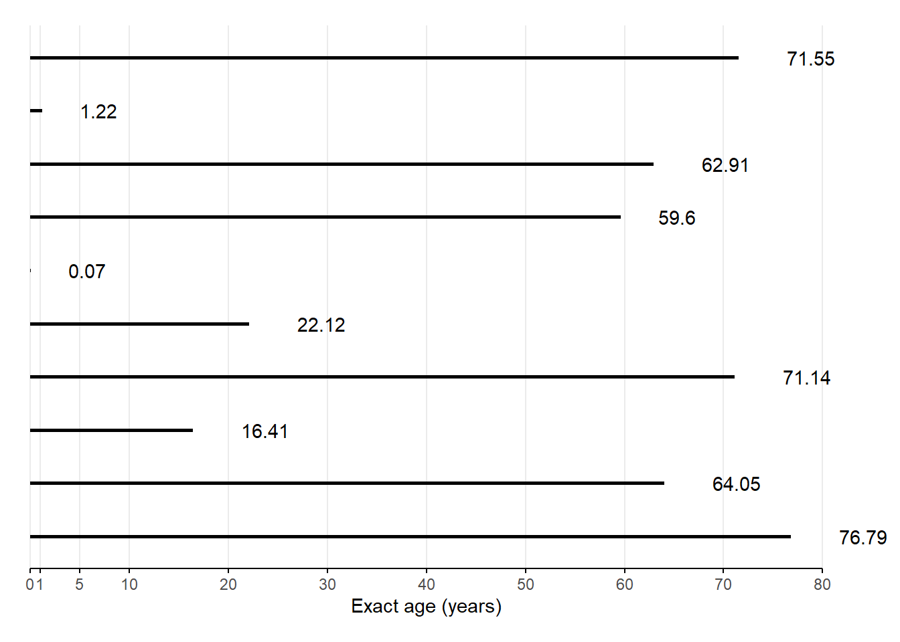

# Life tables and single decrement processes


:::{.rmdimportant}
**KEY CONCEPT**

A **life table** is one of the most important demographic tools for summarizing the mortality experience of a cohort.
:::

### Cohort life tables with lifeline data {.unnumbered}

Since a life table summarizes the experience of a cohort, let's start by building a life table from the lifelines of a small hypothetical cohort based actual people born January 1, 1800^[This section uses the example from PHG pgs. 39-41].


Below, a lifelines plot like we drew in [week 1](#person-periods), except time is measured from age $x = 0$, and everybody in this real birth cohort was born January 1, 1800^[From PHG Figure 3.1]:


<br><br>

<details>
<summary>
Number $l_0$ of live births (i.e., number surviving to exact age $x = 0$)?</summary>
$l_{0} = 10$
</details>

<details>
<summary>Number of deaths ${}_{n}d_{x}$ between ages $x = 0$ and $x+n = 1$?</summary>
${}_{1}d_{0} = 1$
</details>

<details>
<summary>
Number $l_x$ still alive at exact age $x = 1$?</summary>
$l_{1} = l_0 - {}_{1}d_{0} = 9$

So in general:

$$l_{x+n} = l_x - {}_{n}d_{x}$$
</details>

<details>
<summary>
Probability of death ${}_{n}q_{x}$ between ages $x = 0$ and $x+n = 1$?</summary>
$$
{}_{1}q_{0} = \frac{{}_{1}d_{0}}{l_0}
             = 0.1
$$

So in general:

$${}_{n}q_{x} = \frac{{}_{n}d_{x}}{l_x}$$
</details>

<details>
<summary>
Probability of survival ${}_{n}p_{x}$ between ages $x = 0$ and $x+n = 1$?</summary>
$$
{}_{1}p_{0} = l_1 / l_0
              = 1 - {}_{1}q_{0}
              = 0.9
$$

For general $x$:

$${}_{n}p_{x} = l_{x+n} / l_x = 1 - {}_{n}q_{x}$$
</details>

<details>
<summary>Number of person-years ${}_{n}A_x$ lived by those who died between ages $x$ and $x+n$?</summary>
For general $x$:

$$
{}_{n}A_x =
  \sum_{i \in \textsf{dead}_x} \left(\textsf{(Exact age at death)}_i - x\right)
$$

But for these $x = 0$ (i.e., infants):

$$\begin{align}
{}_{1}A_0
  &= \sum_{i \in \textsf{dead}_0} \left(\textsf{(Exact age at death)}_i - 0\right) \\
  &= \sum_{i \in \textsf{dead}_0} \textsf{(Exact age at death)}_i \\
  &= 0.07
\end{align}$$
</details>

<details>
<summary>What is the average number of person-years lived ${}_{n}a_x$ by those who died between ages $x$ and $x+n$?<br>
**Hint:** It's the average of a similar figure we've seen already, thus a ratio of that sum to a count we've seen already.</summary>
For general age group starting at exact age $x$:

$${}_{n}a_x = \frac{{}_{n}A_x}{{}_{n}d_x}$$

But for these $x = 0$ (i.e., infants):

$$
{}_{1}a_0
  = \frac{{}_{1}A_0}{{}_{1}d_0}
  = \frac{
    0.07
  }{
    1
  }
  = 0.07
$$
</details>

<details>
<summary>
Person-years lived ${}_{n}L_{x}$ between ages $x = 0$ and $x+n = 1$?</summary>
$$\begin{align}
  {}_{n}L_{x}
    &= \begin{pmatrix}
      \textsf{Person-years lived} \\
      \textsf{between ages } x \textsf{ and } x+n \\
      \textsf{among survivors to age } x+n
    \end{pmatrix}
    \times \begin{pmatrix}
      \textsf{Width of } [x,x+n)\\
      \textsf{age interval}
    \end{pmatrix} \\
    &+ \begin{pmatrix}
      \textsf{Person-years lived} \\
      \textsf{between ages } x \textsf{ and } x+n \\
      \textsf{among those who died} \\
      \textsf{before age } x+n
    \end{pmatrix} \\
    &=  \begin{pmatrix}
      \textsf{Survivor count} \\
      \textsf{weighted by} \\
      \textsf{interval width} \\
    \end{pmatrix}
    + \begin{pmatrix}
      \textsf{Fractional person-years} \\
      \textsf{lived by the now deceased}
    \end{pmatrix} \\
    &= \left(l_{x+n} \times n\right) + {_n}_{}A_x
\end{align}$$

This should look familiar to our expression of person-years from [week 1](#person-periods): $PY[0,1] = \sum_1^P N_i \times \Delta_i$

So for these 1800 birth cohort infants:

$$\begin{align}
{}_{1}L_0
  &= l_1 \times 1 + {}_{1}A_0 - 0 \\
  &= l_1  + {}_{1}A_0 \\
  &= 9 + 0.07 \\
  &= 9.07
\end{align}$$

Recall that ${}_{n}a_x = \frac{{}_{n}A_x}{{}_{n}d_x}$

Thus ${}_{n}A_x = {}_{n}a_x \times {}_{n}d_x$

Thus $L_x = l_{x+n} \times n + {_n}_{}a_x \times {}_{n}d_x$

This becomes useful when doing **period life tables** because:

* You can't calculate ${}_{n}A_x$ directly
* So you can't calculate $L_x$ from ${}_{n}A_x$ directly
* So you borrow values from a model or another population
* But you want ${}_{n}A_x$ estimates that aren't contaminated by another population's size
<br><br>
</details>

<details>
<summary>Person-years $T_x$ lived above exact age $x = 0$?</summary>
$$\begin{align}
  T_0
    &= \textsf{Total person years lived from birth to death} \\
    &= \sum_i \textsf{(Exact age at death)}_i \\
    &= \sum_{a=0}^\infty {}_{n}L_a
\end{align}$$

:::{.rmdtip}
**DEMOGRAPHY & DATA SCIENCE**
<details>
<summary>Okay that was too easy, what about $T_{20}$? Let's do it with R code.</summary>
More generally:

$$T_x = \sum_{a=x}^\infty {}_{n}L_a$$

Easy to think about, but funky to do in practice.

Let's walk through how you'd do it with R code.

Say you have a cohort life table in a `data.frame` with two columns:

* `x`: Exact age $x$ at the beginning of each age interval
* `L`: Person-years ${}_{n}L_x$ lived in the age interval

It looks like this:

<table class=" lightable-paper lightable-hover" style='font-family: "Arial Narrow", arial, helvetica, sans-serif; width: auto !important; '>
 <thead>
  <tr>
   <th style="text-align:right;"> x </th>
   <th style="text-align:right;"> L </th>
  </tr>
 </thead>
<tbody>
  <tr>
   <td style="text-align:right;"> 0 </td>
   <td style="text-align:right;"> 9.07 </td>
  </tr>
  <tr>
   <td style="text-align:right;"> 1 </td>
   <td style="text-align:right;"> 32.22 </td>
  </tr>
  <tr>
   <td style="text-align:right;"> 5 </td>
   <td style="text-align:right;"> 40.00 </td>
  </tr>
  <tr>
   <td style="text-align:right;"> 10 </td>
   <td style="text-align:right;"> 76.41 </td>
  </tr>
  <tr>
   <td style="text-align:right;"> 20 </td>
   <td style="text-align:right;"> 62.12 </td>
  </tr>
  <tr>
   <td style="text-align:right;"> 30 </td>
   <td style="text-align:right;"> 60.00 </td>
  </tr>
  <tr>
   <td style="text-align:right;"> 40 </td>
   <td style="text-align:right;"> 60.00 </td>
  </tr>
  <tr>
   <td style="text-align:right;"> 50 </td>
   <td style="text-align:right;"> 59.60 </td>
  </tr>
  <tr>
   <td style="text-align:right;"> 60 </td>
   <td style="text-align:right;"> 36.96 </td>
  </tr>
  <tr>
   <td style="text-align:right;"> 70 </td>
   <td style="text-align:right;"> 9.48 </td>
  </tr>
  <tr>
   <td style="text-align:right;"> 80 </td>
   <td style="text-align:right;">  </td>
  </tr>
</tbody>
</table>

To create a column `T` storing $T_x$ values, do this (assuming you have `dplyr` installed and loaded):


```r
saving_you_some_time <- cohort_lt_xL %>%
  dplyr::mutate(
    T = rev(L) %>% # Reverse person-years column so sum back to x = 0
      dplyr::coalesce(0) %>% # Replace the missing value at x = 80 so you can...
      cumsum() %>% # ... take the cumulative sum of person years
      rev() # Finally, reverse the cumulative sum back in age order
  )
saving_you_some_time %>%
  knitr::kable() %>%
  kableExtra::kable_paper("hover", full_width = FALSE, position = "left")
```

<table class=" lightable-paper lightable-hover" style='font-family: "Arial Narrow", arial, helvetica, sans-serif; width: auto !important; '>
 <thead>
  <tr>
   <th style="text-align:right;"> x </th>
   <th style="text-align:right;"> L </th>
   <th style="text-align:right;"> T </th>
  </tr>
 </thead>
<tbody>
  <tr>
   <td style="text-align:right;"> 0 </td>
   <td style="text-align:right;"> 9.07 </td>
   <td style="text-align:right;"> 445.86 </td>
  </tr>
  <tr>
   <td style="text-align:right;"> 1 </td>
   <td style="text-align:right;"> 32.22 </td>
   <td style="text-align:right;"> 436.79 </td>
  </tr>
  <tr>
   <td style="text-align:right;"> 5 </td>
   <td style="text-align:right;"> 40.00 </td>
   <td style="text-align:right;"> 404.57 </td>
  </tr>
  <tr>
   <td style="text-align:right;"> 10 </td>
   <td style="text-align:right;"> 76.41 </td>
   <td style="text-align:right;"> 364.57 </td>
  </tr>
  <tr>
   <td style="text-align:right;"> 20 </td>
   <td style="text-align:right;"> 62.12 </td>
   <td style="text-align:right;"> 288.16 </td>
  </tr>
  <tr>
   <td style="text-align:right;"> 30 </td>
   <td style="text-align:right;"> 60.00 </td>
   <td style="text-align:right;"> 226.04 </td>
  </tr>
  <tr>
   <td style="text-align:right;"> 40 </td>
   <td style="text-align:right;"> 60.00 </td>
   <td style="text-align:right;"> 166.04 </td>
  </tr>
  <tr>
   <td style="text-align:right;"> 50 </td>
   <td style="text-align:right;"> 59.60 </td>
   <td style="text-align:right;"> 106.04 </td>
  </tr>
  <tr>
   <td style="text-align:right;"> 60 </td>
   <td style="text-align:right;"> 36.96 </td>
   <td style="text-align:right;"> 46.44 </td>
  </tr>
  <tr>
   <td style="text-align:right;"> 70 </td>
   <td style="text-align:right;"> 9.48 </td>
   <td style="text-align:right;"> 9.48 </td>
  </tr>
  <tr>
   <td style="text-align:right;"> 80 </td>
   <td style="text-align:right;">  </td>
   <td style="text-align:right;"> 0.00 </td>
  </tr>
</tbody>
</table>

You're welcome.
</details>

:::
</details>

<details>
<summary>What is the life expectancy at birth, i.e., life expectancy $e_x^0$ at age $x = 0$?<br>
**Hint:** It's the per-survivor average of a value we've already calculated, so it's a ratio of that value and another one we've already calculated.</summary>
$$\begin{align}
  e_0^0
    &= \frac{
      \textsf{Person-years lived after age } x=0 \textsf{ (i.e., total person-years)}
    }{
      \textsf{People alive after age } x=0 \textsf{ (i.e., live births)}
    } \\
    &= T_0/l_0
    = 445.86
    / 10
    = 44.586
\end{align}$$

So for general exact age $x$:

$$e_x^0 = T_x/l_x$$

</details>

<details>
<summary>What is the mortality rate ${}_{n}m_x$ in the cohort between ages $x$ and $x+n$</summary>
* This is just a cohort age-specific rate
* Using life table notation, it is:

$$
{}_{1}m_0
  = {}_{1}d_0 / {}_{1}L_0
  = 1
  / 9.07
  = 0.1102536
$$
</details>
<br><br>

<center>🤯🤯🤯</center>

**QUESTION:** Why did we just learn all of those values?

**ANSWER:** Three reasons:

1. I'm evil
2. Their relationships and values help create **period life tables**
3. Their values (and operations on them) are interesting in and of themselves

* We'll see examples of those last two points in later sections.
* You've already seen ample evidence of the first point.

Now let's put all these values together into our first cohort life table:

<table class=" lightable-paper lightable-hover" style='font-family: "Arial Narrow", arial, helvetica, sans-serif; width: auto !important; '>
 <thead>
  <tr>
   <th style="text-align:right;"> $x$ </th>
   <th style="text-align:right;"> $n$ </th>
   <th style="text-align:right;"> $x+n$ </th>
   <th style="text-align:right;"> $l_x$ </th>
   <th style="text-align:right;"> ${}_{n}d_x$ </th>
   <th style="text-align:right;"> ${}_{n}q_x$ </th>
   <th style="text-align:right;"> ${}_{n}p_x$ </th>
   <th style="text-align:right;"> $L_x$ </th>
   <th style="text-align:right;"> $T_x$ </th>
   <th style="text-align:right;"> $e_x^0$ </th>
   <th style="text-align:right;"> ${}_{n}m_x$ </th>
   <th style="text-align:right;"> ${}_{n}a_x$ </th>
  </tr>
 </thead>
<tbody>
  <tr>
   <td style="text-align:right;"> 0 </td>
   <td style="text-align:right;border-left:1px solid;"> 1 </td>
   <td style="text-align:right;border-left:1px solid;"> 1 </td>
   <td style="text-align:right;border-left:1px solid;"> 10 </td>
   <td style="text-align:right;border-left:1px solid;"> 1 </td>
   <td style="text-align:right;border-left:1px solid;"> 0.1000000 </td>
   <td style="text-align:right;border-left:1px solid;"> 0.9000000 </td>
   <td style="text-align:right;border-left:1px solid;"> 9.07 </td>
   <td style="text-align:right;border-left:1px solid;"> 445.86 </td>
   <td style="text-align:right;border-left:1px solid;"> 44.58600 </td>
   <td style="text-align:right;border-left:1px solid;"> 0.1102536 </td>
   <td style="text-align:right;border-left:1px solid;"> 0.07 </td>
  </tr>
  <tr>
   <td style="text-align:right;"> 1 </td>
   <td style="text-align:right;border-left:1px solid;"> 4 </td>
   <td style="text-align:right;border-left:1px solid;"> 5 </td>
   <td style="text-align:right;border-left:1px solid;"> 9 </td>
   <td style="text-align:right;border-left:1px solid;"> 1 </td>
   <td style="text-align:right;border-left:1px solid;"> 0.1111111 </td>
   <td style="text-align:right;border-left:1px solid;"> 0.8888889 </td>
   <td style="text-align:right;border-left:1px solid;"> 32.22 </td>
   <td style="text-align:right;border-left:1px solid;"> 436.79 </td>
   <td style="text-align:right;border-left:1px solid;"> 48.53222 </td>
   <td style="text-align:right;border-left:1px solid;"> 0.0310366 </td>
   <td style="text-align:right;border-left:1px solid;"> 0.22 </td>
  </tr>
  <tr>
   <td style="text-align:right;"> 5 </td>
   <td style="text-align:right;border-left:1px solid;"> 5 </td>
   <td style="text-align:right;border-left:1px solid;"> 10 </td>
   <td style="text-align:right;border-left:1px solid;"> 8 </td>
   <td style="text-align:right;border-left:1px solid;"> 0 </td>
   <td style="text-align:right;border-left:1px solid;"> 0.0000000 </td>
   <td style="text-align:right;border-left:1px solid;"> 1.0000000 </td>
   <td style="text-align:right;border-left:1px solid;"> 40.00 </td>
   <td style="text-align:right;border-left:1px solid;"> 404.57 </td>
   <td style="text-align:right;border-left:1px solid;"> 50.57125 </td>
   <td style="text-align:right;border-left:1px solid;"> 0.0000000 </td>
   <td style="text-align:right;border-left:1px solid;">  </td>
  </tr>
  <tr>
   <td style="text-align:right;"> 10 </td>
   <td style="text-align:right;border-left:1px solid;"> 10 </td>
   <td style="text-align:right;border-left:1px solid;"> 20 </td>
   <td style="text-align:right;border-left:1px solid;"> 8 </td>
   <td style="text-align:right;border-left:1px solid;"> 1 </td>
   <td style="text-align:right;border-left:1px solid;"> 0.1250000 </td>
   <td style="text-align:right;border-left:1px solid;"> 0.8750000 </td>
   <td style="text-align:right;border-left:1px solid;"> 76.41 </td>
   <td style="text-align:right;border-left:1px solid;"> 364.57 </td>
   <td style="text-align:right;border-left:1px solid;"> 45.57125 </td>
   <td style="text-align:right;border-left:1px solid;"> 0.0130873 </td>
   <td style="text-align:right;border-left:1px solid;"> 6.41 </td>
  </tr>
  <tr>
   <td style="text-align:right;"> 20 </td>
   <td style="text-align:right;border-left:1px solid;"> 10 </td>
   <td style="text-align:right;border-left:1px solid;"> 30 </td>
   <td style="text-align:right;border-left:1px solid;"> 7 </td>
   <td style="text-align:right;border-left:1px solid;"> 1 </td>
   <td style="text-align:right;border-left:1px solid;"> 0.1428571 </td>
   <td style="text-align:right;border-left:1px solid;"> 0.8571429 </td>
   <td style="text-align:right;border-left:1px solid;"> 62.12 </td>
   <td style="text-align:right;border-left:1px solid;"> 288.16 </td>
   <td style="text-align:right;border-left:1px solid;"> 41.16571 </td>
   <td style="text-align:right;border-left:1px solid;"> 0.0160979 </td>
   <td style="text-align:right;border-left:1px solid;"> 2.12 </td>
  </tr>
  <tr>
   <td style="text-align:right;"> 30 </td>
   <td style="text-align:right;border-left:1px solid;"> 10 </td>
   <td style="text-align:right;border-left:1px solid;"> 40 </td>
   <td style="text-align:right;border-left:1px solid;"> 6 </td>
   <td style="text-align:right;border-left:1px solid;"> 0 </td>
   <td style="text-align:right;border-left:1px solid;"> 0.0000000 </td>
   <td style="text-align:right;border-left:1px solid;"> 1.0000000 </td>
   <td style="text-align:right;border-left:1px solid;"> 60.00 </td>
   <td style="text-align:right;border-left:1px solid;"> 226.04 </td>
   <td style="text-align:right;border-left:1px solid;"> 37.67333 </td>
   <td style="text-align:right;border-left:1px solid;"> 0.0000000 </td>
   <td style="text-align:right;border-left:1px solid;">  </td>
  </tr>
  <tr>
   <td style="text-align:right;"> 40 </td>
   <td style="text-align:right;border-left:1px solid;"> 10 </td>
   <td style="text-align:right;border-left:1px solid;"> 50 </td>
   <td style="text-align:right;border-left:1px solid;"> 6 </td>
   <td style="text-align:right;border-left:1px solid;"> 0 </td>
   <td style="text-align:right;border-left:1px solid;"> 0.0000000 </td>
   <td style="text-align:right;border-left:1px solid;"> 1.0000000 </td>
   <td style="text-align:right;border-left:1px solid;"> 60.00 </td>
   <td style="text-align:right;border-left:1px solid;"> 166.04 </td>
   <td style="text-align:right;border-left:1px solid;"> 27.67333 </td>
   <td style="text-align:right;border-left:1px solid;"> 0.0000000 </td>
   <td style="text-align:right;border-left:1px solid;">  </td>
  </tr>
  <tr>
   <td style="text-align:right;"> 50 </td>
   <td style="text-align:right;border-left:1px solid;"> 10 </td>
   <td style="text-align:right;border-left:1px solid;"> 60 </td>
   <td style="text-align:right;border-left:1px solid;"> 6 </td>
   <td style="text-align:right;border-left:1px solid;"> 1 </td>
   <td style="text-align:right;border-left:1px solid;"> 0.1666667 </td>
   <td style="text-align:right;border-left:1px solid;"> 0.8333333 </td>
   <td style="text-align:right;border-left:1px solid;"> 59.60 </td>
   <td style="text-align:right;border-left:1px solid;"> 106.04 </td>
   <td style="text-align:right;border-left:1px solid;"> 17.67333 </td>
   <td style="text-align:right;border-left:1px solid;"> 0.0167785 </td>
   <td style="text-align:right;border-left:1px solid;"> 9.60 </td>
  </tr>
  <tr>
   <td style="text-align:right;"> 60 </td>
   <td style="text-align:right;border-left:1px solid;"> 10 </td>
   <td style="text-align:right;border-left:1px solid;"> 70 </td>
   <td style="text-align:right;border-left:1px solid;"> 5 </td>
   <td style="text-align:right;border-left:1px solid;"> 2 </td>
   <td style="text-align:right;border-left:1px solid;"> 0.4000000 </td>
   <td style="text-align:right;border-left:1px solid;"> 0.6000000 </td>
   <td style="text-align:right;border-left:1px solid;"> 36.96 </td>
   <td style="text-align:right;border-left:1px solid;"> 46.44 </td>
   <td style="text-align:right;border-left:1px solid;"> 9.28800 </td>
   <td style="text-align:right;border-left:1px solid;"> 0.0541126 </td>
   <td style="text-align:right;border-left:1px solid;"> 3.48 </td>
  </tr>
  <tr>
   <td style="text-align:right;"> 70 </td>
   <td style="text-align:right;border-left:1px solid;"> 10 </td>
   <td style="text-align:right;border-left:1px solid;"> 80 </td>
   <td style="text-align:right;border-left:1px solid;"> 3 </td>
   <td style="text-align:right;border-left:1px solid;"> 3 </td>
   <td style="text-align:right;border-left:1px solid;"> 1.0000000 </td>
   <td style="text-align:right;border-left:1px solid;"> 0.0000000 </td>
   <td style="text-align:right;border-left:1px solid;"> 9.48 </td>
   <td style="text-align:right;border-left:1px solid;"> 9.48 </td>
   <td style="text-align:right;border-left:1px solid;"> 3.16000 </td>
   <td style="text-align:right;border-left:1px solid;"> 0.3164557 </td>
   <td style="text-align:right;border-left:1px solid;"> 3.16 </td>
  </tr>
  <tr>
   <td style="text-align:right;"> 80 </td>
   <td style="text-align:right;border-left:1px solid;">  </td>
   <td style="text-align:right;border-left:1px solid;">  </td>
   <td style="text-align:right;border-left:1px solid;"> 0 </td>
   <td style="text-align:right;border-left:1px solid;"> 0 </td>
   <td style="text-align:right;border-left:1px solid;">  </td>
   <td style="text-align:right;border-left:1px solid;">  </td>
   <td style="text-align:right;border-left:1px solid;">  </td>
   <td style="text-align:right;border-left:1px solid;"> 0.00 </td>
   <td style="text-align:right;border-left:1px solid;">  </td>
   <td style="text-align:right;border-left:1px solid;">  </td>
   <td style="text-align:right;border-left:1px solid;">  </td>
  </tr>
</tbody>
</table>

## Period life tables

:::{.rmdimportant}
**KEY CONCEPTS**

> A **period life table** shows what *would happen* to a cohort *if* it were subjected for all of its life to the mortality conditions of that period.
> 
> -- PHG pg. 42 (bolding added)

| Cohort life table | Period life table |
| ----------------- | ----------------- |
| Actual cohort | Synthetic (aka hypothetical) cohort  |
| *Records* cohort's *real* experience | *Model* of what *would* happen |

:::

<details>
<summary>Why create a period life table, even if you have cohort data?</summary>
* Cohort data is unavailable:
    * **Example:** By law, full individual-level U.S. Census records only available starting 72 years ago, reducing sample size for many sub-populations
* Cohort data is outdated:
    * **Example:** ${}_{1}q_{80}$ constructed this year requires data from people born 1941
* Cohort data is incomplete or erroneous:
    * **Example:** Employee termination records for large front line workforce tend to be missing or incorrectly logged
</details>
<br><br>

<details>
<summary>Which of the values we've covered so far would be hard to come by in classic demographic data. Why?</summary>
* Total or average person-years lived in age intervals (don't have exact person years)
* Probabilities of death or survival (don't have cohort data or separated count data)
* Person-years lived in age interval (but can estimate using [week 2](#estimating-person-periods) methods)
</details>
<br><br>

### The central importance of ${}_{n}q_x$ and ${}_{n}a_x$ {.unnumbered}

Once you know ${}_{n}q_x$, you can calculate the rest of life table unknowns.

Recall that:

* ${}_{n}q_x = {}_{n}d_x / l_x$ (unavailable in period data)
* ${}_{n}L_x = n \cdot l_{x+n} + {}_{n}a_x \cdot {}_{n}d_x$ (approximated from period data, but we want synthetic cohort rates under period mortality conditions)
* ${}_{n}m_x = {}_{n}d_x / {}_{n}L_x$ (measured directly from period data)

PHG pg. 43 exploits these equations to derive ${}_{n}q_x$ from two life table columns $\color{dodgerblue}{\textsf{available in period data}}$ and one unknown parameter $\color{darkorange}{\textsf{unavailable in period data}}$:

\begin{equation}
  \color{darkorange}{{}_{n}q_x} = \frac{
    \color{dodgerblue}{n} \cdot \color{dodgerblue}{{}_{n}{m_x}}
  }{
    1 + \left(
      \color{dodgerblue}{n} - \color{darkorange}{{}_{n}a_x}
    \right)\color{dodgerblue}{{}_{n}{m_x}}
  }
  (\#eq:nqxperiod)
\end{equation}

If we can estimate ${}_{n}a_x$, we can estimate ${}_{n}q_x$ and the rest of the period life table

So we need some...

## Strategies for ${}_{n}m_x$ $\rightarrow$ ${}_{n}q_x$ conversion

### Direct observation

* You can use exact ages at death to estimate ${}_{n}a_x$
* Yet the values are distorted by within-interval age distribution
* So usually this is a bad idea

### Graduation of the age-specific mortality rate (${}_{n}m_x$) function

* If you know how ${}_{n}m_x$ is changing within an age interval, you can estimate the distribution of deaths within the interval.
* Graduation methods are based on estimates of the slopes of ${}_{n}m_x$ and age structure ${}_{n}C_x$ across age groups, which serve as proxies for the slopes of ${}_{n}m_x$ within age groups.

Let's demonstrate the application of a graduation method [@keyfitz1990world] using the R package `demogR`, including it's `goodman` data set presenting aggregate vital registration data for women from Venezuela (1965), Madagascar (1966), and the United States (1967).

From the package documentation:

> For type="kf", the default, the first two values of nax estimated using Keyfitz and Fleiger's (1990) regression method. For type="cd", Coale and Demeny's method (1983) is used. The Coale-Demeny method uses different coefficients depending on the level of early mortality. As a result, this method may work better for high-mortality populations.

We'll build a life table for Venezuela 1965. In your problem set for this week, you'll compare the results of this graduation-based life table to one [Using rules of thumb] below.


```r
data(goodman)
vlt <- with(goodman, life.table(x = age, nKx = ven.nKx, nDx = ven.nDx))
vlt %>%
  knitr::kable() %>%
  kableExtra::kable_paper("hover", full_width = FALSE, position = "left") %>%
  kableExtra::column_spec(2:9, border_left = TRUE)
```

<table class=" lightable-paper lightable-hover" style='font-family: "Arial Narrow", arial, helvetica, sans-serif; width: auto !important; '>
 <thead>
  <tr>
   <th style="text-align:right;"> x </th>
   <th style="text-align:right;"> nax </th>
   <th style="text-align:right;"> nMx </th>
   <th style="text-align:right;"> nqx </th>
   <th style="text-align:right;"> lx </th>
   <th style="text-align:right;"> ndx </th>
   <th style="text-align:right;"> nLx </th>
   <th style="text-align:right;"> Tx </th>
   <th style="text-align:right;"> ex </th>
  </tr>
 </thead>
<tbody>
  <tr>
   <td style="text-align:right;"> 0 </td>
   <td style="text-align:right;border-left:1px solid;"> 0.1483 </td>
   <td style="text-align:right;border-left:1px solid;"> 0.0461 </td>
   <td style="text-align:right;border-left:1px solid;"> 0.0443 </td>
   <td style="text-align:right;border-left:1px solid;"> 1.0000 </td>
   <td style="text-align:right;border-left:1px solid;"> 0.0443 </td>
   <td style="text-align:right;border-left:1px solid;"> 0.9622 </td>
   <td style="text-align:right;border-left:1px solid;"> 67.70 </td>
   <td style="text-align:right;border-left:1px solid;"> 67.70 </td>
  </tr>
  <tr>
   <td style="text-align:right;"> 1 </td>
   <td style="text-align:right;border-left:1px solid;"> 1.5000 </td>
   <td style="text-align:right;border-left:1px solid;"> 0.0057 </td>
   <td style="text-align:right;border-left:1px solid;"> 0.0226 </td>
   <td style="text-align:right;border-left:1px solid;"> 0.9557 </td>
   <td style="text-align:right;border-left:1px solid;"> 0.0216 </td>
   <td style="text-align:right;border-left:1px solid;"> 3.7687 </td>
   <td style="text-align:right;border-left:1px solid;"> 66.74 </td>
   <td style="text-align:right;border-left:1px solid;"> 69.84 </td>
  </tr>
  <tr>
   <td style="text-align:right;"> 5 </td>
   <td style="text-align:right;border-left:1px solid;"> 2.5000 </td>
   <td style="text-align:right;border-left:1px solid;"> 0.0012 </td>
   <td style="text-align:right;border-left:1px solid;"> 0.0058 </td>
   <td style="text-align:right;border-left:1px solid;"> 0.9341 </td>
   <td style="text-align:right;border-left:1px solid;"> 0.0055 </td>
   <td style="text-align:right;border-left:1px solid;"> 4.6568 </td>
   <td style="text-align:right;border-left:1px solid;"> 62.97 </td>
   <td style="text-align:right;border-left:1px solid;"> 67.41 </td>
  </tr>
  <tr>
   <td style="text-align:right;"> 10 </td>
   <td style="text-align:right;border-left:1px solid;"> 2.5000 </td>
   <td style="text-align:right;border-left:1px solid;"> 0.0007 </td>
   <td style="text-align:right;border-left:1px solid;"> 0.0036 </td>
   <td style="text-align:right;border-left:1px solid;"> 0.9286 </td>
   <td style="text-align:right;border-left:1px solid;"> 0.0034 </td>
   <td style="text-align:right;border-left:1px solid;"> 4.6347 </td>
   <td style="text-align:right;border-left:1px solid;"> 58.31 </td>
   <td style="text-align:right;border-left:1px solid;"> 62.80 </td>
  </tr>
  <tr>
   <td style="text-align:right;"> 15 </td>
   <td style="text-align:right;border-left:1px solid;"> 2.5000 </td>
   <td style="text-align:right;border-left:1px solid;"> 0.0011 </td>
   <td style="text-align:right;border-left:1px solid;"> 0.0054 </td>
   <td style="text-align:right;border-left:1px solid;"> 0.9253 </td>
   <td style="text-align:right;border-left:1px solid;"> 0.0050 </td>
   <td style="text-align:right;border-left:1px solid;"> 4.6138 </td>
   <td style="text-align:right;border-left:1px solid;"> 53.68 </td>
   <td style="text-align:right;border-left:1px solid;"> 58.01 </td>
  </tr>
  <tr>
   <td style="text-align:right;"> 20 </td>
   <td style="text-align:right;border-left:1px solid;"> 2.5000 </td>
   <td style="text-align:right;border-left:1px solid;"> 0.0013 </td>
   <td style="text-align:right;border-left:1px solid;"> 0.0065 </td>
   <td style="text-align:right;border-left:1px solid;"> 0.9202 </td>
   <td style="text-align:right;border-left:1px solid;"> 0.0060 </td>
   <td style="text-align:right;border-left:1px solid;"> 4.5863 </td>
   <td style="text-align:right;border-left:1px solid;"> 49.07 </td>
   <td style="text-align:right;border-left:1px solid;"> 53.32 </td>
  </tr>
  <tr>
   <td style="text-align:right;"> 25 </td>
   <td style="text-align:right;border-left:1px solid;"> 2.5000 </td>
   <td style="text-align:right;border-left:1px solid;"> 0.0017 </td>
   <td style="text-align:right;border-left:1px solid;"> 0.0086 </td>
   <td style="text-align:right;border-left:1px solid;"> 0.9143 </td>
   <td style="text-align:right;border-left:1px solid;"> 0.0079 </td>
   <td style="text-align:right;border-left:1px solid;"> 4.5516 </td>
   <td style="text-align:right;border-left:1px solid;"> 44.48 </td>
   <td style="text-align:right;border-left:1px solid;"> 48.65 </td>
  </tr>
  <tr>
   <td style="text-align:right;"> 30 </td>
   <td style="text-align:right;border-left:1px solid;"> 2.5000 </td>
   <td style="text-align:right;border-left:1px solid;"> 0.0022 </td>
   <td style="text-align:right;border-left:1px solid;"> 0.0109 </td>
   <td style="text-align:right;border-left:1px solid;"> 0.9064 </td>
   <td style="text-align:right;border-left:1px solid;"> 0.0098 </td>
   <td style="text-align:right;border-left:1px solid;"> 4.5074 </td>
   <td style="text-align:right;border-left:1px solid;"> 39.93 </td>
   <td style="text-align:right;border-left:1px solid;"> 44.05 </td>
  </tr>
  <tr>
   <td style="text-align:right;"> 35 </td>
   <td style="text-align:right;border-left:1px solid;"> 2.5000 </td>
   <td style="text-align:right;border-left:1px solid;"> 0.0033 </td>
   <td style="text-align:right;border-left:1px solid;"> 0.0163 </td>
   <td style="text-align:right;border-left:1px solid;"> 0.8966 </td>
   <td style="text-align:right;border-left:1px solid;"> 0.0146 </td>
   <td style="text-align:right;border-left:1px solid;"> 4.4463 </td>
   <td style="text-align:right;border-left:1px solid;"> 35.42 </td>
   <td style="text-align:right;border-left:1px solid;"> 39.51 </td>
  </tr>
  <tr>
   <td style="text-align:right;"> 40 </td>
   <td style="text-align:right;border-left:1px solid;"> 2.5000 </td>
   <td style="text-align:right;border-left:1px solid;"> 0.0042 </td>
   <td style="text-align:right;border-left:1px solid;"> 0.0209 </td>
   <td style="text-align:right;border-left:1px solid;"> 0.8820 </td>
   <td style="text-align:right;border-left:1px solid;"> 0.0184 </td>
   <td style="text-align:right;border-left:1px solid;"> 4.3639 </td>
   <td style="text-align:right;border-left:1px solid;"> 30.97 </td>
   <td style="text-align:right;border-left:1px solid;"> 35.12 </td>
  </tr>
  <tr>
   <td style="text-align:right;"> 45 </td>
   <td style="text-align:right;border-left:1px solid;"> 2.5000 </td>
   <td style="text-align:right;border-left:1px solid;"> 0.0055 </td>
   <td style="text-align:right;border-left:1px solid;"> 0.0273 </td>
   <td style="text-align:right;border-left:1px solid;"> 0.8636 </td>
   <td style="text-align:right;border-left:1px solid;"> 0.0236 </td>
   <td style="text-align:right;border-left:1px solid;"> 4.2588 </td>
   <td style="text-align:right;border-left:1px solid;"> 26.61 </td>
   <td style="text-align:right;border-left:1px solid;"> 30.81 </td>
  </tr>
  <tr>
   <td style="text-align:right;"> 50 </td>
   <td style="text-align:right;border-left:1px solid;"> 2.5000 </td>
   <td style="text-align:right;border-left:1px solid;"> 0.0083 </td>
   <td style="text-align:right;border-left:1px solid;"> 0.0406 </td>
   <td style="text-align:right;border-left:1px solid;"> 0.8400 </td>
   <td style="text-align:right;border-left:1px solid;"> 0.0341 </td>
   <td style="text-align:right;border-left:1px solid;"> 4.1146 </td>
   <td style="text-align:right;border-left:1px solid;"> 22.35 </td>
   <td style="text-align:right;border-left:1px solid;"> 26.61 </td>
  </tr>
  <tr>
   <td style="text-align:right;"> 55 </td>
   <td style="text-align:right;border-left:1px solid;"> 2.5000 </td>
   <td style="text-align:right;border-left:1px solid;"> 0.0111 </td>
   <td style="text-align:right;border-left:1px solid;"> 0.0542 </td>
   <td style="text-align:right;border-left:1px solid;"> 0.8059 </td>
   <td style="text-align:right;border-left:1px solid;"> 0.0436 </td>
   <td style="text-align:right;border-left:1px solid;"> 3.9202 </td>
   <td style="text-align:right;border-left:1px solid;"> 18.24 </td>
   <td style="text-align:right;border-left:1px solid;"> 22.63 </td>
  </tr>
  <tr>
   <td style="text-align:right;"> 60 </td>
   <td style="text-align:right;border-left:1px solid;"> 2.5000 </td>
   <td style="text-align:right;border-left:1px solid;"> 0.0231 </td>
   <td style="text-align:right;border-left:1px solid;"> 0.1090 </td>
   <td style="text-align:right;border-left:1px solid;"> 0.7622 </td>
   <td style="text-align:right;border-left:1px solid;"> 0.0831 </td>
   <td style="text-align:right;border-left:1px solid;"> 3.6035 </td>
   <td style="text-align:right;border-left:1px solid;"> 14.32 </td>
   <td style="text-align:right;border-left:1px solid;"> 18.78 </td>
  </tr>
  <tr>
   <td style="text-align:right;"> 65 </td>
   <td style="text-align:right;border-left:1px solid;"> 2.5000 </td>
   <td style="text-align:right;border-left:1px solid;"> 0.0214 </td>
   <td style="text-align:right;border-left:1px solid;"> 0.1015 </td>
   <td style="text-align:right;border-left:1px solid;"> 0.6792 </td>
   <td style="text-align:right;border-left:1px solid;"> 0.0689 </td>
   <td style="text-align:right;border-left:1px solid;"> 3.2235 </td>
   <td style="text-align:right;border-left:1px solid;"> 10.71 </td>
   <td style="text-align:right;border-left:1px solid;"> 15.77 </td>
  </tr>
  <tr>
   <td style="text-align:right;"> 70 </td>
   <td style="text-align:right;border-left:1px solid;"> 2.5000 </td>
   <td style="text-align:right;border-left:1px solid;"> 0.0338 </td>
   <td style="text-align:right;border-left:1px solid;"> 0.1558 </td>
   <td style="text-align:right;border-left:1px solid;"> 0.6103 </td>
   <td style="text-align:right;border-left:1px solid;"> 0.0951 </td>
   <td style="text-align:right;border-left:1px solid;"> 2.8136 </td>
   <td style="text-align:right;border-left:1px solid;"> 7.49 </td>
   <td style="text-align:right;border-left:1px solid;"> 12.27 </td>
  </tr>
  <tr>
   <td style="text-align:right;"> 75 </td>
   <td style="text-align:right;border-left:1px solid;"> 2.5000 </td>
   <td style="text-align:right;border-left:1px solid;"> 0.0485 </td>
   <td style="text-align:right;border-left:1px solid;"> 0.2164 </td>
   <td style="text-align:right;border-left:1px solid;"> 0.5152 </td>
   <td style="text-align:right;border-left:1px solid;"> 0.1115 </td>
   <td style="text-align:right;border-left:1px solid;"> 2.2971 </td>
   <td style="text-align:right;border-left:1px solid;"> 4.68 </td>
   <td style="text-align:right;border-left:1px solid;"> 9.08 </td>
  </tr>
  <tr>
   <td style="text-align:right;"> 80 </td>
   <td style="text-align:right;border-left:1px solid;"> 2.5000 </td>
   <td style="text-align:right;border-left:1px solid;"> 0.1137 </td>
   <td style="text-align:right;border-left:1px solid;"> 0.4426 </td>
   <td style="text-align:right;border-left:1px solid;"> 0.4037 </td>
   <td style="text-align:right;border-left:1px solid;"> 0.1787 </td>
   <td style="text-align:right;border-left:1px solid;"> 1.5717 </td>
   <td style="text-align:right;border-left:1px solid;"> 2.38 </td>
   <td style="text-align:right;border-left:1px solid;"> 5.89 </td>
  </tr>
  <tr>
   <td style="text-align:right;"> 85 </td>
   <td style="text-align:right;border-left:1px solid;"> 3.5868 </td>
   <td style="text-align:right;border-left:1px solid;"> 0.2788 </td>
   <td style="text-align:right;border-left:1px solid;"> 1.0000 </td>
   <td style="text-align:right;border-left:1px solid;"> 0.2250 </td>
   <td style="text-align:right;border-left:1px solid;"> 0.2250 </td>
   <td style="text-align:right;border-left:1px solid;"> 0.8070 </td>
   <td style="text-align:right;border-left:1px solid;"> 0.81 </td>
   <td style="text-align:right;border-left:1px solid;"> 3.59 </td>
  </tr>
</tbody>
</table>

### Borrowing average person-years lived (${}_{n}a_x$) values from another population

* If your ${}_{n}m_x$ curve is similar to another population, perhaps the ${}_{n}a_x$ values are similar, too
* The question is, how to find a similar enough model life table?
* You'll learn a lot more about this in [CS&SS/SOC/STAT 563](https://soc.washington.edu/courses/2019/spring/soc/563/a) (Statistical Demography & Data Science).

### Using rules of thumb

In this course, we'll focus on rules of thumb. As we'll see, it turns out that these rules of thumb are often good enough.

#### Assume people die on average half-way through interval (${}_{n}a_x = n/2$) {#nax-mid-period-assumption .unnumbered}

PHG introduce this at the beginning of the period life table section, but I think it makes more sense to put it here. Under this assumption:

$$
{}_{n}q_x
  = \frac{
    n \cdot {}_{n}{m_x}
  }{
    1 + \frac{1}{2} \cdot n \cdot {}_{n}m_x
  }
  = \frac{2n \cdot {}_{n}m_x}{2 + n \cdot {}_{n}m_x}
$$

<details>
<summary>Under what conditions is this assumption exactly true?</summary>
* Linear growth or decline in death count during the period (remember the midpoint theorem from [week 1](#person-periods-method3))
* Deaths distributed symmetrically about the mid-period
* The shorter the period, the more linear the death curve, and the more reasonable this assumption
</details>
<br>

<details>
<summary>When does this assumption lead to a ${}_{n}q_x$ estimate that makes no sense?</summary>
A value ${}_{}q_x > 1$ makes no sense. Yet that's what will happen if:

$$\begin{align}
{}_{n}q_x
  &= \frac{2n \cdot {}_{n}m_x}{2 + n \cdot {}_{n}m_x} > 1
  \rightarrow n/2 > 1/{{}_{n}m_x}
  \rightarrow n/2 > {}_{n}L_x/{}_{n}d_x \\
  &= \textsf{Time to mid-period} > \textsf{Expected time to death}
\end{align}$$

In words, don't assume that the expected time to death from age $x$ is the mid-period if age-specific mortality tells you the expected time to death is in fact before the mid-period!

Look out for this issue in:

* High-mortality populations
* High-mortality age groups (e.g., very old ages)
* High-mortality age groups in high-mortality populations

You will work on a problem set where this problem rears its ugly head!
</details>

#### Assume constant death rate ${}_{n}m_x$ throughout the interval {#plt-constant-death-rate .unnumbered}

Under this assumption:

$$
{}_{n}q_x = 1 - e^{-n \cdot {}_{n}m_x}
$$
s
Equating the right hand side in the equation above to that of \@ref(eq:nqxperiod) reveals that:

$$
{}_{n}a_x = n + \frac{1}{{}_{n}m_x} - \frac{n}{1 - e^{-n \cdot {}_{n}m_x}} < n/2
$$

The final inequality means that assuming constant death rate further assumes that deaths are concentrated near the beginning of age intervals.

<details>
<summary>Look back at the mortality pattern covered in [week 2](#week2). where in the life history is the constant death rate assumption least realistic?</summary>
* Early childhood (rapidly declining death rate)
* After age 30 (rapidly increasing death rate^[Oh, goodie for me!])
</details>

### Life table results are fairly insensitive to error in choice of ${}_{n}a_x$ {.unnumbered}

The re-written ${}_{n}m_x \rightarrow {}_{n}q_x$ conversion equation reveals that ${}_{n}a_x$ is multiplied by ${}_{n}q_x$ before entering the formula

$$
{}_{n}q_x = \frac{
  n \cdot {}_{n}m_x
}{
  1 + n \cdot {}_{n}m_x - \color{red}{{}_{n}a_x \cdot {}_{n}m_x}
}
$$

* Global death rate $\approx$ 0.012
* So an error of 2 years in one ${}_{n}a_x$ means ${}_{n}q_x$ off by < 1%
* i.e., a small number < 1 is multiplied by another small number < 1 to yield an even smaller number
* So your choice among rules of thumb, etc., matters less than you think it does
* But still check the robustness of your results as much as you can

## The very young ages

Life table results are very sensitive to procedures for very young age groups, where mortality rates rapidly decline and the ${}_{n}a_x = n/2$ assumption breaks down.

**Problem:** In low mortality population, most children who die do so very early in life (especially among infants), so it's possible that ${}_{1}a_x \ll n/2$

**Potential solution:** Use the output of statistical models (e.g., regressions) of re==lationships between ${}_{n}a_x$, ${}_{1}m_0$ in young age groups for populations similar to yours

{width=100%}

To do this in R, you could some functions. For example (yes, this code could be less repetitive):


```r
nax_young <- function(m0, # mortality rate from ages 0 to 1
                      a, b, c) { # parameters of the model
  ifelse(m0 >= 0.107, a, b + c * m0)
}
# For youngest age group 1a0
a0_young_male <- function(m0) nax_young(m0, 0.330, 0.045, 2.684)
a0_young_female <- function(m0) nax_young(m0, 0.350, 0.053, 2.800)
a0_young_both <- function(m0) {
  0.5 * (nax_young_male(m0) + nax_young_female(m0))
}
# For a four-year age interval between 1 and 5 (i.e., 4a1)
a1_young_male <- function(m0) nax_young(m0, 1.352, 1.651, 2.816)
a1_young_female <- function(m0) nax_young(m0, 1.361, 1.522, 1.518)
a1_young_both <- function(m0) {
  0.5 * (nax_young_male(m0) + nax_young_female(n, m0))
}
# Sanity check using Australian data from PHG Box 3.1
a0_young_male(0.008743)
```

```
## [1] 0.06846621
```

In reality, there are well-tested software packages to perform such tasks (e.g., `demogR`)

<details>
<summary>What are potential pitfalls of using statistical models trained from existing populations to model life table components?</summary>
* Depending on the data used to train the model, it may not generalize to contemporary or future observations
* The usual bias-variance trade-off issues with building predictive models
* Assume incorrect functional form
</details>

## The open-ended age interval

:::{.rmdimportant}
**KEY CONCEPT**

For the oldest age group starting with age $x = x^*$, age interval length $n = \infty$. This age group is called the **open-ended interval**.

Ideally, choose $x^*$ so that a very small fraction of individuals survive to it
:::

Because $n = \infty$:

* ${}_{\infty}q_{x^*} = 1$ ("In the end, we're all dead.")
* ${}_{\infty}p_{x^*} = 1 - {}_{\infty}q_{x^*}= 0$ (In the end, none of us lives.)
* ${}_{\infty}d_{x^*} = l_{x^*}$ (Good to know since we can't observe who dies after $\infty$ years)

Recall that:

$$
{}_{\infty}m_{x^*} = \frac{
  {}_{\infty}d_{x^*}
}{
  {}_{\infty}L_{x^*}
} \rightarrow {}_{\infty}L_{x^*} = \frac{
  {}_{\infty}d_{x^*}
}{
  {}_{\infty}m_{x^*}
}
$$

Plugging in ${}_{\infty}d_{x^*} = l_{x^*}$:

$$
{}_{\infty}L_{x^*} = \frac{l_{x^*}}{{}_{\infty}m_{x^*}}
$$

Both numerator and denominator are things we can observe within a period.

</details>

## Review of the steps for period life table construction


Let's walk through the steps of life table construction using the `tidyverse` in R and data on age-specific mortality in Ukraine in 2013.

Here's the data:

<table class=" lightable-paper lightable-hover" style='font-family: "Arial Narrow", arial, helvetica, sans-serif; width: auto !important; '>
 <thead>
  <tr>
   <th style="text-align:right;"> x </th>
   <th style="text-align:right;"> nmx </th>
   <th style="text-align:right;"> nx </th>
  </tr>
 </thead>
<tbody>
  <tr>
   <td style="text-align:right;"> 0 </td>
   <td style="text-align:right;border-left:1px solid;"> 0.007944 </td>
   <td style="text-align:right;border-left:1px solid;"> 1 </td>
  </tr>
  <tr>
   <td style="text-align:right;"> 1 </td>
   <td style="text-align:right;border-left:1px solid;"> 0.000585 </td>
   <td style="text-align:right;border-left:1px solid;"> 1 </td>
  </tr>
  <tr>
   <td style="text-align:right;"> 2 </td>
   <td style="text-align:right;border-left:1px solid;"> 0.000392 </td>
   <td style="text-align:right;border-left:1px solid;"> 1 </td>
  </tr>
  <tr>
   <td style="text-align:right;"> 3 </td>
   <td style="text-align:right;border-left:1px solid;"> 0.000243 </td>
   <td style="text-align:right;border-left:1px solid;"> 1 </td>
  </tr>
  <tr>
   <td style="text-align:right;"> 4 </td>
   <td style="text-align:right;border-left:1px solid;"> 0.000204 </td>
   <td style="text-align:right;border-left:1px solid;"> 1 </td>
  </tr>
  <tr>
   <td style="text-align:right;"> 5 </td>
   <td style="text-align:right;border-left:1px solid;"> 0.000212 </td>
   <td style="text-align:right;border-left:1px solid;"> 1 </td>
  </tr>
  <tr>
   <td style="text-align:right;"> 6 </td>
   <td style="text-align:right;border-left:1px solid;"> 0.000175 </td>
   <td style="text-align:right;border-left:1px solid;"> 1 </td>
  </tr>
  <tr>
   <td style="text-align:right;"> 7 </td>
   <td style="text-align:right;border-left:1px solid;"> 0.000223 </td>
   <td style="text-align:right;border-left:1px solid;"> 1 </td>
  </tr>
  <tr>
   <td style="text-align:right;"> 8 </td>
   <td style="text-align:right;border-left:1px solid;"> 0.000155 </td>
   <td style="text-align:right;border-left:1px solid;"> 1 </td>
  </tr>
  <tr>
   <td style="text-align:right;"> 9 </td>
   <td style="text-align:right;border-left:1px solid;"> 0.000171 </td>
   <td style="text-align:right;border-left:1px solid;"> 1 </td>
  </tr>
  <tr>
   <td style="text-align:right;"> 10 </td>
   <td style="text-align:right;border-left:1px solid;"> 0.000213 </td>
   <td style="text-align:right;border-left:1px solid;"> 1 </td>
  </tr>
  <tr>
   <td style="text-align:right;"> 11 </td>
   <td style="text-align:right;border-left:1px solid;"> 0.000178 </td>
   <td style="text-align:right;border-left:1px solid;"> 1 </td>
  </tr>
  <tr>
   <td style="text-align:right;"> 12 </td>
   <td style="text-align:right;border-left:1px solid;"> 0.000225 </td>
   <td style="text-align:right;border-left:1px solid;"> 1 </td>
  </tr>
  <tr>
   <td style="text-align:right;"> 13 </td>
   <td style="text-align:right;border-left:1px solid;"> 0.000272 </td>
   <td style="text-align:right;border-left:1px solid;"> 1 </td>
  </tr>
  <tr>
   <td style="text-align:right;"> 14 </td>
   <td style="text-align:right;border-left:1px solid;"> 0.000316 </td>
   <td style="text-align:right;border-left:1px solid;"> 1 </td>
  </tr>
  <tr>
   <td style="text-align:right;"> 15 </td>
   <td style="text-align:right;border-left:1px solid;"> 0.000393 </td>
   <td style="text-align:right;border-left:1px solid;"> 1 </td>
  </tr>
  <tr>
   <td style="text-align:right;"> 16 </td>
   <td style="text-align:right;border-left:1px solid;"> 0.000498 </td>
   <td style="text-align:right;border-left:1px solid;"> 1 </td>
  </tr>
  <tr>
   <td style="text-align:right;"> 17 </td>
   <td style="text-align:right;border-left:1px solid;"> 0.000538 </td>
   <td style="text-align:right;border-left:1px solid;"> 1 </td>
  </tr>
  <tr>
   <td style="text-align:right;"> 18 </td>
   <td style="text-align:right;border-left:1px solid;"> 0.000673 </td>
   <td style="text-align:right;border-left:1px solid;"> 1 </td>
  </tr>
  <tr>
   <td style="text-align:right;"> 19 </td>
   <td style="text-align:right;border-left:1px solid;"> 0.000776 </td>
   <td style="text-align:right;border-left:1px solid;"> 1 </td>
  </tr>
  <tr>
   <td style="text-align:right;"> 20 </td>
   <td style="text-align:right;border-left:1px solid;"> 0.000821 </td>
   <td style="text-align:right;border-left:1px solid;"> 1 </td>
  </tr>
  <tr>
   <td style="text-align:right;"> 21 </td>
   <td style="text-align:right;border-left:1px solid;"> 0.000910 </td>
   <td style="text-align:right;border-left:1px solid;"> 1 </td>
  </tr>
  <tr>
   <td style="text-align:right;"> 22 </td>
   <td style="text-align:right;border-left:1px solid;"> 0.000983 </td>
   <td style="text-align:right;border-left:1px solid;"> 1 </td>
  </tr>
  <tr>
   <td style="text-align:right;"> 23 </td>
   <td style="text-align:right;border-left:1px solid;"> 0.001023 </td>
   <td style="text-align:right;border-left:1px solid;"> 1 </td>
  </tr>
  <tr>
   <td style="text-align:right;"> 24 </td>
   <td style="text-align:right;border-left:1px solid;"> 0.001190 </td>
   <td style="text-align:right;border-left:1px solid;"> 1 </td>
  </tr>
  <tr>
   <td style="text-align:right;"> 25 </td>
   <td style="text-align:right;border-left:1px solid;"> 0.001399 </td>
   <td style="text-align:right;border-left:1px solid;"> 1 </td>
  </tr>
  <tr>
   <td style="text-align:right;"> 26 </td>
   <td style="text-align:right;border-left:1px solid;"> 0.001443 </td>
   <td style="text-align:right;border-left:1px solid;"> 1 </td>
  </tr>
  <tr>
   <td style="text-align:right;"> 27 </td>
   <td style="text-align:right;border-left:1px solid;"> 0.001598 </td>
   <td style="text-align:right;border-left:1px solid;"> 1 </td>
  </tr>
  <tr>
   <td style="text-align:right;"> 28 </td>
   <td style="text-align:right;border-left:1px solid;"> 0.001719 </td>
   <td style="text-align:right;border-left:1px solid;"> 1 </td>
  </tr>
  <tr>
   <td style="text-align:right;"> 29 </td>
   <td style="text-align:right;border-left:1px solid;"> 0.001975 </td>
   <td style="text-align:right;border-left:1px solid;"> 1 </td>
  </tr>
  <tr>
   <td style="text-align:right;"> 30 </td>
   <td style="text-align:right;border-left:1px solid;"> 0.002196 </td>
   <td style="text-align:right;border-left:1px solid;"> 1 </td>
  </tr>
  <tr>
   <td style="text-align:right;"> 31 </td>
   <td style="text-align:right;border-left:1px solid;"> 0.002411 </td>
   <td style="text-align:right;border-left:1px solid;"> 1 </td>
  </tr>
  <tr>
   <td style="text-align:right;"> 32 </td>
   <td style="text-align:right;border-left:1px solid;"> 0.002711 </td>
   <td style="text-align:right;border-left:1px solid;"> 1 </td>
  </tr>
  <tr>
   <td style="text-align:right;"> 33 </td>
   <td style="text-align:right;border-left:1px solid;"> 0.003033 </td>
   <td style="text-align:right;border-left:1px solid;"> 1 </td>
  </tr>
  <tr>
   <td style="text-align:right;"> 34 </td>
   <td style="text-align:right;border-left:1px solid;"> 0.003274 </td>
   <td style="text-align:right;border-left:1px solid;"> 1 </td>
  </tr>
  <tr>
   <td style="text-align:right;"> 35 </td>
   <td style="text-align:right;border-left:1px solid;"> 0.003648 </td>
   <td style="text-align:right;border-left:1px solid;"> 1 </td>
  </tr>
  <tr>
   <td style="text-align:right;"> 36 </td>
   <td style="text-align:right;border-left:1px solid;"> 0.003832 </td>
   <td style="text-align:right;border-left:1px solid;"> 1 </td>
  </tr>
  <tr>
   <td style="text-align:right;"> 37 </td>
   <td style="text-align:right;border-left:1px solid;"> 0.003855 </td>
   <td style="text-align:right;border-left:1px solid;"> 1 </td>
  </tr>
  <tr>
   <td style="text-align:right;"> 38 </td>
   <td style="text-align:right;border-left:1px solid;"> 0.004064 </td>
   <td style="text-align:right;border-left:1px solid;"> 1 </td>
  </tr>
  <tr>
   <td style="text-align:right;"> 39 </td>
   <td style="text-align:right;border-left:1px solid;"> 0.004381 </td>
   <td style="text-align:right;border-left:1px solid;"> 1 </td>
  </tr>
  <tr>
   <td style="text-align:right;"> 40 </td>
   <td style="text-align:right;border-left:1px solid;"> 0.004469 </td>
   <td style="text-align:right;border-left:1px solid;"> 1 </td>
  </tr>
  <tr>
   <td style="text-align:right;"> 41 </td>
   <td style="text-align:right;border-left:1px solid;"> 0.004778 </td>
   <td style="text-align:right;border-left:1px solid;"> 1 </td>
  </tr>
  <tr>
   <td style="text-align:right;"> 42 </td>
   <td style="text-align:right;border-left:1px solid;"> 0.004794 </td>
   <td style="text-align:right;border-left:1px solid;"> 1 </td>
  </tr>
  <tr>
   <td style="text-align:right;"> 43 </td>
   <td style="text-align:right;border-left:1px solid;"> 0.005337 </td>
   <td style="text-align:right;border-left:1px solid;"> 1 </td>
  </tr>
  <tr>
   <td style="text-align:right;"> 44 </td>
   <td style="text-align:right;border-left:1px solid;"> 0.005476 </td>
   <td style="text-align:right;border-left:1px solid;"> 1 </td>
  </tr>
  <tr>
   <td style="text-align:right;"> 45 </td>
   <td style="text-align:right;border-left:1px solid;"> 0.006045 </td>
   <td style="text-align:right;border-left:1px solid;"> 1 </td>
  </tr>
  <tr>
   <td style="text-align:right;"> 46 </td>
   <td style="text-align:right;border-left:1px solid;"> 0.006460 </td>
   <td style="text-align:right;border-left:1px solid;"> 1 </td>
  </tr>
  <tr>
   <td style="text-align:right;"> 47 </td>
   <td style="text-align:right;border-left:1px solid;"> 0.006624 </td>
   <td style="text-align:right;border-left:1px solid;"> 1 </td>
  </tr>
  <tr>
   <td style="text-align:right;"> 48 </td>
   <td style="text-align:right;border-left:1px solid;"> 0.007136 </td>
   <td style="text-align:right;border-left:1px solid;"> 1 </td>
  </tr>
  <tr>
   <td style="text-align:right;"> 49 </td>
   <td style="text-align:right;border-left:1px solid;"> 0.007608 </td>
   <td style="text-align:right;border-left:1px solid;"> 1 </td>
  </tr>
  <tr>
   <td style="text-align:right;"> 50 </td>
   <td style="text-align:right;border-left:1px solid;"> 0.008298 </td>
   <td style="text-align:right;border-left:1px solid;"> 1 </td>
  </tr>
  <tr>
   <td style="text-align:right;"> 51 </td>
   <td style="text-align:right;border-left:1px solid;"> 0.008874 </td>
   <td style="text-align:right;border-left:1px solid;"> 1 </td>
  </tr>
  <tr>
   <td style="text-align:right;"> 52 </td>
   <td style="text-align:right;border-left:1px solid;"> 0.009345 </td>
   <td style="text-align:right;border-left:1px solid;"> 1 </td>
  </tr>
  <tr>
   <td style="text-align:right;"> 53 </td>
   <td style="text-align:right;border-left:1px solid;"> 0.010126 </td>
   <td style="text-align:right;border-left:1px solid;"> 1 </td>
  </tr>
  <tr>
   <td style="text-align:right;"> 54 </td>
   <td style="text-align:right;border-left:1px solid;"> 0.010821 </td>
   <td style="text-align:right;border-left:1px solid;"> 1 </td>
  </tr>
  <tr>
   <td style="text-align:right;"> 55 </td>
   <td style="text-align:right;border-left:1px solid;"> 0.012270 </td>
   <td style="text-align:right;border-left:1px solid;"> 1 </td>
  </tr>
  <tr>
   <td style="text-align:right;"> 56 </td>
   <td style="text-align:right;border-left:1px solid;"> 0.012369 </td>
   <td style="text-align:right;border-left:1px solid;"> 1 </td>
  </tr>
  <tr>
   <td style="text-align:right;"> 57 </td>
   <td style="text-align:right;border-left:1px solid;"> 0.013350 </td>
   <td style="text-align:right;border-left:1px solid;"> 1 </td>
  </tr>
  <tr>
   <td style="text-align:right;"> 58 </td>
   <td style="text-align:right;border-left:1px solid;"> 0.014547 </td>
   <td style="text-align:right;border-left:1px solid;"> 1 </td>
  </tr>
  <tr>
   <td style="text-align:right;"> 59 </td>
   <td style="text-align:right;border-left:1px solid;"> 0.015502 </td>
   <td style="text-align:right;border-left:1px solid;"> 1 </td>
  </tr>
  <tr>
   <td style="text-align:right;"> 60 </td>
   <td style="text-align:right;border-left:1px solid;"> 0.017405 </td>
   <td style="text-align:right;border-left:1px solid;"> 1 </td>
  </tr>
  <tr>
   <td style="text-align:right;"> 61 </td>
   <td style="text-align:right;border-left:1px solid;"> 0.019200 </td>
   <td style="text-align:right;border-left:1px solid;"> 1 </td>
  </tr>
  <tr>
   <td style="text-align:right;"> 62 </td>
   <td style="text-align:right;border-left:1px solid;"> 0.020025 </td>
   <td style="text-align:right;border-left:1px solid;"> 1 </td>
  </tr>
  <tr>
   <td style="text-align:right;"> 63 </td>
   <td style="text-align:right;border-left:1px solid;"> 0.021356 </td>
   <td style="text-align:right;border-left:1px solid;"> 1 </td>
  </tr>
  <tr>
   <td style="text-align:right;"> 64 </td>
   <td style="text-align:right;border-left:1px solid;"> 0.024670 </td>
   <td style="text-align:right;border-left:1px solid;"> 1 </td>
  </tr>
  <tr>
   <td style="text-align:right;"> 65 </td>
   <td style="text-align:right;border-left:1px solid;"> 0.022477 </td>
   <td style="text-align:right;border-left:1px solid;"> 1 </td>
  </tr>
  <tr>
   <td style="text-align:right;"> 66 </td>
   <td style="text-align:right;border-left:1px solid;"> 0.028191 </td>
   <td style="text-align:right;border-left:1px solid;"> 1 </td>
  </tr>
  <tr>
   <td style="text-align:right;"> 67 </td>
   <td style="text-align:right;border-left:1px solid;"> 0.026044 </td>
   <td style="text-align:right;border-left:1px solid;"> 1 </td>
  </tr>
  <tr>
   <td style="text-align:right;"> 68 </td>
   <td style="text-align:right;border-left:1px solid;"> 0.028933 </td>
   <td style="text-align:right;border-left:1px solid;"> 1 </td>
  </tr>
  <tr>
   <td style="text-align:right;"> 69 </td>
   <td style="text-align:right;border-left:1px solid;"> 0.034497 </td>
   <td style="text-align:right;border-left:1px solid;"> 1 </td>
  </tr>
  <tr>
   <td style="text-align:right;"> 70 </td>
   <td style="text-align:right;border-left:1px solid;"> 0.033520 </td>
   <td style="text-align:right;border-left:1px solid;"> 1 </td>
  </tr>
  <tr>
   <td style="text-align:right;"> 71 </td>
   <td style="text-align:right;border-left:1px solid;"> 0.039489 </td>
   <td style="text-align:right;border-left:1px solid;"> 1 </td>
  </tr>
  <tr>
   <td style="text-align:right;"> 72 </td>
   <td style="text-align:right;border-left:1px solid;"> 0.039822 </td>
   <td style="text-align:right;border-left:1px solid;"> 1 </td>
  </tr>
  <tr>
   <td style="text-align:right;"> 73 </td>
   <td style="text-align:right;border-left:1px solid;"> 0.044766 </td>
   <td style="text-align:right;border-left:1px solid;"> 1 </td>
  </tr>
  <tr>
   <td style="text-align:right;"> 74 </td>
   <td style="text-align:right;border-left:1px solid;"> 0.050755 </td>
   <td style="text-align:right;border-left:1px solid;"> 1 </td>
  </tr>
  <tr>
   <td style="text-align:right;"> 75 </td>
   <td style="text-align:right;border-left:1px solid;"> 0.054874 </td>
   <td style="text-align:right;border-left:1px solid;"> 1 </td>
  </tr>
  <tr>
   <td style="text-align:right;"> 76 </td>
   <td style="text-align:right;border-left:1px solid;"> 0.062166 </td>
   <td style="text-align:right;border-left:1px solid;"> 1 </td>
  </tr>
  <tr>
   <td style="text-align:right;"> 77 </td>
   <td style="text-align:right;border-left:1px solid;"> 0.066493 </td>
   <td style="text-align:right;border-left:1px solid;"> 1 </td>
  </tr>
  <tr>
   <td style="text-align:right;"> 78 </td>
   <td style="text-align:right;border-left:1px solid;"> 0.076803 </td>
   <td style="text-align:right;border-left:1px solid;"> 1 </td>
  </tr>
  <tr>
   <td style="text-align:right;"> 79 </td>
   <td style="text-align:right;border-left:1px solid;"> 0.075665 </td>
   <td style="text-align:right;border-left:1px solid;"> 1 </td>
  </tr>
  <tr>
   <td style="text-align:right;"> 80 </td>
   <td style="text-align:right;border-left:1px solid;"> 0.084343 </td>
   <td style="text-align:right;border-left:1px solid;"> 1 </td>
  </tr>
  <tr>
   <td style="text-align:right;"> 81 </td>
   <td style="text-align:right;border-left:1px solid;"> 0.096659 </td>
   <td style="text-align:right;border-left:1px solid;"> 1 </td>
  </tr>
  <tr>
   <td style="text-align:right;"> 82 </td>
   <td style="text-align:right;border-left:1px solid;"> 0.105176 </td>
   <td style="text-align:right;border-left:1px solid;"> 1 </td>
  </tr>
  <tr>
   <td style="text-align:right;"> 83 </td>
   <td style="text-align:right;border-left:1px solid;"> 0.116171 </td>
   <td style="text-align:right;border-left:1px solid;"> 1 </td>
  </tr>
  <tr>
   <td style="text-align:right;"> 84 </td>
   <td style="text-align:right;border-left:1px solid;"> 0.129497 </td>
   <td style="text-align:right;border-left:1px solid;"> 1 </td>
  </tr>
  <tr>
   <td style="text-align:right;"> 85 </td>
   <td style="text-align:right;border-left:1px solid;"> 0.143265 </td>
   <td style="text-align:right;border-left:1px solid;"> 1 </td>
  </tr>
  <tr>
   <td style="text-align:right;"> 86 </td>
   <td style="text-align:right;border-left:1px solid;"> 0.158163 </td>
   <td style="text-align:right;border-left:1px solid;"> 1 </td>
  </tr>
  <tr>
   <td style="text-align:right;"> 87 </td>
   <td style="text-align:right;border-left:1px solid;"> 0.168997 </td>
   <td style="text-align:right;border-left:1px solid;"> 1 </td>
  </tr>
  <tr>
   <td style="text-align:right;"> 88 </td>
   <td style="text-align:right;border-left:1px solid;"> 0.184728 </td>
   <td style="text-align:right;border-left:1px solid;"> 1 </td>
  </tr>
  <tr>
   <td style="text-align:right;"> 89 </td>
   <td style="text-align:right;border-left:1px solid;"> 0.212138 </td>
   <td style="text-align:right;border-left:1px solid;"> 1 </td>
  </tr>
  <tr>
   <td style="text-align:right;"> 90 </td>
   <td style="text-align:right;border-left:1px solid;"> 0.220434 </td>
   <td style="text-align:right;border-left:1px solid;"> 1 </td>
  </tr>
  <tr>
   <td style="text-align:right;"> 91 </td>
   <td style="text-align:right;border-left:1px solid;"> 0.250761 </td>
   <td style="text-align:right;border-left:1px solid;"> 1 </td>
  </tr>
  <tr>
   <td style="text-align:right;"> 92 </td>
   <td style="text-align:right;border-left:1px solid;"> 0.273105 </td>
   <td style="text-align:right;border-left:1px solid;"> 1 </td>
  </tr>
  <tr>
   <td style="text-align:right;"> 93 </td>
   <td style="text-align:right;border-left:1px solid;"> 0.289661 </td>
   <td style="text-align:right;border-left:1px solid;"> 1 </td>
  </tr>
  <tr>
   <td style="text-align:right;"> 94 </td>
   <td style="text-align:right;border-left:1px solid;"> 0.324790 </td>
   <td style="text-align:right;border-left:1px solid;"> 1 </td>
  </tr>
  <tr>
   <td style="text-align:right;"> 95 </td>
   <td style="text-align:right;border-left:1px solid;"> 0.333628 </td>
   <td style="text-align:right;border-left:1px solid;"> 1 </td>
  </tr>
  <tr>
   <td style="text-align:right;"> 96 </td>
   <td style="text-align:right;border-left:1px solid;"> 0.366270 </td>
   <td style="text-align:right;border-left:1px solid;"> 1 </td>
  </tr>
  <tr>
   <td style="text-align:right;"> 97 </td>
   <td style="text-align:right;border-left:1px solid;"> 0.394405 </td>
   <td style="text-align:right;border-left:1px solid;"> 1 </td>
  </tr>
  <tr>
   <td style="text-align:right;"> 98 </td>
   <td style="text-align:right;border-left:1px solid;"> 0.440423 </td>
   <td style="text-align:right;border-left:1px solid;"> 1 </td>
  </tr>
  <tr>
   <td style="text-align:right;"> 99 </td>
   <td style="text-align:right;border-left:1px solid;"> 0.456055 </td>
   <td style="text-align:right;border-left:1px solid;"> 1 </td>
  </tr>
  <tr>
   <td style="text-align:right;"> 100 </td>
   <td style="text-align:right;border-left:1px solid;"> 0.401447 </td>
   <td style="text-align:right;border-left:1px solid;"> 1 </td>
  </tr>
  <tr>
   <td style="text-align:right;"> 101 </td>
   <td style="text-align:right;border-left:1px solid;"> 0.403531 </td>
   <td style="text-align:right;border-left:1px solid;"> 1 </td>
  </tr>
  <tr>
   <td style="text-align:right;"> 102 </td>
   <td style="text-align:right;border-left:1px solid;"> 0.420465 </td>
   <td style="text-align:right;border-left:1px solid;"> 1 </td>
  </tr>
  <tr>
   <td style="text-align:right;"> 103 </td>
   <td style="text-align:right;border-left:1px solid;"> 0.443453 </td>
   <td style="text-align:right;border-left:1px solid;"> 1 </td>
  </tr>
  <tr>
   <td style="text-align:right;"> 104 </td>
   <td style="text-align:right;border-left:1px solid;"> 0.474438 </td>
   <td style="text-align:right;border-left:1px solid;"> 1 </td>
  </tr>
  <tr>
   <td style="text-align:right;"> 105 </td>
   <td style="text-align:right;border-left:1px solid;"> 0.483072 </td>
   <td style="text-align:right;border-left:1px solid;"> 1 </td>
  </tr>
  <tr>
   <td style="text-align:right;"> 106 </td>
   <td style="text-align:right;border-left:1px solid;"> 0.490520 </td>
   <td style="text-align:right;border-left:1px solid;"> 1 </td>
  </tr>
  <tr>
   <td style="text-align:right;"> 107 </td>
   <td style="text-align:right;border-left:1px solid;"> 0.512695 </td>
   <td style="text-align:right;border-left:1px solid;"> 1 </td>
  </tr>
  <tr>
   <td style="text-align:right;"> 108 </td>
   <td style="text-align:right;border-left:1px solid;"> 0.583352 </td>
   <td style="text-align:right;border-left:1px solid;"> 1 </td>
  </tr>
  <tr>
   <td style="text-align:right;"> 109 </td>
   <td style="text-align:right;border-left:1px solid;"> 0.654123 </td>
   <td style="text-align:right;border-left:1px solid;"> 1 </td>
  </tr>
  <tr>
   <td style="text-align:right;"> 110 </td>
   <td style="text-align:right;border-left:1px solid;"> 1.368043 </td>
   <td style="text-align:right;border-left:1px solid;">  </td>
  </tr>
</tbody>
</table>

### Step 1: Adopt a set of ${}_{n}a_x$ values {.unnumbered}

For simplicity, we'll adopt the [mid-period assumption](#nax-mid-period-assumption) assumption:

$${}_{n}a_x = n/2$$


```r
ukr_plt_1x1_2013 <- ukr_mx_1x1_2013 %>%
  dplyr::mutate(nax = nx / 2)
```


### Step 2: Convert ${}_{n}m_x$ to ${}_{n}q_x$ {.unnumbered}


```r
ukr_plt_1x1_2013 <- ukr_plt_1x1_2013 %>%
  dplyr::mutate(
    nx = dplyr::lead(x) - x,
    nqx = (nx * nmx) / (1 + (nx - nax) * nmx) %>% dplyr::coalesce(1)
  )
```

### Step 3: Compute ${}_{n}p_x = 1 - {}_{n}q_x$ {.unnumbered}


```r
ukr_plt_1x1_2013 <- ukr_plt_1x1_2013 %>%
  dplyr::mutate(npx = 1 - nqx)
```

### Step 4: Choose a *radix* $l_0$ {.unnumbered}

By setting an arbitrary starting population size, you can calculate the remaining columns from what you've computed so far. It doesn't really matter what the radix is, so long as it is positive.


```r
l0 <- 100000
```

### Step 5: Compute the remaining $l_x$ values from ${}_{n}p_x$ values {.unnumbered}

$$
l_1 = l_0 \times {}_{1}p_0 \\
l_5 = l_1 \times {}_{4}p_1 \\
\vdots
$$
In code, these requires iteration:


```r
lx <- l0
x <- ukr_plt_1x1_2013$x
npx <- ukr_plt_1x1_2013$npx
for (a in x[-length(x)]) {
  l <- lx[which(x == a)] * npx[which(x == a)]
  lx <- c(lx, l)
}
ukr_plt_1x1_2013$lx <- lx
```

### Step 6: Derive ${}_{n}d_x$ as $l_x - l{x+n}$ or $l_x \cdot {}_{n}q_x$ {.unnumbered}


```r
ukr_plt_1x1_2013 <- ukr_plt_1x1_2013 %>%
  dplyr::mutate(ndx = lx * nqx)
```

### Step 7: Derive person-years lived between ages $x$ and $x+n$ {.unnumbered}

Recall that:

$${}_{n}L_x = n \cdot l_{x+n} + {}_{n}a_x \cdot {}_{n}d_x$$

```r
ukr_plt_1x1_2013 <- ukr_plt_1x1_2013 %>%
  dplyr::mutate(nLx = dplyr::case_when(
    nqx != 1 ~ nx * dplyr::lead(lx) + nax * ndx,
    nqx == 1 ~ lx / nmx
  ))
```

### Step 8: Derive $T_x = \sum_{a=1}^\infty {}_{n}L_x$ {.unnumbered}


```r
ukr_plt_1x1_2013 <- ukr_plt_1x1_2013 %>%
  dplyr::mutate(Tx = rev(nLx) %>% dplyr::coalesce(0) %>% cumsum() %>% rev())
```

### Step 9: Derive life expectancy $e^0_x$ at age $x$ {.unnumbered}

Recall that $e^0_x = T_x/l_x$


```r
ukr_plt_1x1_2013 <- ukr_plt_1x1_2013 %>%
  dplyr::mutate(e0x = Tx/lx)
```

Let's take a look at our constructed period life table for Ukraine 2013.

<table class=" lightable-paper lightable-hover" style='font-family: "Arial Narrow", arial, helvetica, sans-serif; width: auto !important; '>
 <thead>
  <tr>
   <th style="text-align:right;"> x </th>
   <th style="text-align:right;"> nmx </th>
   <th style="text-align:right;"> nax </th>
   <th style="text-align:right;"> nqx </th>
   <th style="text-align:right;"> npx </th>
   <th style="text-align:right;"> lx </th>
   <th style="text-align:right;"> ndx </th>
   <th style="text-align:right;"> nLx </th>
   <th style="text-align:right;"> Tx </th>
   <th style="text-align:right;"> e0x </th>
  </tr>
 </thead>
<tbody>
  <tr>
   <td style="text-align:right;"> 0 </td>
   <td style="text-align:right;border-left:1px solid;"> 0.007944 </td>
   <td style="text-align:right;border-left:1px solid;"> 0.5 </td>
   <td style="text-align:right;border-left:1px solid;"> 0.0079126 </td>
   <td style="text-align:right;border-left:1px solid;"> 0.9920874 </td>
   <td style="text-align:right;border-left:1px solid;"> 1.000000e+05 </td>
   <td style="text-align:right;border-left:1px solid;"> 791.257127 </td>
   <td style="text-align:right;border-left:1px solid;"> 99604.371437 </td>
   <td style="text-align:right;border-left:1px solid;"> 7.135577e+06 </td>
   <td style="text-align:right;border-left:1px solid;"> 71.3557735 </td>
  </tr>
  <tr>
   <td style="text-align:right;"> 1 </td>
   <td style="text-align:right;border-left:1px solid;"> 0.000585 </td>
   <td style="text-align:right;border-left:1px solid;"> 0.5 </td>
   <td style="text-align:right;border-left:1px solid;"> 0.0005848 </td>
   <td style="text-align:right;border-left:1px solid;"> 0.9994152 </td>
   <td style="text-align:right;border-left:1px solid;"> 9.920874e+04 </td>
   <td style="text-align:right;border-left:1px solid;"> 58.020144 </td>
   <td style="text-align:right;border-left:1px solid;"> 99179.732801 </td>
   <td style="text-align:right;border-left:1px solid;"> 7.035973e+06 </td>
   <td style="text-align:right;border-left:1px solid;"> 70.9208964 </td>
  </tr>
  <tr>
   <td style="text-align:right;"> 2 </td>
   <td style="text-align:right;border-left:1px solid;"> 0.000392 </td>
   <td style="text-align:right;border-left:1px solid;"> 0.5 </td>
   <td style="text-align:right;border-left:1px solid;"> 0.0003919 </td>
   <td style="text-align:right;border-left:1px solid;"> 0.9996081 </td>
   <td style="text-align:right;border-left:1px solid;"> 9.915072e+04 </td>
   <td style="text-align:right;border-left:1px solid;"> 38.859467 </td>
   <td style="text-align:right;border-left:1px solid;"> 99131.292996 </td>
   <td style="text-align:right;border-left:1px solid;"> 6.936793e+06 </td>
   <td style="text-align:right;border-left:1px solid;"> 69.9621047 </td>
  </tr>
  <tr>
   <td style="text-align:right;"> 3 </td>
   <td style="text-align:right;border-left:1px solid;"> 0.000243 </td>
   <td style="text-align:right;border-left:1px solid;"> 0.5 </td>
   <td style="text-align:right;border-left:1px solid;"> 0.0002430 </td>
   <td style="text-align:right;border-left:1px solid;"> 0.9997570 </td>
   <td style="text-align:right;border-left:1px solid;"> 9.911186e+04 </td>
   <td style="text-align:right;border-left:1px solid;"> 24.081257 </td>
   <td style="text-align:right;border-left:1px solid;"> 99099.822634 </td>
   <td style="text-align:right;border-left:1px solid;"> 6.837662e+06 </td>
   <td style="text-align:right;border-left:1px solid;"> 68.9893391 </td>
  </tr>
  <tr>
   <td style="text-align:right;"> 4 </td>
   <td style="text-align:right;border-left:1px solid;"> 0.000204 </td>
   <td style="text-align:right;border-left:1px solid;"> 0.5 </td>
   <td style="text-align:right;border-left:1px solid;"> 0.0002040 </td>
   <td style="text-align:right;border-left:1px solid;"> 0.9997960 </td>
   <td style="text-align:right;border-left:1px solid;"> 9.908778e+04 </td>
   <td style="text-align:right;border-left:1px solid;"> 20.211846 </td>
   <td style="text-align:right;border-left:1px solid;"> 99077.676083 </td>
   <td style="text-align:right;border-left:1px solid;"> 6.738562e+06 </td>
   <td style="text-align:right;border-left:1px solid;"> 68.0059841 </td>
  </tr>
  <tr>
   <td style="text-align:right;"> 5 </td>
   <td style="text-align:right;border-left:1px solid;"> 0.000212 </td>
   <td style="text-align:right;border-left:1px solid;"> 0.5 </td>
   <td style="text-align:right;border-left:1px solid;"> 0.0002120 </td>
   <td style="text-align:right;border-left:1px solid;"> 0.9997880 </td>
   <td style="text-align:right;border-left:1px solid;"> 9.906757e+04 </td>
   <td style="text-align:right;border-left:1px solid;"> 21.000099 </td>
   <td style="text-align:right;border-left:1px solid;"> 99057.070111 </td>
   <td style="text-align:right;border-left:1px solid;"> 6.639484e+06 </td>
   <td style="text-align:right;border-left:1px solid;"> 67.0197567 </td>
  </tr>
  <tr>
   <td style="text-align:right;"> 6 </td>
   <td style="text-align:right;border-left:1px solid;"> 0.000175 </td>
   <td style="text-align:right;border-left:1px solid;"> 0.5 </td>
   <td style="text-align:right;border-left:1px solid;"> 0.0001750 </td>
   <td style="text-align:right;border-left:1px solid;"> 0.9998250 </td>
   <td style="text-align:right;border-left:1px solid;"> 9.904657e+04 </td>
   <td style="text-align:right;border-left:1px solid;"> 17.331633 </td>
   <td style="text-align:right;border-left:1px solid;"> 99037.904244 </td>
   <td style="text-align:right;border-left:1px solid;"> 6.540427e+06 </td>
   <td style="text-align:right;border-left:1px solid;"> 66.0338604 </td>
  </tr>
  <tr>
   <td style="text-align:right;"> 7 </td>
   <td style="text-align:right;border-left:1px solid;"> 0.000223 </td>
   <td style="text-align:right;border-left:1px solid;"> 0.5 </td>
   <td style="text-align:right;border-left:1px solid;"> 0.0002230 </td>
   <td style="text-align:right;border-left:1px solid;"> 0.9997770 </td>
   <td style="text-align:right;border-left:1px solid;"> 9.902924e+04 </td>
   <td style="text-align:right;border-left:1px solid;"> 22.081058 </td>
   <td style="text-align:right;border-left:1px solid;"> 99018.197899 </td>
   <td style="text-align:right;border-left:1px solid;"> 6.441389e+06 </td>
   <td style="text-align:right;border-left:1px solid;"> 65.0453298 </td>
  </tr>
  <tr>
   <td style="text-align:right;"> 8 </td>
   <td style="text-align:right;border-left:1px solid;"> 0.000155 </td>
   <td style="text-align:right;border-left:1px solid;"> 0.5 </td>
   <td style="text-align:right;border-left:1px solid;"> 0.0001550 </td>
   <td style="text-align:right;border-left:1px solid;"> 0.9998450 </td>
   <td style="text-align:right;border-left:1px solid;"> 9.900716e+04 </td>
   <td style="text-align:right;border-left:1px solid;"> 15.344920 </td>
   <td style="text-align:right;border-left:1px solid;"> 98999.484910 </td>
   <td style="text-align:right;border-left:1px solid;"> 6.342371e+06 </td>
   <td style="text-align:right;border-left:1px solid;"> 64.0597250 </td>
  </tr>
  <tr>
   <td style="text-align:right;"> 9 </td>
   <td style="text-align:right;border-left:1px solid;"> 0.000171 </td>
   <td style="text-align:right;border-left:1px solid;"> 0.5 </td>
   <td style="text-align:right;border-left:1px solid;"> 0.0001710 </td>
   <td style="text-align:right;border-left:1px solid;"> 0.9998290 </td>
   <td style="text-align:right;border-left:1px solid;"> 9.899181e+04 </td>
   <td style="text-align:right;border-left:1px solid;"> 16.926153 </td>
   <td style="text-align:right;border-left:1px solid;"> 98983.349373 </td>
   <td style="text-align:right;border-left:1px solid;"> 6.243372e+06 </td>
   <td style="text-align:right;border-left:1px solid;"> 63.0695775 </td>
  </tr>
  <tr>
   <td style="text-align:right;"> 10 </td>
   <td style="text-align:right;border-left:1px solid;"> 0.000213 </td>
   <td style="text-align:right;border-left:1px solid;"> 0.5 </td>
   <td style="text-align:right;border-left:1px solid;"> 0.0002130 </td>
   <td style="text-align:right;border-left:1px solid;"> 0.9997870 </td>
   <td style="text-align:right;border-left:1px solid;"> 9.897489e+04 </td>
   <td style="text-align:right;border-left:1px solid;"> 21.079406 </td>
   <td style="text-align:right;border-left:1px solid;"> 98964.346594 </td>
   <td style="text-align:right;border-left:1px solid;"> 6.144388e+06 </td>
   <td style="text-align:right;border-left:1px solid;"> 62.0802779 </td>
  </tr>
  <tr>
   <td style="text-align:right;"> 11 </td>
   <td style="text-align:right;border-left:1px solid;"> 0.000178 </td>
   <td style="text-align:right;border-left:1px solid;"> 0.5 </td>
   <td style="text-align:right;border-left:1px solid;"> 0.0001780 </td>
   <td style="text-align:right;border-left:1px solid;"> 0.9998220 </td>
   <td style="text-align:right;border-left:1px solid;"> 9.895381e+04 </td>
   <td style="text-align:right;border-left:1px solid;"> 17.612210 </td>
   <td style="text-align:right;border-left:1px solid;"> 98945.000786 </td>
   <td style="text-align:right;border-left:1px solid;"> 6.045424e+06 </td>
   <td style="text-align:right;border-left:1px solid;"> 61.0933959 </td>
  </tr>
  <tr>
   <td style="text-align:right;"> 12 </td>
   <td style="text-align:right;border-left:1px solid;"> 0.000225 </td>
   <td style="text-align:right;border-left:1px solid;"> 0.5 </td>
   <td style="text-align:right;border-left:1px solid;"> 0.0002250 </td>
   <td style="text-align:right;border-left:1px solid;"> 0.9997750 </td>
   <td style="text-align:right;border-left:1px solid;"> 9.893619e+04 </td>
   <td style="text-align:right;border-left:1px solid;"> 22.258140 </td>
   <td style="text-align:right;border-left:1px solid;"> 98925.065611 </td>
   <td style="text-align:right;border-left:1px solid;"> 5.946479e+06 </td>
   <td style="text-align:right;border-left:1px solid;"> 60.1041824 </td>
  </tr>
  <tr>
   <td style="text-align:right;"> 13 </td>
   <td style="text-align:right;border-left:1px solid;"> 0.000272 </td>
   <td style="text-align:right;border-left:1px solid;"> 0.5 </td>
   <td style="text-align:right;border-left:1px solid;"> 0.0002720 </td>
   <td style="text-align:right;border-left:1px solid;"> 0.9997280 </td>
   <td style="text-align:right;border-left:1px solid;"> 9.891394e+04 </td>
   <td style="text-align:right;border-left:1px solid;"> 26.900932 </td>
   <td style="text-align:right;border-left:1px solid;"> 98900.486075 </td>
   <td style="text-align:right;border-left:1px solid;"> 5.847554e+06 </td>
   <td style="text-align:right;border-left:1px solid;"> 59.1175949 </td>
  </tr>
  <tr>
   <td style="text-align:right;"> 14 </td>
   <td style="text-align:right;border-left:1px solid;"> 0.000316 </td>
   <td style="text-align:right;border-left:1px solid;"> 0.5 </td>
   <td style="text-align:right;border-left:1px solid;"> 0.0003160 </td>
   <td style="text-align:right;border-left:1px solid;"> 0.9996840 </td>
   <td style="text-align:right;border-left:1px solid;"> 9.888704e+04 </td>
   <td style="text-align:right;border-left:1px solid;"> 31.243367 </td>
   <td style="text-align:right;border-left:1px solid;"> 98871.413926 </td>
   <td style="text-align:right;border-left:1px solid;"> 5.748654e+06 </td>
   <td style="text-align:right;border-left:1px solid;"> 58.1335410 </td>
  </tr>
  <tr>
   <td style="text-align:right;"> 15 </td>
   <td style="text-align:right;border-left:1px solid;"> 0.000393 </td>
   <td style="text-align:right;border-left:1px solid;"> 0.5 </td>
   <td style="text-align:right;border-left:1px solid;"> 0.0003929 </td>
   <td style="text-align:right;border-left:1px solid;"> 0.9996071 </td>
   <td style="text-align:right;border-left:1px solid;"> 9.885579e+04 </td>
   <td style="text-align:right;border-left:1px solid;"> 38.842694 </td>
   <td style="text-align:right;border-left:1px solid;"> 98836.370895 </td>
   <td style="text-align:right;border-left:1px solid;"> 5.649782e+06 </td>
   <td style="text-align:right;border-left:1px solid;"> 57.1517561 </td>
  </tr>
  <tr>
   <td style="text-align:right;"> 16 </td>
   <td style="text-align:right;border-left:1px solid;"> 0.000498 </td>
   <td style="text-align:right;border-left:1px solid;"> 0.5 </td>
   <td style="text-align:right;border-left:1px solid;"> 0.0004979 </td>
   <td style="text-align:right;border-left:1px solid;"> 0.9995021 </td>
   <td style="text-align:right;border-left:1px solid;"> 9.881695e+04 </td>
   <td style="text-align:right;border-left:1px solid;"> 49.198590 </td>
   <td style="text-align:right;border-left:1px solid;"> 98792.350253 </td>
   <td style="text-align:right;border-left:1px solid;"> 5.550946e+06 </td>
   <td style="text-align:right;border-left:1px solid;"> 56.1740246 </td>
  </tr>
  <tr>
   <td style="text-align:right;"> 17 </td>
   <td style="text-align:right;border-left:1px solid;"> 0.000538 </td>
   <td style="text-align:right;border-left:1px solid;"> 0.5 </td>
   <td style="text-align:right;border-left:1px solid;"> 0.0005379 </td>
   <td style="text-align:right;border-left:1px solid;"> 0.9994621 </td>
   <td style="text-align:right;border-left:1px solid;"> 9.876775e+04 </td>
   <td style="text-align:right;border-left:1px solid;"> 53.122760 </td>
   <td style="text-align:right;border-left:1px solid;"> 98741.189578 </td>
   <td style="text-align:right;border-left:1px solid;"> 5.452153e+06 </td>
   <td style="text-align:right;border-left:1px solid;"> 55.2017572 </td>
  </tr>
  <tr>
   <td style="text-align:right;"> 18 </td>
   <td style="text-align:right;border-left:1px solid;"> 0.000673 </td>
   <td style="text-align:right;border-left:1px solid;"> 0.5 </td>
   <td style="text-align:right;border-left:1px solid;"> 0.0006728 </td>
   <td style="text-align:right;border-left:1px solid;"> 0.9993272 </td>
   <td style="text-align:right;border-left:1px solid;"> 9.871463e+04 </td>
   <td style="text-align:right;border-left:1px solid;"> 66.412597 </td>
   <td style="text-align:right;border-left:1px solid;"> 98681.421899 </td>
   <td style="text-align:right;border-left:1px solid;"> 5.353412e+06 </td>
   <td style="text-align:right;border-left:1px solid;"> 54.2311947 </td>
  </tr>
  <tr>
   <td style="text-align:right;"> 19 </td>
   <td style="text-align:right;border-left:1px solid;"> 0.000776 </td>
   <td style="text-align:right;border-left:1px solid;"> 0.5 </td>
   <td style="text-align:right;border-left:1px solid;"> 0.0007757 </td>
   <td style="text-align:right;border-left:1px solid;"> 0.9992243 </td>
   <td style="text-align:right;border-left:1px solid;"> 9.864822e+04 </td>
   <td style="text-align:right;border-left:1px solid;"> 76.521325 </td>
   <td style="text-align:right;border-left:1px solid;"> 98609.954938 </td>
   <td style="text-align:right;border-left:1px solid;"> 5.254731e+06 </td>
   <td style="text-align:right;border-left:1px solid;"> 53.2673679 </td>
  </tr>
  <tr>
   <td style="text-align:right;"> 20 </td>
   <td style="text-align:right;border-left:1px solid;"> 0.000821 </td>
   <td style="text-align:right;border-left:1px solid;"> 0.5 </td>
   <td style="text-align:right;border-left:1px solid;"> 0.0008207 </td>
   <td style="text-align:right;border-left:1px solid;"> 0.9991793 </td>
   <td style="text-align:right;border-left:1px solid;"> 9.857169e+04 </td>
   <td style="text-align:right;border-left:1px solid;"> 80.894154 </td>
   <td style="text-align:right;border-left:1px solid;"> 98531.247199 </td>
   <td style="text-align:right;border-left:1px solid;"> 5.156121e+06 </td>
   <td style="text-align:right;border-left:1px solid;"> 52.3083313 </td>
  </tr>
  <tr>
   <td style="text-align:right;"> 21 </td>
   <td style="text-align:right;border-left:1px solid;"> 0.000910 </td>
   <td style="text-align:right;border-left:1px solid;"> 0.5 </td>
   <td style="text-align:right;border-left:1px solid;"> 0.0009096 </td>
   <td style="text-align:right;border-left:1px solid;"> 0.9990904 </td>
   <td style="text-align:right;border-left:1px solid;"> 9.849080e+04 </td>
   <td style="text-align:right;border-left:1px solid;"> 89.585866 </td>
   <td style="text-align:right;border-left:1px solid;"> 98446.007189 </td>
   <td style="text-align:right;border-left:1px solid;"> 5.057590e+06 </td>
   <td style="text-align:right;border-left:1px solid;"> 51.3508834 </td>
  </tr>
  <tr>
   <td style="text-align:right;"> 22 </td>
   <td style="text-align:right;border-left:1px solid;"> 0.000983 </td>
   <td style="text-align:right;border-left:1px solid;"> 0.5 </td>
   <td style="text-align:right;border-left:1px solid;"> 0.0009825 </td>
   <td style="text-align:right;border-left:1px solid;"> 0.9990175 </td>
   <td style="text-align:right;border-left:1px solid;"> 9.840121e+04 </td>
   <td style="text-align:right;border-left:1px solid;"> 96.680875 </td>
   <td style="text-align:right;border-left:1px solid;"> 98352.873818 </td>
   <td style="text-align:right;border-left:1px solid;"> 4.959144e+06 </td>
   <td style="text-align:right;border-left:1px solid;"> 50.3971788 </td>
  </tr>
  <tr>
   <td style="text-align:right;"> 23 </td>
   <td style="text-align:right;border-left:1px solid;"> 0.001023 </td>
   <td style="text-align:right;border-left:1px solid;"> 0.5 </td>
   <td style="text-align:right;border-left:1px solid;"> 0.0010225 </td>
   <td style="text-align:right;border-left:1px solid;"> 0.9989775 </td>
   <td style="text-align:right;border-left:1px solid;"> 9.830453e+04 </td>
   <td style="text-align:right;border-left:1px solid;"> 100.514125 </td>
   <td style="text-align:right;border-left:1px solid;"> 98254.276318 </td>
   <td style="text-align:right;border-left:1px solid;"> 4.860791e+06 </td>
   <td style="text-align:right;border-left:1px solid;"> 49.4462518 </td>
  </tr>
  <tr>
   <td style="text-align:right;"> 24 </td>
   <td style="text-align:right;border-left:1px solid;"> 0.001190 </td>
   <td style="text-align:right;border-left:1px solid;"> 0.5 </td>
   <td style="text-align:right;border-left:1px solid;"> 0.0011893 </td>
   <td style="text-align:right;border-left:1px solid;"> 0.9988107 </td>
   <td style="text-align:right;border-left:1px solid;"> 9.820402e+04 </td>
   <td style="text-align:right;border-left:1px solid;"> 116.793291 </td>
   <td style="text-align:right;border-left:1px solid;"> 98145.622610 </td>
   <td style="text-align:right;border-left:1px solid;"> 4.762536e+06 </td>
   <td style="text-align:right;border-left:1px solid;"> 48.4963495 </td>
  </tr>
  <tr>
   <td style="text-align:right;"> 25 </td>
   <td style="text-align:right;border-left:1px solid;"> 0.001399 </td>
   <td style="text-align:right;border-left:1px solid;"> 0.5 </td>
   <td style="text-align:right;border-left:1px solid;"> 0.0013980 </td>
   <td style="text-align:right;border-left:1px solid;"> 0.9986020 </td>
   <td style="text-align:right;border-left:1px solid;"> 9.808723e+04 </td>
   <td style="text-align:right;border-left:1px solid;"> 137.128108 </td>
   <td style="text-align:right;border-left:1px solid;"> 98018.661911 </td>
   <td style="text-align:right;border-left:1px solid;"> 4.664391e+06 </td>
   <td style="text-align:right;border-left:1px solid;"> 47.5534991 </td>
  </tr>
  <tr>
   <td style="text-align:right;"> 26 </td>
   <td style="text-align:right;border-left:1px solid;"> 0.001443 </td>
   <td style="text-align:right;border-left:1px solid;"> 0.5 </td>
   <td style="text-align:right;border-left:1px solid;"> 0.0014420 </td>
   <td style="text-align:right;border-left:1px solid;"> 0.9985580 </td>
   <td style="text-align:right;border-left:1px solid;"> 9.795010e+04 </td>
   <td style="text-align:right;border-left:1px solid;"> 141.240086 </td>
   <td style="text-align:right;border-left:1px solid;"> 97879.477814 </td>
   <td style="text-align:right;border-left:1px solid;"> 4.566372e+06 </td>
   <td style="text-align:right;border-left:1px solid;"> 46.6193731 </td>
  </tr>
  <tr>
   <td style="text-align:right;"> 27 </td>
   <td style="text-align:right;border-left:1px solid;"> 0.001598 </td>
   <td style="text-align:right;border-left:1px solid;"> 0.5 </td>
   <td style="text-align:right;border-left:1px solid;"> 0.0015967 </td>
   <td style="text-align:right;border-left:1px solid;"> 0.9984033 </td>
   <td style="text-align:right;border-left:1px solid;"> 9.780886e+04 </td>
   <td style="text-align:right;border-left:1px solid;"> 156.173772 </td>
   <td style="text-align:right;border-left:1px solid;"> 97730.770884 </td>
   <td style="text-align:right;border-left:1px solid;"> 4.468493e+06 </td>
   <td style="text-align:right;border-left:1px solid;"> 45.6859714 </td>
  </tr>
  <tr>
   <td style="text-align:right;"> 28 </td>
   <td style="text-align:right;border-left:1px solid;"> 0.001719 </td>
   <td style="text-align:right;border-left:1px solid;"> 0.5 </td>
   <td style="text-align:right;border-left:1px solid;"> 0.0017175 </td>
   <td style="text-align:right;border-left:1px solid;"> 0.9982825 </td>
   <td style="text-align:right;border-left:1px solid;"> 9.765268e+04 </td>
   <td style="text-align:right;border-left:1px solid;"> 167.720808 </td>
   <td style="text-align:right;border-left:1px solid;"> 97568.823595 </td>
   <td style="text-align:right;border-left:1px solid;"> 4.370762e+06 </td>
   <td style="text-align:right;border-left:1px solid;"> 44.7582363 </td>
  </tr>
  <tr>
   <td style="text-align:right;"> 29 </td>
   <td style="text-align:right;border-left:1px solid;"> 0.001975 </td>
   <td style="text-align:right;border-left:1px solid;"> 0.5 </td>
   <td style="text-align:right;border-left:1px solid;"> 0.0019731 </td>
   <td style="text-align:right;border-left:1px solid;"> 0.9980269 </td>
   <td style="text-align:right;border-left:1px solid;"> 9.748496e+04 </td>
   <td style="text-align:right;border-left:1px solid;"> 192.342864 </td>
   <td style="text-align:right;border-left:1px solid;"> 97388.791759 </td>
   <td style="text-align:right;border-left:1px solid;"> 4.273193e+06 </td>
   <td style="text-align:right;border-left:1px solid;"> 43.8343816 </td>
  </tr>
  <tr>
   <td style="text-align:right;"> 30 </td>
   <td style="text-align:right;border-left:1px solid;"> 0.002196 </td>
   <td style="text-align:right;border-left:1px solid;"> 0.5 </td>
   <td style="text-align:right;border-left:1px solid;"> 0.0021936 </td>
   <td style="text-align:right;border-left:1px solid;"> 0.9978064 </td>
   <td style="text-align:right;border-left:1px solid;"> 9.729262e+04 </td>
   <td style="text-align:right;border-left:1px solid;"> 213.420259 </td>
   <td style="text-align:right;border-left:1px solid;"> 97185.910198 </td>
   <td style="text-align:right;border-left:1px solid;"> 4.175804e+06 </td>
   <td style="text-align:right;border-left:1px solid;"> 42.9200516 </td>
  </tr>
  <tr>
   <td style="text-align:right;"> 31 </td>
   <td style="text-align:right;border-left:1px solid;"> 0.002411 </td>
   <td style="text-align:right;border-left:1px solid;"> 0.5 </td>
   <td style="text-align:right;border-left:1px solid;"> 0.0024081 </td>
   <td style="text-align:right;border-left:1px solid;"> 0.9975919 </td>
   <td style="text-align:right;border-left:1px solid;"> 9.707920e+04 </td>
   <td style="text-align:right;border-left:1px solid;"> 233.776134 </td>
   <td style="text-align:right;border-left:1px solid;"> 96962.312001 </td>
   <td style="text-align:right;border-left:1px solid;"> 4.078618e+06 </td>
   <td style="text-align:right;border-left:1px solid;"> 42.0133085 </td>
  </tr>
  <tr>
   <td style="text-align:right;"> 32 </td>
   <td style="text-align:right;border-left:1px solid;"> 0.002711 </td>
   <td style="text-align:right;border-left:1px solid;"> 0.5 </td>
   <td style="text-align:right;border-left:1px solid;"> 0.0027073 </td>
   <td style="text-align:right;border-left:1px solid;"> 0.9972927 </td>
   <td style="text-align:right;border-left:1px solid;"> 9.684542e+04 </td>
   <td style="text-align:right;border-left:1px solid;"> 262.192542 </td>
   <td style="text-align:right;border-left:1px solid;"> 96714.327663 </td>
   <td style="text-align:right;border-left:1px solid;"> 3.981656e+06 </td>
   <td style="text-align:right;border-left:1px solid;"> 41.1135179 </td>
  </tr>
  <tr>
   <td style="text-align:right;"> 33 </td>
   <td style="text-align:right;border-left:1px solid;"> 0.003033 </td>
   <td style="text-align:right;border-left:1px solid;"> 0.5 </td>
   <td style="text-align:right;border-left:1px solid;"> 0.0030284 </td>
   <td style="text-align:right;border-left:1px solid;"> 0.9969716 </td>
   <td style="text-align:right;border-left:1px solid;"> 9.658323e+04 </td>
   <td style="text-align:right;border-left:1px solid;"> 292.493375 </td>
   <td style="text-align:right;border-left:1px solid;"> 96436.984704 </td>
   <td style="text-align:right;border-left:1px solid;"> 3.884942e+06 </td>
   <td style="text-align:right;border-left:1px solid;"> 40.2237706 </td>
  </tr>
  <tr>
   <td style="text-align:right;"> 34 </td>
   <td style="text-align:right;border-left:1px solid;"> 0.003274 </td>
   <td style="text-align:right;border-left:1px solid;"> 0.5 </td>
   <td style="text-align:right;border-left:1px solid;"> 0.0032686 </td>
   <td style="text-align:right;border-left:1px solid;"> 0.9967314 </td>
   <td style="text-align:right;border-left:1px solid;"> 9.629074e+04 </td>
   <td style="text-align:right;border-left:1px solid;"> 314.740646 </td>
   <td style="text-align:right;border-left:1px solid;"> 96133.367694 </td>
   <td style="text-align:right;border-left:1px solid;"> 3.788505e+06 </td>
   <td style="text-align:right;border-left:1px solid;"> 39.3444357 </td>
  </tr>
  <tr>
   <td style="text-align:right;"> 35 </td>
   <td style="text-align:right;border-left:1px solid;"> 0.003648 </td>
   <td style="text-align:right;border-left:1px solid;"> 0.5 </td>
   <td style="text-align:right;border-left:1px solid;"> 0.0036414 </td>
   <td style="text-align:right;border-left:1px solid;"> 0.9963586 </td>
   <td style="text-align:right;border-left:1px solid;"> 9.597600e+04 </td>
   <td style="text-align:right;border-left:1px solid;"> 349.482981 </td>
   <td style="text-align:right;border-left:1px solid;"> 95801.255881 </td>
   <td style="text-align:right;border-left:1px solid;"> 3.692371e+06 </td>
   <td style="text-align:right;border-left:1px solid;"> 38.4718210 </td>
  </tr>
  <tr>
   <td style="text-align:right;"> 36 </td>
   <td style="text-align:right;border-left:1px solid;"> 0.003832 </td>
   <td style="text-align:right;border-left:1px solid;"> 0.5 </td>
   <td style="text-align:right;border-left:1px solid;"> 0.0038247 </td>
   <td style="text-align:right;border-left:1px solid;"> 0.9961753 </td>
   <td style="text-align:right;border-left:1px solid;"> 9.562651e+04 </td>
   <td style="text-align:right;border-left:1px solid;"> 365.740045 </td>
   <td style="text-align:right;border-left:1px solid;"> 95443.644367 </td>
   <td style="text-align:right;border-left:1px solid;"> 3.596570e+06 </td>
   <td style="text-align:right;border-left:1px solid;"> 37.6105953 </td>
  </tr>
  <tr>
   <td style="text-align:right;"> 37 </td>
   <td style="text-align:right;border-left:1px solid;"> 0.003855 </td>
   <td style="text-align:right;border-left:1px solid;"> 0.5 </td>
   <td style="text-align:right;border-left:1px solid;"> 0.0038476 </td>
   <td style="text-align:right;border-left:1px solid;"> 0.9961524 </td>
   <td style="text-align:right;border-left:1px solid;"> 9.526077e+04 </td>
   <td style="text-align:right;border-left:1px solid;"> 366.523811 </td>
   <td style="text-align:right;border-left:1px solid;"> 95077.512439 </td>
   <td style="text-align:right;border-left:1px solid;"> 3.501126e+06 </td>
   <td style="text-align:right;border-left:1px solid;"> 36.7530761 </td>
  </tr>
  <tr>
   <td style="text-align:right;"> 38 </td>
   <td style="text-align:right;border-left:1px solid;"> 0.004064 </td>
   <td style="text-align:right;border-left:1px solid;"> 0.5 </td>
   <td style="text-align:right;border-left:1px solid;"> 0.0040558 </td>
   <td style="text-align:right;border-left:1px solid;"> 0.9959442 </td>
   <td style="text-align:right;border-left:1px solid;"> 9.489425e+04 </td>
   <td style="text-align:right;border-left:1px solid;"> 384.868182 </td>
   <td style="text-align:right;border-left:1px solid;"> 94701.816443 </td>
   <td style="text-align:right;border-left:1px solid;"> 3.406049e+06 </td>
   <td style="text-align:right;border-left:1px solid;"> 35.8931016 </td>
  </tr>
  <tr>
   <td style="text-align:right;"> 39 </td>
   <td style="text-align:right;border-left:1px solid;"> 0.004381 </td>
   <td style="text-align:right;border-left:1px solid;"> 0.5 </td>
   <td style="text-align:right;border-left:1px solid;"> 0.0043714 </td>
   <td style="text-align:right;border-left:1px solid;"> 0.9956286 </td>
   <td style="text-align:right;border-left:1px solid;"> 9.450938e+04 </td>
   <td style="text-align:right;border-left:1px solid;"> 413.140620 </td>
   <td style="text-align:right;border-left:1px solid;"> 94302.812042 </td>
   <td style="text-align:right;border-left:1px solid;"> 3.311347e+06 </td>
   <td style="text-align:right;border-left:1px solid;"> 35.0372320 </td>
  </tr>
  <tr>
   <td style="text-align:right;"> 40 </td>
   <td style="text-align:right;border-left:1px solid;"> 0.004469 </td>
   <td style="text-align:right;border-left:1px solid;"> 0.5 </td>
   <td style="text-align:right;border-left:1px solid;"> 0.0044590 </td>
   <td style="text-align:right;border-left:1px solid;"> 0.9955410 </td>
   <td style="text-align:right;border-left:1px solid;"> 9.409624e+04 </td>
   <td style="text-align:right;border-left:1px solid;"> 419.578556 </td>
   <td style="text-align:right;border-left:1px solid;"> 93886.452455 </td>
   <td style="text-align:right;border-left:1px solid;"> 3.217044e+06 </td>
   <td style="text-align:right;border-left:1px solid;"> 34.1888718 </td>
  </tr>
  <tr>
   <td style="text-align:right;"> 41 </td>
   <td style="text-align:right;border-left:1px solid;"> 0.004778 </td>
   <td style="text-align:right;border-left:1px solid;"> 0.5 </td>
   <td style="text-align:right;border-left:1px solid;"> 0.0047666 </td>
   <td style="text-align:right;border-left:1px solid;"> 0.9952334 </td>
   <td style="text-align:right;border-left:1px solid;"> 9.367666e+04 </td>
   <td style="text-align:right;border-left:1px solid;"> 446.520359 </td>
   <td style="text-align:right;border-left:1px solid;"> 93453.402997 </td>
   <td style="text-align:right;border-left:1px solid;"> 3.123158e+06 </td>
   <td style="text-align:right;border-left:1px solid;"> 33.3397645 </td>
  </tr>
  <tr>
   <td style="text-align:right;"> 42 </td>
   <td style="text-align:right;border-left:1px solid;"> 0.004794 </td>
   <td style="text-align:right;border-left:1px solid;"> 0.5 </td>
   <td style="text-align:right;border-left:1px solid;"> 0.0047825 </td>
   <td style="text-align:right;border-left:1px solid;"> 0.9952175 </td>
   <td style="text-align:right;border-left:1px solid;"> 9.323014e+04 </td>
   <td style="text-align:right;border-left:1px solid;"> 445.876539 </td>
   <td style="text-align:right;border-left:1px solid;"> 93007.204548 </td>
   <td style="text-align:right;border-left:1px solid;"> 3.029704e+06 </td>
   <td style="text-align:right;border-left:1px solid;"> 32.4970487 </td>
  </tr>
  <tr>
   <td style="text-align:right;"> 43 </td>
   <td style="text-align:right;border-left:1px solid;"> 0.005337 </td>
   <td style="text-align:right;border-left:1px solid;"> 0.5 </td>
   <td style="text-align:right;border-left:1px solid;"> 0.0053228 </td>
   <td style="text-align:right;border-left:1px solid;"> 0.9946772 </td>
   <td style="text-align:right;border-left:1px solid;"> 9.278427e+04 </td>
   <td style="text-align:right;border-left:1px solid;"> 493.871732 </td>
   <td style="text-align:right;border-left:1px solid;"> 92537.330412 </td>
   <td style="text-align:right;border-left:1px solid;"> 2.936697e+06 </td>
   <td style="text-align:right;border-left:1px solid;"> 31.6508111 </td>
  </tr>
  <tr>
   <td style="text-align:right;"> 44 </td>
   <td style="text-align:right;border-left:1px solid;"> 0.005476 </td>
   <td style="text-align:right;border-left:1px solid;"> 0.5 </td>
   <td style="text-align:right;border-left:1px solid;"> 0.0054610 </td>
   <td style="text-align:right;border-left:1px solid;"> 0.9945390 </td>
   <td style="text-align:right;border-left:1px solid;"> 9.229039e+04 </td>
   <td style="text-align:right;border-left:1px solid;"> 504.002242 </td>
   <td style="text-align:right;border-left:1px solid;"> 92038.393425 </td>
   <td style="text-align:right;border-left:1px solid;"> 2.844160e+06 </td>
   <td style="text-align:right;border-left:1px solid;"> 30.8175078 </td>
  </tr>
  <tr>
   <td style="text-align:right;"> 45 </td>
   <td style="text-align:right;border-left:1px solid;"> 0.006045 </td>
   <td style="text-align:right;border-left:1px solid;"> 0.5 </td>
   <td style="text-align:right;border-left:1px solid;"> 0.0060268 </td>
   <td style="text-align:right;border-left:1px solid;"> 0.9939732 </td>
   <td style="text-align:right;border-left:1px solid;"> 9.178639e+04 </td>
   <td style="text-align:right;border-left:1px solid;"> 553.176765 </td>
   <td style="text-align:right;border-left:1px solid;"> 91509.803921 </td>
   <td style="text-align:right;border-left:1px solid;"> 2.752122e+06 </td>
   <td style="text-align:right;border-left:1px solid;"> 29.9839823 </td>
  </tr>
  <tr>
   <td style="text-align:right;"> 46 </td>
   <td style="text-align:right;border-left:1px solid;"> 0.006460 </td>
   <td style="text-align:right;border-left:1px solid;"> 0.5 </td>
   <td style="text-align:right;border-left:1px solid;"> 0.0064392 </td>
   <td style="text-align:right;border-left:1px solid;"> 0.9935608 </td>
   <td style="text-align:right;border-left:1px solid;"> 9.123322e+04 </td>
   <td style="text-align:right;border-left:1px solid;"> 587.469047 </td>
   <td style="text-align:right;border-left:1px solid;"> 90939.481015 </td>
   <td style="text-align:right;border-left:1px solid;"> 2.660612e+06 </td>
   <td style="text-align:right;border-left:1px solid;"> 29.1627533 </td>
  </tr>
  <tr>
   <td style="text-align:right;"> 47 </td>
   <td style="text-align:right;border-left:1px solid;"> 0.006624 </td>
   <td style="text-align:right;border-left:1px solid;"> 0.5 </td>
   <td style="text-align:right;border-left:1px solid;"> 0.0066021 </td>
   <td style="text-align:right;border-left:1px solid;"> 0.9933979 </td>
   <td style="text-align:right;border-left:1px solid;"> 9.064575e+04 </td>
   <td style="text-align:right;border-left:1px solid;"> 598.455341 </td>
   <td style="text-align:right;border-left:1px solid;"> 90346.518821 </td>
   <td style="text-align:right;border-left:1px solid;"> 2.569672e+06 </td>
   <td style="text-align:right;border-left:1px solid;"> 28.3485147 </td>
  </tr>
  <tr>
   <td style="text-align:right;"> 48 </td>
   <td style="text-align:right;border-left:1px solid;"> 0.007136 </td>
   <td style="text-align:right;border-left:1px solid;"> 0.5 </td>
   <td style="text-align:right;border-left:1px solid;"> 0.0071106 </td>
   <td style="text-align:right;border-left:1px solid;"> 0.9928894 </td>
   <td style="text-align:right;border-left:1px solid;"> 9.004729e+04 </td>
   <td style="text-align:right;border-left:1px solid;"> 640.292905 </td>
   <td style="text-align:right;border-left:1px solid;"> 89727.144699 </td>
   <td style="text-align:right;border-left:1px solid;"> 2.479326e+06 </td>
   <td style="text-align:right;border-left:1px solid;"> 27.5335963 </td>
  </tr>
  <tr>
   <td style="text-align:right;"> 49 </td>
   <td style="text-align:right;border-left:1px solid;"> 0.007608 </td>
   <td style="text-align:right;border-left:1px solid;"> 0.5 </td>
   <td style="text-align:right;border-left:1px solid;"> 0.0075792 </td>
   <td style="text-align:right;border-left:1px solid;"> 0.9924208 </td>
   <td style="text-align:right;border-left:1px solid;"> 8.940700e+04 </td>
   <td style="text-align:right;border-left:1px solid;"> 677.630735 </td>
   <td style="text-align:right;border-left:1px solid;"> 89068.182879 </td>
   <td style="text-align:right;border-left:1px solid;"> 2.389599e+06 </td>
   <td style="text-align:right;border-left:1px solid;"> 26.7271988 </td>
  </tr>
  <tr>
   <td style="text-align:right;"> 50 </td>
   <td style="text-align:right;border-left:1px solid;"> 0.008298 </td>
   <td style="text-align:right;border-left:1px solid;"> 0.5 </td>
   <td style="text-align:right;border-left:1px solid;"> 0.0082637 </td>
   <td style="text-align:right;border-left:1px solid;"> 0.9917363 </td>
   <td style="text-align:right;border-left:1px solid;"> 8.872937e+04 </td>
   <td style="text-align:right;border-left:1px solid;"> 733.234103 </td>
   <td style="text-align:right;border-left:1px solid;"> 88362.750459 </td>
   <td style="text-align:right;border-left:1px solid;"> 2.300530e+06 </td>
   <td style="text-align:right;border-left:1px solid;"> 25.9274972 </td>
  </tr>
  <tr>
   <td style="text-align:right;"> 51 </td>
   <td style="text-align:right;border-left:1px solid;"> 0.008874 </td>
   <td style="text-align:right;border-left:1px solid;"> 0.5 </td>
   <td style="text-align:right;border-left:1px solid;"> 0.0088348 </td>
   <td style="text-align:right;border-left:1px solid;"> 0.9911652 </td>
   <td style="text-align:right;border-left:1px solid;"> 8.799613e+04 </td>
   <td style="text-align:right;border-left:1px solid;"> 777.428239 </td>
   <td style="text-align:right;border-left:1px solid;"> 87607.419288 </td>
   <td style="text-align:right;border-left:1px solid;"> 2.212168e+06 </td>
   <td style="text-align:right;border-left:1px solid;"> 25.1393737 </td>
  </tr>
  <tr>
   <td style="text-align:right;"> 52 </td>
   <td style="text-align:right;border-left:1px solid;"> 0.009345 </td>
   <td style="text-align:right;border-left:1px solid;"> 0.5 </td>
   <td style="text-align:right;border-left:1px solid;"> 0.0093015 </td>
   <td style="text-align:right;border-left:1px solid;"> 0.9906985 </td>
   <td style="text-align:right;border-left:1px solid;"> 8.721871e+04 </td>
   <td style="text-align:right;border-left:1px solid;"> 811.268149 </td>
   <td style="text-align:right;border-left:1px solid;"> 86813.071094 </td>
   <td style="text-align:right;border-left:1px solid;"> 2.124560e+06 </td>
   <td style="text-align:right;border-left:1px solid;"> 24.3589980 </td>
  </tr>
  <tr>
   <td style="text-align:right;"> 53 </td>
   <td style="text-align:right;border-left:1px solid;"> 0.010126 </td>
   <td style="text-align:right;border-left:1px solid;"> 0.5 </td>
   <td style="text-align:right;border-left:1px solid;"> 0.0100750 </td>
   <td style="text-align:right;border-left:1px solid;"> 0.9899250 </td>
   <td style="text-align:right;border-left:1px solid;"> 8.640744e+04 </td>
   <td style="text-align:right;border-left:1px solid;"> 870.554092 </td>
   <td style="text-align:right;border-left:1px solid;"> 85972.159974 </td>
   <td style="text-align:right;border-left:1px solid;"> 2.037747e+06 </td>
   <td style="text-align:right;border-left:1px solid;"> 23.5830070 </td>
  </tr>
  <tr>
   <td style="text-align:right;"> 54 </td>
   <td style="text-align:right;border-left:1px solid;"> 0.010821 </td>
   <td style="text-align:right;border-left:1px solid;"> 0.5 </td>
   <td style="text-align:right;border-left:1px solid;"> 0.0107628 </td>
   <td style="text-align:right;border-left:1px solid;"> 0.9892372 </td>
   <td style="text-align:right;border-left:1px solid;"> 8.553688e+04 </td>
   <td style="text-align:right;border-left:1px solid;"> 920.613630 </td>
   <td style="text-align:right;border-left:1px solid;"> 85076.576113 </td>
   <td style="text-align:right;border-left:1px solid;"> 1.951775e+06 </td>
   <td style="text-align:right;border-left:1px solid;"> 22.8179349 </td>
  </tr>
  <tr>
   <td style="text-align:right;"> 55 </td>
   <td style="text-align:right;border-left:1px solid;"> 0.012270 </td>
   <td style="text-align:right;border-left:1px solid;"> 0.5 </td>
   <td style="text-align:right;border-left:1px solid;"> 0.0121952 </td>
   <td style="text-align:right;border-left:1px solid;"> 0.9878048 </td>
   <td style="text-align:right;border-left:1px solid;"> 8.461627e+04 </td>
   <td style="text-align:right;border-left:1px solid;"> 1031.910851 </td>
   <td style="text-align:right;border-left:1px solid;"> 84100.313872 </td>
   <td style="text-align:right;border-left:1px solid;"> 1.866698e+06 </td>
   <td style="text-align:right;border-left:1px solid;"> 22.0607511 </td>
  </tr>
  <tr>
   <td style="text-align:right;"> 56 </td>
   <td style="text-align:right;border-left:1px solid;"> 0.012369 </td>
   <td style="text-align:right;border-left:1px solid;"> 0.5 </td>
   <td style="text-align:right;border-left:1px solid;"> 0.0122930 </td>
   <td style="text-align:right;border-left:1px solid;"> 0.9877070 </td>
   <td style="text-align:right;border-left:1px solid;"> 8.358436e+04 </td>
   <td style="text-align:right;border-left:1px solid;"> 1027.500354 </td>
   <td style="text-align:right;border-left:1px solid;"> 83070.608269 </td>
   <td style="text-align:right;border-left:1px solid;"> 1.782598e+06 </td>
   <td style="text-align:right;border-left:1px solid;"> 21.3269345 </td>
  </tr>
  <tr>
   <td style="text-align:right;"> 57 </td>
   <td style="text-align:right;border-left:1px solid;"> 0.013350 </td>
   <td style="text-align:right;border-left:1px solid;"> 0.5 </td>
   <td style="text-align:right;border-left:1px solid;"> 0.0132615 </td>
   <td style="text-align:right;border-left:1px solid;"> 0.9867385 </td>
   <td style="text-align:right;border-left:1px solid;"> 8.255686e+04 </td>
   <td style="text-align:right;border-left:1px solid;"> 1094.826091 </td>
   <td style="text-align:right;border-left:1px solid;"> 82009.445047 </td>
   <td style="text-align:right;border-left:1px solid;"> 1.699528e+06 </td>
   <td style="text-align:right;border-left:1px solid;"> 20.5861460 </td>
  </tr>
  <tr>
   <td style="text-align:right;"> 58 </td>
   <td style="text-align:right;border-left:1px solid;"> 0.014547 </td>
   <td style="text-align:right;border-left:1px solid;"> 0.5 </td>
   <td style="text-align:right;border-left:1px solid;"> 0.0144420 </td>
   <td style="text-align:right;border-left:1px solid;"> 0.9855580 </td>
   <td style="text-align:right;border-left:1px solid;"> 8.146203e+04 </td>
   <td style="text-align:right;border-left:1px solid;"> 1176.471117 </td>
   <td style="text-align:right;border-left:1px solid;"> 80873.796443 </td>
   <td style="text-align:right;border-left:1px solid;"> 1.617518e+06 </td>
   <td style="text-align:right;border-left:1px solid;"> 19.8560979 </td>
  </tr>
  <tr>
   <td style="text-align:right;"> 59 </td>
   <td style="text-align:right;border-left:1px solid;"> 0.015502 </td>
   <td style="text-align:right;border-left:1px solid;"> 0.5 </td>
   <td style="text-align:right;border-left:1px solid;"> 0.0153828 </td>
   <td style="text-align:right;border-left:1px solid;"> 0.9846172 </td>
   <td style="text-align:right;border-left:1px solid;"> 8.028556e+04 </td>
   <td style="text-align:right;border-left:1px solid;"> 1235.014170 </td>
   <td style="text-align:right;border-left:1px solid;"> 79668.053799 </td>
   <td style="text-align:right;border-left:1px solid;"> 1.536644e+06 </td>
   <td style="text-align:right;border-left:1px solid;"> 19.1397341 </td>
  </tr>
  <tr>
   <td style="text-align:right;"> 60 </td>
   <td style="text-align:right;border-left:1px solid;"> 0.017405 </td>
   <td style="text-align:right;border-left:1px solid;"> 0.5 </td>
   <td style="text-align:right;border-left:1px solid;"> 0.0172548 </td>
   <td style="text-align:right;border-left:1px solid;"> 0.9827452 </td>
   <td style="text-align:right;border-left:1px solid;"> 7.905055e+04 </td>
   <td style="text-align:right;border-left:1px solid;"> 1364.004516 </td>
   <td style="text-align:right;border-left:1px solid;"> 78368.544456 </td>
   <td style="text-align:right;border-left:1px solid;"> 1.456976e+06 </td>
   <td style="text-align:right;border-left:1px solid;"> 18.4309445 </td>
  </tr>
  <tr>
   <td style="text-align:right;"> 61 </td>
   <td style="text-align:right;border-left:1px solid;"> 0.019200 </td>
   <td style="text-align:right;border-left:1px solid;"> 0.5 </td>
   <td style="text-align:right;border-left:1px solid;"> 0.0190174 </td>
   <td style="text-align:right;border-left:1px solid;"> 0.9809826 </td>
   <td style="text-align:right;border-left:1px solid;"> 7.768654e+04 </td>
   <td style="text-align:right;border-left:1px solid;"> 1477.398584 </td>
   <td style="text-align:right;border-left:1px solid;"> 76947.842906 </td>
   <td style="text-align:right;border-left:1px solid;"> 1.378608e+06 </td>
   <td style="text-align:right;border-left:1px solid;"> 17.7457723 </td>
  </tr>
  <tr>
   <td style="text-align:right;"> 62 </td>
   <td style="text-align:right;border-left:1px solid;"> 0.020025 </td>
   <td style="text-align:right;border-left:1px solid;"> 0.5 </td>
   <td style="text-align:right;border-left:1px solid;"> 0.0198265 </td>
   <td style="text-align:right;border-left:1px solid;"> 0.9801735 </td>
   <td style="text-align:right;border-left:1px solid;"> 7.620914e+04 </td>
   <td style="text-align:right;border-left:1px solid;"> 1510.959618 </td>
   <td style="text-align:right;border-left:1px solid;"> 75453.663805 </td>
   <td style="text-align:right;border-left:1px solid;"> 1.301660e+06 </td>
   <td style="text-align:right;border-left:1px solid;"> 17.0801007 </td>
  </tr>
  <tr>
   <td style="text-align:right;"> 63 </td>
   <td style="text-align:right;border-left:1px solid;"> 0.021356 </td>
   <td style="text-align:right;border-left:1px solid;"> 0.5 </td>
   <td style="text-align:right;border-left:1px solid;"> 0.0211304 </td>
   <td style="text-align:right;border-left:1px solid;"> 0.9788696 </td>
   <td style="text-align:right;border-left:1px solid;"> 7.469818e+04 </td>
   <td style="text-align:right;border-left:1px solid;"> 1578.400259 </td>
   <td style="text-align:right;border-left:1px solid;"> 73908.983867 </td>
   <td style="text-align:right;border-left:1px solid;"> 1.226206e+06 </td>
   <td style="text-align:right;border-left:1px solid;"> 16.4154752 </td>
  </tr>
  <tr>
   <td style="text-align:right;"> 64 </td>
   <td style="text-align:right;border-left:1px solid;"> 0.024670 </td>
   <td style="text-align:right;border-left:1px solid;"> 0.5 </td>
   <td style="text-align:right;border-left:1px solid;"> 0.0243694 </td>
   <td style="text-align:right;border-left:1px solid;"> 0.9756306 </td>
   <td style="text-align:right;border-left:1px solid;"> 7.311978e+04 </td>
   <td style="text-align:right;border-left:1px solid;"> 1781.885507 </td>
   <td style="text-align:right;border-left:1px solid;"> 72228.840984 </td>
   <td style="text-align:right;border-left:1px solid;"> 1.152297e+06 </td>
   <td style="text-align:right;border-left:1px solid;"> 15.7590346 </td>
  </tr>
  <tr>
   <td style="text-align:right;"> 65 </td>
   <td style="text-align:right;border-left:1px solid;"> 0.022477 </td>
   <td style="text-align:right;border-left:1px solid;"> 0.5 </td>
   <td style="text-align:right;border-left:1px solid;"> 0.0222272 </td>
   <td style="text-align:right;border-left:1px solid;"> 0.9777728 </td>
   <td style="text-align:right;border-left:1px solid;"> 7.133790e+04 </td>
   <td style="text-align:right;border-left:1px solid;"> 1585.641704 </td>
   <td style="text-align:right;border-left:1px solid;"> 70545.077378 </td>
   <td style="text-align:right;border-left:1px solid;"> 1.080068e+06 </td>
   <td style="text-align:right;border-left:1px solid;"> 15.1401764 </td>
  </tr>
  <tr>
   <td style="text-align:right;"> 66 </td>
   <td style="text-align:right;border-left:1px solid;"> 0.028191 </td>
   <td style="text-align:right;border-left:1px solid;"> 0.5 </td>
   <td style="text-align:right;border-left:1px solid;"> 0.0277992 </td>
   <td style="text-align:right;border-left:1px solid;"> 0.9722008 </td>
   <td style="text-align:right;border-left:1px solid;"> 6.975226e+04 </td>
   <td style="text-align:right;border-left:1px solid;"> 1939.053929 </td>
   <td style="text-align:right;border-left:1px solid;"> 68782.729561 </td>
   <td style="text-align:right;border-left:1px solid;"> 1.009523e+06 </td>
   <td style="text-align:right;border-left:1px solid;"> 14.4729839 </td>
  </tr>
  <tr>
   <td style="text-align:right;"> 67 </td>
   <td style="text-align:right;border-left:1px solid;"> 0.026044 </td>
   <td style="text-align:right;border-left:1px solid;"> 0.5 </td>
   <td style="text-align:right;border-left:1px solid;"> 0.0257092 </td>
   <td style="text-align:right;border-left:1px solid;"> 0.9742908 </td>
   <td style="text-align:right;border-left:1px solid;"> 6.781320e+04 </td>
   <td style="text-align:right;border-left:1px solid;"> 1743.424179 </td>
   <td style="text-align:right;border-left:1px solid;"> 66941.490507 </td>
   <td style="text-align:right;border-left:1px solid;"> 9.407406e+05 </td>
   <td style="text-align:right;border-left:1px solid;"> 13.8725280 </td>
  </tr>
  <tr>
   <td style="text-align:right;"> 68 </td>
   <td style="text-align:right;border-left:1px solid;"> 0.028933 </td>
   <td style="text-align:right;border-left:1px solid;"> 0.5 </td>
   <td style="text-align:right;border-left:1px solid;"> 0.0285204 </td>
   <td style="text-align:right;border-left:1px solid;"> 0.9714796 </td>
   <td style="text-align:right;border-left:1px solid;"> 6.606978e+04 </td>
   <td style="text-align:right;border-left:1px solid;"> 1884.337136 </td>
   <td style="text-align:right;border-left:1px solid;"> 65127.609850 </td>
   <td style="text-align:right;border-left:1px solid;"> 8.737991e+05 </td>
   <td style="text-align:right;border-left:1px solid;"> 13.2253972 </td>
  </tr>
  <tr>
   <td style="text-align:right;"> 69 </td>
   <td style="text-align:right;border-left:1px solid;"> 0.034497 </td>
   <td style="text-align:right;border-left:1px solid;"> 0.5 </td>
   <td style="text-align:right;border-left:1px solid;"> 0.0339121 </td>
   <td style="text-align:right;border-left:1px solid;"> 0.9660879 </td>
   <td style="text-align:right;border-left:1px solid;"> 6.418544e+04 </td>
   <td style="text-align:right;border-left:1px solid;"> 2176.661030 </td>
   <td style="text-align:right;border-left:1px solid;"> 63097.110767 </td>
   <td style="text-align:right;border-left:1px solid;"> 8.086715e+05 </td>
   <td style="text-align:right;border-left:1px solid;"> 12.5989856 </td>
  </tr>
  <tr>
   <td style="text-align:right;"> 70 </td>
   <td style="text-align:right;border-left:1px solid;"> 0.033520 </td>
   <td style="text-align:right;border-left:1px solid;"> 0.5 </td>
   <td style="text-align:right;border-left:1px solid;"> 0.0329675 </td>
   <td style="text-align:right;border-left:1px solid;"> 0.9670325 </td>
   <td style="text-align:right;border-left:1px solid;"> 6.200878e+04 </td>
   <td style="text-align:right;border-left:1px solid;"> 2044.272310 </td>
   <td style="text-align:right;border-left:1px solid;"> 60986.644097 </td>
   <td style="text-align:right;border-left:1px solid;"> 7.455743e+05 </td>
   <td style="text-align:right;border-left:1px solid;"> 12.0236899 </td>
  </tr>
  <tr>
   <td style="text-align:right;"> 71 </td>
   <td style="text-align:right;border-left:1px solid;"> 0.039489 </td>
   <td style="text-align:right;border-left:1px solid;"> 0.5 </td>
   <td style="text-align:right;border-left:1px solid;"> 0.0387244 </td>
   <td style="text-align:right;border-left:1px solid;"> 0.9612756 </td>
   <td style="text-align:right;border-left:1px solid;"> 5.996451e+04 </td>
   <td style="text-align:right;border-left:1px solid;"> 2322.089949 </td>
   <td style="text-align:right;border-left:1px solid;"> 58803.462967 </td>
   <td style="text-align:right;border-left:1px solid;"> 6.845877e+05 </td>
   <td style="text-align:right;border-left:1px solid;"> 11.4165482 </td>
  </tr>
  <tr>
   <td style="text-align:right;"> 72 </td>
   <td style="text-align:right;border-left:1px solid;"> 0.039822 </td>
   <td style="text-align:right;border-left:1px solid;"> 0.5 </td>
   <td style="text-align:right;border-left:1px solid;"> 0.0390446 </td>
   <td style="text-align:right;border-left:1px solid;"> 0.9609554 </td>
   <td style="text-align:right;border-left:1px solid;"> 5.764242e+04 </td>
   <td style="text-align:right;border-left:1px solid;"> 2250.624191 </td>
   <td style="text-align:right;border-left:1px solid;"> 56517.105897 </td>
   <td style="text-align:right;border-left:1px solid;"> 6.257842e+05 </td>
   <td style="text-align:right;border-left:1px solid;"> 10.8563148 </td>
  </tr>
  <tr>
   <td style="text-align:right;"> 73 </td>
   <td style="text-align:right;border-left:1px solid;"> 0.044766 </td>
   <td style="text-align:right;border-left:1px solid;"> 0.5 </td>
   <td style="text-align:right;border-left:1px solid;"> 0.0437859 </td>
   <td style="text-align:right;border-left:1px solid;"> 0.9562141 </td>
   <td style="text-align:right;border-left:1px solid;"> 5.539179e+04 </td>
   <td style="text-align:right;border-left:1px solid;"> 2425.381722 </td>
   <td style="text-align:right;border-left:1px solid;"> 54179.102941 </td>
   <td style="text-align:right;border-left:1px solid;"> 5.692671e+05 </td>
   <td style="text-align:right;border-left:1px solid;"> 10.2771023 </td>
  </tr>
  <tr>
   <td style="text-align:right;"> 74 </td>
   <td style="text-align:right;border-left:1px solid;"> 0.050755 </td>
   <td style="text-align:right;border-left:1px solid;"> 0.5 </td>
   <td style="text-align:right;border-left:1px solid;"> 0.0494988 </td>
   <td style="text-align:right;border-left:1px solid;"> 0.9505012 </td>
   <td style="text-align:right;border-left:1px solid;"> 5.296641e+04 </td>
   <td style="text-align:right;border-left:1px solid;"> 2621.776122 </td>
   <td style="text-align:right;border-left:1px solid;"> 51655.524019 </td>
   <td style="text-align:right;border-left:1px solid;"> 5.150880e+05 </td>
   <td style="text-align:right;border-left:1px solid;"> 9.7248049 </td>
  </tr>
  <tr>
   <td style="text-align:right;"> 75 </td>
   <td style="text-align:right;border-left:1px solid;"> 0.054874 </td>
   <td style="text-align:right;border-left:1px solid;"> 0.5 </td>
   <td style="text-align:right;border-left:1px solid;"> 0.0534086 </td>
   <td style="text-align:right;border-left:1px solid;"> 0.9465914 </td>
   <td style="text-align:right;border-left:1px solid;"> 5.034464e+04 </td>
   <td style="text-align:right;border-left:1px solid;"> 2688.837908 </td>
   <td style="text-align:right;border-left:1px solid;"> 49000.217004 </td>
   <td style="text-align:right;border-left:1px solid;"> 4.634325e+05 </td>
   <td style="text-align:right;border-left:1px solid;"> 9.2052012 </td>
  </tr>
  <tr>
   <td style="text-align:right;"> 76 </td>
   <td style="text-align:right;border-left:1px solid;"> 0.062166 </td>
   <td style="text-align:right;border-left:1px solid;"> 0.5 </td>
   <td style="text-align:right;border-left:1px solid;"> 0.0602919 </td>
   <td style="text-align:right;border-left:1px solid;"> 0.9397081 </td>
   <td style="text-align:right;border-left:1px solid;"> 4.765580e+04 </td>
   <td style="text-align:right;border-left:1px solid;"> 2873.260777 </td>
   <td style="text-align:right;border-left:1px solid;"> 46219.167662 </td>
   <td style="text-align:right;border-left:1px solid;"> 4.144323e+05 </td>
   <td style="text-align:right;border-left:1px solid;"> 8.6963665 </td>
  </tr>
  <tr>
   <td style="text-align:right;"> 77 </td>
   <td style="text-align:right;border-left:1px solid;"> 0.066493 </td>
   <td style="text-align:right;border-left:1px solid;"> 0.5 </td>
   <td style="text-align:right;border-left:1px solid;"> 0.0643535 </td>
   <td style="text-align:right;border-left:1px solid;"> 0.9356465 </td>
   <td style="text-align:right;border-left:1px solid;"> 4.478254e+04 </td>
   <td style="text-align:right;border-left:1px solid;"> 2881.911771 </td>
   <td style="text-align:right;border-left:1px solid;"> 43341.581388 </td>
   <td style="text-align:right;border-left:1px solid;"> 3.682131e+05 </td>
   <td style="text-align:right;border-left:1px solid;"> 8.2222478 </td>
  </tr>
  <tr>
   <td style="text-align:right;"> 78 </td>
   <td style="text-align:right;border-left:1px solid;"> 0.076803 </td>
   <td style="text-align:right;border-left:1px solid;"> 0.5 </td>
   <td style="text-align:right;border-left:1px solid;"> 0.0739627 </td>
   <td style="text-align:right;border-left:1px solid;"> 0.9260373 </td>
   <td style="text-align:right;border-left:1px solid;"> 4.190063e+04 </td>
   <td style="text-align:right;border-left:1px solid;"> 3099.084256 </td>
   <td style="text-align:right;border-left:1px solid;"> 40351.083374 </td>
   <td style="text-align:right;border-left:1px solid;"> 3.248715e+05 </td>
   <td style="text-align:right;border-left:1px solid;"> 7.7533815 </td>
  </tr>
  <tr>
   <td style="text-align:right;"> 79 </td>
   <td style="text-align:right;border-left:1px solid;"> 0.075665 </td>
   <td style="text-align:right;border-left:1px solid;"> 0.5 </td>
   <td style="text-align:right;border-left:1px solid;"> 0.0729068 </td>
   <td style="text-align:right;border-left:1px solid;"> 0.9270932 </td>
   <td style="text-align:right;border-left:1px solid;"> 3.880154e+04 </td>
   <td style="text-align:right;border-left:1px solid;"> 2828.894468 </td>
   <td style="text-align:right;border-left:1px solid;"> 37387.094011 </td>
   <td style="text-align:right;border-left:1px solid;"> 2.845205e+05 </td>
   <td style="text-align:right;border-left:1px solid;"> 7.3327101 </td>
  </tr>
  <tr>
   <td style="text-align:right;"> 80 </td>
   <td style="text-align:right;border-left:1px solid;"> 0.084343 </td>
   <td style="text-align:right;border-left:1px solid;"> 0.5 </td>
   <td style="text-align:right;border-left:1px solid;"> 0.0809301 </td>
   <td style="text-align:right;border-left:1px solid;"> 0.9190699 </td>
   <td style="text-align:right;border-left:1px solid;"> 3.597265e+04 </td>
   <td style="text-align:right;border-left:1px solid;"> 2911.268392 </td>
   <td style="text-align:right;border-left:1px solid;"> 34517.012581 </td>
   <td style="text-align:right;border-left:1px solid;"> 2.471334e+05 </td>
   <td style="text-align:right;border-left:1px solid;"> 6.8700355 </td>
  </tr>
  <tr>
   <td style="text-align:right;"> 81 </td>
   <td style="text-align:right;border-left:1px solid;"> 0.096659 </td>
   <td style="text-align:right;border-left:1px solid;"> 0.5 </td>
   <td style="text-align:right;border-left:1px solid;"> 0.0922029 </td>
   <td style="text-align:right;border-left:1px solid;"> 0.9077971 </td>
   <td style="text-align:right;border-left:1px solid;"> 3.306138e+04 </td>
   <td style="text-align:right;border-left:1px solid;"> 3048.354333 </td>
   <td style="text-align:right;border-left:1px solid;"> 31537.201219 </td>
   <td style="text-align:right;border-left:1px solid;"> 2.126163e+05 </td>
   <td style="text-align:right;border-left:1px solid;"> 6.4309583 </td>
  </tr>
  <tr>
   <td style="text-align:right;"> 82 </td>
   <td style="text-align:right;border-left:1px solid;"> 0.105176 </td>
   <td style="text-align:right;border-left:1px solid;"> 0.5 </td>
   <td style="text-align:right;border-left:1px solid;"> 0.0999213 </td>
   <td style="text-align:right;border-left:1px solid;"> 0.9000787 </td>
   <td style="text-align:right;border-left:1px solid;"> 3.001302e+04 </td>
   <td style="text-align:right;border-left:1px solid;"> 2998.941483 </td>
   <td style="text-align:right;border-left:1px solid;"> 28513.553311 </td>
   <td style="text-align:right;border-left:1px solid;"> 1.810791e+05 </td>
   <td style="text-align:right;border-left:1px solid;"> 6.0333522 </td>
  </tr>
  <tr>
   <td style="text-align:right;"> 83 </td>
   <td style="text-align:right;border-left:1px solid;"> 0.116171 </td>
   <td style="text-align:right;border-left:1px solid;"> 0.5 </td>
   <td style="text-align:right;border-left:1px solid;"> 0.1097936 </td>
   <td style="text-align:right;border-left:1px solid;"> 0.8902064 </td>
   <td style="text-align:right;border-left:1px solid;"> 2.701408e+04 </td>
   <td style="text-align:right;border-left:1px solid;"> 2965.972964 </td>
   <td style="text-align:right;border-left:1px solid;"> 25531.096088 </td>
   <td style="text-align:right;border-left:1px solid;"> 1.525656e+05 </td>
   <td style="text-align:right;border-left:1px solid;"> 5.6476318 </td>
  </tr>
  <tr>
   <td style="text-align:right;"> 84 </td>
   <td style="text-align:right;border-left:1px solid;"> 0.129497 </td>
   <td style="text-align:right;border-left:1px solid;"> 0.5 </td>
   <td style="text-align:right;border-left:1px solid;"> 0.1216221 </td>
   <td style="text-align:right;border-left:1px solid;"> 0.8783779 </td>
   <td style="text-align:right;border-left:1px solid;"> 2.404811e+04 </td>
   <td style="text-align:right;border-left:1px solid;"> 2924.782754 </td>
   <td style="text-align:right;border-left:1px solid;"> 22585.718229 </td>
   <td style="text-align:right;border-left:1px solid;"> 1.270345e+05 </td>
   <td style="text-align:right;border-left:1px solid;"> 5.2825148 </td>
  </tr>
  <tr>
   <td style="text-align:right;"> 85 </td>
   <td style="text-align:right;border-left:1px solid;"> 0.143265 </td>
   <td style="text-align:right;border-left:1px solid;"> 0.5 </td>
   <td style="text-align:right;border-left:1px solid;"> 0.1336886 </td>
   <td style="text-align:right;border-left:1px solid;"> 0.8663114 </td>
   <td style="text-align:right;border-left:1px solid;"> 2.112333e+04 </td>
   <td style="text-align:right;border-left:1px solid;"> 2823.947035 </td>
   <td style="text-align:right;border-left:1px solid;"> 19711.353335 </td>
   <td style="text-align:right;border-left:1px solid;"> 1.044488e+05 </td>
   <td style="text-align:right;border-left:1px solid;"> 4.9447124 </td>
  </tr>
  <tr>
   <td style="text-align:right;"> 86 </td>
   <td style="text-align:right;border-left:1px solid;"> 0.158163 </td>
   <td style="text-align:right;border-left:1px solid;"> 0.5 </td>
   <td style="text-align:right;border-left:1px solid;"> 0.1465719 </td>
   <td style="text-align:right;border-left:1px solid;"> 0.8534281 </td>
   <td style="text-align:right;border-left:1px solid;"> 1.829938e+04 </td>
   <td style="text-align:right;border-left:1px solid;"> 2682.174433 </td>
   <td style="text-align:right;border-left:1px solid;"> 16958.292601 </td>
   <td style="text-align:right;border-left:1px solid;"> 8.473742e+04 </td>
   <td style="text-align:right;border-left:1px solid;"> 4.6306173 </td>
  </tr>
  <tr>
   <td style="text-align:right;"> 87 </td>
   <td style="text-align:right;border-left:1px solid;"> 0.168997 </td>
   <td style="text-align:right;border-left:1px solid;"> 0.5 </td>
   <td style="text-align:right;border-left:1px solid;"> 0.1558296 </td>
   <td style="text-align:right;border-left:1px solid;"> 0.8441704 </td>
   <td style="text-align:right;border-left:1px solid;"> 1.561721e+04 </td>
   <td style="text-align:right;border-left:1px solid;"> 2433.623337 </td>
   <td style="text-align:right;border-left:1px solid;"> 14400.393716 </td>
   <td style="text-align:right;border-left:1px solid;"> 6.777913e+04 </td>
   <td style="text-align:right;border-left:1px solid;"> 4.3400294 </td>
  </tr>
  <tr>
   <td style="text-align:right;"> 88 </td>
   <td style="text-align:right;border-left:1px solid;"> 0.184728 </td>
   <td style="text-align:right;border-left:1px solid;"> 0.5 </td>
   <td style="text-align:right;border-left:1px solid;"> 0.1691085 </td>
   <td style="text-align:right;border-left:1px solid;"> 0.8308915 </td>
   <td style="text-align:right;border-left:1px solid;"> 1.318358e+04 </td>
   <td style="text-align:right;border-left:1px solid;"> 2229.455332 </td>
   <td style="text-align:right;border-left:1px solid;"> 12068.854381 </td>
   <td style="text-align:right;border-left:1px solid;"> 5.337874e+04 </td>
   <td style="text-align:right;border-left:1px solid;"> 4.0488797 </td>
  </tr>
  <tr>
   <td style="text-align:right;"> 89 </td>
   <td style="text-align:right;border-left:1px solid;"> 0.212138 </td>
   <td style="text-align:right;border-left:1px solid;"> 0.5 </td>
   <td style="text-align:right;border-left:1px solid;"> 0.1917945 </td>
   <td style="text-align:right;border-left:1px solid;"> 0.8082055 </td>
   <td style="text-align:right;border-left:1px solid;"> 1.095413e+04 </td>
   <td style="text-align:right;border-left:1px solid;"> 2100.941743 </td>
   <td style="text-align:right;border-left:1px solid;"> 9903.655844 </td>
   <td style="text-align:right;border-left:1px solid;"> 4.130988e+04 </td>
   <td style="text-align:right;border-left:1px solid;"> 3.7711708 </td>
  </tr>
  <tr>
   <td style="text-align:right;"> 90 </td>
   <td style="text-align:right;border-left:1px solid;"> 0.220434 </td>
   <td style="text-align:right;border-left:1px solid;"> 0.5 </td>
   <td style="text-align:right;border-left:1px solid;"> 0.1985504 </td>
   <td style="text-align:right;border-left:1px solid;"> 0.8014496 </td>
   <td style="text-align:right;border-left:1px solid;"> 8.853185e+03 </td>
   <td style="text-align:right;border-left:1px solid;"> 1757.803183 </td>
   <td style="text-align:right;border-left:1px solid;"> 7974.283381 </td>
   <td style="text-align:right;border-left:1px solid;"> 3.140623e+04 </td>
   <td style="text-align:right;border-left:1px solid;"> 3.5474496 </td>
  </tr>
  <tr>
   <td style="text-align:right;"> 91 </td>
   <td style="text-align:right;border-left:1px solid;"> 0.250761 </td>
   <td style="text-align:right;border-left:1px solid;"> 0.5 </td>
   <td style="text-align:right;border-left:1px solid;"> 0.2228233 </td>
   <td style="text-align:right;border-left:1px solid;"> 0.7771767 </td>
   <td style="text-align:right;border-left:1px solid;"> 7.095382e+03 </td>
   <td style="text-align:right;border-left:1px solid;"> 1581.016405 </td>
   <td style="text-align:right;border-left:1px solid;"> 6304.873586 </td>
   <td style="text-align:right;border-left:1px solid;"> 2.343194e+04 </td>
   <td style="text-align:right;border-left:1px solid;"> 3.3024219 </td>
  </tr>
  <tr>
   <td style="text-align:right;"> 92 </td>
   <td style="text-align:right;border-left:1px solid;"> 0.273105 </td>
   <td style="text-align:right;border-left:1px solid;"> 0.5 </td>
   <td style="text-align:right;border-left:1px solid;"> 0.2402925 </td>
   <td style="text-align:right;border-left:1px solid;"> 0.7597075 </td>
   <td style="text-align:right;border-left:1px solid;"> 5.514365e+03 </td>
   <td style="text-align:right;border-left:1px solid;"> 1325.060442 </td>
   <td style="text-align:right;border-left:1px solid;"> 4851.835163 </td>
   <td style="text-align:right;border-left:1px solid;"> 1.712707e+04 </td>
   <td style="text-align:right;border-left:1px solid;"> 3.1059005 </td>
  </tr>
  <tr>
   <td style="text-align:right;"> 93 </td>
   <td style="text-align:right;border-left:1px solid;"> 0.289661 </td>
   <td style="text-align:right;border-left:1px solid;"> 0.5 </td>
   <td style="text-align:right;border-left:1px solid;"> 0.2530165 </td>
   <td style="text-align:right;border-left:1px solid;"> 0.7469835 </td>
   <td style="text-align:right;border-left:1px solid;"> 4.189305e+03 </td>
   <td style="text-align:right;border-left:1px solid;"> 1059.963251 </td>
   <td style="text-align:right;border-left:1px solid;"> 3659.323316 </td>
   <td style="text-align:right;border-left:1px solid;"> 1.227524e+04 </td>
   <td style="text-align:right;border-left:1px solid;"> 2.9301365 </td>
  </tr>
  <tr>
   <td style="text-align:right;"> 94 </td>
   <td style="text-align:right;border-left:1px solid;"> 0.324790 </td>
   <td style="text-align:right;border-left:1px solid;"> 0.5 </td>
   <td style="text-align:right;border-left:1px solid;"> 0.2794145 </td>
   <td style="text-align:right;border-left:1px solid;"> 0.7205855 </td>
   <td style="text-align:right;border-left:1px solid;"> 3.129342e+03 </td>
   <td style="text-align:right;border-left:1px solid;"> 874.383396 </td>
   <td style="text-align:right;border-left:1px solid;"> 2692.149993 </td>
   <td style="text-align:right;border-left:1px solid;"> 8.615912e+03 </td>
   <td style="text-align:right;border-left:1px solid;"> 2.7532666 </td>
  </tr>
  <tr>
   <td style="text-align:right;"> 95 </td>
   <td style="text-align:right;border-left:1px solid;"> 0.333628 </td>
   <td style="text-align:right;border-left:1px solid;"> 0.5 </td>
   <td style="text-align:right;border-left:1px solid;"> 0.2859307 </td>
   <td style="text-align:right;border-left:1px solid;"> 0.7140693 </td>
   <td style="text-align:right;border-left:1px solid;"> 2.254958e+03 </td>
   <td style="text-align:right;border-left:1px solid;"> 644.761912 </td>
   <td style="text-align:right;border-left:1px solid;"> 1932.577338 </td>
   <td style="text-align:right;border-left:1px solid;"> 5.923762e+03 </td>
   <td style="text-align:right;border-left:1px solid;"> 2.6269940 </td>
  </tr>
  <tr>
   <td style="text-align:right;"> 96 </td>
   <td style="text-align:right;border-left:1px solid;"> 0.366270 </td>
   <td style="text-align:right;border-left:1px solid;"> 0.5 </td>
   <td style="text-align:right;border-left:1px solid;"> 0.3095758 </td>
   <td style="text-align:right;border-left:1px solid;"> 0.6904242 </td>
   <td style="text-align:right;border-left:1px solid;"> 1.610196e+03 </td>
   <td style="text-align:right;border-left:1px solid;"> 498.477882 </td>
   <td style="text-align:right;border-left:1px solid;"> 1360.957441 </td>
   <td style="text-align:right;border-left:1px solid;"> 3.991185e+03 </td>
   <td style="text-align:right;border-left:1px solid;"> 2.4786943 </td>
  </tr>
  <tr>
   <td style="text-align:right;"> 97 </td>
   <td style="text-align:right;border-left:1px solid;"> 0.394405 </td>
   <td style="text-align:right;border-left:1px solid;"> 0.5 </td>
   <td style="text-align:right;border-left:1px solid;"> 0.3294388 </td>
   <td style="text-align:right;border-left:1px solid;"> 0.6705612 </td>
   <td style="text-align:right;border-left:1px solid;"> 1.111719e+03 </td>
   <td style="text-align:right;border-left:1px solid;"> 366.243250 </td>
   <td style="text-align:right;border-left:1px solid;"> 928.596875 </td>
   <td style="text-align:right;border-left:1px solid;"> 2.630227e+03 </td>
   <td style="text-align:right;border-left:1px solid;"> 2.3659111 </td>
  </tr>
  <tr>
   <td style="text-align:right;"> 98 </td>
   <td style="text-align:right;border-left:1px solid;"> 0.440423 </td>
   <td style="text-align:right;border-left:1px solid;"> 0.5 </td>
   <td style="text-align:right;border-left:1px solid;"> 0.3609399 </td>
   <td style="text-align:right;border-left:1px solid;"> 0.6390601 </td>
   <td style="text-align:right;border-left:1px solid;"> 7.454752e+02 </td>
   <td style="text-align:right;border-left:1px solid;"> 269.071752 </td>
   <td style="text-align:right;border-left:1px solid;"> 610.939374 </td>
   <td style="text-align:right;border-left:1px solid;"> 1.701630e+03 </td>
   <td style="text-align:right;border-left:1px solid;"> 2.2826113 </td>
  </tr>
  <tr>
   <td style="text-align:right;"> 99 </td>
   <td style="text-align:right;border-left:1px solid;"> 0.456055 </td>
   <td style="text-align:right;border-left:1px solid;"> 0.5 </td>
   <td style="text-align:right;border-left:1px solid;"> 0.3713720 </td>
   <td style="text-align:right;border-left:1px solid;"> 0.6286280 </td>
   <td style="text-align:right;border-left:1px solid;"> 4.764035e+02 </td>
   <td style="text-align:right;border-left:1px solid;"> 176.922909 </td>
   <td style="text-align:right;border-left:1px solid;"> 387.942044 </td>
   <td style="text-align:right;border-left:1px solid;"> 1.090691e+03 </td>
   <td style="text-align:right;border-left:1px solid;"> 2.2894266 </td>
  </tr>
  <tr>
   <td style="text-align:right;"> 100 </td>
   <td style="text-align:right;border-left:1px solid;"> 0.401447 </td>
   <td style="text-align:right;border-left:1px solid;"> 0.5 </td>
   <td style="text-align:right;border-left:1px solid;"> 0.3343376 </td>
   <td style="text-align:right;border-left:1px solid;"> 0.6656624 </td>
   <td style="text-align:right;border-left:1px solid;"> 2.994806e+02 </td>
   <td style="text-align:right;border-left:1px solid;"> 100.127618 </td>
   <td style="text-align:right;border-left:1px solid;"> 249.416780 </td>
   <td style="text-align:right;border-left:1px solid;"> 7.027488e+02 </td>
   <td style="text-align:right;border-left:1px solid;"> 2.3465588 </td>
  </tr>
  <tr>
   <td style="text-align:right;"> 101 </td>
   <td style="text-align:right;border-left:1px solid;"> 0.403531 </td>
   <td style="text-align:right;border-left:1px solid;"> 0.5 </td>
   <td style="text-align:right;border-left:1px solid;"> 0.3357818 </td>
   <td style="text-align:right;border-left:1px solid;"> 0.6642182 </td>
   <td style="text-align:right;border-left:1px solid;"> 1.993530e+02 </td>
   <td style="text-align:right;border-left:1px solid;"> 66.939102 </td>
   <td style="text-align:right;border-left:1px solid;"> 165.883420 </td>
   <td style="text-align:right;border-left:1px solid;"> 4.533320e+02 </td>
   <td style="text-align:right;border-left:1px solid;"> 2.2740169 </td>
  </tr>
  <tr>
   <td style="text-align:right;"> 102 </td>
   <td style="text-align:right;border-left:1px solid;"> 0.420465 </td>
   <td style="text-align:right;border-left:1px solid;"> 0.5 </td>
   <td style="text-align:right;border-left:1px solid;"> 0.3474250 </td>
   <td style="text-align:right;border-left:1px solid;"> 0.6525750 </td>
   <td style="text-align:right;border-left:1px solid;"> 1.324139e+02 </td>
   <td style="text-align:right;border-left:1px solid;"> 46.003886 </td>
   <td style="text-align:right;border-left:1px solid;"> 109.411926 </td>
   <td style="text-align:right;border-left:1px solid;"> 2.874486e+02 </td>
   <td style="text-align:right;border-left:1px solid;"> 2.1708346 </td>
  </tr>
  <tr>
   <td style="text-align:right;"> 103 </td>
   <td style="text-align:right;border-left:1px solid;"> 0.443453 </td>
   <td style="text-align:right;border-left:1px solid;"> 0.5 </td>
   <td style="text-align:right;border-left:1px solid;"> 0.3629724 </td>
   <td style="text-align:right;border-left:1px solid;"> 0.6370276 </td>
   <td style="text-align:right;border-left:1px solid;"> 8.640998e+01 </td>
   <td style="text-align:right;border-left:1px solid;"> 31.364439 </td>
   <td style="text-align:right;border-left:1px solid;"> 70.727764 </td>
   <td style="text-align:right;border-left:1px solid;"> 1.780367e+02 </td>
   <td style="text-align:right;border-left:1px solid;"> 2.0603717 </td>
  </tr>
  <tr>
   <td style="text-align:right;"> 104 </td>
   <td style="text-align:right;border-left:1px solid;"> 0.474438 </td>
   <td style="text-align:right;border-left:1px solid;"> 0.5 </td>
   <td style="text-align:right;border-left:1px solid;"> 0.3834713 </td>
   <td style="text-align:right;border-left:1px solid;"> 0.6165287 </td>
   <td style="text-align:right;border-left:1px solid;"> 5.504554e+01 </td>
   <td style="text-align:right;border-left:1px solid;"> 21.108387 </td>
   <td style="text-align:right;border-left:1px solid;"> 44.491351 </td>
   <td style="text-align:right;border-left:1px solid;"> 1.073089e+02 </td>
   <td style="text-align:right;border-left:1px solid;"> 1.9494570 </td>
  </tr>
  <tr>
   <td style="text-align:right;"> 105 </td>
   <td style="text-align:right;border-left:1px solid;"> 0.483072 </td>
   <td style="text-align:right;border-left:1px solid;"> 0.5 </td>
   <td style="text-align:right;border-left:1px solid;"> 0.3890922 </td>
   <td style="text-align:right;border-left:1px solid;"> 0.6109078 </td>
   <td style="text-align:right;border-left:1px solid;"> 3.393716e+01 </td>
   <td style="text-align:right;border-left:1px solid;"> 13.204684 </td>
   <td style="text-align:right;border-left:1px solid;"> 27.334815 </td>
   <td style="text-align:right;border-left:1px solid;"> 6.281757e+01 </td>
   <td style="text-align:right;border-left:1px solid;"> 1.8509968 </td>
  </tr>
  <tr>
   <td style="text-align:right;"> 106 </td>
   <td style="text-align:right;border-left:1px solid;"> 0.490520 </td>
   <td style="text-align:right;border-left:1px solid;"> 0.5 </td>
   <td style="text-align:right;border-left:1px solid;"> 0.3939097 </td>
   <td style="text-align:right;border-left:1px solid;"> 0.6060903 </td>
   <td style="text-align:right;border-left:1px solid;"> 2.073247e+01 </td>
   <td style="text-align:right;border-left:1px solid;"> 8.166722 </td>
   <td style="text-align:right;border-left:1px solid;"> 16.649112 </td>
   <td style="text-align:right;border-left:1px solid;"> 3.548275e+01 </td>
   <td style="text-align:right;border-left:1px solid;"> 1.7114579 </td>
  </tr>
  <tr>
   <td style="text-align:right;"> 107 </td>
   <td style="text-align:right;border-left:1px solid;"> 0.512695 </td>
   <td style="text-align:right;border-left:1px solid;"> 0.5 </td>
   <td style="text-align:right;border-left:1px solid;"> 0.4080838 </td>
   <td style="text-align:right;border-left:1px solid;"> 0.5919162 </td>
   <td style="text-align:right;border-left:1px solid;"> 1.256575e+01 </td>
   <td style="text-align:right;border-left:1px solid;"> 5.127879 </td>
   <td style="text-align:right;border-left:1px solid;"> 10.001811 </td>
   <td style="text-align:right;border-left:1px solid;"> 1.883364e+01 </td>
   <td style="text-align:right;border-left:1px solid;"> 1.4988076 </td>
  </tr>
  <tr>
   <td style="text-align:right;"> 108 </td>
   <td style="text-align:right;border-left:1px solid;"> 0.583352 </td>
   <td style="text-align:right;border-left:1px solid;"> 0.5 </td>
   <td style="text-align:right;border-left:1px solid;"> 0.4516241 </td>
   <td style="text-align:right;border-left:1px solid;"> 0.5483759 </td>
   <td style="text-align:right;border-left:1px solid;"> 7.437872e+00 </td>
   <td style="text-align:right;border-left:1px solid;"> 3.359122 </td>
   <td style="text-align:right;border-left:1px solid;"> 5.758311 </td>
   <td style="text-align:right;border-left:1px solid;"> 8.831831e+00 </td>
   <td style="text-align:right;border-left:1px solid;"> 1.1874136 </td>
  </tr>
  <tr>
   <td style="text-align:right;"> 109 </td>
   <td style="text-align:right;border-left:1px solid;"> 0.654123 </td>
   <td style="text-align:right;border-left:1px solid;"> 0.5 </td>
   <td style="text-align:right;border-left:1px solid;"> 0.4929108 </td>
   <td style="text-align:right;border-left:1px solid;"> 0.5070892 </td>
   <td style="text-align:right;border-left:1px solid;"> 4.078750e+00 </td>
   <td style="text-align:right;border-left:1px solid;"> 2.010460 </td>
   <td style="text-align:right;border-left:1px solid;"> 3.073520 </td>
   <td style="text-align:right;border-left:1px solid;"> 3.073520e+00 </td>
   <td style="text-align:right;border-left:1px solid;"> 0.7535446 </td>
  </tr>
  <tr>
   <td style="text-align:right;"> 110 </td>
   <td style="text-align:right;border-left:1px solid;"> 1.368043 </td>
   <td style="text-align:right;border-left:1px solid;">  </td>
   <td style="text-align:right;border-left:1px solid;">  </td>
   <td style="text-align:right;border-left:1px solid;">  </td>
   <td style="text-align:right;border-left:1px solid;"> 2.068290e+00 </td>
   <td style="text-align:right;border-left:1px solid;">  </td>
   <td style="text-align:right;border-left:1px solid;">  </td>
   <td style="text-align:right;border-left:1px solid;"> 0.000000e+00 </td>
   <td style="text-align:right;border-left:1px solid;"> 0.0000000 </td>
  </tr>
</tbody>
</table>

And do a quick sanity check using key figures from the Human Mortality Database's (much more sophisticated) life table for Ukraine 2013:

<table class=" lightable-paper lightable-hover" style='font-family: "Arial Narrow", arial, helvetica, sans-serif; width: auto !important; '>
 <thead>
  <tr>
   <th style="text-align:right;"> Age </th>
   <th style="text-align:right;"> qx </th>
   <th style="text-align:right;"> Lx </th>
   <th style="text-align:right;"> ex </th>
  </tr>
 </thead>
<tbody>
  <tr>
   <td style="text-align:right;"> 0 </td>
   <td style="text-align:right;border-left:1px solid;"> 0.00789 </td>
   <td style="text-align:right;border-left:1px solid;"> 99316 </td>
   <td style="text-align:right;border-left:1px solid;"> 71.35 </td>
  </tr>
  <tr>
   <td style="text-align:right;"> 1 </td>
   <td style="text-align:right;border-left:1px solid;"> 0.00058 </td>
   <td style="text-align:right;border-left:1px solid;"> 99182 </td>
   <td style="text-align:right;border-left:1px solid;"> 70.92 </td>
  </tr>
  <tr>
   <td style="text-align:right;"> 2 </td>
   <td style="text-align:right;border-left:1px solid;"> 0.00039 </td>
   <td style="text-align:right;border-left:1px solid;"> 99134 </td>
   <td style="text-align:right;border-left:1px solid;"> 69.96 </td>
  </tr>
  <tr>
   <td style="text-align:right;"> 3 </td>
   <td style="text-align:right;border-left:1px solid;"> 0.00024 </td>
   <td style="text-align:right;border-left:1px solid;"> 99102 </td>
   <td style="text-align:right;border-left:1px solid;"> 68.99 </td>
  </tr>
  <tr>
   <td style="text-align:right;"> 4 </td>
   <td style="text-align:right;border-left:1px solid;"> 0.00020 </td>
   <td style="text-align:right;border-left:1px solid;"> 99080 </td>
   <td style="text-align:right;border-left:1px solid;"> 68.00 </td>
  </tr>
  <tr>
   <td style="text-align:right;"> 5 </td>
   <td style="text-align:right;border-left:1px solid;"> 0.00021 </td>
   <td style="text-align:right;border-left:1px solid;"> 99059 </td>
   <td style="text-align:right;border-left:1px solid;"> 67.02 </td>
  </tr>
  <tr>
   <td style="text-align:right;"> 6 </td>
   <td style="text-align:right;border-left:1px solid;"> 0.00017 </td>
   <td style="text-align:right;border-left:1px solid;"> 99040 </td>
   <td style="text-align:right;border-left:1px solid;"> 66.03 </td>
  </tr>
  <tr>
   <td style="text-align:right;"> 7 </td>
   <td style="text-align:right;border-left:1px solid;"> 0.00022 </td>
   <td style="text-align:right;border-left:1px solid;"> 99021 </td>
   <td style="text-align:right;border-left:1px solid;"> 65.04 </td>
  </tr>
  <tr>
   <td style="text-align:right;"> 8 </td>
   <td style="text-align:right;border-left:1px solid;"> 0.00016 </td>
   <td style="text-align:right;border-left:1px solid;"> 99002 </td>
   <td style="text-align:right;border-left:1px solid;"> 64.06 </td>
  </tr>
  <tr>
   <td style="text-align:right;"> 9 </td>
   <td style="text-align:right;border-left:1px solid;"> 0.00017 </td>
   <td style="text-align:right;border-left:1px solid;"> 98986 </td>
   <td style="text-align:right;border-left:1px solid;"> 63.07 </td>
  </tr>
  <tr>
   <td style="text-align:right;"> 10 </td>
   <td style="text-align:right;border-left:1px solid;"> 0.00021 </td>
   <td style="text-align:right;border-left:1px solid;"> 98967 </td>
   <td style="text-align:right;border-left:1px solid;"> 62.08 </td>
  </tr>
  <tr>
   <td style="text-align:right;"> 11 </td>
   <td style="text-align:right;border-left:1px solid;"> 0.00018 </td>
   <td style="text-align:right;border-left:1px solid;"> 98947 </td>
   <td style="text-align:right;border-left:1px solid;"> 61.09 </td>
  </tr>
  <tr>
   <td style="text-align:right;"> 12 </td>
   <td style="text-align:right;border-left:1px solid;"> 0.00023 </td>
   <td style="text-align:right;border-left:1px solid;"> 98927 </td>
   <td style="text-align:right;border-left:1px solid;"> 60.10 </td>
  </tr>
  <tr>
   <td style="text-align:right;"> 13 </td>
   <td style="text-align:right;border-left:1px solid;"> 0.00027 </td>
   <td style="text-align:right;border-left:1px solid;"> 98903 </td>
   <td style="text-align:right;border-left:1px solid;"> 59.12 </td>
  </tr>
  <tr>
   <td style="text-align:right;"> 14 </td>
   <td style="text-align:right;border-left:1px solid;"> 0.00032 </td>
   <td style="text-align:right;border-left:1px solid;"> 98874 </td>
   <td style="text-align:right;border-left:1px solid;"> 58.13 </td>
  </tr>
  <tr>
   <td style="text-align:right;"> 15 </td>
   <td style="text-align:right;border-left:1px solid;"> 0.00039 </td>
   <td style="text-align:right;border-left:1px solid;"> 98839 </td>
   <td style="text-align:right;border-left:1px solid;"> 57.15 </td>
  </tr>
  <tr>
   <td style="text-align:right;"> 16 </td>
   <td style="text-align:right;border-left:1px solid;"> 0.00050 </td>
   <td style="text-align:right;border-left:1px solid;"> 98795 </td>
   <td style="text-align:right;border-left:1px solid;"> 56.17 </td>
  </tr>
  <tr>
   <td style="text-align:right;"> 17 </td>
   <td style="text-align:right;border-left:1px solid;"> 0.00054 </td>
   <td style="text-align:right;border-left:1px solid;"> 98743 </td>
   <td style="text-align:right;border-left:1px solid;"> 55.20 </td>
  </tr>
  <tr>
   <td style="text-align:right;"> 18 </td>
   <td style="text-align:right;border-left:1px solid;"> 0.00067 </td>
   <td style="text-align:right;border-left:1px solid;"> 98684 </td>
   <td style="text-align:right;border-left:1px solid;"> 54.23 </td>
  </tr>
  <tr>
   <td style="text-align:right;"> 19 </td>
   <td style="text-align:right;border-left:1px solid;"> 0.00078 </td>
   <td style="text-align:right;border-left:1px solid;"> 98612 </td>
   <td style="text-align:right;border-left:1px solid;"> 53.27 </td>
  </tr>
  <tr>
   <td style="text-align:right;"> 20 </td>
   <td style="text-align:right;border-left:1px solid;"> 0.00082 </td>
   <td style="text-align:right;border-left:1px solid;"> 98534 </td>
   <td style="text-align:right;border-left:1px solid;"> 52.31 </td>
  </tr>
  <tr>
   <td style="text-align:right;"> 21 </td>
   <td style="text-align:right;border-left:1px solid;"> 0.00091 </td>
   <td style="text-align:right;border-left:1px solid;"> 98448 </td>
   <td style="text-align:right;border-left:1px solid;"> 51.35 </td>
  </tr>
  <tr>
   <td style="text-align:right;"> 22 </td>
   <td style="text-align:right;border-left:1px solid;"> 0.00098 </td>
   <td style="text-align:right;border-left:1px solid;"> 98355 </td>
   <td style="text-align:right;border-left:1px solid;"> 50.40 </td>
  </tr>
  <tr>
   <td style="text-align:right;"> 23 </td>
   <td style="text-align:right;border-left:1px solid;"> 0.00102 </td>
   <td style="text-align:right;border-left:1px solid;"> 98256 </td>
   <td style="text-align:right;border-left:1px solid;"> 49.44 </td>
  </tr>
  <tr>
   <td style="text-align:right;"> 24 </td>
   <td style="text-align:right;border-left:1px solid;"> 0.00119 </td>
   <td style="text-align:right;border-left:1px solid;"> 98148 </td>
   <td style="text-align:right;border-left:1px solid;"> 48.49 </td>
  </tr>
  <tr>
   <td style="text-align:right;"> 25 </td>
   <td style="text-align:right;border-left:1px solid;"> 0.00140 </td>
   <td style="text-align:right;border-left:1px solid;"> 98021 </td>
   <td style="text-align:right;border-left:1px solid;"> 47.55 </td>
  </tr>
  <tr>
   <td style="text-align:right;"> 26 </td>
   <td style="text-align:right;border-left:1px solid;"> 0.00144 </td>
   <td style="text-align:right;border-left:1px solid;"> 97882 </td>
   <td style="text-align:right;border-left:1px solid;"> 46.62 </td>
  </tr>
  <tr>
   <td style="text-align:right;"> 27 </td>
   <td style="text-align:right;border-left:1px solid;"> 0.00160 </td>
   <td style="text-align:right;border-left:1px solid;"> 97733 </td>
   <td style="text-align:right;border-left:1px solid;"> 45.68 </td>
  </tr>
  <tr>
   <td style="text-align:right;"> 28 </td>
   <td style="text-align:right;border-left:1px solid;"> 0.00172 </td>
   <td style="text-align:right;border-left:1px solid;"> 97571 </td>
   <td style="text-align:right;border-left:1px solid;"> 44.76 </td>
  </tr>
  <tr>
   <td style="text-align:right;"> 29 </td>
   <td style="text-align:right;border-left:1px solid;"> 0.00197 </td>
   <td style="text-align:right;border-left:1px solid;"> 97391 </td>
   <td style="text-align:right;border-left:1px solid;"> 43.83 </td>
  </tr>
  <tr>
   <td style="text-align:right;"> 30 </td>
   <td style="text-align:right;border-left:1px solid;"> 0.00219 </td>
   <td style="text-align:right;border-left:1px solid;"> 97188 </td>
   <td style="text-align:right;border-left:1px solid;"> 42.92 </td>
  </tr>
  <tr>
   <td style="text-align:right;"> 31 </td>
   <td style="text-align:right;border-left:1px solid;"> 0.00241 </td>
   <td style="text-align:right;border-left:1px solid;"> 96965 </td>
   <td style="text-align:right;border-left:1px solid;"> 42.01 </td>
  </tr>
  <tr>
   <td style="text-align:right;"> 32 </td>
   <td style="text-align:right;border-left:1px solid;"> 0.00271 </td>
   <td style="text-align:right;border-left:1px solid;"> 96717 </td>
   <td style="text-align:right;border-left:1px solid;"> 41.11 </td>
  </tr>
  <tr>
   <td style="text-align:right;"> 33 </td>
   <td style="text-align:right;border-left:1px solid;"> 0.00303 </td>
   <td style="text-align:right;border-left:1px solid;"> 96439 </td>
   <td style="text-align:right;border-left:1px solid;"> 40.22 </td>
  </tr>
  <tr>
   <td style="text-align:right;"> 34 </td>
   <td style="text-align:right;border-left:1px solid;"> 0.00327 </td>
   <td style="text-align:right;border-left:1px solid;"> 96136 </td>
   <td style="text-align:right;border-left:1px solid;"> 39.34 </td>
  </tr>
  <tr>
   <td style="text-align:right;"> 35 </td>
   <td style="text-align:right;border-left:1px solid;"> 0.00364 </td>
   <td style="text-align:right;border-left:1px solid;"> 95804 </td>
   <td style="text-align:right;border-left:1px solid;"> 38.47 </td>
  </tr>
  <tr>
   <td style="text-align:right;"> 36 </td>
   <td style="text-align:right;border-left:1px solid;"> 0.00382 </td>
   <td style="text-align:right;border-left:1px solid;"> 95446 </td>
   <td style="text-align:right;border-left:1px solid;"> 37.61 </td>
  </tr>
  <tr>
   <td style="text-align:right;"> 37 </td>
   <td style="text-align:right;border-left:1px solid;"> 0.00385 </td>
   <td style="text-align:right;border-left:1px solid;"> 95080 </td>
   <td style="text-align:right;border-left:1px solid;"> 36.75 </td>
  </tr>
  <tr>
   <td style="text-align:right;"> 38 </td>
   <td style="text-align:right;border-left:1px solid;"> 0.00406 </td>
   <td style="text-align:right;border-left:1px solid;"> 94704 </td>
   <td style="text-align:right;border-left:1px solid;"> 35.89 </td>
  </tr>
  <tr>
   <td style="text-align:right;"> 39 </td>
   <td style="text-align:right;border-left:1px solid;"> 0.00437 </td>
   <td style="text-align:right;border-left:1px solid;"> 94305 </td>
   <td style="text-align:right;border-left:1px solid;"> 35.04 </td>
  </tr>
  <tr>
   <td style="text-align:right;"> 40 </td>
   <td style="text-align:right;border-left:1px solid;"> 0.00446 </td>
   <td style="text-align:right;border-left:1px solid;"> 93889 </td>
   <td style="text-align:right;border-left:1px solid;"> 34.19 </td>
  </tr>
  <tr>
   <td style="text-align:right;"> 41 </td>
   <td style="text-align:right;border-left:1px solid;"> 0.00477 </td>
   <td style="text-align:right;border-left:1px solid;"> 93456 </td>
   <td style="text-align:right;border-left:1px solid;"> 33.34 </td>
  </tr>
  <tr>
   <td style="text-align:right;"> 42 </td>
   <td style="text-align:right;border-left:1px solid;"> 0.00478 </td>
   <td style="text-align:right;border-left:1px solid;"> 93009 </td>
   <td style="text-align:right;border-left:1px solid;"> 32.50 </td>
  </tr>
  <tr>
   <td style="text-align:right;"> 43 </td>
   <td style="text-align:right;border-left:1px solid;"> 0.00532 </td>
   <td style="text-align:right;border-left:1px solid;"> 92540 </td>
   <td style="text-align:right;border-left:1px solid;"> 31.65 </td>
  </tr>
  <tr>
   <td style="text-align:right;"> 44 </td>
   <td style="text-align:right;border-left:1px solid;"> 0.00546 </td>
   <td style="text-align:right;border-left:1px solid;"> 92041 </td>
   <td style="text-align:right;border-left:1px solid;"> 30.82 </td>
  </tr>
  <tr>
   <td style="text-align:right;"> 45 </td>
   <td style="text-align:right;border-left:1px solid;"> 0.00603 </td>
   <td style="text-align:right;border-left:1px solid;"> 91512 </td>
   <td style="text-align:right;border-left:1px solid;"> 29.98 </td>
  </tr>
  <tr>
   <td style="text-align:right;"> 46 </td>
   <td style="text-align:right;border-left:1px solid;"> 0.00644 </td>
   <td style="text-align:right;border-left:1px solid;"> 90942 </td>
   <td style="text-align:right;border-left:1px solid;"> 29.16 </td>
  </tr>
  <tr>
   <td style="text-align:right;"> 47 </td>
   <td style="text-align:right;border-left:1px solid;"> 0.00660 </td>
   <td style="text-align:right;border-left:1px solid;"> 90349 </td>
   <td style="text-align:right;border-left:1px solid;"> 28.35 </td>
  </tr>
  <tr>
   <td style="text-align:right;"> 48 </td>
   <td style="text-align:right;border-left:1px solid;"> 0.00711 </td>
   <td style="text-align:right;border-left:1px solid;"> 89729 </td>
   <td style="text-align:right;border-left:1px solid;"> 27.53 </td>
  </tr>
  <tr>
   <td style="text-align:right;"> 49 </td>
   <td style="text-align:right;border-left:1px solid;"> 0.00758 </td>
   <td style="text-align:right;border-left:1px solid;"> 89070 </td>
   <td style="text-align:right;border-left:1px solid;"> 26.73 </td>
  </tr>
  <tr>
   <td style="text-align:right;"> 50 </td>
   <td style="text-align:right;border-left:1px solid;"> 0.00826 </td>
   <td style="text-align:right;border-left:1px solid;"> 88365 </td>
   <td style="text-align:right;border-left:1px solid;"> 25.93 </td>
  </tr>
  <tr>
   <td style="text-align:right;"> 51 </td>
   <td style="text-align:right;border-left:1px solid;"> 0.00883 </td>
   <td style="text-align:right;border-left:1px solid;"> 87610 </td>
   <td style="text-align:right;border-left:1px solid;"> 25.14 </td>
  </tr>
  <tr>
   <td style="text-align:right;"> 52 </td>
   <td style="text-align:right;border-left:1px solid;"> 0.00930 </td>
   <td style="text-align:right;border-left:1px solid;"> 86815 </td>
   <td style="text-align:right;border-left:1px solid;"> 24.36 </td>
  </tr>
  <tr>
   <td style="text-align:right;"> 53 </td>
   <td style="text-align:right;border-left:1px solid;"> 0.01007 </td>
   <td style="text-align:right;border-left:1px solid;"> 85974 </td>
   <td style="text-align:right;border-left:1px solid;"> 23.58 </td>
  </tr>
  <tr>
   <td style="text-align:right;"> 54 </td>
   <td style="text-align:right;border-left:1px solid;"> 0.01076 </td>
   <td style="text-align:right;border-left:1px solid;"> 85079 </td>
   <td style="text-align:right;border-left:1px solid;"> 22.82 </td>
  </tr>
  <tr>
   <td style="text-align:right;"> 55 </td>
   <td style="text-align:right;border-left:1px solid;"> 0.01220 </td>
   <td style="text-align:right;border-left:1px solid;"> 84102 </td>
   <td style="text-align:right;border-left:1px solid;"> 22.06 </td>
  </tr>
  <tr>
   <td style="text-align:right;"> 56 </td>
   <td style="text-align:right;border-left:1px solid;"> 0.01229 </td>
   <td style="text-align:right;border-left:1px solid;"> 83073 </td>
   <td style="text-align:right;border-left:1px solid;"> 21.32 </td>
  </tr>
  <tr>
   <td style="text-align:right;"> 57 </td>
   <td style="text-align:right;border-left:1px solid;"> 0.01326 </td>
   <td style="text-align:right;border-left:1px solid;"> 82011 </td>
   <td style="text-align:right;border-left:1px solid;"> 20.58 </td>
  </tr>
  <tr>
   <td style="text-align:right;"> 58 </td>
   <td style="text-align:right;border-left:1px solid;"> 0.01444 </td>
   <td style="text-align:right;border-left:1px solid;"> 80876 </td>
   <td style="text-align:right;border-left:1px solid;"> 19.85 </td>
  </tr>
  <tr>
   <td style="text-align:right;"> 59 </td>
   <td style="text-align:right;border-left:1px solid;"> 0.01538 </td>
   <td style="text-align:right;border-left:1px solid;"> 79670 </td>
   <td style="text-align:right;border-left:1px solid;"> 19.14 </td>
  </tr>
  <tr>
   <td style="text-align:right;"> 60 </td>
   <td style="text-align:right;border-left:1px solid;"> 0.01726 </td>
   <td style="text-align:right;border-left:1px solid;"> 78370 </td>
   <td style="text-align:right;border-left:1px solid;"> 18.43 </td>
  </tr>
  <tr>
   <td style="text-align:right;"> 61 </td>
   <td style="text-align:right;border-left:1px solid;"> 0.01902 </td>
   <td style="text-align:right;border-left:1px solid;"> 76950 </td>
   <td style="text-align:right;border-left:1px solid;"> 17.74 </td>
  </tr>
  <tr>
   <td style="text-align:right;"> 62 </td>
   <td style="text-align:right;border-left:1px solid;"> 0.01983 </td>
   <td style="text-align:right;border-left:1px solid;"> 75456 </td>
   <td style="text-align:right;border-left:1px solid;"> 17.08 </td>
  </tr>
  <tr>
   <td style="text-align:right;"> 63 </td>
   <td style="text-align:right;border-left:1px solid;"> 0.02113 </td>
   <td style="text-align:right;border-left:1px solid;"> 73911 </td>
   <td style="text-align:right;border-left:1px solid;"> 16.41 </td>
  </tr>
  <tr>
   <td style="text-align:right;"> 64 </td>
   <td style="text-align:right;border-left:1px solid;"> 0.02437 </td>
   <td style="text-align:right;border-left:1px solid;"> 72231 </td>
   <td style="text-align:right;border-left:1px solid;"> 15.76 </td>
  </tr>
  <tr>
   <td style="text-align:right;"> 65 </td>
   <td style="text-align:right;border-left:1px solid;"> 0.02223 </td>
   <td style="text-align:right;border-left:1px solid;"> 70547 </td>
   <td style="text-align:right;border-left:1px solid;"> 15.14 </td>
  </tr>
  <tr>
   <td style="text-align:right;"> 66 </td>
   <td style="text-align:right;border-left:1px solid;"> 0.02780 </td>
   <td style="text-align:right;border-left:1px solid;"> 68784 </td>
   <td style="text-align:right;border-left:1px solid;"> 14.47 </td>
  </tr>
  <tr>
   <td style="text-align:right;"> 67 </td>
   <td style="text-align:right;border-left:1px solid;"> 0.02571 </td>
   <td style="text-align:right;border-left:1px solid;"> 66943 </td>
   <td style="text-align:right;border-left:1px solid;"> 13.87 </td>
  </tr>
  <tr>
   <td style="text-align:right;"> 68 </td>
   <td style="text-align:right;border-left:1px solid;"> 0.02852 </td>
   <td style="text-align:right;border-left:1px solid;"> 65129 </td>
   <td style="text-align:right;border-left:1px solid;"> 13.22 </td>
  </tr>
  <tr>
   <td style="text-align:right;"> 69 </td>
   <td style="text-align:right;border-left:1px solid;"> 0.03391 </td>
   <td style="text-align:right;border-left:1px solid;"> 63099 </td>
   <td style="text-align:right;border-left:1px solid;"> 12.60 </td>
  </tr>
  <tr>
   <td style="text-align:right;"> 70 </td>
   <td style="text-align:right;border-left:1px solid;"> 0.03297 </td>
   <td style="text-align:right;border-left:1px solid;"> 60988 </td>
   <td style="text-align:right;border-left:1px solid;"> 12.02 </td>
  </tr>
  <tr>
   <td style="text-align:right;"> 71 </td>
   <td style="text-align:right;border-left:1px solid;"> 0.03872 </td>
   <td style="text-align:right;border-left:1px solid;"> 58805 </td>
   <td style="text-align:right;border-left:1px solid;"> 11.41 </td>
  </tr>
  <tr>
   <td style="text-align:right;"> 72 </td>
   <td style="text-align:right;border-left:1px solid;"> 0.03904 </td>
   <td style="text-align:right;border-left:1px solid;"> 56519 </td>
   <td style="text-align:right;border-left:1px solid;"> 10.85 </td>
  </tr>
  <tr>
   <td style="text-align:right;"> 73 </td>
   <td style="text-align:right;border-left:1px solid;"> 0.04379 </td>
   <td style="text-align:right;border-left:1px solid;"> 54181 </td>
   <td style="text-align:right;border-left:1px solid;"> 10.27 </td>
  </tr>
  <tr>
   <td style="text-align:right;"> 74 </td>
   <td style="text-align:right;border-left:1px solid;"> 0.04950 </td>
   <td style="text-align:right;border-left:1px solid;"> 51657 </td>
   <td style="text-align:right;border-left:1px solid;"> 9.72 </td>
  </tr>
  <tr>
   <td style="text-align:right;"> 75 </td>
   <td style="text-align:right;border-left:1px solid;"> 0.05341 </td>
   <td style="text-align:right;border-left:1px solid;"> 49001 </td>
   <td style="text-align:right;border-left:1px solid;"> 9.20 </td>
  </tr>
  <tr>
   <td style="text-align:right;"> 76 </td>
   <td style="text-align:right;border-left:1px solid;"> 0.06029 </td>
   <td style="text-align:right;border-left:1px solid;"> 46220 </td>
   <td style="text-align:right;border-left:1px solid;"> 8.69 </td>
  </tr>
  <tr>
   <td style="text-align:right;"> 77 </td>
   <td style="text-align:right;border-left:1px solid;"> 0.06435 </td>
   <td style="text-align:right;border-left:1px solid;"> 43343 </td>
   <td style="text-align:right;border-left:1px solid;"> 8.22 </td>
  </tr>
  <tr>
   <td style="text-align:right;"> 78 </td>
   <td style="text-align:right;border-left:1px solid;"> 0.07396 </td>
   <td style="text-align:right;border-left:1px solid;"> 40352 </td>
   <td style="text-align:right;border-left:1px solid;"> 7.75 </td>
  </tr>
  <tr>
   <td style="text-align:right;"> 79 </td>
   <td style="text-align:right;border-left:1px solid;"> 0.07291 </td>
   <td style="text-align:right;border-left:1px solid;"> 37388 </td>
   <td style="text-align:right;border-left:1px solid;"> 7.33 </td>
  </tr>
  <tr>
   <td style="text-align:right;"> 80 </td>
   <td style="text-align:right;border-left:1px solid;"> 0.08093 </td>
   <td style="text-align:right;border-left:1px solid;"> 34518 </td>
   <td style="text-align:right;border-left:1px solid;"> 6.86 </td>
  </tr>
  <tr>
   <td style="text-align:right;"> 81 </td>
   <td style="text-align:right;border-left:1px solid;"> 0.09220 </td>
   <td style="text-align:right;border-left:1px solid;"> 31538 </td>
   <td style="text-align:right;border-left:1px solid;"> 6.43 </td>
  </tr>
  <tr>
   <td style="text-align:right;"> 82 </td>
   <td style="text-align:right;border-left:1px solid;"> 0.09992 </td>
   <td style="text-align:right;border-left:1px solid;"> 28514 </td>
   <td style="text-align:right;border-left:1px solid;"> 6.03 </td>
  </tr>
  <tr>
   <td style="text-align:right;"> 83 </td>
   <td style="text-align:right;border-left:1px solid;"> 0.10979 </td>
   <td style="text-align:right;border-left:1px solid;"> 25532 </td>
   <td style="text-align:right;border-left:1px solid;"> 5.64 </td>
  </tr>
  <tr>
   <td style="text-align:right;"> 84 </td>
   <td style="text-align:right;border-left:1px solid;"> 0.12162 </td>
   <td style="text-align:right;border-left:1px solid;"> 22586 </td>
   <td style="text-align:right;border-left:1px solid;"> 5.27 </td>
  </tr>
  <tr>
   <td style="text-align:right;"> 85 </td>
   <td style="text-align:right;border-left:1px solid;"> 0.13369 </td>
   <td style="text-align:right;border-left:1px solid;"> 19712 </td>
   <td style="text-align:right;border-left:1px solid;"> 4.94 </td>
  </tr>
  <tr>
   <td style="text-align:right;"> 86 </td>
   <td style="text-align:right;border-left:1px solid;"> 0.14657 </td>
   <td style="text-align:right;border-left:1px solid;"> 16959 </td>
   <td style="text-align:right;border-left:1px solid;"> 4.62 </td>
  </tr>
  <tr>
   <td style="text-align:right;"> 87 </td>
   <td style="text-align:right;border-left:1px solid;"> 0.15583 </td>
   <td style="text-align:right;border-left:1px solid;"> 14401 </td>
   <td style="text-align:right;border-left:1px solid;"> 4.33 </td>
  </tr>
  <tr>
   <td style="text-align:right;"> 88 </td>
   <td style="text-align:right;border-left:1px solid;"> 0.16911 </td>
   <td style="text-align:right;border-left:1px solid;"> 12069 </td>
   <td style="text-align:right;border-left:1px solid;"> 4.03 </td>
  </tr>
  <tr>
   <td style="text-align:right;"> 89 </td>
   <td style="text-align:right;border-left:1px solid;"> 0.19179 </td>
   <td style="text-align:right;border-left:1px solid;"> 9904 </td>
   <td style="text-align:right;border-left:1px solid;"> 3.75 </td>
  </tr>
  <tr>
   <td style="text-align:right;"> 90 </td>
   <td style="text-align:right;border-left:1px solid;"> 0.19855 </td>
   <td style="text-align:right;border-left:1px solid;"> 7974 </td>
   <td style="text-align:right;border-left:1px solid;"> 3.53 </td>
  </tr>
  <tr>
   <td style="text-align:right;"> 91 </td>
   <td style="text-align:right;border-left:1px solid;"> 0.22282 </td>
   <td style="text-align:right;border-left:1px solid;"> 6305 </td>
   <td style="text-align:right;border-left:1px solid;"> 3.28 </td>
  </tr>
  <tr>
   <td style="text-align:right;"> 92 </td>
   <td style="text-align:right;border-left:1px solid;"> 0.24029 </td>
   <td style="text-align:right;border-left:1px solid;"> 4852 </td>
   <td style="text-align:right;border-left:1px solid;"> 3.07 </td>
  </tr>
  <tr>
   <td style="text-align:right;"> 93 </td>
   <td style="text-align:right;border-left:1px solid;"> 0.25302 </td>
   <td style="text-align:right;border-left:1px solid;"> 3659 </td>
   <td style="text-align:right;border-left:1px solid;"> 2.89 </td>
  </tr>
  <tr>
   <td style="text-align:right;"> 94 </td>
   <td style="text-align:right;border-left:1px solid;"> 0.27941 </td>
   <td style="text-align:right;border-left:1px solid;"> 2692 </td>
   <td style="text-align:right;border-left:1px solid;"> 2.69 </td>
  </tr>
  <tr>
   <td style="text-align:right;"> 95 </td>
   <td style="text-align:right;border-left:1px solid;"> 0.29322 </td>
   <td style="text-align:right;border-left:1px solid;"> 1924 </td>
   <td style="text-align:right;border-left:1px solid;"> 2.54 </td>
  </tr>
  <tr>
   <td style="text-align:right;"> 96 </td>
   <td style="text-align:right;border-left:1px solid;"> 0.31274 </td>
   <td style="text-align:right;border-left:1px solid;"> 1345 </td>
   <td style="text-align:right;border-left:1px solid;"> 2.39 </td>
  </tr>
  <tr>
   <td style="text-align:right;"> 97 </td>
   <td style="text-align:right;border-left:1px solid;"> 0.33245 </td>
   <td style="text-align:right;border-left:1px solid;"> 913 </td>
   <td style="text-align:right;border-left:1px solid;"> 2.25 </td>
  </tr>
  <tr>
   <td style="text-align:right;"> 98 </td>
   <td style="text-align:right;border-left:1px solid;"> 0.35220 </td>
   <td style="text-align:right;border-left:1px solid;"> 602 </td>
   <td style="text-align:right;border-left:1px solid;"> 2.13 </td>
  </tr>
  <tr>
   <td style="text-align:right;"> 99 </td>
   <td style="text-align:right;border-left:1px solid;"> 0.37186 </td>
   <td style="text-align:right;border-left:1px solid;"> 386 </td>
   <td style="text-align:right;border-left:1px solid;"> 2.01 </td>
  </tr>
  <tr>
   <td style="text-align:right;"> 100 </td>
   <td style="text-align:right;border-left:1px solid;"> 0.39128 </td>
   <td style="text-align:right;border-left:1px solid;"> 239 </td>
   <td style="text-align:right;border-left:1px solid;"> 1.91 </td>
  </tr>
  <tr>
   <td style="text-align:right;"> 101 </td>
   <td style="text-align:right;border-left:1px solid;"> 0.41033 </td>
   <td style="text-align:right;border-left:1px solid;"> 144 </td>
   <td style="text-align:right;border-left:1px solid;"> 1.81 </td>
  </tr>
  <tr>
   <td style="text-align:right;"> 102 </td>
   <td style="text-align:right;border-left:1px solid;"> 0.42889 </td>
   <td style="text-align:right;border-left:1px solid;"> 84 </td>
   <td style="text-align:right;border-left:1px solid;"> 1.73 </td>
  </tr>
  <tr>
   <td style="text-align:right;"> 103 </td>
   <td style="text-align:right;border-left:1px solid;"> 0.44684 </td>
   <td style="text-align:right;border-left:1px solid;"> 47 </td>
   <td style="text-align:right;border-left:1px solid;"> 1.65 </td>
  </tr>
  <tr>
   <td style="text-align:right;"> 104 </td>
   <td style="text-align:right;border-left:1px solid;"> 0.46409 </td>
   <td style="text-align:right;border-left:1px solid;"> 26 </td>
   <td style="text-align:right;border-left:1px solid;"> 1.58 </td>
  </tr>
  <tr>
   <td style="text-align:right;"> 105 </td>
   <td style="text-align:right;border-left:1px solid;"> 0.48056 </td>
   <td style="text-align:right;border-left:1px solid;"> 14 </td>
   <td style="text-align:right;border-left:1px solid;"> 1.52 </td>
  </tr>
  <tr>
   <td style="text-align:right;"> 106 </td>
   <td style="text-align:right;border-left:1px solid;"> 0.49620 </td>
   <td style="text-align:right;border-left:1px solid;"> 7 </td>
   <td style="text-align:right;border-left:1px solid;"> 1.47 </td>
  </tr>
  <tr>
   <td style="text-align:right;"> 107 </td>
   <td style="text-align:right;border-left:1px solid;"> 0.51095 </td>
   <td style="text-align:right;border-left:1px solid;"> 4 </td>
   <td style="text-align:right;border-left:1px solid;"> 1.42 </td>
  </tr>
  <tr>
   <td style="text-align:right;"> 108 </td>
   <td style="text-align:right;border-left:1px solid;"> 0.52479 </td>
   <td style="text-align:right;border-left:1px solid;"> 2 </td>
   <td style="text-align:right;border-left:1px solid;"> 1.37 </td>
  </tr>
  <tr>
   <td style="text-align:right;"> 109 </td>
   <td style="text-align:right;border-left:1px solid;"> 0.53772 </td>
   <td style="text-align:right;border-left:1px solid;"> 1 </td>
   <td style="text-align:right;border-left:1px solid;"> 1.34 </td>
  </tr>
  <tr>
   <td style="text-align:right;"> 110 </td>
   <td style="text-align:right;border-left:1px solid;"> 1.00000 </td>
   <td style="text-align:right;border-left:1px solid;"> 1 </td>
   <td style="text-align:right;border-left:1px solid;"> 1.32 </td>
  </tr>
</tbody>
</table>

### Visualizing life table columns {.unnumbered}

We've already seen what a mortality rate curve looks like. Let's see other columns.


## Interpreting the life table

You can combine column values at different ages in meaningful ways:

* $l_y / l_x = {}_{y-x}p_x$: Probability of surviving from age $x$ to age $y$
    * **Special case:** $p(x) = l_x/l_0$  is probability of surviving from birth to age $x$
* $1 - l_y/l_x = {}_{y-x}q_x$ Probability of dying between ages $x$ and $y$
    * **Special case:** $1 - p(x) = 1 - l_x/l_0 = {}_{x}d_0/l_0$ is the cumulative probability of dying before reaching age $x$
* $\left(l_y - l_z\right)/l_x$: Probability that one who reaches age $x$ dies between ages $z$ and $y$
    * **Special case:** $\left(l_y - l_x\right)/l_0$ Probability that someone born will die between ages $x$ and $y$
* $\left(T_y - T_z\right)/l_x$: Expected person years lived between ages $y$ and $z$ by someone who reaches age $x$

You'll be asked about these and more in the problem set

## The life table conceived as a stationary population

:::{.rmdimportant}
**KEY CONCEPT**

A **stationary population** meets the following demographic conditions:

1. Constant age-specific death rates over time
2. Constant flow of births
3. Age-specific net migration rates are zero

We'll see how these conditions result in zero population growth.
:::

Interpreting life table columns in a stationary population:

* $l_x = l_0 \cdot {}_{x}p_0$: Number of persons who reach age $x$ in any calendar year
* ${}_{n}L_x$: Number of persons alive at any point in time between ages $x$ and $x+n$
* $T_x$: Number of persons alive at any point in time above age $x$, so that $T_0$ is total population size
* ${}_{n}d_x$: Annual number of deaths between ages $x$ and $x+n$
* $e_0^0$: Mean age at death for persons dying in any particular year^[For recently published additional caveats to the interpretation of average lifespan in stationary populations, see Wrigley-Field and Feehan 2021: https://read.dukeupress.edu/demography/article/doi/10.1215/00703370-9639692/293327/In-a-Stationary-Population-the-Average-Lifespan-of]

Other useful results **specific to a stationary population**:

* $CBR = CDR = 1/e^0_0$
* Death rate above age $x$: ${}_{\infty}M_{x} = 1/e_x^0$
* Age structure ${}_{n}C_x = {}_{n}L_x/T_0 \approx \frac{l_{x+n/2}}{l_0} \cdot n \cdot CBR$

Why are these results useful:

* You can use them to calculate missing demographic statistics from those you have
* They're often approximately correct even in a non-stationary population, at least one that grows slowly, or is not observed for too long
* But be careful, especially with the assumption that $e_0^0$ is mean age at death

## Mortality as a continuous process

:::{.rmdimportant}

**Force of mortality**: The mortality rate measured over an infinitesimally small amount of time.

$$
\mu(x) = \lim_{n \rightarrow 0}\left[\frac{l(x) - l(x+n)}{n \cdot l(x)}\right] = \frac{-d\text{ln(l(x))}}{dx}
$$
:::

From the force of mortality, we find that:

$$
l(z) = l(y)e^{-\int_y^z \mu(x)dx}
$$

Very important finding here: The proportionate change in cohort size between two ages is completely a function of the sum of the force of mortality between those two ages. Look familiar?

PHG go on to define continuous equivalents of other life table columns

## Life table construction revisited

This section of PHG is fairly advanced. It's main contribution is that it warns that using the observed period mortality rate schedule ${}_{n}M_x$ to approximate the cohort rate schedule ${}_{n}n_x$ can sometime lead to distortions.

Other than mentioning this, we won't cover it in class.

## Decomposing a difference in life expectancies

The difference between two life expectancies at birth $e^0_0(2) - e_0^0(1)$ can be decomposed into separate contributions ${}_{n}\Delta_x$ from each age group:

$$
e^0_0(2) - e_0^0(1) = \sum_0^\infty {}_{n}\Delta_xx
$$

An age-specific difference contribution ${}_{n}\Delta_x$ can itself be decomposed into two main components:

$${}_{n}\Delta_x = \frac{l_x^1}{l_0^1} \cdot \left(\frac{{}_{n}L_x^2}{l_x^2} - \frac{{}_{n}L_x^1}{l_x^1}\right) + \frac{T^2_{x+n}}{l_0^1} \cdot \left(\frac{l_x^1}{l_0^2} - \frac{l_{x+n}^1}{l_{x+n}^2}\right)$$

* $\frac{l_x^1}{l_0^1} \cdot \left(\frac{{}_{n}L_x^2}{l_x^2} - \frac{{}_{n}L_x^1}{l_x^1}\right)$ is the **direct effect** of the change in mortality rates between ages $x$ and $x+n$ on life expectancy at birth.
* $\frac{T^2_{x+n}}{l_0^1} \cdot \left(\frac{l_x^1}{l_0^2} - \frac{l_{x+n}^1}{l_{x+n}^2}\right)$ are the **indirect effect** and **interaction effects** resulting from future person-years to be added (or subtracted) because additional (or fewer) survivors at age $x+n$ are exposed to new mortality conditions.
* The open-ended interval has no indirect effects because there are no future age groups to observe, thus ${}_{\infty}\Delta_x = \frac{l_x^1}{l_0^1} \cdot \left(\frac{T_x^2}{l_x^2} - \frac{T_x^1}{l_x^1}\right)$
* These results could be extended to any life expectancy $e_a^0$ by replace all $l_0$ with $l_a$ and estimating ${}_{n}\Delta_n$ for $x \geq a$

## Adaptation of the life table for studying other single decrement processes

In some processes, there are multiple ways to exit:

* Multiple ways to die
* Multiple reasons for leaving a company
* Etc.

These are called **multiple decrement processes** and we'll cover them next week. PHG identify 3 circumstances when a multiple decrement process can reasonably be treated like a single decrement process. For example, death due to multiple causes can be collapsed into death from a single cause.

Can you think of a case where this might not be a good idea?
