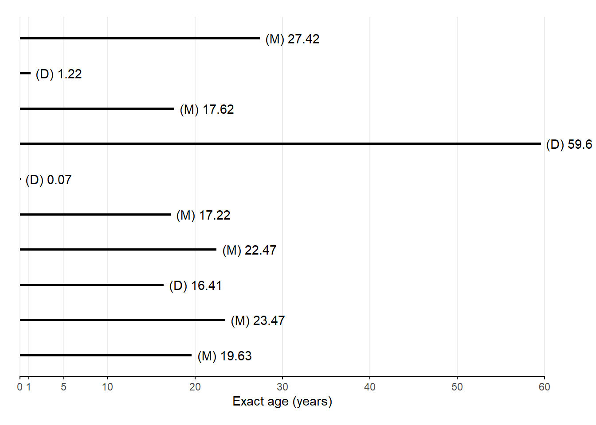

# Multiple decrement processes

:::{.rmdimportant}
**KEY CONCEPT**

A **multiple decrement process** extends a single decrement process to consider multiple modes of exit.

A **multiple decrement life table** is a tabular summary of such a process.
:::

## Multiple decrement tables for a real cohort

To extend a life table to consider multiple decrement causes, just add...

* ${}_{n}d_x^i$: Number of decrements from cause $i$ between ages $x$ and $x+n$
* ${}_{n}q_x^i = {}_{n}d_x^i/l_x$: Probability of leaving the table from cause $i$ between ages $x$ and $x+n$ for someone who reached age $x$
* ${}_{n}m_x^i = {}_{n}d_x^i/{}_{n}L_x$: Rate of decrement from cause $i$ between ages $x$ and $x+n$
* $l_x^i = \sum_{a=x}^\infty {}_{n}d_a^i$: Number of persons reaching age $x$ who will eventually succumb to cause $i$

... to all of the tables already in a single decrement life table
  

Which cause-specific analogues of life table columns are missing above and why? **Tap to see**

* $e_x^i$: expected time until decrement to cause $i$. Those who later succumb to cause $i$ cannot be identified at age $x$ because they might succumb to another cause first
* Thus ${}_{n}L_x^i$, $T_x^i$, and ${}_{n}a_x^i$ excluded for similar reasons

**Question:** So why is $l_i^i$ included if it suffers from similar conceptual issues??

**Answer:**

* To calculate $l_x^i/l_x$, proportion of people aged $x$ who eventually succumb to cause $i$. **Examples:** Probability that marriage ends in divorce. Probability that employee leaves due to layoffs.
* The base of that probability, $l_x$ can be identified b age $x$
* Probabilities with $l_x^i$ as a base can't be identified because who don't know who will eventually succumb due to $i$

  

What must cause-specific decrements sum to? That is, what is $\sum_i {}_{n}d_x^i$?

The total number of all-cause decrements!

$$\sum_i {}_{n}d_x^i = {}_{n}d_x$$

 

So what must cause-specific decrements rates sum to? That is, what is $\sum_i {}_{n}m_x^i$?

The all-cause decrement rate!

$$
\sum_i {}_{n}d_x^i
  = \sum_i \frac{{}_{n}d_x^i}{{}_{n}L_x}
  = \frac{{}_{n}d_x}{{}_{n}L_x}
  = {}_{n}m_x
$$

 

What must cause-specific decrement probabilities sum to? That is, what is $\sum_i {}_{n}q_x^i$?

The all-cause decrement probability!

$$
\sum_i {}_{n}q_x^i
  = \sum_i \frac{{}_{n}d_x^i}{l_x}
  = \frac{{}_{n}d_x}{l_x}
  = {}_{n}q_x
$$

 

So what must $l_x$ sum to?

Recall that $l_x^i = \sum_{a=x}^\infty {}_{n}d_a^i$. So:

$$
\sum_i l_x^i
  = \sum_i \sum_{a=x}^\infty {}_{n}d_x^i
  = \sum_{a=x}^\infty {}_{n}d_a
  = l_x
$$

The sum of people who will eventually succumb to each cause is the sum of all people who will eventually succumb to any cause, which is equal to the number of survivors at age $x$.

 

Let's work through a mutliple decrement lifelines plot, again based on 10 real people born January 1, 1800^[From PHG Figure 4.1].

* M = Married
* D = Died

<table class=" lightable-paper lightable-hover" style='font-family: "Arial Narrow", arial, helvetica, sans-serif; width: auto !important; '>
 <thead>
  <tr>
   <th style="text-align:right;"> $x$ </th>
   <th style="text-align:right;"> $l_x$ </th>
   <th style="text-align:right;"> ${}_{n}d_x^D$ </th>
   <th style="text-align:right;"> ${}_{n}d_x^M$ </th>
   <th style="text-align:right;"> ${}_{n}d_x$ </th>
   <th style="text-align:right;"> ${}_{n}q_x^D$ </th>
   <th style="text-align:right;"> ${}_{n}q_x^M$ </th>
   <th style="text-align:right;"> ${}_{n}q_x$ </th>
   <th style="text-align:right;"> $l_x^D$ </th>
   <th style="text-align:right;"> $l_x^M$ </th>
   <th style="text-align:right;"> ${}_{n}L_x$ </th>
   <th style="text-align:right;"> ${}_{n}m_x^D$ </th>
   <th style="text-align:right;"> ${}_{n}m_x^M$ </th>
   <th style="text-align:right;"> ${}_{n}m_x$ </th>
  </tr>
 </thead>
<tbody>
  <tr>
   <td style="text-align:right;"> 0 </td>
   <td style="text-align:right;border-left:1px solid;"> 10 </td>
   <td style="text-align:right;border-left:1px solid;"> 1 </td>
   <td style="text-align:right;border-left:1px solid;"> 0 </td>
   <td style="text-align:right;border-left:1px solid;"> 1 </td>
   <td style="text-align:right;border-left:1px solid;"> 0.10 </td>
   <td style="text-align:right;border-left:1px solid;"> 0.00 </td>
   <td style="text-align:right;border-left:1px solid;"> 0.10 </td>
   <td style="text-align:right;border-left:1px solid;"> 4 </td>
   <td style="text-align:right;border-left:1px solid;"> 6 </td>
   <td style="text-align:right;border-left:1px solid;"> 9.07 </td>
   <td style="text-align:right;border-left:1px solid;"> 0.11 </td>
   <td style="text-align:right;border-left:1px solid;"> 0.00 </td>
   <td style="text-align:right;border-left:1px solid;"> 0.11 </td>
  </tr>
  <tr>
   <td style="text-align:right;"> 1 </td>
   <td style="text-align:right;border-left:1px solid;"> 9 </td>
   <td style="text-align:right;border-left:1px solid;"> 1 </td>
   <td style="text-align:right;border-left:1px solid;"> 0 </td>
   <td style="text-align:right;border-left:1px solid;"> 1 </td>
   <td style="text-align:right;border-left:1px solid;"> 0.11 </td>
   <td style="text-align:right;border-left:1px solid;"> 0.00 </td>
   <td style="text-align:right;border-left:1px solid;"> 0.11 </td>
   <td style="text-align:right;border-left:1px solid;"> 3 </td>
   <td style="text-align:right;border-left:1px solid;"> 6 </td>
   <td style="text-align:right;border-left:1px solid;"> 32.22 </td>
   <td style="text-align:right;border-left:1px solid;"> 0.03 </td>
   <td style="text-align:right;border-left:1px solid;"> 0.00 </td>
   <td style="text-align:right;border-left:1px solid;"> 0.03 </td>
  </tr>
  <tr>
   <td style="text-align:right;"> 5 </td>
   <td style="text-align:right;border-left:1px solid;"> 8 </td>
   <td style="text-align:right;border-left:1px solid;"> 0 </td>
   <td style="text-align:right;border-left:1px solid;"> 0 </td>
   <td style="text-align:right;border-left:1px solid;"> 0 </td>
   <td style="text-align:right;border-left:1px solid;"> 0.00 </td>
   <td style="text-align:right;border-left:1px solid;"> 0.00 </td>
   <td style="text-align:right;border-left:1px solid;"> 0.00 </td>
   <td style="text-align:right;border-left:1px solid;"> 2 </td>
   <td style="text-align:right;border-left:1px solid;"> 6 </td>
   <td style="text-align:right;border-left:1px solid;"> 40.00 </td>
   <td style="text-align:right;border-left:1px solid;"> 0.00 </td>
   <td style="text-align:right;border-left:1px solid;"> 0.00 </td>
   <td style="text-align:right;border-left:1px solid;"> 0.00 </td>
  </tr>
  <tr>
   <td style="text-align:right;"> 10 </td>
   <td style="text-align:right;border-left:1px solid;"> 8 </td>
   <td style="text-align:right;border-left:1px solid;"> 1 </td>
   <td style="text-align:right;border-left:1px solid;"> 3 </td>
   <td style="text-align:right;border-left:1px solid;"> 4 </td>
   <td style="text-align:right;border-left:1px solid;"> 0.12 </td>
   <td style="text-align:right;border-left:1px solid;"> 0.38 </td>
   <td style="text-align:right;border-left:1px solid;"> 0.50 </td>
   <td style="text-align:right;border-left:1px solid;"> 2 </td>
   <td style="text-align:right;border-left:1px solid;"> 6 </td>
   <td style="text-align:right;border-left:1px solid;"> 70.88 </td>
   <td style="text-align:right;border-left:1px solid;"> 0.01 </td>
   <td style="text-align:right;border-left:1px solid;"> 0.04 </td>
   <td style="text-align:right;border-left:1px solid;"> 0.06 </td>
  </tr>
  <tr>
   <td style="text-align:right;"> 20 </td>
   <td style="text-align:right;border-left:1px solid;"> 4 </td>
   <td style="text-align:right;border-left:1px solid;"> 0 </td>
   <td style="text-align:right;border-left:1px solid;"> 3 </td>
   <td style="text-align:right;border-left:1px solid;"> 3 </td>
   <td style="text-align:right;border-left:1px solid;"> 0.00 </td>
   <td style="text-align:right;border-left:1px solid;"> 0.75 </td>
   <td style="text-align:right;border-left:1px solid;"> 0.75 </td>
   <td style="text-align:right;border-left:1px solid;"> 1 </td>
   <td style="text-align:right;border-left:1px solid;"> 3 </td>
   <td style="text-align:right;border-left:1px solid;"> 23.36 </td>
   <td style="text-align:right;border-left:1px solid;"> 0.00 </td>
   <td style="text-align:right;border-left:1px solid;"> 0.13 </td>
   <td style="text-align:right;border-left:1px solid;"> 0.13 </td>
  </tr>
  <tr>
   <td style="text-align:right;"> 30 </td>
   <td style="text-align:right;border-left:1px solid;"> 1 </td>
   <td style="text-align:right;border-left:1px solid;"> 0 </td>
   <td style="text-align:right;border-left:1px solid;"> 0 </td>
   <td style="text-align:right;border-left:1px solid;"> 0 </td>
   <td style="text-align:right;border-left:1px solid;"> 0.00 </td>
   <td style="text-align:right;border-left:1px solid;"> 0.00 </td>
   <td style="text-align:right;border-left:1px solid;"> 0.00 </td>
   <td style="text-align:right;border-left:1px solid;"> 1 </td>
   <td style="text-align:right;border-left:1px solid;"> 0 </td>
   <td style="text-align:right;border-left:1px solid;"> 10.00 </td>
   <td style="text-align:right;border-left:1px solid;"> 0.00 </td>
   <td style="text-align:right;border-left:1px solid;"> 0.00 </td>
   <td style="text-align:right;border-left:1px solid;"> 0.00 </td>
  </tr>
  <tr>
   <td style="text-align:right;"> 40 </td>
   <td style="text-align:right;border-left:1px solid;"> 1 </td>
   <td style="text-align:right;border-left:1px solid;"> 0 </td>
   <td style="text-align:right;border-left:1px solid;"> 0 </td>
   <td style="text-align:right;border-left:1px solid;"> 0 </td>
   <td style="text-align:right;border-left:1px solid;"> 0.00 </td>
   <td style="text-align:right;border-left:1px solid;"> 0.00 </td>
   <td style="text-align:right;border-left:1px solid;"> 0.00 </td>
   <td style="text-align:right;border-left:1px solid;"> 1 </td>
   <td style="text-align:right;border-left:1px solid;"> 0 </td>
   <td style="text-align:right;border-left:1px solid;"> 10.00 </td>
   <td style="text-align:right;border-left:1px solid;"> 0.00 </td>
   <td style="text-align:right;border-left:1px solid;"> 0.00 </td>
   <td style="text-align:right;border-left:1px solid;"> 0.00 </td>
  </tr>
  <tr>
   <td style="text-align:right;"> 50 </td>
   <td style="text-align:right;border-left:1px solid;"> 1 </td>
   <td style="text-align:right;border-left:1px solid;"> 1 </td>
   <td style="text-align:right;border-left:1px solid;"> 0 </td>
   <td style="text-align:right;border-left:1px solid;"> 1 </td>
   <td style="text-align:right;border-left:1px solid;"> 1.00 </td>
   <td style="text-align:right;border-left:1px solid;"> 0.00 </td>
   <td style="text-align:right;border-left:1px solid;"> 1.00 </td>
   <td style="text-align:right;border-left:1px solid;"> 1 </td>
   <td style="text-align:right;border-left:1px solid;"> 0 </td>
   <td style="text-align:right;border-left:1px solid;"> 9.60 </td>
   <td style="text-align:right;border-left:1px solid;"> 0.10 </td>
   <td style="text-align:right;border-left:1px solid;"> 0.00 </td>
   <td style="text-align:right;border-left:1px solid;"> 0.10 </td>
  </tr>
  <tr>
   <td style="text-align:right;"> 60 </td>
   <td style="text-align:right;border-left:1px solid;"> 0 </td>
   <td style="text-align:right;border-left:1px solid;"> 0 </td>
   <td style="text-align:right;border-left:1px solid;"> 0 </td>
   <td style="text-align:right;border-left:1px solid;"> 0 </td>
   <td style="text-align:right;border-left:1px solid;">  </td>
   <td style="text-align:right;border-left:1px solid;">  </td>
   <td style="text-align:right;border-left:1px solid;">  </td>
   <td style="text-align:right;border-left:1px solid;"> 0 </td>
   <td style="text-align:right;border-left:1px solid;"> 0 </td>
   <td style="text-align:right;border-left:1px solid;">  </td>
   <td style="text-align:right;border-left:1px solid;">  </td>
   <td style="text-align:right;border-left:1px solid;">  </td>
   <td style="text-align:right;border-left:1px solid;">  </td>
  </tr>
</tbody>
</table>

:::{.rmdimportant}
**KEY CONCEPT**

Although $x$ represents age in our multiple decrement process example, it more generally represents entry into current state.

**Example:** A multiple decrement life table representing employee attrition represents decrements since *most recent entry* as an employee.
:::

## Multiple decrement life tables for periods

## Some basic mathematics of multiple decrement processes

:::{.rmdnote}
### Multiple decrement tables assume independent competing risks

#### Courses to take to learn how to relax this assumption

#### Resources for learning about competing risk analysis
:::

## Associated single decrement tables from period data

## Cause-specific decomposition of differences in life expectancies

## Associated single decrement tables from current status data

## Stationary population with multiple sources of decrement
