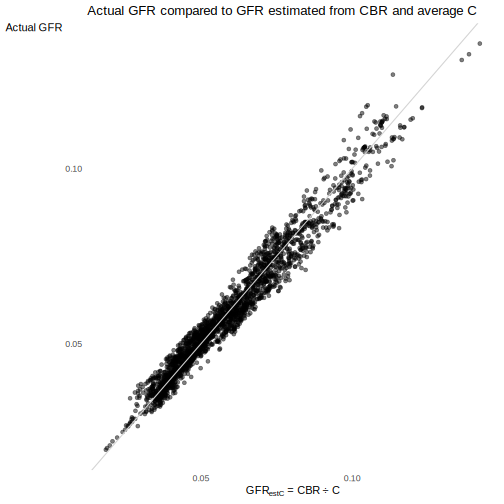
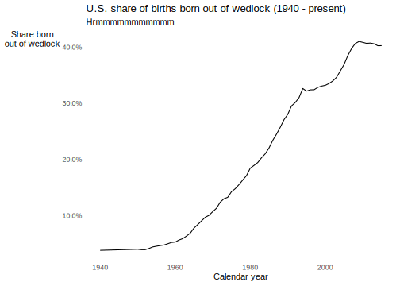
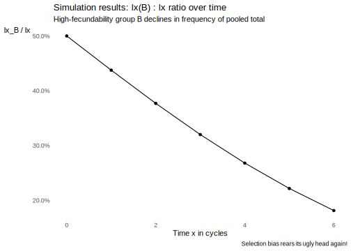

# Fertility and reproduction

:::{.rmdnote}
## Learning objectives {.unnumbered}

* Explain differences between fertility and mortality processes
* Describe how demographers typically resolve the "two-body" problem of fertility process dynamics
* Define important fertility and reproduction definitions... and their inconsistencies across different fields
* Define the reproductive age range and how it features in fertility rates
* Learn the differences and relationships between crude birth rate, general fertility rate, age-specific fertility rates, total fertility rate, maternity rates, and net reproductive rates
* Learn about the proximate determinants of fertility
* Define parity, then explore parity progression ratios and other cohort measures related to fertility
* Explain why you should not summarize parity by asking people about how many kids their parents had
:::


## Fertility vs. mortality {.unnumbered}

So far we've focused on mortality. This week, we cover **fertility**. Some differences between these two processes:


```{=html}
<div id="htmlwidget-cf44dfbfda1c5f1af56a" style="width:100%;height:auto;" class="datatables html-widget"></div>
<script type="application/json" data-for="htmlwidget-cf44dfbfda1c5f1af56a">{"x":{"filter":"none","vertical":false,"data":[["Decrement process","Individuals exit population","Mode of exit is through death","Involves one person","Possible at any age"],["Increment process","Individuals enter population","Mode of entrance is through living individuals producing live births","Involves two people with opposite sex organs","Not possible before puberty or after menopause"]],"container":"<table class=\"display\">\n  <thead>\n    <tr>\n      <th>Mortality<\/th>\n      <th>Fertility<\/th>\n    <\/tr>\n  <\/thead>\n<\/table>","options":{"dom":"t","ordering":false,"columnDefs":[{"width":"50%","targets":"_all"}],"order":[],"autoWidth":false,"orderClasses":false}},"evals":[],"jsHooks":[]}</script>
```

## Solving the two-body problem {.unnumbered}

* Human demographers most often focus on people with female sex organs
* Yet many population models (especially in biology) explicitly consider the interaction of people with opposite sex organs
* Due to the field's history and the limitations of institutional demographic data collection process, human demographers tend to conflate biological sex with gender identity
* Because the data commits this conflation, so do I, if for nothing else to inspire people to fix institutions and data to better match the complexities of sex and gender

## Important fertility and reproduction definitions {.unnumbered}

* **Fertility** - The production of live offspring measured in count of offspring
* **Fecundity** - The biological capacity to reproduce

:::{.rmdcaution}
**Annoying fact** - In biology and ecology, the definitions fertility and fecundity are *completely reversed*! Anyway, more definitions...
:::

* **Fecund** - Capable of conception (as opposed to *infecund* or *infertile*)
* **Fecundability** - The *monthly* or *cycle-specific* probability of conception, given "exposure" to risk of pregnancy
    * Human demographers' definition: Monthly probability of conception
    * Physiologists' definition: Cycle-wise probability of conception (because menstrual cycles don't perfectly coincide with calendar months)
    * Different definitions due to type of observations
* **Sterility** - Biologically unable to reproduce:
    * *Primary* - lifetime sterility
    * *Secondary* - Arising at reproductive ages
* **Parity** - The number of live offspring a women (or couple) has had (so far!)
* **Fetal loss** or **pregnancy loss** - Loss of any product of conception before birth
    * *Embryonic loss* - prior to about 8 weeks
    * *Miscarriage* or *spontaneous abortion* - loss before fetal viability
    * *Stillbirth* - loss after fetal viability but before delivery
    * *Induced abortion*

## Reproductive life history {.unnumbered}

{width=100%}

:::{.rmdtip}
**DEMOGRAPHY & DATA SCIENCE**

## Some weak analogues for fertility and reproduction {.unnumbered}

**People analytics**

* Employee referrals, where current employees refer potential employees for consideration
* Job openings generated from a pre-existing job requisition

**Customer analytics**

* Customer referrals, where existing customers refer a product to a potential customer
:::

## Period fertility rates

### Crude birth rates {.unnumbered}

Recall from week 1:

$$\begin{align}
CBR[0,T] &= \frac{\textsf{Number of births between times } 0 \textsf{ and } T}
                 {\textsf{Person-years lived between times } 0 \textsf{ and } T} \\
         &= \frac{B[0,T]}{PY[0,T]}
\end{align}$$

Below is chart of the distribution of national CBRs through time^[Based on data from the World Back Development Indicators: https://databank.worldbank.org/source/world-development-indicators]
<details>
<summary>What do you notice? **Tap for some answers**</summary>
* Persistently wide variation in national CBR
* CBR distribution decreasing over time
* CBR distribution is also bimodal
* From 2000 through 2019, normal range of CBR from ~10 to ~50
</details>


<details>
<summary>What's wrong with person-years in the CBR denominator? **Tap for answer**</summary>
Includes all population person-years, including from people not at risk of a live birth, such as:

* People without female sex organs
* People with female sex organs who haven't reached "reproductive age"
* People with female sex organs who are beyond "reproductive age"

For some research questions, the person-years of interest might also exclude:

* People with female sex organs who have primary or secondary sterility
</details>
<br>

<details>
<summary>Despite this issue, why is CBR so frequently used? **Tap for answer**</summary>
* Doesn't require person-years to be dis-aggregated by sex or reproductive status
* Important component of the period crude growth rate (CGR)
</details>
<br><br>

### General fertility rates {.unnumbered}

Attempting limit person-years to a more relevant set than the CBR, the **General Fertility Rate** (GFR):

$$\begin{align}
GFR[0,T] = \frac{\textsf{Number of births between times } 0 \textsf{ and } T}
                 {\textsf{Person-years lived in the period } 0 \textsf{ and } T \textsf{ by women aged } \alpha \textsf{ to } \beta}
\end{align}$$

where ages $\alpha$ to $\beta$ form the **reproductive age** range.

Let's interrogate this passage from PHG pg. 93:

> The CBR only loosely approximates an occurrence/exposure fertility rate because only women in their reproductive ages can actually give birth. The length of the reproductive life span varies from one woman to another but, in most settings, the vast majority of births occurs to women aged 15 to 50.


Below are the annual national age-specific fertility rates below age 15 and above age 50 for all years and countries in the Human Fertility Database^[https://www.humanfertility.org]:


<details>
<summary>What percentage of all country-years in the Human Fertility Database had over 99% of their births occur between ages 15 and 50? **Tap for answer**</summary>
* 100% of 2,396 country-years from 37 countries between 1891 and 2020 (not all years represented for all countries)
* The empirical 95% interval of births between 15 and 50 as a percentage of total births lies between -- get this -- 99.718146% and 99.998530%
</details>
<br>

#### Relation between CBR and GFR {.unnumbered}

$$
CBR[0,T] = GFR[0,T] \cdot {}_{\beta - n}C_\alpha^F[0,T]
$$

where ${}_{\beta - n}C_\alpha^F[0,T]$ is the proportion of person-years lived among women in the exact reproductive age range $\alpha$ to $\beta$.

Thus:

$$
GFR[0,T] = CBR[0,T] \cdot \frac{1}{{}_{\beta - n}C_\alpha^F[0,T]}
$$

PHG pg. 94 writes (adopting $\alpha = 15$ and $\beta = 50$):

> ... [${}_{35}C_{15}^F$] [sic] varies relatively litte across populations, even with quite different demographic regimes. Comparing GFRs across populations often provides little additional insight relative to a comparison of CBRs, a measure more readily available.

**Mathematical justification for this statement**: Suppose two populations, $A$ and $B$, have constant ${}_{\beta - n}C_\alpha^F = C$.

* Difference in CBRs: $\Delta_{CBR} = CBR(A) - CBR(B)$
* Difference in GFRs: $\Delta_{GFR} = GFR(A) - GFR(B) = \frac{1}{C} \left(CBR(A) - CBR(B)\right)$
* Thus $\Delta_{CBR} \propto \Delta_{GFR}$
* Preserves the rank ordering of the populations by period birth rate
* If you know typical $C$, just divide $\Delta_{CBR}$ by it to approximate $\Delta_{GFR}$

**Empirical justification**: Let's assess how well the mathematical justification for relying on CBR matches reality.

*Question 1:* Does CBR rank preserve GFR rank?

Below is a table comparing CBR, GFR, and ${}_{35}C_{15}^F$ for 10 country-years randomly selected from the Human Fertility Database^[Data comes from (1) average of start and end population counts from Human Mortality Database (https://www.mortality.org/), and (2) total birth counts from Human Fertility Database (https://www.humanfertility.org/).]. Each country is ranked by both CBR and GFR. This is similar to how PHG answer the question on pg. 94.


```{=html}
<div id="htmlwidget-32cd8877867daa642a8d" style="width:100%;height:auto;" class="datatables html-widget"></div>
<script type="application/json" data-for="htmlwidget-32cd8877867daa642a8d">{"x":{"filter":"none","vertical":false,"data":[["NLD","CZE","ITA","RUS","CZE","AUT","SVK","BLR","TWN","DEUTNP"],[1967,1954,1970,1965,1986,1973,2004,2000,2015,2014],[0.235799093210201,0.244640210382591,0.246213892686659,0.262284447066821,0.239559431016478,0.227847712372022,0.266537358816344,0.264200429215314,0.259233804453182,0.216573824516084],[0.0189442196184987,0.0182639760714418,0.0172060063913213,0.0157149499107731,0.0129440385808137,0.012927362387429,0.00999852158723728,0.00938732214380533,0.00908368696636255,0.00882841913640552],[0.080340510900994,0.0746564763122091,0.0698823539304434,0.0599156758493172,0.054032682102686,0.0567368539839525,0.0375126460006933,0.0355310631844393,0.0350405186758854,0.0407640173328049],[1,2,3,4,5,6,7,8,9,10],[1,2,3,4,6,5,8,9,10,7]],"container":"<table class=\"display\">\n  <thead>\n    <tr>\n      <th>Country<\/th>\n      <th>Year<\/th>\n      <th>% of total person-years lived by women aged 15-49<\/th>\n      <th>CBR<\/th>\n      <th>GFR<\/th>\n      <th>CBR rank<\/th>\n      <th>GFR rank<\/th>\n    <\/tr>\n  <\/thead>\n<\/table>","options":{"dom":"T","ordering":false,"columnDefs":[{"targets":2,"render":"function(data, type, row, meta) {\n    return type !== 'display' ? data : DTWidget.formatRound(data, 2, 3, \",\", \".\");\n  }"},{"targets":3,"render":"function(data, type, row, meta) {\n    return type !== 'display' ? data : DTWidget.formatRound(data, 2, 3, \",\", \".\");\n  }"},{"targets":4,"render":"function(data, type, row, meta) {\n    return type !== 'display' ? data : DTWidget.formatRound(data, 2, 3, \",\", \".\");\n  }"},{"className":"dt-right","targets":[1,2,3,4,5,6]}],"order":[],"autoWidth":false,"orderClasses":false}},"evals":["options.columnDefs.0.render","options.columnDefs.1.render","options.columnDefs.2.render"],"jsHooks":[]}</script>
```

* Seems to work okay?
* But that's just 10 country-years, whereas PHG claim CBR rank is mostly preserved even across populations "with quite different demographic regimes" (PHG pg. 94)
* Rank statistics have low statistical power
* Let's use a bigger sample size of all country-years available
* Let's plot GFR rank against CBR rank and comparing to a line of perfect match
* Let's calculate rank correlation coefficients, too


*Question 2:* Is assuming a constant ${}_{\beta - n}C_{\alpha}$ reasonable?


* Across country-years, the empirical 95% interval of ${}_{35}C_{15}$ across country-years lies between 22% and 28%.^[Again, data comes from (1) average of start and end population counts from Human Mortality Database (https://www.mortality.org/), and (2) total birth counts from Human Fertility Database (https://www.humanfertility.org/).]
* Average ${}_{35}C_{15}$ was 25%
* Below is a plot of GFR estimated as $GFR_{estC} = CBR \div$ 0.25
* Empirical 95% interval of the absolute error lies between 0 and 0.01
* Empirical 95% interval of the ratio of $GFR_{estC}$ to $GFR$ lies between 0.88 and 1.12
* Depending on available data and desired accuracy, constant $C$ assumption could be reasonable... or god-awful



### Age-specific fertility rates {.unnumbered}

We've already encountered the age-specific fertility rate (ASFR) in [week 2](#age-specific-rates-and-probabilities) and our discussion this week about reproductive ages:

$$
{}_{n}F_x[0,T] = \frac{
  \textsf{Births in the period } 0 \textsf{ to } T
  \textsf{ to women aged } x \textsf{ to } x+n
}{
  \textsf{Person-years lived in the period } 0 \textsf{ to } T
  \textsf{ by women aged } x \textsf{ to } x+n
}
$$

### Age-standardized crude birth rates {.unnumbered}

Just as we discussed about crude death rates during [week 2](#age-specific-rates-and-probabilities) about [age-standardization](#age-standardization), we can construct an age-standardized crude birth rate (ASCBR):

$$
ASCBR[0,T] = \sum_{i} F_i \cdot C_i^S
$$

where reproductive age intervals are indexed by $i$ and $C_i^S$ is the proportion of total person-years (often approximated by population count) in age interval $i$ lived by women

### Total fertility rates {.unnumubered}

* Recall from [week 2](#age-specific-rates-and-probabilities) that the choice of standard population $S$ is crucial but arbitrary
* Demographers avoid this problem AND the choice of reproductive age range end-points by:
    * Giving every age interval equal weight
    * Choosing $\alpha$ and $\beta$ as the min. and max. ages at child-rearing in a population
* This equally-weighted measure is called the Total Fertility Rate (TFR)

$$
TFR[0,T] = n \cdot \sum_{x=\alpha}^{\beta - n} {}_{n}F_x[0,T]
$$

:::{.rmdimportant}
**KEY INSIGHTS**

The **total fertility rate** TFR is one of the most (*the* most?) important indicators of fertility because:

* It avoids the thorny issues of age-standardization, and potentially reproductive age range definition, too
* It is interpreted as the average number of children a woman would bear if they survived through the end of reproductive age and experienced at each age a particular set of age-specific fertility rates (ASFRs)
:::

### Comparison of TFR to CBR {.unnumbered}

* CBR and ASCBR both weight ASFR by population structure ${}_{n}C_x$
* Most population structure are weighted toward younger ages
* Therefore younger age groups get more weight
* TFR gives equal weight to all age groups
* Therefore:
    * TFR more responsive than CBR to fertility changes later in reproductive lifespan
    * CBR more responsive than TFR to fertility changes earlier in life
    
### Parity-specific fertility rate {.unnumbered}

Often-times we want to know the fertility rate among women have have a given **parity** (number of live births so far), thus:

$$
F_p[0,T] = \frac{
  \textsf{Births in the period } 0 \textsf{ to } T
  \textsf{ to women at parity } p
}{
  \textsf{Person-years in the period } 0 \textsf{ to } T
  \textsf{ lived by women at parity } p
}
$$

You could make this parity-specific rate age-specific, too, of course.

### Martital fertility rates {.unnumbered}

Because reproduction used to be more closely tied to marriage, demographers have studied the **age-specific marital fertility rate**:

$$
{}_{n}F_x^L[0,T] = \frac{
  \textsf{Births in the period } 0 \textsf{ to } T
  \textsf{ to married women}
}{
  \textsf{Person-years in the period } 0 \textsf{ to } T
  \textsf{ lived by married women}
}
$$

From this comes the martial analogue to the TFR, the **Total Marital Fertility Rate** (TMFR):

$$
TMFR[0,T] = n \cdot \sum_{x=\alpha}^{\beta - n} {}_{n}F_x^L[0,T]
$$

If there are no births out of wedlock (LOL), ${}_{n}F_x = {}_{n}F_x^L \cdot {}_{n}\Phi_x$, where ${}_{n}\Phi_x$ is proportion of women ages $x$ to $x+n$ who are married. Thus (assuming one-year age groups and dropping $[0,T]$ for simplicity):

$$\begin{align}
\frac{TFR}{TMFR}
  &= \frac{
    n \cdot \sum_{x=\alpha}^{\beta} {}_{n}F_x^L \cdot {}_{n}\Phi_x
  }{
    n \cdot \sum_{x=\alpha}^{\beta} {}_{n}F_x^L
  } \\
  &= \sum_{x=\alpha}^\beta \left(
    \frac{{}_{n}F_x^L}{\sum_{x=\alpha}^{\beta} {}_{n}F_x^L}
  \right) \cdot {}_{n}\Phi_x
\end{align}$$

This is a fertility-weighted average of the proportion of women married by age.

Wait a minute... why are we so hung up on marriage again?



<details>
<summary>What are some ways to make these marital fertility rates more modern and more applicable to populations where reproduction is not so closely tied with marriage (including the U.S. for much of its recent history, apparently)? **Tap for answer**</summary>
* Replace "married" with "sexually active with at least one person who has male sex organs"
* Replace "women" with "people with female sex organs"
</details>
<details>
<summary>How would we define these more modern equivalents to ASMFR and TMFR? **Tap for answer**</summary>
* Age-specific sexually-active fertility rate (ASSFR?)
* Total sexually-active fertility rate (TSFR?)
</details>
<details>
<summary>How would interpret the ratio of TFR to this more modern analogue to TMFR? **Tap for answer**</summary>
Fertility-weighted average of the age-specific proportion of people with female sex organs who are sexually active with at least one person with male sex organs
</details>
<details>
<summary>What are some challenges to applying these more modern definitions? **Tap for answer**</summary>
* Easier to measure marital status than sexual activity at scale
* Most vital statistics conflate biological sex and gender identity
</details>
<br>

## Decomposition of period fertility

To better understand fertility patterns, demographers decompose fertility into its **proximate determinants**:

{width=50%}

### Bongaarts proximate fertility determinants framework {.unnumbered}

PHG focuses on Bongaarts' [-@bongaarts1978framework] proximate fertility determinants framework, which works like this:

$$
\require{cancel}
\textsf{Multiply TFR by terms that cancel out but also have useful interpretations:} \\
\begin{align}
TFR
  &= \color{dodgerblue}{\frac{TFR}{\bcancel{TMFR}}}
  \cdot \color{darkorange}{\frac{\bcancel{TMFR}}{\bcancel{TNFR}}}
  \cdot \color{blueviolet}{\frac{\bcancel{TNFR}}{\bcancel{MTFR}}}
  \cdot \color{limegreen}{\bcancel{MTFR}}
  \\
  \hline
  &\textsf{Let's interpret each of those new product terms:} \\
  &= \color{dodgerblue}{
    \frac{TFR}{TMFR}: \begin{cases}
      &\textsf{Fertility-weighted average proportion} \\
      &\textsf{of women who are in a sexual union.}
    \end{cases}
  } \\
  &\times \color{darkorange}{
    \frac{TMFR}{TNFR}: \begin{cases}
      &\textsf{Ratio of total "marital" fertility rate to} \\
      &\textsf{it's expected value among women who use no} \\
      &\textsf{contraception or induced abortion; this is} \\
      &\textsf{called the Total Natural Fertility Rate (TNFR)}
    \end{cases}
  } \\
  &\times \color{blueviolet}{
    \frac{TNFR}{MTFR}: \begin{cases}
      &\textsf{Ratio of TNFR to the Maximal Total Fertility Rate (MTFR),} \\
      &\textsf{i.e. the TNFR achieveable when individuals with mammary} \\
      &\textsf{glands don't reduce their fecundability by nursing infants}
    \end{cases}
  } \\
  &\times \color{limegreen}{MTFR}
  \\
  \hline
  &\textsf{Now let's convert those terms into coefficients we can estimate:} \\
  &= \color{limegreen}{
    MTFR: \begin{cases}
      &\textsf{Maximal Total Fertility Rate...}
    \end{cases}
  } \\
  &\times \color{dodgerblue}{C_m}
  \cdot \color{darkorange}{\left(C_c \cdot C_a\right)}
  \cdot \color{blueviolet}{C_i}: \begin{cases}
    &\textsf{... gets multiplied by coefficients between 0 and 1} \\
    &\textsf{that discount it down to the observed TFR}
  \end{cases}
  \\
  \hline
  &\textsf{Lastly, let's interpret those coefficients and estimate them:} \\
  &= \color{limegreen}{MTFR} \\
  &\times \color{dodgerblue}{
    C_m: \begin{cases}
      &\underline{\textbf{Coefficient of non-union}} \\
      &\textsf{Estimated as TFR/TMFR}
    \end{cases}
  } \\
  &\times \color{darkorange}{
    C_c: \begin{cases}
      &\underline{\textbf{Coefficient of contraception}} \\
      &\textsf{Empirically estimated as } 1 - 1.08 \cdot u \cdot e \\
      &\textsf{where } u \textsf{ is proportion of women using contraception} \\
      &\textsf{and } e \textsf{ is average use-effectiveness of contraception} \\
      &\textsf{and 1.08 upweights } u \cdot e \textsf{ to account for sterile couples} \\
      &\textsf{not using contraception because they know they're not at risk}
    \end{cases}
  } \\
  &\times \color{darkorange}{
    C_a: \begin{cases}
      &\underline{\textbf{Coefficient of abortion}} \\
      &\textsf{Estimated as } \frac{TFR}{
        TFR + 0.4 \times (1+u) \times TA
      } \\
      & \textsf{where:} \\
      & \begin{align}
        &\unicode{x2022} \textsf{ } TA \textsf{
          is the total abortion rate construction similarly to TFR
        } \\
        &\unicode{x2022} \textsf{ } 0.4 \times (1+u) \textsf{
          reflects the number of births averted by one abortion
        }
      \end{align} \\
      &\textsf{The figure 0.4 assumes that an abortion use up} \\
      &\textsf{40% of the reproductive life than a birth does}
    \end{cases}
  } \\
  &\times \color{blueviolet}{
    C_i: \begin{cases}
      &\underline{\textbf{Coefficient of post-partum infecundity}} \\
      &\textsf{Estimated as } \frac{20}{18.5 + i} \\
      &\textsf{ where } i \textsf{ is length of post-partum infecundity.} \\
      &\textsf{If } i = 1.5 \textsf{, three's no reduction to MTFR.} \\
      &\textsf{If } i \textsf{ can't be measured, it's estimated as:} \\
      &i = 1.753 \cdot e^{0.1396 \cdot BF - 0.001872 \cdot BF^2} \\
      &\textsf{where } BF \textsf{ is the average months of breastfeeding}
    \end{cases}
  }
  \\
  \hline
  &\textsf{And putting it all together with substitutions:} \\
  &= \color{limegreen}{MTFR} \\
  &\times \color{dodgerblue}{\frac{TFR}{TMFR}} \\
  &\times \color{darkorange}{
    \left(1 - 1.08 \cdot u \cdot e\right)
    \cdot \frac{TFR}{ TFR + 0.4 \times (1+u) \times TA}
  } \\
  &\times \color{blueviolet}{
    \frac{20}{
      18.5 + 1.753 \cdot e^{0.1396 \cdot BF - 0.001872 \cdot BF^2}
    }
  }
\end{align}
$$

Bongaarts assumed that MTFR was 15.3 based on some back-of-the-envelope assumptions about inter-birth intervals.

<details>
<summary>How could you estimate $e$, the use-effectiveness of contraception? **Hint:** You could use a method we learned last week! **Tap for answer**</summary>
* A cause-deleted life table where the focal risk is contraceptive failure and the competing risk is discontinuation of contraception.
* See PHG box 5.3 pg. 102 for a hypothetical example.
* See below for typical 12-month contraceptive failure probabilities.

![From Polis et. al^[https://www.guttmacher.org/report/contraceptive-failure-rates-in-developing-world]](https://www.guttmacher.org/sites/default/files/images/confailuresreportfigure15.png){width=75%}

:::{.rmdcaution}
Careful here: Polis et. al [-@polis2016typical] use the term *contraceptive failure rate* describe the **probability** of failure within 12 months. By "rate" they mean "per 100 episodes" of a given length (in this case 12 months)
:::
</details>
<br>

### Updates to Bongaarts' framework and alternative frameworks

* Bongaarts proximate determinants framework above was recently updated by Bongaarts [-@bongaarts2015modeling]
* Wood [-@wood1990fertility] offers a bioanthropological perspective

## Cohort fertility

<details>
<summary>For 1-year age groups, what do a cohort's age-specific fertility rates over their entire reproductive lifespan sum up to? **Tap for answer**</summary>
Cohort TFR! Also known as:

* Cohort fertility rate
* Mean completed family size
</details>
<br>

<details>
<summary>What can cause a cohort TFR to differ from a period TFR? **Tap for answer**</summary>
* Changes in period fertility rates over time
* Changes in the age pattern of fertility over time

PHG pg. 103 Table 5.3 shows an example where period TFR changes but cohort TFR remains the same due to changes in a cohort's timing of births.
</details>

### Parity progression ratios {.unnumbered}

Aside from tracking cohort fertility across age, you can track how cohort fertility progresses from one child to the next with **parity progression ratios** (PPRs):

$$
PPR_{\left(i, i+1\right)} = \frac{
  \textsf{Number of women at parity } i + 1 \textsf{ or more}
}{
  \textsf{Number of women at parity } i \textsf{ or more}
} = \frac{P_{i+1}}{P_i} = \frac{
  \sum_{a = i+1}^{max(\textsf{parity})}  W_a
}{
  \sum_{a = i}^{max(\textsf{parity})}  W_a
}
$$

* $W_i$ is the number of women in the cohort with completed parity $i$
* A PPR is interpreted as the proportion in a cohort with $i$ children who go on to have $i+1$ children
* The "or more" comes from the fact that cohort PPR is calculated using parity-specific counts from a cohort that has completed their reproductive lifespan

### PPR patterns in "natural" vs. "controlled" fertility populations {.unnumbered}

* In contraceptive-using populations, PPR dips sharply then flattens due to decision-making around desired family size
* In natural fertility populations, PPR dips more gradually since completed family size decision-making doesn't factor into fertility as much

![From Wood [-@wood1994maternal]](images/ppr-norway-us.png){width=75%}

### TFR as a function of PPRs {.unnumbered}

It turns out that for cohort TFR denoted $TFR^C$:

$$\begin{align}
TFR^C
  &= PPR_{(0,1)} \textsf{ (Completed fertility if have 1 kid)}\\
  &+ PPR_{(0,1)} \cdot PPR_{(1,2)} \textsf{ (Added fertility if I had 1 kid and then go on to have 2 kids)} \\
  &+ PPR_{(1,2)} \cdot PPR_{(2,3)} \textsf{ (Added fertility if I had 2 kids and go on to have 3 kids)} \\
  &+ ... \textsf{ (And so on until maximal parity in the cohort)}
\end{align}$$

This is important because sometimes all you have to calculate $TFR^C$ is responses to a survey of completed fertility summarized as counts by parity, as opposed to the individual-level responses

### Parity from the child's vs. the mother's perspective {.unnumbered}

Consider two methods of estimating parity:

1. Survey people with female sex organs about their number of live births. Denote average parity measured from their perspective as $\overline{P}$.
2. Survey people about the number of live births that came from the same womb they did. Denote the average parity measured from the child's perspective as $\overline{C}$.

It turns out that:

$$
\overline{C} = \overline{P} + \frac{\sigma^2}{\overline{P}}
$$

where $\sigma^2$ is the variance in parity among individual people with female sex organs.

<details>
<summary>What does this equation tell us about the consequences of measuring parity from a survey of children about their parent's parity? **Tap for answer**</summary>
* If there is any parity variation, $\overline{C} > \overline{P}$ and $\overline{C}$ over-estimates parity
* The greater the variation in parity, the greater the bias
</details>
<br>

<details>
<summary>What might this equation tell us about how our communication with other people influences our *perception* of average fertility in a previous generation? **Tap for answer**</summary>
Suppose that when you talk about the previous generation's fertility, you listen to that generation about how many kids they had $a \times 100$ percent of the time, and to people in your generation about how many kids their parents had $b \times 100 = (1-a) \times 100$ percent of the time.

Your perception of the average parity in the previous generation is:

$$
(1-b) \cdot \overline{P}
+ b \cdot \left(\overline{P} + \frac{\sigma^2}{\overline{P}}\right)
= \overline{P} + b \cdot \frac{\sigma^2}{\overline{P}}
$$

The more attention $b$ you pay to your own generation, the more upwardly biased your perception of the parity in your parent's generation.
</details>
<br>

:::{.rmdtip}
**DEMOGRAPHY & DATA SCIENCE**

#### Biased egocentric network estimates from surveying people about friends {.unnumbered}

* If you end up working at a social media company, don't ever estimate the number of people's followers from the number of followers their followers have!
* Don't look at the friend counts of your friends' friends, because it will downwardly bias your perception of your own social network size
* Don't build products that let people to do that; oops, too late!

#### Biased team size estimates from survey people about their boss {.unnumbered}

* If you survey your coworkers about how big their manager's team size is, your estimate of average team size will be upwardly biased unless all teams have the same size
* Your coworker's team size is a metric specific to *their* experience within a team of that size, *not* of team sizes writ large
:::

## Birth interval analysis

{width=100%}

:::{.rmdcaution}
* PHG use the word "month" a lot, e.g., "monthly probability or conception." Ugh.
* Let's use the word "cycle" instead, as in "menstrual cycle", since cycles don't perfectly coincide with calendar months (obviously)
:::

### Birth interval analysis with homogeneous fecundability {.unnumbered}

Let's start with a simple model of birth intervals where every couple is the same and (definitely contrary to fact) every couple is heterosexual.

Let $p$ be the homogeneous, time-invariant per-cycle fecundability (chance of conception during a single cycle).

<details>
<summary>What is one method to estimate fecundability that we've studied already? **Hint:** We studied it during week 3! **Tap for answer**</summary>
Single decrement table where the event of interest is conception and time is measured in cycles (or months, if you can't measure cycles directly)
</details>
<br>

<details>
<summary>What is the chance of waiting exactly two cycles until conception? **Hint:** Think of it like a weighted coin toss and use the basic rules of probability. **Tap for answer**</summary>
$(1-p) \cdot p$: Failed on the first cycle, conceived in the second cycle
</details>
<br>

<details>
<summary>Exactly three cycles? **Tap for answer**</summary>
$(1-p)^2 \cdot p$: Failed on the first two cycles, conceived in the third
</details>
<br>

<details>
<summary>Exactly $t$ cycles? **Tap for answer**</summary>
$(1-p)^{t-1} \cdot p$: Failed on the first $t-1$ cycles, conceived in the $t$^th^

This is a geometric distribution.
</details>
<br>

<details>
<summary>What is the expected waiting time to conception? To birth? **Tap for answer**</summary>
* $1/p$ cycles to conception (the mean of the geometric distribution)
* $1/p \textsf{ cycles} + 9 \textsf{ months}$ to birth
</details>
<br>

<details>
<summary>Suppose there is a period of $s_b$ cycles of post-partum non-susceptibility to the risk of conception. What is the expected waiting time to next birth after latest birth? **Tap for answer**</summary>

$\left(1/p + s_b\ \textsf{ cycles}\right) + 9 \textsf{ months}$

</details>
<br>

Moving our time units to months for notational simplicity, the TMFR divides the time left after a first birth by the average birth interval, then adds the first birth. Thus the TFR is:

$$
TFR = 1 + \frac{
  \beta - \alpha - \left(\frac{1}{p} + 9\right)
}{
  \frac{1}{p} + 9 + s_b
} = \frac{\beta - \alpha + s_b}{\frac{1}{p} + 9 + s_b}
= \frac{\beta - \alpha + s_b}{I_b}
$$

Above, $\beta$ and $\alpha$ are measured in months, not years.

Suppose (contrary to fact) that $\alpha_m$ the expected time until a person with female sex organs first initiates sexual activity with persons who have male sex organs. Then:

$$
TFR = \frac{\beta - \alpha_m + s_b}{I_b}
$$
Notice that this changes our interpretation of $p$, which before defining $a_m$ included the effects of waiting time to sexual activity.

Extending our model to include fetal loss:

* $s_w < s_b$ is the non-susceptible period after a pregnancy that leads to fetal loss
* $w$ is the probability that a conception leads to fetal loss
* So with probability $w$, an inter-birth interval is $(1/p) + s_w$
* With probability $w^{n}$, $n$ successive pregnancies end in fetal loss, increasing the birth interval by that same amount

Adding these birth interval increments to $I_b$ in the TMFR and TFR denominators and closing the sum:

$$
I_b = \frac{1}{p \cdot (1-w)} + 9 + s_b + \frac{s_w \cdot w}{1-w}
$$

Plug in the values $p = 0.2$, $w = 0.2$, $s_b = 7.5$, $s_w = 5$, $\beta = 45 \cdot 12$ and $\alpha_m = 15 \cdot 12$ into the TFR formula. You will get Bongaarts' $MTFR \approx 15.3$.

Now add contraceptive efficiency $e$. As a proportionate reduction to fecundity, it replaces $p$ in the equations above with $p \cdot (1-e)$. Not that this again would change the interpretation of the parameter $p$.

Now suppose contraceptive efficiency is $e = 0.9$ and $\alpha_m = 25 \cdot 12$. All else equal, TFR drops to 3.08.

### Heterogeneous fecundability {.unnumbered}

Suppose a population as two equal-sized groups $A$ and $B$ with different fecundity levels $p_A$ and $p_B$. This poses at least one problem:

* If you pool these groups together and estimate pooled fecundity $p$, it will falsely decline the more cycles you observe as the higher-fecundability group conceives and drops out
* This is an example of **selection bias**

Below is a simulation taking after PHG pg. 107 table 5.4 showing this phenomenon.


```r
pA <- 0.1 # Group A fecundability
pB <- 0.3 # Group B fecundability
l0 <- 1000 # Group-wise radix
x <- 0:6 # Durations in cycles
dx_A <- c() # Initialize group-wise dx columns of decrement table
dx_B <- c()
lx_A <- l0 # Initialize group-wise lx columns of decrement table
lx_B <- l0
for (i in (x + 1)) { # Run the simulation
  dA <- lx_A[i] * pA
  dB <- lx_B[i] * pB
  dx_A <- c(dx_A, dA)
  dx_B <- c(dx_B, dB)
  if (i <= 6) {
    lA <- lx_A[i] - dA
    lx_A <- c(lx_A, lA)
    lB <- lx_B[i] - dB
    lx_B <- c(lx_B, lB)
  }
}
# Put the results in a table
simulation <-
  tibble::tibble(x = x, lx_A = lx_A, dx_A = dx_A, lx_B = lx_B, dx_B = dx_B) %>%
  dplyr::mutate(lx = lx_A + lx_B, dx = dx_A + dx_B, px = dx / lx)
simulation %>%
  DT::datatable(
    rownames = FALSE,
    colnames = c(
      "Cycles",
      "lx(A)", "dx(A)",
      "lx(B)", "dx(B)",
      "lx", "dx", "px"
    ),
    options = list(dom = "t", ordering = FALSE, autoWidth = TRUE),
    caption = htmltools::tags$caption(
      style =
        'caption-side: top; text-align: center; color:black; font-size:120% ;',
      'Results of simulated heterogeneous fecundability selection bias'
    )
  ) %>%
  DT::formatStyle(1:8, fontSize = 8) %>%
  DT::formatRound(2:7, digits = 0) %>%
  DT::formatPercentage(8, digits = 0)
```

```{=html}
<div id="htmlwidget-ddcf2d11d9a5b86de7db" style="width:100%;height:auto;" class="datatables html-widget"></div>
<script type="application/json" data-for="htmlwidget-ddcf2d11d9a5b86de7db">{"x":{"filter":"none","vertical":false,"caption":"<caption style=\"caption-side: top; text-align: center; color:black; font-size:120% ;\">Results of simulated heterogeneous fecundability selection bias<\/caption>","data":[[0,1,2,3,4,5,6],[1000,900,810,729,656.1,590.49,531.441],[100,90,81,72.9,65.61,59.049,53.1441],[1000,700,490,343,240.1,168.07,117.649],[300,210,147,102.9,72.03,50.421,35.2947],[2000,1600,1300,1072,896.2,758.56,649.09],[400,300,228,175.8,137.64,109.47,88.4388],[0.2,0.1875,0.175384615384615,0.163992537313433,0.153581789779067,0.144312908669057,0.136250442927791]],"container":"<table class=\"display\">\n  <thead>\n    <tr>\n      <th>Cycles<\/th>\n      <th>lx(A)<\/th>\n      <th>dx(A)<\/th>\n      <th>lx(B)<\/th>\n      <th>dx(B)<\/th>\n      <th>lx<\/th>\n      <th>dx<\/th>\n      <th>px<\/th>\n    <\/tr>\n  <\/thead>\n<\/table>","options":{"dom":"t","ordering":false,"autoWidth":true,"columnDefs":[{"targets":7,"render":"function(data, type, row, meta) {\n    return type !== 'display' ? data : DTWidget.formatPercentage(data, 0, 3, \",\", \".\");\n  }"},{"targets":1,"render":"function(data, type, row, meta) {\n    return type !== 'display' ? data : DTWidget.formatRound(data, 0, 3, \",\", \".\");\n  }"},{"targets":2,"render":"function(data, type, row, meta) {\n    return type !== 'display' ? data : DTWidget.formatRound(data, 0, 3, \",\", \".\");\n  }"},{"targets":3,"render":"function(data, type, row, meta) {\n    return type !== 'display' ? data : DTWidget.formatRound(data, 0, 3, \",\", \".\");\n  }"},{"targets":4,"render":"function(data, type, row, meta) {\n    return type !== 'display' ? data : DTWidget.formatRound(data, 0, 3, \",\", \".\");\n  }"},{"targets":5,"render":"function(data, type, row, meta) {\n    return type !== 'display' ? data : DTWidget.formatRound(data, 0, 3, \",\", \".\");\n  }"},{"targets":6,"render":"function(data, type, row, meta) {\n    return type !== 'display' ? data : DTWidget.formatRound(data, 0, 3, \",\", \".\");\n  }"},{"className":"dt-right","targets":[0,1,2,3,4,5,6,7]}],"order":[],"orderClasses":false,"rowCallback":"function(row, data, displayNum, displayIndex, dataIndex) {\nvar value=data[0]; $(this.api().cell(row, 0).node()).css({'font-size':'8'});\nvar value=data[1]; $(this.api().cell(row, 1).node()).css({'font-size':'8'});\nvar value=data[2]; $(this.api().cell(row, 2).node()).css({'font-size':'8'});\nvar value=data[3]; $(this.api().cell(row, 3).node()).css({'font-size':'8'});\nvar value=data[4]; $(this.api().cell(row, 4).node()).css({'font-size':'8'});\nvar value=data[5]; $(this.api().cell(row, 5).node()).css({'font-size':'8'});\nvar value=data[6]; $(this.api().cell(row, 6).node()).css({'font-size':'8'});\nvar value=data[7]; $(this.api().cell(row, 7).node()).css({'font-size':'8'});\n}"}},"evals":["options.columnDefs.0.render","options.columnDefs.1.render","options.columnDefs.2.render","options.columnDefs.3.render","options.columnDefs.4.render","options.columnDefs.5.render","options.columnDefs.6.render","options.rowCallback"],"jsHooks":[]}</script>
```



<details>
<summary>What determines the value of `px` in the simulation above (i.e., how would you calculated it from `lx_B`, `lx_A`, `PA`, and `pB`)?</summary>
`px` (i.e. ${}_np_x$) is a weighted sum of `pA` (i.e. $p(A)$) and `pB` ($p(B)$):

$$
\begin{align}
{}_np_x &= p(A) \cdot \frac{l_x(A)}{l_x} + p(B) \cdot \frac{l_x(B)}{l_x} \\
        &= p(A) \cdot \frac{l_x(A)}{l_x}
           + p(B) \cdot \left(1 - \frac{l_x(A)}{l_x}\right)
\end{align}
$$

This weighted sum is just an average.

A similar result would hold if there were more than two groups. In general:

$${}_np_x = \sum_i p(i) \cdot \frac{l_x(i)}{l_x}$$
</details>

## Reproduction measures

:::{.rmdcaution}
* **Reproduction** in demography is a process whereby new members of a population replace outgoing members.
* This can occur through fertility, but also through other processes, such as immigration
* As a biological anthropologist, I find this definition of reproduction absolutely maddening and prefer to just use the word "replace" in that context, but whatever
:::

The age-specific rate of having a female birth gets closer to this demographic notion of "reproduction" (aka replacement):

$$
{}_{n}F_x^F[0,T] = \frac{
  \textsf{Female births in the period } 0 \textsf{ to } T \textsf{ to women aged } x \text{ to } x+n
}{
  \textsf{Person-years lived in the period } 0 \textsf{ to } T \textsf{ by women aged } x \text{ to } x+n
}
$$

This is also known as the age-specific **maternity rate**

The maternity analogue to the TFR is the Gross Reproduction Rate (GRR):

$$
GRR[0,T] = n \cdot \sum_{x=\alpha}^{\beta - n} {}_{n}F_x^F[0,T]
$$

<details>
<summary>How to interpret the GRR? **Hint:** Remember the interpretation of the TFR! **Tap for answer**</summary>
The average number of female births a woman would have if she lived through the end of her reproductive span
</details>
<br>

A measure of reproduction that takes mortality into account is the Net Reproduction Rate (NRR) defined as:

$$
NRR[0,T] = \sum_{x=\alpha}^{\beta - n} {}_{n}F_x^F[0,T] \frac{
  {}_{n}L_x^F
}{
  l_0^F
}
$$

* Above, we weight age-specific maternity rates by the average person-years women live in that age group: ${}_{n}L_x^F/l_0^F$
* PHG pg. 113 uses $l_0$, but I am almost certain it needs an $F$ subscript to ensure the average is taken out of the *female* birth cohort, not the *total* cohort
* If all women survive to age $\beta$, then ${}_nL_x^F / l_0^F = n$ and $GRR = NRR$
<details>
<summary>How to interpret the NRR? **Tap for answer**</summary>
The expected number of female births of a woman who experiences a set of both age-specific maternity and age- and sex-specific mortality rates.
</details>
<br>

### Relating TFR to NRR and estimating replacement fertility {.unnumbered}

:::{.rmdimportant}
**KEY CONCEPT**

The **maternity function** $m(a)$ is the continuous analogue of a discrete age-specific maternity rate.

It is also a sex-specific *incremental* analogue of the *decremental* **force of mortality** $\mu(a)$

The **mean age of the maternity function** (called $A_m$) is the age at the center of mass of the maternity function

To estimate $A_m$:

$$
A_m
  = \frac{\int_\alpha^\beta m(a) \cdot ada}{\int_\alpha^\beta m(a)da}
  \approx \frac{
    \sum_{x=\alpha}^{\beta-n} {}_{n}F_x^F \left(x + \frac{n}{2}\right)
  }{
    \sum_{x=\alpha}^{\beta-n} {}_{n}F_x^F
  }
$$

<details>
<summary>Using what method we've already learned could we then estimate $p(A_m)$ (or at least the age interval that encompasses it?)</summary>
Period life table!
</details>
:::

#### Relating TFR (and GRR) to NRR {.unnumbered}

PHG pgs. 114-115 derive an approximate relationship between GRR and NRR:

$$
NRR \approx p(A_m) \times GRR \rightarrow GRR \approx \frac{1}{p(A_m)} \times NRR
$$


where $p(A_m)$ = probability of surviving to $A_m$

Intuition: GRR weights NRR upward by ignoring the force of mortality

Relation is exact when survivorship is linear in the age interval (good approximation in practice)

Note also that:

$$
TFR = (1 + SRB) \times GRR
$$
where $SRB$ = Sex Ratio at Birth

Intuition: Add to GRR the births of individuals with male reproductive organs

Putting it all together:

$$
TFR = (1 + SRB) \cdot GRR \approx \frac{1+SRB}{p\left(A_m\right)} \cdot NRR
$$

#### Replacement fertility {.unnumbered}

If $NRR = 1$, female population exactly replaces itself. So replacement-level TFR is:

$$
TFR|_{NRR = 1} = \frac{1+SRB}{p\left(A_m\right)} \cdot 1 = \frac{1+SRB}{p\left(A_m\right)}
$$

If you know $SRB$ and $p(A_m)$, you can estimate replacement-level TFR

<details>
<summary>For human population, replacement TFR is around 2.1. For simplicity, assume $SRB = 1.05$^[SRB from estimate cited here: https://ourworldindata.org/gender-ratio]. What is $p(A_M)$? **Hint:** Use algebra! **Tap for answer**</summary>
$$
TFR = 2.1 \approx \frac{1+1.05}{p\left(A_m\right)} = \frac{2.05}{p\left(A_m\right)}
\rightarrow p\left(A_m\right) = 2.05/2.1 \approx 97.6\%
$$
</details>
