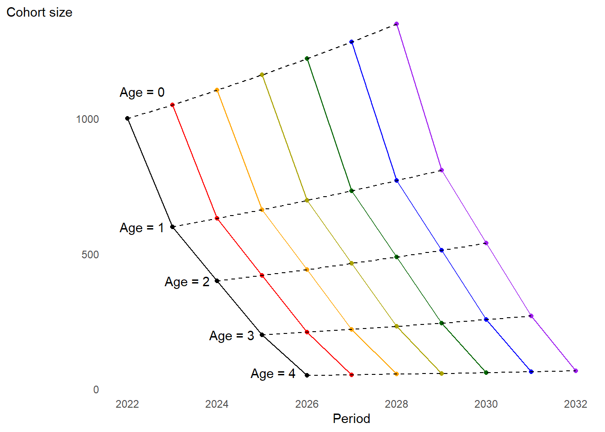
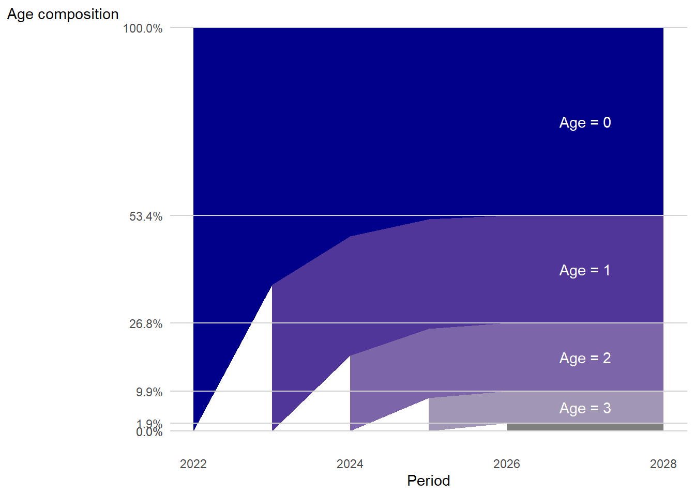
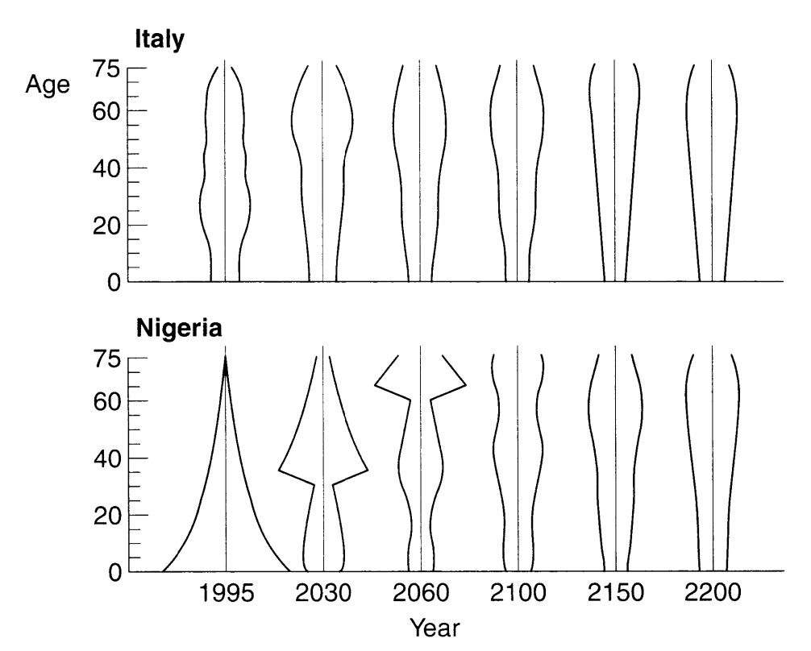
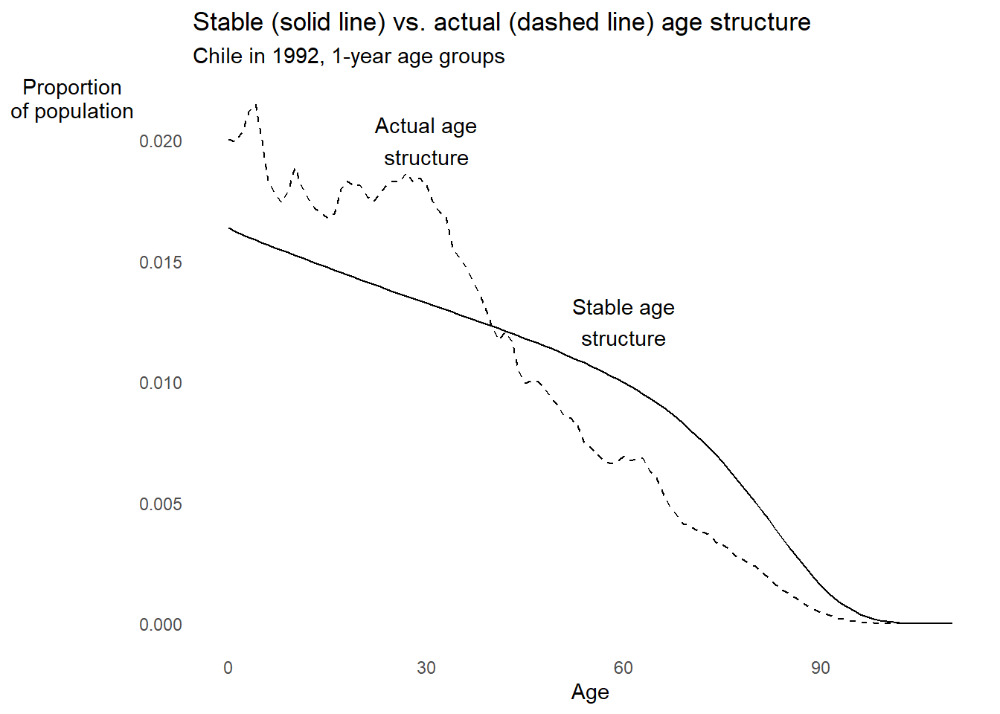
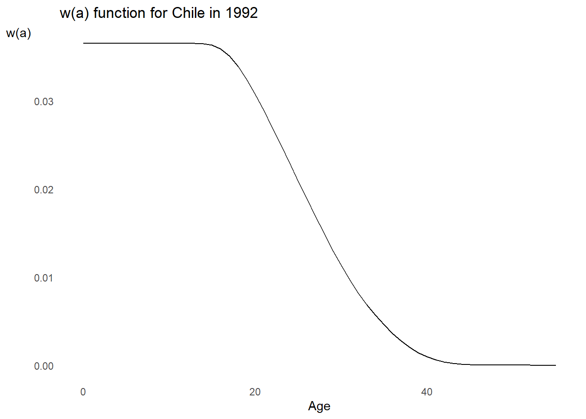
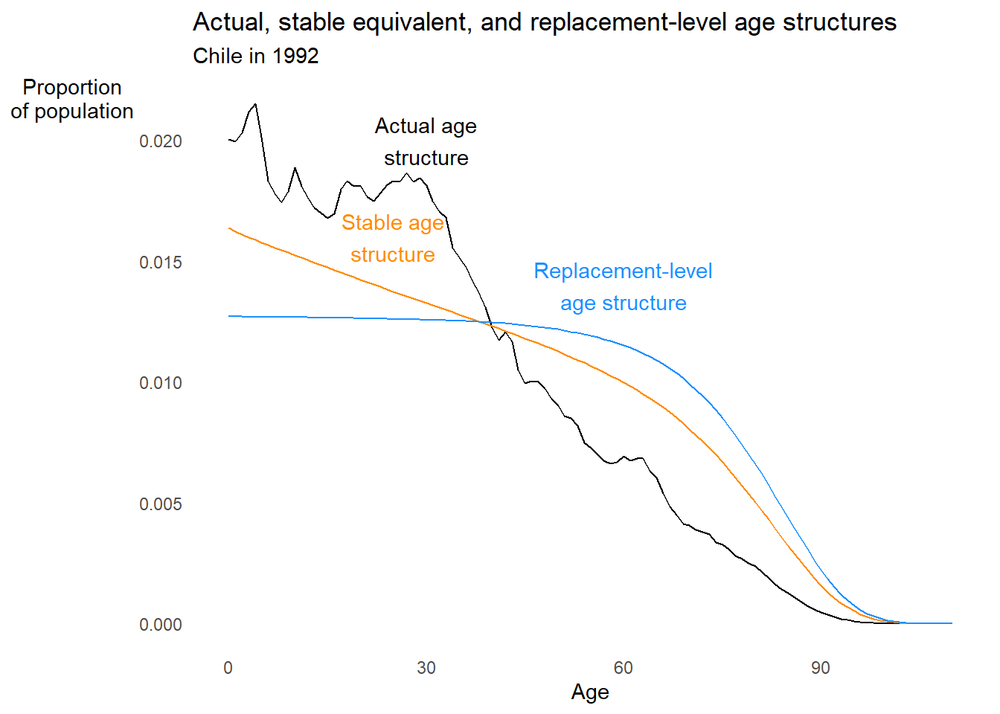

# Stable population model


:::{.rmdnote}
**LEARNING OBJECTIVES**

* Define a **stable population**
* Informally show conditions for a stable population to emerge
* Show the general conditions for a stable population to emerge
* Learn about why stable populations exhibit **ergodicity** and what ergodicity means
* Learn about the **stable equivalent population** as a means to compare to actual population structure
* Learn how the **generation length** relates intrinsic growth and net reproduction rates in a stable population 
* Use **comparative statics** to understand how changes in fertility and mortality affect the stable equivalent population structure
* Learn the concept of **population momentum** and its implications for policy
:::

## First, some review! {.unnumbered}

<details>
<summary>What are the characteristics of a **stationary population**? **Tap for answer**</summary>

1. Constant births per time period
1. Age-specific mortality rates constant over time
1. Net zero migration at all ages

</details>

<details>
<summary>What are the key consequences of these characteristics? **Tap for answer**</summary>

1. Constant age-specific population sizes
1. Thus constant age structure
1. And constant population size

</details>

<details>
<summary>What are some ways we can relax the stationary population model assumptions? **Tap for answer**</summary>

1. Births growing or shrinking at a constant rate (This week)
1. Fertility rate varies by age (Also this week)
1. Positive or negative net migration (Also this week, kinda)
1. Age-specific vital rates change over time (Chapter 8, not covered this qtr.)

</details>

<br><br><br><br>

:::{.rmdimportant}
**KEY CONCEPT**

A **stable population** is one in which:

* The population structure (e.g. the proportion of the population in each age group) is stable over time
* The growth rate is stable over time because crude birth, death, and net migration rates are stable over time

Stable populations interest demographers for two sets of reasons:

1. **Over most of human history**, human populations had fairly stable age structures and growth rates
1. **Presently**, stable population dynamics are a useful comparison to non-stable populations, and the 2nd stop on the path to more general models
:::

<br><br><br><br>

## A simplified example of a stable population


* Suppose an organism that uniformly dies before age $a = 5$ (i.e. $p(5) = 0$)
* Let $r$ be the constant annualized rate of growth in births
* Let time $t$ be measured in exact years since some arbitrary baseline date
* Let births $B(t)$ at time $t$ take place on the first of the year
* Let $p(a) = {}_ap_0$ be constant over time
* So $B(t) = B(t - 1) \cdot e^{rt}$
    * Equivalently, at baseline time $t = 0$, $B(t) = B(0) \cdot e^{rt}$
    * Also equivalently, at baseline time $t$: $B(t+1) = B(t) \cdot e^{rt}$
* Initialize births on 1 January 2022 at $B(2022) = 1,000$
<br><br><br><br>

**Abbreviated cohort life table for our simulated stable population:**

<table class=" lightable-classic" style='font-family: "Arial Narrow", "Source Sans Pro", sans-serif; width: auto !important; margin-left: auto; margin-right: auto;'>
 <thead>
  <tr>
   <th style="text-align:right;"> Exact age $a$ </th>
   <th style="text-align:right;"> $l_a/l_0 = p(a)$ </th>
  </tr>
 </thead>
<tbody>
  <tr>
   <td style="text-align:right;"> 0 </td>
   <td style="text-align:right;"> 1.00 </td>
  </tr>
  <tr>
   <td style="text-align:right;"> 1 </td>
   <td style="text-align:right;"> 0.60 </td>
  </tr>
  <tr>
   <td style="text-align:right;"> 2 </td>
   <td style="text-align:right;"> 0.40 </td>
  </tr>
  <tr>
   <td style="text-align:right;"> 3 </td>
   <td style="text-align:right;"> 0.20 </td>
  </tr>
  <tr>
   <td style="text-align:right;"> 4 </td>
   <td style="text-align:right;"> 0.05 </td>
  </tr>
  <tr>
   <td style="text-align:right;"> 5 </td>
   <td style="text-align:right;"> 0.00 </td>
  </tr>
</tbody>
</table>

<br><br><br><br>

**Tabulated cohort size by exact age over time. Each color represents a cohort.**

<table class=" lightable-classic" style='font-family: "Arial Narrow", "Source Sans Pro", sans-serif; width: auto !important; margin-left: auto; margin-right: auto;'>
 <thead>
  <tr>
   <th style="text-align:right;"> Age </th>
   <th style="text-align:right;"> 2022-01-01 </th>
   <th style="text-align:right;"> 2023-01-01 </th>
   <th style="text-align:right;"> 2024-01-01 </th>
   <th style="text-align:right;"> 2025-01-01 </th>
   <th style="text-align:right;"> 2026-01-01 </th>
   <th style="text-align:right;"> 2027-01-01 </th>
   <th style="text-align:right;"> 2028-01-01 </th>
  </tr>
 </thead>
<tbody>
  <tr>
   <td style="text-align:right;"> 0 </td>
   <td style="text-align:right;"> $1000$ </td>
   <td style="text-align:right;"> $\color{red}{1000 \cdot e^r{\text{ }}}$ </td>
   <td style="text-align:right;"> $\color{orange}{1000 \cdot e^{2r}}$ </td>
   <td style="text-align:right;"> $\color{goldenrod}{1000 \cdot e^{3r}}$ </td>
   <td style="text-align:right;"> $\color{green}{1000 \cdot e^{4r}}$ </td>
   <td style="text-align:right;"> $\color{blue}{1000 \cdot e^{5r}}$ </td>
   <td style="text-align:right;"> $\color{purple}{1000 \cdot e^{6r}}$ </td>
  </tr>
  <tr>
   <td style="text-align:right;"> 1 </td>
   <td style="text-align:right;">  </td>
   <td style="text-align:right;"> $600$ </td>
   <td style="text-align:right;"> $\color{red}{600 \cdot e^r{\text{ }}}$ </td>
   <td style="text-align:right;"> $\color{orange}{600 \cdot e^{2r}}$ </td>
   <td style="text-align:right;"> $\color{goldenrod}{600 \cdot e^{3r}}$ </td>
   <td style="text-align:right;"> $\color{green}{600 \cdot e^{4r}}$ </td>
   <td style="text-align:right;"> $\color{blue}{600 \cdot e^{5r}}$ </td>
  </tr>
  <tr>
   <td style="text-align:right;"> 2 </td>
   <td style="text-align:right;">  </td>
   <td style="text-align:right;">  </td>
   <td style="text-align:right;"> $400$ </td>
   <td style="text-align:right;"> $\color{red}{400 \cdot e^r{\text{ }}}$ </td>
   <td style="text-align:right;"> $\color{orange}{400 \cdot e^{2r}}$ </td>
   <td style="text-align:right;"> $\color{goldenrod}{400 \cdot e^{3r}}$ </td>
   <td style="text-align:right;"> $\color{green}{400 \cdot e^{4r}}$ </td>
  </tr>
  <tr>
   <td style="text-align:right;"> 3 </td>
   <td style="text-align:right;">  </td>
   <td style="text-align:right;">  </td>
   <td style="text-align:right;">  </td>
   <td style="text-align:right;"> $200$ </td>
   <td style="text-align:right;"> $\color{red}{200 \cdot e^r{\text{ }}}$ </td>
   <td style="text-align:right;"> $\color{orange}{200 \cdot e^{2r}}$ </td>
   <td style="text-align:right;"> $\color{goldenrod}{200 \cdot e^{3r}}$ </td>
  </tr>
  <tr>
   <td style="text-align:right;"> 4 </td>
   <td style="text-align:right;">  </td>
   <td style="text-align:right;">  </td>
   <td style="text-align:right;">  </td>
   <td style="text-align:right;">  </td>
   <td style="text-align:right;"> $50$ </td>
   <td style="text-align:right;"> $\color{red}{50 \cdot e^r{\text{ }}}$ </td>
   <td style="text-align:right;"> $\color{orange}{50 \cdot e^{2r}}$ </td>
  </tr>
  <tr>
   <td style="text-align:right;"> 5 </td>
   <td style="text-align:right;">  </td>
   <td style="text-align:right;">  </td>
   <td style="text-align:right;">  </td>
   <td style="text-align:right;">  </td>
   <td style="text-align:right;">  </td>
   <td style="text-align:right;"> $\color{black}{0}$ </td>
   <td style="text-align:right;"> $\color{red}{0}$ </td>
  </tr>
</tbody>
</table>

<details>
<summary>For any given cohort, what do you notice about the ratio between its sizes at successive ages? **Tap for answer**</summary>

Some illustrative examples:

* For the $\textsf{2022}$ cohort, the cohort size at age 2 vs. age 1:

$$
{}_1p_1(\textsf{2022})
  = \frac{l_2(\textsf{2022})}{l_1(\textsf{2022})}
  = \frac{400}{600}
  = \frac{2}{3} 
$$

* For the $\color{red}{\textsf{2023}}$ cohort, size at age 2 vs. age 1:

$$
\require{cancel}
{\color{red}{{}_1p_1(2023)}}
  = {\color{red}{\frac{l_2(\textsf{2023})}{l_1(\textsf{2023})}}}
  = \frac{
    \color{red}{400 \cdot \bcancel{e^r}}
  }{
    \color{red}{600 \cdot \bcancel{e^r}}
  }
  = \frac{400}{600}
  = \frac{2}{3}
  = {}_1p_1(\textsf{2022})
$$

* For the $\color{green}{\textsf{2026}}$ cohort:

$$
{\color{green}{{}_1p_1(2026)}}
  = {\color{green}{\frac{l_2(\textsf{2026})}{l_1(\textsf{2026})}}}
  = \frac{
    \color{green}{400 \cdot \bcancel{e^4r}}
  }{
    \color{green}{600 \cdot \bcancel{e^4r}}
  }
  = \frac{400}{600}
  = \frac{2}{3}
  = {}_1p_1(\textsf{2022})
$$

* In general for focal cohort $c$ and initial cohort $c_0$:

$$
{}_np_x(\textsf{cohort} = c) = {}_np_x(cohort = c_0)
$$

This is expected since survivorship is constant over time

</details>

<details>
<summary>What about the ratio between the sizes of successive cohorts at the same age? **Tap for answer**</summary>

* Comparing 2023 to 2024 cohorts at age 2:

$$
\require{cancel}
\frac{\color{red}{l_2(2023)}}{\color{orange}{l_2(2024)}}
  = \frac{
    \color{red}{\bcancel{400} \cdot e^{r}}
  }{
    \color{orange}{\bcancel{400} \cdot e^{2r}}
  }
  = e^{-r}
$$

* Comparing 2024 to 2025 cohorts at age 2:

$$
\frac{\color{orange}{l_2(2024)}}{\color{goldenrod}{l_2(2025)}}
  = \frac{
    \color{orange}{\bcancel{400} \cdot e^{2r}}
  }{
    \color{goldenrod}{\bcancel{400} \cdot e^{3r}}
  }
  = e^{-r}
$$

* Same two cohorts but for age 3:

$$
\frac{\color{orange}{l_3(2024)}}{\color{goldenrod}{l_3(2025)}}
  = \frac{
    \color{orange}{\bcancel{200} \cdot e^{2r}}
  }{
    \color{goldenrod}{\bcancel{200} \cdot e^{3r}}
  }
  = e^{-r}
$$

* In general, for successive cohorts $c$ and $c+1$:

$$
l_a(c)/l_a(c+1) = e^{-r}
$$
which is constant over time

</details>

<details>
<summary>How do these relationships combine into the one between population sizes in two successive age groups during the same period? **Tap for answer**</summary>

Some illustrative examples:

* On 1 January 2024, the ratio of two- to one-year-olds was:

$$
\frac{
  N(a = 2, t = \textsf{2024-01-01})
}{
  \color{red}{N(a = 1,t = \textsf{2024-01-01})}
}
  = \frac{
    l_2(2022)
  }{
    \color{red}{l_1(2023)}
  }
  = \frac{400}{\color{red}{600 \cdot e^r}}
  = \frac{l_2(2022)}{l_1(2022)} \cdot \frac{1}{\color{red}{e^r}}
  = {}_1p_1 \cdot e^{-r}
$$

* On 1 January 2025, that same age ratio was:

$$
\frac{
  \color{red}{N(a = 2, t = \textsf{2025-01-01})}
}{
  \color{orange}{N(a = 1,t = \textsf{2025-01-01})}
}
  = \frac{
    \color{red}{l_2(2023)}
  }{
    \color{orange}{l_1(2024)}
  }
  = \frac{
    \color{red}{400 \cdot e^r}
  }{
    \color{orange}{600 \cdot e^{2r}}
  }
  = \frac{l_2(2022)}{l_1(2022)} \cdot \frac{
    \color{red}{e^r}
  }{
    \color{orange}{e^{2r}}
  }
  = {}_1p_1 \cdot e^{-r}
$$

* On 1 January 2027, that same age ratio was;

$$
\frac{
  \color{goldenrod}{N(a = 2, t = \textsf{2027-01-01})}
}{
  \color{green}{N(a = 1,t = \textsf{2027-01-01})}
}
  = \frac{
    \color{goldenrod}{l_2(2025)}
  }{
    \color{green}{l_1(2026)}
  }
  = \frac{
    \color{goldenrod}{400 \cdot e^{3r}}
  }{
    \color{green}{600 \cdot e^{4r}}
  }
  = \frac{l_2(2022)}{l_1(2022)} \cdot \frac{
    \color{goldenrod}{e^{3r}}
  }{
    \color{green}{e^{4r}}
  }
  = {}_1p_1 \cdot e^{-r}
$$

* In that same year, the ratio of 3-years-olds to 2-years-olds was:

$$
\frac{
  \color{goldenrod}{N(a = 3, t = \textsf{2027-01-01})}
}{
  \color{green}{N(a = 2,t = \textsf{2027-01-01})}
}
  = \frac{
    \color{goldenrod}{l_3(2023)}
  }{
    \color{green}{l_2(2024)}
  }
  = \frac{
    \color{goldenrod}{200 \cdot e^{3r}}
  }{
    \color{green}{400 \cdot e^{4r}}
  }
  = \frac{l_3(2022)}{l_2(2022)} \cdot \frac{
    \color{goldenrod}{e^{3r}}
  }{
    \color{green}{e^{4r}}
  }
  = {}_1p_2 \cdot e^{-r}
$$

* In general, at time $t$, the ratio between the population sizes of two successive age groups will be:

$$
\frac{N(a+1, t)}{N(a,t)} = {}_1p_a \cdot e^{-r}
$$

which is constant over time

</details>

<details>
<summary>What about the ratio of the size of a given age group to the number of births in the same period? **Tap for answer**</summary>

Some illustrative examples:

* The ratio of two-years-olds to births on 1 January 2024 was:

$$
\frac{
  N(a = 2, t = \textsf{2024-01-01})
}{
  \color{orange}{N(a = 0,t = \textsf{2024-01-01})}
}
  = \frac{
    l_2(2022)
  }{
    \color{orange}{l_0(2024)}
  }
  = \frac{400}{\color{orange}{1000 \cdot e^{2r}}}
  = \frac{l_2(2022)}{l_0(2022)} \cdot \frac{1}{\color{orange}{e^{2r}}}
  = p(2) \cdot e^{-2r}
$$

* That same ratio but on 1 January 2025 was:

$$
\frac{
  \color{red}{N(a = 2, t = \textsf{2025-01-01})}
}{
  \color{goldenrod}{N(a = 0,t = \textsf{2025-01-01})}
}
  = \frac{
    \color{red}{l_2(2023)}
  }{
    \color{goldenrod}{l_0(2025)}
  }
  = \frac{
    \color{red}{400 \cdot e^r}
  }{
    \color{goldenrod}{1000 \cdot e^{3r}}
  }
  = \frac{
    {l_2(2022)}
  }{
    l_0(2022)} \cdot \frac{\color{red}{e^{r}}}{\color{goldenrod}{e^{3r}}
  }
  = p(2) \cdot e^{-2r}
$$

where $p(2) = {}_2p_0$ is the probability of surviving from birth to exact age 2

* That same ratio but on 1 January 2027 was:

$$
\frac{
  \color{goldenrod}{N(a = 2, t = \textsf{2027-01-01})}
}{
  \color{blue}{N(a = 0,t = \textsf{2027-01-01})}
}
  = \frac{
    \color{goldenrod}{l_2(2025)}
  }{
    \color{blue}{l_0(2027)}
  }
  = \frac{
    \color{goldenrod}{400 \cdot e^{3r}}
  }{
    \color{blue}{1000 \cdot e^{5r}}
  }
  = \frac{
    {l_2(2022)}
  }{
    l_0(2022)} \cdot \frac{\color{goldenrod}{e^{3r}}}{\color{blue}{e^{5r}}
  }
  = p(2) \cdot e^{-2r}
$$

* And for that same year (2027), but for 4-year-olds instead of 2-year_olds:

$$
\frac{
  \color{red}{N(a = 4, t = \textsf{2027-01-01})}
}{
  \color{blue}{N(a = 0,t = \textsf{2027-01-01})}
}
  = \frac{
    \color{red}{l_4(2023)}
  }{
    \color{blue}{l_0(2027)}
  }
  = \frac{
    \color{red}{50 \cdot e^{r}}
  }{
    \color{blue}{1000 \cdot e^{5r}}
  }
  = \frac{
    {l_4(2022)}
  }{
    l_0(2022)} \cdot \frac{\color{red}{e^{r}}}{\color{blue}{e^{5r}}
  }
  = p(4) \cdot e^{-4r}
$$

where $p(4) = {}_4p_0$ is the probability of surviving from birth to exact age 4

* In general, for any age $a$ and time $t$:

$$
\frac{N(a,t)}{B(t)} = e^{-ra} \cdot p(a)
$$

where $p(a)$ is the probability surviving from birth to exact age $a$

</details>

<details>
<summary>So what should the total population size be at time $t$? **Tap for answer**</summary>

If the ratio of individuals age $a$ to births at time $t$ is:

$$
\frac{N(a,t)}{B(t)} = e^{-ra} \cdot p(a)
$$

then the number of individuals at age $a$ at time $t$ is:

$$
N(a,t) = B(t) \cdot e^{-ra} \cdot p(a)
$$

and the total population size at time $t$ is:

$$
N(t) = B(t) \cdot \int_{a = 0}^{\omega} e^{-ra} \cdot p(a)
$$

where $\omega$ is the highest attainable age (in our case $\omega = 5$).

</details>

<details>
<summary>What about the ratio of births to total population size (i.e. the crude birth rate) at time $t$? **Tap for answer**</summary>
Thus the birth rate $b(t)$ at any time $t$ is:

$$
\require{cancel}
b(t)
  = \frac{B(t)}{N(t)}
  = \frac{
    \bcancel{B(t)}
  }{
    \bcancel{B(t)} \cdot \int_{0}^{\omega} e^{-ra} \cdot p(a)da
  }
  = \frac{
    1
  }{
    \int_{0}^{\omega} e^{-ra} \cdot p(a)da
  }
  = b
$$

which is constant over time since growth in births $r$ is constant

</details>

<details>
<summary>And lastly the proportion of the population who is of age $a$ at time $t$ (i.e. the population structure)? **Tap for answer**</summary>

Recall the number of individuals at age $a$ at time $t$ is:

$$
N(a,t) = B(t) \cdot e^{-ra} \cdot p(a)
$$

Divide both sides by population size at time $t$:

$$
\frac{N(a,t)}{N(t)} = \frac{B(t)}{N(t)} \cdot e^{-ra} \cdot p(a)
$$

Recall that:

* $N(a,t)/N(t) = c(a,t)$ is the proportion of the population aged $a$ at $t$
* $B(t)/N(t)$ is the birth rate $b(t)$ at time $t$

So:

$$
c(a,t) = b(t) \cdot e^{-ra} \cdot p(a)
$$

And remember that $b(t) = b$ for all times $t$ so:

$$
c(a,t) = b \cdot e^{-ra} \cdot p(a)
$$

which is constant over time

</details>

<br><br><br><br>

**Visual representation of simulated cohorts through time**

The number of individuals in each age group is increasing over time...



<br><br><br><br>

**Visual representation of simulated age structure through time**

... but the age structure stabilizes over time!



## Lotka's demonstration of conditions producing a stable population

You may be asking:

* But when should we expect births to have a constant growth rate anyway?
* And isn't a population's growth intrinsic to *both* birth and death rates?

<br><br>

Enter Alfred Lotka:

](https://upload.wikimedia.org/wikipedia/en/0/0b/Alfred_J._Lotka.jpg)

We've shown informally that a stable population emerges if:

1. Growth rate in annual births is constant
1. Age-specific mortality rates are constant
1. Age-specific net migration is zero

Using a one-sex asexual population model, Lotka answered our burning questions above by replacing our conditions with:

1. **Age-specific fertility rates are constant**
1. Age-specific mortality rates are constant
1. Age-specific net migration is zero

<br><br><br><br>

Start with a sequence of births at time $t$:

$$
B(t) = \int_0^t N(a,t)m(a)da + G(t)
$$

* $B(t)$ is as before the number of births at exact time $t$
* $N(a,t)$ is as before the number of individuals exact age $a$ at time $t$
* $m(a)$ is the [maternity function](#relating-TFR-to-NRR-and-estimating-replacement-fertility) at aged $a$
* $G(t)$ is the number of female births at time $t$ to women already alive at time 0

<br><br><br><br>

* **QUESTION:** Why integrate functions of $a$ from 0 to $t$?
* **ANSWER:** Because the population alive at time $t$ who weren't already alive at time 0 will be comprised of women aged 0 to $t$

<br><br><br><br>

* **QUESTION:** Why do we need $G(t)$?
* **ANSWER:** Because the starting time is arbitrary, and the population pre-exists its definition. Eventually, $G(t) = 0$

<br><br><br><br>

* **QUESTION:** Why integrated the product $N(a,t) \cdot m(a)$?
* **ANSWER:** At each age $a$ there are $N(a,t)$ women, and at that age there will be $m(a)$ births per woman

<br><br><br><br>

Note that:

$$
\begin{align}
N(a,t)
  &= B(t-a) \cdot p(a) \\
  &= \begin{pmatrix}
    \textsf{Number of women} \\
    \textsf{born } a \textsf{ years ago}
  \end{pmatrix}
  \times \begin{pmatrix}
    \textsf{Probability of} \\
    \textsf{surviving to} \\
    \textsf{exact age } a
  \end{pmatrix}
\end{align}
$$

So:

$$
B(t) = \int_0^t B(t-a)p(a)m(a)da + G(t)
$$

Lotka showed through trial and error that an exponential birth series solves this equation, i.e.:

$$
B(t) = B \cdot e^{\rho t}
$$

where $\rho$ is the annual growth in the number of births.

Plugging Lotka's solution into the $B(t)$ equation (assuming enough time has passed so $G(t) = 0$):

$$
\begin{align}
B \cdot e^{\rho t}
  &= \int_0^t B \cdot e^{\rho(t-a)}p(a)m(a)da \\
  &= \int_0^t B \cdot e^{\rho t} \cdot e^{-\rho a}p(a)m(a)da \\
  &= B \cdot e^{\rho t} \cdot \int_0^t e^{-\rho a}p(a)m(a)da \\
\end{align}
$$

The $B \cdot e^{\rho t}$ terms cancel, so:

$$1 = \int_0^t e^{-\rho a}p(a)m(a)da$$

Lotka then proved there is a unique value $\rho = r$ that solves this equation, leading to:

$$1 = \int_0^t e^{-ra}p(a)m(a)da$$

Of course, Lotka's work built on earlier work by [Euler](https://en.wikipedia.org/wiki/Leonhard_Euler) (doesn't everyone's?) so this is known as the **Euler-Lotka equation**.

If the reproductive lifespan is between ages $\alpha$ and $\beta$:

$$1 = \int_\alpha^\beta e^{-ra}p(a)m(a)da$$

:::{.rmdimportant}
**KEY CONCEPT**

The value $r$ that uniquely solves the Euler-Lotka equation is called the **intrinsic growth rate**. It is "intrinsic" to (i.e. determined by) the maternity function $m(a)$ and the survivor function $p(a)$ (which is a function of the force of mortality $\mu(a)$).
:::

<br><br><br><br>

## The equations characterizing a stable population

With the Euler-Lotka equation in hand, we can generalize our simulation results.

<br><br><br><br>

### Constant birth rate $b$ {.unnumbered}

Substituting number of births $B(t) = B \cdot e^{rt}$ into age-specific population size $N(a,t) = B(t-a) \cdot p(a)$:

$$
\begin{align}
N(a,t)
  &= B \cdot e^{r(t-a)} \cdot p(a) \\
  &= B \cdot e^{rt} \cdot e^{-ra} \cdot p(a) \\
  &= B(t) \cdot e^{-ra} \cdot p(a)
\end{align}
$$

The total population size $N(t)$ at time $t$ integrates over all possible ages form 0 to maximum attainable age $\omega$:

$$
N(t) = \int_0^\omega N(a,t)da = B(t) \int_0^\omega e^{-ra}p(a)da
$$

Thus for the birth rate $b(t)$ at time $t$:

$$
\require{cancel}
b(t) = \frac{B(t)}{N(t)}
  = \frac{\bcancel{B(t)}}{\bcancel{B(t)} \int_0^\omega e^{-ra}p(a)da}
  = \frac{1}{\int_0^\omega e^{-ra}p(a)da} = b
$$

<br><br><br><br>

### Constant age structure $c(a)$ {.unnumbered}

Recall form the previous section that:

* $N(a,t) = B(t) \cdot e^{-ra} \cdot p(a)$
* $N(t) = B(t) \int_0^\omega e^{-ra}p(a)da$

Plugging these into the proportion aged $a$ at time $t$:

$$
\require{cancel}
\begin{align}
c(a,t) &= \frac{N(a,t)}{N(t)}
  = \frac{
    \bcancel{B(t)} \cdot e^{-ra} \cdot p(a)
  }{
    \bcancel{B(t)} \cdot \int_0^\omega e^{-ra}p(a)da
  } \\
  &= \frac{1}{\int_0^\omega e^{-ra}p(a)da} \cdot e^{-ra} \cdot p(a) \\
  &= b \cdot e^{-ra} \cdot p(a) \\
  &= c(a)
\end{align}
$$

<br><br><br><br>

:::{.rmdimportant}
**KEY CONCEPT**

In informal terms, **ergodicity** means that a system "forgets its past". The conditions for a stable population are ergodic.

*Example:* Italy and Nigeria would eventually have the same population structure if they had both maintained the vital rates of Italy in 1994:

{width=100%}
:::

<br><br><br><br>

## The "stable equivalent" population

:::{.rmdimportant}
**KEY CONCEPT**

A **stable equivalent population** is a population structure and intrinsic growth rate that will eventually emerge if a set of age-specific mortality and fertility rates become constant over a sufficient period of time for the population structure to stabilize around that predicted by stable population theory.
:::

**QUESTION:** Now that we know what a stable equivalent population is, how do we identify it from actual data?

**ANSWER:** With discrete approximations of [The equations characterizing a stable population], which are (assuming $n$-year age groups):

| Equation | Continuous version | Discrete version |
| -------- | ------------------ | ---------------- |
| Euler-Lotka | $1=\int_\alpha^\beta e^{-ra}p(a)m(a)$ | $1=\sum_{a=\alpha}^{\beta - n} e^{-r(a + n/2)}\frac{{}_{n}L_a^F}{l_0^F} {}_{n}F_a^F$ |
| Birth rate | $b = \frac{1}{\int_0^\omega e^{-ra}p(a)}$ | $b = \frac{1}{\sum_{a=0}^\infty e^{-r(a + n/2)}\frac{{}_{n}L_a^F}{l_0^F}}$ |
| Age structure | $c(a) = be^{-ra}p(a)$ | ${}_1c_a = be^{-r(a+n/2)\frac{{}_{n}L_a^F}{l_0^F}}$ |

:::{.rmdwarning}
**READER BEWARE**

PHG pg. 147 uses ${}_1m_a$ to stand for the maternity rate between ages $a$ and $a+1$ even though the maternity rate in all other chapters up to now used ${}_1F_a^F$ (whereas ${}_nm_x$ is usually a mortality rate). I use the latter $F$ notation for consistency and to ease confusion between maternity and mortality (which is already high given the overloading of $m$).

Assuming constant sex ratio at birth (SRB) across ages of mothers:

${}_nF_a^F = \frac{1}{1 + SRB} \cdot {}_nF_a$

PHG's notation also fails to clarify that all of the life table values should come from the female life table to be perfectly congruent with Lotka's continuous-time model of a one-sex population. So I put $F$ subscripts on the life table columns
:::

<br><br><br><br>

**QUESTON:** Okay, what can we do once we calculate the stable equivalent population?

**ANSWER:** We can compare its birth rate and age structure to actual values to measure how stable-equivalent the population is. This helps us understand if we need to extend to a more complex population model.

<br><br><br><br>

### Steps to identify the stable equivalent population {#stable-equivalent-steps .unnumbered}

**Collect data**

You will need:

* The female period life table
* The sex ratio at birth (SRB)
* Age-specific period person-years approximations
* Age-specific maternity rates

All for the same age interval length

<br><br>

**Calculate the net reproduction rate (NRR)**

We'll use this value in the next step.

$$
NRR = \sum_{x=\alpha}^{\beta - n} {}_{n}F_x^F \frac{
  {}_{n}L_x^F
}{
  l_0^F
}
$$

<br><br>

**Identify the intrinsic growth rate**

1. Take an initial guess $r = r_0$

   For reasons given in the [next section](#generation-length), a good guess is:
   
   $$r_0 = \frac{\textsf{ln}NRR}{27}$$
   
   where $NRR$ is the net reproduction rate
   
1. Iteratively guess $r$ as deviations from previous guesses where:

   Let $y(r_n) = \sum_{a=0}^\infty e^{-r_n(a + n/2)}\frac{{}_{n}L_a^F}{l_0^F} {}_{n}F_a^F$ for guess $r_n$ (where $n$ is number of iterations)
   
   $r_0$ is the initial guess as above
   
   $r_{n + 1} = r_n + \frac{y(r_n)-1}{27}$ for subsequent guesses
   
   Iterate until $r_n$ stabilizes (i.e. $r_{n+1} \rightarrow r_n$)
   
   Method stems from Coale's finding for how $y(r)$ changes with $r$ (see PHG pg. 148)

<br><br>

**Calculate the stable birth rate**

Use the final guess at $r$ from last step to calculate:

$$b = \frac{1}{\sum_0^\infty e^{-r(a + n/2)}\frac{{}_{n}L_a^F}{l_0^F}}$$

<br><br>

**Calculate the stable age structure**

Use the stable birth rate above to calculate for each age group:

$${}_nc_a = be^{-r(a+n/2)\frac{{}_{n}L_a^F}{l_0^F}}$$

<br><br><br><br>

**EXAMPLE:** Chile in 1992 from data with one-year age groups


```r
# Female life table
chl_fltper <- HMDHFDplus::readHMDweb(
  CNTRY = "CHL",
  item = "fltper_1x1",
  username = keyring::key_list("human-mortality-database")$username,
    password = keyring::key_get(
      service = "human-mortality-database",
      username = keyring::key_list("human-mortality-database")$username
    )
) %>%
  dplyr::filter(Year == 1992) %>%
  dplyr::select(-Year, -OpenInterval)
# Population exposure by age to calculate population structure cx
chl_cx <- HMDHFDplus::readHMDweb(
  CNTRY = "CHL",
  item = "Exposures_1x1",
  username = keyring::key_list("human-mortality-database")$username,
    password = keyring::key_get(
      service = "human-mortality-database",
      username = keyring::key_list("human-mortality-database")$username
    )
) %>%
  dplyr::filter(Year == 1992) %>%
  dplyr::mutate(cx = Female / sum(Female)) %>%
  dplyr::select(Age, cx)
# Age-specific fertility rates to get maternity rates
chl_maternity <- HMDHFDplus::readHFDweb(
  CNTRY = "CHL",
  item = "asfrRR",
  username = keyring::key_list("human-fertility-database")$username,
    password = keyring::key_get(
      service = "human-fertility-database",
      username = keyring::key_list("human-fertility-database")$username
    )
) %>%
  dplyr::filter(Year == 1992) %>%
  # SRB = 1.04 in Chile in 1992
  dplyr::mutate(maternity_rate = ASFR / (1 + 1.04)) %>%
  dplyr::select(Age, maternity_rate)
chl1992 <- chl_fltper %>%
  dplyr::left_join(chl_cx) %>%
  dplyr::left_join(chl_maternity)
# Calculate NRR
nrr <- chl1992 %>%
  dplyr::summarize(
    nrr = sum(maternity_rate * (Lx/(lx[Age == 0])), na.rm = TRUE)
  ) %>%
  dplyr::pull(nrr)
# Iteratively guess at intrinsic growth rate
r0 <- log(nrr)/27 # Initial guess
nx <- 1 # Length of age intervals
yr <- function(rguess) { # Right-hand side of discrete Euler-Lotka
  sum(exp(-rguess * (Age + nx/2)) * (Lx/(lx[Age == 0])) * maternity_rate)
}
rguesses <- c(r0, rep(NA, 3)) # Initialize the guesses
for (i in 1:4) { # Iteratively improve guesses
  yrn <- chl1992 %>%
    dplyr::summarize(yrn = sum(
      exp(-rguesses[i] * (Age + nx/2)) * (Lx/(lx[Age == 0])) * maternity_rate,
      na.rm = TRUE
    )) %>%
    dplyr::pull(yrn)
  rguesses[i + 1] <- rguesses[i] + (yrn - 1)/27
}
rguesses # Check out the progression
```

```
## [1] 0.006606369 0.006552189 0.006552324 0.006552324 0.006552324
```

```r
rfinal <- rguesses[length(rguesses)] # Looks like we converged
# Calculate stable birth rate
b <- chl1992 %>%
  dplyr::summarize(
    b = (sum(exp(-rfinal * (Age + nx/2)) * (Lx/(lx[Age == 0]))))^(-1)
  ) %>%
  dplyr::pull(b)
# Calculate the stable age structure
chl1992 <- chl1992 %>%
  dplyr::mutate(
    cx_stable = b * exp(-rfinal * (Age + nx/2)) * (Lx / (lx[Age == 0]))
  )
# Plot stable vs. actual age structure
chl1992 %>%
  ggplot2::ggplot() +
  ggplot2::aes(x = Age) +
  ggplot2::geom_line(aes(y = cx), linetype = "dashed") +
  ggplot2::geom_line(aes(y = cx_stable)) +
  ggplot2::annotate(
    "text", x = 30, y = 0.0200, label = "Actual age\nstructure"
  ) +
  ggplot2::annotate(
    "text", x = 60, y = 0.0125, label = "Stable age\nstructure"
  ) +
  ggplot2::labs(
    title = "Stable (solid line) vs. actual (dashed line) age structure",
    subtitle = "Chile in 1992, 1-year age groups",
    x = "Age", y = "Proportion\nof population"
  ) +
  ggplot2::theme_minimal() +
  ggplot2::theme(panel.grid = element_blank(),
                 axis.title.y = element_text(angle = 0))
```



<br><br><br><br>

## The relation between the instrinsic growth rate and the net reproductive rate

### Common sense about how NRR and $r$ are related {.unnumbered}

Recall the NRR:

$$
NRR = \sum_{x=\alpha}^{\beta - n} {}_{n}F_x^F \frac{
  {}_{n}L_x^F
}{
  l_0^F
}
$$

In continuous time:

$$
NRR = \int_\alpha^\beta \color{darkorange}{m(a)p(a)}da
$$

This looks awfully similar to the right-hand side of the Euler-Lotka equation that determines $r$:

$$
1 = \int_\alpha^\beta e^{-ra}\color{darkorange}{m(a)p(a)}da
$$

<details>
<summary>When will NRR exactly equal the right-hand side of Euler-Lotka? **Tap for answer**</summary>

If $r = 0$, $e^{-ra} = e^0 = 1$ and:

$$
1
  = \int_\alpha^\beta e^0m(a)p(a)da
  = \int_\alpha^\beta m(a)p(a)da
  = NRR_{r=0}
$$

Because $1 = \int_\alpha^\beta e^{-ra}\color{darkorange}{m(a)p(a)}da$:

* If NRR > 1, r > 0
* If NRR < 1, r < 0

</details>

<br><br><br><br>

### Generation length $T$ {#generation-length .unnumbered}

:::{.rmdimportant}
**KEY CONCEPT**

The **generation length** is the amount of time it takes a population with intrinsic growth rate $r$ to grow by factor NRR.

Another of Lotka's equations accumulates growth at rate $r$ over $T$ periods:

$$NRR = e^{rT}$$
Solving for $r$:

$$r = \frac{\textsf{ln}NRR}{T}$$

:::

* In our [steps to produce a stable equivalent population](#stable-equivalent-steps), we assume $T = 27$ following PHG's rule of thumb that the approximate mode of $T$ using (outdated) population data is a sufficient rule of thumb.
* I'll show you how to approximate $T$ for the population you're actually studying

<br><br>

:::{.rmdimportant}
**KEY CONCEPTS**

Approximation of generation length $T$:

$$T \approx \frac{A_B + \mu}{2}$$

Above, $A_B$ is the **mean age at childbearing in a stable population** subject to intrinsic growth $r$, maternity function $m(a)$ and survivor function $p(a)$.

$\mu$ is the **mean age at childbearing in a synthetic cohort** subject to maternity function $m(a)$ and survivor function $p(a)$.

$T$ is approximated by averaging these two mean ages at childbearing.

Equations for mean ages at childbearing in stable population and synthetic cohort, respectively:

| Continuous version | Discrete version |
| ------------------ | ---------------- |
| $$\begin{align} A_B &= \frac{\int_\alpha^\beta e^{-ra} \cdot a \cdot m(a)\cdot p(a) da}{\int_\alpha^\beta e^{-ra} \cdot m(a)\cdot p(a) da}\\ &= \int_\alpha^\beta e^{-ra} \cdot a \cdot m(a)\cdot p(a) da \end{align}$$ | $$\sum_\alpha^{\beta-n} e^{-r(a+n/2)} \cdot (a + n/2) \cdot {}_nF_a^F \cdot \frac{{}_{n}L_a^F}{l_0^F}$$ |
| $$\begin{align} \mu &= \frac{\int_\alpha^\beta a \cdot m(a)\cdot p(a) da}{\int_\alpha^\beta m(a)\cdot p(a) da}\\ &= \frac{\int_\alpha^\beta a \cdot m(a)\cdot p(a) da}{NRR} \end{align}$$ | $$\frac{\sum_\alpha^{\beta-n} (a + n/2) \cdot {}_nF_a^F \cdot \frac{{}_{n}L_a^F}{l_0^F}}{NRR}$$ |

Possible points of confusion:

* These are both different from the *mean age of the maternity function* we learned in chapter 5, which only averages over $m(a)$ without considering $p(a)$
* Do not confuse cohort mean age at childbearing $\mu$ with force of mortality $\mu(a)$ for which PHG overloads the notation $\mu$
* Yes, these mean ages at childbearing are specific to female births
:::

<br><br><br><br>

### How a change in TFR affects intrinsic growth $r$ {.unnumbered}

Remember from chapter 5 that:

$$
NRR \approx TFR \cdot S \cdot p(A_m)
$$

where:

* TFR is the total fertility rate
* $S = \frac{1}{1 + SRB}$ is the proportion of births that are female
* SRB is sex ratio at birth (assumed constant across age of mothers)
* $p(A_m)$ is the probability of surviving to mean age of maternity $A_m$

Plug this expression for NRR into the equation for $r$ as a function of $T$:

$$
\begin{align}
r &= \frac{\textsf{ln}NRR}{T} \approx \frac{
  \textsf{ln}\left(TFR \cdot S \cdot p(A_m)\right)
}{T} \\
  &\approx \frac{
  \textsf{ln}TFR + \textsf{ln}S + \textsf{ln}p(A_m)
}{T}
\end{align}
$$

<details>
<summary>PHG pg. 153 says this equation shows that TFR, sex ratio, and survivorship have "separable" influences on growth. Does this mean that the effect of TFR on growth is independent of the effect of sex ratio and survivorship? **Tap for answer**</summary>
Only if the process that results in a change in TFR doesn't also change sex ratio at birth or survivorship.
</details>

<br><br>

**Holding $S$ and $p(A_m)$ constant, what is the effect on $r$ of changing TFR from $TFR(1)$ to $TFR(2)$?**

The baseline growth rate associated with $TFR(1)$ is

$$
r(1) = \frac{
  \textsf{ln}TFR(1) + \textsf{ln}S + \textsf{ln}p(A_m)
}{T}
$$

Under new $TFR(2)$:

$$
r(2) = \frac{
  \textsf{ln}TFR(2) + \textsf{ln}S + \textsf{ln}p(A_m)
}{T}
$$

Difference between new and old $r$:

$$
\require{cancel}
\begin{align}
\Delta r
  &= r(2) - r(1) \\
  &= \frac{
    \textsf{ln}TFR(2) + \bcancel{\textsf{ln}S} + \bcancel{\textsf{ln}p(A_m)}
  }{T} - \frac{
    \textsf{ln}TFR(1) + \bcancel{\textsf{ln}S} + \bcancel{\textsf{ln}p(A_m)}
  }{T} \\
  &= \frac{\textsf{ln}TFR(2) - \textsf{ln}TFR(1)}{T} \\
  &= \frac{\textsf{ln}\left(\frac{TFR(2)}{TFR(1)}\right)}{T}
\end{align}
$$

<details>
<summary>What does this result say about the returns on investment to reduce $r$ by reducing fertility (as measured by $TFR$)?</summary>
The returns are increasing:

* Say you start with $TFR(1) = 6$ and reduce it by half to $TFR(2)= 3$:

  $$
  \Delta r(1)
    = \frac{\textsf{ln}\left(\frac{TFR(2)}{TFR(1)}\right)}{T}
    = \frac{\textsf{ln}\left(\frac{6}{3}\right)}{T}
    = \frac{\textsf{ln}2}{T} \\
    TFR(2) - TFR(1) = 6 - 3 = 3
  $$
  
* To reduce $r(2)$ by the same amount, now you only have to reduce TFR by 1.5:

  $$
  \Delta r(2)
    = \frac{\textsf{ln}\left(\frac{TFR(3)}{TFR(2)}\right)}{T}
    = \frac{\textsf{ln}\left(\frac{3}{1.5}\right)}{T}
    = \frac{\textsf{ln}2}{T} \\
    TFR(2) - TFR(1) = 3 - 1.5 = 1.5
  $$

But this analysis (from PHG 153) assumes that $T$ will remain constant...

... which of course it won't if fertility is decreasing independently of survivorship and sex ratio (because $T$ like TFR depends on $m(a)$!)

</details>

<details>
<summary>What about the returns on investment to *increasing* $r$ through increasing fertility? (say in a natural conservation context) **Tap for answer**</summary>
For the same reasons reducing $r$ through reducing fertility gets **easier** as TFR **decreases**, increasing $r$ through increasing fertility gets **harder** as TFR **increases**
</details>

<br><br>

:::{.rmdtip}
**DEMOGRAPHY AND DATA SCIENCE**

Customer or employee referral rates are an analogue for fertility rates.

<details>
<summary>What do the results above suggest about the sustainability of a program to increase customer or employee headcount growth by increasing referrals? **Tap for answer**</summary>
Diminishing returns to the scale of effort to increase referral rate
</details>
:::

<br><br><br><br>

## The effects of changes in fertility and mortality on age structure, growth rates, birth rates, and death rates

:::{.rmdnote}
**EXTRA-CURRICULAR ACTIVITY**

Want to learn more about the impact of changes in age-specific vital rates on population dynamics?

Then read Hal Caswell's *Matrix Population Models* to learn about **sensitivity** and **elasticity** of growth to fertility and mortality.
:::

<br><br>

<center>**Remember: All effects described here apply to a STABLE POPULATION**</center>

<br><br>

:::{.rmdimportant}
**KEY CONCEPT**

**Comparative statics** compares two or more scenarios (e.g. population dynamics) that have already achieved equilibrium (e.g. reaching parity with the stable equivalent population).

Typical approach: Use differential calculus to estimate how the equilibrium conditions (e.g. stable age structure) change as a function of exogenous variables (e.g. age-specific vital rates).
:::

<br><br>

### Effect of fertility changes

**Consider an increase in fertility at all ages**

If $m(a)$ changes but $p(a)$ stays the same, $r$ must increase to satisfy:

$$1 = \int_\alpha^\beta e^{-ra}p(a)m(a)da$$

So to analyze the impact of higher fertility, we'll analyze the impact of a change in $r$

<br><br>

**How will an increase in fertility at all ages impact the birth rate?**

Obviously, higher $r$ means higher $b$, but why so in a stable population?

Recall that:

$$b = \frac{1}{\int_0^\infty e^{-ra}p(a)}$$

Increasing $r$ decreases the denominator, which increases $b$

Duh...

<br><br>

**How will an increase in fertility at all ages impact population structure?**

The derivative of log-scale age-specific proportion $c(a)$ with respect to $r$:

$$
\frac{d\textsf{ln}[c(a)]}{dr} = A_P - a
$$

where $A_P$ is the **mean age of the stable population**:

$$
A_P = \frac{\int_0^\omega c(a)ada}{\int_0^\omega c(a)da}
$$

So:

* Fertility increase raises proportion in age groups below baseline mean age
* Decreases proportion in age groups above baseline mean age
* Population structure hinges clockwise around the mean age

{width=100%}

<details>
<summary>What does the impact of a change in fertility on age structure tell us about what to expect of stable age structures in populations with different fertility rates? **Tap for answer**</summary>
*Ceteris paribus*, higher overall fertility means younger age structure
</details>

<br><br>

**How will an increase in fertility at all ages impact the death rate?**

Consider the intrinsic death rate of a stable population:

$$
d = \int_0^\omega c(a)\mu(a)da
  = \int_0^\omega be^{-ra}\mu(a)da
  = b \cdot \int_0^\omega e^{-ra}p(a)\mu(a)da
$$

The derivative of log-scale death rate $d$ with respect to growth rate $r$:

$$
\frac{d\textsf{ln}(d)}{dr} = A_P - A_D
$$

where:

* $A_P$ is again the mean age of the stable population
* $A_D = \frac{\int_0^\omega c(a)\mu(a)ada}{\int_0^\omega c(a)\mu(a)da}$ is the mean age at death in the stable population

<details>
<summary>What does this death rate effect tell us about how a fertility increase impacts the death rate in a population where $A_P < A_D$ (the case for most modern populations)? **Tap for answer**</summary>
Increased fertility $\rightarrow$ decreased death rate
</details>

<details>
<summary>What about in a high mortality population where $A_P > A_D$? **Tap for answer**</summary>
Increased fertility $\rightarrow$ increased death rate
</details>

<details>
<summary>How is this result related to the population structure result? **Tap for answer**</summary>
* High fertility means younger age structure
* If $A_P < A_D$, higher fertility leads to more younger people, who experience on average lower mortality than older people
* If $A_P > A_D$, higher fertility leads to more young people born to a high-mortality population where they are likely to die relatively young
</details>

<br><br>

### Effect of mortality changes

First consider the impact of a change in mortality on intrinsic growth.

**What if mortality increases beyond $\beta$ (maximum reproductive age)?**

No impact on intrinsic growth because no impact on annual flow of births

<details>
<summary>What does this claim assume about the mortality rate **Tap for answer**</summary>
It assumes independence between mortality rates at different ages

It assumes the only way women impact population growth is through live births

But... my maternal grandma fed me while my mother was at work, and my mother fed me when she was at home, so...
</details>

<br>

**What if mortality increases at ages below $\beta$?**

* Changes in $\mu(a^*)$ at some age $a^*$ alter $p(a)$ at ages $a > a^*$
* Increase in $p(a) \rightarrow$ increase in $r$
* Decrease in $p(a) \rightarrow$ decrease in $r$

To illustrate, suppose all childbearing occurs at age $A_o$. Then:

$$
r = \frac{\textsf{ln}GRR}{A_o} - \overline{\mu}(0, A_o)
$$

where:

* $\overline{\mu}(0, A_o)$ is unweighted mean mortality between age 0 and $A_o$
* GRR is the gross reproduction rate

If mortality before $A_o$ falls, then $\overline{\mu}(0, A_o)$ decreases, so $r$ increases

If mortality before $A_o$ rises, then $\overline{\mu}(0, A_o)$ increases, so $r$ decreases

<br>

**How does a neutral change in mortality at all ages impact growth?**

:::{.rmdimportant}
**KEY CONCEPT**

A **neutral change** in mortality is an equal additive change $k$ to age-specific mortality at all ages.
:::

Imagine a population with baseline intrinsic growth $r$

Let $\mu^\prime(a) = \mu(a) - k$

Then $p^\prime(a) = e^{-\int_0^a [\mu(x)-k]dx} = e^{-\int_0^a\mu(a)da}e^{ka} = p(a)e^{ka}$

So the Euler-Lotka equation becomes:

$$1 = \int_\alpha^\beta e^{-r^\prime a}p(a)e^{ka}m(a)da$$

The unique value $r^\prime$ that solves this equation is $r^\prime = r + k$

<br><br>

**How does a neutral change in mortality at all ages impact population structure?**

None.

**The math** - Plugging $r^\prime = r + k$ into $c(a)$:

$$
\require{cancel}
\begin{align}
c(a) = \frac{N(a)}{\int_0^\omega N(x)dx}
  &= \frac{
    \bcancel{B(t)} \cdot e^{-(r+k)a}p(a)e^{ka}
  }{
    \bcancel{B(t)} \cdot \int_0^\omega e^{-(r+k)x}p(x)e^{kx}dx
  } \\
  &= \frac{
    e^{-ra}\bcancel{e^{-ka}}p(a)\bcancel{e^{ka}}
  }{
    \int_0^\omega e^{-rx}\bcancel{e^{-kx}}p(x)\bcancel{e^{kx}}dx
  } \\
  &= \frac{e^{-ra}p(a)}{\int_0^\omega e^{-rx}p(x)dx} \\
  &= c(a)
\end{align}
$$

**The intuition**:

* Each 1-year age group's survival probability rises by the same factor $e^k$
* So the number of births will rise by that same factor each year
* Although the population will grow faster at $r + k$, its structure remains

**So what?** Now we can compare non-neutral mortality changes to neutral case

* Non-neutral mortality decrease at older ages make a population older
* Non-neutral mortality increase at younger ages make a population younger
* Non-neutral change at infancy has the same effect as a neutral change in fertility (including the pivot effect)

<br><br><br><br>

## Generalizing to open populations {.unnumbered}

* Let $m(a) = m_{mat.}(a) + m_{immig.}(a)$ subsume both maternity and immigration
* Let $1 - p(a) = q(a) = q_{death}(a) + q_{emig.}(a)$ subsume both death and emigration
* So long as changes to $m_{mat.}(a)$, $m_{immig.}(a)$, $q_{death}(a)$, and $q_{emig.}(a)$ maintain constant $m(a)$ and $p(a)$, the total population has stable rates of growth, exit, and entrance, and stable age structure

<br><br><br><br>

## The momentum of population growth

**QUESTION:** What will happen to the size of a population after its mortality and fertility rates suddenly reach replacement levels?

**ANSWER:** Depends on how the population's current age structure compares to its stable equivalent age structure!

:::{.rmdimportant}
**KEY CONCEPT**

**Population momentum** $M$ is the ratio of a population's stable equivalent size $N_S$ under replacement vital rates to its current size $N$:

$$
M = \frac{N_S}{N}
$$

* If $M > 1$, the population will grow by $M$ times from the the present to the time at which it stabilizes at $NRR = 1$ and $r = 0$
* If $M < 1$, the population will instead shrink by factor $M$
* If $M = 1$, the population is already stable at replacement level
:::

<br><br>

### An expression for population momentum $M$ {.unnumbered}

Suppose a population has new replacement vital rates $m^*(a)$ and $p^*(a)$:

PHG pg. 162 shows that population momentum $M$ is:

$$
M = \frac{N_S}{N} = \int_0^\beta \frac{c(a)}{c_S(a)} \cdot w(a)da
$$

* $N$ is the current population size
* $N_S = B_S \cdot e_0^o$ is the population size in the replacement-level stable population
* $B_S = \int_\alpha^\beta \frac{N(a)}{p(a)} \cdot w(a)da$ is the number of births in the stable population
* $e_0^o$ is of course the current period life table's life expectancy at birth
* $c(a)$ represents current a structure
* $c_S(A)$ represents replacement-level stable age structure
* $w(a) = \frac{\int_\alpha^\beta p(y)m^*(y)dy}{A^*}$ is the ratio of expected lifetime births up to age $a$ to the mean age at maternity $A^*$ in the stable population

**To simplify:**

* All three of the functions in $M$ integrate to 1: $c(a)$, $c_S(a)$, and $w(a)$
* Think of $M$ as a weighted sum of the ratio $c(a)/c_S(a)$ over ages 0 to $\beta$

<br><br>

### Reasoning about $M$ as a weighted sum of $c(a)/c_S(a)$ ratios {.unnumbered}

<details>
<summary>What if $c(a)/c_S(a) = 1$ for all ages $a$? (Hint: $w(a)$ sums up to 1) **Tap for answer**</summary>

The population is already stable, so $M = 1$

$$
M
  = \int_0^\beta \frac{c(a)}{c_S(a)} \cdot w(a)da
  = \int_0^\beta 1 \cdot w(a)da
  = 1 \cdot \int_0^\beta w(a)da
  = \int_0^\beta w(a)da
  = 1
$$
</details>

<details>
<summary>What if $c(a)/c_S(a) > 1$ for ages where $w(a)$ tends to be high? **Tap for answer**</summary>
* Because ages where $c(a)/c_S(a) > 1$ gets higher weight, $M > 1$
* Population continues to grow by factor $M$
</details>

<details>
<summary>What if $c(a)/c_S(a) < 1$ for ages where $w(a)$ tends to be high? **Tap for answer**</summary>
* Because ages where $c(a)/c_S(a) < 1$ gets higher weight, $M < 1$
* Population will shrink by factor $M$
</details>

<br><br>

### What does the typical $w(a)$ function look like? {.unnumbered}

<details>
<summary>Over what ages should we see $c(a)/c_S(a) > 1$ to make $M > 1$? **Tap for answer**</summary>
Younger ages before peak fertility
</details>

<details>
<summary>Why is that the case? **Tap for answer**</summary>
* A shift to replacement NRR leads to population aging in a growing population
* If $c(a)/c_S(a) > 1$ at younger ages, there will be more individuals aging into the reproductive ages after the shift to replacement vital rates

{width=100%}

{width=100%}
</details>

<details>
<summary>Over what ages should we see $c(a)/c_S(a) > 1$ to make $M < 1$? **Tap for answer**</summary>
Older ages after peak fertility
</details>

<details>
<summary>Why is that the case? **Tap for answer**</summary>
* Fewer reproductive years for population to age into
</details>

{width=100%}

### What does the typical $c(a)/c_S(a)$ ratio look like? {.unnumbered}

Some regions clearly indicate that $M < 1$, such as Europe in 1997:

{width=100%}

But the world as a whole continues to be youthful, thus global $M > 1$:

, a population pyramid showing the sex-specific age structure side-by-side](https://ourworldindata.org/uploads/2019/04/Population-Pyramid-1950-to-2100.jpg){width=100%}

<br><br><br><br>

### Estimation of population momentum {.unnumbered}

This code follows instructions in PHG Box 7.3 pg. 165 (part 1), but:

* for a life table with generalized radix (in our case, $l_0 = 100000$)
* for one-year age groups
* for $\alpha = 12$ and $\beta = 56$ as defined by the Human Fertility Database

We'll use the example of Chile in 1992 again.


```r
# Get the number of males and females in Chile on January 1, 1992
# We already got the rest of the data we need from our stable equivalent steps
chl_pop <- HMDHFDplus::readHMDweb(
  CNTRY = "CHL",
  item = "Population",
  username = keyring::key_list("human-mortality-database")$username,
    password = keyring::key_get(
      service = "human-mortality-database",
      username = keyring::key_list("human-mortality-database")$username
    )
) %>%
  dplyr::filter(Year == 1992) %>%
  dplyr::select(Age, Female1, Male1)
# Get the male period life table for Chile 1992
# We'll need it to compute the number of males in the stable population
chl_mltper <- HMDHFDplus::readHMDweb(
  CNTRY = "CHL",
  item = "mltper_1x1",
  username = keyring::key_list("human-mortality-database")$username,
    password = keyring::key_get(
      service = "human-mortality-database",
      username = keyring::key_list("human-mortality-database")$username
    )
) %>%
  dplyr::filter(Year == 1992) %>%
  dplyr::select(-Year, -OpenInterval)
chl1992 <- chl1992 %>%
  dplyr::left_join(chl_pop)
# Estimate replace-level maternity rates in Chile 1992 using the NRR
# We already calculated NRR when estimating the stable equivalent population
chl1992 <- chl1992 %>%
  dplyr::mutate(
    maternity_replacement = maternity_rate / nrr,
    # We'll use products of p*(a) and m*(a) a lot, so let's save it for later
    pxm_star = Lx/(lx[Age == 0]) * maternity_replacement
  )
# Estimate mean age at maternity (part of the expression for stable births)
# Check the Key Concepts box about mean age at childbearing
# Our mean age at childbearing is in a stable population where r = 0
A_star <- chl1992 %>%
  dplyr::summarize(
    # We already defined nx = 1 in the previous code block
    A_star = sum((Age + nx/2) * pxm_star, na.rm = TRUE)
  ) %>%
  dplyr::pull(A_star)
# Calculate the weighting function w(a)
wa <- chl1992 %>%
  dplyr::filter(Age %>% dplyr::between(0, max(Age[!is.na(maternity_rate)]))) %>%
  dplyr::select(Age, pxm_star) %>%
  dplyr::mutate(
    # Replacement p*(a) x m*(a) missing for non-reproductive ages, should be 0
    pxm_star = pxm_star %>% dplyr::coalesce(0),
    # Sum p*(a) x m*(a) from current age to oldest age
    pxm_star_sumfromhere = pxm_star %>%
      rev() %>% cumsum() %>% rev(), # The old sum from here trick!
    # Calculate w(a)
    w = (
      (
        pxm_star/2 # Half of maternity x mortality experienced at current age
        + dplyr::lead(pxm_star_sumfromhere) # Plus the leading sum-from-here
      )/A_star # Normalized by mean age at childbirth in stable pop
    ) %>%
      dplyr::coalesce((pxm_star/2)/A_star) # Oldest age has no leading births
  )
# Let's pause a second plot the w(a) function
wa %>%
  ggplot2::ggplot() +
  ggplot2::aes(x = Age, y = w) +
  ggplot2::geom_line() +
  ggplot2::labs(
    title = "w(a) function for Chile in 1992",
    x = "Age",
    y = "w(a)"
  ) +
  ggplot2::theme_minimal() +
  ggplot2::theme(panel.grid = element_blank(),
                 axis.title.y = element_text(angle = 0))
```



```r
# Let's also compute the replacement-level stable population structure
# Remember, r = 0, which means we can skip the guessing r step
# Also remember to use inferred replacement maternity rates, not actual rates
# Start with the stable birth rate
b_S <- chl1992 %>%
  dplyr::summarize(
    # Calculate 
    b_S = (sum(Lx / (lx[Age == 0])))^(-1)
  ) %>%
  dplyr::pull(b_S)
# Now do the stable population structure, and take the ratio from actual
chl1992 <- chl1992 %>%
  dplyr::mutate(
    cx_S = b_S * (Lx / (lx[Age == 0])),
    cx_ratio = cx/cx_S
  )
# Let's plot the ratio to see if we can infer what M might be from it
wa %>%
  dplyr::left_join(chl1992 %>% dplyr::select(Age, cx_ratio)) %>%
  ggplot2::ggplot() +
  ggplot2::aes(x = Age, y = cx_ratio) +
  ggplot2::geom_line() +
  ggplot2::geom_hline(yintercept = 1, linetype = "dashed") +
  ggplot2::labs(
    title = "Ratio of actual to replacement-level population structure",
    x = "Age",
    y = "Ratio"
  ) +
  ggplot2::theme_minimal() +
  ggplot2::theme(panel.grid = element_blank(),
                 axis.title.y = element_text(angle = 0))
```


```r
# Now let's plot the stable equivalent, replacement-level, and actual structures
chl1992 %>%
  ggplot2::ggplot() +
  ggplot2::aes(x = Age) +
  ggplot2::geom_line(aes(y = cx)) +
  ggplot2::annotate(
    "text", x = 30, y = 0.0200, label = "Actual age\nstructure"
  ) +
  ggplot2::geom_line(aes(y = cx_stable), color = "darkorange") +
  ggplot2::annotate(
    "text", x = 25, y = 0.0160,
    label = "Stable age\nstructure", color = "darkorange"
  ) +
  ggplot2::geom_line(aes(y = cx_S), color = "dodgerblue") +
  ggplot2::annotate(
    "text", x = 60, y = 0.014,
    label = "Replacement-level\nage structure", color = "dodgerblue"
  ) +
  ggplot2::labs(
    title = "Actual, stable equivalent, and replacement-level age structures",
    subtitle = "Chile in 1992",
    x = "Age",
    y = "Proportion\nof population"
  ) +
  ggplot2::theme_minimal() +
  ggplot2::theme(panel.grid = element_blank(),
                 axis.title.y = element_text(angle = 0))
```



```r
# Now let's compute the number of female births in the stable population
B_S <- wa %>%
  # Get the age-specific female pop. counts from age 0 to beta, Lx, and lx
  dplyr::left_join(chl1992 %>% dplyr::select(Age, Female1, Lx, lx)) %>%
  dplyr::summarize(
    B_S = sum((Female1 * Lx/(lx[Age == 0])) * w)
  ) %>%
  dplyr::pull(B_S)
# Compute the number of females in the stable population
N_SF <- B_S * chl1992$ex[chl1992$Age == 0]
# Compute the number of males in the stable population using sex ratio at birth
# SRB = 1.04 for Chile in 1992
N_SM <- B_S * chl_mltper$ex[chl_mltper$Age == 0] * 1.04
# Compute actual sex-specific total population counts on 1992-01-01
pop_counts <- chl1992 %>%
  dplyr::summarize_at(vars(Female1, Male1), sum)
# Compute population momentum
M <- (N_SF + N_SM)/(pop_counts$Female1 + pop_counts$Male1)
M
```

```
## [1] 1.397674
```

### Implications of population momentum for population management policy {.unnumbered}

* A reduction in age-specific fertility or mortality will not immediately lead to a reduction in population growth
* An older shrinking population (e.g. an endangered species with low historical fertility) will continue to shrink even if you bring its vital rates to replacement levels
* **In sum** population management is a long game

<br><br><br><br>

## Uses of the stable population model in demographic estimation

**Challenges to the stable population model:**

* Most populations nowadays have **rapidly changing vital rates**
* Many populations not even approximately stable

**Why the stable population model is still useful:**

* You likely wouldn't understand non-stable population dynamics without studying stable population dynamics first
* We just saw a stable population prediction hold for a non-stable population

<br><br>

### More accurate estimation of open-ended $e_{a^*}^o$ {.unnumbered}

**Problem**

* Let $a^*$ be the starting age of the open-ended age group
* Assuming a stationary population, $e_{a^*}^o = \frac{1}{{}_{\infty}M_{a^*}}$
* Yet period ${}_{\infty}M_{a^*}$ underestimates cohort ${}_{\infty}m_{a^*}$ in a population where mortality at older ages has been declining (often true today)
* Thus $\frac{1}{{}_{\infty}M_{a^*}}$ over-estimates true cohort $e_{a^*}^o$

**Solution**

* **Stability:** Assume population above age $a^*$ is stable
* **Gompertz curve** Also assume force of mortality is an exponential function $\mu = \delta \cdot e^{\gamma x}$ of exact age $x$ above age $a^*$
* **Open-ended age group growth rate** Acquire data on ${}_{\infty}r_{a^*}$, the rate of growth of the open-ended age group (e.g. from two censuses)

Then:

$$
e_{a^*}^o
  = \frac{1}{{}_{\infty}M_{a^*}} \cdot exp\left[
    -0.951 \cdot {}_{\infty}r_{a^*}
    \cdot \left({}_{\infty}M_{a^*}\right)^{-1.4}
  \right]
$$

**Extension to cause-deleted life table**

Recall that hypothetical cause-deleted mortality rate ${}_{n}^*m_x^{-i}$ does not equal observed period decrement rate ${}_{n}M_x^{-i}$ or multiple decrement cohort rate ${}_{n}m_x^{-i}$

To estimate cause-deleted $e_{a^*}^{-i}$:

$$
e_{a^*}^{-i}
  = \frac{1}{{}_{\infty}M_{a^*}^{-i}} \cdot exp\left[
    -0.951 \cdot \left({}_{\infty}r_{a^*} + {}_{\infty}M_{a^*}^{i}\right)
    \cdot \left({}_{\infty}M_{a^*}^{-i}\right)^{-1.4}
  \right]
$$

<br><br><br><br>

## Where to go from here {.unnumbered}

* Read the remaining chapters in PHG

  Especially chapters 8 (unstable population dynamics) and 9 (modeling age patterns in vital statistics)
  
  You are well-equipped to handle them with the training you got this quarter

* Take CS&SS/SOC/STAT 563, which is basically a sequel to this class

  You will learn population forecasting methods that the UN uses to this day...
  
  ... from one of the people who invented them

  https://www.washington.edu/students/timeschd/SPR2019/soc.html#soc563
  
* Read *Matrix Population Models* by Hal Caswell to learn more efficient, extensible matrix-based methods for population projection and analysis

  https://books.google.com/books/about/Matrix_Population_Models.html?id=CPsTAQAAIAAJ
  
* Learn event history analysis methods

  Closely related to and more extensible than tabular methods
  
  Darryl Holman's CS&SS 544: http://faculty.washington.edu/djholman/csss544/index.html
  
  Kleinbaum and Klein's *Survival Analysis: A Self-Learning Text*: https://link.springer.com/book/10.1007/978-1-4419-6646-9
  
  Primer on competing risk analysis from Columbia: https://www.publichealth.columbia.edu/research/population-health-methods/competing-risk-analysis
  
  Fiona Steele's excellent lecture notes on discrete-time event history analysis, from basic survival analysis all the way to joint modeling of event histories and longitudinal variables: https://www.bristol.ac.uk/media-library/sites/cmm/migrated/documents/discrete-time-eha-july2013-combined.pdf
  
  Sally Hinchcliffe, Royston, and Paul C. Lambert's collective works on semi-parametric survival models
  
  Recurrent neural networks for survival analysis, if that's your bag: https://ragulpr.github.io/2016/12/22/WTTE-RNN-Hackless-churn-modeling/
  
* Learn SQL and probably Python, too, if you want a job in industry

  Stata is very niche, and fine if you're an economist with good employment prospects anyway
  
  R isn't bad either, but if that's all you know it limits your prospects
  
  And learn some kind of distributed computing framework (like Spark)
  
  **AND KEEP BEING AN (ACTUAL) SCIENTIST!**
